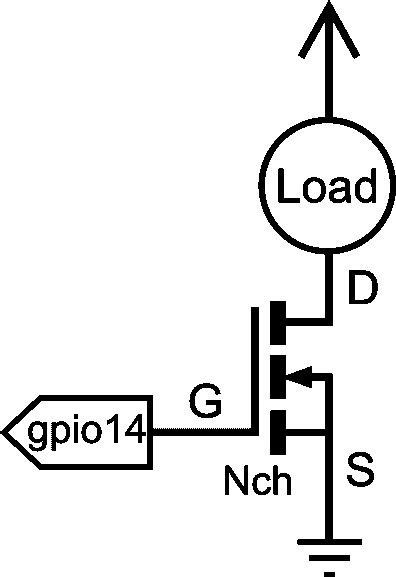
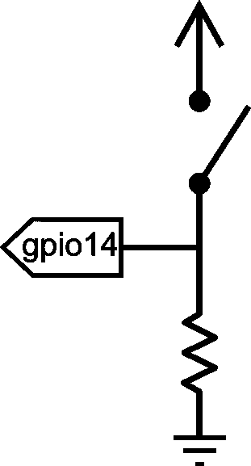
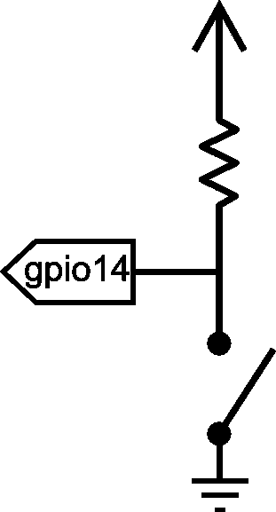

# 英特尔 Edison - Pi 模块的 SparkFun 模块

> 原文：<https://learn.sparkfun.com/tutorials/sparkfun-blocks-for-intel-edison---pi-block>

## 介绍

[Pi 模块](https://www.sparkfun.com/products/13044)中断，并对英特尔 Edison 的几个 GPIO 引脚进行电平转换。它以与 Raspberry Pi Model B 相同的配置呈现它们。

[](https://cdn.sparkfun.com/assets/learn_tutorials/4/1/2/13044-01.jpg)*Pi Block*

### 推荐阅读

如果你不熟悉积木，看看英特尔爱迪生的[spark fun 积木通用指南。](https://learn.sparkfun.com/tutorials/general-guide-to-sparkfun-blocks-for-intel-edison)

其他可能对您的爱迪生之旅有所帮助的教程包括:

*   [爱迪生入门指南](/tutorials/edison-getting-started-guide)
*   [逻辑电平](/tutorials/62)

## 主板概述

[](https://cdn.sparkfun.com/assets/learn_tutorials/4/1/2/Pi_Block_annotated.png)*Pi Block Functional Diagram*

*   USB 电源-用于向 Pi 模块提供 5V 电压，并为 Edison 供电。请注意，数据线没有连接到爱迪生。

*   电源按钮-电源开关连接到爱迪生的“PWRBTN”线上。这使用户能够将 Edison 置于睡眠状态或完全关闭模块。这不影响堆栈中其他模块的电源。

*   电源 LED -当 VSYS 通电时，电源 LED 会亮起。这可能来自板载 USB 电源或堆栈中的任何其他供电模块。

*   扩展接头-70 针扩展接头发挥了英特尔 Edison 的功能。该头部还在整个电池组中传递信号和电力。这些功能很像一个 Arduino 盾牌。

*   LED 跳线-如果功耗是一个问题，请切断此跳线以禁用电源 LED。

*   VSYS 跳线-默认情况下，USB 电缆必须连接到 USB 电源端口，以便为 RPi B 接头上的 5V 引脚供电。您可以从另一个模块(如[基本模块](https://www.sparkfun.com/products/13045))为 Edison 和 Pi 模块供电，但标有“5V”的引脚上不会有 5V 电压。通过闭合此跳线，您可以从另一个模块为 Edison 和 Pi 模块供电，大约 4.2V (VSYS)将出现在标有“5V”的引脚上。

*   RPi B 接头-与旧的[Raspberry Pi B 型引脚排列](http://elinux.org/RPi_Low-level_peripherals#Model_A_and_B_.28Original.29)相同的配置。

## 使用 Pi 块

要使用 Pi 模块，请在主板背面安装一个 Intel Edison，或者将其添加到当前堆栈中。块可以在没有硬件的情况下堆叠，但是这使得扩展连接器不受机械应力的保护。

[](https://cdn.sparkfun.com/assets/learn_tutorials/4/1/2/Pi_Block_Tutorial-01.jpg)*Edison installed on Pi Block*

我们有一个很好的[硬件包](https://www.sparkfun.com/products/13187)可以提供足够的硬件来保护三个街区和一个爱迪生。

[](https://cdn.sparkfun.com/assets/learn_tutorials/2/8/6/EdisonHardware_1.jpg)[*Intel Edison Hardware Pack*](https://www.sparkfun.com/products/13187)**NOTE:** It is recommended to use a console communication block in conjunction with this block like ones found in the [General Guide to Sparkfun Blocks for Intel Edison](https://learn.sparkfun.com/tutorials/general-guide-to-sparkfun-blocks-for-intel-edison#console-communication-blocks). Once you have the Edison configured, you can remove the console communication block, power the Edison from the Pi Block, and [SSH into the Edison](https://learn.sparkfun.com/tutorials/edison-getting-started-guide#ssh-ing-into-the-edison).

您可以将接头放在爱迪生一侧，这样您就可以方便地接触到引脚标签。请注意，此引脚排列是从 Raspberry Pi 型引脚排列镜像而来。

[](https://cdn.sparkfun.com/assets/learn_tutorials/4/1/2/Pi_Block_Tutorial-02.jpg)*Headers on Edison side*

或者，您可以用标题填充 Pi 块的背面。这种方法提供了与树莓 Pi 型号 b 相同的引脚排列。理论上，您可以在现有项目中将 Edison 换成您的树莓 Pi，或者使用树莓 Pi 附件(例如 [Pi 楔](https://www.sparkfun.com/products/13091))。

[](https://cdn.sparkfun.com/assets/learn_tutorials/4/1/2/Pi_Block_Tutorial-03.jpg)*Or put headers on the back side of Pi Block*

### 使用 Pi 模块作为输出设备

如果您想要使用 Pi 模块来控制高功率 led 或继电器，则需要一个外部晶体管或 MOSFET。可以直接从电平转换器点亮小 LED。它可能不太亮，因为 TXB0108 电平转换器的电流输出非常低(~5ma)。

[](https://cdn.sparkfun.com/assets/learn_tutorials/2/8/6/GPIOLoadDiagram.png)*Connection Diagram for Load (LED, Motor, or Relay)*

在终端中，我们将演示如何激活和使用 GPIO 引脚作为输出。

首先导航到 Edison 上的 GPIO 目录。

```
cd /sys/class/gpio 
```

选择要启用的 GPIO 引脚。在这种情况下，我们使用 GPIO 14，它在 Pi 模块上标记为“GP14”。

```
echo 14 > export 
```

导航到新创建的 GPIO 目录。

```
cd gpio14 
```

如果你输入“ls”，你应该会看到一堆变量。

```
active_low  direction   power       uevent
device      edge        subsystem   value 
```

让我们将端口的“方向”设置为输出

```
echo out > direction 
```

为了证实这一点，我们将“猫”的价值

```
cat direction 
```

您应该在命令行中看到“out”。现在，设备被配置为输出。“值”是设置引脚状态的位置，1 表示高电平，0 表示低电平。

```
echo 1 > value 
```

使用万用表、小型 led 或示波器进行测试，您应该会在 gpio14 上看到“高”状态(3.3V)。

### 使用 Pi 块作为输入设备

如果希望 Pi 模块读取开关、按钮或其它逻辑电平输入，必须注意上拉和下拉电阻。船上的电平转换器很弱。下面解释两种情况:

[](https://cdn.sparkfun.com/assets/learn_tutorials/2/8/6/ActiveHighCircuit.png)*Connection Diagram for Active High Push Button*[](https://cdn.sparkfun.com/assets/learn_tutorials/2/8/6/ActiveLowCircuit.png)*Connection Diagram for Active Low Push Button*

在终端中，我们将演示如何激活和使用 GPIO 引脚作为配置为高电平有效的输入。

首先，导航到 Edison 上的 GPIO 目录。

```
cd /sys/class/gpio 
```

选择要启用的 GPIO 引脚。在这种情况下，让我们使用 GPIO 14。

```
echo 14 > export 
```

导航到新创建的 GPIO 目录。

```
cd gpio14 
```

如果你输入“ls”，你应该会看到一堆变量。

```
active_low  direction   power       uevent
device      edge        subsystem   value 
```

让我们将端口的“方向”设置为输出。

```
echo in > direction 
```

为了证实这一点，我们将“猫”的价值。

```
cat direction 
```

您应该在命令行中看到“in”。现在，设备被配置为输入。“值”是设置引脚状态的位置，1 表示高电平，0 表示低电平。

```
cat value 
```

按下按钮后，您应该会看到 1。当按钮未按下时，您应该会看到 0。使用向上箭头，您可以调用以前运行的命令。

## C++示例

我们假设您正在使用 Eclipse IDE，详见我们的[超越 Arduino](https://learn.sparkfun.com/tutorials/programming-the-intel-edison-beyond-the-arduino-ide) 教程。如果你不是，你需要去那个教程来加快速度。

#### 硬件连接

对这个库的硬件支持很简单；一个[基本红色发光二极管](https://www.sparkfun.com/products/9590)和一个[瞬时按钮](https://www.sparkfun.com/products/97)。我们使用一个 [2N3904 NPN 晶体管](https://www.sparkfun.com/products/521)来驱动 LED，但是，由于 Pi 模块上输出的驱动强度非常弱。如图所示，您还需要几个[1kω电阻](https://www.sparkfun.com/products/8980)和一个[330ω电阻](https://www.sparkfun.com/products/8377)。

[](https://cdn.sparkfun.com/assets/learn_tutorials/4/1/2/Pi_Block_Hookup_bba.png)

虽然我们在本例中使用了 GPIO45 和 GPIO46，但该代码可以用于 Pi 分线点上的任何引脚。GPIO 到 MRAA 引脚映射可以在[资源和后续章节](https://learn.sparkfun.com/tutorials/sparkfun-blocks-for-intel-edison---pi-block#resources-and-going-further)中找到。

#### 密码

按照[编程教程](https://learn.sparkfun.com/tutorials/programming-the-intel-edison-beyond-the-arduino-ide#hello-world)中的说明创建一个名为“SparkFun_Pi_Block_Example”的新项目。创建项目后，打开“SparkFun_Pi_Block_Example.cpp”文件，用下面的代码块替换所有现有代码。

```
language:c
  /****************************************************************
  Example file for SparkFun Pi Block Support

  14 Jul 2015- Mike Hord, SparkFun Electronics
  Code developed in Intel's Eclipse IOT-DK

  Modified on July 30, 2015 by Shawn Hymel, SparkFun Electronics

  This code requires the Intel mraa library to function; for more
  information see https://github.com/intel-iot-devkit/mraa

  This code is beerware; if you use it, please buy me (or any other
  SparkFun employee) a cold beverage next time you run into one of
  us at the local.
  ****************************************************************/

#include "mraa.hpp"

#include <iostream>
#include <unistd.h>

using namespace mraa;
using namespace std;

int main()
{

  // Oddly, GPIO pin assignment numbers when using the MRAA libraries are not
  //  the same as those inside the operating system. Thus, while we're using
  //  pin 46 as far as the OS is concerned to drive the LED, we're using pin 32
  //  as far as MRAA is concerned. The cheat sheet for that can be found here:
  //  https://github.com/intel-iot-devkit/mraa/blob/master/docs/edison.md
  Gpio LEDPin(45);
  LEDPin.dir(DIR_OUT);

  // Now do a quick little flicker.
  LEDPin.write(0);
  usleep(100000);
  LEDPin.write(1);
  usleep(100000);
  LEDPin.write(0);

  // Alternatively, we can declare the pin in "raw" mode, which has a slightly
  //  different and more unwieldy constructor.
  Gpio buttonPin(32, true, true);
  buttonPin.dir(DIR_IN);

  // In this infinite loop, we'll blink the LED once whenever someone presses
  //  the button.
  while (1)
  {
    // We *know* that if the IO pin reads as 0, or is low, read() returns zero.
    //  However, if it's high, it *may* return something else; the only guarantee
    //  is that it will be nonzero. Thus, don't test to see if a read() returned
    //  a 1!!!
    if (buttonPin.read() == 0)
    {
      LEDPin.write(1);
      sleep(1);
      LEDPin.write(0);
      sleep(1);
    }
  }

  return MRAA_SUCCESS;
} 
```

#### 其他示例

因为这个模块只是一个 GPIO 访问设备，所以现有的 MRAA GPIO 示例可以与它一起使用。

[](https://cdn.sparkfun.com/assets/learn_tutorials/4/0/4/examples.png)

当您在 Eclipse IDE 中创建新项目时，它将为您提供几个启动项目的选项。上面提到的其中一些就是使用 MRAA GPIO 函数的好例子。然而，它们比我们在这里提供的更复杂。

有关 GPIO 引脚的 C++ API 的完整文档，请访问[MRAA 官方文档](http://iotdk.intel.com/docs/master/mraa/)。

## 资源和更进一步

### 大头针地图

您可能已经注意到，我们在硬件中使用 GP46，在示例代码中使用 GPIO 32。这是因为 MRAA 图书馆使用不同的号码。如果您想使用 MRAA 来控制硬件，请在下表中找出您计划使用的 GPIO 引脚(标有“Edison 引脚”)，然后在软件中使用 MRAA 号。

Pi 模块上可用的引脚在表格中以黄色突出显示。

**备注:**

*   Pi 模块上的输入/输出电压为 3.3V
*   默认情况下，GPIO 模块的输入/输出电压为 3.3V
*   Arduino 分线点上的输入/输出电压为 5V
*   迷你试验板上的输入/输出电压为 1.8V

*基于[英特尔 IOT 开发套件库](https://github.com/intel-iot-devkit/mraa/blob/master/docs/edison.md)的 MRAA 引脚映射表*

| 爱迪生引脚(Linux) | Arduino 突破 | 迷你突破 | MRAA 数 | Pinmode0 | 引脚模式 1 | 引脚模式 2 |
| --- | --- | --- | --- | --- | --- | --- |
| GP12 | three | J18-7 | Twenty | GPIO-12 | PWM0 |  |
| GP13 | five | J18-1 | Fourteen | GPIO-13 | PWM1 |  |
| GP14 | A4 号 | J19-9 | Thirty-six | GPIO-14 |  |  |
| GP15 |  | J20-7 | Forty-eight | GPIO-15 |  |  |
| GP19 |  | J18-6 | Nineteen | GPIO-19 | I2C 一 SCL |  |
| GP20 |  | J17-8 | seven | GPIO-20 | I2C-1-SDA |  |
| GP27 |  | J17-7 | six | GPIO-27 | I2C-6-SCL 的缩写 |  |
| GP28 |  | J17-9 | eight | GPIO-28 | I2C-6-SDA |  |
| GP40 | Thirteen | J19-10 | Thirty-seven | GPIO-40 | SSP2 |  |
| GP41 | Ten | J20-10 | Fifty-one | GPIO-41 | SSP2_FS |  |
| GP42 | Twelve | J20-9 | Fifty | GPIO-42 | SSP2 |  |
| GP43 | Eleven | J19-11 | Thirty-eight | GPIO-43 | SSP2 |  |
| GP44 | A0 | J19-4 | Thirty-one | GPIO-44 |  |  |
| GP45 | 一流的 | J20-4 | Forty-five | GPIO-45 |  |  |
| GP46 | 主动脉第二声 | J19-5 | Thirty-two | GPIO-46 |  |  |
| GP47 | A3 号 | J20-5 | Forty-six | GPIO-47 |  |  |
| GP48 | seven | J19-6 | Thirty-three | GPIO-48 |  |  |
| GP49 | eight | J20-6 | Forty-seven | GPIO-49 |  |  |
| GP77 |  | J19-12 | Thirty-nine | GPIO-77 | 南达科他州 |  |
| GP78 |  | J20-11 | fifty-two | GPIO-78 | 南达科他州 |  |
| GP79 |  | J20-12 | Fifty-three | GPIO-79 | 南达科他州 |  |
| GP80 |  | J20-13 | Fifty-four | GPIO-80 | 南达科他州 |  |
| GP81 |  | J20-14 | Fifty-five | GPIO-81 | 南达科他州 |  |
| GP82 |  | J19-13 | Forty | GPIO-82 | 南达科他州 |  |
| GP83 |  | J19-14 | Forty-one | GPIO-83 | 南达科他州 |  |
| GP84 |  | J20-8 | forty-nine | GPIO-84 | 南达科他州 |  |
| GP109 |  | J17-11 | Ten | 通用输入输出接口 109 | SPI-5-SCK |  |
| GP110 |  | J18-10 | Twenty-three | 通用输入输出接口 110 | SPI-5-CS0 |  |
| GP111 |  | J17-10 | nine | 通用输入输出接口 111 | SPI-5-CS1 |  |
| GP114 |  | J18-11 | Twenty-four | GPIO-114 | SPI-5-MISO |  |
| GP115 |  | J17-12 | Eleven | GPIO-115 | SPI-5-MOSI |  |
| GP128 | Two | J17-14 | Thirteen | GPIO-128 | UART-1-CTS |  |
| GP129 | four | J18-12 | Twenty-five | GPIO-129 | UART-1-RTS |  |
| GP130 | Zero | J18-13 | Twenty-six | GPIO-130 | UART-1-RX |  |
| GP131 | one | J19-8 | Thirty-five | GPIO-131 | UART-1-TX |  |
| GP134 |  | J20-3 | forty-four |  |  |  |
| GP135 |  | J17-5 | four | GPIO-135 | 通用非同步收发传输器(Universal Asynchronous Receiver/Transmitter) |  |
| GP165 | A5 号 | J18-2 | Fifteen | GPIO-165 |  |  |
| GP182 | six | J17-1 | Zero | GPIO-182 | PWM2 |  |
| GP183 | nine | J18-8 | Twenty-one | GPIO-183 | PWM3 |  |

### 爱迪生通用主题:

*   [英特尔爱迪生 Sparkfun 模块通用指南](https://learn.sparkfun.com/tutorials/general-guide-to-sparkfun-blocks-for-intel-edison)
*   [Edison 入门指南-使用 Arduino 编程](https://learn.sparkfun.com/tutorials/edison-getting-started-guide)
*   [在 Edison 上加载 Debian(Ubilinix)](https://learn.sparkfun.com/tutorials/loading-debian-ubilinux-on-the-edison)

### 阻止特定主题:

*   [Pi Block Github repo](https://github.com/sparkfun/Edison_Pi_Block)

查看 SparkFun 的其他爱迪生相关教程:

[](https://learn.sparkfun.com/tutorials/sparkfun-blocks-for-intel-edison---uart-block) [### 英特尔 Edison - UART 模块的 SparkFun 模块](https://learn.sparkfun.com/tutorials/sparkfun-blocks-for-intel-edison---uart-block) A quick overview of the features of the UART Block.[Favorited Favorite](# "Add to favorites") 1[](https://learn.sparkfun.com/tutorials/sparkfun-blocks-for-intel-edison---i2c-breakout-block) [### 英特尔爱迪生 I2C 分线块的火花块](https://learn.sparkfun.com/tutorials/sparkfun-blocks-for-intel-edison---i2c-breakout-block) A quick overview of the features of the I2C Breakout Block.[Favorited Favorite](# "Add to favorites") 2[](https://learn.sparkfun.com/tutorials/general-guide-to-sparkfun-blocks-for-intel-edison) [### 英特尔 Edison spark fun 模块通用指南](https://learn.sparkfun.com/tutorials/general-guide-to-sparkfun-blocks-for-intel-edison) A general guide for using SparkFun Blocks for Intel® Edison in your next project 5[](https://learn.sparkfun.com/tutorials/sparkfun-inventors-kit-for-edison-experiment-guide) [### 爱迪生实验指南](https://learn.sparkfun.com/tutorials/sparkfun-inventors-kit-for-edison-experiment-guide) Learn how to harness the power of the Intel® Edison using JavaScript to post data to the cloud, control electronics from smartphones, and host web pages that interact with circuits.[Favorited Favorite](# "Add to favorites") 4