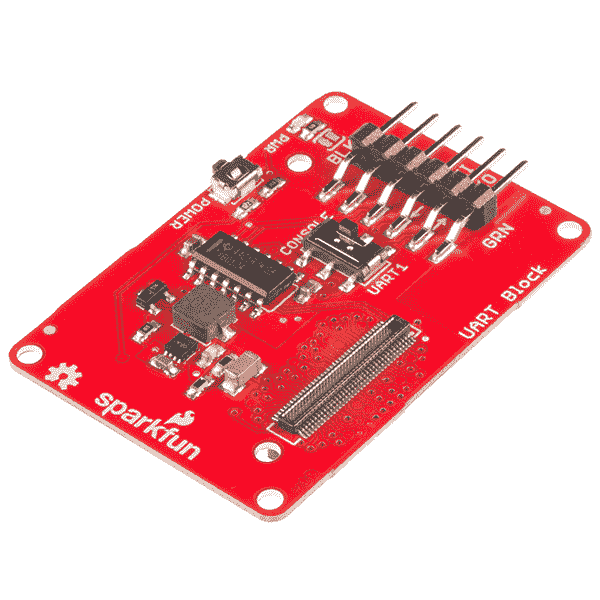
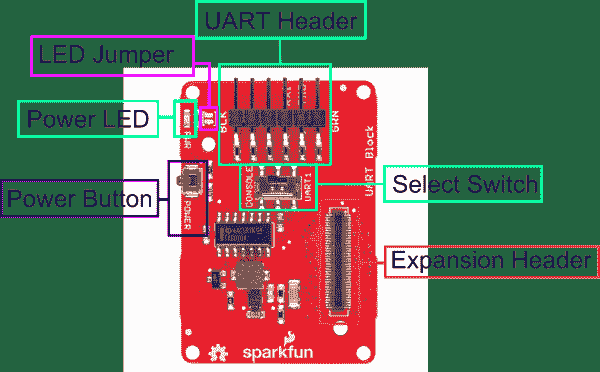
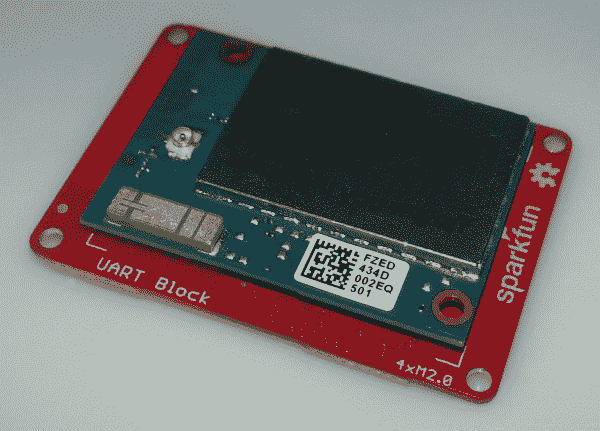
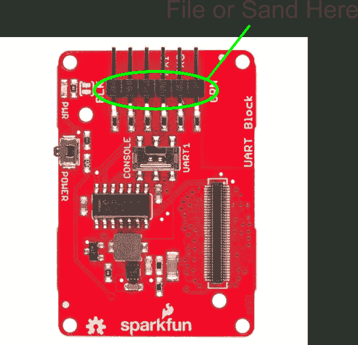
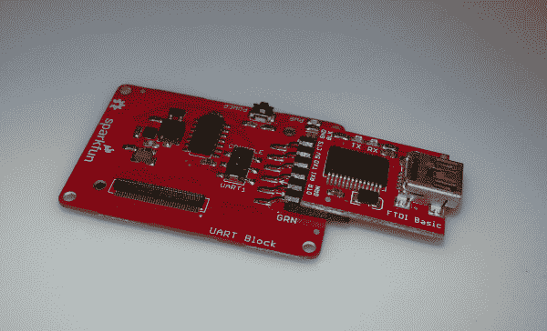

# 英特尔 Edison - UART 模块的 SparkFun 模块

> 原文：<https://learn.sparkfun.com/tutorials/sparkfun-blocks-for-intel-edison---uart-block>

## 介绍

[UART 模块](https://www.sparkfun.com/products/13040)为控制台端口或第二 UART 端口提供电平转换接口。当 USB 不是一个选项时，这是一个伟大的解决方案。这允许 Edison 模块通过提供受保护的信号接口与传统硬件接口。使用 [RS232 转换器](https://www.sparkfun.com/products/449)，可以将 Edison 连接到老式自动化设备和仪器中常见的 RS232 设备。UART 模块与 5V 兼容 FTDI 设备配对，如我们的 [FTDI 基本分线点](https://www.sparkfun.com/products/9716)，将为 Edison 堆栈供电。

*UART Block*

### 推荐阅读

如果你不熟悉积木，看看英特尔爱迪生的[spark fun 积木通用指南。](https://learn.sparkfun.com/tutorials/general-guide-to-sparkfun-blocks-for-intel-edison)

其他可能对您的爱迪生之旅有所帮助的教程包括:

*   [串行通信](https://learn.sparkfun.com/tutorials/serial-communication)
*   [如何安装 FTDI 驱动](https://learn.sparkfun.com/tutorials/how-to-install-ftdi-drivers)
*   [串行终端基础知识](https://learn.sparkfun.com/tutorials/terminal-basics)
*   [为您的项目提供动力](https://learn.sparkfun.com/tutorials/how-to-power-a-project)
*   [连接器基础知识](https://learn.sparkfun.com/tutorials/connector-basics)

## 主板概述

*UART Block Functional Diagram*

*   UART 报头-标准 FTDI 报头，包括 RX、TX、VCC 和 GND。

*   选择开关-在控制台(UART2)和 UART1 之间选择

*   电源按钮-电源开关连接到爱迪生的“PWRBTN”线上。这使用户能够将 Edison 置于睡眠状态或完全关闭模块。这不影响堆栈中其他模块的电源。

*   电源 LED -当 VSYS 通电时，电源 LED 会亮起。这可能来自控制台模块，或堆栈中的任何其他供电模块。

*   LED 跳线-如果功耗是一个问题，切断每个跳线禁用 LED

*   扩展接头-70 针扩展接头发挥了英特尔 Edison 的功能。该头部还在整个电池组中传递信号和电力。这些功能很像一个 Arduino 盾牌。

## 使用 UART 模块

要使用 UART 模块，请在主板背面安装一个 Intel Edison，或者将其添加到您当前的堆栈中。块可以在没有硬件的情况下堆叠，但是这使得扩展连接器不受机械应力的保护。

*UART Block Installed*

我们有一个很好的[硬件包](https://www.sparkfun.com/products/13187)可以提供足够的硬件来保护三个街区和一个爱迪生。

[*Intel Edison Hardware Pack*](https://www.sparkfun.com/products/13187)

### 使用堆栈中间的块

如果需要在堆栈中间使用 UART 模块，可能需要锉平或打磨 FTDI 连接器。连接器略大于扩展连接器允许的 3 毫米间隙。用户最好将该块放在堆栈的底部。

*File or Sand the Connector Here*

### 使用带 FTDI 附件的模块。

UART 模块可以与我们的 [5V FTDI Basic](https://www.sparkfun.com/products/9716) 一起使用。

*FTDI 5V Basic Installed*

### 连接到控制台

将硬件连接到所选的 UART ->串行设备后，将设备的 USB 端插入计算机的 USB 端口。如果您目前没有安装 FTDI 驱动程序，您需要在使用 Edison 之前下载并安装它们。访问我们的[教程](https://learn.sparkfun.com/tutorials/how-to-install-ftdi-drivers)获取如何安装驱动程序的说明。确保驱动程序已安装且设备正在运行后，打开您最喜欢的终端程序，并将其指向 USB 串行连接。我们还有另一个教程来解释[终端程序以及如何使用它们](https://learn.sparkfun.com/tutorials/terminal-basics)。

标准波特率为 115200bps。

一旦终端被激活，你就可以开始探索了！

### 使用电源按钮

Edison 上的电源按钮带来了一个在单板计算机上通常找不到的独特功能。电源按钮的行为与台式机和笔记本电脑上的电源按钮非常相似。

*   通电时，按住电源按钮约 10 秒钟将关闭 Edison。
*   断电时，短暂按下电源按钮将重启 Edison。
*   通电时，短暂按下电源按钮会将 Edison 置于睡眠模式。
*   在睡眠模式下，短按电源按钮会唤醒爱迪生。

## 资源和更进一步

现在，您已经对 UART 模块有了一个简单的概述，让我们来看看其他一些教程。这些教程涵盖编程、模块堆叠以及与英特尔 Edison 生态系统的接口。

## 爱迪生通用主题:

*   [英特尔爱迪生 Sparkfun 模块通用指南](https://learn.sparkfun.com/tutorials/general-guide-to-sparkfun-blocks-for-intel-edison)
*   [爱迪生入门指南](https://learn.sparkfun.com/tutorials/edison-getting-started-guide)
*   [在 Edison 上加载 Debian(Ubilinix)](https://learn.sparkfun.com/tutorials/loading-debian-ubilinux-on-the-edison)

## 阻止特定主题:

*   [如何安装 FTDI 驱动](https://learn.sparkfun.com/tutorials/how-to-install-ftdi-drivers)
*   [UART 块 Git Repo](https://github.com/sparkfun/Edison_UART_Block)

查看 SparkFun 的其他爱迪生相关教程:

 [### 英特尔 Edison - microSD 模块的 SparkFun 模块](https://learn.sparkfun.com/tutorials/sparkfun-blocks-for-intel-edison---microsd-block) A quick overview of the features of the microSD Block.[Favorited Favorite](# "Add to favorites") 2 [### 在 Edison 上加载 Debian (Ubilinux)](https://learn.sparkfun.com/tutorials/loading-debian-ubilinux-on-the-edison) How to load a Debian distribution (specifically Ubilinux) onto the Edison.[Favorited Favorite](# "Add to favorites") 5 [### 交互式智能镜子](https://learn.sparkfun.com/tutorials/interactive-smart-mirror) Build a smart mirror that displays weather data using the Intel® Edison.[Favorited Favorite](# "Add to favorites") 24 [### Sparcade: Edison 作为浏览器游戏的网络服务器](https://learn.sparkfun.com/tutorials/sparcade-edison-as-a-web-server-for-browser-games) Turn the Intel® Edison into an access point that serves a simple browser-based game. High scores from the game are displayed on a character LCD.[Favorited Favorite](# "Add to favorites") 2