# SparkFun BME280 分线连接指南

> 原文：<https://learn.sparkfun.com/tutorials/sparkfun-bme280-breakout-hookup-guide>

## 介绍

[BME280 分线板](https://www.sparkfun.com/products/13676)是测量压力和湿度的简单方法，而且不会占用太多空间。它可以轻松焊接 0.1 英寸接头，运行 I2C 或 SPI，测量电流小于 1mA，空载电流小于 5uA(是的，微安！).

[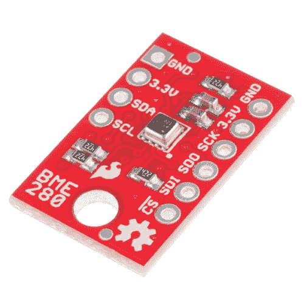](https://www.sparkfun.com/products/13676) 

将**添加到您的[购物车](https://www.sparkfun.com/cart)中！**

### [SparkFun 大气传感器 Breakout - BME280](https://www.sparkfun.com/products/13676)

[In stock](https://learn.sparkfun.com/static/bubbles/ "in stock") SEN-13676

SparkFun BME280 大气传感器插座是测量大气压力、湿度和温度的简单方法

$21.5017[Favorited Favorite](# "Add to favorites") 52[Wish List](# "Add to wish list")****[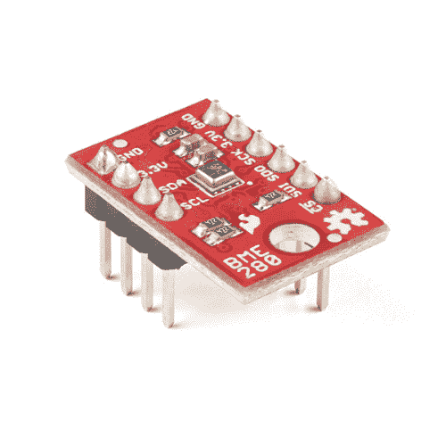](https://www.sparkfun.com/products/13905) 

将**添加到您的[购物车](https://www.sparkfun.com/cart)中！**

### [【spark fun 大气传感器 Breakout - BME280(带表头)](https://www.sparkfun.com/products/13905)

[In stock](https://learn.sparkfun.com/static/bubbles/ "in stock") SEN-13905

SparkFun BME280 大气传感器接头是测量大气压力、湿度和温度的简单方法

$21.95[Favorited Favorite](# "Add to favorites") 6[Wish List](# "Add to wish list")**** ****BME280 可用于获取压力、湿度和温度读数。使用该数据获得相对高度变化，或者如果当地报告的气压已知，获得绝对高度。

范围:

*   温度:-40C 至 85C
*   湿度:0 - 100%相对湿度，在 20-80%范围内=-3%
*   压力:30，000 帕到 110，000 帕，相对精度 12Pa，绝对精度 100Pa
*   高度:0 至 30，000 英尺(9.2 公里)，海平面的相对精度为 3.3 英尺(1 米)，30，000 英尺的相对精度为 6.6 英尺(2 米)。

### 本教程涵盖的内容

本教程为您提供了使用 BME280 所需的一切。首先，我们将看看 IC 和硬件，然后我们将使用 [SparkFun BME280 Arduino 库](https://github.com/sparkfun/SparkFun_BME280_Arduino_Library)通过 SPI 或 I2C 从中获取数据。

本教程分为以下几页:

*   [BME280 硬件概述](https://learn.sparkfun.com/tutorials/sparkfun-bme280-breakout-hookup-guide#hardware-overview) -硬件的基本信息。
*   [组件](https://learn.sparkfun.com/tutorials/sparkfun-bme280-breakout-hookup-guide#assembly) -通过 I2C 或 SPI 连接到 BME280
*   [安装 Arduino 库](https://learn.sparkfun.com/tutorials/sparkfun-bme280-breakout-hookup-guide#i) -如何获取
*   [使用 Arduino 库](https://learn.sparkfun.com/tutorials/sparkfun-bme280-breakout-hookup-guide#fun) -解释用户 API
*   [理论和示例数据](https://learn.sparkfun.com/tutorials/sparkfun-bme280-breakout-hookup-guide#example-sketches) -展示库中包含的示例。
*   [资源和进一步发展](https://learn.sparkfun.com/tutorials/sparkfun-bme280-breakout-hookup-guide#res) -数据手册和应用笔记的链接，以及灵感项目

### 所需材料

立即获取数据手册和应用笔记。保留一份拷贝，以便在你离开规划的路径时参考。

*   [博世 BME280 **数据表**](https://cdn.sparkfun.com/assets/learn_tutorials/4/1/9/BST-BME280_DS001-10.pdf)

本教程介绍了如何将 BME280 分线板与 RedBoard(或 Arduino)配合使用。要跟进，您需要以下材料:

*   [BME280 分线板](https://www.sparkfun.com/products/13676)
*   [Arduino UNO](https://www.sparkfun.com/products/11021) 、 [RedBoard](https://www.sparkfun.com/products/11575) 或另一个 [Arduino 兼容板](https://learn.sparkfun.com/tutorials/arduino-comparison-guide)
*   [直阳接头](https://www.sparkfun.com/products/116) -或电线。用来连接 breakout 和试验板的东西。
*   任何尺寸(即使是迷你)都可以。
*   [M/M 跳线](https://www.sparkfun.com/products/11026) -连接 Arduino 和试验板。
*   [逻辑电平转换器](https://www.sparkfun.com/products/12009) -将 SPI 电平从 5v 转换到 3.3v。

**The BME280 is a 3.3V device!** Supplying voltages greater than ~3.6V can permanently damage the IC. As long as your Arduino has a 3.3V supply output, and you're OK with using I²C, you shouldn't need any extra level shifting. But if you want to use SPI, you may need a [Logic Level Converter](https://www.sparkfun.com/products/12009).

如果你使用基于 3.3V 的微处理器，如 Arduino Pro 3.3V(T1)或 T2 3.3V Pro Mini(T3)，就没有必要进行电平转换。

### 推荐阅读

BME280 的连接使用了我们许多产品共有的一些基本概念。如果您想更熟悉这些基本任务，这些文章可以帮助您。

*   [串行外设接口(SPI)](https://learn.sparkfun.com/tutorials/serial-peripheral-interface-spi)
*   [IC 间通信(I ² C)](https://learn.sparkfun.com/tutorials/i2c)
*   [逻辑电平](https://learn.sparkfun.com/tutorials/logic-levels)
*   [双向变速杆连接指南](https://learn.sparkfun.com/tutorials/bi-directional-logic-level-converter-hookup-guide)

如果压力的概念压在你身上，看看这些链接。

*   [(外部)气压高度计算器](http://www.mide.com/products/slamstick/air-pressure-altitude-calculator.php)——玩一玩，感受一下不同高度的气压。
*   维基百科:大气压(Atmospheric _ pressure)——有一个很好的气压和海拔转换公式(参考图书馆代码)。
*   mpl 3115 a 2-压力传感器-连接-导向-压力-高度计-设置 -困惑为什么读数压力与当地气象站报告的压力不一致？阅读此部分。

## 硬件概述

### 正面

BME280 分线板有 10 个引脚，但一次使用的引脚不超过 6 个。

[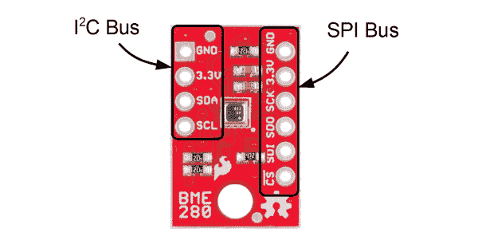](https://cdn.sparkfun.com/assets/learn_tutorials/4/1/9/topside2.png)*Use one header for I2C connections, **or** the other for SPI connections -- no need to use both!*

电路板的左侧是电源、接地和 I ² C 引脚。

| Pin Label | 引脚功能 | 笔记 |
| GND | 地面 | 0V 电源电压。 |
| 3.3v | 电源 | 芯片的电源电压。应在 **1.8V 和 3.6V** 之间调节。 |
| 国家药品监督管理局 | 数据 | I ² C:串行数据(双向) |
| SCL | 串行时钟 | I ² C 串行时钟。 |

其余的引脚在另一侧断开。这些引脚具有 SPI 功能，并有另一个电源和地。

| Pin &标签 | 引脚功能 | 笔记 |
| GND | 地面 | 0V 电源电压。 |
| 3.3v | 电源 | 芯片的电源电压。应在 **1.8V 和 3.6V** 之间调节。 |
| 血清肌酸激酶 | 时钟 | 时钟线，最大 3.6V |
| 合成干性油（synthetic drying oil 的缩写） | 数据输出 | 数据来自 BME280 (MISO) |
| 战略防御计划(Strategic Defence Initiative) | 数据输入 | 数据进入 BME280，最大 3.6V(MOSI) |
| ！特许测量员 | 芯片选择(从机选择) | 低电平有效片选，最大 3.6V |

### 背面

[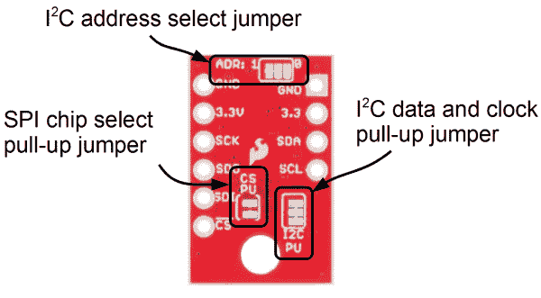](https://cdn.sparkfun.com/assets/learn_tutorials/4/1/9/bottomside.png)

在电路板的另一面，你会发现所有的配置跳线。即使在使用 SPI 模式时，上拉电阻也可以保持连接，因此您可能永远也不会碰到这些器件。如果你有，这是它们的用途。

| 跳线标签 | 跳线功能 | 笔记 |
| ADR: | I ² C 地址 | 通过对走线进行切片并桥接“0”侧，在地址 0x77(默认为“1”侧)和 0x76 之间进行选择。控制最低有效位。 |
| CS PU | SPI 片选上拉电阻 | 将一个 4.7k 电阻连接到 CS 线路，确保它处于高电平空闲状态。可以通过在跳线焊盘之间切片来断开。 |
| I ² C | I ² C 引体向上 | 将 I ² C 上拉电阻连接至 3.3V。如有必要，切断走线将其断开。 |

## 装配

### 连接接头

如果你的电路板没有接头，你需要焊接到 PTH 焊盘上。常规电线可以焊接，但为了获得更具可配置性的试验板体验，您可能需要连接[接头](https://www.sparkfun.com/products/116)。

[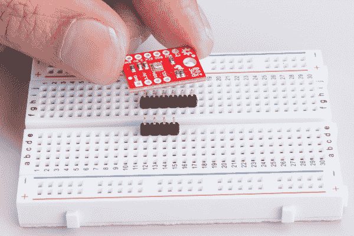](https://cdn.sparkfun.com/assets/learn_tutorials/4/1/9/BME280_Tutorial-01.jpg)*Use a breadboard to align and hold the pins*
[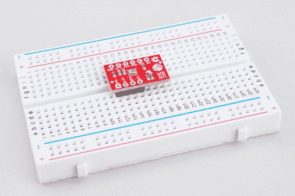](https://cdn.sparkfun.com/assets/learn_tutorials/4/1/9/BME280_Tutorial-02.jpg)*Prepare to solder*
[](https://cdn.sparkfun.com/assets/learn_tutorials/4/1/9/BME280_Tutorial-03.jpg)*Solder on the pins*

| 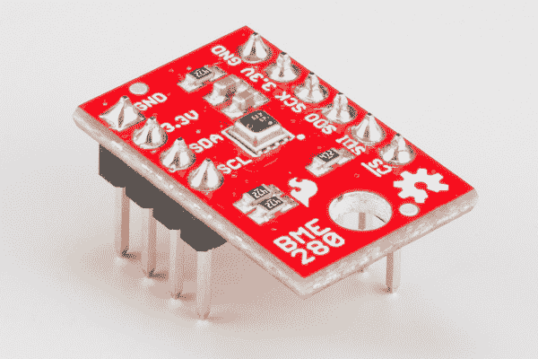 | 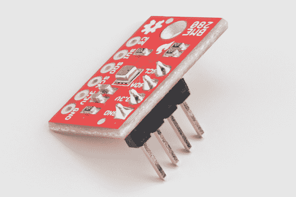 | 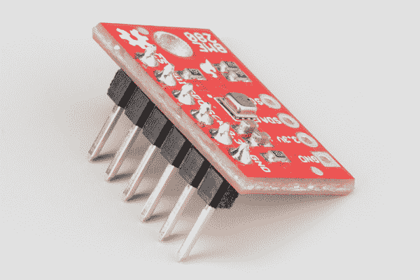 |

*For generic operation solder both headers (left). If you only need I²C (middle), or SPI (right), only attach those headers.*

### I ² C 连接

传感器将 I ² C 线拉至 3.3V，因此它们可以直接连接到 redboard 的 A4/A5 引脚，或 SDA/SCL 引脚(只要它们是通过导线配置的)。确保传感器由 3.3v 供电！电源和接地引脚是连在一起的，所以你只需要连接到一边。

[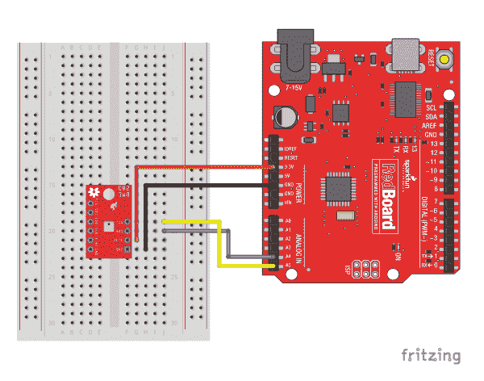](https://cdn.sparkfun.com/assets/learn_tutorials/4/1/9/RedboardI2C_bb.png)*Diagram showing I2C connection to the BME280\. You could also use the dedicated SDA and SCL lines found on most Arduino boards.*

### SPI 连接

当连接到 RedBoard 时，SPI 连接并不简单。[逻辑电平转换器](https://www.sparkfun.com/products/12009)用于桥接 BME280 的 3.3v 要求和 RedBoard 的 5v IO。3.3v 微控制器，如神话般的 [Teensy 3.2](https://www.sparkfun.com/products/13736) 可以直接连接。

[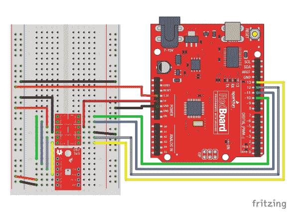](https://cdn.sparkfun.com/assets/learn_tutorials/4/1/9/RedboardSPI_bb.png)*Diagram showing SPI connection to the BME280*

## 安装 Arduino 库

我们创建了一个 Arduino 库，使 BME280 能够与 arduino IDE 兼容的主板一起运行。在我们进入图书馆做什么之前，获得一份它的拷贝。

### 下载 Github 资源库

访问 [GitHub 库](https://github.com/sparkfun/SparkFun_BME280_Arduino_Library/)下载最新版本的库，或者点击下面的链接:

[Download the SparkFun BME280 Arduino Library](https://github.com/sparkfun/SparkFun_BME280_Arduino_Library/archive/master.zip)

### 使用 Arduino IDE 中的库管理器/安装

要获得安装库的帮助，请查看我们的[如何安装 Arduino 库教程](https://learn.sparkfun.com/tutorials/installing-an-arduino-library)。

如果你最终没有使用管理器，你需要将*spark fun _ BME 280 _ Arduino _ Library*文件夹移动到 Arduino sketchbook 中的 *libraries* 文件夹。

## Arduino 库的功能

让我们从设置 BME280 大气传感器的功能开始:

### 班级

在全局作用域中，构造不带参数的传感器对象(如`mySensor`或`pressureSensorA`)。

**T2`BME280 mySensor;`**

#### 对象参数和设置()

不是将一堆数据传递给构造函数，而是通过在`setup()`函数中设置 BME280 类型的值来完成配置。它们通过被`public:`公开，所以使用`myName.aVariable = someValue;`语法。

*BME 280 类的可设置变量:*

```
language:c
//Main Interface and mode settings
uint8_t commInterface;
uint8_t I2CAddress;
uint8_t chipSelectPin;

uint8_t runMode;
uint8_t tStandby;
uint8_t filter;
uint8_t tempOverSample;
uint8_t pressOverSample;
uint8_t humidOverSample; 
```

#### 功能

**`.begin();`**
初始化 BME280 模块的操作步骤如下:

*   默认启动 I ² C 的接线库
*   检查/验证 BME280 芯片 ID
*   读取薪酬数据
*   从表中设置默认设置
*   将操作模式设置为*正常模式*

Output: uint8_t

返回 ID 寄存器中存储的 BME280 芯片 ID。

**.begin() Needs to be run once during the setup**, or after any settings have been modified. In order to let the sensor's configuration take place, the BME280 requires a minimum time of about 2 ms in the sketch before you take data.

**`.beginSPI(uint8_t csPin);`**
开始通过 SPI 连接与 BME280 通信。

Input: uint8_t

**csPin:** 用于 CS 的数字引脚。

Output: Boolean

**真:**连接传感器。
**假:**无法建立连接。

**`.beginI2C(TwoWire &wirePort);`** 或 **`.beginI2C(SoftwareWire &wirePort);`**
通过 I ² C 连接开始与 BME280 通信。如果定义了`#ifdef SoftwareWire_h`，则使用软件 I ² C 连接。

Input: &wirePort

**& wirePort:** 用于 I ² C 连接的端口。

Output: Boolean

**真:**连接传感器。
**假:**无法建立连接。

**`.setMode(uint8_t mode);`**
设置传感器的工作模式。(*详见[数据表](https://cdn.sparkfun.com/assets/e/7/3/b/1/BME280_Datasheet.pdf)第 3.3 节。*)

Input: uint8_t

**0:** 睡眠模式
**1:** 强制模式
**3:** 正常模式

**`.getMode();`**
返回传感器的工作模式。

Output: uint8_t

**0:** 睡眠模式
**1:** 强制模式
**3:** 正常模式

**`.setStandbyTime(uint8_t timeSetting);`**
设定待机时间的循环时间。(*详见[数据表](https://cdn.sparkfun.com/assets/e/7/3/b/1/BME280_Datasheet.pdf)第 3.3 节和表 27。*)

Input: uint8_t

**0:**0.5 ms
**1:**62.5 ms
**2:**125 ms
**3:**250 ms
**4:**500 ms
**5:**1000 ms
**6:**10ms
**7:**20 ms

**`.setFilter(uint8_t filterSetting)`**
设置 IIR 滤波器的时间常数，根据所需的样本数减慢传感器输入的响应时间。(*详见[数据表](https://cdn.sparkfun.com/assets/e/7/3/b/1/BME280_Datasheet.pdf)第 3.4.4 节、表 6 和图 7。*)

Input: uint8_t

**0:** 滤掉
**1:** 系数 2
**2:** 系数 4
**3:** 系数 8
**4:** 系数 16

**`.setTempOverSample(uint8_t overSampleAmount);`**
设置温度测量的过采样选项(`osrs_t`)。(*直接影响数据的噪点和分辨率。*)

Input: uint8_t

**0:** 关闭温度感应
**1:** 过采样×1
**2:** 过采样×2
**4:** 过采样×4
**8:** 过采样×8
**16:** 过采样×16
**其他:**输入错误，默认设置为*过采样×1* 。

**Note:** Yes, we do know there is a spelling error in the name of the method. It will get corrected in the next library update.

**`.setPressureOverSample(uint8_t overSampleAmount);`**
设置压力测量的过采样选项(`osrs_p`)。(*直接影响数据的噪点和分辨率。*)

Input: uint8_t

**0:** 关闭压力感应
**1:** 过采样×1
**2:** 过采样×2
**4:** 过采样×4
**8:** 过采样×8
**16:** 过采样×16
**其他:**输入错误，默认设置为*过采样×1* 。

**`.setHumidityOverSample(uint8_t overSampleAmount);`**
设置湿度测量的过采样选项(`osrs_h`)。(*直接影响数据的噪声。*)

Input: uint8_t

**0:** 关闭湿度感应
**1:** 过采样×1
**2:** 过采样×2
**4:** 过采样×4
**8:** 过采样×8
**16:** 过采样×16
**其他:**输入错误，默认设置为*过采样×1* 。

**`.setI2CAddress(uint8_t address);`**
改变存储在库中的 I ² C 地址来访问传感器。

Input: uint8_t

**地址:**新 I ² C 地址。

**`.isMeasuring();`**
检查`status`寄存器的`measuring`位，查看设备是否正在进行测量。

Output: Boolean

**真:**转换正在运行。
**假:**结果已经传送到数据寄存器。

**`.reset();`**
软复位传感器。(*如果调用，在再次使用传感器之前必须调用 begin 函数。*)

**`.readFloatPressure();`**
读取寄存器中存储的原始压力数据，并应用输出补偿(*有关数据补偿的更多详细信息，请参见[数据表](https://cdn.sparkfun.com/assets/e/7/3/b/1/BME280_Datasheet.pdf)的第 4.2 节。*)

Output: float

返回压力，单位为 Pa。

**`.readFloatHumidity();`**
读取存储在寄存器中的原始湿度数据，并应用输出补偿(*有关数据补偿的更多详情，请参见[数据表](https://cdn.sparkfun.com/assets/e/7/3/b/1/BME280_Datasheet.pdf)的第 4.2 节。*)

Output: float

以%RH 返回湿度。

**`.readTempC();`**
读取存储在寄存器中的原始温度数据，并应用输出补偿(*有关数据补偿的更多详情，请参见[数据表](https://cdn.sparkfun.com/assets/e/7/3/b/1/BME280_Datasheet.pdf)的第 4.2 节。*)

Output: float

返回摄氏温度。

**`.readTempF();`**
读取存储在寄存器中的原始温度数据，并应用输出补偿(*有关数据补偿的更多详情，请参见[数据表](https://cdn.sparkfun.com/assets/e/7/3/b/1/BME280_Datasheet.pdf)的第 4.2 节。*)

Output: float

返回华氏温度。

## 示例草图

这些示例可以从 Arduino IDE 的下拉菜单中选择，或者如果您将 libraries /src 目录的内容与 example.ino 文件放在一起，它们将独立运行。

Note, the library has been updated to [v2.0.0](https://github.com/sparkfun/SparkFun_BME280_Arduino_Library/tree/V_2.0.0) since this guide was written. Nearly all of the examples now default to **9600 Baud**.

### I2C 和 SPI 多传感器

本例将一个 BME280 配置在 SPI 总线上，另一个配置在 I2C 总线上。然后它每秒从两个传感器获取数据和输出。如果您只连接了一个传感器，则另一个通道会报告垃圾，因此这是一个很好的故障排除和起点。

[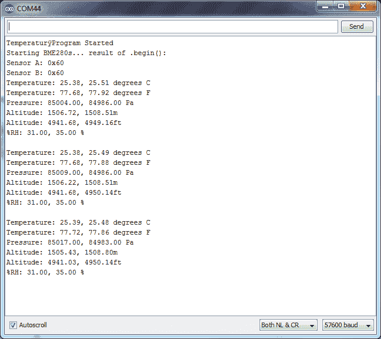](https://cdn.sparkfun.com/assets/learn_tutorials/4/1/9/I2C_SPI_multi_output.png)*Example output -- shown is the configuration plus the first 3 sample readings*

### CSVOutput.ino

如果您想使用 BME280 来记录作为时间函数的数据，这个例子就是为您准备的！它以 CSV(逗号分隔值)格式输出文本，可以复制粘贴到文本文件或电子表格应用程序中进行绘图。

关于准确性的说明:这个草图使用“延迟(50)；”读取之间等待 50 毫秒。“样本”列的单位是(50 毫秒+读取时间)周期。

[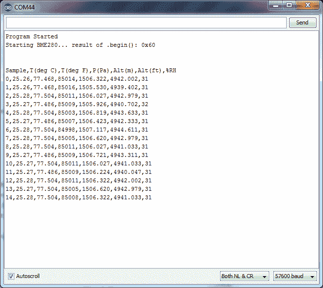](https://cdn.sparkfun.com/assets/learn_tutorials/4/1/9/CSV_output.png)*Example output -- Shows the first few lines of the generated CSV.*

为了演示操作，BME280 与细连接线相连，然后放入瓶中，用呼吸加压。

[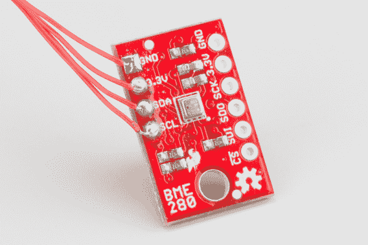](https://cdn.sparkfun.com/assets/learn_tutorials/4/1/9/BME280_Tutorial-08.jpg)[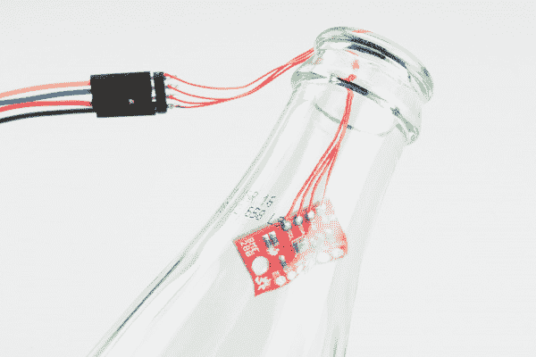](https://cdn.sparkfun.com/assets/learn_tutorials/4/1/9/bottle.jpg)*The environmental test chamber! IT'S SCIENCE!*

从事件中收集数据，然后制作图表。为此，删除了不需要的列，并将压力换算为 kPa。

[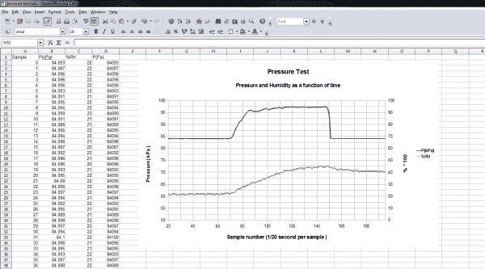](https://cdn.sparkfun.com/assets/learn_tutorials/4/1/9/CSV_graph.png)*Example graph of pressure and humidity - shown after the data was loaded into OpenOffice Calc*

### ReadAllRegisters.ino

这是一个打印出寄存器和内部级联校准字的示例。它可用于检查 BME280 在特定配置后的状态，也可植入您自己需要调试的草图中。

[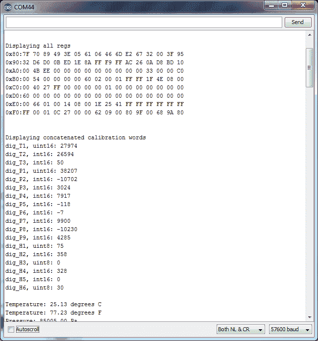](https://cdn.sparkfun.com/assets/learn_tutorials/4/1/9/readall_output.png)*Example output -- shows the full contents of memory, even those not specified in the datasheet*

### 相对论性变化。no

这个例子允许你测量高度的变化。它以大量过采样配置 BME280，并使用软件滤波器提供精确但缓慢的性能。

草图使用一个附加按钮来调零高度。按住不放，直到平均值为零。

[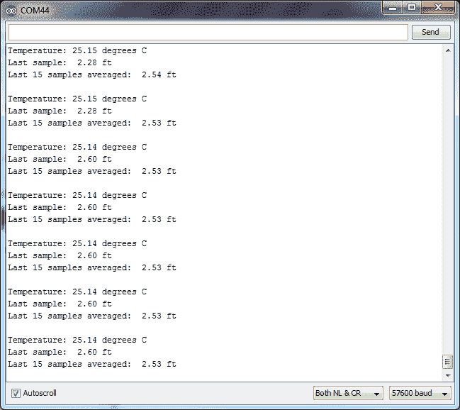](https://cdn.sparkfun.com/assets/learn_tutorials/4/1/9/delta_output2.png)*After the sensor was zeroed out on the floor and moved to a desk hight, the output displays the rough height of the desk!*

### 产品视频草图

该库在 examples 文件夹中还有一个名为“More_Advanced”的子文件夹，其中包含产品视频中使用的草图。它们是在基本例子的基础上增加了一个液晶显示器。它们不在本教程的讨论范围内。

## 资源和更进一步

### 资源

*   BME280 产品 GitHub 库-BME 280 所有内容的版本控制源。在这里，您可以找到我们最新的硬件布局和文档。
*   [SparkFun BME280 Arduino 库 GitHub 库](https://github.com/sparkfun/SparkFun_BME280_Arduino_Library) -在这里找到最新的 Arduino 库和示例。
*   [博世 BME280 数据表](https://cdn.sparkfun.com/assets/learn_tutorials/4/1/9/BST-BME280_DS001-10.pdf) -该数据表涵盖了一个方便文档中的所有内容。

### 更进一步

希望本指南已经让您的 BME280 投入使用。会变成什么样？天气监测？四轴飞行器上的飞行控制？玻璃容器气候控制？

为了让你思考，这里有几篇文章可以浏览。

*   [白山的天气气球](https://www.sparkfun.com/news/1285)
*   [SparkFun 数据服务](https://www.sparkfun.com/news/1527)
*   [Enginursday:这些不是你要找的无人机](https://www.sparkfun.com/news/1600)

让我们知道你的 BME280 变成了什么！

看看这些其他伟大的天气相关教程。

[](https://learn.sparkfun.com/tutorials/sparkfun-inventors-kit-for-photon-experiment-guide) [### 光子实验指南](https://learn.sparkfun.com/tutorials/sparkfun-inventors-kit-for-photon-experiment-guide) Dive into the world of the Internet of Things with the SparkFun Inventor's Kit for Photon.[Favorited Favorite](# "Add to favorites") 14[](https://learn.sparkfun.com/tutorials/photon-remote-temperature-sensor) [### 光子远程温度传感器](https://learn.sparkfun.com/tutorials/photon-remote-temperature-sensor) Learn how to build your own Internet-connect, solar-powered temperature collection station using the Photon from Particle.[Favorited Favorite](# "Add to favorites") 11[](https://learn.sparkfun.com/tutorials/hih-4030-humidity-sensor-hookup-guide) [### HIH-4030 湿度传感器连接指南](https://learn.sparkfun.com/tutorials/hih-4030-humidity-sensor-hookup-guide) Measure relative humidity with SparkFun's HIH-4030 Humidity Sensor Breakout.[Favorited Favorite](# "Add to favorites") 2[](https://learn.sparkfun.com/tutorials/sparkfun-air-quality-sensor---sgp30-qwiic-hookup-guide) [### SparkFun 空气质量传感器- SGP30 (Qwiic)连接指南](https://learn.sparkfun.com/tutorials/sparkfun-air-quality-sensor---sgp30-qwiic-hookup-guide) A hookup guide to get started with the SparkFun Air Quality Sensor - SGP30 (Qwiic).[Favorited Favorite](# "Add to favorites") 1****