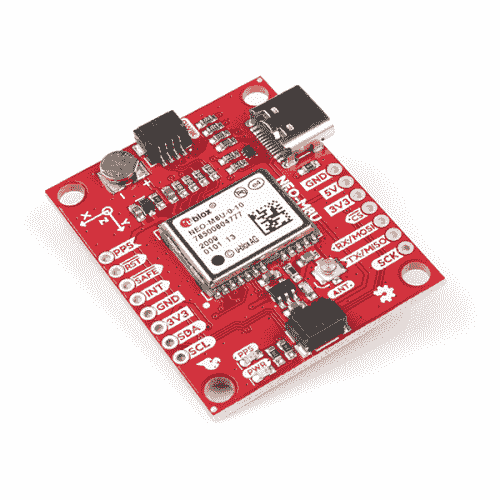

# SparkFun GPS 航位推算 NEO-M8U 连接指南

> 原文：<https://learn.sparkfun.com/tutorials/sparkfun-gps-dead-reckoning-neo-m8u-hookup-guide>

## 介绍

u-blox NEO-M8U 是一款功能强大的 [GPS](http://www.sparkfun.com/gps) 设备，它利用了无线航位推算(UDR)技术进行导航。该模块在城市环境中和完全失去信号时(例如短隧道和停车场)为车辆提供连续定位。我们将很快让您使用 Qwiic 生态系统和 Arduino 进行设置，以便您可以开始阅读输出！

 

将**添加到您的[购物车](https://www.sparkfun.com/cart)中！**

### [【spark fun GPS 航位推算突破- NEO-M8U (Qwiic)](https://www.sparkfun.com/products/16329)

[In stock](https://learn.sparkfun.com/static/bubbles/ "in stock") GPS-16329

SparkFun NEO-M9N GPS Breakout 是一款高质量的 GPS 板，通过 Dead Reck 提供了同样令人印象深刻的配置选项

$74.952[Favorited Favorite](# "Add to favorites") 19[Wish List](# "Add to wish list")** **[https://www.youtube.com/embed/4Q9fT6ePqBo/?autohide=1&border=0&wmode=opaque&enablejsapi=1](https://www.youtube.com/embed/4Q9fT6ePqBo/?autohide=1&border=0&wmode=opaque&enablejsapi=1)

### 所需材料

要跟随本教程，您将需要以下材料。你可能不需要所有的东西，这取决于你拥有什么。将它添加到您的购物车，通读指南，并根据需要调整购物车。**