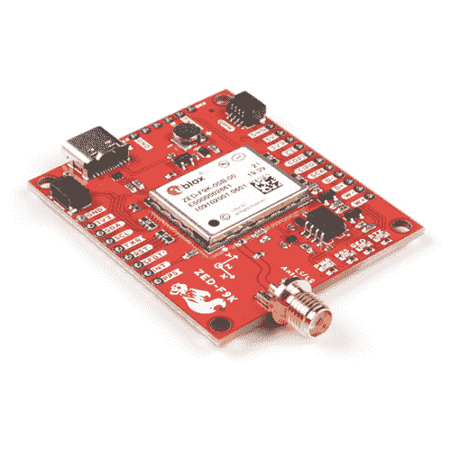

# SparkFun GPS-RTK 航位推算 ZED-F9K 连接指南

> 原文：<https://learn.sparkfun.com/tutorials/sparkfun-gps-rtk-dead-reckoning-zed-f9k-hookup-guide>

## 介绍

SparkFun GPS ZED-F9K 利用航位推算进行导航。u-blox ZED-F9K 是一个功能强大的 GPS-RTK 单元，它融合了 IMU、车轮跳动、车辆动力学模型、校正数据和 GNSS 测量值，可在困难的条件下提供高度精确和连续的导航位置。我们将通过 Arduino 快速帮助您使用 Qwiic 生态系统。以便您可以开始读取输出！

 

### [【spark fun GNSS-RTK 航位推算突破- ZED-F9K (Qwiic)](https://www.sparkfun.com/products/18719)

[Out of stock](https://learn.sparkfun.com/static/bubbles/ "out of stock") GPS-18719

SparkFun ZED-F9K GNSS Breakout 是一款高精度地理空间板，它利用了 u-blox 的汽车 Dead Reck…

[Favorited Favorite](# "Add to favorites") 6[Wish List](# "Add to wish list")

### 所需材料

要完成本教程，您至少需要以下材料。你可能不需要所有的东西，这取决于你拥有什么。根据您的应用，您可能需要额外的部件作为校正源或连接到您的车辆以获取车轮跳动/方向信息。将它添加到您的购物车，通读指南，并根据需要调整购物车。