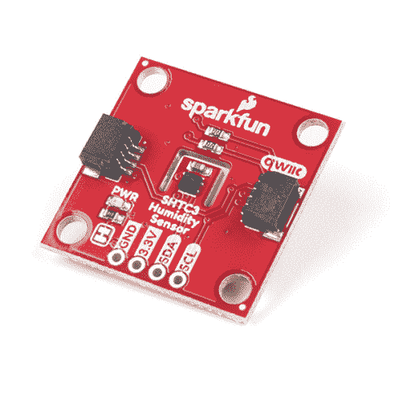
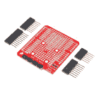
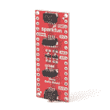
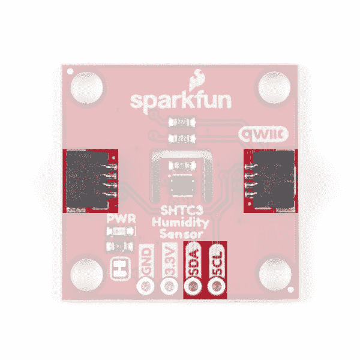
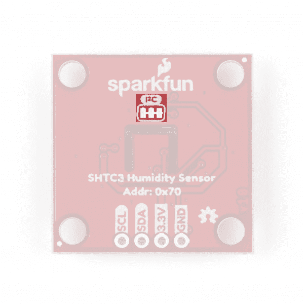
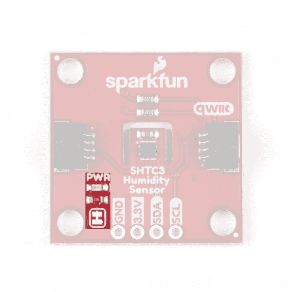
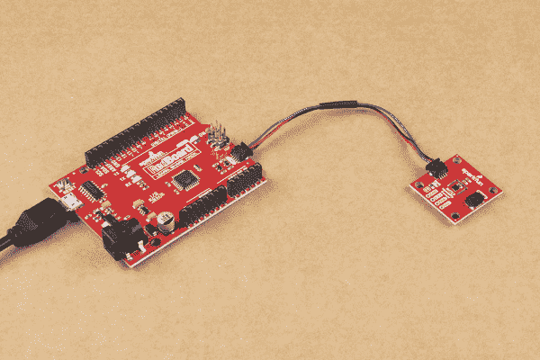

# SparkFun 湿度传感器分线点- SHTC3 (Qwiic)连接指南

> 原文：<https://learn.sparkfun.com/tutorials/sparkfun-humidity-sensor-breakout---shtc3-qwiic-hookup-guide>

## 介绍

想要记录您的温室中的气候，创建一个保湿器控制系统，或者想要为气象站项目跟踪温度和湿度数据？ [SparkFun 湿度传感器 Breakout - SHTC3 (Qwiic)](https://www.sparkfun.com/products/16467) 可能是您的完美选择！SHTC3 是一款低成本、易于使用、高精度的数字湿度和温度传感器。SHTC3 通过 I ² C 进行通信，因此，正如你从名称中可以看出的那样，我们已经将传感器上的引脚与 qw IC 连接器分开，这样你就可以轻松地将其连接到 SparkFun 不断增长的[qw IC 生态系统](https://www.sparkfun.com/qwiic)。

[](https://www.sparkfun.com/products/16467) 

将**添加到您的[购物车](https://www.sparkfun.com/cart)中！**

### [【spark fun 湿度传感器分线点- SHTC3 (Qwiic)](https://www.sparkfun.com/products/16467)

[Only 5 left!](https://learn.sparkfun.com/static/bubbles/ "only 5 left!") SEN-16467

SparkFun SHTC3 湿度传感器突破是一个低成本，易于使用，高精度的数字湿度和温度传感器…

$10.951[Favorited Favorite](# "Add to favorites") 16[Wish List](# "Add to wish list")** **[https://www.youtube.com/embed/pqAV3m_VinA/?autohide=1&border=0&wmode=opaque&enablejsapi=1](https://www.youtube.com/embed/pqAV3m_VinA/?autohide=1&border=0&wmode=opaque&enablejsapi=1)

在本指南中，我们将重点介绍这个分会场的一些独特功能、如何连接和使用它以及一个 Arduino 库，并通过四个示例帮助您开始下一个环境监控项目。

### 所需材料

按照本指南，您需要一个微控制器与 SHTC3 通信。以下是一些开箱即用的 Qwiic 选项:

[](https://www.sparkfun.com/products/15663) 

将**添加到您的[购物车](https://www.sparkfun.com/cart)中！**

### [【spark fun Thing Plus-ESP32 WROOM(微-B)](https://www.sparkfun.com/products/15663)

[Out of stock](https://learn.sparkfun.com/static/bubbles/ "out of stock") WRL-15663

SparkFun ESP32 Thing Plus 是开始使用 Espressif 物联网概念的下一步，同时还可以享受所有的便利设施

$22.5010[Favorited Favorite](# "Add to favorites") 48[Wish List](# "Add to wish list")****[](https://www.sparkfun.com/products/15795) 

将**添加到您的[购物车](https://www.sparkfun.com/cart)中！**

### [【spark fun Qwiic Pro Micro-USB-C(atmega 32 u 4)](https://www.sparkfun.com/products/15795)

[In stock](https://learn.sparkfun.com/static/bubbles/ "in stock") DEV-15795

SparkFun Qwiic Pro Micro 在小型化的 Arduino bo 上增加了一个重置按钮、Qwiic 连接器、USB-C 和齿形垫…

$21.507[Favorited Favorite](# "Add to favorites") 46[Wish List](# "Add to wish list")****[](https://www.sparkfun.com/products/15123) 

将**添加到您的[购物车](https://www.sparkfun.com/cart)中！**

### [spark fun RedBoard Qwiic](https://www.sparkfun.com/products/15123)

[In stock](https://learn.sparkfun.com/static/bubbles/ "in stock") DEV-15123

SparkFun RedBoard Qwiic 是一款 Arduino 兼容开发板，内置 Qwiic 连接器，无需…

$21.5014[Favorited Favorite](# "Add to favorites") 49[Wish List](# "Add to wish list")****[](https://www.sparkfun.com/products/15444) 

将**添加到您的[购物车](https://www.sparkfun.com/cart)中！**

### [SparkFun RedBoard Artemis](https://www.sparkfun.com/products/15444)

[In stock](https://learn.sparkfun.com/static/bubbles/ "in stock") DEV-15444

RedBoard Artemis 采用 SparkFun 的功能强大的 Artemis 模块，并将其包装在一个易于使用和熟悉的环境中…

$21.509[Favorited Favorite](# "Add to favorites") 32[Wish List](# "Add to wish list")******** ********如果您选择的微控制器尚未启用 Qwiic，您可以添加以下一项或多项功能:

[](https://www.sparkfun.com/products/15081) 

将**添加到您的[购物车](https://www.sparkfun.com/cart)中！**

### [SparkFun Qwiic 线缆套件](https://www.sparkfun.com/products/15081)

[In stock](https://learn.sparkfun.com/static/bubbles/ "in stock") KIT-15081

为了更容易上手，我们用 50 毫米到 500 毫米的各种 Qwiic 电缆组装了 Qwiic 电缆套件…

$8.9516[Favorited Favorite](# "Add to favorites") 58[Wish List](# "Add to wish list")****[](https://www.sparkfun.com/products/14495) 

将**添加到您的[购物车](https://www.sparkfun.com/cart)中！**

### [SparkFun Qwiic 适配器](https://www.sparkfun.com/products/14495)

[In stock](https://learn.sparkfun.com/static/bubbles/ "in stock") DEV-14495

SparkFun Qwiic 适配器提供了将任何旧 I ² C 板改造成支持 Qwiic 的板的完美方法。

$1.601[Favorited Favorite](# "Add to favorites") 53[Wish List](# "Add to wish list")****[](https://www.sparkfun.com/products/14352) 

将**添加到您的[购物车](https://www.sparkfun.com/cart)中！**

### [ArduinoT3 的 SparkFun Qwiic 盾](https://www.sparkfun.com/products/14352)

[In stock](https://learn.sparkfun.com/static/bubbles/ "in stock") DEV-14352

SparkFun Qwiic Shield 是一种易于组装的板，它提供了一种简单的方法来将 Qwiic Connect 系统与

$7.508[Favorited Favorite](# "Add to favorites") 39[Wish List](# "Add to wish list")****[](https://www.sparkfun.com/products/retired/16130) 

### [Arduino Nano的 SparkFun Qwiic 盾](https://www.sparkfun.com/products/retired/16130)

[Retired](https://learn.sparkfun.com/static/bubbles/ "Retired") DEV-16130

用于 Arduino Nano 的 SparkFun Qwiic Shield 使您可以将 SparkFun 的 Qwiic connect 生态系统与开发板一起使用…

**Retired**[Favorited Favorite](# "Add to favorites") 2[Wish List](# "Add to wish list")****** ******您还需要至少一根 Qwiic 电缆将传感器连接到微控制器。

[](https://www.sparkfun.com/products/14427) 

将**添加到您的[购物车](https://www.sparkfun.com/cart)中！**

### [Qwiic 线缆- 100mm](https://www.sparkfun.com/products/14427)

[In stock](https://learn.sparkfun.com/static/bubbles/ "in stock") PRT-14427

这是一条 100 毫米长的 4 芯电缆，带有 1 毫米 JST 端接。它旨在将支持 Qwiic 的组件连接在一起…

$1.50[Favorited Favorite](# "Add to favorites") 32[Wish List](# "Add to wish list")****[](https://www.sparkfun.com/products/14429) 

将**添加到您的[购物车](https://www.sparkfun.com/cart)中！**

### [Qwiic 线缆- 500mm](https://www.sparkfun.com/products/14429)

[In stock](https://learn.sparkfun.com/static/bubbles/ "in stock") PRT-14429

这是一根 500mm 长的 4 芯电缆，带有 1mm JST 端接。它旨在将支持 Qwiic 的组件连接在一起…

$1.951[Favorited Favorite](# "Add to favorites") 25[Wish List](# "Add to wish list")****[](https://www.sparkfun.com/products/14426) 

将**添加到您的[购物车](https://www.sparkfun.com/cart)中！**

### [Qwiic 线缆- 50mm](https://www.sparkfun.com/products/14426)

[In stock](https://learn.sparkfun.com/static/bubbles/ "in stock") PRT-14426

这是一根 50 毫米长的 4 芯电缆，带有 1 毫米 JST 端接。它旨在将支持 Qwiic 的组件连接在一起…

$0.95[Favorited Favorite](# "Add to favorites") 29[Wish List](# "Add to wish list")****[](https://www.sparkfun.com/products/14428) 

### [Qwiic 线缆- 200mm](https://www.sparkfun.com/products/14428)

[Out of stock](https://learn.sparkfun.com/static/bubbles/ "out of stock") PRT-14428

这是一根 200 毫米长的 4 芯电缆，带有 1 毫米 JST 端接。它旨在将支持 Qwiic 的组件连接在一起…

[Favorited Favorite](# "Add to favorites") 21[Wish List](# "Add to wish list")****** ******### 推荐阅读

如果你不熟悉 Qwiic 系统，我们推荐你在这里阅读[以获得一个概述](https://www.sparkfun.com/qwiic)。

| [](https://www.sparkfun.com/qwiic) |

如果你不熟悉下面的教程，我们也建议你看一看。如果您正在使用上面列出的 Qwiic 保护罩之一，在开始使用 SparkFun 湿度传感器分线装置- SHTC3 (Qwiic)之前，您可能还需要通读它们各自的连接指南。

[](https://learn.sparkfun.com/tutorials/i2c) [### I2C](https://learn.sparkfun.com/tutorials/i2c) An introduction to I2C, one of the main embedded communications protocols in use today.[Favorited Favorite](# "Add to favorites") 128[](https://learn.sparkfun.com/tutorials/terminal-basics) [### 串行终端基础知识](https://learn.sparkfun.com/tutorials/terminal-basics) This tutorial will show you how to communicate with your serial devices using a variety of terminal emulator applications.[Favorited Favorite](# "Add to favorites") 46[](https://learn.sparkfun.com/tutorials/qwiic-shield-for-arduino--photon-hookup-guide) [### Arduino 和光子连接指南的 Qwiic 屏蔽](https://learn.sparkfun.com/tutorials/qwiic-shield-for-arduino--photon-hookup-guide) Get started with our Qwiic ecosystem with the Qwiic shield for Arduino or Photon.[Favorited Favorite](# "Add to favorites") 5[](https://learn.sparkfun.com/tutorials/sparkfun-qwiic-shield-for-arduino-nano-hookup-guide) [### Arduino Nano 连接指南的 SparkFun Qwiic 盾](https://learn.sparkfun.com/tutorials/sparkfun-qwiic-shield-for-arduino-nano-hookup-guide) Hookup Guide for the SparkFun Qwiic Shield for Arduino Nano.[Favorited Favorite](# "Add to favorites") 1

## 硬件概述

Sensirion 的 SHTC3 湿度和温度传感器是一款高精度数字湿度和温度传感器，使用 I ² C 协议进行通信。它特别适合可穿戴设备或远程环境监控等电池供电应用。在本节中，我们将介绍 SHTC3 的操作特性以及分线板上的硬件。

### 传感器规格

下表概述了 SHTC3 湿度和温度传感器的一些规格。关于推荐操作条件的完整列表和详细信息，查看 [SHTC3 数据表](https://cdn.sparkfun.com/assets/0/0/1/3/0/Sensirion_Humidity_Sensors_SHTC3_Datasheet.pdf)。

| **参数** | **值** |
| 指定湿度范围 | 0 至 100%相对湿度 |
| 指定温度范围 | -40 至+125 摄氏度 |
| 相对湿度准确度公差 | 2.0%相对湿度(典型值。) |
| 温度精度公差 | 0.2 癈(典型值。) |

### 力量

SHTC3 的电源通过 Qwiic 接口提供，或者如果你愿意，你可以通过标有 **3.3V** 和 **GND** 的引脚用 **1.62-3.6V** 供电。我们建议使用调节过的 **3.3V** 电源为主板供电，尤其是当您使用其他 Qwiic 主板时。

[](https://cdn.sparkfun.com/assets/learn_tutorials/1/1/6/9/SHTC3_Power_Input.jpg)

### Qwiic 和 I ² C 接口

SHTC3 通过 I ² C 进行通信，这些引脚连接到板上的两个 Qwiic 连接器以及 SDA 和 SCL 引脚。SHTC3 的 I ² C 接口支持在 **0** 到 **1MHz** 之间的时钟频率，时钟伸展以匹配快速模式加规范。I ² C 地址为 **0x70** (1110000 bin)，由硬件定义。如果您有其他具有相同地址的 I ² C 器件，或者希望在一条 I ² C 总线上使用多个 SHTC3 分线点，您将需要使用多路复用器/mux。如果您需要在项目中使用多个 SHTC3 传感器或共享相同地址的其他设备，请考虑使用 [Qwiic Mux 分线点- 8 通道](https://www.sparkfun.com/products/14685)。注意，Qwiic Mux 分线点的默认 I ² C 地址也是 **0x70** ，因此必须进行调整，以便与 SHTC3 一起正常工作。

[](https://cdn.sparkfun.com/assets/learn_tutorials/1/1/6/9/SHTC3_Qwiic_I2C.jpg)

### 针织套衫

If you have never worked with solder jumpers and PCB traces before or would like a quick refresher, check out our [How to Work with Solder Jumpers and PCB Traces](https://learn.sparkfun.com/tutorials/how-to-work-with-jumper-pads-and-pcb-traces) tutorial for detailed instructions and tips.

SparkFun 湿度传感器- SHTC3 (Qwiic)的电路板上有两个焊接跳线，分别标有***【I2C】***和***【PWR***(或者 PWRLED，如果你在看原理图的话)。I ² C 跳线通过两个 **2.2K 欧姆**电阻将 SDA 和 SCL 引脚拉至 VDD(通常为 **3.3V** )。如果同一总线上有许多外围设备，您可能希望通过打开跳线来禁用这些设备(假设它们也在 **3.3V** 逻辑下运行)。

PWRLED 跳线通过一个 **1K 欧姆**电阻将电源 LED 连接到 VDD(通常为 **3.3V** )。要禁用电源指示灯，只需切断两个焊盘之间的走线来断开跳线。这对于需要保持最低功耗的低功耗应用尤其有用。

| [](https://cdn.sparkfun.com/assets/learn_tutorials/1/1/6/9/SHTC3_I2C_Jumper.jpg) | [](https://cdn.sparkfun.com/assets/learn_tutorials/1/1/6/9/SHTC3_Power_LED_Jumper.jpg) |
| *I ² C 跳线* | *电源 LED 跳线* |

#### 电路板尺寸

这种分线架是按照我们的 Qwiic 标准 1x1 "尺寸设计的，可以轻松与其他 Qwiic 产品堆叠。板上有四个安装孔，可安装 4-40 螺丝。

[](https://cdn.sparkfun.com/assets/learn_tutorials/1/1/6/9/SHTC3_Dimensions.png)

现在，我们已经对分线点上的硬件有了很好的了解，我们将在下一节中把它连接起来，并迅速转向编程和与传感器对话。

## 硬件装配

使用 Qwiic 系统，组装硬件很简单。您只需用 Qwiic 电缆或[适配器电缆](https://www.sparkfun.com/products/14425)将您的 SparkFun 湿度传感器 Breakout - SHTC3 (Qwiic)连接到您选择的开发板。否则，如果你愿意，你可以使用 I ² C 销。如果您没有使用支持 Qwiic 的板，请确保您的输入电压和逻辑运行在 **3.3V** 或者您在相同的[逻辑电平](https://learn.sparkfun.com/tutorials/logic-levels)下运行控制器和 SHTC3。

[](https://cdn.sparkfun.com/assets/learn_tutorials/1/1/6/9/SHTC3_Hookup.jpg)

如果您更喜欢使用湿度传感器上的 PTH 引脚，您将需要焊接到这些引脚上，或者，如果您想要用于原型制作的临时连接，这些 [IC 挂钩](https://www.sparkfun.com/products/9741)是进行该连接的完美选择。如果你不熟悉通孔焊接，看看这个教程:

[](https://learn.sparkfun.com/tutorials/how-to-solder-through-hole-soldering) [### 如何焊接:通孔焊接

#### 2013 年 9 月 19 日](https://learn.sparkfun.com/tutorials/how-to-solder-through-hole-soldering) This tutorial covers everything you need to know about through-hole soldering.[Favorited Favorite](# "Add to favorites") 70

将 SHTC3 连接到微控制器后，我们可以继续编写一些代码来监控温度和湿度。

## SHTC3 Arduino 库

**Note:** This library assumes you are using the latest version of the Arduino IDE on your desktop. If this is your first time using Arduino, please review our tutorial on [installing the Arduino IDE.](https://learn.sparkfun.com/tutorials/installing-arduino-ide) If you have not previously installed an Arduino library, please check out our [installation guide.](https://learn.sparkfun.com/tutorials/installing-an-arduino-library)

SparkFun SHTC3 Arduino 库可以通过搜索' **SparkFun SHTC3** '使用 Arduino 库管理器下载，或者您可以从 [GitHub 库](https://github.com/sparkfun/SparkFun_SHTC3_Arduino_Library)获取 zip 文件:

[SparkFun SHTC3 Arduino Library (ZIP)](https://github.com/sparkfun/SparkFun_SHTC3_Arduino_Library/archive/master.zip)

一旦安装了库，我们就可以继续使用包含的示例草图，并获取一些传感器读数。

### 例 1:基本阅读

通过标题打开第一个示例到**文件** > **示例** > **SparkFun SHTC3 湿度和温度传感器库** > **示例 1 _ 基本创建**。选择您的主板(在我们的例子中是 **Arduino/Genuino Uno** )和它列举的 COM 端口。然后点击上传。在 **115200** 波特打开 [Arduino 串行监视器](https://learn.sparkfun.com/tutorials/terminal-basics/arduino-serial-monitor-windows-mac-linux)开始查看湿度和温度！

试着将手放在传感器上，或者对着 SHTC3 轻轻呼吸，观察数值的变化。

### 示例 2:验证校验和

此示例与基本读数非常相似，但也启用并返回传感器计算的校验和数据，以确保数据有效。按照示例 1 的说明打开它，但选择**示例 2 _ 验证校验和**。传感器 ID、相对湿度和温度的校验和通过指示器分别为`passIDcrc`、`passRHcrc`和`passTcrc`。

使用校验和并非绝对必要，但有助于排除任何 I ² C 通信错误。代码上传后，它将通过串行打印出所有校验和数据，以及它是通过还是失败，这样您就可以确定诸如设备 ID 等内容是否未正确返回。

### 示例 3:更改选项

第三个例子建立在前两个例子的基础上，演示了如何使用`setMode`函数配置 SHTC3，以及选择您的有线端口和时钟速度。同样，通过导航到 SHTC 图书馆并选择 **Example2_ChangingOptions** 来打开示例。

以下是 SHTC3 上可用的模式:

```
language:c
SHTC3_CMD_CSE_RHF_NPM = 0x5C24,   // Clock stretching, RH first, Normal power mode
SHTC3_CMD_CSE_RHF_LPM = 0x44DE,   // Clock stretching, RH first, Low power mode
SHTC3_CMD_CSE_TF_NPM = 0x7CA2,    // Clock stretching, T first, Normal power mode
SHTC3_CMD_CSE_TF_LPM = 0x6458,    // Clock stretching, T first, Low power mode

SHTC3_CMD_CSD_RHF_NPM = 0x58E0,   // Polling, RH first, Normal power mode
SHTC3_CMD_CSD_RHF_LPM = 0x401A,   // Polling, RH first, Low power mode
SHTC3_CMD_CSD_TF_NPM = 0x7866,    // Polling, T first, Normal power mode
SHTC3_CMD_CSD_TF_LPM = 0x609C   // Polling, T first, Low power mode 
```

默认情况下，代码将 SHTC3 设置为使用时钟拉伸，首先报告温度数据，然后在低功耗模式下运行。要更改为另一种模式，请参考上面的设置并更改此行:

```
language:c
mySHTC3.setMode(SHTC3_CMD_CSE_TF_LPM) == SHTC3_Status_Nominal 
```

一旦你选择了你想要 SHTC3 运行的模式，上传并打开一个串行监视器到 **115200** 波特。您应该看到校验和数据打印，然后看到`setMode`功能是否成功。注意，代码默认打印出`"Choosing low-power measurements with T first: "`,所以如果您使用不同的模式，您可能需要修改打印语句以避免混淆。

如果所有这些都成功了，代码将开始打印出湿度和温度数据。

### 示例 4:使用回调

库中的第四个示例演示了如何在 SHTC3 上使用回调功能。你可能想知道，什么是回调？这是图书馆为用户提供一个做事情的地方的一种方式。这个库是用一个函数编写的，每次函数退出时(几乎)都会调用这个函数。这有什么用？您可以用自己的定义来覆盖该函数，这样您就可以进行调试或观察程序的执行。

用这个签名做一个函数:

```
language:c
void SHTC3_exitOp_Callback(SHTC3_Status_TypeDef status, bool inProcess, char * file, uint16_t line) 
```

然后在里面写一些可能对你有帮助的代码。该示例通过在每次函数完成时显示行号、文件和状态来帮助我们观察代码的执行。

包含这些函数对调试特别有帮助，但是会加重处理器的负担，降低代码速度。

## 资源&更进一步

本指南到此为止。希望现在你已经掌握了启动自己的湿度和温度监控的技术和电路。有关 SparkFun 湿度传感器 Breakout - SHTC3 (Qwiic)的更多信息，请查看以下链接。感谢阅读！

*   [示意图(PDF)](https://cdn.sparkfun.com/assets/8/7/2/5/2/SparkFun_Qwiic_Humidity_Temperature_SHTC3_Schematic.pdf)
*   [老鹰文件(ZIP)](https://cdn.sparkfun.com/assets/6/2/0/b/1/SHTC3_Breakout.zip)
*   [板尺寸(PNG)](https://cdn.sparkfun.com/assets/learn_tutorials/1/1/6/9/SHTC3_Dimensions.png)
*   [数据表(PDF)](https://cdn.sparkfun.com/assets/0/0/1/3/0/Sensirion_Humidity_Sensors_SHTC3_Datasheet.pdf)
*   [Arduino 库](https://github.com/sparkfun/SparkFun_SHTC3_Arduino_Library)
*   [硬件 GitHub 库](https://github.com/sparkfun/Qwiic_Humidity_SHTC3)

**Need help?**

If your product is not working as you expected or you need technical assistance or information, head on over to the [SparkFun Technical Assistance](https://www.sparkfun.com/technical_assistance) page for some initial troubleshooting. 

你的下一个项目需要一些灵感吗？查看一些与天气感应相关的教程:

[](https://learn.sparkfun.com/tutorials/rht03-dht22-humidity-and-temperature-sensor-hookup-guide) [### RHT03 (DHT22)湿度和温度传感器连接指南](https://learn.sparkfun.com/tutorials/rht03-dht22-humidity-and-temperature-sensor-hookup-guide) Measure relative humidity and temperature or your environment with the RHT03 (a.k.a DHT22) low cost sensor on a single wire digital interface connected to an Arduino 4[](https://learn.sparkfun.com/tutorials/sparkfun-gatoruv-hookup-guide) [### 火花短吻鳄:紫外线连接指南](https://learn.sparkfun.com/tutorials/sparkfun-gatoruv-hookup-guide) The gator:UV is an I2C based UV sensor. This tutorial will get you started using the gator:UV with the micro:bit platform.[Favorited Favorite](# "Add to favorites") 2[](https://learn.sparkfun.com/tutorials/qwiic-atmospheric-sensor-bme280-hookup-guide) [### Qwiic 大气传感器(BME280)连接指南](https://learn.sparkfun.com/tutorials/qwiic-atmospheric-sensor-bme280-hookup-guide) Measure temperature, humidity, barometric pressure with the SparkFun Atmospheric Sensor Breakout BME280 (Qwiic).[Favorited Favorite](# "Add to favorites") 4[](https://learn.sparkfun.com/tutorials/micromod-environmental-function-board-hookup-guide) [### MicroMod 环境功能板连接指南](https://learn.sparkfun.com/tutorials/micromod-environmental-function-board-hookup-guide) The SparkFun MicroMod Environmental Function Board adds additional sensing options to the MicroMod Processor Boards. This function board includes three sensors to monitor air quality (SGP40), humidity & temperature (SHTC3), and CO2 concentrations (STC31) in your indoor environment. To make it even easier to use, all communication is over the MicroMod's I2C bus! In this tutorial, we will go over how to connect the board and read the sensors.[Favorited Favorite](# "Add to favorites") 0**********************