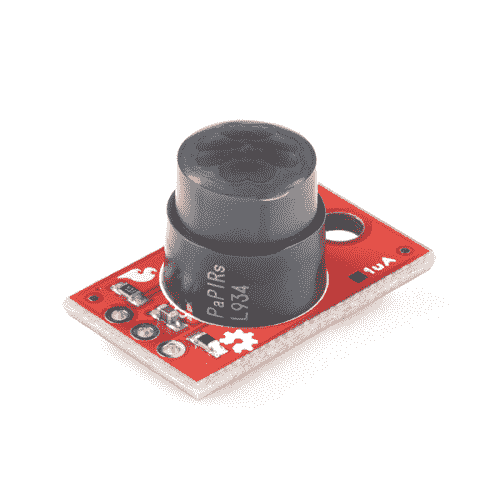
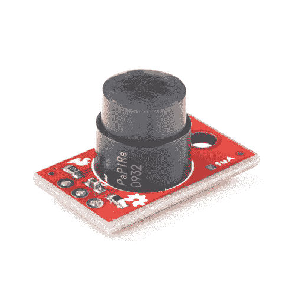
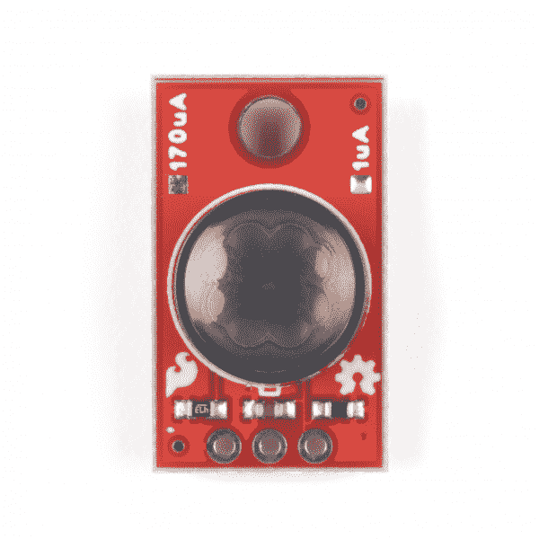
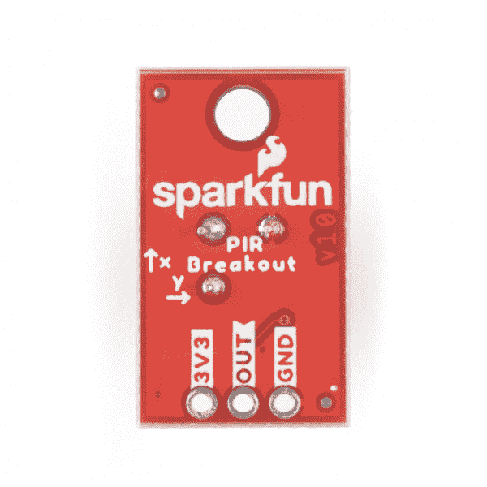
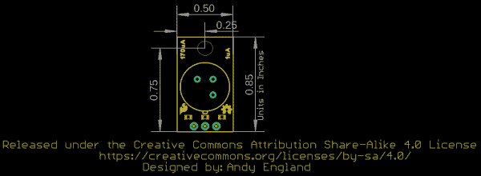
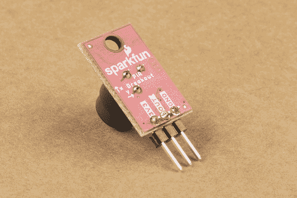
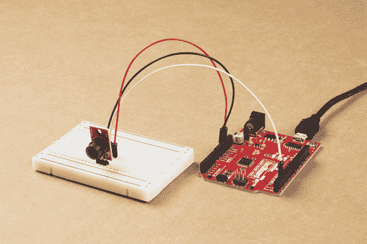

# SparkFun PIR 转接指南

> 原文：<https://learn.sparkfun.com/tutorials/sparkfun-pir-breakout-hookup-guide>

## 介绍

想在你正在做的项目中加入一些运动检测吗？spark fun PIR Breakout-170 ua(ekmc 4607112k)和[spark fun PIR Breakout-1uA(ekmb 1107112)](https://www.sparkfun.com/products/17373)可能正是您想要的！这些分线点使用来自松下的两个版本的 EKM 系列 PIR 传感器，为电池供电和连续供电应用提供薄型运动感测选项。

[](https://www.sparkfun.com/products/17372) 

将**添加到您的[购物车](https://www.sparkfun.com/cart)中！**

### [【spark fun PIR Breakout-170 ua(ekmc 4607112k)](https://www.sparkfun.com/products/17372)

[In stock](https://learn.sparkfun.com/static/bubbles/ "in stock") SEN-17372

非常适合在小范围内检测运动，并针对小运动进行了优化，为连续运动提供了运动感应选项

$21.50[Favorited Favorite](# "Add to favorites") 0[Wish List](# "Add to wish list")****[](https://www.sparkfun.com/products/17373) 

将**添加到您的[购物车](https://www.sparkfun.com/cart)中！**

### [【spark fun PIR Breakout-1uA(ekmb 1107112)](https://www.sparkfun.com/products/17373)

[22 available](https://learn.sparkfun.com/static/bubbles/ "22 available") SEN-17373

非常适合检测小区域内的运动，并针对小运动进行了优化，为电池供电提供运动检测选项…

$32.501[Favorited Favorite](# "Add to favorites") 2[Wish List](# "Add to wish list")**** ****[https://www.youtube.com/embed/rYC2duun4UI/?autohide=1&border=0&wmode=opaque&enablejsapi=1](https://www.youtube.com/embed/rYC2duun4UI/?autohide=1&border=0&wmode=opaque&enablejsapi=1)

被动红外(PIR)传感器不像[距离传感器](https://www.sparkfun.com/distance_sensing)那样返回特定的距离数据。相反，PIR 传感器测量来自物体的红外光，以检测其视野内的运动，这使其非常适合运动检测应用，如灯光、摄像机、电机等转动设备。自动开启。每当在感应区域检测到移动物体时，这些分线点上的 PIR 传感器就输出数字信号。微控制器可以监控该信号，以触发如上所述的连接设备上的动作。

If you would prefer to use these PIR sensors on an I²C bus, check out our Qwiic breakouts of the [170uA PIR](https://www.sparkfun.com/products/17374) and [1uA PIR](https://www.sparkfun.com/products/17375).

### 所需材料

为了跟随本教程，你需要一些物品以及你的 PIR 突破。首先，您需要一个微控制器或单板计算机(SBC ),如 Raspberry Pi 或 Jetson Nano，来监控 PIR 信号:

[](https://www.sparkfun.com/products/15123) 

将**添加到您的[购物车](https://www.sparkfun.com/cart)中！**

### [spark fun RedBoard Qwiic](https://www.sparkfun.com/products/15123)

[In stock](https://learn.sparkfun.com/static/bubbles/ "in stock") DEV-15123

SparkFun RedBoard Qwiic 是一款 Arduino 兼容开发板，内置 Qwiic 连接器，无需…

$21.5014[Favorited Favorite](# "Add to favorites") 49[Wish List](# "Add to wish list")****[](https://www.sparkfun.com/products/15444) 

将**添加到您的[购物车](https://www.sparkfun.com/cart)中！**

### [SparkFun RedBoard Artemis](https://www.sparkfun.com/products/15444)

[In stock](https://learn.sparkfun.com/static/bubbles/ "in stock") DEV-15444

RedBoard Artemis 采用 SparkFun 的功能强大的 Artemis 模块，并将其包装在一个易于使用和熟悉的环境中…

$21.509[Favorited Favorite](# "Add to favorites") 32[Wish List](# "Add to wish list")****[](https://www.sparkfun.com/products/15446) 

### [【树莓派 4 型号 B (2 GB)](https://www.sparkfun.com/products/15446)

[Out of stock](https://learn.sparkfun.com/static/bubbles/ "out of stock") DEV-15446

2 GB Raspberry Pi 4 具有运行两个 4k 分辨率显示器的能力，以运行真正的千兆位以太网操作，所有…

4[Favorited Favorite](# "Add to favorites") 119[Wish List](# "Add to wish list")[](https://www.sparkfun.com/products/16271) 

将**添加到您的[购物车](https://www.sparkfun.com/cart)中！**

### [NVIDIA Jetson Nano 开发者套件(V3)](https://www.sparkfun.com/products/16271)

[Out of stock](https://learn.sparkfun.com/static/bubbles/ "out of stock") DEV-16271

NVIDIA Jetson Nano 开发套件 V3 以小尺寸、低成本提供运行现代人工智能工作负载的性能

$149.0011[Favorited Favorite](# "Add to favorites") 57[Wish List](# "Add to wish list")****** ******您可能还需要一些电线和接头来连接您的分线点和您的微控制器。根据您的预期连接，您可能希望使用以下一个或多个连接和电线选项:

[](https://www.sparkfun.com/products/116) 

将**添加到您的[购物车](https://www.sparkfun.com/cart)中！**

### [破开头球——直击](https://www.sparkfun.com/products/116)

[In stock](https://learn.sparkfun.com/static/bubbles/ "in stock") PRT-00116

一排标题-打破适应。40 个引脚，可切割成任何尺寸。用于定制 PCB 或通用定制接头。

$1.7520[Favorited Favorite](# "Add to favorites") 133[Wish List](# "Add to wish list")****[](https://www.sparkfun.com/products/9140) 

将**添加到您的[购物车](https://www.sparkfun.com/cart)中！**

### [跳线高级 6" M/F 装 10 根](https://www.sparkfun.com/products/9140)

[In stock](https://learn.sparkfun.com/static/bubbles/ "in stock") PRT-09140

这是一个 SparkFun 独家！这些都是 155 毫米长，26 美国线规跳线终止作为男性到女性。用这些来跳离…

$4.501[Favorited Favorite](# "Add to favorites") 16[Wish List](# "Add to wish list")****[](https://www.sparkfun.com/products/115) 

将**添加到您的[购物车](https://www.sparkfun.com/cart)中！**

### [女标题](https://www.sparkfun.com/products/115)

[In stock](https://learn.sparkfun.com/static/bubbles/ "in stock") PRT-00115

单排 40 孔，内螺纹接头。可以用一把钢丝钳切割成合适的尺寸。标准 0.1 英寸间距。我们广泛使用它们…

$1.758[Favorited Favorite](# "Add to favorites") 71[Wish List](# "Add to wish list")****[](https://www.sparkfun.com/products/11026) 

将**添加到您的[购物车](https://www.sparkfun.com/cart)中！**

### [跳线标准 7" M/M - 30 AWG (30 个装)](https://www.sparkfun.com/products/11026)

[In stock](https://learn.sparkfun.com/static/bubbles/ "in stock") PRT-11026

如果你需要快速完成一个原型，没有什么比一堆跳线更能加快速度的了，让我们来看看

$2.4520[Favorited Favorite](# "Add to favorites") 43[Wish List](# "Add to wish list")******** ********最后，为了更容易地测试 PIR 分线装置的范围和检测区域，您可能需要一个 [LED](https://www.sparkfun.com/categories/89) 或类似[蜂鸣器](https://www.sparkfun.com/categories/347)的声音输出，作为传感器检测到运动时的指示器。

### 推荐工具

我们建议焊接到 PIR 分线点的 PTH 接头上，以获得最佳连接。如果您没有焊接工具和附件，请查看以下选项:

[](https://www.sparkfun.com/products/14228) 

### [威勒 WLC100 焊台](https://www.sparkfun.com/products/14228)

[Out of stock](https://learn.sparkfun.com/static/bubbles/ "out of stock") TOL-14228

Weller 的 WLC100 是一款多功能的 5 瓦至 40 瓦焊台，非常适合业余爱好者、DIY 爱好者和学生。…

2[Favorited Favorite](# "Add to favorites") 17[Wish List](# "Add to wish list")[](https://www.sparkfun.com/products/9325) 

将**添加到您的[购物车](https://www.sparkfun.com/cart)中！**

### [无铅焊料- 100 克线轴](https://www.sparkfun.com/products/9325)

[In stock](https://learn.sparkfun.com/static/bubbles/ "in stock") TOL-09325

这是带有水溶性树脂芯的无铅焊料的基本线轴。0.031 英寸规格，100 克。这是一个好主意…

$9.957[Favorited Favorite](# "Add to favorites") 33[Wish List](# "Add to wish list")****[](https://www.sparkfun.com/products/14456) 

将**添加到您的[购物车](https://www.sparkfun.com/cart)中！**

### [【烙铁- 60W(可调温度)](https://www.sparkfun.com/products/14456)

[In stock](https://learn.sparkfun.com/static/bubbles/ "in stock") TOL-14456

当你不想倾家荡产，但又需要一个可靠的烙铁时，这个可调节温度的烙铁是一个很好的工具…

$16.5016[Favorited Favorite](# "Add to favorites") 43[Wish List](# "Add to wish list")****[](https://www.sparkfun.com/products/9163) 

将**添加到您的[购物车](https://www.sparkfun.com/cart)中！**

### [无铅焊料- 15 克管](https://www.sparkfun.com/products/9163)

[In stock](https://learn.sparkfun.com/static/bubbles/ "in stock") TOL-09163

这是你的无铅焊料的基本管，带有不干净的水溶性树脂芯。0.031 英寸规格，15 克

$3.954[Favorited Favorite](# "Add to favorites") 14[Wish List](# "Add to wish list")****** ******### 推荐阅读

PIR 传感器非常直观，是嵌入式电子设备和传感器新手的绝佳切入点，但如果您不熟悉下面链接的教程中涵盖的概念，您可能需要在开始 SparkFun PIR 突破之前浏览一下:

[](https://learn.sparkfun.com/tutorials/how-to-solder-through-hole-soldering) [### 如何焊接:通孔焊接](https://learn.sparkfun.com/tutorials/how-to-solder-through-hole-soldering) This tutorial covers everything you need to know about through-hole soldering.[Favorited Favorite](# "Add to favorites") 70[](https://learn.sparkfun.com/tutorials/what-is-an-arduino) [### 什么是 Arduino？](https://learn.sparkfun.com/tutorials/what-is-an-arduino) What is this 'Arduino' thing anyway? This tutorials dives into what an Arduino is and along with Arduino projects and widgets.[Favorited Favorite](# "Add to favorites") 50[](https://learn.sparkfun.com/tutorials/logic-levels) [### 逻辑电平](https://learn.sparkfun.com/tutorials/logic-levels) Learn the difference between 3.3V and 5V devices and logic levels.[Favorited Favorite](# "Add to favorites") 82[](https://learn.sparkfun.com/tutorials/raspberry-pi-4-kit-hookup-guide) [### Raspberry Pi 4 套件连接指南](https://learn.sparkfun.com/tutorials/raspberry-pi-4-kit-hookup-guide) Guide for hooking up your Raspberry Pi 4 Model B basic, desktop, or hardware starter kit together.[Favorited Favorite](# "Add to favorites") 2

## 硬件概述

在本节中，我们将介绍这些分线点上的 PIR 传感器的特性和功能。

### 松下 EKM 系列 PIR 传感器

松下的 EKMC4607112K 和 EKMB1107112 是薄型 PIR 传感器，非常适合运动启动灯、相机或其他电子产品。应用包括节能自动照明、运动启动安全或跟踪摄像机，或者可能是一些有趣的东西，如[自制的便利店钟声(完成第 100 个客户庆祝活动！)](https://learn.sparkfun.com/tutorials/papa-soundie-audio-player-hookup-guide#hardware-example-project-the-gag)。EKMC4607112K 最适合连续供电安装，其检测性能略优于 EKMB1107112，后者最适合电池和低功率安装。

| [](https://cdn.sparkfun.com/assets/learn_tutorials/1/4/0/0/SparkFun_PIR_Breakout-Front.jpg) | [](https://cdn.sparkfun.com/assets/learn_tutorials/1/4/0/0/SparkFun_PIR_Breakout_Back.jpg) |
| SparkFun PIR Breakout - 1 A Front。 | SparkFun PIR Breakout - 1 A Back。 |

在每个分线点上，我们都将传感器的三个引脚(3V3/VDD、接地和输出)断开为标准的 0.1 英寸间距 PTH 接头，供用户焊接。请注意，传感器共享相同的 PCB 设计，版本( **1 A** 或 **170 A** )由 PIR 的焊盘“北”标记。

这两种 PIR 传感器具有非常相似的电气和传感特性，用户在决定哪种传感器最适合自己的情况之前，需要注意一些具体差异。下表概述了电气和检测性能特征，为用户提供了一个基本概述。要更详细地了解这两种传感器，请查看它们各自的规格表:[ekmc 4607112k](https://cdn.sparkfun.com/assets/learn_tutorials/1/4/0/0/EKMC460711xK_Spec.pdf)&[ekmb 1107112](https://cdn.sparkfun.com/assets/learn_tutorials/1/4/0/0/EKMB110711x_Spec.pdf)以及[松下 PIR 传感器-产品简介](https://cdn.sparkfun.com/assets/3/f/8/8/1/4541_fileversion.pdf) (EKM 系列传感器在第 8 页有介绍)。

| 电特性 |
|  |  | ekmc4607112k | EKMB1107112 |
| 特性 | 单位 | 福建话 | 典型。 | 最大 | 福建话 | 典型。 | 最大 |
| 工作电压 | 直流电压 | Three | - | Six | Two point three | - | Four |
| 电流消耗
(仅传感器) | A | - | One hundred and seventy | Three hundred | - | 1^([【1】](#PIRnote1)) | three |
| 输出电流 | A | - | - | One hundred | - | - | One hundred |
| 输出电压 | 直流电压 | VDD-0.5 | - | - | VDD-0.5 | - | - |
| 电路稳定时间
(施加电压时) | 秒 | - | - | Thirty | - | Twenty-five | Two hundred and ten |

正如我们上面提到的，PIR 传感器的检测性能非常相似，但有一些显著的差异，您需要了解这些差异，以决定哪一种最适合您的应用。还要注意的是，PIR 传感器的性能可能会因其感测的环境而异。

EKMC 和 EKMB 的检测区域水平和垂直方向均为 90 °( 45 °),共有 32 个检测区。下表概述了它们相对于背景温度的检测性能:

| 检测性能特征 |
|  | ekmc4607112k | EKMB1107112 | 笔记 |
|  | 温差 | 价值 | 温差 | 价值 | 目标条件 |
| 探测距离 | 8 摄氏度(14.4 华氏度) | 高达 7m | 4 摄氏度(7.2 华氏度) | 高达 7m | 1.移动速度:1 米/秒
2。目标概念是人体(物体尺寸:约 700×250 毫米) |
| 4 摄氏度(7.2 华氏度) | 高达 5m | 2 摄氏度(3.6 华氏度) | 高达 5m |

[[1] Note:](https://learn.sparkfun.com/tutorials/sparkfun-pir-breakout-hookup-guide#PIRnote1) Current consumption for the EKMB1107112 varies depending on the operating mode. Refer to section 4-4 of the [Spec Sheet](https://cdn.sparkfun.com/assets/learn_tutorials/1/4/0/0/EKMB110711x_Spec.pdf) for specific values.

### 电路板尺寸

SparkFun PIR 分线装置的尺寸为 0.50 英寸 x 0.85 英寸(12.7 毫米 x 21.59mm 毫米)，有一个安装孔，可安装一个 [4-40 螺钉](https://www.sparkfun.com/products/10453)。

[](https://cdn.sparkfun.com/assets/learn_tutorials/1/4/0/0/PIR_Breakout-Dimensions.png)

## 硬件装配

组装 PIR 分支电路非常简单，因为电路板只有三个引脚。推荐的设置需要一些焊接，所以如果你不熟悉通孔焊接或想要复习，我们建议通读本教程:

[](https://learn.sparkfun.com/tutorials/how-to-solder-through-hole-soldering) [### 如何焊接:通孔焊接

#### 2013 年 9 月 19 日](https://learn.sparkfun.com/tutorials/how-to-solder-through-hole-soldering) This tutorial covers everything you need to know about through-hole soldering.[Favorited Favorite](# "Add to favorites") 70

我们将为 PIR 分线组装的演示电路使用了一个[标准试验板](https://www.sparkfun.com/products/12002)、 [M/M 跳线](https://www.sparkfun.com/products/9387)和一个 [SparkFun RedBoard Qwiic](https://www.sparkfun.com/products/15123) 以及 SparkFun PIR 和一组[分离式公接头-直角](https://www.sparkfun.com/products/553)。

对于永久性安装，我们建议将电线直接焊接到 PIR 分接头上，以便与传感器建立牢固稳定的连接。关于准备和焊接电线的一些提示，请看这个教程:

[](https://learn.sparkfun.com/tutorials/working-with-wire) [### 使用导线

#### 2013 年 2 月 8 日](https://learn.sparkfun.com/tutorials/working-with-wire) How to strip, crimp, and work with wire.[Favorited Favorite](# "Add to favorites") 50

首先，我们从一组分离式公接头上断开三个引脚，并将它们焊接到 PIR 分接头上的 PTH 接头上，使传感器垂直于试验板，以便于测试。

[](https://cdn.sparkfun.com/assets/learn_tutorials/1/4/0/0/PIR_Breakout_Hookup_Guide-05.jpg)

接下来，我们将传感器插入试验板(直接连接到微控制器的用户可以忽略这一步)，注意正确定位，使引脚不共享同一供电轨。PIR 就位后，选择三根跳线，将 PIR 的引脚连接到微控制器上的匹配引脚。 **3.3V** 至 **3.3V** ，GND 至地/GND，输出至数字 I/O 引脚。

**Note:** If you choose to not use a dedicated **3.3V** pin for your PIR (e.g an alternate voltage or a digital pin) make sure the voltage it supplies falls within the operating voltage for the sensor:

*   EKMC4607112K: **3.0** 到 **6.0V**
*   EKMB1107112: **2.3** 到 **4.0V**

SparkFun PIR 的 OUT 信号也可以用作外部中断，以触发微控制器上的中断事件。希望将 PIR 用作外部中断的用户应注意微控制器上的哪些数字 I/O 引脚支持中断，并将 PIR 的输出连接到其中一个引脚。对于这个例子，我们将把 OUT 引脚连接到一个也支持中断的数字引脚: **D2** 。

[](https://cdn.sparkfun.com/assets/learn_tutorials/1/4/0/0/PIR_Breakout_Hookup_Guide-04.jpg)

如果您使用的是 Raspberry Pi 或其他以 Python 为主要编程语言的 SBC/开发板，请遵循上述 PIR 的组装步骤，并将其连接到您的 Pi/SBC 的 GPIO 接头，注意要进行正确的引脚连接。寻找快速 GPIO 参考的 Raspberry Pi 用户可以在这里找到一个或者你可以使用控制台中的 [GPIO Zero](https://gpiozero.readthedocs.io/) Python 库中的`pinout`命令来显示那里的引脚排列。

## Arduino 示例

既然我们的 SparkFun PIR 分线电路已经组装完毕，现在是时候将一些代码上传到我们的微控制器，以便与传感器进行交互。在本节中，我们将通过三个例子来演示如何读取信号、稳定信号以及将其用作外部中断来触发微控制器上的事件。

### 示例 1 -带去抖动的简单读取

这个快速而肮脏的例子监控 D2 上的 PIR 输出信号，并使用 SparkFun RedBoard 上的内置 LED 作为 PIR 在其视野中检测到物体时的视觉指示器。

将下面的代码复制到一个空白的 Arudino 草图中，打开**工具**菜单选择您的板(在我们的例子中，Arduino Uno)和正确的端口，然后单击“上传”按钮:

```
language:c
#define PIR_PIN 2   // PIR output on D2
#define LED_PIN  13  // LED to illuminate on motion
#define DEBOUNCE_TIME 750

void setup() 
{
  Serial.begin(115200); 
  // Set the PIR Output signal as an input for the microcontroller:
  pinMode(PIR_PIN, INPUT);

  // Configure the LED pin as an output
  pinMode(LED_PIN, OUTPUT);
  digitalWrite(LED_PIN, LOW); // Turn the LED off

  // Wait for 30 seconds for the PIR to stabilize after power on:
  Serial.println("Waiting 30 Seconds while PIR warms up");
  for (uint8_t seconds = 0; seconds < 30; seconds++)
  {
    Serial.println(seconds);
    delay(1000);
  }
  Serial.println("PIR Warmed up.");
}

void loop() 
{
  // The PIR's output is active high
  int motionStatus = digitalRead(PIR_PIN);

  // If motion is detected, turn the onboard LED on and print an object was detected:
  if (motionStatus == HIGH) 
  {
    Serial.println("Object Detected!");
    digitalWrite(LED_PIN, HIGH);
    delay(DEBOUNCE_TIME);
  }
  else // Otherwise turn the LED off and print All Clear:
  {
    Serial.println("All clear!");
    digitalWrite(LED_PIN, LOW);
    delay(DEBOUNCE_TIME);
  }
} 
```

上传后，打开[串行监视器](https://learn.sparkfun.com/tutorials/terminal-basics)并将你的波特率设置为 **115200** 以查看串行数据。PIR 检测到其视野内的运动时，该代码将通过串行打印输出，D13 LED 应点亮。

### 示例 2 -中断

中断示例显示了如何将 PIR 的输出信号设置为外部中断，以触发微控制器上的事件。这对于不希望不断轮询 PIR 输出所连接的数字引脚的应用特别有用，这样您就可以在后台运行其他循环。

正如我们在硬件装配中提到的，本例假设使用了 SparkFun RedBoard/Arduino Uno，并使用 D2 作为中断引脚。如果您使用不同的微控制器，将`PIR_PIN`定义调整为支持中断的引脚。

将下面的代码复制到一个空白的 Arudino 草图中，打开**工具**菜单选择您的板(在我们的例子中，Arduino Uno)和正确的端口，然后单击“上传”按钮:

```
language:c
#define PIR_PIN 2 //Connect the output of the PIR to this pin
#define DEBOUNCE_TIME 750

bool pirStatus = false;
bool lastPirStatus = pirStatus;

void interruptRoutine() {
  pirStatus = digitalRead(PIR_PIN);
}

void setup() {
  Serial.begin(115200);
  pinMode(PIR_PIN, INPUT);
  attachInterrupt(digitalPinToInterrupt(PIR_PIN), interruptRoutine, CHANGE);

    // Wait for 30 seconds for the PIR to st abilize after power on:
  Serial.println("Waiting 30 Seconds while PIR warms up");
  for (uint8_t seconds = 0; seconds < 30; seconds++)
  {
    Serial.println(seconds);
    delay(1000);
  }
  Serial.println("PIR Warmed up. Starting readings");
}

void loop() {
  if (pirStatus != lastPirStatus) {
    if (pirStatus)
    {
      Serial.println("Object Detected");
    }
    else
    {
      Serial.println("Object Removed");
    }
    lastPirStatus = pirStatus;
  }
  delay(DEBOUNCE_TIME);
} 
```

在这里，您可以修改代码，使中断事件触发您想要的任何行为。如果您发现中断过于频繁，请修改代码，使其仅在检测到事件时触发，或者将中断类型修改为`RISING`或`FALLING`。

## Python 示例

**注意:**这个例子假设您使用的是最新版本的 Python 3。如果这是你第一次在 Raspberry Pi 上使用 Python 或 GPIO 硬件，请通读我们的 [Python 编程与 Raspberry Pi](https://learn.sparkfun.com/tutorials/python-programming-tutorial-getting-started-with-the-raspberry-pi) 指南和 [Raspberry Pi GPIO 教程](https://learn.sparkfun.com/tutorials/raspberry-gpio/introduction)。

如果您已经用 Raspberry Pi 或其他基于 Python 的开发板组装了 SparkFun PIR 分线电路，我们已经编写了一个快速示例来演示如何读取 PIR 的输出。

### 依赖关系示例

为了连接您的 Pi 的 GPIO 端口，您的用户必须是`gpio`组的成员。默认情况下，`pi`用户是会员。拥有 [**sudo**](https://en.wikipedia.org/wiki/Sudo) 权限的用户可以使用以下命令手动添加用户:

```
language:bash
sudo usermod -a -G gpio <username> 
```

### 简单阅读

本例演示了如何使用数字读数从 PIR 传感器读取 SIG 输出。将下面的代码复制到您喜欢的 Python 解释器或空白文本文件中并保存。如果您使用的是 Thonny 这样的解释器，那么您可以从那里运行它。否则，打开终端并通过输入以下命令运行它:`python3 FILENAME.py`

```
language:python
import time
import RPi.GPIO as GPIO
import sys

#Pin Definition
pir_pin = 4

#Set up pins and set PIR signal as an input
GPIO.setmode(GPIO.BCM)
GPIO.setup(pir_pin, GPIO.IN)

def run_example():

    #Wait 30 seconds for the PIR to stabilize

    print ("Waiting 30 seconds for PIR to stabilize")
    for i in range(0, 30):
        print(i)
        time.sleep(1)

    print ("Device Stable. Starting readings...")

    #Start monitoring the PIR output. If an object is detected, print "Object Detected" otherwise print "All Clear"

    while True:
        if GPIO.input(pir_pin):
            print("Object Detected")
        else:
            print("All clear")
        time.sleep(1)

if __name__ == '__main__':
    try:
        run_example()
    except (KeyboardInterrupt, SystemExit) as exErr:
        print("\nEnding Example")
        sys.exit(0) 
```

## 解决纷争

希望通过遵循本指南中的步骤，您已经启动并运行了 SparkFun PIR Breakout，监控运动并向您首选的微控制器或单板计算机报告数据。如果您遇到任何问题，我们在这里列出了一些测试 PIR 的提示和技巧。

### 自动检查

PIR 转接最常见的问题是硬件连接。如果您的 PIR 分线点没有通电，或者您的微控制器/SBC 无法检测到来自传感器的输出信号，请仔细检查您的焊点和您的微控制器/SBC 接线。我们的故障排除提示指南的[硬件检查](https://learn.sparkfun.com/tutorials/sparkfun-troubleshooting-tips#hardware-checks)部分可以帮助您诊断任何连接问题。

### 检测区域/视野

EKMC4607112K 和 EKMB1107112 的有效探测区域取决于多种因素。测量范围的规格基于人体以 1 米/秒的速度穿过两个检测区域的目标概念(面积约为 700×250 毫米)。当人体在水平(X)或垂直(Y)轴上穿过两个检测区域时，PIR 对物体的感知最好。PIR 可能难以检测远离或朝向 PIR(沿 Z 轴)移动的物体，除非它们也沿其他两个轴移动。

还要注意，背景红外辐射会影响 PIR 探测物体的能力。PIR 可以在更大的范围内检测与背景具有更大温差的物体。有关具体范围和温度差异，请参考硬件概述部分。

选择 PIR 分线点的安装位置时，请考虑这些检测限制。传感器规格表的第 4-7 节( [EKMC4607112K](https://cdn.sparkfun.com/assets/learn_tutorials/1/4/0/0/EKMC460711xK_Spec.pdf) 和 [EKMB1107112](https://cdn.sparkfun.com/assets/learn_tutorials/1/4/0/0/EKMB110711x_Spec.pdf) )显示了用于感测的最佳放置和物体运动的图表。

### 常规故障排除

如果您需要技术帮助和更多关于这款或另一款 SparkFun 产品的信息，而该产品并未如您预期的那样工作，我们建议您前往 SparkFun 技术帮助页面进行一些初步的故障排除:

[SparkFun Technical Assistance Page](https://www.sparkfun.com/technical_assistance)

如果你没有找到你需要的，SparkFun 论坛是一个寻找和寻求帮助的好地方。如果这是你第一次访问，你需要[创建一个论坛账户](https://forum.sparkfun.com/ucp.php?mode=register)来搜索产品论坛和发布问题。

## 资源和更进一步

这就是所有的连接指南！有关 SparkFun PIR 突破的更多信息，请查看以下链接:

*   [示意图(PDF)](https://cdn.sparkfun.com/assets/a/b/3/8/7/SparkFun_PIR_Breakout-Schematic.pdf)
*   [老鹰文件(ZIP)](https://cdn.sparkfun.com/assets/5/3/5/d/0/SparkFun_PIR_Breakout.zip)
*   [尺寸图(PNG)](https://cdn.sparkfun.com/r/600-600/assets/learn_tutorials/1/4/0/0/PIR_Breakout-Dimensions.png)
*   [EKMC4607112K 数据表(PDF)](https://cdn.sparkfun.com/assets/learn_tutorials/1/4/0/0/EKMC460711xK_Spec.pdf)
*   [EKMB1107112 数据表(PDF)](https://cdn.sparkfun.com/assets/learn_tutorials/1/4/0/0/EKMB110711x_Spec.pdf)
*   [松下 PIR 运动传感器-产品简介](https://cdn.sparkfun.com/assets/3/f/8/8/1/4541_fileversion.pdf)
*   [硬件 GitHub 库](https://github.com/sparkfun/SparkFun_PIR_Breakout)

想了解更多关于 PIR 传感器的信息，或者想获得一些如何在运动感测项目中使用 PIR 突破的灵感？这些教程有助于:

*   [PIR“门铃”插科打诨项目](https://learn.sparkfun.com/tutorials/papa-soundie-audio-player-hookup-guide#hardware-example-project-the-gag)
*   [PIR 初级读本和 PIR 项目博客文章](https://www.sparkfun.com/news/3809)

[](https://learn.sparkfun.com/tutorials/vernier-photogate) [### 游标光电门](https://learn.sparkfun.com/tutorials/vernier-photogate) Vernier Photogate Timer -- using the Serial Enabled LCD Kit.[Favorited Favorite](# "Add to favorites") 2[](https://learn.sparkfun.com/tutorials/photon-remote-water-level-sensor) [### 光子远程水位传感器](https://learn.sparkfun.com/tutorials/photon-remote-water-level-sensor) Learn how to build a remote water level sensor for a water storage tank and how to automate a pump based off the readings 15[](https://learn.sparkfun.com/tutorials/are-you-okay-widget) [### 你还好吗？小部件](https://learn.sparkfun.com/tutorials/are-you-okay-widget) Use an Electric Imp and accelerometer to create an "Are You OK" widget. A cozy piece of technology your friend or loved one can nudge to let you know they're OK from half-a-world away.[Favorited Favorite](# "Add to favorites") 6[](https://learn.sparkfun.com/tutorials/boss-alarm) [### Boss 警报](https://learn.sparkfun.com/tutorials/boss-alarm) Build a Boss Alarm that alerts you of anyone walking into your office and automatically changes your computer screen.[Favorited Favorite](# "Add to favorites") 19************************