# SparkFun Qwiic Micro (SAMD21E)连接指南

> 原文：<https://learn.sparkfun.com/tutorials/sparkfun-qwiic-micro-samd21e-hookup-guide>

## 介绍

寻找一个一平方英寸大小的微控制器来配合 Qwiic 系统使用？它的核心是功能强大、功能多样的 ATSAMD21E18，这是一款 ARM Cortex M0+32 位微控制器，具有 256KB 的闪存，运行速度高达 48MHz。我们已经用一个 [UF2 引导加载器](https://github.com/microsoft/uf2-samdx1)对它进行了编程，使得 Qwiic Micro 很容易编程，无论你想使用 Arduino 还是 CircuitPython。在本连接指南中，我们将介绍 SparkFun Qwiic Micro 的所有可用功能。

[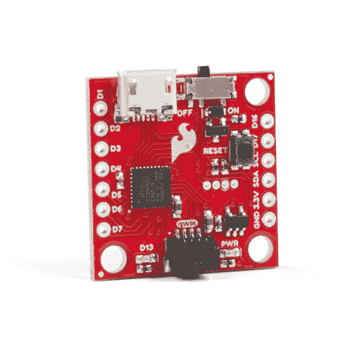](https://www.sparkfun.com/products/15423) 

将**添加到您的[购物车](https://www.sparkfun.com/cart)中！**

### [spark fun Qwiic Micro-samd 21 开发板](https://www.sparkfun.com/products/15423)

[In stock](https://learn.sparkfun.com/static/bubbles/ "in stock") DEV-15423

SparkFun Qwiic Micro 的成型符合我们的标准 1" x 1" Qwiic 板尺寸，这使它成为我们最小的 SAMD21 微控制器…

$22.505[Favorited Favorite](# "Add to favorites") 18[Wish List](# "Add to wish list")** **[https://www.youtube.com/embed/LshhFp_VKf8/?autohide=1&border=0&wmode=opaque&enablejsapi=1](https://www.youtube.com/embed/LshhFp_VKf8/?autohide=1&border=0&wmode=opaque&enablejsapi=1)

### 所需材料

除了 Qwiic Micro，你还需要一根 [Micro-B 线缆](https://www.sparkfun.com/products/10215)(就好像你的 USB 线缆抽屉里还没有几十根一样！).这就是你开始工作所需要的一切。你也可以利用它的 LiPo 电池端口和一个[单体锂聚合物电池](https://www.sparkfun.com/search/results?term=lithium%20polymer)。你可能不需要所有的东西，这取决于你拥有什么。将它添加到您的购物车，通读指南，并根据需要调整购物车。

[](https://www.sparkfun.com/products/10215) 

将**添加到您的[购物车](https://www.sparkfun.com/cart)中！**

### [USB micro-B 线- 6 脚](https://www.sparkfun.com/products/10215)

[In stock](https://learn.sparkfun.com/static/bubbles/ "in stock") CAB-10215

USB 2.0 型到微型 USB 5 针。这是一种新的、更小的 USB 设备连接器。微型 USB 连接器大约是…

$5.5014[Favorited Favorite](# "Add to favorites") 21[Wish List](# "Add to wish list")****[](https://www.sparkfun.com/products/15423) 

将**添加到您的[购物车](https://www.sparkfun.com/cart)中！**

### [spark fun Qwiic Micro-samd 21 开发板](https://www.sparkfun.com/products/15423)

[In stock](https://learn.sparkfun.com/static/bubbles/ "in stock") DEV-15423

SparkFun Qwiic Micro 的成型符合我们的标准 1" x 1" Qwiic 板尺寸，这使它成为我们最小的 SAMD21 微控制器…

$22.505[Favorited Favorite](# "Add to favorites") 18[Wish List](# "Add to wish list")**** ****#### 可选材料

根据您的项目，有几个选项可以连接到电路板并为其供电。如果要将 qw IC 传感器连接到 qw IC 连接器，您需要一根 qw IC 电缆。对于那些想要访问侧面的电镀通孔焊盘的人，您需要在侧面焊接[头部引脚](https://www.sparkfun.com/categories/381)或导线以实现安全连接。对于任何使用 LiPo 电池的人来说，你需要在背面焊接 JST 连接器。

[](https://www.sparkfun.com/products/116) 

将**添加到您的[购物车](https://www.sparkfun.com/cart)中！**

### [破开头球——直击](https://www.sparkfun.com/products/116)

[In stock](https://learn.sparkfun.com/static/bubbles/ "in stock") PRT-00116

一排标题-打破适应。40 个引脚，可切割成任何尺寸。用于定制 PCB 或通用定制接头。

$1.7520[Favorited Favorite](# "Add to favorites") 133[Wish List](# "Add to wish list")****[](https://www.sparkfun.com/products/14426) 

将**添加到您的[购物车](https://www.sparkfun.com/cart)中！**

### [Qwiic 线缆- 50mm](https://www.sparkfun.com/products/14426)

[In stock](https://learn.sparkfun.com/static/bubbles/ "in stock") PRT-14426

这是一根 50 毫米长的 4 芯电缆，带有 1 毫米 JST 端接。它旨在将支持 Qwiic 的组件连接在一起…

$0.95[Favorited Favorite](# "Add to favorites") 29[Wish List](# "Add to wish list")****[](https://www.sparkfun.com/products/115) 

将**添加到您的[购物车](https://www.sparkfun.com/cart)中！**

### [女标题](https://www.sparkfun.com/products/115)

[In stock](https://learn.sparkfun.com/static/bubbles/ "in stock") PRT-00115

单排 40 孔，内螺纹接头。可以用一把钢丝钳切割成合适的尺寸。标准 0.1 英寸间距。我们广泛使用它们…

$1.758[Favorited Favorite](# "Add to favorites") 71[Wish List](# "Add to wish list")****[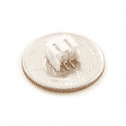](https://www.sparkfun.com/products/retired/8612) 

### [JST 直角连接器-白色](https://www.sparkfun.com/products/retired/8612)

[Retired](https://learn.sparkfun.com/static/bubbles/ "Retired") PRT-08612

两针，紧凑型表面贴装连接器。我们真的很喜欢这些小型连接器的牢固锁定感和高电流额定值

**Retired**[Favorited Favorite](# "Add to favorites") 17[Wish List](# "Add to wish list")****** ******### 工具

根据您的项目，您可能需要烙铁、焊料和[通用焊接附件](https://www.sparkfun.com/categories/49)来连接到电路板侧面的电镀通孔焊盘。

[](https://www.sparkfun.com/products/14456) 

将**添加到您的[购物车](https://www.sparkfun.com/cart)中！**

### [【烙铁- 60W(可调温度)](https://www.sparkfun.com/products/14456)

[In stock](https://learn.sparkfun.com/static/bubbles/ "in stock") TOL-14456

当你不想倾家荡产，但又需要一个可靠的烙铁时，这个可调节温度的烙铁是一个很好的工具…

$16.5016[Favorited Favorite](# "Add to favorites") 43[Wish List](# "Add to wish list")****[](https://www.sparkfun.com/products/9163) 

将**添加到您的[购物车](https://www.sparkfun.com/cart)中！**

### [无铅焊料- 15 克管](https://www.sparkfun.com/products/9163)

[In stock](https://learn.sparkfun.com/static/bubbles/ "in stock") TOL-09163

这是你的无铅焊料的基本管，带有不干净的水溶性树脂芯。0.031 英寸规格，15 克

$3.954[Favorited Favorite](# "Add to favorites") 14[Wish List](# "Add to wish list")**** ****### 推荐阅读

在继续本教程之前，如果您不熟悉这些主题，您可能需要熟悉它们。如果你不熟悉 Qwiic 系统，我们推荐你在这里阅读[以获得一个概述](https://www.sparkfun.com/qwiic)。

| [](https://www.sparkfun.com/qwiic) |
| *[Qwiic 连接系统](https://www.sparkfun.com/qwiic)* |

[](https://learn.sparkfun.com/tutorials/analog-to-digital-conversion) [### 模数转换](https://learn.sparkfun.com/tutorials/analog-to-digital-conversion) The world is analog. Use analog to digital conversion to help digital devices interpret the world.[Favorited Favorite](# "Add to favorites") 58[](https://learn.sparkfun.com/tutorials/what-is-an-arduino) [### 什么是 Arduino？](https://learn.sparkfun.com/tutorials/what-is-an-arduino) What is this 'Arduino' thing anyway? This tutorials dives into what an Arduino is and along with Arduino projects and widgets.[Favorited Favorite](# "Add to favorites") 50[](https://learn.sparkfun.com/tutorials/installing-arduino-ide) [### 安装 Arduino IDE](https://learn.sparkfun.com/tutorials/installing-arduino-ide) A step-by-step guide to installing and testing the Arduino software on Windows, Mac, and Linux.[Favorited Favorite](# "Add to favorites") 16[](https://learn.sparkfun.com/tutorials/samd21-minidev-breakout-hookup-guide) [### SAMD21 迷你/开发分线连接指南](https://learn.sparkfun.com/tutorials/samd21-minidev-breakout-hookup-guide) An introduction to the Atmel ATSAMD21G18 microprocessor and our Mini and Pro R3 breakout boards. Level up your Arduino-skills with the powerful ARM Cortex M0+ processor.[Favorited Favorite](# "Add to favorites") 7

## 硬件概述

**Note:** This hookup guide will not go into the specific details of the SAMD21 IC, because we already have a nice write up on that here: [SAMD21 Overview](https://learn.sparkfun.com/tutorials/samd21-minidev-breakout-hookup-guide/samd21-overview). Here is a link to the [datasheet](http://www.atmel.com/images/atmel-42181-sam-d21_datasheet.pdf) for any additional details not covered in the overview.

在我们开始编程 SAMD21 之前，让我们先来了解一下 [SparkFun Qwiic Micro](https://www.sparkfun.com/products/15423) 内置的一些特性。Qwiic Micro 类似于我们的其他 SAMD21 板，如 [SAMD21 开发分会场](https://www.sparkfun.com/products/13672)，除了小得多。在本节中，我们将介绍 SparkFun Qwiic Micro 上的硬件，包括其 I/O 引脚和各种 led。我们还将介绍为评估板供电的不同选项。

### 供电和电源开关

SparkFun Qwiic Micro 在 **3.3 伏**电压下运行，这使得它成为 Qwiic 生态系统的理想选择。可以通过 **micro-USB** 给 SparkFun Qwiic Micro 供电。也可以通过电路板右下方标有`3V3`和`GND`的通孔供电。

[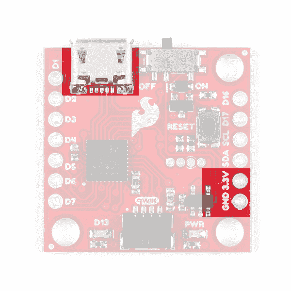](https://cdn.sparkfun.com/assets/learn_tutorials/9/1/7/Power_Input.jpg)The power header pins are **not** regulated, so make sure that you have a steady 3.3V power supply when providing power through here.

此外，如果您有 SMD LiPo 电池连接器，我们为其提供了焊盘，请参见下面的**可选电路**部分。**微型 USB** 连接器应该可以与你身边的许多 USB 手机充电电缆中的一条或者我们的微型 USB 电缆一起工作。以下是 SparkFun 提供的 micro-USB 选项列表。

[](https://www.sparkfun.com/products/10215) 

将**添加到您的[购物车](https://www.sparkfun.com/cart)中！**

### [USB micro-B 线- 6 脚](https://www.sparkfun.com/products/10215)

[In stock](https://learn.sparkfun.com/static/bubbles/ "in stock") CAB-10215

USB 2.0 型到微型 USB 5 针。这是一种新的、更小的 USB 设备连接器。微型 USB 连接器大约是…

$5.5014[Favorited Favorite](# "Add to favorites") 21[Wish List](# "Add to wish list")****[](https://www.sparkfun.com/products/15311) 

将**添加到您的[购物车](https://www.sparkfun.com/cart)中！**

### [【墙上适配器电源- 5VDC，2A (USB Micro-B)](https://www.sparkfun.com/products/15311)

[In stock](https://learn.sparkfun.com/static/bubbles/ "in stock") TOL-15311

这是一个高品质的开关“壁式电源”AC 到 DC 5V 2000mA USB 微型 B 壁式电源，专为 S…

$6.50[Favorited Favorite](# "Add to favorites") 2[Wish List](# "Add to wish list")****[](https://www.sparkfun.com/products/11456) 

将**添加到您的[购物车](https://www.sparkfun.com/cart)中！**

### [USB 壁式充电器- 5V，1A(黑色)](https://www.sparkfun.com/products/11456)

[In stock](https://learn.sparkfun.com/static/bubbles/ "in stock") TOL-11456

现在 USB 越来越多地被作为一种电源连接标准来实现，但是你并不总是在 han 上有一台计算机…

$4.502[Favorited Favorite](# "Add to favorites") 10[Wish List](# "Add to wish list")****** ******当将**置于**位置和**置于**位置时，SparkFun Qwiic 微控制器上的电源开关分别使**开启**和**关闭**。

[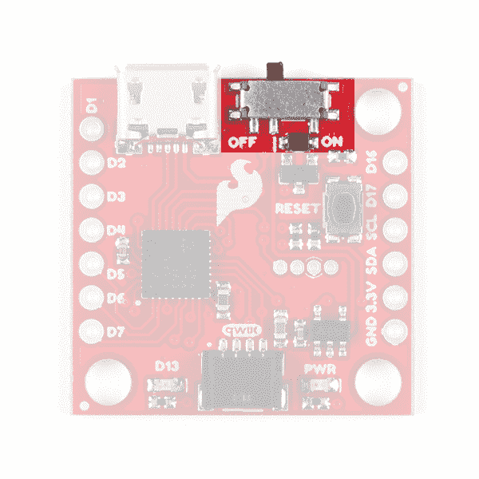](https://cdn.sparkfun.com/assets/learn_tutorials/9/1/7/Switch.jpg)

### 引脚映射

⚡ **3.3V 逻辑电平！**当您开始使用外部传感器和其他元件与 SAMD21 的 I/O 引脚接口时，请记住每个 I/O 最多会产生 3.3V 的高电平输出。

配置为输入时，每个 I/O 的最大输入电压为 3.6V (VDD+0.3V)。如果 SAMD21 与 5V 器件接口，可能需要一些[电平移位器](https://www.sparkfun.com/products/12009)在其间。

下面的 SparkFun Qwiic Micro 的[图形数据表](https://cdn.sparkfun.com/assets/4/8/4/f/b/Qwiic_Micro_Graphical_Datasheet.pdf)显示了每个引脚的完整功能；哪些管脚是模拟的，哪些是数字的， [SERCOM](https://learn.sparkfun.com/tutorials/adding-more-sercom-ports-for-samd-boards/all) 端口在哪里，哪些数据总线可用。除 DAC 外，所有**支持 PWM 的**引脚都能够输出 PWM。DAC 引脚提供真 10 位模拟输出。在[示例:模拟输入和输出](https://learn.sparkfun.com/tutorials/sparkfun-qwiic-micro-samd21e-hookup-guide#example-3-analog-input-and-output)中，有关于如何充分利用这一特性的步骤。

[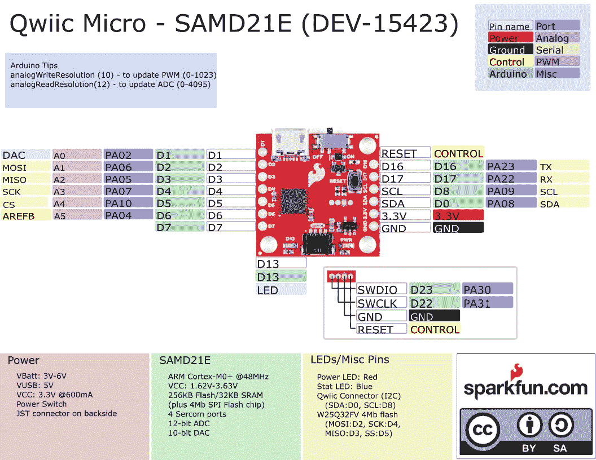](https://cdn.sparkfun.com/assets/7/e/f/d/5/Qwiic_Micro_Graphical_Datasheet.pdf)*Click on image for a closer view.*

### Qwiic 连接器

SparkFun Qwiic Micro 的另一边是 Qwiic 连接器。

[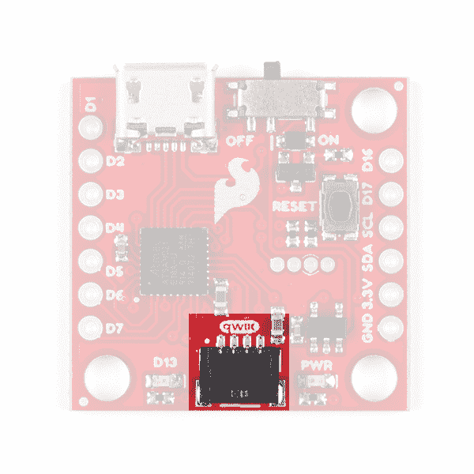](https://cdn.sparkfun.com/assets/learn_tutorials/9/1/7/Qwiic_Connector.jpg)

如果你不熟悉 [Qwiic 生态系统](https://www.sparkfun.com/qwiic)，它的缺点是我们已经在许多传感器和开发板上集成了 *Qwiic 连接器*，允许快速(明白吗？)I ² C 通过电缆连接而不是焊接。这是一个非常有用的工具。查看下面的横幅了解更多信息。

| [](https://www.sparkfun.com/qwiic) |

### 发光二极管

SparkFun Qwiic Micro 有一个红色的电源 LED，它已经成为我们的 [Qwiic](https://www.sparkfun.com/qwiic) 生态系统的象征，并指示正在向电路板供电，电源开关处于 **ON** 位置。此外，还有一个 stat LED 连接到引脚 D13，标记为 **D13** 。

[](https://cdn.sparkfun.com/assets/learn_tutorials/9/1/7/LEDs.jpg)*D13 Stat LED on the Left, Power LED on the right*

如果你想尽量减少 Qwiic Micro 的电流消耗，或者只是不喜欢电源 LED，我们在底部提供了一个跳线来断开它；参见下面的**跳线**部分。

### 跳高运动员

在 SparkFun Qwiic Micro 的底部，电源 LED 下方，我们提供了一个跳线来断开电源 LED，以帮助保持微控制器的低电流消耗。简单地拿一把业余爱好刀，在两个衬垫之间切开痕迹，切断它的连接。只需重新焊接此跳线重新连接。如果你需要一些使用跳线垫的指导，那么[看看我们的教程](https://learn.sparkfun.com/tutorials/how-to-work-with-jumper-pads-and-pcb-traces/all)。

[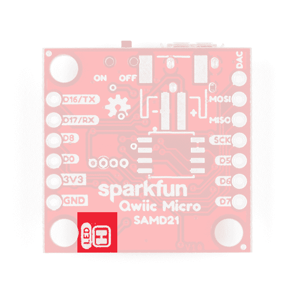](https://cdn.sparkfun.com/assets/learn_tutorials/9/1/7/LED_Jumper.jpg)

### 复原按钮

在 SparkFun Qwiic Micro 的顶部有一个重置按钮，按下该按钮可以重置电路板。如果你发现自己安装了一个拙劣的电路 Python，或者一个草图让你的电路板无法工作，那么你可以**点击**这个按钮**两次**重新进入**引导程序模式**。当 **D13 状态 LED** 以*呼吸*模式变暗和变亮时，你就知道你做对了。

[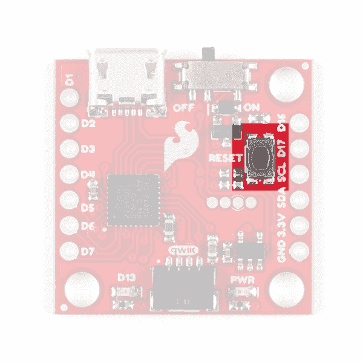](https://cdn.sparkfun.com/assets/learn_tutorials/9/1/7/Reset_button.jpg)

### 编程标题

SparkFun Qwiic Micro 的顶部和底部都有一个小的四针编程接头。该接头为 SWD 编程提供了以下引脚:

| [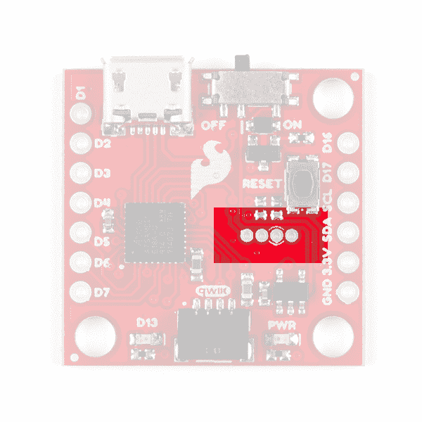](https://cdn.sparkfun.com/assets/learn_tutorials/9/1/7/Programming_Header.jpg) | [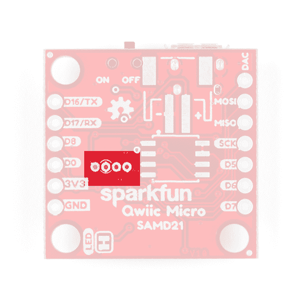](https://cdn.sparkfun.com/assets/learn_tutorials/9/1/7/Programming_Header_Bottom.jpg) |
| 大头针从左到右。 |
| **榜首** | **底部** |
| SWDIO | 重置 |
| SWCLK | GND |
| GND | SWCLK |
| 重置 | SWDIO |

通过这个头编程将允许你在芯片上放置不同的引导装载程序，或者配置 SAMD21 的灵活 SERCOM 端口以添加另一个 I ² C 端口。你可以看看[这个指南](https://learn.sparkfun.com/tutorials/adding-more-sercom-ports-for-samd-boards/all)来看看这是怎么做的。

**Tip:** To keep the board size at a minimum, the pins are not the standard 2x8 headers that you see on other ARM boards. To connect a programmer, try using 0Ω resistors (or [thin solid wires](https://www.sparkfun.com/products/14914)) to connect to the 1.27mm spaced headers. We use this trick to [program an AVR microcontroller with ICSP pins broken out on test pads](https://learn.sparkfun.com/tutorials/installing-a-bootloader-on-the-microview#connect-by-resistor) similar like the image shown below.

[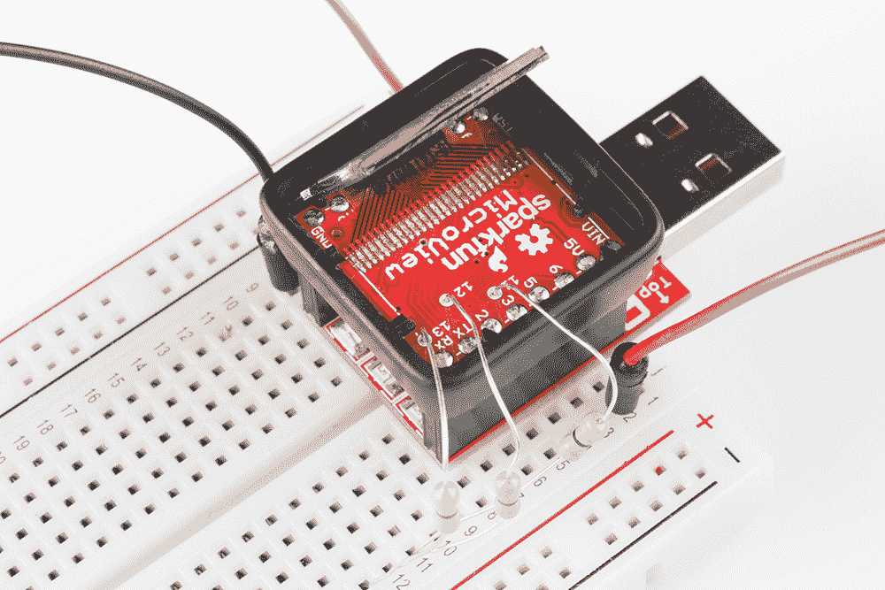](https://learn.sparkfun.com/tutorials/installing-a-bootloader-on-the-microview#connect-by-resistor)

*0Ω Resistor Used to Help Program an AVR Chip via Test Pads*

### 可选电路

#### 脂肪电池

在底部，我们为一些可选项目添加了空白垫。右上方的第一个是一个用于放置 [LiPo 电池连接器](https://www.sparkfun.com/products/8612)的空间。如果你决定通过这个连接器为你的项目供电，你需要[焊接](https://learn.sparkfun.com/tutorials/how-to-solder-through-hole-soldering)连接器。

[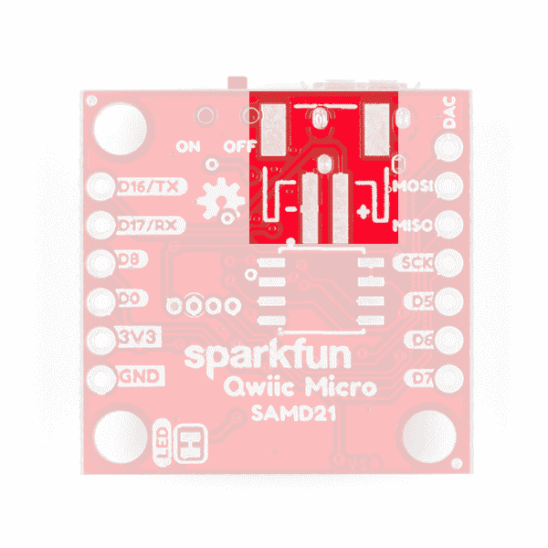](https://cdn.sparkfun.com/assets/learn_tutorials/9/1/7/Lipo_Connector.jpg)

当您准备好将 SparkFun Qwiic Micro 集成到您的项目中时，我们提供了许多 LiPo 电池选项。

[](https://www.sparkfun.com/products/13813) 

将**添加到您的[购物车](https://www.sparkfun.com/cart)中！**

### [锂离子电池-1Ah](https://www.sparkfun.com/products/13813)

[In stock](https://learn.sparkfun.com/static/bubbles/ "in stock") PRT-13813

基于锂离子化学的超薄超轻电池。每个电池在 1000 毫安时输出 3.7V 的标称电压！

$10.958[Favorited Favorite](# "Add to favorites") 75[Wish List](# "Add to wish list")****[](https://www.sparkfun.com/products/13854) 

将**添加到您的[购物车](https://www.sparkfun.com/cart)中！**

### [锂离子电池- 850mAh](https://www.sparkfun.com/products/13854)

[In stock](https://learn.sparkfun.com/static/bubbles/ "in stock") PRT-13854

这是基于锂离子化学的非常薄、非常轻的电池。每个电池在 850℃时输出 3.7V 的标称电压…

$10.952[Favorited Favorite](# "Add to favorites") 17[Wish List](# "Add to wish list")****[](https://www.sparkfun.com/products/13851) 

将**添加到您的[购物车](https://www.sparkfun.com/cart)中！**

### [锂离子电池- 400mAh](https://www.sparkfun.com/products/13851)

[In stock](https://learn.sparkfun.com/static/bubbles/ "in stock") PRT-13851

这是一种基于锂离子化学的非常小、非常轻的电池，具有目前最高的能量密度…

$5.5010[Favorited Favorite](# "Add to favorites") 41[Wish List](# "Add to wish list")****[](https://www.sparkfun.com/products/13855) 

将**添加到您的[购物车](https://www.sparkfun.com/cart)中！**

### [锂离子电池- 2Ah](https://www.sparkfun.com/products/13855)

[In stock](https://learn.sparkfun.com/static/bubbles/ "in stock") PRT-13855

这是基于锂离子化学的非常薄、非常轻的电池。每个电池在 200 伏时输出一个标称的 3.7 伏电压…

$13.959[Favorited Favorite](# "Add to favorites") 43[Wish List](# "Add to wish list")****[](https://www.sparkfun.com/products/13856) 

将**添加到您的[购物车](https://www.sparkfun.com/cart)中！**

### [锂离子电池- 6Ah](https://www.sparkfun.com/products/13856)

[In stock](https://learn.sparkfun.com/static/bubbles/ "in stock") PRT-13856

如果你需要一些果汁，这 6Ah 锂离子电池是给你的。这些是基于锂离子化学电池的非常紧凑的电池…

$32.507[Favorited Favorite](# "Add to favorites") 40[Wish List](# "Add to wish list")****[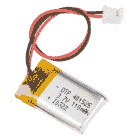](https://www.sparkfun.com/products/13853) 

将**添加到您的[购物车](https://www.sparkfun.com/cart)中！**

### [锂离子电池- 110mAh](https://www.sparkfun.com/products/13853)

[In stock](https://learn.sparkfun.com/static/bubbles/ "in stock") PRT-13853

这是一种基于锂离子化学的非常小、非常轻的电池。这是最高的能量密度电流…

$5.503[Favorited Favorite](# "Add to favorites") 22[Wish List](# "Add to wish list")************************While it's possible, I strongly recommend against soldering wires directly to these pads unless you feel confident in this decision. If you're going to solder directly to the pads, make sure to solder your RED or power wire, onto the pad labeled with the "**+**" symbol and the BLACK or GND wire onto the "**-**" pad.

#### 可选闪存芯片

就在那下面是一个闪存芯片的空间。

[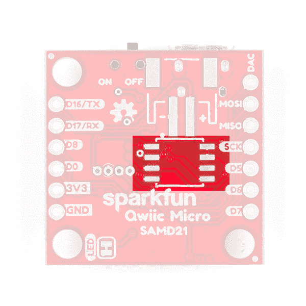](https://cdn.sparkfun.com/assets/learn_tutorials/9/1/7/EEPROM.jpg)

如果你想给 SparkFun Qwiic Micro 增加额外的内存，你可以将一个 8 针 SOIC 焊接到这些焊盘上。来自华邦的 4MB 闪存芯片:W25Q32FV ，它与非常有用的 Arduino 库 [SPI 存储器](https://github.com/Marzogh/SPIMemory)一起工作。查看[示例 4:闪存](https://learn.sparkfun.com/tutorials/sparkfun-qwiic-micro-samd21e-hookup-guide#example-4-flash-memory-with-spimemory)以了解如何使用 SparkFun Qwiic Micro 的外部闪存。此外，我们还为 SparkFun Qwiic Micro 提供了 **CircuitPython 固件**，它也可以使用这种内存。

[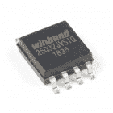](https://www.sparkfun.com/products/15809) 

将**添加到您的[购物车](https://www.sparkfun.com/cart)中！**

### [](https://www.sparkfun.com/products/15809)

[In stock](https://learn.sparkfun.com/static/bubbles/ "in stock") COM-15809

W25Q32FV (32M 位)串行闪存为空间、引脚和电源有限的系统提供存储解决方案。

$1.95[Favorited Favorite](# "Add to favorites") 4[Wish List](# "Add to wish list")** **当所有东西都焊接到底部时，它看起来会像这样:

[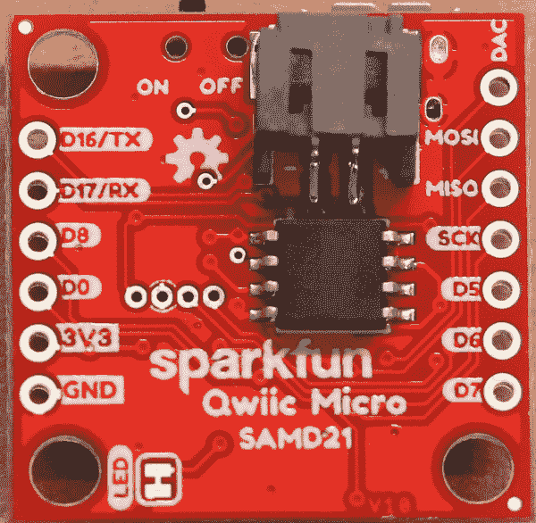](https://cdn.sparkfun.com/assets/learn_tutorials/9/1/7/BOTTOM_Optional_Circuitry.JPG)

### 电路板尺寸

该板采用标准的 1.0"x1.0 "正方形，与大多数支持 Qwiic 的传感器一样。由于电路板的尺寸，电路板的每个角上都有三个安装孔。拿一些[支架](https://www.sparkfun.com/products/10927)和[螺丝](https://www.sparkfun.com/products/10453)做一个 Qwiic 感应板塔！

[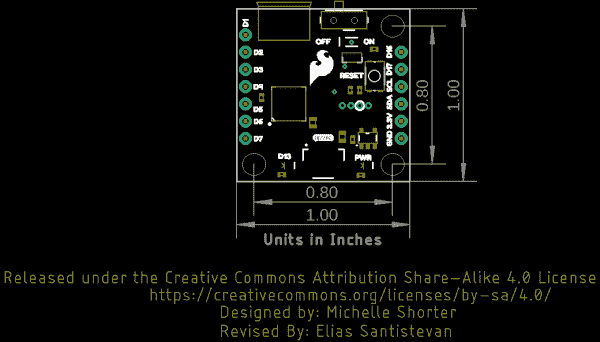](https://cdn.sparkfun.com/assets/learn_tutorials/9/1/7/SparkFun_Qwiic_Micro_SAMD21_Board_Dimensions.png)

## UF2 引导程序和驱动程序

**Heads up!** Please be aware that the SparkFun Qwiic Micro is **NOT currently supported on Windows 8** due to a lack of support drivers.

SparkFun Qwiic Micro 附带了一个 UF2 引导程序，它具有在 Windows 10、Mac 和 Linux 等现代操作系统上跳过驱动程序安装的独特优势！UF2 引导程序将 SparkFun Qwiic Micro 变成一个 USB 大容量存储设备，因此当你将其插入计算机时，它的行为就像一个闪存驱动器。然而，在 Arduino IDE 中，什么都不会改变:在上传代码时，您仍然会选择它的 COM 端口。

### ....是的，但是什么是 UF2 呢？

UF2 代表 USB 闪存格式，由微软为 PXT(现在称为 MakeCode)开发，用于在海量存储类(MSC)上闪存微控制器，就像可移动闪存驱动器一样。文件格式是独一无二的，所以不幸的是，您不能简单地将编译好的二进制或十六进制文件拖放到 Qwiic Micro 上。相反，除了数据本身之外，文件的格式还有额外的信息告诉处理器数据去了哪里。

对于 Arduino 用户来说，UF2 引导程序是兼容 BOSSA 的，这是 Arduino IDE 在 ATSAMD 板上所期望的。关于 UF2 的更多信息，你可以从[的 MakeCode 博客](https://makecode.com/blog/one-chip-to-flash-them-all)以及[的 UF2 文件格式规范](https://github.com/Microsoft/uf2)中了解更多。

### [Windows 7](#windows-7)

不幸的是，如果你使用的是 Windows 7 操作系统，你仍然需要使用 [SAMD Windows 7 安装程序](https://github.com/sparkfun/samd_windows7_installer/releases)安装 SAMD 驱动程序。前往 GitHub repo 安装可执行文件。否则跳到[设置 Arduino](https://learn.sparkfun.com/tutorials/sparkfun-qwiic-micro-samd21e-hookup-guide#setting-up-arduino) 。

[SAMD Windows 7 Installer](https://github.com/sparkfun/samd_windows7_installer/releases)

向下滚动页面至**最新版本**中的资产，并点击**。exe** 下载。版本号可能因版本而异。下图是*spark fun _ drivers _ 1 . 0 . 5 . 3 . exe*。

[](https://cdn.sparkfun.com/assets/learn_tutorials/9/1/7/Windows_7_SAMD_Drivers_Download_Versions.jpg)*Click on the image for a closer view.*

下载完成后，点击可执行文件，按照提示进行安装。尽管下图显示了 **v1.0.5.1** 的驱动程序，但安装步骤是相同的。

[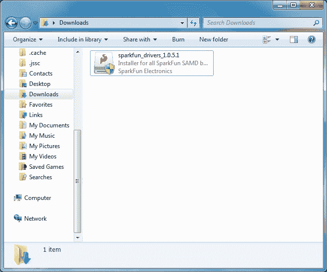](https://cdn.sparkfun.com/assets/learn_tutorials/4/5/4/Windows_7_SparkFun_SAMD_Driver_Executable.jpg)

您将收到来自 Windows 的警告。点击**是**继续。

[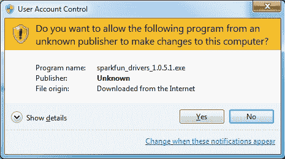](https://cdn.sparkfun.com/assets/learn_tutorials/4/5/4/Windows_7_Warning.jpg)

将弹出另一个窗口。通读许可证并点击“**我同意**”。

[](https://cdn.sparkfun.com/assets/learn_tutorials/4/5/4/Windows_7_Driver_Agreement.jpg)

准备好后，点击**安装**按钮。

[](https://cdn.sparkfun.com/assets/learn_tutorials/4/5/4/Windows_7_Driver_Agreement_Install.jpg)

将弹出另一个窗口。点击“**仍然安装该驱动程序软件**继续。

[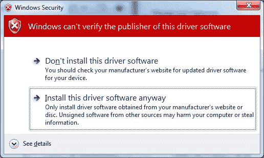](https://cdn.sparkfun.com/assets/learn_tutorials/4/5/4/Windows_7_SAMD_Drivers_Install_Anyway.jpg)

您的 Windows 7 将开始安装驱动程序。这需要几秒钟的时间。安装驱动程序后，点击“**关闭**按钮退出安装程序。

[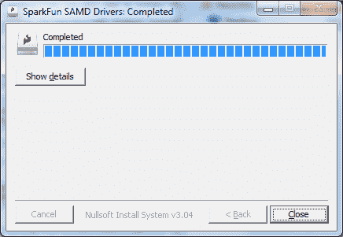](https://cdn.sparkfun.com/assets/learn_tutorials/4/5/4/Windows_7_Driver_Successful_Install.jpg)

## 设置 Arduino

虽然 SAMD21 本身就足够强大，但真正让它与众不同的是它在 Arduino IDE 中不断增加的支持。只需几次点击、复制和粘贴，您就可以将 ARM Cortex-M0+支持添加到您的 Arduino IDE 中。本页将列出将 SparkFun Qwiic Micro 安装到 Arduino IDE 中所需的每个步骤。

**更新 Arduino！**此设置要求*至少拥有* Arduino 版本 1.6.4 或更高版本。我们已经在 1.6.5 和最新版本 1.8.8 上测试过了。如果你运行的是旧版本的 Arduino，可以考虑访问 [arduino.cc](https://www.arduino.cc/en/Main/Software) 获取最新最好的版本。

### 安装 Arduino SAMD 插件板

首先，你需要安装各种工具，包括充满通用代码的[低级 ARM Cortex 库](http://www.arm.com/products/processors/cortex-m/cortex-microcontroller-software-interface-standard.php)、编译代码的 [arm-gcc](https://launchpad.net/gcc-arm-embedded) 和通过引导程序上传的 [bossa](http://www.shumatech.com/web/products/bossa) 。这些工具与 Arduino Zero 的 SAMD 板定义打包在一起。

要安装 Arduino SAMD 板定义，导航到您的板管理器(**工具** > **板** > **板管理器)...**)，然后找到 **Arduino SAMD 板(32 位 ARM Cortex-M0+)** 的入口。选中它，安装最新版本(最近更新到 *v1.8.4* )。

[](https://cdn.sparkfun.com/assets/learn_tutorials/4/5/4/arduino-arduino-board-install.png)

下载和安装工具可能需要几分钟——特别是 arm-gcc 将需要最长的时间，它大约有 250MB。

安装后，Arduino-blue“已安装”文本应该出现在 SAMD 主板列表条目的旁边。

### 安装 SparkFun 插件板

现在你的 ARM 工具已经安装好了，还需要最后一点设置来增加对 SparkFun SAMD 板的支持。首先，打开你的 Arduino 首选项(**文件** > **首选项**)。然后找到**附加董事会经理网址**文本框，并粘贴以下链接:

```
https://raw.githubusercontent.com/sparkfun/Arduino_Boards/main/IDE_Board_Manager/package_sparkfun_index.json 
```

[](https://cdn.sparkfun.com/assets/learn_tutorials/4/5/4/arduino-board-add.png)

然后点击“确定”，并返回到**电路板管理器**菜单。你应该(但可能不会)能够为 **SparkFun SAMD 板**找到一个新条目。如果看不到，请关闭纸板管理器，然后再次打开。 \_(ツ)_/。

[](https://cdn.sparkfun.com/assets/learn_tutorials/4/5/4/sparkfun-arduino-board-install.png)

这个安装应该快得多；在前面的部分中，您已经完成了繁重的工作。编写本教程时，本教程使用的板卡版本应该是 **v1.7.0** 。如果有任何更新，您可能会有更高版本的主板。

### 选择板和串行端口

一旦板安装完毕，你应该会在你的**工具** > **板**列表中看到一个新条目。**选择你的 SparkFun Qwiic Micro。**

最后，在电源开关处于打开位置的情况下，将板连接到计算机时，选择 SparkFun Qwiic Micro 的**端口**。导航回到**工具** > **端口**菜单。端口菜单将有 SparkFun Qwiic Micro 的端口，在这里如此标注。在 Windows 机器上，串行端口应该以“ **COM#** 的形式出现。在 Mac 或 Linux 机器上，端口看起来像“ **/dev/cu.usbmodem####** ”。

[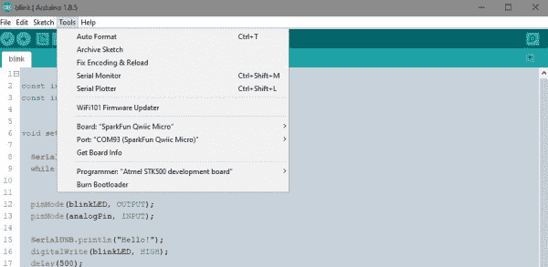](https://cdn.sparkfun.com/assets/learn_tutorials/9/1/7/Selecting_BOARD_and_COM_PORT.JPG)

上图中我的 Qwiic Micro 列在 **COM93** 下；这是因为我已经在我的电脑上插了差不多一样多的微控制器，但是你的端口菜单上的那个应该小很多。

## 示例 1:眨眼

这里有一个快速的例子草图，可以在 SparkFun Qwiic Micro 上获得 Arduino 闪烁的标志性蓝色 stat LED 只需从下面复制粘贴，然后点击上传！

```
language:c
const int LED = 13; // Blue "stat" LED on pin 13

void setup() 
{
  pinMode(LED, OUTPUT); //set pin as output
  digitalWrite(LED, LOW); //turn LED off
}

void loop() 
{

  digitalWrite(LED, HIGH); // Blue LED on
  delay(250);
  digitalWrite(LED, LOW); // Blue LED off
  delay(250);
} 
```

现在您已经通过了 Arduino litmus 测试，您已经准备好开始构建您的第一个项目了。如果你还没有，去看看我们的 [Qwiic 生态系统](www.sparkfun.com/qwiic)，它可以让你轻松连接传感器和其他设备，而无需焊接。

| [](https://www.sparkfun.com/qwiic) |

此外，这个生态系统中的每个附加板都有一个库，可以让您立即开始使用。例如，你想用你的 SparkFun Qwiic Micro 打开一盏[灯](https://www.sparkfun.com/products/15093)，更好的是四盏[灯](https://www.sparkfun.com/products/15102)，或者也许你想看看你的植物得到多少[光](https://www.sparkfun.com/products/15436)？查看任何标有 Arduino、sensor 和 Qwiic 的教程，了解更多想法！

[](https://learn.sparkfun.com/tutorials/qwiic-pro-kit-project-guide) [### Qwiic Pro 套件项目指南](https://learn.sparkfun.com/tutorials/qwiic-pro-kit-project-guide) The Qwiic Pro Kit was designed to allow users to get started with Arduino without the need for soldering or a breadboard. We've included three inputs (a joystick, accelerometer, and proximity sensor) and one display that can be daisy chained to the RedBoard Turbo (SAMD21) Development Board.[Favorited Favorite](# "Add to favorites") 2[](https://learn.sparkfun.com/tutorials/assembly-guide-for-sparkfun-jetbot-ai-kit) [### SparkFun JetBot AI 套件的组装指南](https://learn.sparkfun.com/tutorials/assembly-guide-for-sparkfun-jetbot-ai-kit) Assembly Guide for the SparkFun JetBot AI Kit. This tutorial includes photos & comments to assemble the two-layer chassis & additional components unique to the JetBot kit.[Favorited Favorite](# "Add to favorites") 3[](https://learn.sparkfun.com/tutorials/micromod-gnss-carrier-board-zed-f9p-hookup-guide) [### MicroMod GNSS 载板(ZED-F9P)连接指南](https://learn.sparkfun.com/tutorials/micromod-gnss-carrier-board-zed-f9p-hookup-guide) Easily switch between Processor Boards using the MicroMod ecosystem and get precision down to the diameter of a dime with the ZED-F9P from u-blox using the MicroMod GNSS Carrier Board 0[](https://learn.sparkfun.com/tutorials/sound-location-part-2-with-the-qwiic-sound-trigger-and-the-u-blox-zed-f9x) [### 声音定位第 2 部分，带 Qwiic 声音触发器和 u-blox ZED-F9x](https://learn.sparkfun.com/tutorials/sound-location-part-2-with-the-qwiic-sound-trigger-and-the-u-blox-zed-f9x) [Favorited Favorite](# "Add to favorites") 2

## 示例 2:串行端口

SAMD21 最令人兴奋的特性之一是 SERCOM——它有多个可配置的串行端口。默认情况下，Arduino IDE 为 SAMD21 配备了一个硬件串行端口，外加一个“USB 串行端口”,用于串行监视器之间的通信。

每个串行端口都有一个独特的`Serial`对象，您将在代码中引用它:

| 串行对象 | 串行端口 | RX 引脚 | TX 引脚 |
| `SerialUSB` | USB 串行(串行监视器) |  |  |
| `Serial` | 硬件串行端口 | D17 | D16 |

这里有几件重要的事情需要注意。首先，如果你试图使用串行监视器来调试，你需要使用`SerialUSB.begin(<baud>)`和`SerialUSB.print()`。(谢天谢地，find/replace 的存在是为了调整示例代码。)你也可以在小品开头加 `#define Serial SerialUSB` 。这将告诉 IDE 在编译之前，用“SerialUSB”替换它看到的所有“Serial”。

这里有一个简单的例子，展示了[串行监视器](https://learn.sparkfun.com/tutorials/terminal-basics/arduino-serial-monitor-windows-mac-linux)和`Serial`之间的区别。它设计用于将数据从`Serial`发送到串行监视器，反之亦然。

```
language:c
void setup()
{
  SerialUSB.begin(9600); // Initialize Serial Monitor USB
  Serial.begin(9600); // Initialize hardware serial port, pins 17/16

  while (!SerialUSB) ; // Wait for Serial monitor to open

  // Send a welcome message to the serial monitor:
  SerialUSB.println("Send character(s) to relay it over Serial");
}

void loop()
{
  if (SerialUSB.available()) // If data is sent to the monitor
  {
    String toSend = ""; // Create a new string
    while (SerialUSB.available()) // While data is available
    {
      // Read from SerialUSB and add to the string:
      toSend += (char)SerialUSB.read();
    }
    // Print a message stating what we're sending:
    SerialUSB.println("Sending " + toSend + " to Serial");

    // Send the assembled string out over the hardware
    // Serial port (TX pin 1).
    Serial.print(toSend);
  }

  if (Serial.available()) // If data is sent from device
  {
    String toSend = ""; // Create a new string
    while (Serial.available()) // While data is available
    {
      // Read from hardware port and add to the string:
      toSend += (char)Serial.read();
    }
    // Print a message stating what we've received:
    SerialUSB.println("Received " + toSend + " from Serial");
  }
} 
```

然后尝试在串行监视器中键入一些内容。即使没有连接到硬件串行端口，您也应该看到您输入的内容会得到回应。它看起来应该与下图类似，类似于 SAMD21 分线点。

[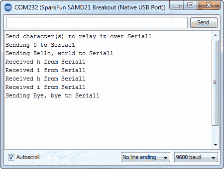](https://cdn.sparkfun.com/assets/learn_tutorials/4/5/4/serial-monitor-example.png)**Note:** Not seeing any serial data?! If you reset the board while the Arduino Serial Monitor is open, you may need to close the window, check that you have selected the correct COM port, and then reopen the Arduino Serial Monitor. As a last resort, try closing the Arduino IDE and reopening the program before opening the Arduino Serial Monitor again.

您可以通过将一个 [3.3V FTDI Basic](https://www.sparkfun.com/products/9873) 或任何其他串行设备连接到 SAMD21 的引脚 17 (RX)和 16 (TX)来进一步测试该草图。你将需要 [IC 挂钩](https://www.sparkfun.com/products/9741)进行快速临时连接。否则，你需要将引脚或电线焊接到电路板上。通过打开一个[串行终端](https://learn.sparkfun.com/tutorials/terminal-basics/tera-term-windows)，任何从 FTDI 发送的数据都应该在你的 Arduino 串行监视器中结束，并且发送到你的 Arduino 串行监视器的数据将路由到 FTDI。下面的表格显示了哪些引脚需要连接在一起。

| Qwiic 微型引脚 | 3.3V FTDI(或任何 USB 转串行转换器)引脚 |
| D16/TX | RXI |
| D17/RX | TXO |
| GND | GND |

## 示例 3:模拟输入和输出

虽然 SAMD21 仍具有基于 PWM 的“模拟输出”，但它还具有数模转换器(DAC)形式的真模拟输出。该模块可以产生 0 到 3.3V 之间的模拟电压。它可以用来产生更自然的声音，或作为一种“数字电位计”来控制模拟设备。

DAC 仅在 **Arduino 引脚 A0** 上可用，并通过`analogWrite(A0, <value>)`控制。DAC 可以设置为 10 位分辨率(确保在您的设置中调用[analogWriteResolution(10)](https://www.arduino.cc/en/Reference/AnalogWriteResolution))，这意味着 0 到 1023 之间的值会将电压设置为 0 到 3.3V 之间的某个值

除了 DAC，SAMD21 的 ADC 通道也不同于 ATmega328:它们配备了高达 **12 位分辨率**。这意味着模拟输入值的范围可以是 0-4095，代表 0 到 3.3V 之间的电压。要在 12 位模式下使用 ADC，请确保在设置中调用 [analogReadResolution(12)](https://www.arduino.cc/en/Reference/AnalogReadResolution) 。

### DAC 串行图

The **Serial Plotter** in this example requires Arduino 1.6.6 or later. Visit [arduino.cc](https://www.arduino.cc/en/Main/Software) to get the latest, greatest version.

下面的例子演示了 10 位 DAC 和 12 位 ADC。为了设置实验，**用跳线将 A0 连接到 A1**-我们用模拟电压驱动 A0，然后用 A1 读取。为了保持电路板尺寸最小，我们无法为每个引脚的功能添加额外的标签。因此， **A0** 被标注为 **D1/DAC** ，而 **A1** 被标注为 **D2** 。由于没有焊接接头，您需要用拇指和食指将跳线固定到位，以便进行临时连接。这是我们在教程中介绍过的最简单的电路:

[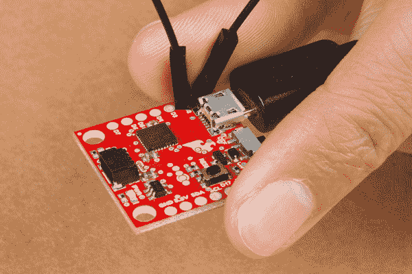](https://cdn.sparkfun.com/assets/learn_tutorials/9/1/7/Qwiic-Micro_Analog-Input-Output-Jumper.jpg)*Jumping a temporary connection between A0 (our DAC) and A1\. On the board, A0 is labeled D1 and A1 is labeled as D2.*

然后将下面的代码复制粘贴到你的 Arduino IDE 中，并上传！

```
language:c
// Connect A0 to A1, then open the Serial Plotter.

#define DAC_PIN A0 // Make code a bit more legible

float x = 0; // Value to take the sin of
float increment = 0.02;  // Value to increment x by each time
int frequency = 440; // Frequency of sine wave

void setup() 
{
  analogWriteResolution(10); // Set analog out resolution to max, 10-bits
  analogReadResolution(12); // Set analog input resolution to max, 12-bits

  SerialUSB.begin(9600);
}

void loop() 
{
  // Generate a voltage value between 0 and 1023\. 
  // Let's scale a sin wave between those values:
  // Offset by 511.5, then multiply sin by 511.5.
  int dacVoltage = (int)(511.5 + 511.5 * sin(x));
  x += increment; // Increase value of x

  // Generate a voltage between 0 and 3.3V.
  // 0= 0V, 1023=3.3V, 512=1.65V, etc.
  analogWrite(DAC_PIN, dacVoltage);

  // Now read A1 (connected to A0), and convert that
  // 12-bit ADC value to a voltage between 0 and 3.3.
  float voltage = analogRead(A1) * 3.3 / 4096.0;
  SerialUSB.println(voltage); // Print the voltage.
  delay(1); // Delay 1ms
} 
```

这张草图在 A0 上产生一个正弦波输出，其值范围为 0 至 3.3V，然后使用 A1 将该输出读入其 12 位 ADC，并将其转换为 0 至 3.3V 之间的电压。

当然，您可以打开串行监视器来查看电压值流。但如果正弦波很难通过文本可视化，请通过前往**工具** > **串行绘图仪**来检查 Arduino 的新**串行绘图仪**。

[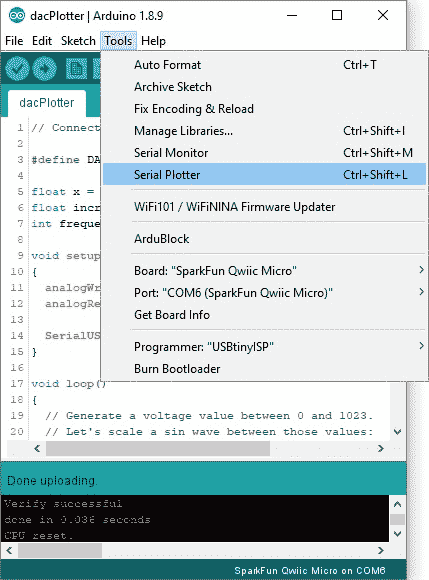](https://cdn.sparkfun.com/assets/learn_tutorials/9/1/7/Arduino_Serial_Plotter.jpg)

感受正弦波的威严。由于我们暂时用手指将跳线固定在适当的位置，因此每当您释放跳线上的压力时，正弦波可能并不完美。

[](https://cdn.sparkfun.com/assets/learn_tutorials/9/1/7/Arduino_SAMD21_DAC_Serial_Plotter.jpg)

## 示例 4:带 SPIMemory 的闪存

**Note:** As stated in the Hardware Overview, you will need to [solder](https://learn.sparkfun.com/tutorials/how-to-solder-through-hole-soldering) a flash memory IC to the board in order to follow along with this example!

[](https://www.sparkfun.com/products/15809) 

将**添加到您的[购物车](https://www.sparkfun.com/cart)中！**

### [](https://www.sparkfun.com/products/15809)

[In stock](https://learn.sparkfun.com/static/bubbles/ "in stock") COM-15809

W25Q32FV (32M 位)串行闪存为空间、引脚和电源有限的系统提供存储解决方案。

$1.95[Favorited Favorite](# "Add to favorites") 4[Wish List](# "Add to wish list")** **### 安装 SPI 存储器 Arduino 库

**Note:** If you have not previously installed an Arduino library, please check out our [installation guide.](https://learn.sparkfun.com/tutorials/installing-an-arduino-library)

以下示例向您展示了开始向可选闪存写入信息的基本方法，该闪存可以焊接到 SparkFun Qwiic Micro 的底部。该示例简单地向您展示了如何设置代码来与闪存芯片交互，并通过向芯片上的地址空间写入一个数字来演示这一点。

首先，你需要下载并安装 SPIMemory Arduino 库。你可以直接从 [GitHub Repo](https://github.com/Marzogh/SPIMemory) 下载，或者从下面的按钮下载 zip。如果你以前从未安装过库，那么请跟随我们有用的教程[这里](https://learn.sparkfun.com/tutorials/installing-an-arduino-library/all)来获得如何安装的指导。

[SPI Memory Arduino Library (ZIP)](https://github.com/Marzogh/SPIMemory/archive/master.zip)

### 示例代码

该设置与库提供的示例代码略有不同，因为 flash 连接到一个单独的 SPI 总线，该总线不同于默认连接到 SparkFun Qwiic Micro 头部的总线。在顶部，我们通过调用`SPIFlash`来使用这个库，并创建这个库的一个实例，将其命名为`flash`。`Flash`接受*两个*参数:闪存芯片的片选引脚，其次是要使用的备用 SPI 端口。由于内存芯片在 **SPI1** 上，我们给它起这个名字，但在它前面加一个&符号，如所示:`&SPI1`。

```
language:c
#include "SPIMemory.h"

const int blinkLED = 13; 
const int flashCS = 21; // Chip select for Flash

SPIFlash flash(flashCS, &SPI1); // Our Flash is on a different SPI bus

unsigned long addr = 0x01; // Random selection
byte data = 0x03; // Random data 
```

在设置中，用`SPI1.begin()`确认我们启用了 SPI1 总线，这就是你所需要的！接下来，我们擦除将要写入的地址，然后写入。我们通过将该地址读取到串行监视器来再次检查这是否正确。只要确保将波特率设置为 **115200** 即可查看输出。

```
language:c
void setup(){

    SPI1.begin(); // Don't forget to begin SPI! 
    flash.begin();
    SerialUSB.begin(115200);
    while(!SerialUSB) {} // Wait until the Serial Port is opened. 
    SerialUSB.println("Hello!");

    if(flash.eraseBlock32K(addr)){ // Erase the blacok
        SerialUSB.println("Block erased.");
    }
    else
        SerialUSB.println("Error.");

    if(flash.writeByte(addr, data, true)){
        SerialUSB.println("Written: ");
        SerialUSB.println(flash.readByte(addr));
    }
    else
        SerialUSB.println("Nothing written");

    }

void loop(){

    digitalWrite(blinkLED, HIGH);
    delay(500);
    digitalWrite(blinkLED, LOW);
    delay(500);

} 
```

## CircuitPython

CircuitPython 是 Adafruit 的 MicroPython 版本。我们在 SparkFun 喜欢它，因为它支持基于 SAMD 的微控制器。如果您不熟悉 CircuitPython，那么我鼓励您查看 Adafruit 的网站以获得更多信息。

我们在 Qwiic Micro 的[硬件报告](https://github.com/sparkfun/SparkFun_Qwiic_Micro_SAMD21E/tree/main/Firmware/Circuit%20Python%20Firmware/Firmware_no_flash)中为 Qwiic Micro 提供了两种不同的 CircuitPython 版本，一种适用于那些焊接了 SparkFun 上出售的闪存芯片的人，另一种适用于那些没有闪存芯片的人。您也可以通过单击下面相应的按钮来获得这两个固件 zip 文件。如果你不熟悉可选的闪存芯片，你可以添加到 SparkFun Qwiic Micro，回到[硬件概述](https://learn.sparkfun.com/tutorials/sparkfun-qwiic-micro-samd21e-hookup-guide#hardware-overview)看一看。

[CircuitPython Firmware **NO** flash](https://cdn.sparkfun.com/assets/learn_tutorials/9/1/7/Firmware_no_flash.zip)[CircuitPYthon Firmware **WITH** flash](https://cdn.sparkfun.com/assets/learn_tutorials/9/1/7/Firmware_with_flash.zip )

在压缩文件中有三个不同的文件，它们都做同样的事情。其中一个文件有一个 **.uf2** 的文件扩展名，它被设计成与 [UF2 引导加载程序](https://learn.sparkfun.com/tutorials/sparkfun-qwiic-micro-samd21e-hookup-guide#uf2-bootloader-and-drivers)一起工作。在下一节中，我们将重点介绍使用这种方法安装 CircuitPython。

## 安装 CircuitPython

当你把 SparkFun Qwiic Micro 插入电脑时，它应该会弹出一个标题为 **Qwiic Micro** 的窗口，如下图所示。如果没有，请按两次重置按钮。

[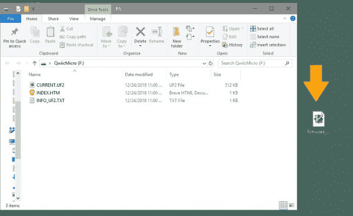](https://cdn.sparkfun.com/assets/learn_tutorials/9/1/7/Qwiic_Micro_UF2_Firmware.JPG)

在 SparkFun Qwiic 微弹出窗口的右边是来自压缩文件的**固件**文件夹的**固件 _no_flash.uf2** 文件，该文件将安装 CircuitPython。同样，如果你焊接了闪存芯片，那么你将选择**固件 _with_flash.uf2** 文件。要安装该文件，只需将 **.uf2** 从桌面拖到 SparkFun Qwiic 微窗口中。车窗应关闭并重新打开，但这一次其标题为**电路**。

[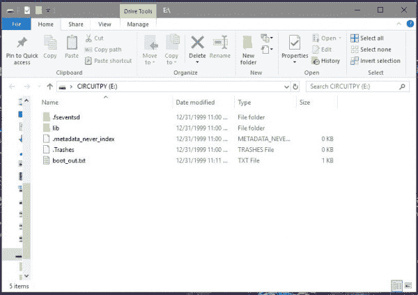](https://cdn.sparkfun.com/assets/learn_tutorials/9/1/7/Installed_CircuitPYthon.JPG)

就是这样！

## 重新安装 CircuitPython

如果你已经安装了 CircuitPython，但决定使用 Arduino，但后来又决定再次使用 CircuitPython(下定决心)，那么使用以下说明将 CircuitPython 重新安装到 SparkFun Qwiic Micro 上。我假设您知道从哪里获得 CircuitPython 固件文件，因为您必须按照说明安装 CircuitPython 才能达到这一步。*提示:在上面的[安装电路 Python](https://learn.sparkfun.com/tutorials/sparkfun-qwiic-micro-samd21e-hookup-guide#installing-circuitpython) 部分有。*

### 将主板重置为引导加载程序

我们希望主板重置为 UF2 引导程序(如上面提到的[)，使主板能够像闪存驱动器一样工作。将 SparkFun Qwiic Micro 插入电脑后，*双击*点击重置按钮。如果操作正确，电路板将弹出一个名为 **Qwiic Micro** 的可移动驱动器，D13 LED 将有一个缓慢的呼吸模式。现在只需要把 **.uf2** 电路 Python 文件拖到 Qwiic 微窗口就可以了。它将关闭并在一个名为 **CIRCUITPY** 的窗口中重新打开。](https://learn.sparkfun.com/tutorials/sparkfun-qwiic-micro-samd21e-hookup-guide#uf2-bootloader-and-drivers)

## 使用 CircuitPython

如果这是你第一次涉足 CircuitPython，那么我强烈建议你访问 Adafruit 的网站来了解 CircuitPython 的一切。

[What is CircuitPython?](https://learn.adafruit.com/welcome-to-circuitpython/what-is-circuitpython)

## 解决纷争

有关故障排除技巧，请点击此处查看 [SAMD21 故障排除指南](https://learn.sparkfun.com/tutorials/samd21-minidev-breakout-hookup-guide/troubleshooting)，了解在将 SAMD21 与 Arduino 配合使用时可能遇到的常见问题。唯一的例外是 Qwiic Micro 不需要驱动程序，因此重新安装驱动程序的提示将不适用。

[SAMD21 Mini/Dev Breakout Hookup Guide: Troubleshooting](https://learn.sparkfun.com/tutorials/samd21-minidev-breakout-hookup-guide/troubleshooting)

## 资源和更进一步

无论您是在寻找数据手册、原理图还是设计文件，都有丰富的信息。其他资源，以下是一些您可能会觉得方便的链接:

*   **SparkFun Qwiic 微设计资源**

    *   [示意图(PDF)](https://cdn.sparkfun.com/assets/4/f/a/1/4/SparkFun_Qwiic_Micro-SAMD21_Schematic.pdf)
    *   [鹰(ZIP)](https://cdn.sparkfun.com/assets/2/1/0/8/d/SparkFun_Qwiic_Micro_SAMD21E.zip)
    *   [图形数据表](https://cdn.sparkfun.com/assets/7/e/f/d/5/Qwiic_Micro_Graphical_Datasheet.pdf)
    *   [电路板尺寸](https://cdn.sparkfun.com/assets/learn_tutorials/9/1/7/SparkFun_Qwiic_Micro_SAMD21_Board_Dimensions.png)
    *   开源代码库
        *   [Arduino 板卡定义](https://github.com/sparkfun/Arduino_Boards)
        *   [SAMD Windows 7 安装程序](https://github.com/sparkfun/samd_windows7_installer/releases)
        *   [产品存储库](https://github.com/sparkfun/SparkFun_Qwiic_Micro_SAMD21E)
*   **CircuitPython**
    *   [什么是 CircuitPython？](https://learn.adafruit.com/welcome-to-circuitpython/what-is-circuitpython)
    *   [CircuitPython API 参考](https://circuitpython.readthedocs.io/en/3.x/docs/index.html) -所有 CircuitPython API 的详尽文档中心。
    *   [CircuitPython GitHub 库](https://github.com/adafruit/circuitpython)——所有 CircuitPython 相关源代码和工具的大本营。
    *   [构建 CircuitPython 教程](https://learn.adafruit.com/building-circuitpython/introduction)——如果你想构建自己的 CircuitPython 变体，不妨读一下这篇文章。
*   **ATmel ATSAMD21 资源**
    *   [Atmel ATSAMD21G18A 产品页面](http://www.atmel.com/devices/ATSAMD21G18.aspx)
    *   [ATSAMD21 概要数据表](http://www.atmel.com/Images/Atmel-42181-SAM-D21_Summary.pdf)
    *   [ATSAMD21 完整数据表](https://cdn.sparkfun.com/assets/4/c/9/e/f/SAMD21-Family-DataSheet-DS40001882D.pdf)
*   **Arduino ATSAMD21 资源**
    *   [SAMD Arduino 核心 GitHub 库](https://github.com/arduino/ArduinoCore-samd)
*   [SFE 产品展示区](https://www.youtube.com/watch?v=LshhFp_VKf8)

关于为基于 SAMD 的主板添加更多 SERCOM 端口的更多信息，请查看下面的教程。

[](https://learn.sparkfun.com/tutorials/adding-more-sercom-ports-for-samd-boards) [### 为 SAMD 板添加更多 SERCOM 端口

#### 2019 年 2 月 4 日](https://learn.sparkfun.com/tutorials/adding-more-sercom-ports-for-samd-boards) How to setup extra SPI, UART, and I2C serial ports on a SAMD-based boards.[Favorited Favorite](# "Add to favorites") 1

这是一个勇敢的新世界——Arduinos 和 ARMs 一起工作！你打算用你强大的 Qwiic Micro 创造什么？寻找一些灵感，看看这些教程！

[](https://learn.sparkfun.com/tutorials/installing-an-arduino-library) [### 安装 Arduino 库](https://learn.sparkfun.com/tutorials/installing-an-arduino-library) How do I install a custom Arduino library? It's easy! This tutorial will go over how to install an Arduino library using the Arduino Library Manager. For libraries not linked with the Arduino IDE, we will also go over manually installing an Arduino library.[Favorited Favorite](# "Add to favorites") 22[](https://learn.sparkfun.com/tutorials/using-github-to-share-with-sparkfun) [### 使用 GitHub 与 SparkFun 分享](https://learn.sparkfun.com/tutorials/using-github-to-share-with-sparkfun) A simple step-by-step tutorial to help you download files from SparkFun's GitHub site, make changes, and share the changes with SparkFun.[Favorited Favorite](# "Add to favorites") 12[](https://learn.sparkfun.com/tutorials/data-types-in-arduino) [### Arduino 中的数据类型](https://learn.sparkfun.com/tutorials/data-types-in-arduino) Learn about the common data types and what they signify in the Arduino programming environment.[Favorited Favorite](# "Add to favorites") 38[](https://learn.sparkfun.com/tutorials/sparkfun-as3935-lightning-detector-hookup-guide-v20) [### SparkFun AS3935 闪电探测器连接指南(v20)](https://learn.sparkfun.com/tutorials/sparkfun-as3935-lightning-detector-hookup-guide-v20) Are you worried about the looming clouds in the distance, how far away is that storm exactly? Add lightning detection with the AS3935 to your next weather station or your next bike ride 2**************************************