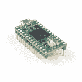
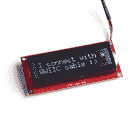
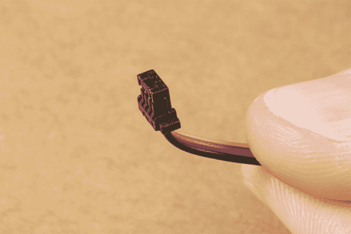

# SparkFun Qwiic 盾青少年连接指南

> 原文：<https://learn.sparkfun.com/tutorials/sparkfun-qwiic-shield-for-teensy-hookup-guide>

## 介绍

面向青少年的[spark fun Qwiic Shield](https://www.sparkfun.com/products/17119)和面向青少年扩展的[spark fun Qwiic Shield](https://www.sparkfun.com/products/17156)提供了一种易于组装的方式来将 SparkFun [Qwiic](https://www.sparkfun.com/qwiic) 生态系统添加到[青少年](https://www.sparkfun.com/categories/267)开发板。这两个屏蔽连接你的 Teensy 到四个 SparkFun Qwiic 连接器上的 I ² C 总线(GND、3.3V、SDA 和 SCL)。Qwiic 生态系统允许轻松的菊花链，因此，只要您的设备位于不同的地址，您就可以连接任意数量的 Qwiic 设备。

 

将**添加到您的[购物车](https://www.sparkfun.com/cart)中！**

**[In stock](https://learn.sparkfun.com/static/bubbles/ "in stock") DEV-17119

这个盾提供了一个简单的方法，用你的 Teensy 4.0，3.2 或 LC 板的足迹来点燃 Fun 的 Qwiic 生态系统。

$4.25 $2.551[Favorited Favorite](# "Add to favorites") 4[Wish List](# "Add to wish list")**** 

将**添加到您的[购物车](https://www.sparkfun.com/cart)中！**

### [SparkFun Qwiic 青少年神盾局](https://www.sparkfun.com/products/17156)

[In stock](https://learn.sparkfun.com/static/bubbles/ "in stock") DEV-17156

这个盾提供了一个简单的方法来 SparkFun 的 Qwiic 生态系统与你的 Teensy 4.1，3.6 或 3.5 板的足迹。

$4.75[Favorited Favorite](# "Add to favorites") 4[Wish List](# "Add to wish list")**** ****[https://www.youtube.com/embed/ssl2-zY6QSc/?autohide=1&border=0&wmode=opaque&enablejsapi=1](https://www.youtube.com/embed/ssl2-zY6QSc/?autohide=1&border=0&wmode=opaque&enablejsapi=1)

### 所需材料

按照本教程，您将需要一个小型开发板，具有“标准”或“扩展”外形。这里是兼容板的集合。注意，他们中的一些带有预先填充的标题，所以当考虑在你的盾上填充哪个标题时要记住这一点。

 

将**添加到您的[购物车](https://www.sparkfun.com/cart)中！**

### [Teensy 4.1](https://www.sparkfun.com/products/16771)

[Out of stock](https://learn.sparkfun.com/static/bubbles/ "out of stock") DEV-16771

Teensy 4.1 采用 600MHz 的 ARM Cortex-M7 处理器，比 4.0 大 4 倍的闪存，以及可选的 local…

$31.507[Favorited Favorite](# "Add to favorites") 25[Wish List](# "Add to wish list")**** 

将**添加到您的[购物车](https://www.sparkfun.com/cart)中！**

### [Teensy 4.0](https://www.sparkfun.com/products/15583)

[Out of stock](https://learn.sparkfun.com/static/bubbles/ "out of stock") DEV-15583

Teensy 4.0 是最新的 Teensy，在 1.4×0.7 英寸的 Teensy 中提供了最快的微控制器和强大的外设…

$23.8012[Favorited Favorite](# "Add to favorites") 48[Wish List](# "Add to wish list")**** 

将**添加到您的[购物车](https://www.sparkfun.com/cart)中！**

### [【Teensy 4.1】](https://www.sparkfun.com/products/16996)

[Out of stock](https://learn.sparkfun.com/static/bubbles/ "out of stock") DEV-16996

带接头的 Teensy 4.1 采用 600MHz 的 ARM Cortex-M7 处理器，比 4.0 大 4 倍的闪存，以及可选的…

$35.953[Favorited Favorite](# "Add to favorites") 14[Wish List](# "Add to wish list")**** 

将**添加到您的[购物车](https://www.sparkfun.com/cart)中！**

### Teensy 4.0(标题)

[Out of stock](https://learn.sparkfun.com/static/bubbles/ "out of stock") DEV-16997

带接头的 Teensy 4.0 以 1.4×0.7 英寸的外形尺寸提供了最快的微控制器和强大的外设…

$26.80[Favorited Favorite](# "Add to favorites") 7[Wish List](# "Add to wish list")******** ********Qwiic Shield 包括一组可堆叠的接头，以适应 Teensy 的尺寸，但您可能还需要一些接头来焊接到您的 Teensy。或者，如果您喜欢为您的屏蔽组件使用另一种接头类型，我们在下面列出了几个选项:

 

将**添加到您的[购物车](https://www.sparkfun.com/cart)中！**

### [破开头球——直击](https://www.sparkfun.com/products/116)

[In stock](https://learn.sparkfun.com/static/bubbles/ "in stock") PRT-00116

一排标题-打破适应。40 个引脚，可切割成任何尺寸。用于定制 PCB 或通用定制接头。

$1.7520[Favorited Favorite](# "Add to favorites") 133[Wish List](# "Add to wish list")**** 

将**添加到您的[购物车](https://www.sparkfun.com/cart)中！**

### [女标题](https://www.sparkfun.com/products/115)

[In stock](https://learn.sparkfun.com/static/bubbles/ "in stock") PRT-00115

单排 40 孔，内螺纹接头。可以用一把钢丝钳切割成合适的尺寸。标准 0.1 英寸间距。我们广泛使用它们…

$1.758[Favorited Favorite](# "Add to favorites") 71[Wish List](# "Add to wish list")**** 

将**添加到您的[购物车](https://www.sparkfun.com/cart)中！**

### [少年头球套件](https://www.sparkfun.com/products/13925)

[In stock](https://learn.sparkfun.com/static/bubbles/ "in stock") PRT-13925

每个接头套件使您的 Teensy 4.0、3.2 和 LC 试验板兼容，并允许堆叠 Teensy 和 Teensy-…

$1.50[Favorited Favorite](# "Add to favorites") 22[Wish List](# "Add to wish list")************Now you probably would not want the Qwiic Shield for Teensy if you didn't have any Qwiic products to use with it, right? Well, if you don't have any Qwiic products, the following might not be a bad place to start: 

将**添加到您的[购物车](https://www.sparkfun.com/cart)中！**

### [【spark fun GPS Breakout-NEO-M9N，U.FL (Qwiic)](https://www.sparkfun.com/products/15712)

[In stock](https://learn.sparkfun.com/static/bubbles/ "in stock") GPS-15712

SparkFun NEO-M9N GPS Breakout 是一款高质量的 GPS 板，具有同样令人印象深刻的配置选项。

$69.954[Favorited Favorite](# "Add to favorites") 12[Wish List](# "Add to wish list")**** 

将**添加到您的[购物车](https://www.sparkfun.com/cart)中！**

### [kickfunk 16x2 心脏液晶屏- RGB 文本(qwiic)T3](https://www.sparkfun.com/products/16397)

[In stock](https://learn.sparkfun.com/static/bubbles/ "in stock") LCD-16397

SparkFun Qwiic SerLCD 是一款支持串行的 LCD，为在……上添加 16x2 RGB 提供了一个简单且经济高效的解决方案

$21.505[Favorited Favorite](# "Add to favorites") 12[Wish List](# "Add to wish list")**** 

将**添加到您的[购物车](https://www.sparkfun.com/cart)中！**

### [SparkFun Qwiic 电机驱动器](https://www.sparkfun.com/products/15451)

[In stock](https://learn.sparkfun.com/static/bubbles/ "in stock") ROB-15451

SparkFun Qwiic 电机驱动器采用了串行控制电机驱动器的所有功能，并将其小型化，增加了 Qw…

$19.501[Favorited Favorite](# "Add to favorites") 28[Wish List](# "Add to wish list")**** 

将**添加到您的[购物车](https://www.sparkfun.com/cart)中！**

### 

[In stock](https://learn.sparkfun.com/static/bubbles/ "in stock") DEV-15573

SparkFun ATECC508A 加密协处理器突破允许您为您的物联网节点、edge d……

$5.95[Favorited Favorite](# "Add to favorites") 19[Wish List](# "Add to wish list")******** ********您将需要一些我们的 Qwiic 电缆来连接您的设备和屏蔽。以下是几个选项:

 

将**添加到您的[购物车](https://www.sparkfun.com/cart)中！**

### [Qwiic 线缆- 100mm](https://www.sparkfun.com/products/14427)

[In stock](https://learn.sparkfun.com/static/bubbles/ "in stock") PRT-14427

这是一条 100 毫米长的 4 芯电缆，带有 1 毫米 JST 端接。它旨在将支持 Qwiic 的组件连接在一起…

$1.50[Favorited Favorite](# "Add to favorites") 32[Wish List](# "Add to wish list")**** 

将**添加到您的[购物车](https://www.sparkfun.com/cart)中！**

### [Qwiic 线缆- 500mm](https://www.sparkfun.com/products/14429)

[In stock](https://learn.sparkfun.com/static/bubbles/ "in stock") PRT-14429

这是一根 500mm 长的 4 芯电缆，带有 1mm JST 端接。它旨在将支持 Qwiic 的组件连接在一起…

$1.951[Favorited Favorite](# "Add to favorites") 25[Wish List](# "Add to wish list")**** 

将**添加到您的[购物车](https://www.sparkfun.com/cart)中！**

### [Qwiic 线缆- 50mm](https://www.sparkfun.com/products/14426)

[In stock](https://learn.sparkfun.com/static/bubbles/ "in stock") PRT-14426

这是一根 50 毫米长的 4 芯电缆，带有 1 毫米 JST 端接。它旨在将支持 Qwiic 的组件连接在一起…

$0.95[Favorited Favorite](# "Add to favorites") 29[Wish List](# "Add to wish list")**** 

### [Qwiic 线缆- 200mm](https://www.sparkfun.com/products/14428)

[Out of stock](https://learn.sparkfun.com/static/bubbles/ "out of stock") PRT-14428

这是一根 200 毫米长的 4 芯电缆，带有 1 毫米 JST 端接。它旨在将支持 Qwiic 的组件连接在一起…

[Favorited Favorite](# "Add to favorites") 21[Wish List](# "Add to wish list")****** ******最后，如果您想使用非 Qwiic I ² C 设备，这些适配器有助于将其转换为 Qwiic 连接器:

 

将**添加到您的[购物车](https://www.sparkfun.com/cart)中！**

### [SparkFun Qwiic 适配器](https://www.sparkfun.com/products/14495)

[In stock](https://learn.sparkfun.com/static/bubbles/ "in stock") DEV-14495

SparkFun Qwiic 适配器提供了将任何旧 I ² C 板改造成支持 Qwiic 的板的完美方法。

$1.601[Favorited Favorite](# "Add to favorites") 53[Wish List](# "Add to wish list")**** 

将**添加到您的[购物车](https://www.sparkfun.com/cart)中！**

### [Qwiic 电缆-试验板跳线(4 针)](https://www.sparkfun.com/products/14425)

[In stock](https://learn.sparkfun.com/static/bubbles/ "in stock") PRT-14425

这是一根跳线适配器电缆，一端带有一个 Qwiic JST 母接头，另一端带有一个试验板连接…

$1.50[Favorited Favorite](# "Add to favorites") 34[Wish List](# "Add to wish list")**** 

### [Qwiic 线缆-母跳线(4 针)](https://www.sparkfun.com/products/retired/14988)

[Retired](https://learn.sparkfun.com/static/bubbles/ "Retired") CAB-14988

这是一种跳线适配器电缆，一端预端接一个母 Qwiic JST 连接器，另一端预端接一个母连接器

**Retired**[Favorited Favorite](# "Add to favorites") 10[Wish List](# "Add to wish list")**** ****### 所需工具

您将需要一个[烙铁](https://www.sparkfun.com/categories/49)、焊料和通用焊接附件来将接头引脚焊接到 Qwiic 屏蔽上:

 

将**添加到您的[购物车](https://www.sparkfun.com/cart)中！**

### [无铅焊料- 15 克管](https://www.sparkfun.com/products/9163)

[In stock](https://learn.sparkfun.com/static/bubbles/ "in stock") TOL-09163

这是你的无铅焊料的基本管，带有不干净的水溶性树脂芯。0.031 英寸规格，15 克

$3.954[Favorited Favorite](# "Add to favorites") 14[Wish List](# "Add to wish list")**** 

将**添加到您的[购物车](https://www.sparkfun.com/cart)中！**

### [烙铁- 30W(美国，110V)](https://www.sparkfun.com/products/9507)

[33 available](https://learn.sparkfun.com/static/bubbles/ "33 available") TOL-09507

这是一个非常简单的固定温度，快速加热，30W 110/120 VAC 烙铁。我们真的很喜欢使用更贵的 iro…

$10.957[Favorited Favorite](# "Add to favorites") 21[Wish List](# "Add to wish list")**** ****### 推荐阅读

如果您不熟悉 Qwiic 系统，我们建议您阅读此处的概述:

|  |
| *[Qwiic 连接系统](https://www.sparkfun.com/qwiic)* |

如果您不熟悉以下教程，我们也建议您看一看:

 [### 如何焊接:通孔焊接](https://learn.sparkfun.com/tutorials/how-to-solder-through-hole-soldering) This tutorial covers everything you need to know about through-hole soldering.[Favorited Favorite](# "Add to favorites") 70 [### I2C](https://learn.sparkfun.com/tutorials/i2c) An introduction to I2C, one of the main embedded communications protocols in use today.[Favorited Favorite](# "Add to favorites") 128 [### 青少年入门](https://learn.sparkfun.com/tutorials/getting-started-with-the-teensy) Basic intro to the Teensy line of products, with soldering and programming suggestions.[Favorited Favorite](# "Add to favorites") 7 [### Arduino Shields v2](https://learn.sparkfun.com/tutorials/arduino-shields-v2) An update to our classic Arduino Shields Tutorial! All things Arduino shields. What they are and how to assemble them.[Favorited Favorite](# "Add to favorites") 5

## 硬件概述

### Qwiic 连接器

Teensy 的 Qwiic 屏蔽每个都有四个 Qwiic 连接器。边缘的两个是标准水平连接器，中间的两个是垂直连接器。

请注意，非扩展版“顶部”(即北端)的水平 Qwiic 连接器位置稍微向下，以便为正确的电缆插入留出空间，并避免与电路板边缘附近的 6 引脚接头发生任何冲突。

|  |  |
| *小型 Qwiic 连接器* | *小型扩展 Qwiic 连接器* |

### 程序按钮

每个护盾都有一个“PROG”按钮。这是为了让你每次想上传到 Teensy 时更容易访问编程按钮。请注意，它与 Teensy 板上的“PROG”按钮电气并联。这意味着你可以选择使用你衣服上的按钮或者盾牌上的按钮。如果你的盾位于你的顶上(使用可堆叠的头)，那么使用盾上的按钮会更容易，而不是试图到达盾下。

|  |  |
| *青少年程序按钮* | *青少年扩展程序按钮* |

### I ² C 跳线

这款跳线与我们普通的 I ² C 上拉跳线略有不同，因为默认情况下它是**打开**。仅当您连接的 I ² C 设备**没有**上拉电阻时，跳线才需要闭合。基本上所有 SparkFun I ² C 分线点都带有上拉电阻，因此如果您使用 Qwiic I ² C 器件或另一个 SparkFun I ² C 器件，您很可能会让它开路。闭合时，SDA 和 SCL 线被 **4.7K &欧姆拉至**3.3V**；**电阻器。如果你以前从未使用过焊料跳线，请查看本教程[以获得一些使用它们的技巧和诀窍。](https://learn.sparkfun.com/tutorials/how-to-work-with-jumper-pads-and-pcb-traces)

|  |  |
| *Teensy I ² C 跳线* | *Teensy Extended I ² C 跳线* |

### 外部电源输入

这些屏蔽包括可选的 **3.3V** 电源输入。Teensy 的 **3.3V** 引脚额定提供 **250mA** 。如果您的项目需要比 Qwiic **3.3V** 电源轨更多的电源，那么您应该考虑提供一个单独的电源，并将其焊接到标有“ALT 3V3”的接头引脚上。注意，您还必须切断标有“ISO”的跳线，以将 Teensy 的 **3.3V** 电源轨与外部电源正确隔离。

|  |  |
| *可选外部电源输入* | *扩展可选外部电源输入* |

注意，当使用外部电源输入接头时，您可能会注意到轻微的电压下降。这是因为我们在电路中加入了保护二极管。对于大多数应用程序来说，留在原位就可以了。对于更高级的用户，我们包括了一个旁路跳线，以便轻松地绕过该跳线，并直接连接到 **3.3V** 电源网络。

|  |  |
| *示意图高亮显示* | *外部电源输入接头和旁路跳线* |

### 电路板尺寸

适用于青少年的 Qwiic 保护罩尺寸为 0.70 英寸 x 1.40in 英寸(17.78 毫米 x 35.56mm 毫米)。加长版尺寸为 0.70 英寸 x 2.40in 英寸(17.78 毫米 x 60.96mm 毫米)。请注意，由于这些板的尺寸非常小，因此没有任何支架孔。它们仅仅依靠头部进行电气连接和“安装硬件”。

|  |  |
| *用于微小尺寸的 Qwiic 屏蔽罩* | *用于微小扩展尺寸的 Qwiic 屏蔽罩* |

## 硬件装配

要开始使用 Teensy 的 Qwiic Shield，[将接头焊接到 Teensy 板和 Qwiic Shield 上。您可以选择使用随附的堆叠式接头套件或公/母分离式接头的任意组合。下面我们展示了几个使用标准分离式接头的选项。请注意，为了更好地使用保护罩上的程序按钮和两个垂直 Qwiic 连接器，最好将其放在堆栈的顶部。](https://learn.sparkfun.com/tutorials/how-to-solder-through-hole-soldering)

|  |  |
| *Teensy 4.0 和屏蔽，带有焊接到位的 M/F 接头。* | *Teensy 4.1 和带 M/F 接头的扩展屏蔽焊接到位。* |

一旦你把接头焊接到你的屏蔽上，并把它连接到你的 Teensy 上，就该开始连接 Qwiic 设备了！下面你可以看到一个例子，每个屏蔽连接到适当的 Teensy ( [4.0](https://www.sparkfun.com/products/15583) 或 [4.1](https://www.sparkfun.com/products/16771) )。在这里，我们使用了我们的标准分离式接头以及几个与之相连的 Qwiic 设备。

|  |  |
| *Teensy 示例连接* | *Teensy 扩展示例连接* |

如果您正在使用 Teensy qwiic Shield 上最上面的 Qwiic 连接器，请查看以下提示。将 Qwiic 电缆插入保护罩上的直角连接器之前，稍微弯曲/卷曲一下会有所帮助。

*Qwiic Cable with a bend.*

弯曲到位后，您可以在完全插入之前更好地对齐它。

*Initial alignment.*

为了避免挤压电缆线，最好用指甲在连接器塑料的侧面按压 Qwiic 连接器。镊子也可以做到这一点。

*Pressing on the sides of the plastic is ideal.*

## 资源和更进一步

这是一个总结！您的 Qwiic Shield for Teensy/Teensy Extended 现在可以连接到 SparkFun 提供的任何 Qwiic 设备。要了解更多信息，请看下面的参考资料。

### 青少年的 Qwiic 盾

*   [示意图(PDF)](https://cdn.sparkfun.com/assets/learn_tutorials/1/2/9/6/Qwiic_Shield_for_Teensy_SCHEMATIC.pdf)
*   [老鹰文件(ZIP)](https://cdn.sparkfun.com/assets/learn_tutorials/1/2/9/6/Qwiic_Shield_for_Teensy.zip)
*   [板尺寸(PNG)](https://cdn.sparkfun.com/assets/learn_tutorials/1/2/9/6/Qwiic_Shield_for_Teensy_Dimensions.png)
*   [GitHub 库](https://github.com/sparkfun/Qwiic_Shield_for_Teensy)

### 青少年专用 Qwiic 屏蔽

*   [示意图(PDF)](https://cdn.sparkfun.com/assets/learn_tutorials/1/2/9/6/Qwiic_Shield_for_Teensy_Extended_SCHEMATIC.pdf)
*   [老鹰文件(ZIP)](https://cdn.sparkfun.com/assets/learn_tutorials/1/2/9/6/Qwiic_Shield_for_Teensy_Extended.zip)
*   [板尺寸(PNG)](https://cdn.sparkfun.com/assets/learn_tutorials/1/2/9/6/Qwiic_Shield_for_Teensy_Extended_Dimensions.png)
*   [GitHub 库](https://github.com/sparkfun/Qwiic_Shield_for_Teensy_Extended)

### 更多资源

*   [Qwiic 系统登陆页面](https://www.sparkfun.com/qwiic)
*   [SFE 产品展示视频](https://www.youtube.com/watch?v=ssl2-zY6QSc)
*   [青少年入门](https://learn.sparkfun.com/tutorials/getting-started-with-the-teensy)

如果您在使用新组装的 Qwiic Shield 连接 Qwiic 设备时遇到问题，您可能想看看这些教程，以帮助排除故障和返工您的 Shield。

*   [故障排除提示-硬件检查](https://learn.sparkfun.com/tutorials/sparkfun-troubleshooting-tips#hardware-checks)
*   [Arduino 盾牌教程](https://learn.sparkfun.com/tutorials/arduino-shields-v2)

既然你已经准备好了 Qwiic Shield，那么是时候来看看一些 Qwiic 产品了。下面是几个开始。

 

将**添加到您的[购物车](https://www.sparkfun.com/cart)中！**

### [火花 qwiic openlogT3](https://www.sparkfun.com/products/15164)

[In stock](https://learn.sparkfun.com/static/bubbles/ "in stock") DEV-15164

SparkFun Qwiic OpenLog 可以存储或“记录”大量的串行数据，并在 I2C 各地充当各种黑匣子。

$18.50[Favorited Favorite](# "Add to favorites") 28[Wish List](# "Add to wish list")**** 

将**添加到您的[购物车](https://www.sparkfun.com/cart)中！**

### [SparkFun 天气:bit - micro:bit 载板(Qwiic)](https://www.sparkfun.com/products/15837)

[25 available](https://learn.sparkfun.com/static/bubbles/ "25 available") DEV-15837

SparkFun weather:bit 是 micro:bit 的一个完全加载的“载体”板，为您提供一个功能齐全的 weather…

$17.95[Favorited Favorite](# "Add to favorites") 11[Wish List](# "Add to wish list")**** 

将**添加到您的[购物车](https://www.sparkfun.com/cart)中！**

### [【spark fun Qwiic 有机发光二极管显示器(0.91 英寸，128x32)](https://www.sparkfun.com/products/17153)

[In stock](https://learn.sparkfun.com/static/bubbles/ "in stock") LCD-17153

SparkFun Qwiic 有机发光二极管显示器可以显示多达三行文本，在一个 0.91 英寸(对角线)的小屏幕上显示 128x32 像素

$10.957[Favorited Favorite](# "Add to favorites") 29[Wish List](# "Add to wish list")**** 

将**添加到您的[购物车](https://www.sparkfun.com/cart)中！**

### [OpenMV Cam pure thermal](https://www.sparkfun.com/products/18482)

[22 available](https://learn.sparkfun.com/static/bubbles/ "22 available") DEV-18482

PureThermal OpenMV 是一款面向专业应用的高端混色热感相机。

$369.95[Favorited Favorite](# "Add to favorites") 6[Wish List](# "Add to wish list")******** ********在您离开之前，这里有一些使用 Qwiic Connect 系统的其他教程，您可能想浏览一下:

 [### SparkFun GPS 航位推算 NEO-M8U 连接指南](https://learn.sparkfun.com/tutorials/sparkfun-gps-dead-reckoning-neo-m8u-hookup-guide) The u-blox NEO-M8U is a powerful GPS units that takes advantage of untethered dead reckoning (UDR) technology for navigation. The module provides continuous positioning for vehicles in urban environments and during complete signal loss (e.g. short tunnels and parking garages). We will quickly get you set up using the Qwiic ecosystem and Arduino so that you can start reading the output 3 [### Qwiic 多端口连接指南](https://learn.sparkfun.com/tutorials/qwiic-multiport-hookup-guide) The SparkFun Qwiic MultiPort adds additional ports to boards that have only one Qwiic port on their I2C bus. Once added, you can use it as a hub to add as many I2C devices to the bus as you need! You can also use the board as an alternative to a daisy chained configuration.[Favorited Favorite](# "Add to favorites") 0 [### Qwiic EEPROM 连接指南](https://learn.sparkfun.com/tutorials/qwiic-eeprom-hookup-guide) Running out of memory? Don't forget to check out the Qwiic EEPROM 2 [### 空气速度传感器分线点- FS3000 连接指南](https://learn.sparkfun.com/tutorials/air-velocity-sensor-breakout---fs3000-hookup-guide) Get started with the Air Velocity Sensor Breakout - FS3000 0************************************************