# spark fun Qwiic Shield for things Plus 连接指南

> 原文：<https://learn.sparkfun.com/tutorials/sparkfun-qwiic-shield-for-thing-plus-hookup-guide>

## 介绍

用于 Thing Plus 的[spark fun Qwiic Shield](https://www.sparkfun.com/products/16790)提供了一种易于组装的方式来将 [SparkFun Qwiic 生态系统](https://www.sparkfun.com/qwiic)添加到任何具有 Thing Plus 足迹的开发板。这个屏蔽也与 Feather Footprint 兼容，因此您可以将 Qwiic 功能添加到任何使用 Thing Plus 或 Feather Footprint 的开发板中！它将您的 Thing Plus 上的 I ² C 总线(GND、3.3V、SDA 和 SCL)连接到四个 SparkFun Qwiic 连接器。Qwiic 生态系统允许轻松的菊花链，因此，只要您的设备位于不同的地址，您就可以连接任意数量的 Qwiic 设备。

[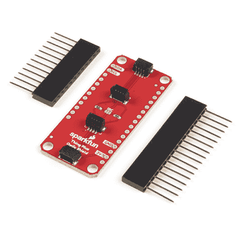](https://www.sparkfun.com/products/16790) 

将**添加到您的[购物车](https://www.sparkfun.com/cart)中！**

### [SparkFun Qwiic 盾为物加](https://www.sparkfun.com/products/16790)

[In stock](https://learn.sparkfun.com/static/bubbles/ "in stock") DEV-16790

SparkFun Qwiic Shield for Thing Plus 使您可以使用 spark fun 的 Qwiic connect 生态系统和开发板来测试

$4.95[Favorited Favorite](# "Add to favorites") 7[Wish List](# "Add to wish list")** **[https://www.youtube.com/embed/DLjZ8DjVNLo/?autohide=1&border=0&wmode=opaque&enablejsapi=1](https://www.youtube.com/embed/DLjZ8DjVNLo/?autohide=1&border=0&wmode=opaque&enablejsapi=1)

### 所需材料

为了跟随本教程，您需要一个 Arduino 开发板，带有 Thing Plus footprint。这包括所有的 SparkFun 的东西加板和许多其他的东西加兼容板的变种！以下是一些兼容的主板:

 

将**添加到您的[购物车](https://www.sparkfun.com/cart)中！**

### [【spark fun Thing Plus-ESP32 WROOM(微-B)](https://www.sparkfun.com/products/15663)

[Out of stock](https://learn.sparkfun.com/static/bubbles/ "out of stock") WRL-15663

SparkFun ESP32 Thing Plus 是开始使用 Espressif 物联网概念的下一步，同时还可以享受所有的便利设施

$22.5010[Favorited Favorite](# "Add to favorites") 48[Wish List](# "Add to wish list")**** 

将**添加到您的[购物车](https://www.sparkfun.com/cart)中！**

### [火花趣事 Plus——阿尔忒弥斯](https://www.sparkfun.com/products/15574)

[25 available](https://learn.sparkfun.com/static/bubbles/ "25 available") WRL-15574

SparkFun Artemis Thing Plus 采用了我们流行的羽毛足迹，并添加了强大的 Artemis 模块，以实现终极功能

$22.50[Favorited Favorite](# "Add to favorites") 28[Wish List](# "Add to wish list")****[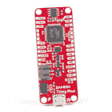](https://www.sparkfun.com/products/14713) 

将**添加到您的[购物车](https://www.sparkfun.com/cart)中！**

### [SparkFun 的东西 Plus-samd 51](https://www.sparkfun.com/products/14713)

[Out of stock](https://learn.sparkfun.com/static/bubbles/ "out of stock") DEV-14713

SparkFun SAMD51 Thing Plus 采用 32 位 ARM Cortex-M4F MCU，是我们迄今为止最强大的微控制器板之一！

$21.502[Favorited Favorite](# "Add to favorites") 26[Wish List](# "Add to wish list")****** ******Qwiic Shield 包括一组可堆叠的接头，以适应 Thing Plus 的尺寸，但您可能还需要一些接头来焊接到您的 Thing Plus。或者，如果您喜欢为您的屏蔽组件使用另一种接头类型，我们在下面列出了几个选项:

 

将**添加到您的[购物车](https://www.sparkfun.com/cart)中！**

### [破开头球——直击](https://www.sparkfun.com/products/116)

[In stock](https://learn.sparkfun.com/static/bubbles/ "in stock") PRT-00116

一排标题-打破适应。40 个引脚，可切割成任何尺寸。用于定制 PCB 或通用定制接头。

$1.7520[Favorited Favorite](# "Add to favorites") 133[Wish List](# "Add to wish list")**** 

将**添加到您的[购物车](https://www.sparkfun.com/cart)中！**

### [女标题](https://www.sparkfun.com/products/115)

[In stock](https://learn.sparkfun.com/static/bubbles/ "in stock") PRT-00115

单排 40 孔，内螺纹接头。可以用一把钢丝钳切割成合适的尺寸。标准 0.1 英寸间距。我们广泛使用它们…

$1.758[Favorited Favorite](# "Add to favorites") 71[Wish List](# "Add to wish list")**** 

将**添加到您的[购物车](https://www.sparkfun.com/cart)中！**

### [断后头——龙](https://www.sparkfun.com/products/10158)

[In stock](https://learn.sparkfun.com/static/bubbles/ "in stock") PRT-10158

这些是我们【标准】的加长版(http://www . spark fun . com/commerce/product _ info . PHP？products_id=116)挣脱他…

$3.253[Favorited Favorite](# "Add to favorites") 14[Wish List](# "Add to wish list")**** 

将**添加到您的[购物车](https://www.sparkfun.com/cart)中！**

### [羽毛可堆叠头套](https://www.sparkfun.com/products/15187)

[In stock](https://learn.sparkfun.com/static/bubbles/ "in stock") PRT-15187

这些可堆叠的接头可与[spark fun ESP32 Thing Plus](https://www . spark fun . com/products/14689)配合使用，以控制

$1.75[Favorited Favorite](# "Add to favorites") 4[Wish List](# "Add to wish list")******** ********如果你没有任何 Qwiic 产品可以使用，你可能不会想要 Qwiic Shield for Thing Plus，对吗？好吧，如果你没有任何 Qwiic 产品，以下可能是一个不错的开始:

[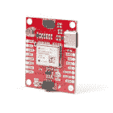](https://www.sparkfun.com/products/15712) 

将**添加到您的[购物车](https://www.sparkfun.com/cart)中！**

### [【spark fun GPS Breakout-NEO-M9N，U.FL (Qwiic)](https://www.sparkfun.com/products/15712)

[In stock](https://learn.sparkfun.com/static/bubbles/ "in stock") GPS-15712

SparkFun NEO-M9N GPS Breakout 是一款高质量的 GPS 板，具有同样令人印象深刻的配置选项。

$69.954[Favorited Favorite](# "Add to favorites") 12[Wish List](# "Add to wish list")**** 

将**添加到您的[购物车](https://www.sparkfun.com/cart)中！**

### [【spark fun 高精度温度传感器- TMP117 (Qwiic)](https://www.sparkfun.com/products/15805)

[In stock](https://learn.sparkfun.com/static/bubbles/ "in stock") SEN-15805

SparkFun Qwiic TMP117 Breakout 是一款配有 I2C 接口的高精度温度传感器。

$14.954[Favorited Favorite](# "Add to favorites") 29[Wish List](# "Add to wish list")****[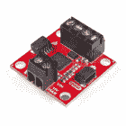](https://www.sparkfun.com/products/15451) 

将**添加到您的[购物车](https://www.sparkfun.com/cart)中！**

### [SparkFun Qwiic 电机驱动器](https://www.sparkfun.com/products/15451)

[In stock](https://learn.sparkfun.com/static/bubbles/ "in stock") ROB-15451

SparkFun Qwiic 电机驱动器采用了串行控制电机驱动器的所有功能，并将其小型化，增加了 Qw…

$19.501[Favorited Favorite](# "Add to favorites") 28[Wish List](# "Add to wish list")**** 

将**添加到您的[购物车](https://www.sparkfun.com/cart)中！**

### [【spark fun 接近传感器分线点- 20cm，VCNL4040 (Qwiic)](https://www.sparkfun.com/products/15177)

[In stock](https://learn.sparkfun.com/static/bubbles/ "in stock") SEN-15177

SparkFun 接近传感器分线点是一个简单的红外存在和环境光传感器，利用 VCNL4040。

$7.501[Favorited Favorite](# "Add to favorites") 18[Wish List](# "Add to wish list")******** ********您将需要一些我们的 Qwiic 电缆来连接您的设备和屏蔽。以下是几个选项:

 

将**添加到您的[购物车](https://www.sparkfun.com/cart)中！**

### [Qwiic 线缆- 100mm](https://www.sparkfun.com/products/14427)

[In stock](https://learn.sparkfun.com/static/bubbles/ "in stock") PRT-14427

这是一条 100 毫米长的 4 芯电缆，带有 1 毫米 JST 端接。它旨在将支持 Qwiic 的组件连接在一起…

$1.50[Favorited Favorite](# "Add to favorites") 32[Wish List](# "Add to wish list")**** 

将**添加到您的[购物车](https://www.sparkfun.com/cart)中！**

### [Qwiic 线缆- 500mm](https://www.sparkfun.com/products/14429)

[In stock](https://learn.sparkfun.com/static/bubbles/ "in stock") PRT-14429

这是一根 500mm 长的 4 芯电缆，带有 1mm JST 端接。它旨在将支持 Qwiic 的组件连接在一起…

$1.951[Favorited Favorite](# "Add to favorites") 25[Wish List](# "Add to wish list")**** 

将**添加到您的[购物车](https://www.sparkfun.com/cart)中！**

### [Qwiic 线缆- 50mm](https://www.sparkfun.com/products/14426)

[In stock](https://learn.sparkfun.com/static/bubbles/ "in stock") PRT-14426

这是一根 50 毫米长的 4 芯电缆，带有 1 毫米 JST 端接。它旨在将支持 Qwiic 的组件连接在一起…

$0.95[Favorited Favorite](# "Add to favorites") 29[Wish List](# "Add to wish list")**** 

### [Qwiic 线缆- 200mm](https://www.sparkfun.com/products/14428)

[Out of stock](https://learn.sparkfun.com/static/bubbles/ "out of stock") PRT-14428

这是一根 200 毫米长的 4 芯电缆，带有 1 毫米 JST 端接。它旨在将支持 Qwiic 的组件连接在一起…

[Favorited Favorite](# "Add to favorites") 21[Wish List](# "Add to wish list")****** ******最后，如果您想使用非 Qwiic I ² C 设备，这些适配器有助于将其转换为 Qwiic 连接器:

 

将**添加到您的[购物车](https://www.sparkfun.com/cart)中！**

### [SparkFun Qwiic 适配器](https://www.sparkfun.com/products/14495)

[In stock](https://learn.sparkfun.com/static/bubbles/ "in stock") DEV-14495

SparkFun Qwiic 适配器提供了将任何旧 I ² C 板改造成支持 Qwiic 的板的完美方法。

$1.601[Favorited Favorite](# "Add to favorites") 53[Wish List](# "Add to wish list")**** 

将**添加到您的[购物车](https://www.sparkfun.com/cart)中！**

### [Qwiic 电缆-试验板跳线(4 针)](https://www.sparkfun.com/products/14425)

[In stock](https://learn.sparkfun.com/static/bubbles/ "in stock") PRT-14425

这是一根跳线适配器电缆，一端带有一个 Qwiic JST 母接头，另一端带有一个试验板连接…

$1.50[Favorited Favorite](# "Add to favorites") 34[Wish List](# "Add to wish list")**** 

### [Qwiic 线缆-母跳线(4 针)](https://www.sparkfun.com/products/retired/14988)

[Retired](https://learn.sparkfun.com/static/bubbles/ "Retired") CAB-14988

这是一种跳线适配器电缆，一端预端接一个母 Qwiic JST 连接器，另一端预端接一个母连接器

**Retired**[Favorited Favorite](# "Add to favorites") 10[Wish List](# "Add to wish list")**** ****### 所需工具

您将需要一个[烙铁](https://www.sparkfun.com/categories/49)、焊料和通用焊接附件来将接头引脚焊接到 Qwiic 屏蔽上:

 

将**添加到您的[购物车](https://www.sparkfun.com/cart)中！**

### [无铅焊料- 15 克管](https://www.sparkfun.com/products/9163)

[In stock](https://learn.sparkfun.com/static/bubbles/ "in stock") TOL-09163

这是你的无铅焊料的基本管，带有不干净的水溶性树脂芯。0.031 英寸规格，15 克

$3.954[Favorited Favorite](# "Add to favorites") 14[Wish List](# "Add to wish list")**** 

将**添加到您的[购物车](https://www.sparkfun.com/cart)中！**

### [烙铁- 30W(美国，110V)](https://www.sparkfun.com/products/9507)

[33 available](https://learn.sparkfun.com/static/bubbles/ "33 available") TOL-09507

这是一个非常简单的固定温度，快速加热，30W 110/120 VAC 烙铁。我们真的很喜欢使用更贵的 iro…

$10.957[Favorited Favorite](# "Add to favorites") 21[Wish List](# "Add to wish list")**** ****### 推荐阅读

如果您不熟悉 Qwiic 系统，我们建议您阅读此处的概述:

|  |
| *[Qwiic 连接系统](https://www.sparkfun.com/qwiic)* |

如果您不熟悉以下教程，我们也建议您看一看:

 [### 如何焊接:通孔焊接](https://learn.sparkfun.com/tutorials/how-to-solder-through-hole-soldering) This tutorial covers everything you need to know about through-hole soldering.[Favorited Favorite](# "Add to favorites") 70 [### I2C](https://learn.sparkfun.com/tutorials/i2c) An introduction to I2C, one of the main embedded communications protocols in use today.[Favorited Favorite](# "Add to favorites") 128

## 硬件概述

### Qwiic 连接器

Thing Plus 的 Qwiic 保护罩上有四个 Qwiic 连接器。边缘的两个是标准水平连接器，中间的两个是垂直连接器。

[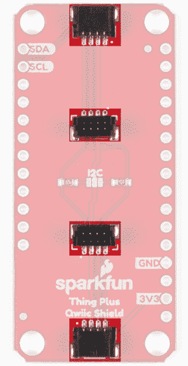](https://cdn.sparkfun.com/assets/learn_tutorials/1/1/0/7/SparkFun_Qwiic_Shield_Thing_Plus_Qwiic.jpg)

### I ² C 跳线

这款跳线与我们普通的 I ² C 上拉跳线略有不同，因为默认情况下它是**打开**。只有当您的外围设备**没有**上拉电阻时，跳线才需要闭合。基本上所有 SparkFun I ² C 分线点都带有上拉电阻，因此如果您使用 Qwiic I ² C 器件或另一个 SparkFun I ² C 器件，您很可能会让它开路。闭合时，SDA 和 SCL 线被 **4.7K** 电阻拉至 **3.3V** 。如果你以前从未使用过焊料跳线，请查看[本教程](https://learn.sparkfun.com/tutorials/how-to-work-with-jumper-pads-and-pcb-traces)以获得一些使用它们的技巧和诀窍。

[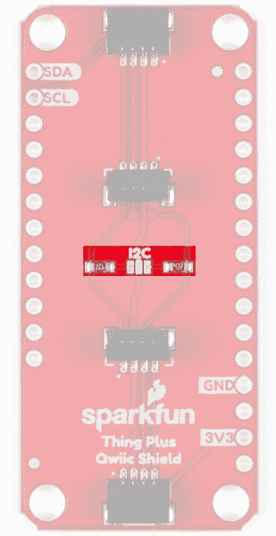](https://cdn.sparkfun.com/assets/learn_tutorials/1/1/0/7/SparkFun_Qwiic_Shield_Thing_Plus_I2C.jpg)

### 电路板尺寸

护罩尺寸为 2.00 英寸 x 0.90in 英寸(50.8 毫米 x 22.86mm 毫米)，有四个安装孔，可安装一个 [4-40 螺钉](https://www.sparkfun.com/products/10453)。

[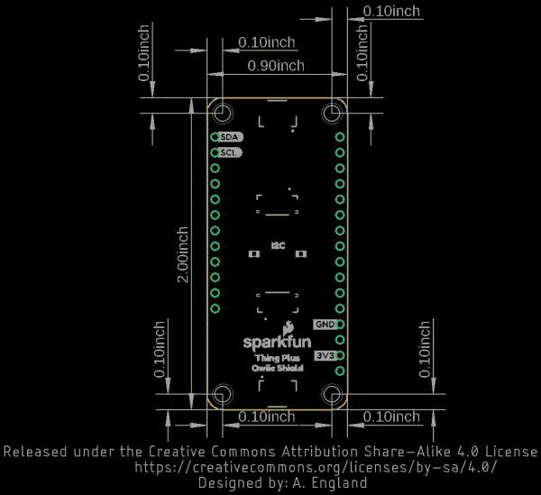](https://cdn.sparkfun.com/assets/learn_tutorials/1/1/0/7/Qwiic_Shield_Thing_Plus_Dimensions.png)

## 硬件装配

开始使用 Thing Plus 的 Qwiic 屏蔽时，您只需[将附带的可堆叠接头或您选择的任何接头焊接到屏蔽上，如有必要，焊接到您的 Thing Plus(或兼容板)上。如果你以前从未使用过 Arduino 盾牌，或者需要一些提示，我们的](https://learn.sparkfun.com/tutorials/how-to-solder-through-hole-soldering) [Arduino 盾牌教程](https://learn.sparkfun.com/tutorials/arduino-shields#installing-headers-preparation)提供了关于如何组装和使用它们的详细说明。

一旦你把接头焊接到你的屏蔽上，并把它连接到你的东西上，就该开始连接 Qwiic 设备了！下面你可以看到 Qwiic 盾牌连接到一个 [SparkFun Thing Plus - SAMD51](https://www.sparkfun.com/products/14713) ，使用盾牌附带的[羽毛可堆叠头部套件](https://www.sparkfun.com/products/15187)以及几个链接到它的 Qwiic 设备。

[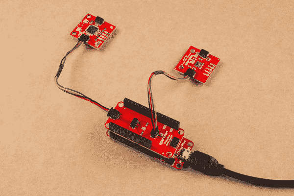](https://cdn.sparkfun.com/assets/learn_tutorials/1/1/0/7/Thing_Plus_Qwiic_Shield_Hookup_Guide-01.jpg)

## 资源和更进一步

要了解更多信息，请看下面的参考资料。

*   [示意图(PDF)](https://cdn.sparkfun.com/assets/b/0/d/1/4/Qwiic_Shield_Thing_Plus.pdf)
*   [老鹰文件(ZIP)](https://cdn.sparkfun.com/assets/2/f/8/b/3/Qwiic_Shield_Thing_Plus.zip)
*   [电路板尺寸](https://cdn.sparkfun.com/assets/learn_tutorials/1/1/0/7/Qwiic_Shield_Thing_Plus_Dimensions.png)
*   [GitHub 库](https://github.com/sparkfun/Qwiic_Shield_for_Thing_Plus)
*   [Qwiic 系统登陆页面](https://www.sparkfun.com/qwiic)
*   [SFE 产品展示区](https://www.youtube.com/watch?v=DLjZ8DjVNLo)

如果您在使用新组装的 Qwiic Shield 连接 Qwiic 设备时遇到问题，您可能想看看这些教程，以帮助排除故障和返工您的 Shield。

*   [故障排除提示-硬件检查](https://learn.sparkfun.com/tutorials/sparkfun-troubleshooting-tips#hardware-checks)
*   [Arduino 盾牌教程](https://learn.sparkfun.com/tutorials/arduino-shields)

既然您已经准备好了 Qwiic Shield，是时候看看一些支持 qw IC 的产品了。下面是几个开始。

[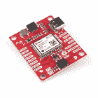](https://www.sparkfun.com/products/16329) 

将**添加到您的[购物车](https://www.sparkfun.com/cart)中！**

### [【spark fun GPS 航位推算突破- NEO-M8U (Qwiic)](https://www.sparkfun.com/products/16329)

[In stock](https://learn.sparkfun.com/static/bubbles/ "in stock") GPS-16329

SparkFun NEO-M9N GPS Breakout 是一款高质量的 GPS 板，通过 Dead Reck 提供了同样令人印象深刻的配置选项

$74.952[Favorited Favorite](# "Add to favorites") 19[Wish List](# "Add to wish list")****[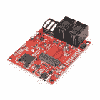](https://www.sparkfun.com/products/16794) 

将**添加到您的[购物车](https://www.sparkfun.com/cart)中！**

### [SparkFun MicroMod 天气载板](https://www.sparkfun.com/products/16794)

[In stock](https://learn.sparkfun.com/static/bubbles/ "in stock") SEN-16794

MicroMod 生态系统的 MicroMod 天气载板外围，允许您创建自己的气象站与

$44.951[Favorited Favorite](# "Add to favorites") 7[Wish List](# "Add to wish list")**** 

将**添加到您的[购物车](https://www.sparkfun.com/cart)中！**

### [【spark fun 三轴加速度计分线点- KX132 (Qwiic)](https://www.sparkfun.com/products/17871)

[In stock](https://learn.sparkfun.com/static/bubbles/ "in stock") SEN-17871

这款 SparkFun 三轴加速度计突破产品是 Kionix 公司 KX132 数字加速度计的简单 Qwiic 突破产品。

$14.95[Favorited Favorite](# "Add to favorites") 4[Wish List](# "Add to wish list")****[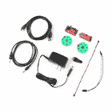](https://www.sparkfun.com/products/21230) 

将**添加到您的[购物车](https://www.sparkfun.com/cart)中！**

### [SparkFun Qwiic 音箱套装](https://www.sparkfun.com/products/21230)

[30 available](https://learn.sparkfun.com/static/bubbles/ "30 available") KIT-21230

SparkFun Qwiic 扬声器套件通过一个简单的 Qwiic 接口为您提供开始使用立体声音响所需的一切

$39.95[Favorited Favorite](# "Add to favorites") 2[Wish List](# "Add to wish list")******** ********在您离开之前，这里有一些使用 Qwiic Connect 系统的其他教程，您可能想浏览一下:

 [### SparkFun SAMD21 Pro 射频连接指南](https://learn.sparkfun.com/tutorials/sparkfun-samd21-pro-rf-hookup-guide) Using the super blazing, nay blinding, fast SAMD21 whipping clock cycles at 48MHz and the RFM96 module to connect to the Things Network (and other Radio woodles).[Favorited Favorite](# "Add to favorites") 6 [### 只需按下按钮，就能进行 GPS 地理测绘](https://learn.sparkfun.com/tutorials/gps-geo-mapping-at-the-push-of-a-button) Let's ramp up our GPS tracking skills with KML files and Google Earth. We'll make a tracker that logs location and allows us to visualize our steps with Google Earth.[Favorited Favorite](# "Add to favorites") 9 [### SparkFun 时钟发生器 5P49V60 (Qwiic)连接指南](https://learn.sparkfun.com/tutorials/sparkfun-clock-generator-5p49v60-qwiic-hookup-guide) The SparkFun Clock Generator 5P49V60 (Qwiic) breakout board offers a wide range of customizable frequencies in a wide range of different signal types using a single reference clock. This hookup guide will go over all of the many available functions and gives the hardware rundown on what exactly is on this board.[Favorited Favorite](# "Add to favorites") 2 [### SparkFun Qwiic GPIO 连接指南](https://learn.sparkfun.com/tutorials/sparkfun-qwiic-gpio-hookup-guide) Add up to 8 extra I/O pins to your microcontroller with the SparkFun Qwiic GPIO. Get started with the Qwiic GPIO in this Hookup Guide.[Favorited Favorite](# "Add to favorites") 2**********************************************