# SparkFun RFID 入门套件连接指南

> 原文：<https://learn.sparkfun.com/tutorials/sparkfun-rfid-starter-kit-hookup-guide>

## 介绍

[SparkFun RFID 入门套件](https://www.sparkfun.com/products/13198)为您提供了使用计算机或微控制器读取 RFID 标签所需的工具！

[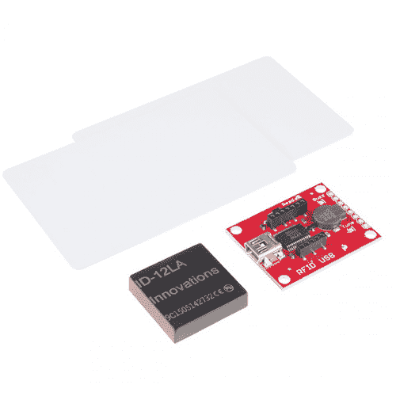](https://www.sparkfun.com/products/13198) 

### [SparkFun RFID 入门套件](https://www.sparkfun.com/products/13198)

[Out of stock](https://learn.sparkfun.com/static/bubbles/ "out of stock") KIT-13198

这是 SparkFun RFID 入门套件，这是一个集所有功能于一身的套件，提供您完成下一个 RFID 项目所需的一切…

15[Favorited Favorite](# "Add to favorites") 69[Wish List](# "Add to wish list")

### 所需材料

该套件包含:

*   1x [RFID USB 读卡器](http://www.sparkfun.com/products/9963)
*   1x [ID-12LA RFID 模块](https://www.sparkfun.com/products/11827)
*   2x [125KHz RFID 卡](https://www.sparkfun.com/products/8310)

你还需要一根 [USB mini-B 线缆](https://www.sparkfun.com/products/11301)将 USB 阅读器连接到电脑上。

### 推荐阅读和观看

ID-12LA 模块有一个串行输出。如果您以前从未使用过串行设备或终端程序，您可能想先看看这些教程。

*   [串行通信](https://learn.sparkfun.com/tutorials/serial-communication)
*   [串行终端基础知识](https://learn.sparkfun.com/tutorials/terminal-basics)
*   [RFID 基础知识](https://learn.sparkfun.com/tutorials/rfid-basics)
*   [Tim 的 RFID 对比视频](https://www.youtube.com/watch?v=FLjV5BT9slg) -让来自技术支持部门的 Tim 带您浏览我们的低频 RFID 选项的整个系列，包括范围测试。
*   [SparkFun 简单草图- RFID 入门套件视频](https://www.youtube.com/watch?v=aSqPt8UQOHM)-RFID 入门套件运行的简单视频演示。

## 硬件概述:RFID USB 读卡器

[RFID USB 阅读器](http://www.sparkfun.com/products/9963)具有以下特性:

[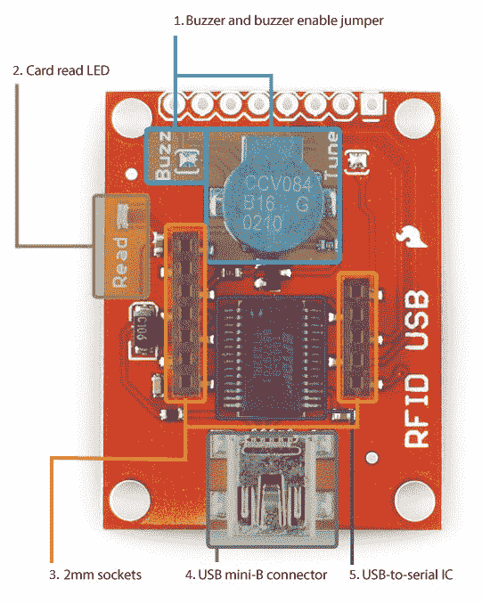](https://cdn.sparkfun.com/assets/learn_tutorials/2/2/8/rfid-base-annotated_2.jpg)

1.  **蜂鸣器和启用蜂鸣器的跳线** -读卡时发出声音的蜂鸣器。如果你在秘密行动中使用 RFID 套件，你可以通过移除**蜂鸣器**跳线上的一滴焊料来断开蜂鸣器。

2.  **读卡指示灯**—“读卡”状态指示灯。

3.  **2mm RFID 插座** - 2mm 间距的插座，适合 SparkFun 的三个 RFID 模块( [ID-3LA](https://www.sparkfun.com/products/11862) 、 [ID-12LA](https://www.sparkfun.com/products/11827) 和 [ID-20LA](https://www.sparkfun.com/products/11828) )。

4.  **USB 迷你 B 连接器**-USB 迷你 B 连接器，用于连接电脑的 USB 端口。

5.  **USB 转串行 IC**-ftdi 232 rl USB 转串行 IC，将模块的 TTL 串行输出转换为 USB。

## 硬件连接

将 ID-12 模块放在 RFID USB 阅读器上，并用 USB mini-B 电缆将底座插入您的计算机。根据您的操作系统，插入基站后，您可能需要[安装 FTDI 驱动程序](https://learn.sparkfun.com/tutorials/how-to-install-ftdi-drivers)。

[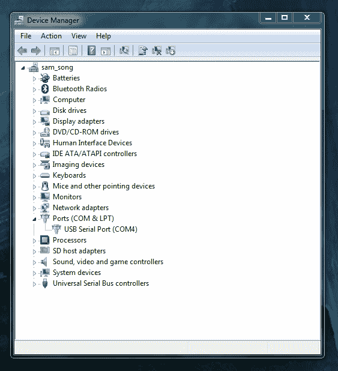](https://cdn.sparkfun.com/assets/learn_tutorials/2/2/8/COM4_device_manager.png)*Here's the RFID reader (on COM4) with the FTDI drivers installed.*

打开您选择的终端程序。如果你以前从未使用过终端程序，这里有一个选择和使用它们的指南。

首先，使用 Arduino IDE 的内置串行监视器:

*   打开 Arduino IDE。
*   转到**工具>端口**并选择 RFID 阅读器的端口。
*   转到**工具>串行监视器**。默认的终端设置(9600 波特，无行尾)很好。监视器应该空白。

在读卡器上挥一张卡片。您应该会听到哔哔声，并看到类似这样的内容。

[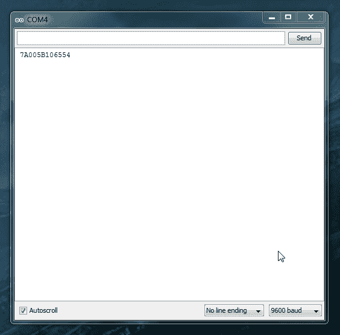](https://cdn.sparkfun.com/assets/learn_tutorials/2/2/8/scanned_card.png)

现在，我们将做同样的事情。(Mac 用户，可以用 [CoolTerm](https://learn.sparkfun.com/tutorials/terminal-basics/coolterm-windows-mac-linux) 试试这款)

与 Arduino 串行监视器相比，RealTerm 可能看起来像 747 的驾驶舱，但它有几个有用的功能。如果需要，请打开 RealTerm 教程。

[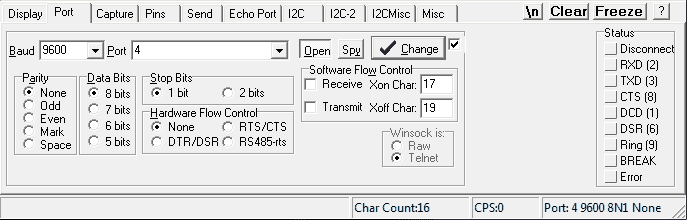](https://cdn.sparkfun.com/assets/learn_tutorials/2/2/8/realterm_portsetting.png)*The RealTerm **Port** tab with the port set to `4` and the baud rate to `9600`*[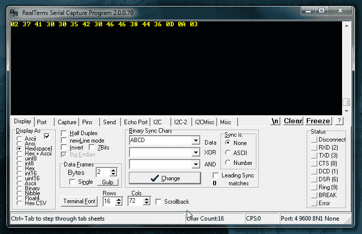](https://cdn.sparkfun.com/assets/learn_tutorials/2/2/8/realterm_hex.png)*The RealTerm **Display** tab*

当**显示为**设置为`Hex[space]`时，卡数据显示为 16 个十六进制字节，而不是像在 Arduino 串行监视器中那样显示为 12 个 ASCII 数字。

等等，16 字节？多出来的四个是哪里来的？

[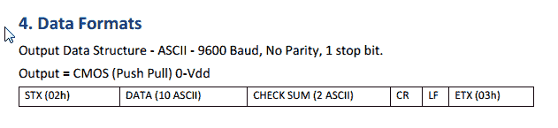](https://cdn.sparkfun.com/assets/learn_tutorials/2/2/8/data_format.png)

这是 ID-12 模块数据手册中的“数据格式”部分。Arduino 串行监视器中显示的 12 个 ASCII 字符只是 16 字节三明治中的馅料，还有四个非打印字符(STX 或文本开始、CR/回车、LF/换行和 STX 文本结束)作为面包。

尝试将**显示为**设置切换到`ASCII`并再次扫描:

[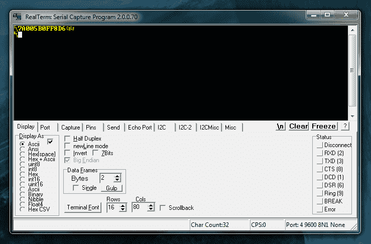](https://cdn.sparkfun.com/assets/learn_tutorials/2/2/8/realterm_ascii.png)

现在“面包”可见了！很酷，对吧？

## 示例项目

虽然看着你的卡在串行终端中弹出很有趣，但你可能想用这种能力做些事情。

下面的示例草图扫描 RFID 卡，并将其与可信卡进行比较，然后移动伺服系统来解锁您选择的安全*物品。

* *不适合关键应用，例如守护希望之钻。*

除了 RFID 阅读器套件，您还需要:

*   像 [SparkFun RedBoard](https://www.sparkfun.com/products/12757) 或 [Arduino Uno](https://www.sparkfun.com/products/11021) 这样的微控制器。
*   [M/M 跳线](https://www.sparkfun.com/products/12795)
*   [试验板](https://www.sparkfun.com/products/12002)
*   一个[伺服](https://www.sparkfun.com/products/9065) -更大的尺寸建议用于更大的锁。
*   [断开公接头](https://www.sparkfun.com/products/116)以焊接至电路板的通孔。(如果你需要焊接复习工具，看看我们的[通孔焊接教程](https://learn.sparkfun.com/tutorials/how-to-solder---through-hole-soldering)

[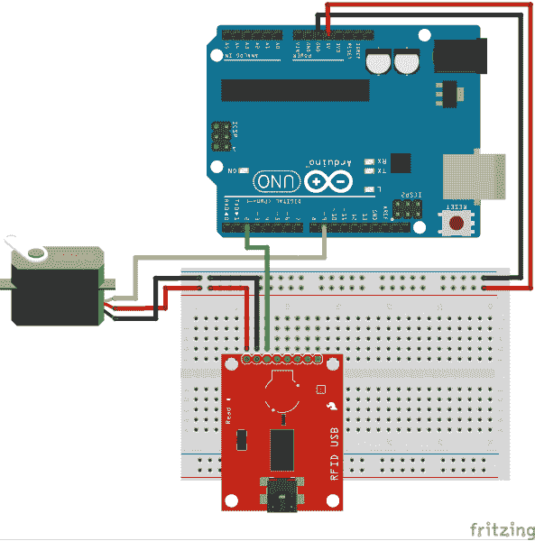](https://cdn.sparkfun.com/assets/learn_tutorials/2/2/8/SparkFun_Arduino_RFID_USB_Kit__Servo_Lock_Fritzing_bb.png)

将 RFID USB 读取器上的 VCC、GND 和 TX 引脚连接到 Arduino 的 5V、GND 和 D2 引脚，并将伺服连接到 5V、GND 和 D9。复制下面提供的代码，并调整在简单连接中获得的`knownTags[][]{}`数组中提供的值，以便 Arduino 识别您的 RFID 标签。上传代码，进入**工具>串口监视器**打开你的串口监视器，开始扫描一些卡！

```
language:c
/*****************************
     RFID-powered lockbox

Written by: acavis, 3/31/2015
Modified: Ho YUN "Bobby" Chan @ SparkFun Electronics Inc., 11/10/2017

Inspired by & partially adapted from
http://bildr.org/2011/02/rfid-arduino/

Description: This sketch will move a servo when
a trusted tag is read with the 
ID-12/ID-20 RFID module

----------HARDWARE HOOKUP----------

PINOUT FOR SERVO MOTOR
    Servo Motor ----- Arduino
    GND               GND
    Vcc               5V 
    SIG               D9

PINOUT FOR SPARKFUN RFID USB READER
    Arduino ----- RFID module
    5V            VCC
    GND           GND
    D2            TX

PINOUT FOR SPARKFUN RFID BREAKOUT BOARD
    Arduino ----- RFID module
    5V            VCC
    GND           GND
    GND           FORM
    D2            D0

Optional: If using the breakout, you can also 
put an LED & 330 ohm resistor between 
the RFID module's READ pin and GND for 
a "card successfully read" indication.

Note: Make sure to GND the FORM pin to enable the ASCII output format. 

--------------------------------------------------

******************************/

#include <SoftwareSerial.h>
#include <Servo.h>

// Choose two pins for SoftwareSerial
SoftwareSerial rSerial(2, 3); // RX, TX

// Make a servo object
Servo lockServo;

// Pick a PWM pin to put the servo on
const int servoPin = 9;

// For SparkFun's tags, we will receive 16 bytes on every
// tag read, but throw four away. The 13th space will always
// be 0, since proper strings in Arduino end with 0

// These constants hold the total tag length (tagLen) and
// the length of the part we want to keep (idLen),
// plus the total number of tags we want to check against (kTags)
const int tagLen = 16;
const int idLen = 13;
const int kTags = 4;

// Put your known tags here!
char knownTags[kTags][idLen] = {
             "111111111111",
             "444444444444",
             "555555555555",
             "7A005B0FF8D6"
};

// Empty array to hold a freshly scanned tag
char newTag[idLen];

void setup() {
  // Starts the hardware and software serial ports
   Serial.begin(9600);
   rSerial.begin(9600);

   // Attaches the servo to the pin
   lockServo.attach(servoPin);

   // Put servo in locked position
   // Note: Value may need to be adjusted 
   // depending on servo motor
   lockServo.write(0);

}

void loop() {
  // Counter for the newTag array
  int i = 0;
  // Variable to hold each byte read from the serial buffer
  int readByte;
  // Flag so we know when a tag is over
  boolean tag = false;

  // This makes sure the whole tag is in the serial buffer before
  // reading, the Arduino can read faster than the ID module can deliver!
  if (rSerial.available() == tagLen) {
    tag = true;
  }

  if (tag == true) {
    while (rSerial.available()) {
      // Take each byte out of the serial buffer, one at a time
      readByte = rSerial.read();

      /* This will skip the first byte (2, STX, start of text) and the last three,
      ASCII 13, CR/carriage return, ASCII 10, LF/linefeed, and ASCII 3, ETX/end of 
      text, leaving only the unique part of the tag string. It puts the byte into
      the first space in the array, then steps ahead one spot */
      if (readByte != 2 && readByte!= 13 && readByte != 10 && readByte != 3) {
        newTag[i] = readByte;
        i++;
      }

      // If we see ASCII 3, ETX, the tag is over
      if (readByte == 3) {
        tag = false;
      }

    }
  }

  // don't do anything if the newTag array is full of zeroes
  if (strlen(newTag)== 0) {
    return;
  }

  else {
    int total = 0;

    for (int ct=0; ct < kTags; ct++){
        total += checkTag(newTag, knownTags[ct]);
    }

    // If newTag matched any of the tags
    // we checked against, total will be 1
    if (total > 0) {

      // Put the action of your choice here!

      // I'm going to rotate the servo to symbolize unlocking the lockbox

      Serial.println("Success!");
      lockServo.write(180);
    }

    else {
        // This prints out unknown cards so you can add them to your knownTags as needed
        Serial.print("Unknown tag! ");
        Serial.print(newTag);
        Serial.println();
    }
  }

  // Once newTag has been checked, fill it with zeroes
  // to get ready for the next tag read
  for (int c=0; c < idLen; c++) {
    newTag[c] = 0;
  }
}

// This function steps through both newTag and one of the known
// tags. If there is a mismatch anywhere in the tag, it will return 0,
// but if every character in the tag is the same, it returns 1
int checkTag(char nTag[], char oTag[]) {
    for (int i = 0; i < idLen; i++) {
      if (nTag[i] != oTag[i]) {
        return 0;
      }
    }
  return 1;
} 
```

**Note:** You may need to adjust the initial position of the servo in the setup depending on the servo motor that you are using. Certain servos (such as the [generic sub-micro size servo](https://www.sparkfun.com/products/9065)) may not be able to extend to its full range. Try changing the value in `lockServo.write(0)` to a higher value like `lockServo.write(10)`.

## 使用 RFID 读取器分线点

对于 Arduino 项目，您还可以使用 [SparkFun RFID 阅读器分线点](https://www.sparkfun.com/products/13030)，它为模块提供了一个放置的位置，并将其奇数 2mm 间距的引脚分成 0.1 英寸的试验板友好间距。

为了保持模块的可拆卸性(并保护其免受焊接过程中的意外损坏)，您可以使用[对角切割器](https://www.sparkfun.com/products/8794)将 2x [2mm XBee 插座](https://www.sparkfun.com/products/8272)修剪到合适的尺寸，并将它们焊接到分接头的顶部。在切割 2mm XBee 插座时，您需要牺牲一个接头引脚，并在焊接到 RFID 阅读器分线点之前从 1x7 接头中拔出/夹住一个引脚，如图 1 所示。焊接前，确保使用 RFID 模块测试分线板上的接头。

[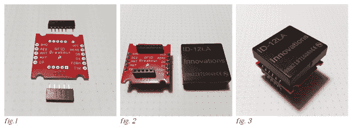](https://cdn.sparkfun.com/assets/learn_tutorials/2/2/8/breakout_with_sockets.jpg)

*   **图 1** XBee 插座被修剪到合适的尺寸，其中一个引脚被剪短。
*   **图 2** 插座焊接到分接头的顶部，底部有 [0.1”阳直插头销](https://www.sparkfun.com/products/116)。
*   **图 3** 准备在试验板上使用的模块和分线点

完成的分支可以像较大的基站一样使用。这是与上面相同的例子，在 READ 引脚上增加了一个绿色 LED 和 330 欧姆电阻。分接头上的 **TX** 标记为 **D0** 。

[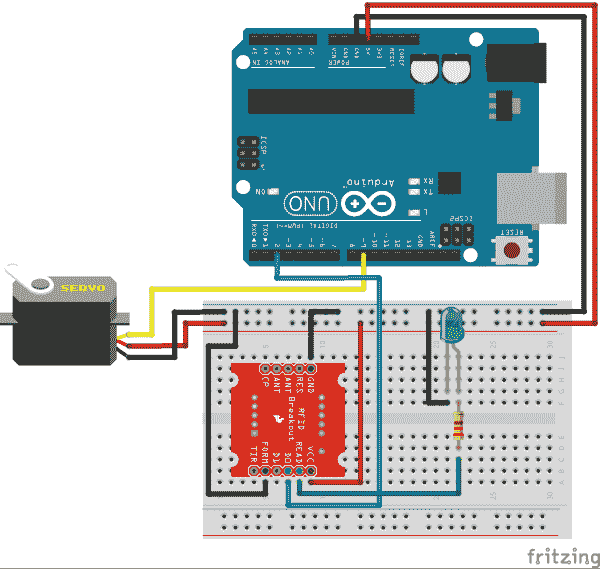](https://cdn.sparkfun.com/assets/learn_tutorials/2/2/8/Arduino_RFID_Breakout_Servo_Lock_Fritzing_bb.png)*Shown with the module removed so you can read the silk.***Note:** Make sure to connect the "FORM" pin to ground to enable the ASCII output format.

## 资源和更进一步

您可以使用 SparkFun RFID 阅读器套件和 Arduino 来控制对任何东西的访问！

*   与其移动一个伺服，不如控制一个像 [PowerSwitch Tail II](https://www.sparkfun.com/products/10747) 这样的继电器怎么样。没有入侵者会再未经允许使用你的烙铁、烤面包机或电热毯！

*   罗布的 NCWP(非蹩脚的结婚礼物)教程 -一个 RFID 阅读器(加上罗布的零件清单的其余部分)可能是所有将你与真爱分开的东西。

要获得更多 RFID 灵感，请查看以下附加资源:

[](https://learn.sparkfun.com/tutorials/rfid-basics) [### RFID 基础知识](https://learn.sparkfun.com/tutorials/rfid-basics) Dive into the basics of Radio Frequency Identification (RFID) technology.[Favorited Favorite](# "Add to favorites") 28[](https://learn.sparkfun.com/tutorials/sparkfun-qwiic-rfid-idxxla-hookup-guide) [### SparkFun Qwiic RFID-IDXXLA 连接指南](https://learn.sparkfun.com/tutorials/sparkfun-qwiic-rfid-idxxla-hookup-guide) The Qwiic RFID ID-XXLA is an I2C solution that pairs with the ID-LA modules: ID-3LA, the ID-12LA, or the ID-20LA, and utilizes 125kHz RFID chips. Let's take a look at the hardware used for this tutorial.[Favorited Favorite](# "Add to favorites") 4[](https://learn.sparkfun.com/tutorials/build-a-qwiic-jukebox-that-is-toddler-approved) [### 建立一个 Qwiic 点唱机是幼儿批准！](https://learn.sparkfun.com/tutorials/build-a-qwiic-jukebox-that-is-toddler-approved) Follow this tutorial to build your own custom jukebox. Note, this is designed simple and tough for use primarily with toddlers. It's also a great introduction to SparkFun's Qwiic products 1[](https://learn.sparkfun.com/tutorials/rfid-beginners-tutorial) [### RFID 初学者教程](https://learn.sparkfun.com/tutorials/rfid-beginners-tutorial) In this tutorial we'll revisit some RFID basics and practice by making a remote work logger using an RFID reader and a GPS module. You'll scan a card and get ID, location, and time. All the perfect data to punch in and punch out from the middle of Nowhere 12

## 对更多 RFID 感兴趣？

我们为您准备了一个页面！概述 RFID 的基本工作原理、所需的硬件以及入门教程。

带我去那里！