# SparkFun RTK 刻面连接指南

> 原文：<https://learn.sparkfun.com/tutorials/sparkfun-rtk-facet-hookup-guide>

## 介绍

SparkFun 的 [RTK Facet](https://www.sparkfun.com/products/19984) 是我们迄今为止最先进的 GNSS 接收器。这是您的高精度地理定位和测量需求的一站式商店。对于初级用户来说，它非常容易启动和运行，对于高级用户来说，RTK Facet 是一个灵活而强大的工具。

[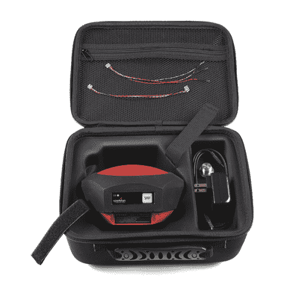](https://www.sparkfun.com/products/19984) 

将**添加到您的[购物车](https://www.sparkfun.com/cart)中！**

### [踢腿 RTK 男T3](https://www.sparkfun.com/products/19984)

[Out of stock](https://learn.sparkfun.com/static/bubbles/ "out of stock") GPS-19984

SparkFun RTK Facet 是用于厘米级定位的全封闭 GNSS 接收器。非常适合高精度地理定位…

$699.954[Favorited Favorite](# "Add to favorites") 8[Wish List](# "Add to wish list")** **只需几分钟的设置，RTK 刻面是进行厘米级测量的最快方法之一。

*Surveying with a monopod and SW Maps**An RTK Fix with 14mm accuracy in SW Maps*

通过蓝牙将您的手机连接到 RTK Facet，您的手机可以充当无线电链路，以提供校正数据并接收设备的 NMEA 输出。这就是价值 10，000 美元的测量设备在过去十年中的运作方式——我们只是让它更容易、更小、更经济。

### 观看快速设置

[https://www.youtube.com/embed/-Id4YDDXGGg](https://www.youtube.com/embed/-Id4YDDXGGg)

### 所需材料

RTK Facet 在一个小单元中内置了您需要的所有功能。此外， [RTK 刻面套件](https://www.sparkfun.com/products/19984)也包括你*可能*需要的一切。你唯一需要添加的就是你自己的平板或者手机(目前支持安卓；iOS 支持计划)。

根据您的设置，您可能需要使用手机获取 RTCM 校正数据。如果无法在线获得信号源，则需要在基本模式下设置第二个 RTK 面，并通过无线电链路将基本设备连接到漫游器。我们将详细介绍，但我们设计的 RTK Facet 可与这些 100mW 915MHz 遥测无线电开箱即用。

 

将**添加到您的[购物车](https://www.sparkfun.com/cart)中！**

### [植遥测电台 V3 - 915MHz，100mW](https://www.sparkfun.com/products/19032)

[In stock](https://learn.sparkfun.com/static/bubbles/ "in stock") WRL-19032

915MHz SiK 遥测无线电 V3 是一个轻量级和廉价的开源无线电平台，可允许 30…

$89.95[Favorited Favorite](# "Add to favorites") 11[Wish List](# "Add to wish list")** **要给 RTK Facet 充电，你需要一根 USB C 线和一个电源。这些都包括在套件中，但任何 USB C 端口应以每小时 1A 的最大速率为刻面充电。

 

将**添加到您的[购物车](https://www.sparkfun.com/cart)中！**

### [USB 2.0 Type-C 线缆- 1 米](https://www.sparkfun.com/products/16905)

[In stock](https://learn.sparkfun.com/static/bubbles/ "in stock") CAB-16905

1 米 USB C 型到 C 型电缆 USB 2.0 数据传输能力。

$4.951[Favorited Favorite](# "Add to favorites") 4[Wish List](# "Add to wish list")**** 

将**添加到您的[购物车](https://www.sparkfun.com/cart)中！**

### [可逆 USB A 转 C 线- 0.8m](https://www.sparkfun.com/products/15425)

[15 available](https://learn.sparkfun.com/static/bubbles/ "15 available") CAB-15425

这些 0.8 米电缆稍作修改，允许它们插入其端口，而不管它们在…

$5.502[Favorited Favorite](# "Add to favorites") 5[Wish List](# "Add to wish list")**** 

将**添加到您的[购物车](https://www.sparkfun.com/cart)中！**

### [USB 壁式充电器- 5V，2A](https://www.sparkfun.com/products/16893)

[In stock](https://learn.sparkfun.com/static/bubbles/ "in stock") TOL-16893

这个 USB 交流到 DC 的电源将在 2A 做 5V！

$6.501[Favorited Favorite](# "Add to favorites") 2[Wish List](# "Add to wish list")**** 

将**添加到您的[购物车](https://www.sparkfun.com/cart)中！**

### [USB-C 壁式适配器- 5.1V，3A(黑色)](https://www.sparkfun.com/products/16272)

[In stock](https://learn.sparkfun.com/static/bubbles/ "in stock") TOL-16272

这是一个 USB Type-C 电源，与 Raspberry Pi 4 兼容。

$5.501[Favorited Favorite](# "Add to favorites") 5[Wish List](# "Add to wish list")******** ********### 推荐阅读

GNSS RTK 是一项令人难以置信的工程壮举，功能强大的 GNSS 接收机，如 u-blox 的 ZED-F9P(RTK Facet 内的接收机)，使其易于使用。设置 RTK 系统的过程将在本教程中介绍，但如果你想了解更多关于 RTK 的知识，这里有一些很好的教程供你温习:

 [### 什么是 GPS RTK？](https://learn.sparkfun.com/tutorials/what-is-gps-rtk) Learn about the latest generation of GPS and GNSS receivers to get 14mm positional accuracy 9 [### u-blox 的 U-Center 入门](https://learn.sparkfun.com/tutorials/getting-started-with-u-center-for-u-blox) Learn the tips and tricks to use the u-blox software tool to configure your GPS receiver.[Favorited Favorite](# "Add to favorites") 2 [### GPS-RTK2 连接指南](https://learn.sparkfun.com/tutorials/gps-rtk2-hookup-guide) Get precision down to the diameter of a dime with the new ZED-F9P from u-blox.[Favorited Favorite](# "Add to favorites") 9 [### 设置基于流动站的 RTK 系统](https://learn.sparkfun.com/tutorials/setting-up-a-rover-base-rtk-system) Getting GNSS RTCM correction data from a base to a rover is easy with a serial telemetry radio! We'll show you how to get your high precision RTK GNSS system setup and running.[Favorited Favorite](# "Add to favorites") 15 [### 如何建立一个 DIY GNSS 参考站](https://learn.sparkfun.com/tutorials/how-to-build-a-diy-gnss-reference-station) Learn how to affix a GNSS antenna, use PPP to get its ECEF coordinates and then broadcast your own RTCM data over the internet and cellular using NTRIP to increase rover reception to 10km 14

## 硬件概述

RTK 刻面是一个完全封闭的预编程设备。需要担心或配置的东西很少，但是我们将介绍一些基础知识。

### **电源/设置按钮**

[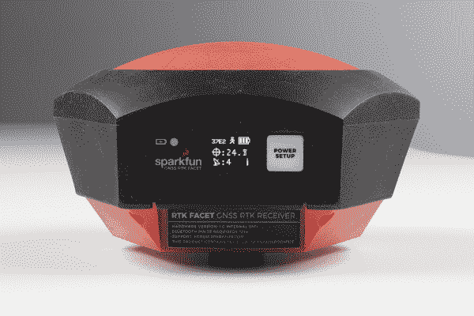](https://cdn.sparkfun.com/assets/learn_tutorials/2/1/8/8/SparkFun_RTK_Facet_-_Front_Face_All.jpg)

RTK 面板有一个按钮，用于现场配置更改的**电源**和**设置**。按住电源按钮将会打开或关闭电源。短按该按钮将导致 RTK 刻面改变模式。

该器件可用于四种模式:

*   GNSS 定位(约 30 厘米精度)-也称为“漫游者”
*   带 RTK 的 GNSS 定位(1.4 厘米精度)-也称为“带 RTK 定位的漫游者”
*   GNSS 基站
*   GNSS 基站 NTRIP 服务器

在*上电*时，设备将进入漫游或基本模式；设备在最后一次断电时所处的状态。当瞬间按下电源/设置按钮时，会出现一个菜单，将 RTK 刻面更改为*漫游者*或*基地*模式。显示屏会用一个小车或旗帜图标来指示变化。

在*漫游者*模式下，RTK 面将接收来自四个星座(GPS、GLONASS、伽利略和北斗)的 L1 和 L2 GNSS 信号，并根据这些信号计算位置。与标准等级的 GPS 接收器类似，RTK Facet 将以 4Hz 的频率输出行业标准的 NMEA 句子，并通过任何配对的蓝牙设备广播它们。最终用户将需要使用常见的移动应用程序、GIS 产品或嵌入式设备(有许多开源库)来解析 NMEA 的句子。与具有 2500 米精度的标准等级 GPS 接收机不同，这种模式下的精度大约为 300 毫米水平位置精度，具有良好等级的 L1/L2 天线。

当设备处于*漫游器*模式且 RTCM 校正数据通过蓝牙发送或进入无线电端口时，设备将自动进入带有 RTK 模式的**定位。在这种模式下，RTK Facet 将从天线接收 L1/L2 信号，并从基站接收校正数据。接收器将快速(在一秒钟内)获得 RTK float，然后定位。NMEA 句子的水平精度将提高到 14 毫米，垂直精度将提高到 10 毫米。使用手机上的免费应用程序(参见 SW Maps 或 Lefebure NTRIP ),最容易通过互联网获得 RTCM 校正数据，并通过蓝牙将其发送到 RTK Facet，但 RTCM 也可以通过外部蜂窝或无线电链路发送到作为基站设置的第二 RTK Facet。**

在*基站*模式下，设备将进入*基站*模式。当设备安装在固定位置(如三脚架或屋顶)时使用。RTK 方面将发起调查。60 到 120 秒后，勘测将完成，RTK 方面将开始从无线电端口传输 RTCM 校正数据。底座通常与设置为“漫游”的第二个 RTK 刻面(或 RTK Surveyor)单元结合使用，以获得 14 毫米的精度。换句话说，基地静止不动，并向漫游车发送校正数据，以便漫游车可以输出真正准确的位置。您将创建一个没有任何其他设置的 RTK 系统。

#### **功率**

[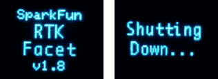](https://cdn.sparkfun.com/assets/learn_tutorials/2/1/8/8/SparkFun_RTK_Facet_-_Display_On_Off.jpg)*RTK Facet startup display with firmware version number*

电源按钮打开和关闭设备。按住电源按钮，直到显示屏亮起。任何时候按住电源按钮都可以关闭本机。

*RTK Facet showing the battery level*

RTK Facet 有一个大型的内置 6000mAh 锂聚合物电池，充电后可在野外使用 25 小时以上。如果需要更多的时间，可以连接一个通用 USB 电源组，将现场时间增加到所需的任何时间。

### **充电指示灯**

[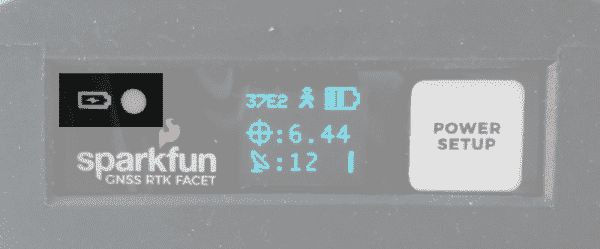](https://cdn.sparkfun.com/assets/learn_tutorials/2/1/8/8/SparkFun_RTK_Facet_-_Front_Face_-_Charge_LED.jpg)

充电指示灯位于正面。只要有外部电源，它就会亮起，当内部电池充满电时，它就会熄灭。在设备完全断电的情况下，使用 1A 壁式电源充电约需 6 小时，使用标准 USB 端口充电约需 12 小时。RTK 刻面可以在充电时运行，但会增加充电时间。支持使用外部 USB 电池组长时间运行设备，或使用永久性墙壁电源运行设备。

### **连接器**

[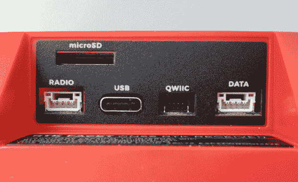](https://cdn.sparkfun.com/assets/learn_tutorials/2/1/8/8/SparkFun_RTK_Facet_-_Ports.jpg)*The SparkFun RTK Facet connectors shown with the dust cover removed*

有多种连接器受到防尘盖的保护。

#### **USB:**

[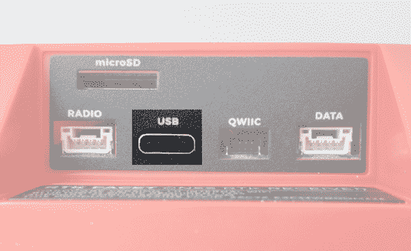](https://cdn.sparkfun.com/assets/learn_tutorials/2/1/8/8/SparkFun_RTK_Facet_-_Ports_-_USB.jpg)

该 USB C 连接器有三个用途:

*   给设备充电
*   配置 RTK 方面，并重新编程 ESP32
*   直接配置和检查 ZED-F9P GNSS 接收机

RTK 方面内置了一个 USB 集线器。当您将设备连接到计算机时，它将枚举为两个 COM 端口。

[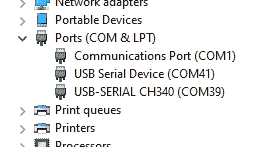](https://cdn.sparkfun.com/assets/learn_tutorials/2/1/8/8/SparkFun_RTK_Facet_-_Multiple_COM_Ports.jpg)

上图中，`USB Serial Device`是 ZED-F9P，`USB-SERIAL CH340`是 ESP32。

**Don't See 'USB-Serial CH340'?** If you've never connected a CH340 device to your computer before, you may need to install drivers for the USB-to-serial converter. Check out our section on ["How to Install CH340 Drivers"](https://learn.sparkfun.com/tutorials/sparkfun-serial-basic-ch340c-hookup-guide#drivers-if-you-need-them) for help with the installation.**Don't See 'USB Serial Device'?** The first time a u-blox module is connected to a computer you may need to adjust the COM driver. Check out our section on ["How to Install u-blox Drivers"](https://learn.sparkfun.com/tutorials/getting-started-with-u-center-for-u-blox#install-drivers) for help with the installation.

通过串行文本菜单，可在 *USB 串行 CH340* COM 端口上配置 RTK 面。各种调试消息以 115200bps 的速度打印到该端口，并且可以打开一个串行菜单来配置高级设置。

配置 ZED-F9P 可以使用 [u-center](https://learn.sparkfun.com/tutorials/getting-started-with-u-center-for-u-blox/all) 通过 *USB 串行设备*端口进行配置。这在正常操作中不是必需的，但对于根据特定应用定制接收机来说却很方便。作为额外的好处，ZED-F9P 可以被一些手机和平板电脑自动检测到。如果需要，接收器可以直接连接到兼容的手机或平板电脑，无需蓝牙连接。

#### **收音机:**

[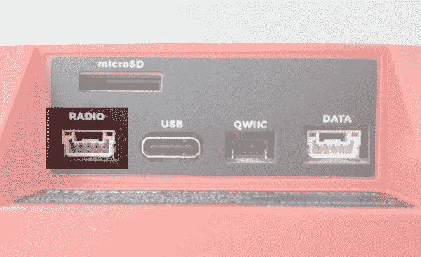](https://cdn.sparkfun.com/assets/learn_tutorials/2/1/8/8/SparkFun_RTK_Facet_-_Ports_-_Radio.jpg)

当需要外部蜂窝或无线电链路时，使用此端口。如果您通过蓝牙将 RTCM 从手机传输到 RTK Facet，此端口*不会*使用。

这种 4 针 JST 连接器可用于在设备充当流动站时允许 RTCM 校正数据流入设备，或在设备充当基站时允许数据流出设备。该连接器是一个 4 针锁定 1.25 毫米 JST SMD 连接器(零件号:SM04B-GHS-TB，配套连接器零件号:GHR-04V-S)。RTK Facet 带有一根电缆来连接该连接器，但可以购买额外的电缆。如果你无法在互联网上访问校正源，你最有可能将这个端口连接到我们的[串行遥测无线电](https://www.sparkfun.com/products/19032)之一。引脚排列从左到右分别是 **3.5-5.5V** / TX / RX / GND 如图。 **3.5V 至 5.5V** 由该连接器提供，为收音机提供取决于电源的电压。如果 USB 连接到 RTK 面，则该端口上的电压将为 **5V** (+/-10%)。如果使用内部电池，则此端口上的电压将随电池电压而变化(根据充电状态， **3.5V** 至 **4.2V** )。该端口能够提供高达 600mA 的电流，并受 PTC(可复位保险丝)保护。该端口不应连接到电源。

#### **数据:**

[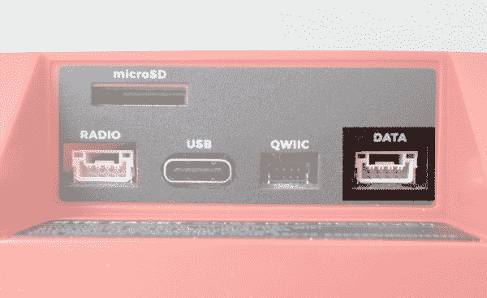](https://cdn.sparkfun.com/assets/learn_tutorials/2/1/8/8/SparkFun_RTK_Facet_-_Ports_-_Data.jpg)

该端口用于连接外部系统，如漫游车、汽车、计时设备、相机触发器等。如果您通过蓝牙从 RTK Facet 向您的手机传输 NMEA 位置数据，此端口*不*使用。

这个 4 针 JST 连接器用于向 RTK 面输出和输入各种数据。该连接器是一个 4 针锁定 1.25 毫米 JST SMD 连接器(零件号:SM04B-GHS-TB，配套连接器零件号:GHR-04V-S)。RTK Facet 带有一根电缆来连接该连接器，但可以购买额外的电缆。

数据连接器内部连接到数字多路复用器，允许四种软件可选设置之一:

*   **NMEA**-TX 引脚输出任何使能的消息(NMEA、UBX 和 RTCM)，默认值为 460，800bps(可配置为 9600 至 921600bps)。RX 引脚可以接收 RTK 的 RTCM，如果需要，还可以接收 UBX 配置命令。
*   **PPS/Trigger**-TX 引脚输出精确到 30ns RMS 的每秒脉冲信号。RX 引脚连接到 ZED-F9P 的 EXTINT 引脚，允许以令人难以置信的精确纳秒分辨率测量事件。对于音频三角测量这样的事情很有用。更多信息参见 ZED-F9P 集成的 Timemark 部分。
*   **I2C** -在 I2C 总线上，TX 引脚作为 SCL 工作，RX 引脚作为 SDA 工作。这允许额外的传感器连接到 I2C 总线。
*   **GPIO**-TX 引脚作为 ESP32 上支持 DAC 的 GPIO。RX 引脚用作 ESP32 的 ADC 使能输入。这对自定义应用程序很有用。

大多数应用程序不需要使用该端口，而是通过蓝牙发送 NMEA 位置数据。该端口可用于向嵌入式微控制器或单板计算机发送位置数据。引脚排列为 **3.3V** / TX / RX / GND。 **3.3V** 如图从左到右，由该连接器提供，用于在需要时为远程设备供电。虽然该端口能够提供高达 600mA 的电流，但我们不建议超过 300mA。该端口不应连接到电源。

#### **microSD:**

[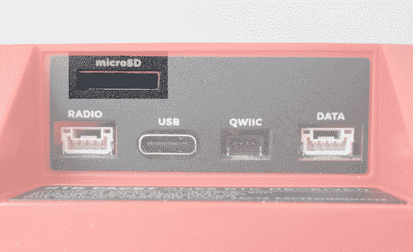](https://cdn.sparkfun.com/assets/learn_tutorials/2/1/8/8/SparkFun_RTK_Facet_-_Ports_-_microSD.jpg)

该插槽支持最高 32GB 的 FAT16 或 FAT32 格式的标准 microSD 卡。所有星座都支持以高达 4Hz 的频率记录 67 条消息中的任何一条。

日志记录支持以下 67 条消息:

| NMEA-GSA | NMEA 商品及服务税 | NMEA-GSV |
| NMEA-RMC | NMEA-VLW | NMEA-VTG |
| • NMEA-ZDA | 导航时钟 | 导航 DOP |
| • NAV-EOE | 导航地理围栏 | NAV-HPPOSECEF |
| NAV-HPPOSLLH | • NAV-ODO | 导航球 |
| 导航-POSECEF | 导航位置 | • NAV-PVT |
| 导航-重新定位 | 导航卫星系统 | • NAV-SIG |
| 导航状态 | • NAV-SVIN | • NAV-TIMEBDS |
| • NAV-TIMEGAL | 导航时间表 | • NAV-TIMEGPS |
| 导航时间 | • NAV-TIMEUTC | • NAV-VELECEF |
| • NAV-VELNED | RXM-MEASX | • RXM-RAWX |
| RXM-RLM | RXM-RTCM | XM-sfbx |
| MON 通信 | MON-HW2 | MON-HW3 |
| MON-HW | MON-IO | mon-msgid PP |
| MON-RF | mon-xbuf | 周一至 RXR |
| MON-TXBUF | 蒂姆·TM2 | • TIM-TP |
| TIM-VRFY | rtcm3x-1005 | RTCM3x-1074 |
| RTCM3x-1077 作业系统 | RTCM3x-1084 | RTCM3x-1087 |
| rtcm3x-1094 | RTCM3x-1097 | RTCM3x-1124 |
| RTCM3x-1127 | RTCM3x-1230 | rtcm3x-4072-0 |
| rtcm3x-4072-1 |  |  |

#### **Qwiic:**

[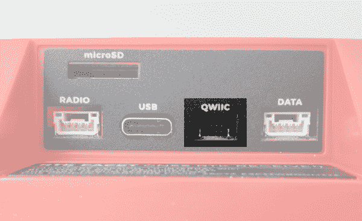](https://cdn.sparkfun.com/assets/learn_tutorials/2/1/8/8/SparkFun_RTK_Facet_-_Ports_-_Qwiic.jpg)

这个 4 针 [Qwiic 连接器](https://www.sparkfun.com/qwiic)暴露了 ESP32 WROOM 模块的 I2C 总线。目前，没有固件支持将 I ² C 设备添加到 RTK 方面，但将来可能会添加支持。

#### **天线:**

[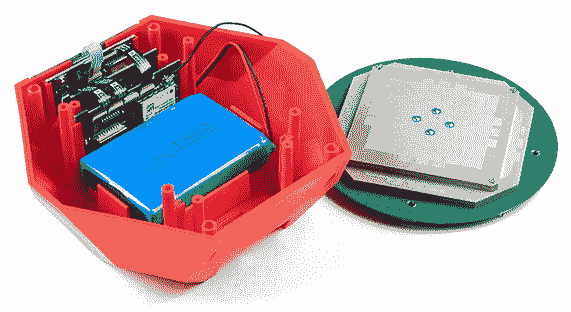](https://cdn.sparkfun.com/assets/learn_tutorials/2/1/8/8/SparkFun_RTK_Facet_L1_L2_Antenna_-_1.jpg)

它是内置的！位于 RTK 面的圆顶下的是一个测量员级的 L1/L2 天线。它与我们的 [GNSS 多波段 L1/L2 勘测天线](https://www.sparkfun.com/products/17751)中的元素相同。其数据表可在[这里](https://cdn.sparkfun.com/assets/b/4/6/d/e/TOP106_GNSS_Antenna.pdf)获得。

[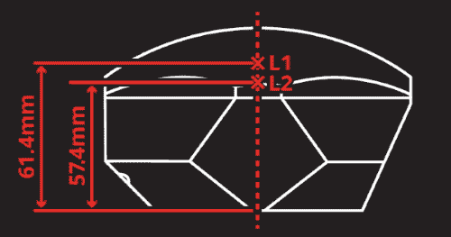](https://cdn.sparkfun.com/assets/learn_tutorials/2/1/8/8/SparkFun_RTK_Facet_-_ARP-1.jpg)*SparkFun RTK Facet Antenna Reference Points*

内置天线从底座到 L1 天线测量点的 ARP[为 61.4 毫米，到 L2 天线测量点的 ARP 为 57.4 毫米。](https://geodesy.noaa.gov/ANTCAL/FAQ.xhtml#faq4)

### **功率**

*RTK Facet Display showing three battery bars*

RTK Facet 内置 6000 毫安时电池，在蓝牙连接激活和 GNSS 完全跟踪的情况下，最差功耗约为 240 毫安。这将允许在野外使用大约 25 小时。如果在野外需要更多时间，可以连接一个标准的 USB 电源组。如果连接一个 10，000mAh 的电池组，可以估计运行时间为 56 小时，假设 25%的效率损失在电源组和 RTK 面内的充电电路上。

RTK 面可以从任何 USB 端口或适配器充电。充电电路的额定电流为 1000 毫安，因此 USB 2.0 端口的充电电流为 500 毫安，USB 3.0+端口的充电电流为 1A。

要快速查看充电状态，请打开设备。电池图标将指示以下内容:

*   3 格:剩余 75%以上的容量
*   2 巴:剩余超过 50%的容量
*   1 巴:剩余 25%以上容量
*   0 小节:剩余容量小于 25%

## 硬件概述-高级功能

[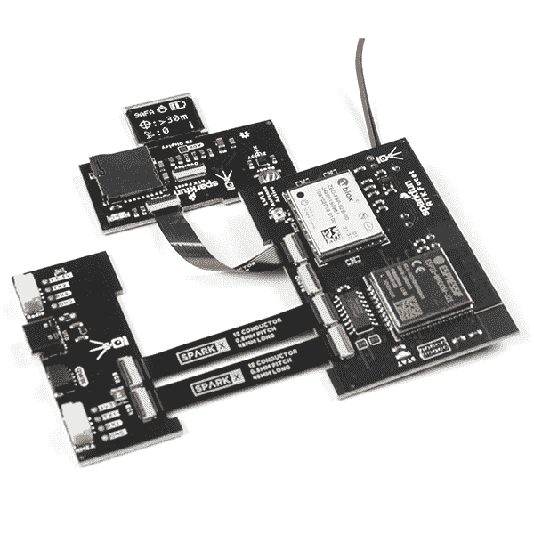](https://cdn.sparkfun.com/assets/learn_tutorials/2/1/8/8/RTK_Facet_Photos-07.jpg)*The boards that make up the RTK Facet*

RTK 方面是一个黑客的乐趣。在 RTK 方面的罩下是连接到 ZED-F9P 以及一些外围硬件(LiPo 燃料计、microSD 等)的 ESP32 WROOM。它是用 Arduino 编程的，最终用户可以根据自己的需要进行定制。

[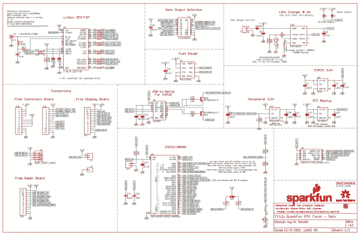](https://cdn.sparkfun.com/assets/learn_tutorials/2/1/8/8/SparkFun_RTK_Facet_-_Main_Schematic.pdf)*Click on the image to get a closer look at the Schematic!**The Facet with three sub boards, the battery, and antenna*

### ZED-F9P 全球导航卫星系统接收器

[ZED-F9P GNSS 接收机](https://www.sparkfun.com/products/16481)配置在 I ² C 上，使用两个 UART 输出 NMEA (UART1)和输入/输出 RTCM (UART2)。一般而言，ESP32 从 ZED-F9Ps UART1 获取数据，用于蓝牙传输和记录至 SD。

### ESP32

[ESP32](https://www.sparkfun.com/products/15663) 使用标准 USB 转串行转换 IC ( [CH340](https://learn.sparkfun.com/tutorials/how-to-install-ch340-drivers/all) )对设备进行编程。你可以将 ESP32 内核用于 Arduino 或 Espressif 的[物联网开发框架(IDF)](https://www.espressif.com/en/support/download/all) 。

CH340 会自动重置，并根据需要将 ESP32 置于引导加载模式。然而，如果需要外部复位按钮，则 ESP32 的复位引脚被引出至外部 2 引脚 0.1 英寸尺寸。

**Note:** If you've never connected a CH340 device to your computer before, you may need to install drivers for the USB-to-serial converter. Check out our section on ["How to Install CH340 Drivers"](https://learn.sparkfun.com/tutorials/sparkfun-serial-basic-ch340c-hookup-guide#drivers-if-you-need-them) for help with the installation.

### 脂肪和充电

RTK 刻面容纳了标准的 [6000mAh 3.7V LiPo](https://www.sparkfun.com/products/13856) 。充电电路设置为 1A，因此使用合适的电源，给空电池充电应该需要六个多小时。RTK 面上的 USB C 配置为 2A 汲取，因此如果用户连接到 USB 3.0 端口，充电电路应该在 1A 最大值附近工作。如果用户连接到 USB 2.0 端口，充电电路将在 500mA 下工作。这种充电电路还包括一个 42℃的温度上限，以确保在危险的条件下不能充电。

### 燃油表和加速计

[MAX17048](https://cdn.sparkfun.com/assets/learn_tutorials/1/4/6/3/MAX17048-MAX17049.pdf) 是一款简单易用的燃油表 IC，它为用户提供一份基本上是 0-100%报告的充电状态(SOC)。MAX17048 有一个复杂的算法来计算基于电池电压的 SOC，这超出了本教程的范围，但出于我们的目的，允许我们在单元打开时可靠地查看电池电量。

RTK 刻面还集成了一个 [LIS2DH12](https://cdn.sparkfun.com/assets/learn_tutorials/1/8/5/7/lis2dh12_accelerometer_datasheet.pdf) 三轴加速度计，有助于现场调平。

### Qwiic

该装置包括一个内部 [Qwiic 连接器](https://www.sparkfun.com/qwiic)用于未来扩展。目前，stock RTK Facet 不支持任何额外的 Qwiic 传感器或显示器，但用户可以为自己的应用添加支持。

### microSD

一个 microSD 插座位于 ESP32 SPI 总线上。支持最高 32GB 的任何 microSD。RTK Facet 支持 RAWX 和 NMEA 记录到 SD 卡。还可以设置最大日志记录时间(默认为 24 小时)，以避免数千兆字节的文本文件。有关 RAWX 和 PPP 的更多信息，请参见本教程。

### 数据端口和数字多路复用器

74HC4052 模拟多路复用器控制哪些数字信号路由至外部数据端口。这允许各种定制的最终用户应用。其中最有趣的是事件日志。由于 ZED-F9P 对输入数字信号具有微秒级精度，因此可以创建定制固件，根据接收器的位置和多个捕获事件之间的时间延迟对事件进行三角测量。目前，支持 TM2 事件日志记录。

此外，该多路复用器可以配置为连接 ESP 引脚 26(支持 DAC)和引脚 39(支持 ADC ),用于最终用户定制应用。

## 硬件装配

RTK Facet 设计用于低成本的现成设备。在这里，我们将描述如何组装一个漫游者和基地。

### 测量(漫游模式)

[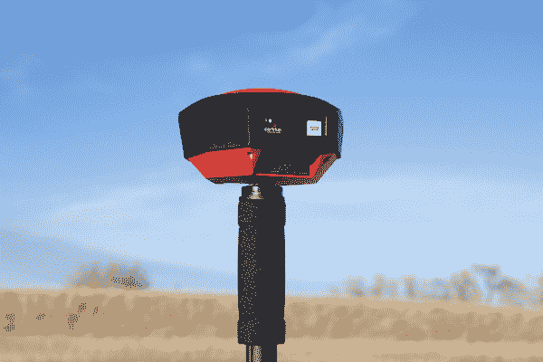](https://cdn.sparkfun.com/assets/learn_tutorials/2/1/8/8/SparkFun_RTK_Facet_-_On_Monopod.jpg)*Basic RTK Facet Rover setup with RTCM over Bluetooth*

上面显示的是最常见的 RTK 漫游者设置。使用为照相机设计的单极天线。单极天线的“摄像机螺纹[适应⅝11-TPI](https://www.sparkfun.com/products/17546)，RTK 刻面安装在顶部。不需要无线电，因为 RTCM 校正数据由电话通过蓝牙提供。

如果你要买一个单极天线(又名独脚架)，买一个长度为 65 英寸或更长的，以确保天线在你的头顶上。我们在亚马逊基础品牌上运气很好。

如果你喜欢将平板电脑或手机安装在单极天线上，一定要准备一个与单极天线的直径相匹配的夹子，并且要有一个旋钮来增加夹子的压力。我们的单极天线直径为 27 毫米，因此设备夹具需要能够处理该直径。

*2nd most common setup with a 915MHz Radio providing RTCM*

如果您通过无线电链路接收 RTCM 校正数据，建议您在 RTK 面的底部连接一个无线电。

[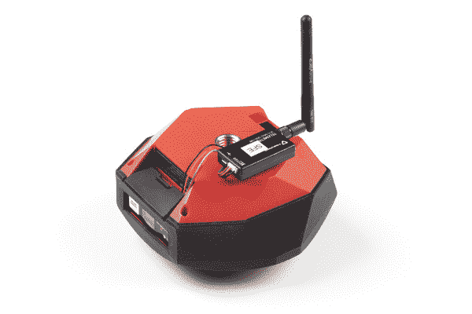](https://cdn.sparkfun.com/assets/learn_tutorials/2/1/8/8/SparkFun_RTK_Facet_-_External_Radio_Positioning.jpg)

来自 3M 公司的图片挂带是一个不错的半永久挂架。从**无线电**端口到任一[串行遥测无线电](https://www.sparkfun.com/products/19032)(成对装运)，插入 RTK 面包含的 4 针到 6 针 JST 电缆。我们真的很喜欢这些无线电，因为它们是开箱即用的，既可以发送也可以接收(所以哪个无线电连接到基站或漫游器并不重要)，而且它们的覆盖范围很大。我们用 100mW 无线电和底座上的[大 915MHz 天线](https://www.sparkfun.com/products/retired/14868)实现了超过 1 英里的范围(接近 1.5 英里或 2.4 公里)。

### 临时基地

当您在现场距离校正源和/或蜂窝接收太远时，需要临时或移动基站设置。第二个 RTK 面安装在三脚架上，并配置为完成勘测(又名，定位自身)，然后开始广播 RTCM 校正数据。这些数据(每秒约 1000 字节)被发送到用户选择的连接无线电。出于我们的目的，使用 915MHz 100mW 遥测无线电，因为它们在我们的基地和漫游者之间提供了基本上是串行的电缆。

*Temporary RTK Facet Base setup*

任何带“相机线”的三脚架都可以。亚马逊基础三脚架工作得很好，但是有点轻而且不稳。“相机线是[适应⅝”11-TPI](https://www.sparkfun.com/products/17546)和 RTK 刻面附在顶部。

一旦基地有了清晰的天空视野，打开 RTK 面板。一旦打开，按下*设置*按钮，将设备置于基本模式。显示屏将显示调查屏幕 60-120 秒。一旦测量完成，显示器将显示“x 拟合”显示，并开始产生 RTCM 校正数据。您可以通过查看遥测无线电上的 LED 来验证这一点(当从 RTK 面接收到串行数据时，红色小 LED 将闪烁)。RTK 刻面的设计遵循 u-blox 建议的 60 秒勘测，所有定位的平均 3D 标准偏差为 5 米。如果调查未能达到这些要求，它将在 10 分钟后自动重启。

**注意:**移动基站非常适合在野外快速移动。然而，不建议将测量方法用于最高精度的测量，因为基座的位置精度将直接转化为漫游者的精度。换句话说，如果你的基地的计算位置偏离了 100 厘米，那么你的漫游者的每个读数都会偏离。如果你在寻找最大的精确度，考虑安装一个带固定天线的[静态基座](https://learn.sparkfun.com/tutorials/how-to-build-a-diy-gnss-reference-station#static-base-setup--lasers)。我们能够使用 PPP 以令人难以置信的精度 [+/-2mm 的精度](https://cdn.sparkfun.com/assets/learn_tutorials/1/4/6/3/SparkFun_PPP_Results.png)精确定位 SparkFun 顶部的天线！

## 蓝牙和 NTRIP

RTK Facet 通过蓝牙串行端口配置文件(SPP)以 4Hz 和 115200bps 传输完整的 NMEA 句子。这意味着几乎所有可以通过串行端口接收 NMEA 数据的 GIS 应用程序(几乎所有都可以)都可以与 RTK Facet 一起使用。只要您的设备可以通过蓝牙(也称为 SPP)打开串行端口，您的设备就可以检索行业标准的 NMEA 位置数据。以下步骤显示了如何使用 SW Maps，但也可以遵循相同的步骤来连接任何基于串行端口的 GIS 应用程序。

请参见 [SparkFun RTK 产品手册](https://sparkfun.github.io/SparkFun_RTK_Firmware/connecting_bluetooth/)获取分步说明。

## 显示

RTK 刻面有一个 0.96 英寸高对比度有机发光二极管显示器。虽然很小，但它包含了各种情况数据，这些数据在野外可能会有所帮助。我们将带您参观每个展示区。

请参见 [SparkFun RTK 产品手册](https://sparkfun.github.io/SparkFun_RTK_Firmware/displays/)了解每个显示器的说明。

## 系统配置

开箱即用，SparkFun RTK 产品是出色的开箱即用 GNSS 接收机，只需很少或无需配置即可使用。此外，SparkFun 的 RTK 产品系列非常易于配置。请参见 [SparkFun RTK 产品手册](https://sparkfun.github.io/SparkFun_RTK_Firmware/intro/)了解 RTK 产品上所有可用功能的详细描述。

## 固件更新和定制

RTK Facet 是开源硬件，这意味着你可以完全访问[固件](https://github.com/sparkfun/SparkFun_RTK_Firmware)和[硬件](https://github.com/sparkfun/SparkFun_RTK_Facet)。

SparkFun 将不时发布 RTK 产品线的新固件，以增加和改进功能。我们已经尽可能容易地更新固件。请参见[更新 RTK 固件](https://sparkfun.github.io/SparkFun_RTK_Firmware/firmware_update/)获取分步指南。

## 解决纷争

### 无法连接到 SWMaps

你看到了吗**GNSS 仪器连接失败！**？

设置了错误的仪器。请从仪器下拉列表中选择“SparkFun RTK Surveyor”。

[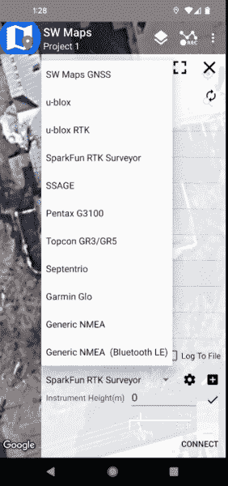](https://cdn.sparkfun.com/assets/learn_tutorials/2/1/8/8/List_of_Instruments_in_SWMaps.jpg)*Select SparkFun RTK Surveyor before clicking 'Connect'***Not working as expected and need help?**

If you need technical assistance and more information on a product that is not working as you expected, we recommend heading on over to the [SparkFun Technical Assistance](https://www.sparkfun.com/technical_assistance) page for some initial troubleshooting.

[SparkFun Technical Assistance Page](https://www.sparkfun.com/technical_assistance)

If you don't find what you need there, the [SparkFun Forums](https://forum.sparkfun.com/index.php) are a great place to find and ask for help. If this is your first visit, you'll need to [create a Forum Account](https://forum.sparkfun.com/ucp.php?mode=register) to search product forums and post questions.

[Create New Forum Account](https://forum.sparkfun.com/ucp.php?mode=register)   [Log Into SparkFun Forums](https://forum.sparkfun.com/index.php)

## 资源和更进一步

我们希望你和我们一样喜欢使用 RTK Facet！

以下是 RTK 方面的相关技术文档:

*   [ZED-F9P GNSS 接收机数据表](https://cdn.sparkfun.com/assets/learn_tutorials/1/4/6/3/ZED-F9P_Datasheet.pdf)
*   [MAX17048 燃油表 IC](https://cdn.sparkfun.com/assets/learn_tutorials/1/4/6/3/MAX17048-MAX17049.pdf)
*   [spark fun RTK Facet GitHub Repo](https://github.com/sparkfun/SparkFun_RTK_Facet)(包含开源硬件电子设备和外壳)
*   [SparkFun RTK 固件 GitHub Repo](https://github.com/sparkfun/SparkFun_RTK_Surveyor) (包含运行 SparkFun RTK 产品的固件)

查看这些附加教程，供您阅读:

 [### 迷你 GPS 屏蔽连接指南](https://learn.sparkfun.com/tutorials/mini-gps-shield-hookup-guide) A hookup guide for the SparkFun Mini GPS Shield.[Favorited Favorite](# "Add to favorites") 5 [### HX1 APRS 变送器连接指南](https://learn.sparkfun.com/tutorials/hx1-aprs-transmitter-hookup-guide) The HX1 is a low-power amateur radio transmitter that can be used to send data to the Automatic Packet Reporting System (APRS) network.[Favorited Favorite](# "Add to favorites") 5 [### 用 GPS 模块显示你的坐标](https://learn.sparkfun.com/tutorials/displaying-your-coordinates-with-a-gps-module) This Arduino tutorial will teach you how to pinpoint and display your GPS coordinates with a press of a button using hardware from our Qwiic Connect System (I2C).[Favorited Favorite](# "Add to favorites") 14 [### SparkFun GPS 航位推算 NEO-M8U 连接指南](https://learn.sparkfun.com/tutorials/sparkfun-gps-dead-reckoning-neo-m8u-hookup-guide) The u-blox NEO-M8U is a powerful GPS units that takes advantage of untethered dead reckoning (UDR) technology for navigation. The module provides continuous positioning for vehicles in urban environments and during complete signal loss (e.g. short tunnels and parking garages). We will quickly get you set up using the Qwiic ecosystem and Arduino so that you can start reading the output 3 [### ESP32 Thing Plus 连接指南](https://learn.sparkfun.com/tutorials/esp32-thing-plus-hookup-guide) Hookup guide for the ESP32 Thing Plus (Micro-B) using the ESP32 WROOM's WiFi/Bluetooth system-on-chip in Arduino.[Favorited Favorite](# "Add to favorites") 8 [### 如何安装 CH340 驱动程序](https://learn.sparkfun.com/tutorials/how-to-install-ch340-drivers) How to install CH340 drivers (if you need them) on Windows, Mac OS X, and Linux.[Favorited Favorite](# "Add to favorites") 9 [### 设置基于流动站的 RTK 系统](https://learn.sparkfun.com/tutorials/setting-up-a-rover-base-rtk-system) Getting GNSS RTCM correction data from a base to a rover is easy with a serial telemetry radio! We'll show you how to get your high precision RTK GNSS system setup and running.[Favorited Favorite](# "Add to favorites") 15 [### 如何建立一个 DIY GNSS 参考站](https://learn.sparkfun.com/tutorials/how-to-build-a-diy-gnss-reference-station) Learn how to affix a GNSS antenna, use PPP to get its ECEF coordinates and then broadcast your own RTCM data over the internet and cellular using NTRIP to increase rover reception to 10km 14************