# SparkFun 卫星收发器套件- Swarm M138 连接指南

> 原文：<https://learn.sparkfun.com/tutorials/sparkfun-satellite-transceiver-kit---swarm-m138-hookup-guide>

## 介绍

寻找一种通过卫星发送和接收数据信息的低成本方式？就是这个！凭借清晰的天空视野，卫星收发器 Breakout - Swarm M138 允许您发送和接收短消息。它可以在世界上任何地方工作，包括极地地区，远远超出了 WiFi 和蜂窝网络的覆盖范围。它非常适合各种低带宽用例:从连接人员和跟踪车辆、船只或包裹，到为农业、能源和工业物联网应用中继传感器数据。内置 GNSS 接收器使其成为许多跟踪应用的完美之选。

我们创造了卫星收发器突破，使使用 Swarm M138 调制解调器尽可能容易。想要将它连接到您的笔记本电脑或 Raspberry Pi，并在任何地方发送和接收消息吗？你完全可以这么做。想要将它连接到 Arduino 板上，并通过调制解调器的 3.3V UART 串行接口发送和接收信息吗？你也绝对可以这样做！

我们开始吧！

[](https://www.sparkfun.com/products/21287) 

将**添加到您的[购物车](https://www.sparkfun.com/cart)中！**

### [SparkFun 卫星收发套件——Swarm M138](https://www.sparkfun.com/products/21287)

[In stock](https://learn.sparkfun.com/static/bubbles/ "in stock") KIT-21287

凭借清晰的天空视野，卫星收发器 Breakout - Swarm M138 允许您发送和接收短消息。

$199.95[Favorited Favorite](# "Add to favorites") 16[Wish List](# "Add to wish list")** **### 推荐阅读

想围绕主题阅读？您可能会发现先阅读这些教程很有用:

[](https://learn.sparkfun.com/tutorials/serial-communication) [### 串行通信](https://learn.sparkfun.com/tutorials/serial-communication) Asynchronous serial communication concepts: packets, signal levels, baud rates, UARTs and more 100[](https://learn.sparkfun.com/tutorials/logic-levels) [### 逻辑电平](https://learn.sparkfun.com/tutorials/logic-levels) Learn the difference between 3.3V and 5V devices and logic levels.[Favorited Favorite](# "Add to favorites") 82[](https://learn.sparkfun.com/tutorials/terminal-basics) [### 串行终端基础知识](https://learn.sparkfun.com/tutorials/terminal-basics) This tutorial will show you how to communicate with your serial devices using a variety of terminal emulator applications.[Favorited Favorite](# "Add to favorites") 46[](https://learn.sparkfun.com/tutorials/how-to-work-with-jumper-pads-and-pcb-traces) [### 如何使用跳线焊盘和 PCB 走线](https://learn.sparkfun.com/tutorials/how-to-work-with-jumper-pads-and-pcb-traces) Handling PCB jumper pads and traces is an essential skill. Learn how to cut a PCB trace, add a solder jumper between pads to reroute connections, and repair a trace with the green wire method if a trace is damaged.[Favorited Favorite](# "Add to favorites") 11[](https://learn.sparkfun.com/tutorials/three-quick-tips-about-using-ufl) [### 关于使用 U.FL 的三个快速提示](https://learn.sparkfun.com/tutorials/three-quick-tips-about-using-ufl) Quick tips regarding how to connect, protect, and disconnect U.FL connectors.[Favorited Favorite](# "Add to favorites") 14[](https://learn.sparkfun.com/tutorials/how-to-install-ch340-drivers) [### 如何安装 CH340 驱动程序](https://learn.sparkfun.com/tutorials/how-to-install-ch340-drivers) How to install CH340 drivers (if you need them) on Windows, Mac OS X, and Linux.[Favorited Favorite](# "Add to favorites") 9

## 盒子里有什么？

[SparkFun 卫星收发器套件- Swarm M138](https://www.sparkfun.com/products/21287) 包含您开始使用 Swarm 网络所需的一切:

[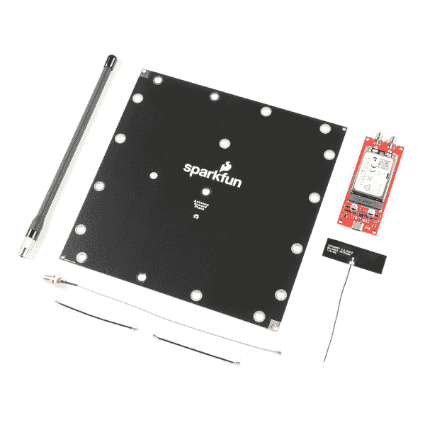](https://cdn.sparkfun.com/assets/learn_tutorials/2/7/5/6/21218-Swarm-kit.jpg)*Having a hard time seeing? Click the image for a closer look.*

*   Swarm M138 调制解调器
*   SparkFun 卫星收发器突破
*   群体甚高频天线和火花接地层
*   Molex 胶粘 u.FL GNSS 天线
*   2 根 25 毫米 u.FL 电缆，u.FL 至 SMA 适配器和 2 根 M2.5 螺钉

M138 调制解调器是迷你 PCI Express (mPCIe)格式的板。安装非常简单，只需将其插入分线板上的匹配连接器，并用两颗 M2.5 螺丝将其固定到位。我们将在下面更详细地讨论[硬件装配](https://learn.sparkfun.com/tutorials/satellite-transceiver-breakout---swarm-m138---hookup-guide#hardware-assembly)。

调制解调器上有两个 u.FL 天线连接，一个标记为“VHF”(用于与群卫星通信的甚高频信号)，另一个用于卫星导航(标记为“GPS”)。如果愿意，您可以将提供的天线直接连接到调制解调器上的 u.FL 连接器。或者，您可以使用提供的 25 毫米 u.FL 电缆将调制解调器连接到分线点上坚固的 SMA 连接。

Swarm 天线是一种专门设计的线圈四分之一波长天线，调谐到 Swarm 卫星频率。它需要一个接地层，因此我们在包装盒中也包含了一个接地层！它带有安装孔，可以固定在(例如)2 英寸或 1.5 英寸的天线杆、相机三脚架或扶手上。

Both antennas need to be located outdoors, with a clear view of the sky. But **the modem and breakout board are not weatherproof**. Depending on how you are going to weatherproof the boards, and where they are going to be located, you may find additional extension cables or GNSS antennas useful.[](https://www.sparkfun.com/products/14986) 

将**添加到您的[购物车](https://www.sparkfun.com/cart)中！**

### [【GPS/GNSS 磁悬挂天线- 3m (SMA)](https://www.sparkfun.com/products/14986)

[In stock](https://learn.sparkfun.com/static/bubbles/ "in stock") GPS-14986

这款出色的 GPS/GNSS 天线专为 GPS 和 GLONASS 接收而设计。

$13.953[Favorited Favorite](# "Add to favorites") 7[Wish List](# "Add to wish list")****[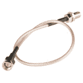](https://www.sparkfun.com/products/12861) 

将**添加到您的[购物车](https://www.sparkfun.com/cart)中！**

### [接口电缆- SMA 母到 SMA 公(25cm)](https://www.sparkfun.com/products/12861)

[28 available](https://learn.sparkfun.com/static/bubbles/ "28 available") WRL-12861

这是一种基本的 SMA(超小型 A)公母连接器电缆。每根电缆长 25 厘米(9.8 英寸)，阻抗为 50ω…

$5.501[Favorited Favorite](# "Add to favorites") 8[Wish List](# "Add to wish list")****[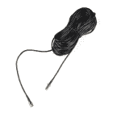](https://www.sparkfun.com/products/17495) 

将**添加到您的[购物车](https://www.sparkfun.com/cart)中！**

### [SMA 公对 SMA 母- 10m (RG174)](https://www.sparkfun.com/products/17495)

[In stock](https://learn.sparkfun.com/static/bubbles/ "in stock") CAB-17495

这款 10 米(33') SMA 延长线可以很好地将您的接收机或收音机连接到远处的天线上，而且射频损耗极低…

$7.50[Favorited Favorite](# "Add to favorites") 4[Wish List](# "Add to wish list")****[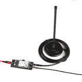](https://www.sparkfun.com/products/19576) 

将**添加到您的[购物车](https://www.sparkfun.com/cart)中！**

### [磁力挂载 SMA - 2m](https://www.sparkfun.com/products/19576)

[In stock](https://learn.sparkfun.com/static/bubbles/ "in stock") GPS-19576

在试验 GPS 或 RF 时，将天线放在你的房子或汽车顶部，视野清晰，会非常方便…

$24.95[Favorited Favorite](# "Add to favorites") 0[Wish List](# "Add to wish list")******** ********如果你要将分线点连接到你的电脑、笔记本电脑或 Raspberry Pi，你还需要一根 USB-C 电缆:

[](https://www.sparkfun.com/products/15425) 

将**添加到您的[购物车](https://www.sparkfun.com/cart)中！**

### [可逆 USB A 转 C 线- 0.8m](https://www.sparkfun.com/products/15425)

[15 available](https://learn.sparkfun.com/static/bubbles/ "15 available") CAB-15425

这些 0.8 米电缆稍作修改，允许它们插入其端口，而不管它们在…

$5.502[Favorited Favorite](# "Add to favorites") 5[Wish List](# "Add to wish list")****[](https://www.sparkfun.com/products/15424) 

将**添加到您的[购物车](https://www.sparkfun.com/cart)中！**

### [可逆 USB A 转 C 线- 2m](https://www.sparkfun.com/products/15424)

[18 available](https://learn.sparkfun.com/static/bubbles/ "18 available") CAB-15424

这些 2 米长的电缆稍加修改后，就可以插入其端口，而不用考虑其在 U…

$8.951[Favorited Favorite](# "Add to favorites") 4[Wish List](# "Add to wish list")****[](https://www.sparkfun.com/products/14743) 

将**添加到您的[购物车](https://www.sparkfun.com/cart)中！**

### [USB 3.1 线 A 到 C - 3 脚](https://www.sparkfun.com/products/14743)

[In stock](https://learn.sparkfun.com/static/bubbles/ "in stock") CAB-14743

USB C 棒极了。但是，在我们将所有的集线器、充电器和端口转换为 USB C 之前，这是您要使用的电缆…

$5.504[Favorited Favorite](# "Add to favorites") 9[Wish List](# "Add to wish list")****[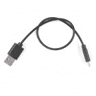](https://www.sparkfun.com/products/15426) 

将**添加到您的[购物车](https://www.sparkfun.com/cart)中！**

### [可逆 USB A 转 C 线- 0.3m](https://www.sparkfun.com/products/15426)

[In stock](https://learn.sparkfun.com/static/bubbles/ "in stock") CAB-15426

这些 0.3 米长的电缆稍加修改后，可以插入其端口，而无需考虑其在…

$4.501[Favorited Favorite](# "Add to favorites") 4[Wish List](# "Add to wish list")******** ********要将分线点连接到您的 Arduino 板吗？你可能需要:断开接头和跳线。2 针跳线将有助于以后重新链接 CH340 连接。

[](https://www.sparkfun.com/products/116) 

将**添加到您的[购物车](https://www.sparkfun.com/cart)中！**

### [破开头球——直击](https://www.sparkfun.com/products/116)

[In stock](https://learn.sparkfun.com/static/bubbles/ "in stock") PRT-00116

一排标题-打破适应。40 个引脚，可切割成任何尺寸。用于定制 PCB 或通用定制接头。

$1.7520[Favorited Favorite](# "Add to favorites") 133[Wish List](# "Add to wish list")****[](https://www.sparkfun.com/products/9140) 

将**添加到您的[购物车](https://www.sparkfun.com/cart)中！**

### [跳线高级 6" M/F 装 10 根](https://www.sparkfun.com/products/9140)

[In stock](https://learn.sparkfun.com/static/bubbles/ "in stock") PRT-09140

这是一个 SparkFun 独家！这些都是 155 毫米长，26 美国线规跳线终止作为男性到女性。用这些来跳离…

$4.501[Favorited Favorite](# "Add to favorites") 16[Wish List](# "Add to wish list")****[](https://www.sparkfun.com/products/553) 

将**添加到您的[购物车](https://www.sparkfun.com/cart)中！**

### [挣脱男头球-直角](https://www.sparkfun.com/products/553)

[In stock](https://learn.sparkfun.com/static/bubbles/ "in stock") PRT-00553

一排直角公接头-断开以适合。40 个引脚，可切割成任何尺寸。用于定制 PCB 或一般定制…

$2.255[Favorited Favorite](# "Add to favorites") 47[Wish List](# "Add to wish list")****[](https://www.sparkfun.com/products/9389) 

将**添加到您的[购物车](https://www.sparkfun.com/cart)中！**

### [跳线高级 12" F/F 包 10 个](https://www.sparkfun.com/products/9389)

[In stock](https://learn.sparkfun.com/static/bubbles/ "in stock") PRT-09389

这是一个 SparkFun 独家！这些是 12 英寸长、26 AWG 跳线，端接为母对母。用这些来跳离…

$4.95[Favorited Favorite](# "Add to favorites") 3[Wish List](# "Add to wish list")****[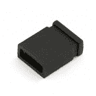](https://www.sparkfun.com/products/9044) 

将**添加到您的[购物车](https://www.sparkfun.com/cart)中！**

### [跳线- 2 引脚](https://www.sparkfun.com/products/9044)

[In stock](https://learn.sparkfun.com/static/bubbles/ "in stock") PRT-09044

这是两个引脚跳线(也称为分流器)，用于在两个引脚接头之间建立电气连接。通常我们…

$0.45[Favorited Favorite](# "Add to favorites") 7[Wish List](# "Add to wish list")****[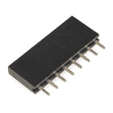](https://www.sparkfun.com/products/11895) 

将**添加到您的[购物车](https://www.sparkfun.com/cart)中！**

### [【接头- 8 针母(PTH，0.1”)](https://www.sparkfun.com/products/11895)

[22 available](https://learn.sparkfun.com/static/bubbles/ "22 available") PRT-11895

这些是标准的 0.1 英寸间距的接头引脚，可以通过通孔安装。这种接头可以与大多数 8 针 m…

$0.75[Favorited Favorite](# "Add to favorites") 6[Wish List](# "Add to wish list")************ ************## 群体卫星

Swarm 的使命是以最低的成本随时随地连接人和设备。

如果你过去使用过卫星通信系统，你会知道如果你要发送大量数据，信息成本会很高。蜂群正在改变这一切。他们独特的小卫星是太空中最小的运行卫星，只有 11 x 11 x 2.8 厘米。由于体积小，它们的发射成本比大多数卫星要低得多，这些节省下来的成本会传递给它们的客户。

[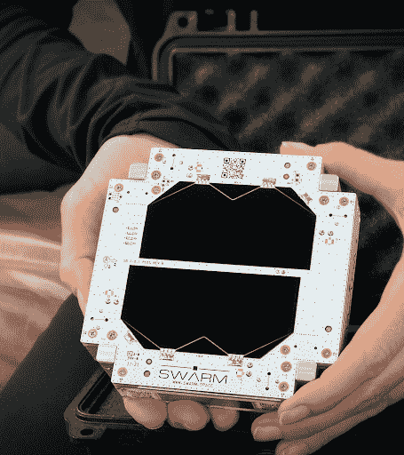](https://cdn.sparkfun.com/assets/home_page_posts/4/8/6/0/unnamed__2_.png)Each Swarm modem requires a data plan to send and receive data. However, the cost of this is *much* lower than other networks. A data plan is an annual contract for USD $60 per year (USD $5 per month). Each plan includes 750 data packets per month. Each packet can be up to 192 Bytes in size. You can also stack up to 4 data plans, allowing a single modem to use 3000 packets (576 kBytes) per month. Please see the [Registering Your Swarm M138 Modem]( https://swarm.space/registering-your-swarm-m138-modem/) for full details. Additionally, you can create or login to your Swarm account [here](https://bumblebee.hive.swarm.space/login).Swarm provide global coverage over all regions, but there are regulatory restrictions for specific countries.

The current list of approved countries / regions for the M138 Modem is: USA, Antarctica, Australia, Austria, Brazil, Canada, Colombia, Denmark, Georgia, Germany, Greenland, Iceland, Ireland, New Zealand, Netherlands, Spain, Sweden, United Kingdom and International Waters (12 nautical miles offshore).

Swarm continues to grow this list of approved countries as quickly as possible. Customers will receive regular updates on approved regions through the [Swarm newsletter](https://swarm.space/contact/).

## 群网络综述

当太空蜂经过任何给定的位置时，它会向处于接收状态的群调制解调器发送信标包。调制解调器的天线需要有一个清晰的天空视野，以及一个低射频噪声环境来接收这个卫星信标。

*卫星信标包的格式:*

```
$RT RSSI=,SNR=,FDEV =,TS=,DI=*xx 
```

一旦调制解调器接收到这个卫星信标，它将试图向卫星发送任何排队的传输包。卫星成功接收的信息包随后将被卫星确认回调制解调器。然后，调制解调器将从其输出传输队列中丢弃该信息包。

Swarm M138 调制解调器最多可存储 1000 个外发信息包。每个消息包的默认保存时间为 48 小时，这是用户可配置的，在此之后，如果没有传输，该包将被丢弃。

然后，卫星将携带该信息包，直到它通过一个群地面站。卫星将把信息包下行传输到地面站，之后数据将被路由到名为 [Swarm Hive](https://bumblebee.hive.swarm.space/login) 的 Swarm 云平台。然后用户可以在 Hive 上查看他们的数据，或者使用 Swarm 的 [REST API](https://bumblebee.hive.swarm.space/apiDocs) 或 [webhooks](https://bumblebee.hive.swarm.space/delivery) 提取数据。

[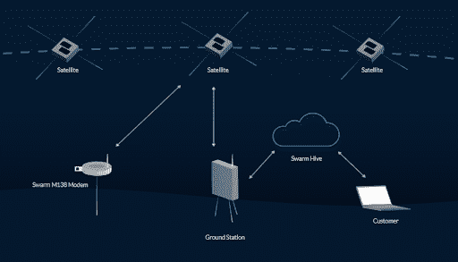](https://cdn.sparkfun.com/assets/home_page_posts/4/8/6/0/unnamed__6_.png)

在被丢弃之前，Swarm 蜂箱将保留数据 30 天，因此最好从蜂箱中取出该数据以供以后参考。Swarm 有一个 Python 脚本的例子，你可以点击[这里](https://swarm.space/swarm-python-script-example/)下载。

## 硬件概述

### Swarm M138 调制解调器

[](https://cdn.sparkfun.com/assets/learn_tutorials/2/4/5/1/19236-Satellite_Transceiver_Breakout_-_Swarm_M138-03_HRd_-_HG.jpg)*Don't worry about that QR code. It doesn't go anywhere.*

我们产品的核心是 Swarm M138 卫星调制解调器。这是一个迷你 PCI Express 卡，包含卫星调制解调器和一个非常强大的 u-blox GNSS 接收器，所有这些都在一个集成包中！它可以在很宽的电源电压范围内工作:最小 3.0V 最大 5.0V。它的标准 3.3V CMOS 串行 UART 接口和 NMEA 风格的命令集使其易于集成到您的项目中。

The peak current draw during transmit depends on the supply voltage. Please see [Current Draw](https://learn.sparkfun.com/tutorials/satellite-transceiver-breakout---swarm-m138---hookup-guide#current-draw) below for more details.

### USB-C 和 CH340

[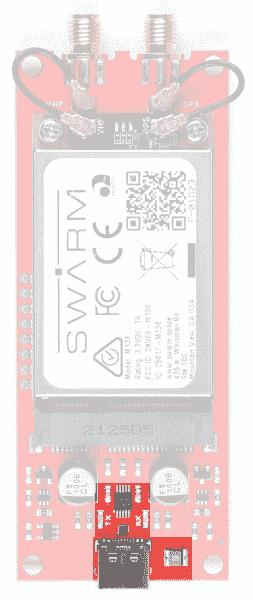](https://cdn.sparkfun.com/assets/learn_tutorials/2/7/5/6/21218-Swarm-USBC-CH340.jpg)

除了全套分线引脚之外，我们的主板还包括一个用于电源和/或串行数据的 USB-C 接口。想要将它插入您的笔记本电脑或 Raspberry Pi，并使用它在现场进行交流吗？你完全可以做到！

我们已经包括我们的标准 CH340E 接口芯片转换 USB 到串行。在 Windows 上，您可能需要安装驱动程序，我们有一个教程可以帮助您:

[](https://learn.sparkfun.com/tutorials/how-to-install-ch340-drivers) [### 如何安装 CH340 驱动程序](https://learn.sparkfun.com/tutorials/how-to-install-ch340-drivers) How to install CH340 drivers (if you need them) on Windows, Mac OS X, and Linux.[Favorited Favorite](# "Add to favorites") 9You can power the board directly from USB-C or USB 3 ports, but not older USB 2.0 ports. Please see [Current Draw](https://learn.sparkfun.com/tutorials/satellite-transceiver-breakout---swarm-m138---hookup-guide#current-draw) below for more details.

我们还包括了一个 2A 自复位保险丝，以防万一。

### mPCIe 连接器

| [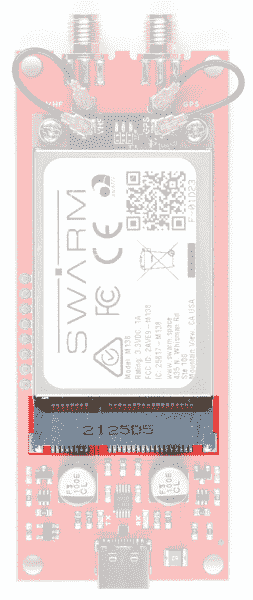](https://cdn.sparkfun.com/r/600-600/assets/learn_tutorials/2/7/5/6/21218-Swarm-mPCIeConnector-Front.jpg) | [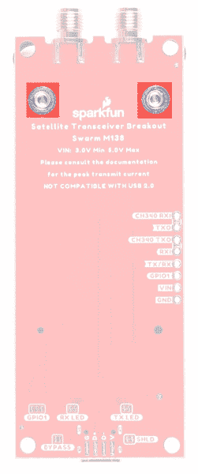](https://cdn.sparkfun.com/r/600-600/assets/learn_tutorials/2/7/5/6/21218-Swarm-mPCIeConnector-Back.jpg) |
| *mPCIe 连接器* | *螺丝固定件* |

M138 调制解调器是一个设计非常精美的套件。mPCIe 卡边连接使其非常易于集成。两颗 M2.5 螺丝将调制解调器固定到位。

### SMA 连接

[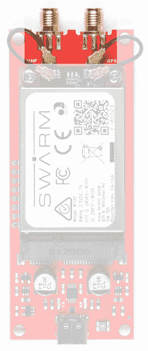](https://cdn.sparkfun.com/assets/learn_tutorials/2/7/5/6/21218-Swarm-SMAConnections.jpg)

您可以将天线直接连接到调制解调器本身的 u.FL 连接器上。但是，为了实现更稳固的连接，您可能需要使用附带的 25 毫米 u.FL 电缆将调制解调器连接到分线器上的两个螺纹 SMA 连接。

“VHF”(甚高频)连接用于 Swarm 卫星天线。不要忘记，群天线需要一个接地层。盒子里有一个。

“GPS”连接用于*强制* GNSS 卫星天线。调制解调器将无法正常工作，除非它知道自己的位置和时间，这是从 GNSS 获得的。您可以使用随附的 Molex 粘合天线，也可以使用自己的有源或无源 GNSS 天线。Molex 天线设计用于粘贴在窗户或其他电透明表面上。如果将它贴在接地层或其他导电表面上，将收不到信号。再次剥离它是困难的，所以请*三思而后行！*

### 电源电路

[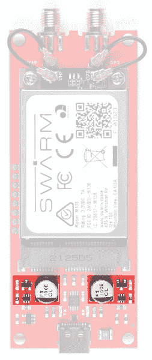](https://cdn.sparkfun.com/assets/learn_tutorials/2/7/5/6/21218-Swarm-PowerCircuitry.jpg)

该分线点包括一个双“理想二极管”电源多路复用器电路，允许调制解调器从 USB 连接器或 VIN 分线点获取电源，压降约为零。两个 100 μF 大电容提供必要的供电轨去耦。

更多细节请参考[原理图](https://cdn.sparkfun.com/assets/1/a/7/c/8/Schematic.pdf)。

### 发光二极管

[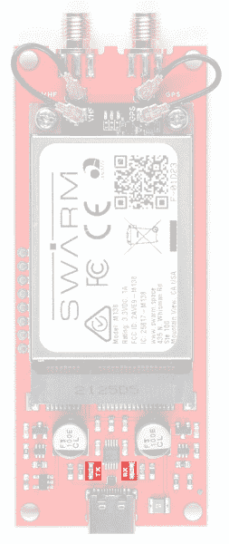](https://cdn.sparkfun.com/assets/learn_tutorials/2/7/5/6/21218-Swarm-LEDs.jpg)

分线点有连接到 CH340 信号的 TX 和 RX LEDs。如果需要，可以通过切断电路板底部的 TX 和 RX 跳线来禁用这些功能。

## 分线销

下表描述了每个卫星收发器 Breakout - Swarm M138 分线引脚的功能:

[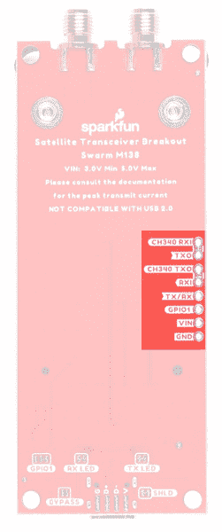](https://cdn.sparkfun.com/assets/learn_tutorials/2/7/5/6/21218-Swarm-BreakoutPins.jpg)

| Pin 名称 | 功能 | 描述 | 笔记 |
| **ch 340 RXI****** | 投入 | CH340 USB 接口:接收数据。 | 逻辑电平为 **3.3V** 。 |
| **TXO****** | 输出 | Swarm 串行(UART)接口:将数据发送出去。 | 逻辑电平为 **3.3V** 。默认情况下，此引脚链接到 CH340 RXI。打开跳线进行隔离。 |
| **ch 340 TXO****** | 输出 | CH340 USB 接口:输出数据。 | 逻辑电平为 **3.3V** 。 |
| **RXI** | 投入 | Swarm 串行(UART)接口:接收数据。 | 逻辑电平为 **3.3V** 。默认情况下，此引脚链接到 CH340 TXO。打开跳线进行隔离。 |
| **TX/RX** | 输出 | Swarm TX / RX 引脚。 | 逻辑电平为 **3.3V** 。发送期间为高电平，接收期间为低电平。 |
| **gpio 1****** | 输入/输出(可配置) | Swarm GPIO1 引脚。 | 逻辑电平为 **3.3V** 。可以通过多种不同方式进行配置。更多详情见下文。 |
| **VIN****** | 力量 | 电源输入。 | 最小 3.0V。最大 5.0V。 |
| **GND****** | 力量 | 电源接地/ 0V。 |  |

电源可以通过 USB 连接器或 VIN 引脚提供，也可以同时通过两者提供。调制解调器将从电压较高的电压获取电能。板载“理想二极管”电源多路复用器电路允许两者同时连接。

The peak current draw during transmit depends on the supply voltage. Please see [Current Draw](https://learn.sparkfun.com/tutorials/satellite-transceiver-breakout---swarm-m138---hookup-guide#current-draw) below for more details.

默认情况下:

*   调制解调器 **TXO** 连接到 **CH340 RXI**
*   调制解调器 **RXI** 连接到 **CH340 TXO**

您需要打开电路板背面的跳线链接，以便直接使用 TXO 和 RXI 引脚。

[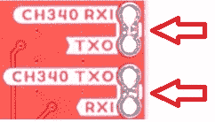](https://cdn.sparkfun.com/assets/learn_tutorials/2/7/5/6/21218-Swarm-BreakoutPinJumpers.jpg)

您可能会发现先阅读本教程很有用:

[](https://learn.sparkfun.com/tutorials/how-to-work-with-jumper-pads-and-pcb-traces) [### 如何使用跳线焊盘和 PCB 走线](https://learn.sparkfun.com/tutorials/how-to-work-with-jumper-pads-and-pcb-traces) Handling PCB jumper pads and traces is an essential skill. Learn how to cut a PCB trace, add a solder jumper between pads to reroute connections, and repair a trace with the green wire method if a trace is damaged.[Favorited Favorite](# "Add to favorites") 11

### GPIO1

GPIO1 是多功能输入/输出引脚。可以通过 **GP** 命令配置成不同的模式:

| 方式 | 描述 |
| **0****** | 模拟，引脚内部断开，不使用(默认) |
| **1****** | 模拟 ADC，可读取引脚以测量输入电压(0-3.3V) |
| **2****** | 输入，引脚可作为通用数字输入读取(高或低) |
| **3****** | 输入，低至高转换退出睡眠模式 |
| **4****** | 输入，高到低转换退出睡眠模式 |
| **5****** | 输出(开漏)，设为低电平作为通用数字输出 |
| **6****** | 输出(开漏)，设为高电平作为通用数字输出 |
| **7****** | 输出(开漏)，低表示用户的未读消息待定 |
| **8****** | 输出(开漏)，高表示用户的未读消息待定 |
| **9****** | 输出(开漏)，低电平表示待发送的未发送消息 |
| **10****** | 输出(开漏)，高电平表示待发送的未发送消息 |
| **11****** | 输出(开漏)，低表示未读或未发送的消息 |
| **12****** | 输出(开漏)，高表示未读或未发送的消息 |
| **13****** | 输出(开漏)，低电平表示休眠模式有效。否则输出为高 |
| **14****** | 输出(开漏)，高电平表示休眠模式有效。否则输出低 |

我们为 GPIO1 提供了上拉和下拉电阻，可通过双分离焊盘跳线进行配置。默认情况下，GPIO1 上拉至 3.3V，以便开漏输出模式产生正确的逻辑电平输出。您可以通过更换跳线来移除上拉电阻:

[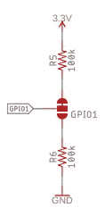](https://cdn.sparkfun.com/assets/learn_tutorials/2/4/5/1/Breakout_GPIO1_Jumper.jpg)

GPIO1 最大吸电流为 8mA。

### TX/RX

TX/RX 是推挽输出，当调制解调器正在传输时为高电平(3.3V)；当调制解调器正在接收或空闲时为低电平(0V)。

## 硬件装配

将 M138 调制解调器组装到分线点非常简单:

*   从支架上取下两个 M2.5 螺钉
    *   我们推荐经典的 SparkFun 可逆[微型螺丝刀](https://www.sparkfun.com/products/9146)、[微型螺丝刀](https://www.sparkfun.com/products/19012)或更高级的[袖珍螺丝刀套装](https://www.sparkfun.com/products/12891)，但是任何#00、#0 或#1 Phillip 螺丝刀都可以。
*   将调制解调器 mPCIe 连接的插槽与叉接连接器的键对齐
*   将调制解调器以一定角度插入连接器
*   调制解调器将以小角度竖起
*   轻轻按住调制解调器，并用两颗 M2.5 螺丝固定

您可以将 Swarm 和 GNSS 天线直接连接到调制解调器:

[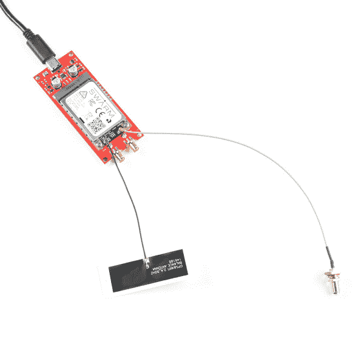](https://cdn.sparkfun.com/assets/learn_tutorials/2/7/5/6/21218-Swarm-antennae.jpg)

或者，您可能更喜欢使用随附的 u.FL 电缆，通过坚固的 SMA 连接器进行连接:

[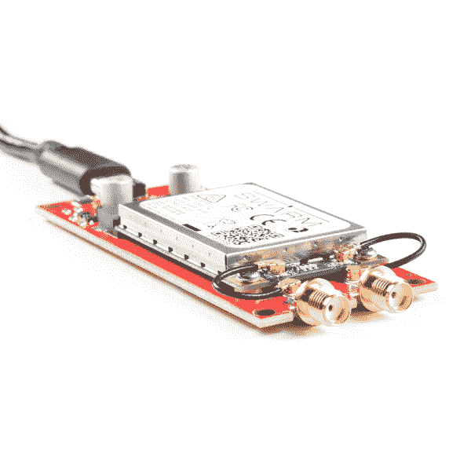](https://cdn.sparkfun.com/assets/learn_tutorials/2/7/5/6/21218-Swarm-action2.jpg)

无论哪种方式，您可能会发现先阅读本教程很有用:

[](https://learn.sparkfun.com/tutorials/three-quick-tips-about-using-ufl) [### 关于使用 U.FL 的三个快速提示](https://learn.sparkfun.com/tutorials/three-quick-tips-about-using-ufl) Quick tips regarding how to connect, protect, and disconnect U.FL connectors.[Favorited Favorite](# "Add to favorites") 14

群天线需要一个接地层才能正常工作。这就是为什么我们在盒子里放了一个！将 SMA 母接头穿过接地层上的孔，并用防震垫圈和螺母固定。把虫群天线拧在上面。

[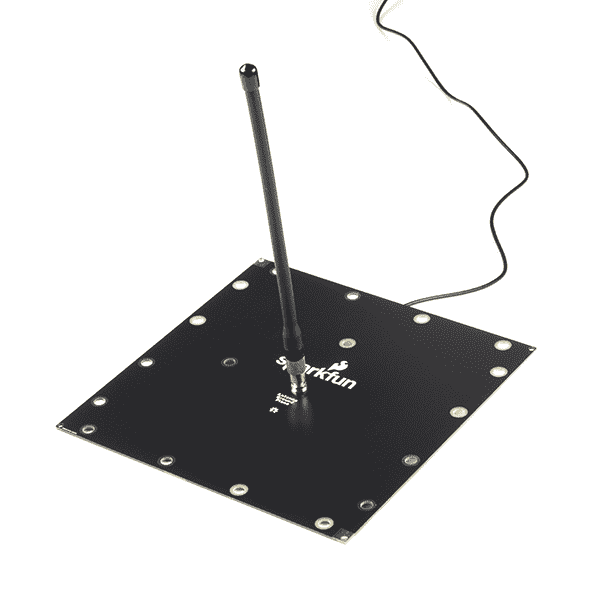](https://cdn.sparkfun.com/assets/learn_tutorials/2/4/5/1/19236-Satellite_Transceiver_Breakout_-_Swarm_M138-08_HRb.jpg)[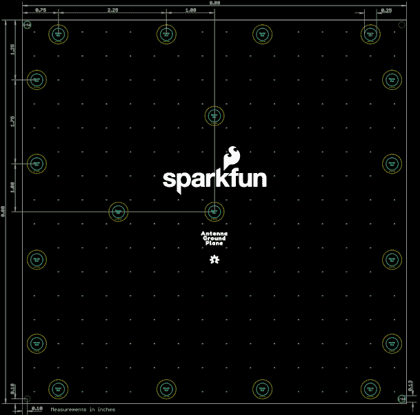](https://cdn.sparkfun.com/assets/learn_tutorials/2/4/5/1/Ground_Plane.png)*Having a hard time seeing? Click the image for a closer look.*

接地层既有接地孔(具有裸露镀锡铜周边和通孔板的孔)，也有普通通孔(隔离)。这允许您将接地层连接到任何周围的金属制品，或者不连接，这取决于您的需要。

为了获得最佳效果，请将 VHF 天线和接地层放置在离地面或任何固体表面至少 1 米的地方。

裸露的表面是标准的无铅热风整平焊料(HASL)镀层。随着时间的推移，它会失去光泽。你可能希望用标准的汽车喷漆漆板，以延长寿命。

如果您使用自己的电缆，请检查 SMA 连接器的极性。群天线是标准极性，而不是“RP”(反极性):

[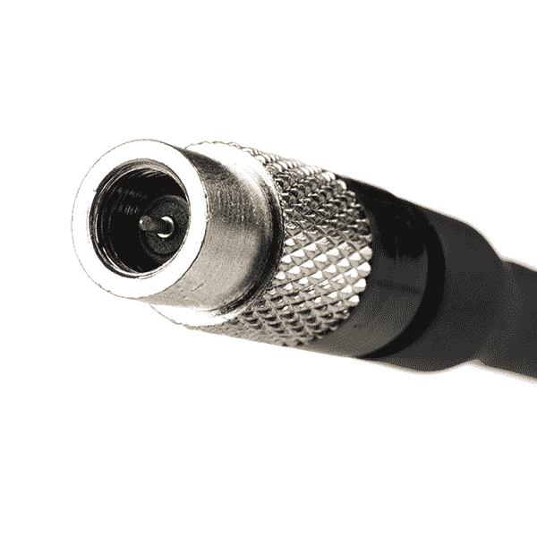](https://cdn.sparkfun.com/assets/learn_tutorials/2/4/5/1/19236-Satellite_Transceiver_Breakout_-_Swarm_M138-02_HR.jpg)Both antennas need to be located outdoors, with a clear view of the sky. But **the modem and breakout board are not weatherproof**. Depending on how you are going to weatherproof the boards, and where they are going to be mounted, you may find additional extension cables or GNSS antennas useful.[](https://www.sparkfun.com/products/14986) 

将**添加到您的[购物车](https://www.sparkfun.com/cart)中！**

### [【GPS/GNSS 磁悬挂天线- 3m (SMA)](https://www.sparkfun.com/products/14986)

[In stock](https://learn.sparkfun.com/static/bubbles/ "in stock") GPS-14986

这款出色的 GPS/GNSS 天线专为 GPS 和 GLONASS 接收而设计。

$13.953[Favorited Favorite](# "Add to favorites") 7[Wish List](# "Add to wish list")****[](https://www.sparkfun.com/products/12861) 

将**添加到您的[购物车](https://www.sparkfun.com/cart)中！**

### [接口电缆- SMA 母到 SMA 公(25cm)](https://www.sparkfun.com/products/12861)

[28 available](https://learn.sparkfun.com/static/bubbles/ "28 available") WRL-12861

这是一种基本的 SMA(超小型 A)公母连接器电缆。每根电缆长 25 厘米(9.8 英寸)，阻抗为 50ω…

$5.501[Favorited Favorite](# "Add to favorites") 8[Wish List](# "Add to wish list")****[](https://www.sparkfun.com/products/17495) 

将**添加到您的[购物车](https://www.sparkfun.com/cart)中！**

### [SMA 公对 SMA 母- 10m (RG174)](https://www.sparkfun.com/products/17495)

[In stock](https://learn.sparkfun.com/static/bubbles/ "in stock") CAB-17495

这款 10 米(33') SMA 延长线可以很好地将您的接收机或收音机连接到远处的天线上，而且射频损耗极低…

$7.50[Favorited Favorite](# "Add to favorites") 4[Wish List](# "Add to wish list")****[](https://www.sparkfun.com/products/19576) 

将**添加到您的[购物车](https://www.sparkfun.com/cart)中！**

### [磁力挂载 SMA - 2m](https://www.sparkfun.com/products/19576)

[In stock](https://learn.sparkfun.com/static/bubbles/ "in stock") GPS-19576

在试验 GPS 或 RF 时，将天线放在你的房子或汽车顶部，视野清晰，会非常方便…

$24.95[Favorited Favorite](# "Add to favorites") 0[Wish List](# "Add to wish list")******** ********## 硬件连接- USB

组装好分线点并连接好天线后，通过 USB 连接就像插上 USB 电缆一样简单！

You can power the board directly from USB-C or USB 3 ports, but not older USB 2.0 ports. Please see [Current Draw](https://learn.sparkfun.com/tutorials/satellite-transceiver-breakout---swarm-m138---hookup-guide#current-draw) below for more details.

连接 USB 后，调制解调器上的 led 将指示其状态:

*   绿色:
    *   在启动过程中，绿色 LED 将稳定亮起 3 秒钟。
    *   在启动后和关机前的正常操作期间，绿色 LED 将在调制解调器通电时每隔 5 秒闪烁 100 毫秒。这是一个“心跳”指示，表明调制解调器正在按预期工作。
*   红色:
    *   通电后，直到调制解调器开始启动，红色指示灯将稳定亮起 10 秒钟。
    *   启动后，当调制解调器正在获取 GPS 定位时，红色 LED 将快速闪烁，直到找到有效的 GPS 定位。那么红色 LED 将在正常操作期间关闭。
    *   从睡眠中醒来后，在获得新的 GPS 定位之前，每 5 秒钟将有一个红色 LED 闪烁(跟随绿色 LED 闪烁),直到找到新的 GPS 定位。那么在正常操作期间，红色 LED 将再次关闭。
    *   在关机过程中，红色 LED 将一直亮着，直到主板上的 3.3V 电源断开。
*   蓝色:
    *   当调制解调器正在从 Swarm 卫星接收信号时，蓝色 LED 将一直亮着。

## Python 用户界面

我们已经编写了 Python3 PyQt5 GUI(图形用户界面),让您可以使用 M138 调制解调器。你可以在 GitHub 上的[产品报告中找到源代码以及 Windows 和 Raspberry Pi 可执行文件。](https://github.com/sparkfunX/Satellite_Transceiver_Breakout__Swarm_M138)

[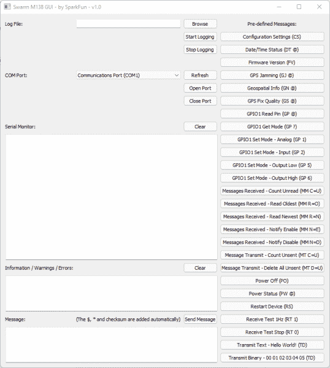](https://cdn.sparkfun.com/assets/learn_tutorials/2/4/5/1/Python3_PyQt5_GUI.png)

如果您熟悉 Python3，您可能会发现直接运行 Python 代码是最简单的。对于 Windows 和 Raspberry Pi 用户，我们已经创建了可执行文件，您可以下载:

*   在 Windows 上:
    *   单击下面的按钮下载可执行文件
    *   从文件浏览器或命令提示符窗口运行 Swarm_M138_GUI.exe

[SparkFun Swarm GUI (Windows)](https://github.com/sparkfunX/Satellite_Transceiver_Breakout__Swarm_M138/raw/main/Tools/Swarm_M138_GUI/Windows%20exe/Swarm_M138_GUI.exe)

*   关于树莓派:
    *   单击下面的按钮下载可执行文件
    *   打开终端窗口
    *   cd 下载
    *   sudo chmod 755 Swarm_M138_GUI
    *   。/Swarm_M138_GUI

[SparkFun Swarm GUI (Raspberry Pi)](https://github.com/sparkfunX/Satellite_Transceiver_Breakout__Swarm_M138/raw/main/Tools/Swarm_M138_GUI/Raspberry%20Pi%20exe/Swarm_M138_GUI)

不要慌！GUI 需要几秒钟才能打开。从下拉列表中选择正确的端口，单击“打开端口”即可！

单击任何预定义的消息按钮，将该消息发送到调制解调器。或者在消息窗口中输入您自己的消息，然后点按“发送消息”来发送它。

调制解调器消息接口使用与 NMEA GNSS 消息相同的格式。它们总是以美元开始，以星号和两个字符的校验和结束。为了方便起见，GUI 自动添加了$、*和校验和字符。你不需要包括这些！

[调制解调器手册](https://cdn.sparkfun.com/assets/9/1/0/e/3/SwarmM138-Modem-Product-Manual.pdf)包含调制解调器命令和信息的完整列表。

您可以通过按下“配置设置(CS)”按钮来测试通信接口。调制解调器的设备 ID 和名称将以下列格式显示在串行监视器上:

```
$CS DI=<dev_ID> ,DN=<dev_name>*xx 
```

下一步是将设备放置在室外视野开阔的地方，远离任何射频噪声源。一旦设备设置在室外，使用 Python3 GUI 中的“接收测试 1Hz (RT 1)”预定义消息来测量背景 RSSI。背景 RSSI 测量值将每秒更新一次，代表测试环境中的本底噪声。为了网络上的可靠通信，测量的背景 RSSI 值应该在-95 和-105 dBm 之间。更低、更负的值是优选的。

如果报告的背景 RSSI 值为> -93 dBm，调制解调器将无法与卫星可靠通信。尝试将设备移动到不同的测试位置，观察测量值如何变化。

确认背景 RSSI 在指定范围内后，下一步是在调制解调器上将一些信息包排队等待传输。对要传输的消息进行排队的最快方法是使用列表底部显示的 GUI 中的预定义消息。消息包将在 48 小时的默认保留时间内排队等待传输，超过此时间后，如果没有传输，它们将被丢弃。

*用户可为每个传输命令配置信息包保持时间。请参考 Swarm M138 调制解调器的[产品手册](https://swarm.space/swarm-m138-modem-product-manual/)了解更多信息，以及可用命令的完整描述。*

当卫星经过设备位置并向调制解调器发送信号时，排队的传输包将被传输。使用 [Swarm 卫星通过检测器](https://kube.tools.swarm.space/pass-checker/)可以预测下一次卫星通过你的位置。YouTube 上还有一个视频，更详细地描述了 pass checker 的功能，请点击[这里](https://www.youtube.com/watch?v=j8PceIrZ9Js)。

要知道卫星是否试图与调制解调器通信，请确保“接收测试 1Hz (RT 1)”命令已启用。观察卫星信标的串行监视器，格式如下:

```
$RT RSSI=<rssi_sat>,SNR=<snr>,FDEV=<fdev>,TS=<time>,DI=<sat_id>*xx 
```

调制解调器将在接收到卫星信标后尝试发送排队的消息包。每次成功的传输都会得到卫星的确认，并以下列格式显示在串行监视器上:

```
$TD SENT RSSI=<rssi_sat>,SNR=<snr>,FDEV=<fdev>,<msg_id>*xx 
```

传输后不久，传输的数据包将在[蜂群](https://bumblebee.hive.swarm.space/login)上可见。

## 硬件连接-分线销

想要将分线点连接到 Arduino 微控制器板吗？你也绝对可以这样做！

默认情况下:

*   调制解调器 **TXO** 分线引脚通过分离焊盘跳线连接到 **CH340 RXI**
*   同样，调制解调器 **RXI** 连接到 **CH340 TXO**

将 TXO 和 RXI 引脚连接到 Arduino 电路板时，您需要打开电路板背面的跳线链接。

[](https://cdn.sparkfun.com/assets/learn_tutorials/2/7/5/6/21218-Swarm-BreakoutPinJumpers.jpg)

你可能需要:断开接头和跳线。2 针跳线将有助于以后重新链接 CH340 连接。

[](https://www.sparkfun.com/products/116) 

将**添加到您的[购物车](https://www.sparkfun.com/cart)中！**

### [破开头球——直击](https://www.sparkfun.com/products/116)

[In stock](https://learn.sparkfun.com/static/bubbles/ "in stock") PRT-00116

一排标题-打破适应。40 个引脚，可切割成任何尺寸。用于定制 PCB 或通用定制接头。

$1.7520[Favorited Favorite](# "Add to favorites") 133[Wish List](# "Add to wish list")****[](https://www.sparkfun.com/products/9140) 

将**添加到您的[购物车](https://www.sparkfun.com/cart)中！**

### [跳线高级 6" M/F 装 10 根](https://www.sparkfun.com/products/9140)

[In stock](https://learn.sparkfun.com/static/bubbles/ "in stock") PRT-09140

这是一个 SparkFun 独家！这些都是 155 毫米长，26 美国线规跳线终止作为男性到女性。用这些来跳离…

$4.501[Favorited Favorite](# "Add to favorites") 16[Wish List](# "Add to wish list")****[](https://www.sparkfun.com/products/553) 

将**添加到您的[购物车](https://www.sparkfun.com/cart)中！**

### [挣脱男头球-直角](https://www.sparkfun.com/products/553)

[In stock](https://learn.sparkfun.com/static/bubbles/ "in stock") PRT-00553

一排直角公接头-断开以适合。40 个引脚，可切割成任何尺寸。用于定制 PCB 或一般定制…

$2.255[Favorited Favorite](# "Add to favorites") 47[Wish List](# "Add to wish list")****[](https://www.sparkfun.com/products/9389) 

将**添加到您的[购物车](https://www.sparkfun.com/cart)中！**

### [跳线高级 12" F/F 包 10 个](https://www.sparkfun.com/products/9389)

[In stock](https://learn.sparkfun.com/static/bubbles/ "in stock") PRT-09389

这是一个 SparkFun 独家！这些是 12 英寸长、26 AWG 跳线，端接为母对母。用这些来跳离…

$4.95[Favorited Favorite](# "Add to favorites") 3[Wish List](# "Add to wish list")****[](https://www.sparkfun.com/products/9044) 

将**添加到您的[购物车](https://www.sparkfun.com/cart)中！**

### [跳线- 2 引脚](https://www.sparkfun.com/products/9044)

[In stock](https://learn.sparkfun.com/static/bubbles/ "in stock") PRT-09044

这是两个引脚跳线(也称为分流器)，用于在两个引脚接头之间建立电气连接。通常我们…

$0.45[Favorited Favorite](# "Add to favorites") 7[Wish List](# "Add to wish list")****[](https://www.sparkfun.com/products/11895) 

将**添加到您的[购物车](https://www.sparkfun.com/cart)中！**

### [【接头- 8 针母(PTH，0.1”)](https://www.sparkfun.com/products/11895)

[22 available](https://learn.sparkfun.com/static/bubbles/ "22 available") PRT-11895

这些是标准的 0.1 英寸间距的接头引脚，可以通过通孔安装。这种接头可以与大多数 8 针 m…

$0.75[Favorited Favorite](# "Add to favorites") 6[Wish List](# "Add to wish list")************ ************连接:

*   Arduino 板上的 GND 至 GND / 0V
*   Arduino 板上的 VIN 至 5V
    *   如果调制解调器传输时，您的 Arduino 板能够提供足够的电流，则可以将 VIN 连接到 3.3V
    ***   请参见下面的[电流消耗](https://learn.sparkfun.com/tutorials/satellite-transceiver-breakout---swarm-m138---hookup-guide#current-draw)了解更多详情。**
***   TXO 到 Arduino 板上的串行/ UART RX 输入*   RXI 到 Arduino 板上的串行/ UART TX 输出**

 **TXO 和 RXI 信号为 3.3V

If you are using an old Arduino Uno or similar with 5V I/O pins, you will need to use a [logic level converter](https://www.sparkfun.com/products/12009) to convert the signals to 3.3V.

## 软件设置

我们的 [Swarm Arduino 库](https://github.com/sparkfun/SparkFun_Swarm_Satellite_Arduino_Library)让使用 Swarm 变得简单。

如果您不熟悉 Arduino 和 IDE，本指南将帮助您入门和运行:

[](https://learn.sparkfun.com/tutorials/installing-arduino-ide) [### 安装 Arduino IDE](https://learn.sparkfun.com/tutorials/installing-arduino-ide) A step-by-step guide to installing and testing the Arduino software on Windows, Mac, and Linux.[Favorited Favorite](# "Add to favorites") 16

如果您之前没有安装 Arduino 库，以下是您需要的指南:

[](https://learn.sparkfun.com/tutorials/installing-an-arduino-library) [### 安装 Arduino 库](https://learn.sparkfun.com/tutorials/installing-an-arduino-library) How do I install a custom Arduino library? It's easy! This tutorial will go over how to install an Arduino library using the Arduino Library Manager. For libraries not linked with the Arduino IDE, we will also go over manually installing an Arduino library.[Favorited Favorite](# "Add to favorites") 22

*   [安装 Arduino IDE](https://learn.sparkfun.com/tutorials/installing-arduino-ide)
*   点击 ***工具\管理库...*** 打开图书馆管理器
*   在搜索框中，键入 ***SparkFun Swarm***
*   点击*安装*按钮安装库

或者，你可以直接从 [GitHub](https://github.com/sparkfun/SparkFun_Swarm_Satellite_Arduino_Library) 下载这个库，或者点击下面的按钮下载成 zip 文件:

[SparkFun Swarm Satellite Arduino Library (ZIP)](https://github.com/sparkfun/SparkFun_Swarm_Satellite_Arduino_Library/archive/refs/heads/main.zip)

## Arduino 示例:获取固件版本

SparkFun Swarm Satellite Arduino 库包含了一整套[经过测试的例子](https://github.com/sparkfun/SparkFun_Swarm_Satellite_Arduino_Library/tree/main/examples)，它们可以在几乎所有 Arduino 板上运行(RAM 允许的话)。

下面的代码是[example 3 _ getfirmware version](https://github.com/sparkfun/SparkFun_Swarm_Satellite_Arduino_Library/blob/main/examples/Example3_getFirmwareVersion/Example3_getFirmwareVersion.ino)的精简版。将代码复制并粘贴到 Arduino IDE 的一个新窗口中:

```
language:c
#include <SparkFun_Swarm_Satellite_Arduino_Library.h> // http://librarymanager/All#SparkFun_Swarm_Satellite

SWARM_M138 mySwarm;

#define swarmSerial Serial1 // Use Serial1 to communicate with the modem. Change this if required.

void setup()
{
  Serial.begin(115200);

  if (mySwarm.begin(swarmSerial) == false) // Begin communication with the modem
  {
    Serial.println(F("Could not communicate with the modem. Please check the serial connections. Freezing..."));
    while (1)
      ;
  }

  char *firmwareVersion = new char[SWARM_M138_MEM_ALLOC_FV]; // Create storage for the configuration settings

  mySwarm.getFirmwareVersion(firmwareVersion); // Get the firmware version

  Serial.print(F("The firmware version is: "));
  Serial.println(firmwareVersion);

  delete[] firmwareVersion; // Free the storage
}

void loop()
{
  //Nothing to do here
} 
```

保存文件，点击上传按钮，将示例上传到您的板上。

打开 ***工具\串口监视器*** 查看调制解调器固件版本。

检查波特率是否设置为 **115200** 。

## 消息传输、接收和传递-预测

通过 Swarm 传输的信息与铱星网络略有不同。

Swarm 卫星群正在迅速增加，但还不完整。可能会有这样的时候，头顶上没有卫星接收你的信息。如果您在这些时间中的某个时间将消息排队等待传输，该消息将存储在调制解调器中，并在下一次卫星传送时传输。如果您在 GUI 中或通过 Arduino 库示例来监视响应，您将会在每个消息传输时看到一个 **$TD SENT** 通知。您可以通过 **$MT C=U** 消息监视队列中还有多少未发送的消息。

有两种方法可以预测下一次卫星通过:

*   通过在线 [Swarm Pass 检查器](https://kube.tools.swarm.space/pass-checker/)
*   或者通过使用我们的 [Arduino 库](https://github.com/sparkfun/SparkFun_Swarm_Satellite_Arduino_Library/tree/main/examples/Pass_Prediction)中的传球预测示例
    *   pass 预测代码从 [CelesTrak](https://celestrak.org/) 下载 Swarm 双线元素轨道参数
    *   用群体通行证检查器交叉检查这些
    *   为您的位置生成一个已知的“好”卫星列表
    *   TLE 轨道参数存储在 microSD 卡上，供离线使用(下载后，您无需互联网连接即可进行预测)
    *   如果你愿意，你可以通过群消息发送更新的 TLEs 到你的远程群激活设备*，这样它就可以改进它的传球预测！*
    *   传球预测示例是为[spark fun Thing Plus C-ESP32 WROOM](https://www.sparkfun.com/products/18018)编写的:它们使用 ESP32 的 WiFi 连接和板载 microSD 插座来存储 TLE 数据
    *   您可以修改示例以在其他支持 WiFi 和 microSD 的板上工作，例如: [SparkFun MicroMod ESP32 处理器](https://www.sparkfun.com/products/16781)；和 [SparkFun MicroMod 数据记录载板](https://www.sparkfun.com/products/16829)

通过 Swarm 接收的消息明显不同于(例如)铱星卫星网络。

“移动终止”信息在地面站排队，并被传送到一颗卫星，该卫星已知正通过你的调制解调器的位置。因此，这可能需要几十分钟，在某些情况下甚至几个小时，这取决于你的位置和卫星轨道的时间。消息接收间隔将随着群星座的增加而减少。

如果您希望收到一条消息，请确保通过 **$MM N=E** 消息启用了“收到消息”通知。这样，当消息到达时，您将会收到通知。或者，您可以使用 **$MM C=U** 消息来轮询调制解调器缓冲区中有多少未读消息。

## 电流消耗

在消息传输期间，调制解调器消耗的峰值电流取决于电源电压:

| 电源电压 | 睡眠电流 | 接收电流 | 传输电流 |
| **3.3V****** | (峰值) | 26mA(典型值。)，40mA(峰值) | 850 毫安(典型值)，**1000 毫安(峰值)** |
| **5.0V****** | (峰值) | 25mA(典型值。)，45mA(峰值) | 550 毫安(典型值)，**600 毫安(峰值)** |

我们强烈建议从 5.0V 为分线点供电，以降低峰值电流消耗。

The TXO, RXI, TX/RX and GPIO1 signals remain 3.3V even when VIN is 5.0V. It is not possible to use 5.0V I/O under any circumstances. Doing so may damage your modem.You can power the board directly from USB-C or USB 3 ports, but not older USB 2.0 ports. USB 2.0 (non-SuperSpeed) ports are limited to 500mA. You can still use our Breakout with USB 2.0, but you will need to connect additional power via the VIN and GND breakout pins.

在 Raspberry Pi 板上，USB 插座由(USB)电源输入连接器直接供电。你可以使用 USB 将 Swarm Breakout 连接到 Raspberry Pi，前提是你的电源可以为 RPi 和 Swarm M138 提供足够的电流(在发射期间)。官方的树莓 Pi 5.1V 2.5A (12.5W)电源适配器是个不错的选择。

## 解决纷争

**Not working as expected and need help?**

If you need technical assistance and more information on a product that is not working as you expected, we recommend heading on over to the [SparkFun Technical Assistance](https://www.sparkfun.com/technical_assistance) page for some initial troubleshooting.

[SparkFun Technical Assistance Page](https://www.sparkfun.com/technical_assistance)

If you don't find what you need there, the [SparkFun Forums](https://forum.sparkfun.com/index.php) are a great place to find and ask for help. If this is your first visit, you'll need to [create a Forum Account](https://forum.sparkfun.com/ucp.php?mode=register) to search product forums and post questions.

[Create New Forum Account](https://forum.sparkfun.com/ucp.php?mode=register)   [Log Into SparkFun Forums](https://forum.sparkfun.com/index.php)

## 资源和更进一步

有关卫星收发器 Breakout - Swarm M138 的更多信息，请查看以下链接:

*   [如何注册您的 Swarm M138 调制解调器](https://swarm.space/registering-your-swarm-m138-modem/)
*   [群账户登录](https://bumblebee.hive.swarm.space/login)
*   [群体通行证检查器](https://kube.tools.swarm.space/pass-checker/)
*   [蜂群常见问题](https://swarm.space/frequently-asked-questions/)
*   [Swarm 简讯注册](https://swarm.space/contact/)
*   [示意图](https://cdn.sparkfun.com/assets/1/a/7/c/8/Schematic.pdf)
*   [尺寸](https://cdn.sparkfun.com/assets/c/3/6/7/3/Dimensions.png)
*   [地平面尺寸](https://cdn.sparkfun.com/assets/1/0/b/d/4/Ground_Plane.png)
*   [老鹰档案](https://cdn.sparkfun.com/assets/a/e/5/8/e/Satellite_Transceiver_Breakout__Swarm_M138.zip)
*   [GitHub 回购](https://github.com/sparkfun/SparkFun_Satellite_Transceiver-Swarm_M138)
*   [Arduino 库](https://github.com/sparkfun/SparkFun_Swarm_Satellite_Arduino_Library)
*   [蜂群网站](https://swarm.space/)
*   [调制解调器手册](https://cdn.sparkfun.com/assets/9/1/0/e/3/SwarmM138-Modem-Product-Manual.pdf)****************************************************