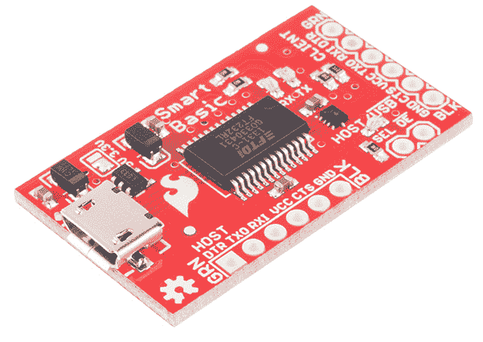
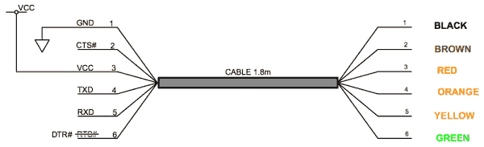
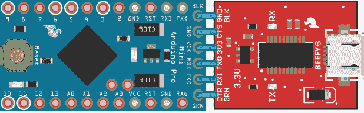
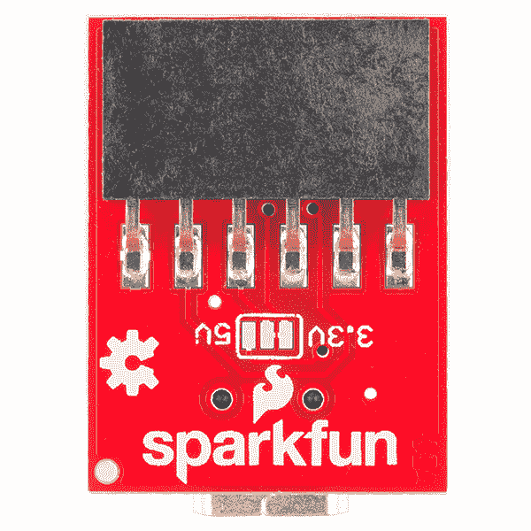
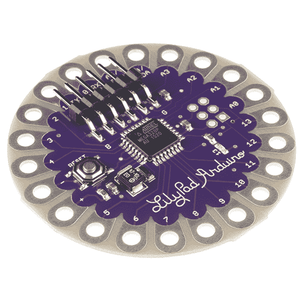

# SparkFun USB 转串行 UART 板连接指南

> 原文：<https://learn.sparkfun.com/tutorials/sparkfun-usb-to-serial-uart-boards-hookup-guide>

## 介绍

SparkFun 拥有一系列 USB 至串行 UART 桥接产品，旨在允许用户通过通用 USB 端口与串行 UART 通信。现在很难找到带有串行 UART 端口的计算机，但找到串行设备却非常常见。许多官方 Arduino 和克隆版共享一个公共界面。该接口本质上是 FTDI 的 [TTL-232R 电缆](https://www.sparkfun.com/products/9717)的 6 针单列(SIL)、0.1 英寸间距版本。

从 FTDI 电缆到我们的 Arduino 兼容板的关键变化是，我们将引脚 6 从 RTS 换成了 DTR 。这一改变是为了配合 Arduino 使用 DTR 信号重置 ATmega328P 的方法。

*Arduino compatible pinout is slightly different from the FTDI cable (pin 6)***Note** The signal difference on pin 6 may cause these devices to not be 100% compatible with devices designed for use with the FTDI TTL-232R cables.

### 优势

拥有一个可拆卸的 USB 到 UART 桥比像 [Arduino Uno](https://www.sparkfun.com/products/11224) 这样的板有几个优点。

*   移除计算机接口会使电路板变小。
*   你只需要买一次电路，就可以编程很多 Arduinos。
*   电桥电路消耗的功率(高达 500 mW)在许多已安装的应用中并不需要。消除这种寄生消耗会使您的项目更加节能&您的电池寿命更长。

### 推荐阅读

在我们开始之前，您可能想回顾一下另一个教程:

*   [安装 FTDI 驱动程序](https://learn.sparkfun.com/tutorials/how-to-install-ftdi-drivers)

## 硬件之旅

这种电路板的接口很简单。一侧有一个兼容 TTL-232R 电缆的 6 针 SIL、0.1 英寸间距母接头。这一侧连接到 Arduino (TTL 串行 UART)板。我们经常使用 [Arduino Pro Mini](https://www.sparkfun.com/products/11114) 上的[直角接头](https://www.sparkfun.com/products/553)来简化串行桥的连接。我们的主板上有丝网标签，标明 FTDI TTL-232R 电缆的黑线和绿线位置。

*Fritzing diagram showing the connection between a USB to UART bridge and a Pro Mini**6 pin SIL, 0.1” pitch header at top of PCBA*

另一侧有 USB mini-B 或 USB micro-B 插孔。标准 USB 电缆用于将该插孔连接到主机。

这一系列产品有几种形式。下表比较了最常见的选项。

| 名字 | 电压 | 电流极限 | 连接器 |
| --- | --- | --- | --- |
| [SparkFun FTDI 基本分线点- 5V](https://www.sparkfun.com/products/9716) | 5.0 伏 | 不适用^(T1 1) | USB 迷你 B |
| [SparkFun FTDI 基本分线点- 3.3V](https://www.sparkfun.com/products/9873) | 3.3 伏 | < 50 毫安 | USB 迷你 B |
| [健壮的 3](https://www.sparkfun.com/products/13746) | 3.3 伏 | < 600 mA ^([2](#fn2)) | USB 微型 B |
| [LilyPad FTDI 基本分线点- 5V](https://www.sparkfun.com/products/10275) | 5.0 伏 | 不适用^(T1 1) | USB 迷你 B |

*Table 1\. Comparison of Common SparkFun Offerings***Warning:** These boards are for prototyping ONLY. Unlike commercial devices, power negotiation and suspend mode do not occur, and it is possible to overload the USB host. Exercise caution when connecting a load, and *never connect a load that draws too much current.*

^(1。【5V 直接取自 V [总线]，并且*仅受 USB 主机控制器*限制。】 [↩](#ref1 "Jump back to footnote 1 in the text."))
^(2。【该 3.3V 稳压器直接由 V [总线]供电，并且*仅受 USB 主机控制器*的限制。】 [↩](#ref1 "Jump back to footnote 1 in the text."))

要快速比较几种 USB 和串行板，请查看这篇 Enginursday 博客文章:

 [### Enginursday:探索不同的 USB 串行板

September 14, 2017](https://www.sparkfun.com/news/2451 "September 14, 2017: SparkFun offers several options in the USB-Serial arena. Today we'll attempt to demystify the differences between them.")[Favorited Favorite](# "Add to favorites") 4

## 将 USB 连接到串行 UART 板

这些桥有两个连接点。一端有一个 USB 设备连接。请参见[表 1](# "Jump to offering comparison table.") 了解特定产品确切连接器的更多详情。该接口全速兼容 USB 1.1 / USB 2.0。一根标准的 USB A 转某种 B 的电缆被用来把桥接器连接到计算机上。

另一个连接是 0.1 英寸间距的母接头，用于连接微控制器。我们的许多产品都带有一排兼容的电镀通孔。这些设计有 0.1 英寸的公头焊接。有些情况下最好使用直头，其他情况下使用直角头。期望的连接因设计而异，如这里讨论的。一些产品预装了这些接头。

*Prepopulated FTDI header example*

## 资源和更进一步

现在，您已经成功地启动并运行了 USB 转串行 UART，是时候将它集成到您自己的项目中了！

有关更多信息，请查看以下资源:

 [### 串行通信](https://learn.sparkfun.com/tutorials/serial-communication) Asynchronous serial communication concepts: packets, signal levels, baud rates, UARTs and more 100 [### 如何安装 FTDI 驱动程序](https://learn.sparkfun.com/tutorials/how-to-install-ftdi-drivers) How to install drivers for the FTDI Basic on Windows, Mac OS X, and Linux.[Favorited Favorite](# "Add to favorites") 12 [### 使用 Arduino Pro Mini 3.3V](https://learn.sparkfun.com/tutorials/using-the-arduino-pro-mini-33v) This tutorial is your guide to all things Arduino Pro Mini. It explains what it is, what it's not, and how to get started using it.[Favorited Favorite](# "Add to favorites") 16 [### 串行终端基础知识](https://learn.sparkfun.com/tutorials/terminal-basics) This tutorial will show you how to communicate with your serial devices using a variety of terminal emulator applications.[Favorited Favorite](# "Add to favorites") 46

或者查看我们关于 FTDI 和不同 USB 转串行分线板的新闻帖子:

 [### FTDI 驱动器和假冒芯片

October 23, 2014](https://www.sparkfun.com/news/1629 "October 23, 2014: FTDI's latest driver update appears to be semi-permanently disabling counterfeit FT232 chips.")[Favorited Favorite](# "Add to favorites") 0 [### Enginursday:探索不同的 USB 串行板

September 14, 2017](https://www.sparkfun.com/news/2451 "September 14, 2017: SparkFun offers several options in the USB-Serial arena. Today we'll attempt to demystify the differences between them.")[Favorited Favorite](# "Add to favorites") 4