# SparkFun WiFi IR Blaster 连接指南

> 原文：<https://learn.sparkfun.com/tutorials/sparkfun-wifi-ir-blaster-hookup-guide>

## 介绍

**Note:** Please note that this tutorial is for [WRL-15031](https://www.sparkfun.com/products/15031). If you are using SPX-15000, please refer to [this tutorial](https://learn.sparkfun.com/tutorials/wifi-ir-blaster-hookup-guide).

随着连接 WiFi 的“智能”设备的出现，红外遥控器正迅速成为过去。当你手中可能有一个更智能、连接 WiFi 的设备时，为什么要在满是遥控器的茶几上分类呢？

WiFi 红外增强器旨在将所有旧的、传统的红外控制设备连接到 WiFi 网络，让它们体验一种新的控制方法。想通过网络浏览器控制电视吗？想让 Alexa 把你的音响静音？想要为您的红外控制 led 灯条设置触发器吗？这些都是 WiFi IR Blaster 非常适合的应用程序。

[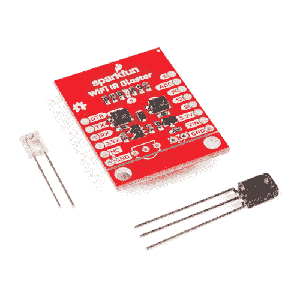](https://www.sparkfun.com/products/15031) 

将**添加到您的[购物车](https://www.sparkfun.com/cart)中！**

### [【spark fun WiFi IR Blaster(ESP8266)](https://www.sparkfun.com/products/15031)

[34 available](https://learn.sparkfun.com/static/bubbles/ "34 available") WRL-15031

SparkFun WiFi 红外线增强器旨在将所有旧的、传统的红外线控制设备连接到 WiFi 网络，从而暴露…

$22.503[Favorited Favorite](# "Add to favorites") 25[Wish List](# "Add to wish list")** **[https://www.youtube.com/embed/mxKUskGUQk0/?autohide=1&border=0&wmode=opaque&enablejsapi=1](https://www.youtube.com/embed/mxKUskGUQk0/?autohide=1&border=0&wmode=opaque&enablejsapi=1)

WiFi IR Blaster 将功能强大的 WiFi/微控制器 SoC ESP8266 与 IR 发射器和接收器相结合。通过内置 WiFi 支持，ESP8266 可以编程为 HTTP、MQTT、TCP 等之间提供接口。和红外控制设备。

本教程将解释如何组装 WiFi IR Blaster，并详细说明如何使用 Arduino IDE 对 ESP8266 进行编程。一旦完成，你将拥有一个简单的网络服务器，点击浏览器页面就能发射红外信号。

### 所需材料

WiFi 红外线增强器包括主板、红外线发射器和红外线接收器。你需要一些其他的工具和组件来给它供电和编程:

[](https://www.sparkfun.com/products/116) 

将**添加到您的[购物车](https://www.sparkfun.com/cart)中！**

### [破开头球——直击](https://www.sparkfun.com/products/116)

[In stock](https://learn.sparkfun.com/static/bubbles/ "in stock") PRT-00116

一排标题-打破适应。40 个引脚，可切割成任何尺寸。用于定制 PCB 或通用定制接头。

$1.7520[Favorited Favorite](# "Add to favorites") 133[Wish List](# "Add to wish list")****[](https://www.sparkfun.com/products/14865) 

将**添加到您的[购物车](https://www.sparkfun.com/cart)中！**

### [红外线遥控](https://www.sparkfun.com/products/14865)

[In stock](https://learn.sparkfun.com/static/bubbles/ "in stock") COM-14865

我们的红外遥控器提供四个方向的按钮，电源，选择，和三个可选的使用按钮(标有“A”，“B…

$4.501[Favorited Favorite](# "Add to favorites") 9[Wish List](# "Add to wish list")****[](https://www.sparkfun.com/products/13746) 

将**添加到您的[购物车](https://www.sparkfun.com/cart)中！**

### [SparkFun Beefy 3 - FTDI 基础突围](https://www.sparkfun.com/products/13746)

[In stock](https://learn.sparkfun.com/static/bubbles/ "in stock") DEV-13746

这是为 FTDI FT231X USB 到串行 ic 的 3 FTDI 基本突破。此板的引脚匹配 FTDI …

$17.5012[Favorited Favorite](# "Add to favorites") 22[Wish List](# "Add to wish list")****[](https://www.sparkfun.com/products/553) 

将**添加到您的[购物车](https://www.sparkfun.com/cart)中！**

### [挣脱男头球-直角](https://www.sparkfun.com/products/553)

[In stock](https://learn.sparkfun.com/static/bubbles/ "in stock") PRT-00553

一排直角公接头-断开以适合。40 个引脚，可切割成任何尺寸。用于定制 PCB 或一般定制…

$2.255[Favorited Favorite](# "Add to favorites") 47[Wish List](# "Add to wish list")******** ********[SparkFun Beefy 3 - FTDI 基本分线点](https://www.sparkfun.com/products/13746)主要用于对 ESP8266 进行编程，但它也能够提供 Blaster 所需的 3.3V/300mA 电源。虽然您可以使用任何 3.3V USB 转串行转换器，但这是我们推荐的一种。

接头——直角接头或直线接头是您的主板、编程器、试验板、性能板等之间的推荐接口。

如果你手边没有红外遥控器， [SparkFun 红外遥控器](https://www.sparkfun.com/products/14865)是一个有用的测试工具。它甚至可能会意外地与您的电视一起工作！

除了这些组件，你还需要一个烙铁、焊料和[通用焊接配件](https://www.sparkfun.com/categories/49)。

此外，您还需要一个可以连接 ESP8266 的本地 WiFi 网络。拥有第二台设备——智能手机或电脑——也连接到该网络也很有帮助。

### 推荐阅读

如果您不熟悉以下概念，我们建议您在继续之前查看这些教程。

[](https://learn.sparkfun.com/tutorials/how-to-solder-through-hole-soldering) [### 如何焊接:通孔焊接](https://learn.sparkfun.com/tutorials/how-to-solder-through-hole-soldering) This tutorial covers everything you need to know about through-hole soldering.[Favorited Favorite](# "Add to favorites") 70[](https://learn.sparkfun.com/tutorials/ir-communication) [### 红外通信](https://learn.sparkfun.com/tutorials/ir-communication) This tutorial explains how common infrared (IR) communication works, as well as shows you how to set up a simple IR transmitter and receiver with an Arduino.[Favorited Favorite](# "Add to favorites") 42[](https://learn.sparkfun.com/tutorials/ir-control-kit-hookup-guide) [### 红外控制套件连接指南](https://learn.sparkfun.com/tutorials/ir-control-kit-hookup-guide) How to get the most out of the infrared receivers and transmitters included in the IR Control Kit.[Favorited Favorite](# "Add to favorites") 15

## 硬件概述

WiFi IR Blaster 基于 ESP-12S ESP8266 模块。该模块为 ESP8266 配备了一个晶体、4Mb 闪存和 PCB 天线-几乎是它需要的一切。天线位于 SparkFun 标志下方，因此尽量不要在该区域附近放置任何可能干扰 WiFi 信号的东西。

[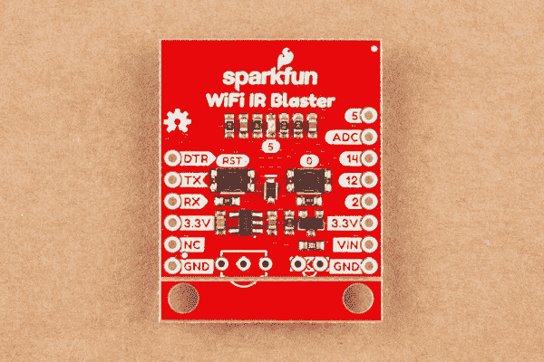](https://cdn.sparkfun.com/assets/learn_tutorials/8/4/0/SparkFun_WiFi_IR_Blaster__ESP8266__Hookup_Guide-01.jpg)

支持 ESP8266 的是一个复位和通用按钮、一个用户 LED 和一系列引脚分线点。

[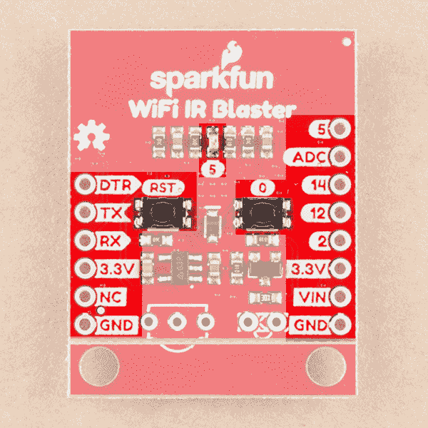](https://cdn.sparkfun.com/assets/learn_tutorials/8/4/0/important_bits.png)

当然，还有红外发射器和探测器。这些元件与电路板封装在一起，但没有焊接到位。这允许您在项目需要的任何角度焊接两个组件。它还允许用户定制电路板，并指定自己的发射器和/或接收器。

[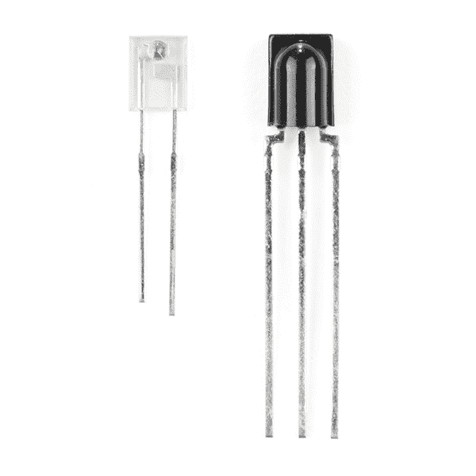](https://cdn.sparkfun.com/assets/learn_tutorials/8/1/7/ir-blaster-ir.jpg)

红外发射器是一个 [Lite-ON LTE-302](https://www.sparkfun.com/datasheets/Components/LTE-302.pdf) 。它由 NPN 晶体管驱动，有助于放大通过 LED 的电流。

红外接收器是一个 [TSOP38238](https://www.sparkfun.com/products/10266) 。这是一个简单的红外接收器硬编码接收红外信号调制在 38 千赫。

### 组装技巧

是时候拿出烙铁了！红外线发射器和接收器不会焊接在 WiFi 红外线增强器上。你还需要焊接编程接头和电源引脚。

**Please note:** Both IR components are polarized -- make sure you solder them in in the correct orientation. Both components have a bulb-shaped bump protruding from one side, the bumps should both be facing towards the nearer edge of the board. Silkscreen on the board should also help orient the components.[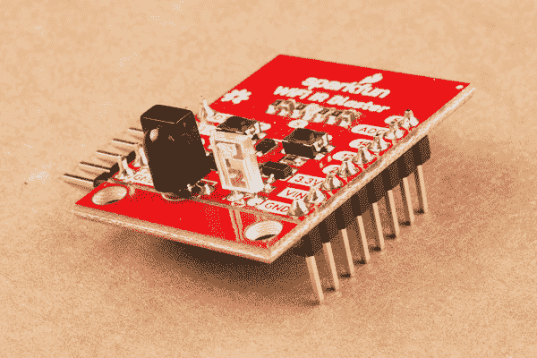](https://cdn.sparkfun.com/assets/learn_tutorials/8/4/0/SparkFun_WiFi_IR_Blaster__ESP8266__Hookup_Guide-02.jpg)

当你把熨斗熨好后，你可能还想把接头焊接到 6 针串行接头和 8 针电源/GPIO 接头上。将哪些接头焊接到电路板上最终取决于您的应用。我喜欢将一个[公直角接头](https://www.sparkfun.com/products/553)焊接到 6 针接头上，这样可以更容易地连接 USB 到串行板。[直阳接头](https://www.sparkfun.com/products/116)适用于将电路板插入面包板或穿孔板。

### 为 WiFI 红外线增强器供电

WiFi IR Blaster 包括一个 **3.3V 低压差稳压器**，它可以提供高达 600mA 的电流，并处理高达 6V 的电压输入。要使用这个调节器，将你的电源连接到 **VIN 引脚**。

或者，在两个接头上断开一对 3.3V 引脚。此引脚直接为 ESP8266 供电，因此应保持在 ESP8266 的调节范围内:3.0V-3.6V。

#### 通过 FTDI 报头的⚡Powering

WiFi IR Blaster 可通过 6 针串行接头上的 3.3V 针供电。提供给此引脚的电压应**调节至 3.3V** 。你的电源将需要能够**提供至少 300 毫安**，这是大多数 FTDI 板做不到的。我们推荐[结实的 3 FTDI 基本分线点](https://www.sparkfun.com/products/13746)，它可以提供高达 600mA 的电流。

### 移除支架边缘

WiFi IR Blaster 底部有一对支架。如果你不需要这些支架，并希望节省一些空间，支架板可以通过沿 v-score 线折断来拆除。

[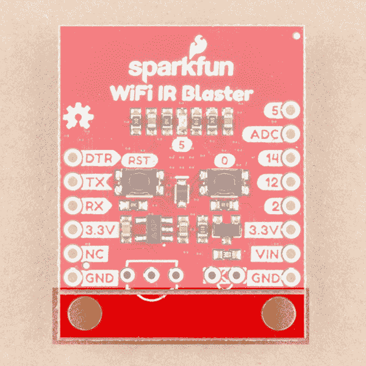](https://cdn.sparkfun.com/assets/learn_tutorials/8/4/0/standoff.png)*Standoff Board Snappable Area*

## ESP8266 编程

WiFi IR Blaster 的 ESP8266 设计为使用 [3.3V FTDI Basic](https://www.sparkfun.com/products/9873) 或类似的 6 针 USB 转串行转换器进行编程。如果你用 FTDI 给爆破器供电，我们推荐一个[结实的 3 FTDI 基本分线点](https://www.sparkfun.com/products/13746)(更多信息见上一节的注释)。

插入您的 USB 到串行转换器，确保边缘上的“GND”和“DTR”信号匹配。

[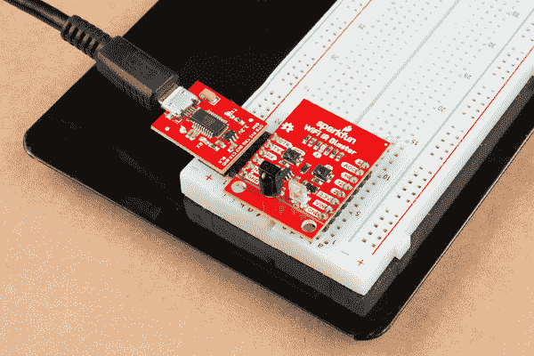](https://cdn.sparkfun.com/assets/learn_tutorials/8/4/0/SparkFun_WiFi_IR_Blaster__ESP8266__Hookup_Guide-03.jpg)*Click the image for a closer look.*

### Arduino 板支持

**Note:** This example assumes you are using the latest version of the Arduino IDE on your desktop. If this is your first time using Arduino, please review our tutorial on [installing the Arduino IDE.](https://learn.sparkfun.com/tutorials/installing-arduino-ide) If you have not previously installed an Arduino library, please check out our [installation guide.](https://learn.sparkfun.com/tutorials/installing-an-arduino-library)

在对 WiFi IR Blaster 的 ESP8266 进行编程之前，您需要安装 ESP8266 Arduino 板定义。板卡定义可以在 [ESP8266 Arduino GitHub 库](https://github.com/esp8266/Arduino)中找到。有关安装说明，请查看[自述文件](https://github.com/esp8266/Arduino#installing-with-boards-manager)的这一部分。

Arduino ESP8266 板文件不包含 WiFi Blaster 板定义，但它可以作为通用 ESP8266 模块上传到。验证您的设置如下所示:

| 板:通用 ESP8266 模块 |
| 板 | 通用 ESP8266 模块 |
| 闪光模式 | 队列输入输出 |
| 调试级别 | 没有人 |
| 重置方法 | ck |
| CPU 频率 | 80 兆赫 |
| 闪光大小 | 4M (1M SPIFFS) |
| 调试端口 | 有缺陷的 |
| lwIP 变体 | v2 预构建(MSS=536) |
| 晶体频率 | 26 兆赫 |
| 闪光频率 | 40 兆赫 |
| 上传速度 | One hundred and fifteen thousand two hundred |

[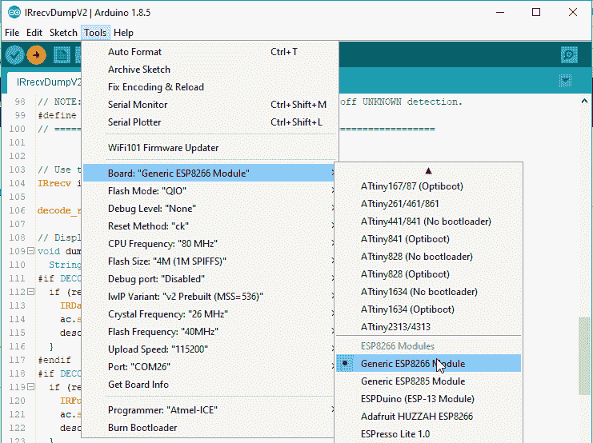](https://cdn.sparkfun.com/assets/learn_tutorials/8/1/7/arduino-board-selection.png)

### 自动与手动复位到引导加载程序

除了 RX 和 TX 引脚之外，FTDI 的 DTR 引脚还用于复位 ESP8266 并使其进入引导加载程序模式。该板包括自动复位和引导装载板的电路；在大多数情况下，你不应该做任何特殊的编程。

然而，自动复位电路可能有点不可靠。如果开发板没有运行程序，您可能会看到类似“error: espcomm_upload_mem failed”的错误。

如果这种情况重复出现，您可能需要在重置 ESP8266 时通过保持引脚 0 为低电平来手动重置为引导加载程序模式:

1.  按住“0”按钮
2.  按下并释放“RST”按钮
3.  释放“0”按钮

这个时机可能有点棘手。尝试将其重置为引导模式，然后快速上传您的草图。

将上传速度波特率降低到大约 115200 bps 也有助于提高复位电路的可靠性。

## 测试接收器

#### ESP8266 红外遥控 Arduino 库

**IRremoteESP8266** -一个专用于 ESP8266 的 IR Arduino 库-获得我们关于使用该板发送和接收 IR 信号的建议。你可以从他们的 [GitHub 页面](https://github.com/markszabo/IRremoteESP8266)下载这个库，或者在你的 Arduino 库管理器中搜索出 IRremoteESP8266。

[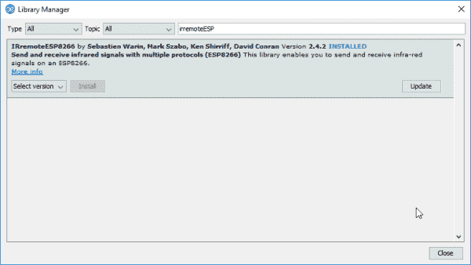](https://cdn.sparkfun.com/assets/learn_tutorials/8/1/7/library-manager.png)

*Click the image for a closer look.*

红外远程库包括一个详尽的例子集合，演示了如何发送和接收红外信号。为了测试接收器，通过导航到文件>示例>自定义库> IRremoteESP8266 菜单中的示例，打开**irrecdump v2**示例。

上传草图前，需要**修改定义了全局变量的`kRecvPin`** 引脚定义..这将设置连接到 IR 接收器的 ESP8266 引脚。将其设置为 **13** 。

```
language:c
uint16_t kRecvPin = 13; 
```

一旦修改完成，请上传！(确保电路板正确设置为“NodeMCU 1.0 (ESP-12E 模块)”。)然后打开串行监视器，将波特率设置为 115200。

您应该会看到一条“IRrecvDumpV2 正在运行，正在等待 Pin 13 上的 IR 输入”的消息打印出来。如果你不试着按下棋盘的重置键。

然后将红外遥控器对准棋盘，按下按钮。您应该会看到一个数据流飞驰而过。

[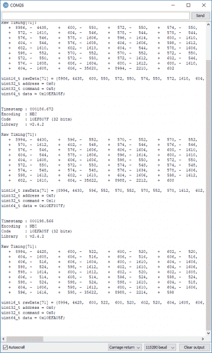](https://cdn.sparkfun.com/assets/learn_tutorials/8/1/7/serial-monitor-recv-example.png)*Click the image for a closer look.*

该输出最重要的部分是最后 4 行，看起来很像 C 变量声明。例如:

```
uint16_t rawData[71] = {8994, 4428,  600, 522,  600, 520,  602, 520,  604, 1608,  606, 516,  606, 516,  606, 516,  606, 516,  606, 1604,  600, 1610,  604, 1606,  598, 524,  598, 1612,  602, 1610,  604, 1606,  598, 1614,  600, 1612,  602, 520,  602, 1608,  606, 514,  608, 514,  596, 524,  598, 524,  598, 524,  598, 524,  598, 1610,  604, 518,  604, 1606,  598, 1612,  600, 1610,  604, 1606,  596, 1616,  598, 35622,  8988, 2214,  598};  // NEC 10EFA05F
uint32_t address = 0x8;
uint32_t command = 0x5;
uint64_t data = 0x10EFA05F; 
```

这些线将在下一个例子中使用，我们测试发射器。

## 发送红外代码

准备好您想要的 IR 命令的定时数据后，加载 **IRsendDemo** 示例。在第 42 行，用你从上一个例子中复制的数组替换 **`rawData`** 。您不必修改 IR 发射器的引脚定义——只需仔细检查以确保`IR_LED`设置为 4，这是连接到 IR 发射器的 ESP8266 引脚。

完成更改后，上传代码。然后将红外发射器指向您的设备。发射器的范围大约是 10 英尺，所以你可能需要靠近一点。它应该每 6 秒接收一个命令。

如果您的代码是 Sony 或 NEC 编码的，您还可以插入上一个示例中的值`data`,以发送 NEC 或 Sony 命令。这比发送原始定时数据要有效得多。

### 通过网络服务器发送 NEC 代码

最后一个真正开始展示这个模块威力的例子是 **IRServer** 例子。此草图将把您的 ESP8266 连接到 WiFi，并将其设置为 web 服务器。当点击正确的 HTTP 端点时，它将发送所需的命令。因此，您可以从网络浏览器触发您的设备！

这个例子要求你有一个 NEC 编码的信号要发送。

在上传这个例子之前，将您的 WiFi 网络的 SSID 和密码插入到`ssid`和`password`变量中。

然后在`handleRoot()`函数中调整一些静态 HTML 来发送你想要的代码。这有点棘手。您需要从接收示例中找到您的 NEC 代码——在我的例子中，它是 **0x10EFA05F** 。您还需要将这个值转换成十进制数([这里有一个计算那个](https://www.rapidtables.com/convert/number/hex-to-decimal.html)的计算器)。我的答案是 **284139615** 。将这两个值插入到一个新的 C 字符串 HTML 行中。我在第 59 行加了这行，比如:

```
language:c
              "<p><a href=\"ir?code=284139615\">Send 0x10EFA05F</a></p>" \ 
```

然后上传代码！打开串行监视器检查您的 ESP8266 的连接状态。一旦连接，它应该给你一个 IP 地址。

在连接到同一个 WiFi 网络的设备上，将该 IP 地址插入地址栏。您应该会看到这样一个页面:

[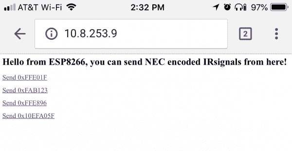](https://cdn.sparkfun.com/assets/learn_tutorials/8/1/7/ir-server-web-browser.JPG)

然后将您的 IR Blaster 瞄准一个设备，并单击您新添加的链接。您的信号应该从您的手机或电脑通过 WiFi 电波发送到您想要控制的设备。

## 红外控制器固件

探索非远程 8266 库只是这个 WiFi IR Blaster 冰山的一角。我们强烈建议检查一下 [IR 控制器 ESP8266 固件](https://github.com/mdhiggins/ESP8266-HTTP-IR-Blaster)。这种功能齐全的固件将红外发送和接收功能与网络服务器相结合。它监控接收到的命令，并提供一个方便的接口，通过 ESP8266 将这些命令发送出去。甚至还有将 Blaster 连接到 **Alexa 服务**的说明。

[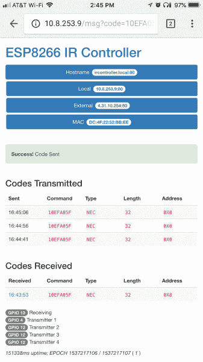](https://cdn.sparkfun.com/assets/learn_tutorials/8/1/7/ircontroller-example.jpeg)*Click the image for a closer look.*

如果你给这个固件一个旋转，只要记住你需要指定红外发射器和接收器引脚。这是我设置的`pins`变量:

```
language:c
const int pinr1 = 13;                               // Receiving pin
const int pins1 = 4;                                // Transmitting preset 1
const int pins2 = 12;                               // Transmitting preset 2 (not used)
const int pins3 = 12;                               // Transmitting preset 3 (not used)
const int pins4 = 12;                               // Transmitting preset 4 (not used)
const int configpin = 5;                            // Reset Pin

// User settings are above here
const int ledpin = 0;                               // Built in LED defined for WEMOS people 
```

你还需要安装一些库，这些都在自述文件的[安装部分有所描述。](https://github.com/mdhiggins/ESP8266-HTTP-IR-Blaster#setup)

做了这些小小的修改，你应该很快就能控制它了！

## 资源和更进一步

需要更多关于 WiFi 红外线增强器的信息？查看我们的 GitHub 库和其他文档:

*   [GitHub 产品库](https://github.com/sparkfun/ESP8266_WiFi_IR_Blaster) - GitHub 产品库，您可以在这里找到我们所有最新的硬件和软件设计文件。
*   **硬件**
    *   [示意图](https://cdn.sparkfun.com/assets/e/0/2/7/7/esp8266_ir_blaster.pdf) - PDF 示意图
    *   [Eagle 文件](https://cdn.sparkfun.com/assets/5/e/d/6/e/esp8266_ir_blaster.zip) - PCB 设计文件
    *   [ESP-12S 数据表](https://cdn.sparkfun.com/assets/learn_tutorials/8/1/7/ESP-12S_User_Manual.pdf) - ESP8266 模块，带集成晶体、天线和闪光灯
    *   [LTE-302 数据表](https://cdn.sparkfun.com/assets/learn_tutorials/8/1/7/LTE-302.pdf) -红外发射器
    *   [TSOP382 数据表](https://cdn.sparkfun.com/assets/learn_tutorials/8/1/7/tsop382.pdf) -红外接收器
*   **固件**
    *   [非远程 ESP8266 Arduino 库](https://github.com/markszabo/IRremoteESP8266) - ESP8266 红外 Arduino 库
    *   [ESP8266 红外控制器固件](https://github.com/mdhiggins/ESP8266-HTTP-IR-Blaster) -全功能 ESP8266 红外控制器固件
*   [SFE 产品展示区](https://youtu.be/mxKUskGUQk0)

想要更多信息或灵感？查看以下链接！

[](https://learn.sparkfun.com/tutorials/ir-communication) [### 红外通信](https://learn.sparkfun.com/tutorials/ir-communication) This tutorial explains how common infrared (IR) communication works, as well as shows you how to set up a simple IR transmitter and receiver with an Arduino.[Favorited Favorite](# "Add to favorites") 42[](https://learn.sparkfun.com/tutorials/boss-alarm) [### Boss 警报](https://learn.sparkfun.com/tutorials/boss-alarm) Build a Boss Alarm that alerts you of anyone walking into your office and automatically changes your computer screen.[Favorited Favorite](# "Add to favorites") 19[](https://learn.sparkfun.com/tutorials/roshamglo-project-tv-b-gone) [### 罗沙姆格洛项目:电视-B-没了](https://learn.sparkfun.com/tutorials/roshamglo-project-tv-b-gone) Turn your Roshamglo board into a (nearly) universal TV power button.[Favorited Favorite](# "Add to favorites") 4[](https://www.sparkfun.com/news/2123 "June 20, 2016: Wherein we put several sensors through their paces against this year's course. ") [### AVC 传感器测试

June 20, 2016](https://www.sparkfun.com/news/2123 "June 20, 2016: Wherein we put several sensors through their paces against this year's course. ")[Favorited Favorite](# "Add to favorites") 0**********