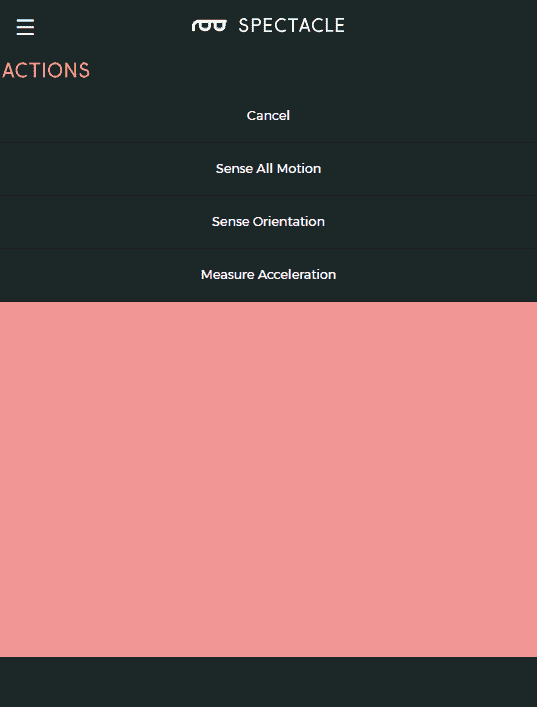
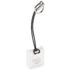
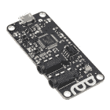
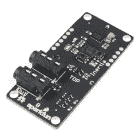

# 眼镜惯性板连接导轨

> 原文：<https://learn.sparkfun.com/tutorials/spectacle-inertia-board-hookup-guide>

## 眼镜惯性板

眼镜惯性板使眼镜项目的运动或方向感测变得容易。

 

### [眼镜惯性板](https://www.sparkfun.com/products/retired/13992)

[Retired](https://learn.sparkfun.com/static/bubbles/ "Retired") DEV-13992

眼镜惯性板使眼镜项目的运动或方向感测变得容易。眼镜惯性车…

**Retired**[Favorited Favorite](# "Add to favorites") 4[Wish List](# "Add to wish list")

### TL；灾难恢复(基本要素)

1.  惯性板可以感应运动、不运动、方向或加速度。
2.  它既可以瞬间触发，也可以持续触发。

### 遇见眼镜惯性板

眼镜惯性板旨在允许眼镜项目检测其方向，无论是移动还是静止，或者是否处于加速状态。

它有两个用于眼镜控制信号的 1/8 英寸(3.5 毫米)插孔。**注意千斤顶的方向性！**标有“In”的那一个应插入比惯性板更靠近控制器板的板，或插入控制器板本身。

### 推荐阅读

在继续之前，您应该通读[眼镜用户指南](https://learn.sparkfun.com/tutorials/spectacle-users-guide)。它会给你一些你需要了解的关于奇观如何工作的基础知识，以便你能理解本教程的其余部分。

## 配置实用程序

有三种不同的动作可以分配给惯性板，让你感觉几个不同的运动和方向选项。我们将在下面逐一解释。

#### 感知所有运动

当棋盘移动或静止时，这个动作发出一个触发器。当板被移动时，触发信号将几乎立即被发送。然而，当棋盘从移动到静止时，在触发信号出现之前有几秒钟的延迟。

*   **"if / while"** -确定信号是否只在电路板开始或停止移动时出现一次，或者在电路板移动或不移动的任何时候都应保持不变。
*   **“移动/静止”** -信号应该在板开始移动时激活，还是停止移动时激活？
*   **“激活频道号……”** -我们希望信号在哪个频道？

#### 感觉取向

惯性板的另一个检测应用是方位。惯性板的每个面和边都有一个与之关联的名称(A-D、顶部或底部)。当这些面中的任何一面朝上时，电路板可以输出信号，或者仅当它最初面朝上时，或者只要它面朝上就持续输出信号。

*   **"if / while"** -确定信号是只出现一次，当电路板第一次达到该方向时，还是持续出现，只要该方向保持不变。
*   **" a b c d top bottom"** -这是电路板的侧面/正面，当它在顶部时会产生一个信号。
*   **“激活频道号……”** -我们希望信号在哪个频道？

#### 测量加速度

最后一个检测选项是测量加速度。输出可以在 0 到 1000 之间，取决于电路板的加速度。沿其测量加速度的轴由复选框定义，正向加速度将大于 500，而负向加速度将小于 500。

我们建议通过实验来了解这种模式是如何工作的。

## 示例项目

我们用眼镜音频板和眼镜惯性板做一个简单的项目吧！我们将对其进行设置，以便每当惯性板移动时都会播放声音。

#### 连接电路板

要学习本教程，您需要以下硬件:

 

将**添加到您的[购物车](https://www.sparkfun.com/cart)中！**

### [microSD USB 读卡器](https://www.sparkfun.com/products/13004)

[In stock](https://learn.sparkfun.com/static/bubbles/ "in stock") COM-13004

这是一个很棒的微型 USB 读卡器。只需将您的 microSD 卡滑入 USB 连接器内部，然后将它插入 USB 连接器

$5.5011[Favorited Favorite](# "Add to favorites") 11[Wish List](# "Add to wish list")**** 

将**添加到您的[购物车](https://www.sparkfun.com/cart)中！**

### [壁式适配器电源- 5.1V DC 2.5A (USB Micro-B)](https://www.sparkfun.com/products/13831)

[In stock](https://learn.sparkfun.com/static/bubbles/ "in stock") TOL-13831

这是一个高品质的开关“壁式”交流到 DC 5.1V 2500ma USB 微型 B 壁式电源，专为…

$8.9521[Favorited Favorite](# "Add to favorites") 47[Wish List](# "Add to wish list")**** 

将**添加到您的[购物车](https://www.sparkfun.com/cart)中！**

### [汉堡迷你音箱](https://www.sparkfun.com/products/14023)

[In stock](https://learn.sparkfun.com/static/bubbles/ "in stock") COM-14023

这对你的耳朵将是一种享受！汉堡包迷你扬声器是一个 3W 的经济扬声器选项，适用于任何需要标准扬声器的项目

$5.502[Favorited Favorite](# "Add to favorites") 20[Wish List](# "Add to wish list")**** 

将**添加到您的[购物车](https://www.sparkfun.com/cart)中！**

### [眼镜导演板](https://www.sparkfun.com/products/13912)

[In stock](https://learn.sparkfun.com/static/bubbles/ "in stock") DEV-13912

眼镜董事会控制着一个眼镜项目的所有行动。虽然董事会没有做太多的工作…

$24.95 $9.95[Favorited Favorite](# "Add to favorites") 4[Wish List](# "Add to wish list")**** 

### [音频线 TRRS - 3ft](https://www.sparkfun.com/products/retired/14164)

[Retired](https://learn.sparkfun.com/static/bubbles/ "Retired") CAB-14164

这是一条 3 英尺长的白色音频电缆，两端各有两个 TRRS 连接器。TRRS 连接器是…

**Retired**[Favorited Favorite](# "Add to favorites") 5[Wish List](# "Add to wish list") 

### [带适配器的 microSD 卡——16GB(10 类)](https://www.sparkfun.com/products/retired/13833)

[Retired](https://learn.sparkfun.com/static/bubbles/ "Retired") COM-13833

这是一个 10 级 16GB microSD 存储卡，非常适合容纳单板计算机和多种…

6 **Retired**[Favorited Favorite](# "Add to favorites") 8[Wish List](# "Add to wish list") 

### [眼镜惯性板](https://www.sparkfun.com/products/retired/13992)

[Retired](https://learn.sparkfun.com/static/bubbles/ "Retired") DEV-13992

眼镜惯性板使眼镜项目的运动或方向感测变得容易。眼镜惯性车…

**Retired**[Favorited Favorite](# "Add to favorites") 4[Wish List](# "Add to wish list") 

### [眼镜音频板](https://www.sparkfun.com/products/retired/14034)

[Retired](https://learn.sparkfun.com/static/bubbles/ "Retired") DEV-14034

眼镜音频板允许您将 microSD 卡中的声音添加到您的眼镜项目中。每个板接受一个微型…

**Retired**[Favorited Favorite](# "Add to favorites") 5[Wish List](# "Add to wish list")******** ********请注意，你将需要三根 TRRS 电缆！

首先，将 TRRS 电缆的一端插入控制器板上的“直接”插孔。

接下来，将另一根 TRRS 电缆插入主板上的“程序”插孔。

将线缆的另一端插入手机、平板电脑或电脑的音频插孔，以便对系统进行编程。

将电缆的另一端插入音频板上的“In”插孔。

将扬声器插入音频板上的音频输出端口。

拿起另一根 TRRS 电缆，将一端插入音频板上的“输出”端口...

...并将电缆的另一端插入惯性板上的“In”端口。

最后，将电源适配器的微型 B 端插入控制器板，将适配器的另一端插入墙壁。您应该在惯性板和音频板上看到一个稳定的灯和一个闪烁的灯。在指示板上，您会看到一个稳定的指示灯和一个闪烁一次，然后暂停，然后重复的指示灯。这表明电源已接通，板已启动并正在运行。

#### 设置板配置

当你第一次访问眼镜配置网站时，你会看到一个类似这样的屏幕。但是，您的项目名称会有所不同，因为每个项目都会有一个新的名称。要继续，我们必须将我们的音频板添加到项目中。

单击上面突出显示的“添加电路板”按钮，显示可用电路板的列表。

在列表中，单击“音频”框中的任意位置，向我们的项目添加音频板。

您将返回到主项目页面，但这一次，一个音频板将出现在页面上的列表中。重复这两个步骤，将惯性板添加到项目中。

在这里，您可以看到列表中的两个板都已就位。接下来，我们需要在板上添加动作。

您可以看到突出显示的隔板图标，当单击这些图标时，会将您带到“操作”页面，在这里您可以为您的板分配一个操作。让我们从给音频板分配一个动作开始。

将出现一个空白页面。当前没有分配的操作，因此我们需要分配一些。单击页面底部的“添加操作”按钮。

如你所见，音频板只有一个动作。单击“播放声音”将此操作添加到您的音频板上。

以下是“播放声音”动作的各种设置。复制我输入到你的项目中的设置。

点击页面底部的“返回”按钮返回主页面，然后点击惯性板的隔板图标添加一个动作。当弹出空列表时，点击底部的“添加动作”按钮，调出惯性板的动作列表。

这是惯性板的行动列表。我们希望检测何时发生运动，因此单击第一个选项“感知所有运动”。

这是“感知运动”动作的选项页面。记下我所做的选择，并将其复制到您的项目中，然后单击“返回”。

恭喜你！你的项目完成了。现在让我们把它上传到董事会。

#### 在董事会上安装项目

现在你已经创建了你的眼镜程序，是时候把它上传到董事会了。如果你按照上面的说明，你的上传设备已经连接到板上，可以开始了，所以你需要做的就是点击页面底部的“安装脚本”按钮。这将打开如下所示的页面。

确保设备上的音量已调至最大，并且没有其他音频源(音乐、视频等)在背景中播放。然后按住控制器板上的“RST”按钮，按住“程序”按钮，然后松开“RST”按钮。

这将使主板进入程序模式。你会看到板上的灯闪烁三次，暂停，然后重复。这是电路板处于程序模式的视觉指示器。一旦您确定电路板处于编程模式，您可以通过触摸眼镜应用程序屏幕上的“安装”按钮开始编程。该按钮将在编程过程中变灰，这应该只持续几秒钟。编程完成后，您会看到指示板上的灯闪烁 10 次，暂停，然后重复。这是你的提示，程序上传成功。

再次按下“RST”按钮，重置系统并开始程序！

如果您有任何问题，请访问[故障排除页面](https://learn.sparkfun.com/tutorials/spectacle-users-guide#troubleshooting)以获得解决问题的帮助。

## 资源和更进一步

有关一般眼镜信息，请查看用户指南:

 [### 眼镜用户指南

#### 2017 年 5 月 4 日](https://learn.sparkfun.com/tutorials/spectacle-users-guide) The Spectacle system is designed to help those without electronics or programming experience integrate electronics into projects.[Favorited Favorite](# "Add to favorites") 4

查看以下附加眼镜指南:

 [### 眼镜音响套装连接指南](https://learn.sparkfun.com/tutorials/spectacle-sound-kit-hookup-guide) All the information you need to use the Spectacle Sound Kit in one place.[Favorited Favorite](# "Add to favorites") 1 [### 眼镜用户指南](https://learn.sparkfun.com/tutorials/spectacle-users-guide) The Spectacle system is designed to help those without electronics or programming experience integrate electronics into projects.[Favorited Favorite](# "Add to favorites") 4 [### 眼镜音频板连接指南](https://learn.sparkfun.com/tutorials/spectacle-audio-board-hookup-guide) All the information you need to use the Spectacle Audio Board in one place.[Favorited Favorite](# "Add to favorites") 2 [### 眼镜按钮板连接导轨](https://learn.sparkfun.com/tutorials/spectacle-button-board-hookup-guide) All the information you need to use the Spectacle Button Board in one place.[Favorited Favorite](# "Add to favorites") 2 [### 眼镜灯板连接导轨](https://learn.sparkfun.com/tutorials/spectacle-light-board-hookup-guide) All the information you need to use the Spectacle Light Board in one place.[Favorited Favorite](# "Add to favorites") 2 [### 眼镜运动套件连接指南](https://learn.sparkfun.com/tutorials/spectacle-motion-kit-hookup-guide) All the information you need to use the Spectacle Motion Kit in one place.[Favorited Favorite](# "Add to favorites") 2 [### 眼镜运动板连接指南](https://learn.sparkfun.com/tutorials/spectacle-motion-board-hookup-guide) All the information you need to use the Spectacle Motion Kit in one place.[Favorited Favorite](# "Add to favorites") 2 [### 奇观例子:超级马里奥兄弟西洋镜](https://learn.sparkfun.com/tutorials/spectacle-example-super-mario-bros-diorama) A study in building an animated diorama (with sound!) using Spectacle electronics.[Favorited Favorite](# "Add to favorites") 1********