# 眼镜灯光和声音套件连接指南

> 原文：<https://learn.sparkfun.com/tutorials/spectacle-light-and-sound-kit-hookup-guide>

## 介绍

[眼镜灯光和声音套件](https://www.sparkfun.com/products/14486)允许您轻松地将按钮激活的声音和灯光效果添加到您的项目中。

 

### [眼镜声光套件](https://www.sparkfun.com/products/retired/14486)

[Retired](https://learn.sparkfun.com/static/bubbles/ "Retired") KIT-14486

眼镜灯光和声音套件可以很容易地将按钮激活的声音和灯光效果融入到您的项目中

**Retired**[Favorited Favorite](# "Add to favorites") 1[Wish List](# "Add to wish list")

### 推荐阅读

在继续之前，您应该通读[眼镜用户指南](https://learn.sparkfun.com/tutorials/spectacle-users-guide)。它会给你一些你需要了解的关于奇观如何工作的基础知识，以便你能理解本教程的其余部分。

## 眼镜音频板

眼镜音频板允许您添加声音到您的眼镜项目。它接受带有声音的 microSD 卡。ogg 格式(稍后将详细介绍)，并有一个 1/8 英寸(3.5 毫米)音频插孔来连接外部放大器。

 

### [眼镜音频板](https://www.sparkfun.com/products/retired/14034)

[Retired](https://learn.sparkfun.com/static/bubbles/ "Retired") DEV-14034

眼镜音频板允许您将 microSD 卡中的声音添加到您的眼镜项目中。每个板接受一个微型…

**Retired**[Favorited Favorite](# "Add to favorites") 5[Wish List](# "Add to wish list")

### TL；灾难恢复(基本要素)

1.  眼镜的音频文件应格式化为。奥格文件。
2.  音频文件应该有名称 00.ogg、01.ogg、02.ogg 等。
3.  音频板上的音频插孔产生仅适用于放大的输出。它不适合耳机或无电源扬声器。

### 认识一下眼镜音频板

眼镜音频板旨在成为一种低成本且易于使用的向项目添加声音的方法，它与眼镜生态系统的其余部分相集成，以按需提供声音效果。

它有三个 1/8 英寸(3.5 毫米)插孔:两个用于眼镜控制信号，一个用于音频输出。确保将电缆插入正确的插孔！将音频设备插入其中一个眼镜插孔可能会损坏音频设备。请注意，眼镜数据插孔是定向的:标有“In”的插孔应插入“上游”板(即比这个更靠近控制器板)，标有“Out”的插孔连接到下一个下游板。**“输出”插孔不用于音频信号。**

[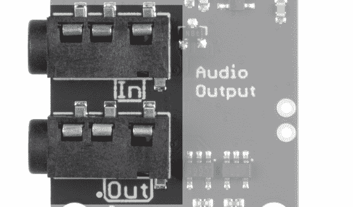](https://cdn.sparkfun.com/assets/learn_tutorials/6/2/3/audio_io_jacks.png)

音频输出仅为放大设备设计。这意味着任何使用带耳机或未放大扬声器的眼镜音频板的尝试都将无法产生声音输出。SparkFun 出售一款[小型、放大、可充电扬声器](https://www.sparkfun.com/products/14023)，专门用于眼镜音频板。

[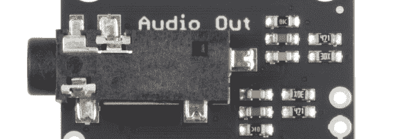](https://cdn.sparkfun.com/assets/learn_tutorials/6/2/3/audio_audio_jack.png)

眼镜音频板使用 microSD 卡存储要播放的音频文件。这些文件应该存储为。ogg Vorbis 编码文件。这种免费的音频文件格式可以在任何类型的计算机上播放和创建。在教程的后面，我们将向您展示如何从 MP3、WAV 或其他文件格式转换为。ogg 格式。

这些文件必须用数字命名，这是在配置应用程序中引用它们的方式。文件名示例有 00.ogg、01.ogg、02.ogg 等等。

## 眼镜按钮板

眼镜按钮板允许您将按钮或开关输入添加到您的眼镜项目中。它共有 9 个信号输入，其中 8 个可以来自外部按钮，1 个直接在板上。

 

### [眼镜按钮板](https://www.sparkfun.com/products/retired/14044)

[Retired](https://learn.sparkfun.com/static/bubbles/ "Retired") DEV-14044

眼镜按钮板允许您将来自按钮、开关或其他接触式传感设备的输入添加到您的眼镜上

1 **Retired**[Favorited Favorite](# "Add to favorites") 5[Wish List](# "Add to wish list")

### TL；博士；医生

1.  按钮或开关可以通过将电线插入电路板上的“戳 home”型连接器来连接到电路板上。
2.  多达九个信号可用。
3.  按钮信号可以是瞬时的，也可以是连续的。

### 遇见眼镜按钮板

眼镜按钮板旨在将简单的信号从世界带入您的眼镜项目，为您的任何眼镜项目提供输入。

它有两个 1/8 英寸(3.5 毫米)插孔，用于连接眼镜系统中的其他电路板。请注意，眼镜数据插孔是定向的:标有“In”的插孔应插入“上游”板(即比这个更靠近控制器板)，标有“Out”的插孔连接到下一个下游板。

按钮板上有 8 个“戳 home”连接器。每个都可以连接到一个(或多个)按钮。要添加连接，只需将电线的剥皮端推入连接器上的孔中。连接器会自动抓住电线并将其固定到位。如果您需要稍后移除电线，请使用小物件(发夹、圆珠笔等)。)可用于按下释放按钮，使电线无损坏地抽出。

按钮板上有一个输入按钮，如果没有其他按钮可用，它可以用来提供输入信号。它的功能就像任何其他可能附加的普通按钮一样。确保你按的是标有“8”的按钮，而不是标有“重置”的按钮！按下重置按钮将重置您的按钮板，可能会导致您的整个系统停止正常工作，直到您重置您的控制器板！

[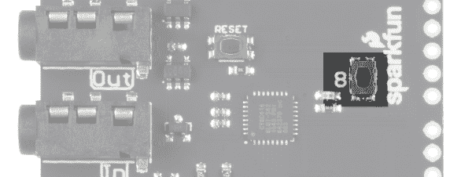](https://cdn.sparkfun.com/assets/learn_tutorials/6/2/5/button_button_8.png)

## 眼镜灯板

眼镜灯板允许您添加一些相当复杂的照明效果到您的眼镜项目。它可以连接多达三股可寻址 led 和一个外部电源连接器。

 

### [眼镜灯板](https://www.sparkfun.com/products/retired/14052)

[Retired](https://learn.sparkfun.com/static/bubbles/ "Retired") DEV-14052

眼镜灯板允许您添加一些相当复杂的照明效果到您的眼镜项目中，以一种简化的…

**Retired**[Favorited Favorite](# "Add to favorites") 4[Wish List](# "Add to wish list")

### TL；博士；医生

1.  如果超过大约 10 个像素将同时打开，我们建议通过板载 micro-B USB 端口为灯板供电。
2.  对于数量较少的像素，可以通过眼镜控制电缆直接供电。
3.  大多数 LED 效果需要一个连续类型的信号，例如按钮板的“锁定开/锁定关”功能。
4.  只有 WS2812 (NeoPixel)型可寻址 LED 灯条可与眼镜灯板配合使用。

### 见见眼镜灯板

“眼镜灯板”旨在方便您将相对复杂的灯光效果添加到眼镜项目中，它与眼镜生态系统的其余部分相集成，让您可以相对轻松地控制灯光效果。

它有两个用于眼镜控制信号的 1/8 英寸(3.5 毫米)插孔。**注意千斤顶的方向性！**标有“In”的那一个应插入比灯板更靠近控制器板的板，或插入控制器板本身。

灯板支持多达三股[可寻址发光二极管](https://www.sparkfun.com/products/12025)。每条线最多可以有 60 个像素。**并非所有类型的可寻址发光二极管都与眼镜灯板兼容。**如果您对特定类型的 LED 灯条是否与灯板兼容有疑问，请联系 SparkFun 技术支持。

灯板有一个 Micro B USB 连接器，允许它直接由外部电源供电。眼镜数据传输的相对较细的电缆不足以传输超过几个像素的大量电流。

## 配置实用程序

### 眼镜音频板

眼镜音频板只支持一个动作:播放声音。正如您在上面看到的，有许多设置与这个动作相关联。

*   **“收听频道号 _ _”**-这是触发音频开始播放的频道号。只要该频道的值高于阈值水平(见下文)，声音将以由下面指定的两个时间间隔确定的速率重复播放。
*   **“等待 __ 秒，播放”**——这是系统第一次延迟。您可以通过延迟声音播放的时间来对事件进行排序。
*   **“文件号 _ _”**-这是你告诉棋盘玩哪个文件的地方。记住，将音频文件复制到 microSD 卡时，要命名为 00.ogg、01.ogg、02.ogg 等。此栏中的数字对应于音频文件名称中的数字。如果没有相应编号的音频文件，将不会播放任何声音。
*   **“不允许另一个声音中断，直到 __ 秒”** -此栏中的数字应与音频文件的长度相对应。如果这个值小于声音文件的长度，发送到音频板的另一个触发器将在声音结束前中断声音。如果比声音长，播放后会有一段时间的静默，然后才能开始另一次播放。
*   **“激活阈值”**——就像 app 里说的，大部分时候你不需要调整这个。调整滑块可以设置眼镜加速板触发声音的角度，或者随机触发虚拟板引起声音播放的频率。

### 眼镜按钮板

对于按钮板，有五个选项:三个产生瞬时脉冲型输出，两个产生连续开关型输出。

##### 对印刷机的操作

当按钮第一次被按下时触发一个动作，不管它随后被按住多长时间。

*   **“当按钮号 __ 被按下时”** -这是我们希望分配给该动作的按钮号。按钮号码印在板上，从 0 到 8。
*   **“触发通道号 _ _”**-单个瞬时脉冲将在该通道上发出。它适用于启动声音、启动动作或设置光带的颜色。此功能不适用于连续声音播放或打开光带效果。

##### 释放时的操作

当按钮被释放时触发一个动作，不管它在被释放之前被按住了多长时间。

*   **“当按钮号 __ 被释放时”** -这是我们希望分配给此操作的按钮号。按钮号码印在板上，从 0 到 8。
*   **“触发通道号 _ _”**-单个瞬时脉冲将在该通道上发出。例如，它适用于启动声音、启动动作或设置光带的颜色，但不适用于连续声音播放或打开光带效果。

##### 按下或释放时的动作

当按钮被按下时触发一个动作，然后当按钮被释放时再次触发相同的动作。

*   **“当按钮号 __ 被按下或释放时”** -这是我们希望分配给该动作的按钮号。按钮号码印在板上，从 0 到 8。
*   **“触发通道号 _ _”**-在按下按钮和松开按钮时，将在该通道上发出一个单一的瞬时脉冲。例如，它适用于启动声音、启动动作或设置光带的颜色，但不适用于连续声音播放或打开光带效果。

##### 保持动作

一按下按钮就触发一个事件，然后只要按钮被按住就继续触发该事件。

*   **"当按钮号 __ 被按下时"** -这是我们希望分配给该动作的按钮号。按钮号码印在板上，从 0 到 8。
*   **“激活频道号 _ _”**-该频道将连续发送。它适用于触发和重复声音，或打开和保持(至少在按住按钮时)灯光效果。

##### 闩锁开启/闩锁关闭

这个动作就像一个锁定的电源开关。一次按下打开信号，另一次按下关闭信号。

*   **"当按钮号 __ 被按下时"** -这是我们希望分配给该动作的按钮号。按钮号码印在板上，从 0 到 8。
*   **“激活频道号 __ 直到再次按下按钮”** -该频道将连续发送。它适用于触发和重复声音，或打开和保持灯光效果。

### 眼镜灯板

灯光板支持 9 种不同的动作。大多数需要连续型信号输入，但也有一些可以用于瞬时输入信号。我们将在每个动作下覆盖差异。每个动作都有一个字段，表示该动作所应用到的 lightstrip 的像素数，我们不会再提到它。

##### 彩虹效应

彩虹效果会在光带上显示彩虹颜色，逐个更改每个像素的颜色，使其看起来好像彩虹在光带上滚动。

*   **“当频道号 __ 激活时”** -彩虹效应仅在频道激活时持续，因此需要连续的输入信号。
*   **“彩虹卷轴光带号 _ _”**-选择您希望彩虹效果在哪个光带上操作。要对多个 lightstrips 产生相同的效果，必须创建多个动作。
*   **滚动速度滑块** -控制图案滚动的速度。

##### 剧场追逐

[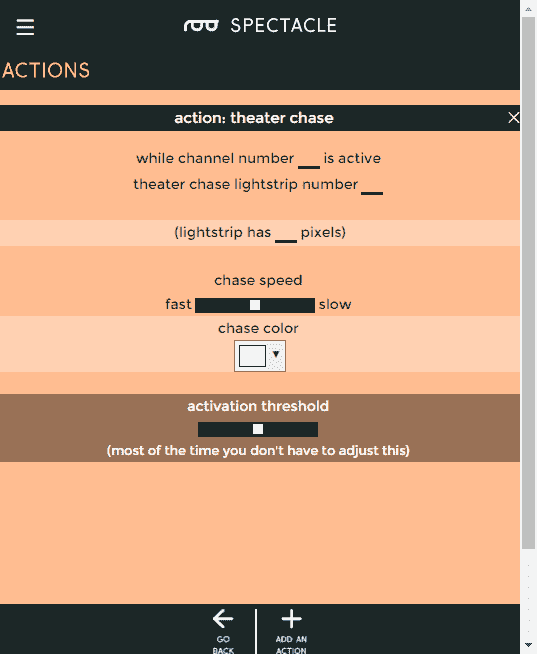](https://cdn.sparkfun.com/assets/learn_tutorials/6/2/1/theater_chase.png)

剧场追逐模式的行为就像一个跑马灯轻边界。灯光将向前行进，使它看起来好像光带在一步一步地移动。

*   **“当频道号 __ 激活时”** -剧院追逐效应仅在频道激活时持续，因此需要连续的输入信号。
*   **“剧场追逐光带号 _ _”**-选择你希望剧场追逐效果操作的光带。要对多个 lightstrips 产生相同的效果，必须创建多个动作。
*   **追踪速度滑块** -控制图案滚动时的移动速度。
*   **颜色选择器输入** -允许你选择灯光的颜色。

##### 扫描效应

[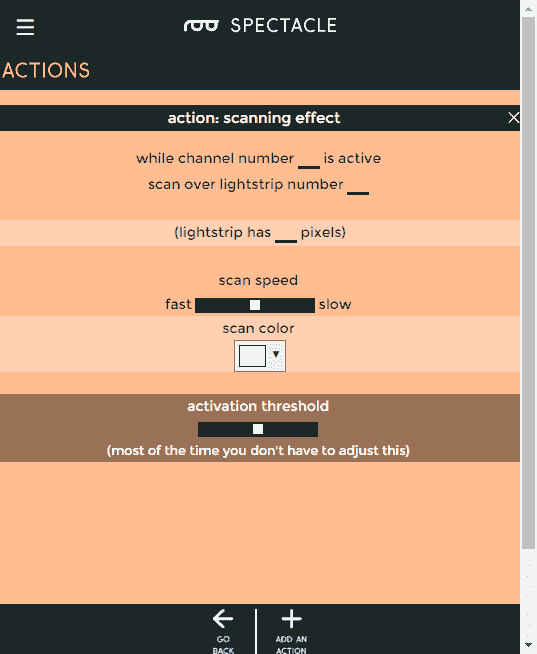](https://cdn.sparkfun.com/assets/learn_tutorials/6/2/1/scanning_effect.png)

扫描模式看到一小群光沿着光带来回跳动，让人想起《太空堡垒卡拉狄加》中的赛昂人。

*   **“当频道号 __ 激活时”** -扫描效果仅在频道激活时持续，因此需要连续的输入信号。
*   **“扫描光带号 _ _”**-选择您希望扫描效果作用于哪个光带。要对多个 lightstrips 产生相同的效果，必须创建多个动作。
*   **扫描速度滑块** -控制图案滚动时的移动速度。
*   **颜色选择器输入** -允许你选择灯光的颜色。

##### 闪烁效应

使选定条带上的单个灯光执行闪烁动作。

*   **“当频道号 __ 激活时”** -闪烁效果仅在频道激活时持续，因此需要连续的输入信号。
*   **“闪烁灯条数量 _ _”**-选择您希望闪烁效果在哪个灯条上操作。要对多个 lightstrips 产生相同的效果，必须创建多个动作。
*   **颜色选择器输入** -允许你选择灯光的颜色。
*   **速度滑块** -控制闪烁滚动的速度。
*   魔法滑块 -控制闪烁的魔法程度。玩吧！

##### 闪电效应

[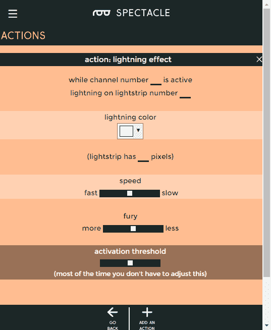](https://cdn.sparkfun.com/assets/learn_tutorials/6/2/1/lightning_effect.png)

导致整个条带以看起来很像闪电的方式闪烁。

*   **“当通道号 __ 激活时”** -闪电效应仅在通道激活时持续，因此需要连续的输入信号。
*   **“lightstrip number _ _”上的闪电** -选择你希望闪电效果在哪个 light strip 上操作。要对多个 lightstrips 产生相同的效果，必须创建多个动作。
*   **颜色选择器输入** -允许你选择灯光的颜色。
*   **速度滑块** -控制闪电划过时移动的频率。
*   愤怒滑块 -控制闪电有多愤怒。玩吧！

##### 火焰效果

[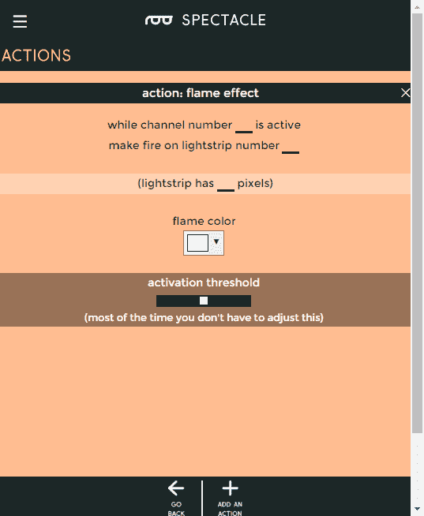](https://cdn.sparkfun.com/assets/learn_tutorials/6/2/1/flame_effect.png)

导致整个地带像火一样噼啪作响。

*   **“当频道号 __ 激活时”** -火焰效果仅在频道激活时持续，因此需要连续的输入信号。
*   **“在光带编号 __”上点火** -选择你希望火焰效果在哪个光带上操作。要对多个 lightstrips 产生相同的效果，必须创建多个动作。
*   **颜色选择器输入** -允许你选择灯光的颜色。尝试不同的颜色！

##### 褪色效果

随着时间的推移，光带会从一种颜色变成另一种颜色，然后再变回第一种颜色。

*   **“当频道号 __ 处于活动状态时”** -衰落效应仅在频道处于活动状态时持续，因此需要连续的输入信号。
*   **“淡入淡出光带数量 __ 来回”** -选择您希望淡入淡出效果作用于哪个光带。要对多个 lightstrips 产生相同的效果，必须创建多个动作。
*   **“从颜色”颜色选择器** -这是 lightstrip 启动时的初始颜色。
*   **"to color "拾色器** -另一种颜色，色带周期性地淡入淡出。
*   **“渐变速度”滑块** -控制渐变动作发生的速度。

##### 充满

用单一颜色填充灯条上的一些灯光。熄灭其他灯。

*   **“收听频道号 _ _”**-该频道上的瞬时信号是触发填充操作所需的全部，并且填充将持续到另一个效果开始。
*   **“等待 __ 秒”** -这种延迟考虑到了时序效应。大多数情况下，您可能会将其设置为 0。
*   **“清除光带号 _ _”**-选择要操作的光带。
*   **"和 fill __ pixels"** -从最靠近灯板的地方往外数像素，打开。

##### 亮像素

[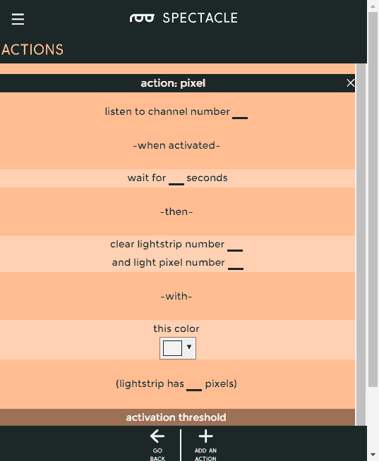](https://cdn.sparkfun.com/assets/learn_tutorials/6/2/1/pixel.png)

打开一盏灯，关闭其余的灯。

*   **“收听频道号 _ _”**-该频道上的瞬时信号是触发亮像素操作所需要的全部，并且亮像素将持续到另一个效果开始。
*   **“等待 __ 秒”** -这种延迟考虑到了时序效应。大多数情况下，您可能会将其设置为 0。
*   **“清除光带号 _ _”**-选择要操作的光带。
*   **"和灯像素数 __ "** -像素的个数，从离灯板最近的开始，到打开。

## 将声音转换为 OGG Vorbis 格式

眼镜音频板使用的文件必须是 OGG Vorbis 格式。这种免费的有损编解码器具有比 MP3 更高的压缩比，更重要的是，可以在无需向任何第三方组织支付许可费的情况下使用。

#### 下载并安装 Audacity

我们将使用[免费开源程序“Audacity”](http://www.audacityteam.org/)将你的文件从当前格式转换成 OGG Vorbis 格式。

Audacity 可以在所有三个主要的操作系统上使用，所以安装它不会有任何问题。

当您启动 Audacity 时，您会看到这个屏幕，或者一个非常类似的屏幕。乍一看，这似乎非常复杂，**这些废话对我们来说都不重要，**所以不要惊慌。

[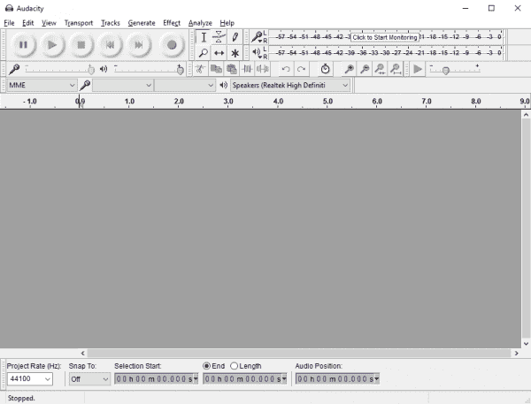](https://cdn.sparkfun.com/assets/learn_tutorials/6/1/8/audacity_5.png)

#### 载入文件

像大多数程序一样，“加载文件”只是意味着从“文件”菜单中选择“打开”并选择你想要转换的文件。Audacity 能够编辑大多数类型的音频文件:WAV、AIFF、FLAC、MP3 等。

默认情况下，当您打开打开对话框时，Audacity 会显示所有文件，而不仅仅是兼容的音频文件。有一个下拉菜单允许你改变它，所以它只显示兼容的音频文件沿着窗口的底部边缘。

[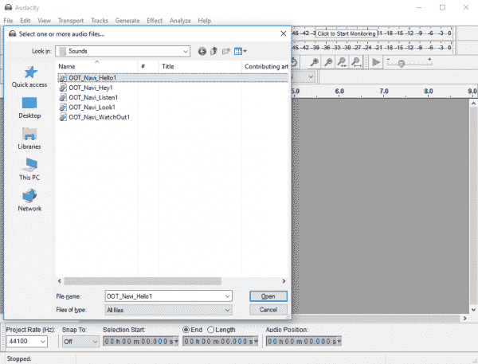](https://cdn.sparkfun.com/assets/learn_tutorials/6/1/8/audacity_open_window.png)

一旦你选择了你想要编辑的文件，一个相当危言耸听的消息可能会弹出，警告你不要在没有拷贝的情况下编辑文件。点击“确定”即可。

你会看到，这样的东西出现了。这是你的音频文件在电脑上的样子。**还是那句话，不要慌！**除非你想以某种方式编辑声音(我们不这样做)，否则这里弹出的所有设置或信息对我们来说都不重要。

#### 皈依 OGG 教

现在您已经加载了文件，您需要将其转换为 OGG Vorbis 格式。为此，请打开“文件”菜单并选择“导出音频...”菜单项大约在中间。应该会弹出一个熟悉的保存窗口。

在“文件名:”字段的正下方，您会看到一个标有“保存类型:”的下拉菜单。在下拉列表中选择“Ogg Vorbis 文件”。

窗口底部会出现一个滑块。默认值“5”对于大多数目的来说可能已经足够了。点击“保存”,会弹出另一个窗口。

[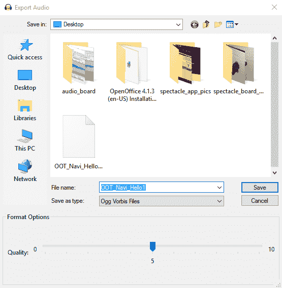](https://cdn.sparkfun.com/assets/learn_tutorials/6/1/8/audacity_export_audio_frame.png)

这个允许你设置文件的元数据。你可以忽略一切，只需点击“确定”跳过这一步。

恭喜你！您已成功将文件转换为 OGG Vorbis 格式。您现在可以将该文件复制到 Micro SD 卡(不要忘记将其重命名为一个数字！)与眼镜音频板一起使用。

[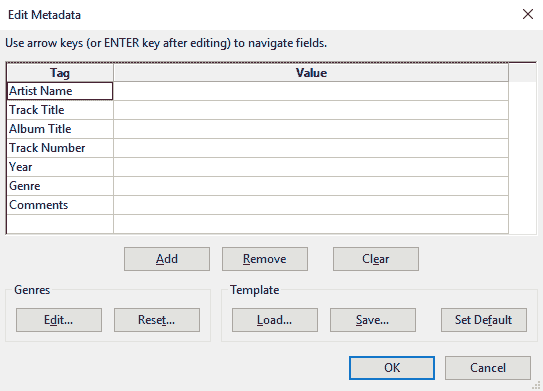](https://cdn.sparkfun.com/assets/learn_tutorials/6/1/8/metadata.png)

#### 额外加分——减少脂肪，让声音更大

正如你在我上面的文件中看到的，声音的范围和窗户的范围之间有很大的空间。在时间轴(水平轴)上，这表现为声音文件内容前后的平线。在“响度”(垂直)轴中，这表现为波形文件顶部和底部以及回放位置窗口顶部和底部之间的空间。

让我们消除声音播放前后的一些停滞时间。为此，只需在回放位置窗口内单击并拖动，就像您试图选择一段文本一样。如上所述，您选择的部分将被突出显示。现在，只需按下键盘上的“删除”键，该部分就会被删除。在声音的另一端重复这个过程。

现在，让我们看看我们能做些什么。在“编辑”菜单下，找到“选择”子菜单，选择“全部”来选择整个声音。你也可以使用上面的拖拽高亮方法。

[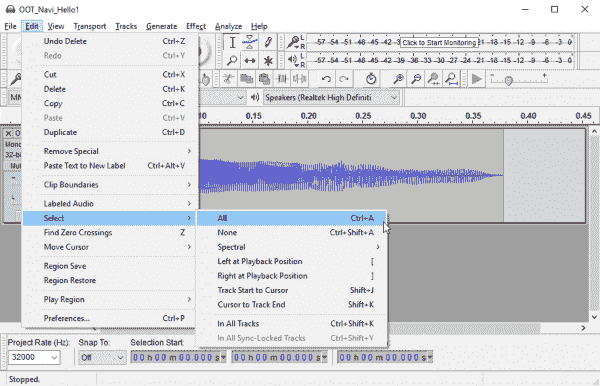](https://cdn.sparkfun.com/assets/learn_tutorials/6/1/8/select_all.png)

现在你已经选择了整个声音，点击“效果”菜单并选择“放大…”选项。

将弹出一个新窗口，带有一个滑块、几个文本框和一个复选框。滑块将被预先定位，以在不“削波”声音的情况下尽可能放大声音。当您试图将声音放大到播放系统无法承受的程度时，就会发生“削波”,这会导致播放过程中出现一种刺耳的嗡嗡声。

现在你有一个选择:你可以接受系统建议的级别，或者你可以点击“允许剪辑”复选框，用滑块增加放大倍数。我已经选择接受上图的剪裁限制；将它与更高的文件图像进行比较，您可以看到我是如何修剪末端的停滞时间并垂直增加振幅的。

为什么你想让你的声音剪辑？嗯，首先，预设的放大倍数只考虑了你声音的峰值，所以如果允许剪辑一小部分音频，可能会让绝大多数声音大很多。第二，如果你的播放设备质量相对较差，或者声音文件本身质量较差，允许剪辑可能会显著增加音量，而不会使声音质量比原来差太多。第三，音量强度可能比音质更重要，允许削波可以让你尽可能地提高音量。

现在你已经成功地编辑了声音，按照我们上面提到的，把它导出到 OGG Vorbis。

## 示例项目

让我们使用眼镜灯光和声音套件的内容来拼凑一个工作项目！我们将设置一个激光枪类型的设置，当按下按钮时，灯亮，并播放声音，然后当释放按钮时，灯灭。

#### 连接电路板

从连接电路板开始。工具包中包含所有必需的硬件。

首先，将 TRRS 电缆的一端插入控制器板上的“直接”插孔。

接下来，将另一根 TRRS 电缆插入主板上的“程序”插孔。

将线缆的另一端插入手机、平板电脑或电脑的音频插孔，以便对系统进行编程。

然后将第一根 TRRS 电缆的另一端(插入控制器板上“直接”插孔的一端)插入按钮板上的“输入”插孔。

抓住另一根 TRRS 电缆，将其插入按钮板上的“Out”插孔。

[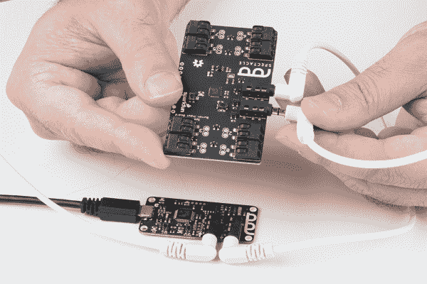](https://cdn.sparkfun.com/assets/learn_tutorials/6/2/1/Spectacle-28.jpg)

将电缆的另一端插入音频板上的“In”插孔。

[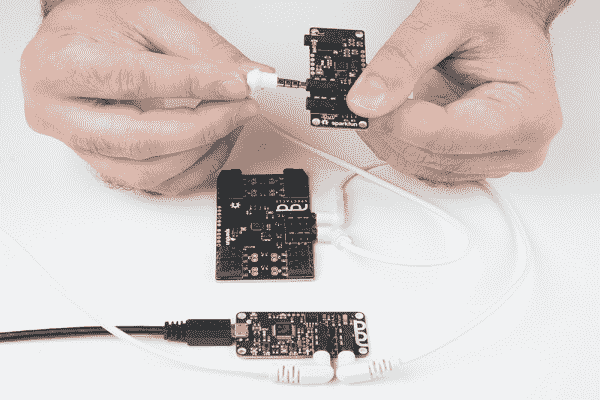](https://cdn.sparkfun.com/assets/learn_tutorials/6/2/1/Spectacle-32.jpg)

现在将扬声器插入音频板上的“音频输出”插孔。

[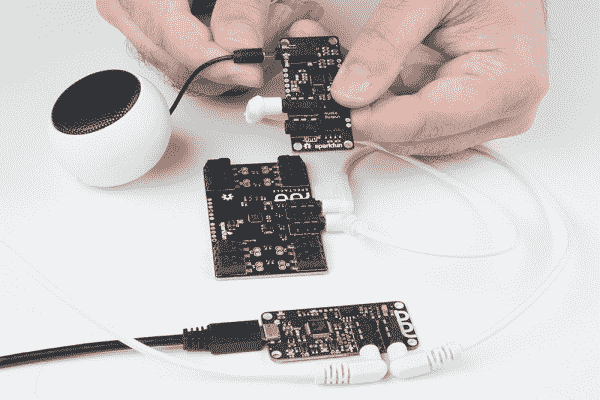](https://cdn.sparkfun.com/assets/learn_tutorials/6/2/1/Spectacle-33.jpg)

将微型 SD 卡插入声卡。

[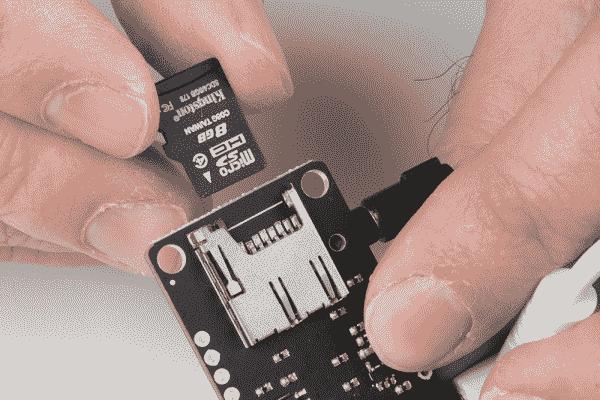](https://cdn.sparkfun.com/assets/learn_tutorials/6/2/1/Spectacle-34.jpg)

将另一根 TRRS 电缆插入音频板上的“Out”插孔。

将电缆的另一端插入灯板上的“In”插孔。

将灯条适配器电缆连接到灯板上。

将适配器电缆的另一端连接到灯条上。

[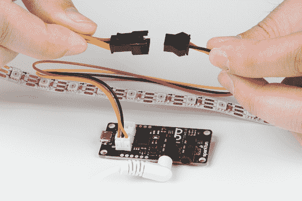](https://cdn.sparkfun.com/assets/learn_tutorials/6/2/1/Spectacle-38.jpg)

最后，将 USB 电缆的微型 B 端插入控制器板，另一端插入电源适配器。将电源适配器插入墙壁。您应该在灯板、音频板和按钮板上看到一个稳定灯和一个闪烁灯。在指示板上，您会看到一个稳定的指示灯和一个闪烁一次，然后暂停，然后重复的指示灯。这表明电源已接通，板已启动并正在运行。

#### 设置板配置

我们将假设您遵循了上一页关于将声音转换为 OGG Vorbis 格式的说明，并且插入声卡的 Micro SD 卡上有一个名为“00.ogg”的声音。如果是*而不是*这种情况，花几分钟时间回到那一页，准备一段录音。

当你第一次打开眼镜应用程序网页，这是你会看到的。你的项目名称将不同于我的，因为奇观分配一个随机的名称给每个项目。

要继续，我们必须告诉项目我们希望使用哪些板。首先点击页面底部的“添加电路板”按钮。

这将显示可用电路板的列表。我们将首先添加我们的按钮板，所以单击“按钮”框中的任意位置来添加它。

现在，再重复这个过程两次，添加一个音频板和一个灯光板。

您现在应该有一个类似这样的列表，显示了我们将在这个项目中使用的所有三种板。**注意列表中板子的顺序！**它们必须与硬件中的板卡顺序相匹配！如果您的电路板顺序与上图不同，您可以使用上下按钮(在电路板名称栏中)来更改电路板的顺序。

[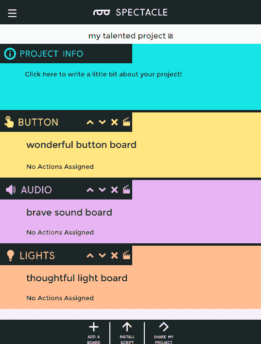](https://cdn.sparkfun.com/assets/learn_tutorials/6/2/1/all_boards.png)

现在你需要在每块板上添加动作，告诉眼镜系统你想要什么样的行为。单击按钮板的隔板图标(上面突出显示),弹出“编辑操作”框。

[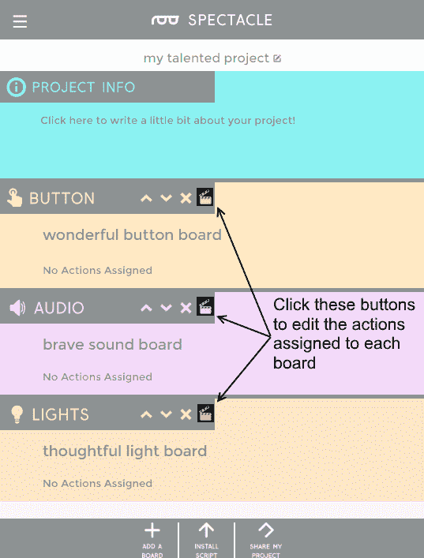](https://cdn.sparkfun.com/assets/learn_tutorials/6/2/1/edit_buttons.png)

这将弹出一个类似上面的窗口。我突出显示了“添加操作”按钮。单击它可以弹出按钮板的操作列表。

[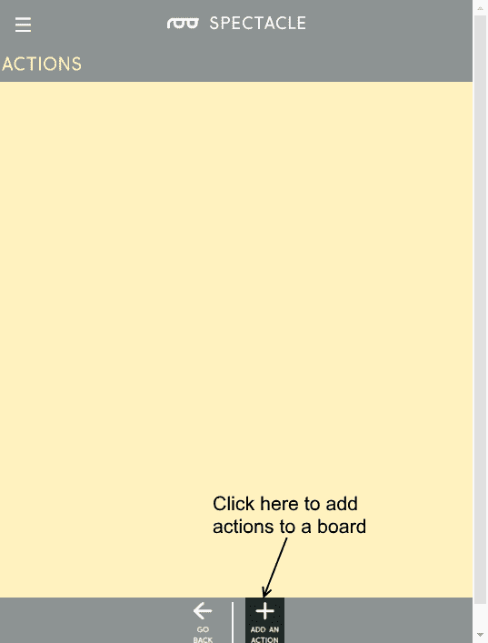](https://cdn.sparkfun.com/assets/learn_tutorials/6/2/1/add_an_action.png)

点击“添加操作”按钮后，该列表将会弹出。我们将添加两个动作:“按下时的动作”和“释放时的动作”。单击“按下时的动作”列表项，然后再次单击“添加动作”将列表拉回来，然后单击“释放时的动作”列表项将该动作添加到列表中。

在这里，您可以看到我们已经为项目添加了两个我们想要的操作。注意，添加时，输入默认为空。为了使设计有效，您需要在每个字段中输入一个值。

[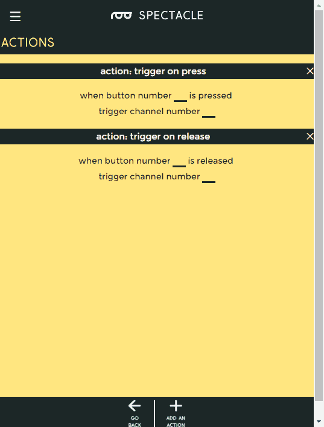](https://cdn.sparkfun.com/assets/learn_tutorials/6/2/1/button_actions.png)

以下是您希望为该项目设置的设置。您可以看到“按下时的动作”与通道 0 相关联，我们使用按钮 8(板载按钮)作为输入信号。“释放时的动作”与通道 1 以及按钮 8 相关联。

[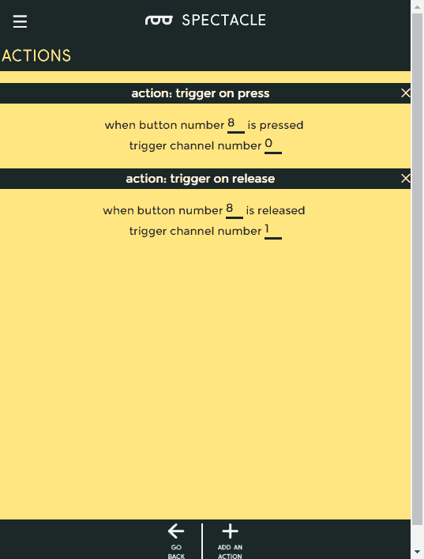](https://cdn.sparkfun.com/assets/learn_tutorials/6/2/1/button_actions_filled_in.png)

填写完两个操作的字段后，单击“返回”按钮返回到您的董事会列表。这将自动保存您所做的更改。

您可以在这里看到，我们为按钮板添加的操作出现在主板列表中，提醒您每个板的配置用途。

[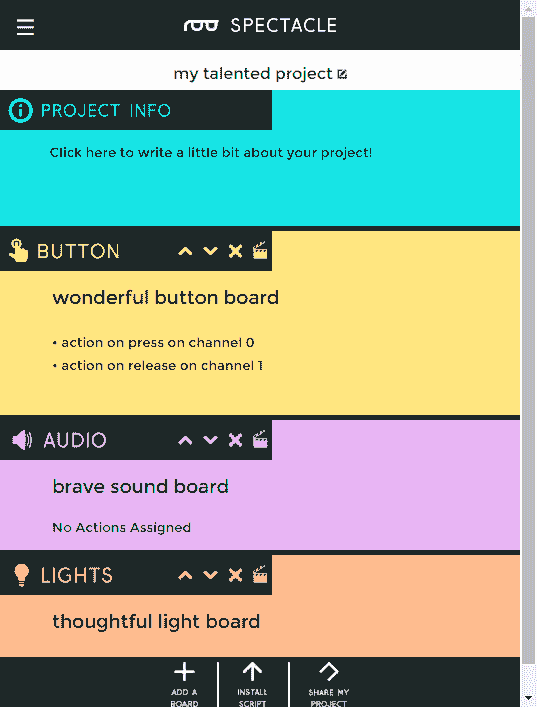](https://cdn.sparkfun.com/assets/learn_tutorials/6/2/1/board_list_button_actions.png)

现在，给音频板添加一个“播放声音”动作。这是音频板支持的唯一操作。如上所示，填写播放声音页面上的空白。

[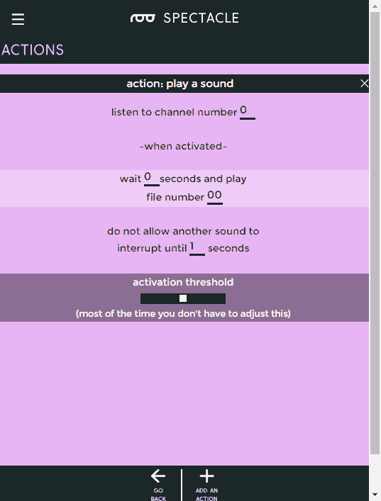](https://cdn.sparkfun.com/assets/learn_tutorials/6/2/1/play_sound_action.png)

回到主框架，您会看到 play sound 动作已经添加到列表中的音频板部分。

[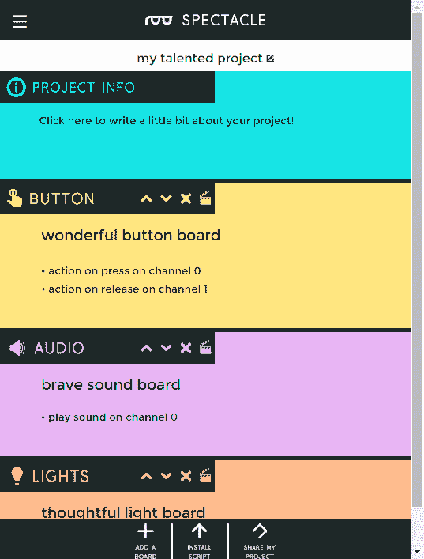](https://cdn.sparkfun.com/assets/learn_tutorials/6/2/1/main_window_play_sound.png)

最后，我们将配置灯光板。上图显示了灯光板支持的所有动作。在我们的项目中，我们将使用两次“填充颜色”选项。

下面是要添加的第一个“填充颜色”效果的设置。当按钮被按下时，这将打开像素。

下面是第二种填充效果的设置。这将在释放按钮时关闭像素。

现在，您可以单击“返回”按钮返回主页。

恭喜你！您已经完成了第一个眼镜项目的配置！现在，我们来看看如何将配置加载到您的主板上。

[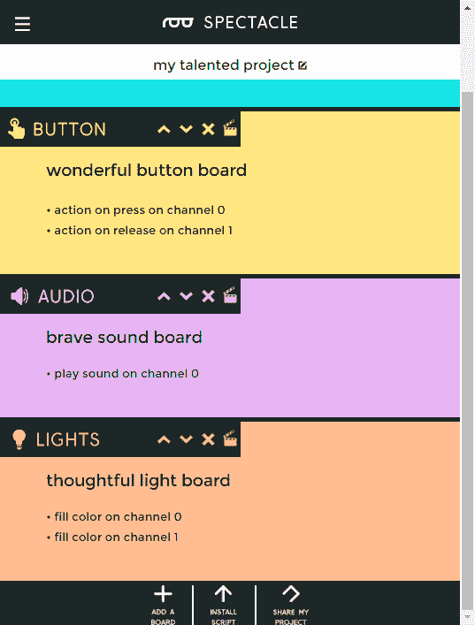](https://cdn.sparkfun.com/assets/learn_tutorials/6/2/1/final_project.png)

#### 上传

现在你已经创建了你的眼镜程序，是时候把它上传到董事会了。如果你按照上面的说明，你的上传设备已经连接到板上，可以开始了，所以你需要做的就是点击页面底部的“安装脚本”按钮。这将打开如下所示的页面。

[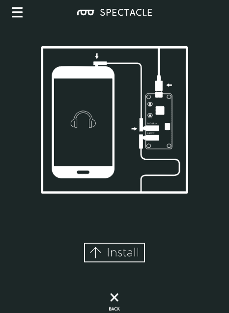](https://cdn.sparkfun.com/assets/learn_tutorials/6/3/2/upload_page.png)

确保设备上的音量已调至最大，并且没有其他音频源(音乐、视频等)在背景中播放。然后按住控制器板上的“RST”按钮，按住“程序”按钮，然后松开“RST”按钮。

这将使主板进入程序模式。你会看到板上的灯闪烁三次，暂停，然后重复。这是电路板处于程序模式的视觉指示器。一旦您确定电路板处于编程模式，您可以通过触摸眼镜应用程序屏幕上的“安装”按钮开始编程。该按钮将在编程过程中变灰，这应该只持续几秒钟。编程完成后，您会看到指示板上的灯闪烁 10 次，暂停，然后重复。这是你的提示，程序上传成功。

再次按下“RST”按钮，重置系统并开始程序！

如果您有任何问题，请访问[故障排除页面](https://learn.sparkfun.com/tutorials/spectacle-users-guide#troubleshooting)以获得解决问题的帮助。

## 资源和更进一步

有关一般眼镜信息，请查看用户指南:

 [### 眼镜用户指南

#### 2017 年 5 月 4 日](https://learn.sparkfun.com/tutorials/spectacle-users-guide) The Spectacle system is designed to help those without electronics or programming experience integrate electronics into projects.[Favorited Favorite](# "Add to favorites") 4

要获得更多奇观乐趣，请查看下面的附加教程:

 [### 眼镜音响套装连接指南](https://learn.sparkfun.com/tutorials/spectacle-sound-kit-hookup-guide) All the information you need to use the Spectacle Sound Kit in one place.[Favorited Favorite](# "Add to favorites") 1 [### 眼镜用户指南](https://learn.sparkfun.com/tutorials/spectacle-users-guide) The Spectacle system is designed to help those without electronics or programming experience integrate electronics into projects.[Favorited Favorite](# "Add to favorites") 4 [### 眼镜音频板连接指南](https://learn.sparkfun.com/tutorials/spectacle-audio-board-hookup-guide) All the information you need to use the Spectacle Audio Board in one place.[Favorited Favorite](# "Add to favorites") 2 [### 眼镜灯套件连接指南](https://learn.sparkfun.com/tutorials/spectacle-light-kit-hookup-guide) All the information you need to use the Spectacle Light Kit in one place.[Favorited Favorite](# "Add to favorites") 2 [### 眼镜灯板连接导轨](https://learn.sparkfun.com/tutorials/spectacle-light-board-hookup-guide) All the information you need to use the Spectacle Light Board in one place.[Favorited Favorite](# "Add to favorites") 2 [### 眼镜运动套件连接指南](https://learn.sparkfun.com/tutorials/spectacle-motion-kit-hookup-guide) All the information you need to use the Spectacle Motion Kit in one place.[Favorited Favorite](# "Add to favorites") 2 [### 眼镜运动板连接指南](https://learn.sparkfun.com/tutorials/spectacle-motion-board-hookup-guide) All the information you need to use the Spectacle Motion Kit in one place.[Favorited Favorite](# "Add to favorites") 2 [### 奇观例子:超级马里奥兄弟西洋镜](https://learn.sparkfun.com/tutorials/spectacle-example-super-mario-bros-diorama) A study in building an animated diorama (with sound!) using Spectacle electronics.[Favorited Favorite](# "Add to favorites") 1

或者查看使用眼镜灯板的博客项目帖子:

 [### 硬件驼峰日:成为毕业典礼上的奇观！

May 10, 2017](https://www.sparkfun.com/news/2380 "May 10, 2017: Stand out at graduation using the Spectacle ecosystem to decorate your cap!")[Favorited Favorite](# "Add to favorites") 0 [### 从 Juicero 到 Juicezero

May 16, 2017](https://www.sparkfun.com/news/2386 "May 16, 2017: The good, the bad and the $700 IoT cold-press juice machine.")[Favorited Favorite](# "Add to favorites") 1 [### 硬件峰日:银翼杀手阳伞

October 4, 2017](https://www.sparkfun.com/news/2401 "October 4, 2017: Adding some cyberpunk dystopia style to a costume shop parasol")[Favorited Favorite](# "Add to favorites") 1