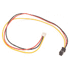
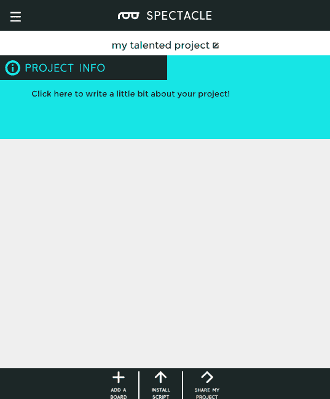
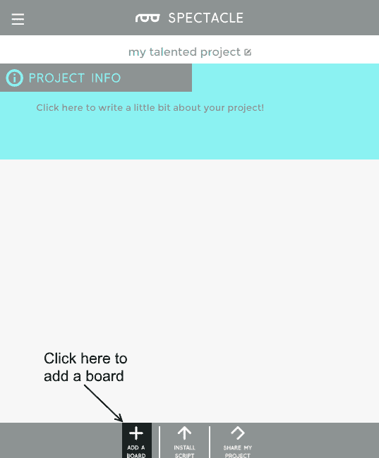
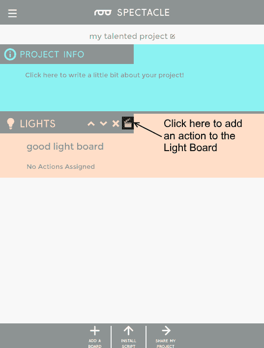
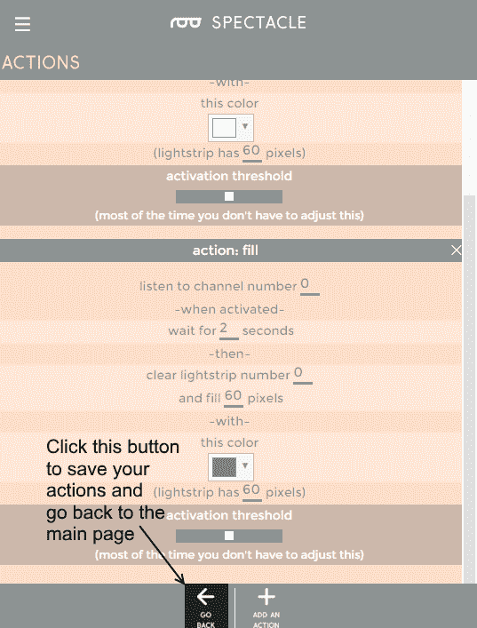
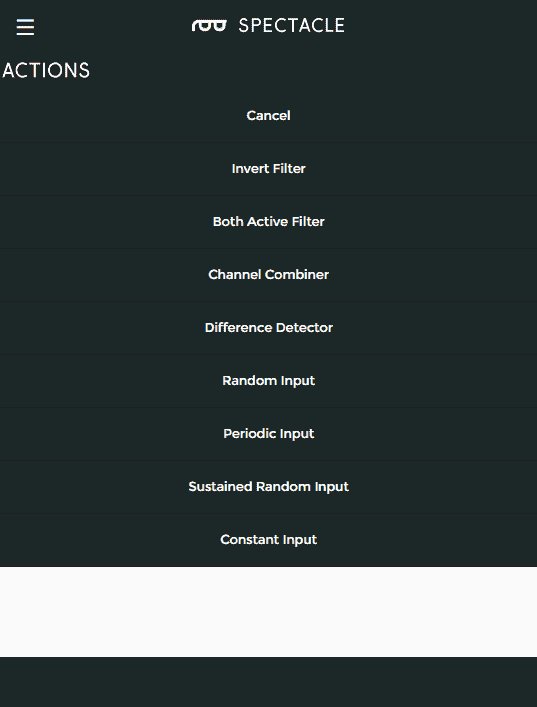

# 眼镜灯板连接导轨

> 原文：<https://learn.sparkfun.com/tutorials/spectacle-light-board-hookup-guide>

## 眼镜灯板

眼镜灯板允许您添加一些相当复杂的照明效果到您的眼镜项目。它可以连接多达三股可寻址 led 和一个外部电源连接器。

 

### [眼镜灯板](https://www.sparkfun.com/products/retired/14052)

[Retired](https://learn.sparkfun.com/static/bubbles/ "Retired") DEV-14052

眼镜灯板允许您添加一些相当复杂的照明效果到您的眼镜项目中，以一种简化的…

**Retired**[Favorited Favorite](# "Add to favorites") 4[Wish List](# "Add to wish list")

### TL；灾难恢复(基本要素)

1.  如果超过大约 10 个像素将同时打开，我们建议通过板载 micro B USB 端口为灯板供电。
2.  对于数量较少的像素，可以通过眼镜控制电缆直接供电。
3.  大多数 LED 效果需要一个连续类型的信号，例如按钮板的“锁定开/锁定关”功能。
4.  只有 WS2812 (NeoPixel)型可寻址 LED 灯条可与眼镜灯板配合使用。

### 见见眼镜灯板

“眼镜灯板”旨在方便您将相对复杂的灯光效果添加到眼镜项目中，它与眼镜生态系统的其余部分相集成，让您可以相对轻松地控制灯光效果。

它有两个用于眼镜控制信号的 1/8 英寸(3.5 毫米)插孔。**注意千斤顶的方向性！**标有“In”的那一个应插入比灯板更靠近控制器板的板，或插入控制器板本身。

灯板支持多达三股[可寻址发光二极管](https://www.sparkfun.com/products/12025)。每条线最多可以有 60 个像素。**并非所有类型的可寻址发光二极管都与眼镜灯板兼容。**如果您对特定类型的 LED 灯条是否与灯板兼容有疑问，请联系 SparkFun 技术支持。

灯板有一个 Micro B USB 连接器，允许它直接由外部电源供电。眼镜数据传输所用的相对较细的音频电缆不足以传输超过几个像素的大量电流。

### 推荐阅读

在继续之前，您应该通读[眼镜用户指南](https://learn.sparkfun.com/tutorials/spectacle-users-guide)。它会给你一些你需要了解的关于奇观如何工作的基础知识，以便你能理解本教程的其余部分。

## 配置实用程序

### 眼镜灯板

灯光板支持 9 种不同的动作。大多数需要连续型信号输入，但也有一些可以用于瞬时输入信号。我们将在每个动作下覆盖差异。每个动作都有一个字段，表示该动作所应用到的 lightstrip 的像素数，这个字段的用法应该很明显，我们不会再提到它。

#### 彩虹效应

彩虹效果会在光带上显示彩虹颜色，逐个更改每个像素的颜色，使其看起来好像彩虹在光带上滚动。

*   **"而通道号...激活"** -彩虹效应仅在通道激活时持续，因此需要连续的输入信号。
*   **“彩虹卷轴光带号……”** -选择您希望彩虹效果在哪个光带上运行。要对多个 lightstrips 产生相同的效果，必须创建多个动作。
*   **滚动速度滑块** -控制图案滚动的速度。

#### 剧场追逐

剧场追逐模式的行为就像一个跑马灯轻边界。灯光将向前行进，使它看起来好像光带在一步一步地移动。

*   **"而通道号...激活"** -剧院追逐效应仅在频道激活时持续，因此需要连续的输入信号。
*   **“剧场追逐光之旅号……”** -选择您希望剧院追逐效果操作的光带。要对多个 lightstrips 产生相同的效果，必须创建多个动作。
*   **追踪速度滑块** -控制图案滚动时的移动速度。
*   **颜色选择器输入** -允许你选择灯光的颜色。

#### 扫描效应

扫描模式看到一小群光沿着光带来回跳动，让人想起《太空堡垒卡拉狄加》中的赛昂人。

*   **"而通道号...激活"** -扫描效果仅在通道激活时持续，因此需要连续的输入信号。
*   **“扫描光带号……”** -选择您希望扫描效果在哪个光带上运行。要对多个 lightstrips 产生相同的效果，必须创建多个动作。
*   **扫描速度滑块** -控制图案滚动时的移动速度。
*   **颜色选择器输入** -允许你选择灯光的颜色。

#### 闪烁效应

使选定条带上的单个灯光执行闪烁动作。

*   **"而通道号...激活"** -闪烁效果仅在通道激活时持续，因此需要连续的输入信号。
*   **“一闪一闪的光带号……”** -选择您希望闪烁效果在哪个灯条上运行。要对多个 lightstrips 产生相同的效果，必须创建多个动作。
*   **颜色选择器输入** -允许你选择灯光的颜色。
*   **速度滑块** -控制闪烁发生的频率。
*   魔法滑块 -控制闪烁的魔法程度。玩吧！

#### 闪电效应

导致整个条带以看起来很像闪电的方式闪烁。

*   **"而通道号...激活"** -闪电效应仅在通道激活时持续，因此需要连续的输入信号。
*   **“light strip 号上的闪电……”** -选择您希望闪电效果在哪个光带上运行。要对多个 lightstrips 产生相同的效果，必须创建多个动作。
*   **颜色选择器输入** -允许你选择灯光的颜色。
*   **速度滑块** -控制雷击发生的频率。
*   愤怒滑块 -控制闪电有多愤怒。玩吧！

#### 火焰效果

导致整个地带像火一样噼啪作响。

*   **"而通道号...激活"** -火焰效果仅在通道激活时持续，因此需要连续的输入信号。
*   **“在光带号上生火……”** -选择你希望火焰效果在哪个光带上运行。要对多个 lightstrips 产生相同的效果，必须创建多个动作。
*   **颜色选择器输入** -允许你选择灯光的颜色。尝试不同的颜色！

#### 褪色效果

随着时间的推移，光带会从一种颜色变成另一种颜色，然后再变回第一种颜色。

*   **"而通道号...处于活动状态"** -只有当频道处于活动状态时，衰减效果才会持续，因此需要连续的输入信号。
*   **“淡化光带号”...back and forward "**-选择您希望淡入淡出效果在哪个灯条上操作。要对多个 lightstrips 产生相同的效果，必须创建多个动作。
*   **“从颜色”颜色选择器** -这是 lightstrip 启动时的初始颜色。
*   **"to color "拾色器** -另一种颜色，色带周期性地淡入淡出。
*   **“渐变速度”滑块** -控制渐变动作发生的速度。

#### 充满

用单一颜色填充灯条上的一些灯光。熄灭其他灯。

*   **“收听频道号……”** -该通道上的瞬时信号是触发填充操作所需的全部，填充将持续到另一个效果开始。
*   **“等待...秒"** -这种延迟考虑到了时序效应。大多数情况下，您可能会将其设置为 0。
*   **“清除光带号……”** -选择要操作的光带。
*   **”又补...像素"** -从离灯板最近的地方向外打开的像素数。

#### 亮像素

打开一盏灯，关闭其余的灯。

*   **“收听频道号……”** -该通道上的瞬时信号是触发亮像素操作所需的全部，亮像素将持续到另一个效果开始。
*   **“等待...秒"** -这种延迟考虑到了时序效应。大多数情况下，您可能会将其设置为 0。
*   **“清除光带号……”** -选择要操作的光带。
*   **"和光线像素数量... "** -像素的数量，从离灯板最近的开始，到打开。

## 示例项目

让我们用眼镜灯板拼凑一个工作项目！我们将使用“虚拟板”来闪烁连接到灯板上的灯条。

#### 连接电路板

要跟随本教程，您需要以下硬件:

 

将**添加到您的[购物车](https://www.sparkfun.com/cart)中！**

### [壁式适配器电源- 5.1V DC 2.5A (USB Micro-B)](https://www.sparkfun.com/products/13831)

[In stock](https://learn.sparkfun.com/static/bubbles/ "in stock") TOL-13831

这是一个高品质的开关“壁式”交流到 DC 5.1V 2500ma USB 微型 B 壁式电源，专为…

$8.9521[Favorited Favorite](# "Add to favorites") 47[Wish List](# "Add to wish list")**** 

将**添加到您的[购物车](https://www.sparkfun.com/cart)中！**

### [眼镜导演板](https://www.sparkfun.com/products/13912)

[In stock](https://learn.sparkfun.com/static/bubbles/ "in stock") DEV-13912

眼镜董事会控制着一个眼镜项目的所有行动。虽然董事会没有做太多的工作…

$24.95 $9.95[Favorited Favorite](# "Add to favorites") 4[Wish List](# "Add to wish list")**** 

### [【LED RGB 条形可寻址，裸露(1m)](https://www.sparkfun.com/products/retired/12025)

[Retired](https://learn.sparkfun.com/static/bubbles/ "Retired") COM-12025

这些是裸露的可寻址 1 米长的 5V RGB LED 灯条，每米装有 60 个 WS2812s。因为这些都是裸露的 LED

7 **Retired**[Favorited Favorite](# "Add to favorites") 13[Wish List](# "Add to wish list") 

### [眼镜灯板](https://www.sparkfun.com/products/retired/14052)

[Retired](https://learn.sparkfun.com/static/bubbles/ "Retired") DEV-14052

眼镜灯板允许您添加一些相当复杂的照明效果到您的眼镜项目中，以一种简化的…

**Retired**[Favorited Favorite](# "Add to favorites") 4[Wish List](# "Add to wish list") 

### [JST 到 JST-SM 线-1ft](https://www.sparkfun.com/products/retired/14165)

[Retired](https://learn.sparkfun.com/static/bubbles/ "Retired") CAB-14165

这种简单的 24AWG 导线的一端与一个 JST 公接头端接，另一端与一个 JST-SM 公接头端接。每根电线…

**Retired**[Favorited Favorite](# "Add to favorites") 2[Wish List](# "Add to wish list")**** ****请注意，你将需要两根 TRRS 电缆！

首先，将 TRRS 电缆的一端插入控制器板上的“直接”插孔。

接下来，将另一根 TRRS 电缆插入主板上的“程序”插孔。

将线缆的另一端插入手机、平板电脑或电脑的音频插孔，以便对系统进行编程。

现在，将第一根电缆的自由端插入灯板上的“In”插孔。注意你插入的插孔，因为这两个插孔是定向的。

接下来，您需要 JST-SM 到 JST-PH 适配器电缆。将白色端插入灯板上的连接器位置 0。

将适配器的黑色端插入灯条上的配套连接器。

最后，将电源适配器的微型 B 端插入控制器板，另一端插入墙壁。您应该在灯板上看到一个稳定的灯和一个闪烁的灯。在指示板上，您会看到一个稳定的指示灯和一个闪烁一次，然后暂停，然后重复的指示灯。这表明电源已接通，板已启动并正在运行。

#### 设置板配置

当你第一次打开眼镜应用程序网页，这是你会看到的。你的项目名称将不同于我的，因为奇观分配一个随机的名称给每个项目。

要继续，我们必须告诉项目我们希望使用哪些板。首先点击页面底部的“添加电路板”按钮。

这将显示可用电路板的列表。单击“灯”框中的任意位置，将灯板添加到系统中。

现在你已经添加了灯光板，是时候把动作添加到灯光板上了。为了获得闪烁效果，我们将在一个信号上触发两个事件，并使其中一个稍微延迟。单击上图中突出显示的隔板图标，调出分配给该板的操作列表。

自然，列表中没有动作，因为我们还没有添加任何动作。单击屏幕底部的“添加操作”按钮，调出可用操作列表。

这是当你点击“添加动作”按钮时会弹出的灯板动作列表。我们想添加一个“填充颜色”类型的动作，所以单击那个条目。

这是“填充颜色”动作选项列表。有关各个字段的信息，参见教程的前一页。

如上图所示，填写页面空白处。这将设置当事件到达通道 0 时，条带变为纯白。现在，添加另一个“填充颜色”类型的动作并向下滚动，这样它就完全可见了。

一旦你添加了第二个“填充颜色”动作，如上所示设置字段。这将导致它触发与第一次填充相同的动作，但它不会在两秒钟内激活。然后，它会将长条上的所有灯设置为“黑色”(关闭)。

单击“返回”按钮返回主屏幕。单击此按钮也会自动保存您的工作。

现在，重复上面的步骤来添加虚拟板。单击隔板图标编辑虚拟板的操作列表。

Virtual Boards provide a number of functions outside of the normal operation of Spectacle boards. In this case, we want "Periodic Input", which generates a signal at a fixed timing rate.

以下是我们可以在虚拟板上使用的操作。我们想要一个“周期性输入”，来创造我们的眨眼动作。

您应该设置定期操作来匹配上面的设置。这将每 10 秒产生一个短脉冲。现在再次点击“返回”返回主页。

恭喜你！您已经完成了流程的配置步骤。现在是时候把这个项目放到你的董事会上了。

#### 上传

现在你已经创建了你的眼镜程序，是时候把它上传到董事会了。如果你按照上面的说明，你的上传设备已经连接到板上，可以开始了，所以你需要做的就是点击页面底部的“安装脚本”按钮。这将打开如下所示的页面。

确保设备上的音量已调至最大，并且没有其他音频源(音乐、视频等)在背景中播放。然后按住控制器板上的“RST”按钮，按住“程序”按钮，然后松开“RST”按钮。

这将使主板进入程序模式。你会看到板上的灯闪烁三次，暂停，然后重复。这是电路板处于程序模式的视觉指示器。一旦您确定电路板处于编程模式，您可以通过触摸眼镜应用程序屏幕上的“安装”按钮开始编程。该按钮将在编程过程中变灰，这应该只持续几秒钟。编程完成后，您会看到指示板上的灯闪烁 10 次，暂停，然后重复。这是你的提示，程序上传成功。

再次按下“RST”按钮，重置系统并开始程序！

如果您有任何问题，请访问[故障排除页面](https://learn.sparkfun.com/tutorials/spectacle-users-guide#troubleshooting)以获得解决问题的帮助。

## 资源和更进一步

有关一般眼镜信息，请查看用户指南:

 [### 眼镜用户指南

#### 2017 年 5 月 4 日](https://learn.sparkfun.com/tutorials/spectacle-users-guide) The Spectacle system is designed to help those without electronics or programming experience integrate electronics into projects.[Favorited Favorite](# "Add to favorites") 4

要获得更多奇观乐趣，请查看下面的附加教程:

 [### 眼镜音响套装连接指南](https://learn.sparkfun.com/tutorials/spectacle-sound-kit-hookup-guide) All the information you need to use the Spectacle Sound Kit in one place.[Favorited Favorite](# "Add to favorites") 1 [### 眼镜用户指南](https://learn.sparkfun.com/tutorials/spectacle-users-guide) The Spectacle system is designed to help those without electronics or programming experience integrate electronics into projects.[Favorited Favorite](# "Add to favorites") 4 [### 眼镜音频板连接指南](https://learn.sparkfun.com/tutorials/spectacle-audio-board-hookup-guide) All the information you need to use the Spectacle Audio Board in one place.[Favorited Favorite](# "Add to favorites") 2 [### 眼镜灯套件连接指南](https://learn.sparkfun.com/tutorials/spectacle-light-kit-hookup-guide) All the information you need to use the Spectacle Light Kit in one place.[Favorited Favorite](# "Add to favorites") 2 [### 眼镜按钮板连接导轨](https://learn.sparkfun.com/tutorials/spectacle-button-board-hookup-guide) All the information you need to use the Spectacle Button Board in one place.[Favorited Favorite](# "Add to favorites") 2 [### 眼镜运动板连接指南](https://learn.sparkfun.com/tutorials/spectacle-motion-board-hookup-guide) All the information you need to use the Spectacle Motion Kit in one place.[Favorited Favorite](# "Add to favorites") 2 [### 眼镜惯性板连接导轨](https://learn.sparkfun.com/tutorials/spectacle-inertia-board-hookup-guide) Everything you need to know about using the Spectacle Inertia Board in one place.[Favorited Favorite](# "Add to favorites") 2 [### 奇观例子:超级马里奥兄弟西洋镜](https://learn.sparkfun.com/tutorials/spectacle-example-super-mario-bros-diorama) A study in building an animated diorama (with sound!) using Spectacle electronics.[Favorited Favorite](# "Add to favorites") 1

或者查看使用眼镜灯板的博客项目帖子:

 [### 硬件驼峰日:成为毕业典礼上的奇观！

May 10, 2017](https://www.sparkfun.com/news/2380 "May 10, 2017: Stand out at graduation using the Spectacle ecosystem to decorate your cap!")[Favorited Favorite](# "Add to favorites") 0 [### 周日:从 Juicero 到 Juicezero

May 16, 2017](https://www.sparkfun.com/news/2386 "May 16, 2017: The good, the bad and the $700 IoT cold-press juice machine.")[Favorited Favorite](# "Add to favorites") 1 [### 硬件驼峰日:银翼杀手阳伞

October 4, 2017](https://www.sparkfun.com/news/2401 "October 4, 2017: Adding some cyberpunk dystopia style to a costume shop parasol")[Favorited Favorite](# "Add to favorites") 1****