# 眼镜灯套件连接指南

> 原文：<https://learn.sparkfun.com/tutorials/spectacle-light-kit-hookup-guide>

## 介绍

只需按一下按钮，[眼镜灯套件](https://www.sparkfun.com/products/14489)就能轻松照亮您的下一个项目！

 

### [眼镜灯套件](https://www.sparkfun.com/products/retired/14489)

[Retired](https://learn.sparkfun.com/static/bubbles/ "Retired") KIT-14489

只需按一下按钮，眼镜灯套件就能轻松照亮您的下一个项目！灯套件提供了一个简单的…

2 **Retired**[Favorited Favorite](# "Add to favorites") 0[Wish List](# "Add to wish list")

### 推荐阅读

在继续之前，您应该通读[眼镜用户指南](https://learn.sparkfun.com/tutorials/spectacle-users-guide)。它会给你一些你需要了解的关于奇观如何工作的基础知识，以便你能理解本教程的其余部分。

## 眼镜灯板

眼镜灯板允许您添加一些相当复杂的照明效果到您的眼镜项目。它可以连接多达三股可寻址 led 和一个外部电源连接器。

 

### [眼镜灯板](https://www.sparkfun.com/products/retired/14052)

[Retired](https://learn.sparkfun.com/static/bubbles/ "Retired") DEV-14052

眼镜灯板允许您添加一些相当复杂的照明效果到您的眼镜项目中，以一种简化的…

**Retired**[Favorited Favorite](# "Add to favorites") 4[Wish List](# "Add to wish list")

### TL；灾难恢复(基本要素)

1.  如果超过大约 10 个像素将同时打开，我们建议通过板载 micro B USB 端口为灯板供电。
2.  对于数量较少的像素，可以通过眼镜控制电缆直接供电。
3.  大多数 LED 效果需要一个连续类型的信号，例如按钮板的“锁定开/锁定关”功能。
4.  只有 WS2812 (NeoPixel)型可寻址 LED 灯条可与眼镜灯板配合使用。

### 见见眼镜灯板

“眼镜灯板”旨在方便您将相对复杂的灯光效果添加到眼镜项目中，它与眼镜生态系统的其余部分相集成，让您可以相对轻松地控制灯光效果。

它有两个用于眼镜控制信号的 1/8 英寸(3.5 毫米)插孔。**注意千斤顶的方向性！**标有“In”的那一个应插入比灯板更靠近控制器板的板，或插入控制器板本身。

灯板支持多达三股[可寻址发光二极管](https://www.sparkfun.com/products/12025)。每条线最多可以有 60 个像素。**并非所有类型的可寻址发光二极管都与眼镜灯板兼容。**如果您对特定类型的 LED 灯条是否与灯板兼容有疑问，请联系 SparkFun 技术支持。

[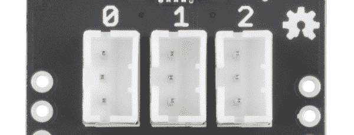](https://cdn.sparkfun.com/assets/learn_tutorials/6/2/9/light_connectors.png)

灯板有一个 Micro B USB 连接器，允许它直接由外部电源供电。眼镜数据传输的相对较细的电缆不足以传输超过几个像素的大量电流。

[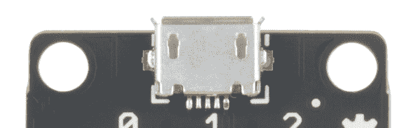](https://cdn.sparkfun.com/assets/learn_tutorials/6/2/9/light_usb_jack.png)

## 眼镜按钮板

眼镜按钮板允许您将按钮或开关输入添加到您的眼镜项目中。它共有 9 个信号输入，其中 8 个可以来自外部按钮，1 个直接在板上。

 

### [眼镜按钮板](https://www.sparkfun.com/products/retired/14044)

[Retired](https://learn.sparkfun.com/static/bubbles/ "Retired") DEV-14044

眼镜按钮板允许您将来自按钮、开关或其他接触式传感设备的输入添加到您的眼镜上

1 **Retired**[Favorited Favorite](# "Add to favorites") 5[Wish List](# "Add to wish list")

### TL；博士；医生

1.  按钮或开关可以通过将电线插入电路板上的“戳 home”型连接器来连接到电路板上。
2.  多达九个信号可用。
3.  按钮信号可以是瞬时的，也可以是连续的。

### 遇见眼镜按钮板

眼镜按钮板旨在将简单的信号从世界带入您的眼镜项目，为您的任何眼镜项目提供输入。

它有两个 1/8 英寸(3.5 毫米)插孔，用于连接眼镜系统中的其他电路板。请注意，眼镜数据插孔是定向的:标有“In”的插孔应插入“上游”板(即比这个更靠近控制器板)，标有“Out”的插孔连接到下一个下游板。

按钮板上有 8 个“戳 home”连接器。每个都可以连接到一个(或多个)按钮。要添加连接，只需将电线的剥皮端推入连接器上的孔中。连接器会自动抓住电线并将其固定到位。如果您需要稍后移除电线，请使用小物件(发夹、圆珠笔等)。)可用于按下释放按钮，使电线无损坏地抽出。

按钮板上有一个输入按钮，如果没有其他按钮可用，它可以用来提供输入信号。它的功能就像任何其他可能附加的普通按钮一样。确保你按的是标有“8”的按钮，而不是标有“重置”的按钮！按下重置按钮将重置您的按钮板，可能会导致您的整个系统停止正常工作，直到您重置您的控制器板！

## 配置实用程序

### 眼镜按钮板

对于按钮板，有五个选项:三个产生瞬时脉冲型输出，两个产生连续开关型输出。

##### 对印刷机的操作

[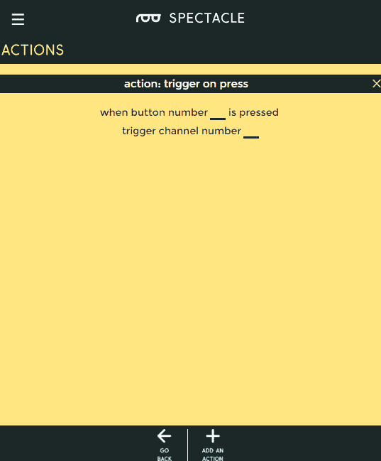](https://cdn.sparkfun.com/assets/learn_tutorials/6/1/8/action_on_press_1.png)

当按钮第一次被按下时触发一个动作，不管它随后被按住多长时间。

*   **"当按钮数...按下了“**”-这是我们希望分配给此操作的按钮编号。按钮号码印在板上，从 0 到 8。
*   **“触发通道号……”** -单个瞬时脉冲将在该通道上发出。例如，它适用于启动声音、启动动作或设置光带的颜色，但不适用于连续声音播放或打开光带效果。

##### 释放时的操作

当按钮被释放时触发一个动作，不管它在被释放之前被按住了多长时间。

*   **"当按钮数...已释放"** -这是我们希望分配给此操作的按钮编号。按钮号码印在板上，从 0 到 8。
*   **“触发通道号……”** -单个瞬时脉冲将在该通道上发出。例如，它适用于启动声音、启动动作或设置光带的颜色，但不适用于连续声音播放或打开光带效果。

##### 按下或释放时的动作

当按钮被按下时触发一个动作，然后当按钮被释放时再次触发相同的动作。

*   **"当按钮数...按下或释放"** -这是我们希望分配给此操作的按钮编号。按钮号码印在板上，从 0 到 8。
*   **“触发通道号……”** -按下按钮和松开按钮时，将在该通道上发出一个单一的瞬时脉冲。例如，它适用于启动声音、启动动作或设置光带的颜色，但不适用于连续声音播放或打开光带效果。

##### 保持动作

一按下按钮就触发一个事件，然后只要按钮被按住就继续触发该事件。

*   **"While 按钮编号...按下了“**”-这是我们希望分配给此操作的按钮编号。按钮号码印在板上，从 0 到 8。
*   **“激活频道号……”** -该频道将连续发送。它适用于触发和重复声音，或打开和保持(至少在按住按钮时)灯光效果。

##### 闩锁开启/闩锁关闭

这个动作就像一个锁定的电源开关。一次按下打开信号，另一次按下关闭信号。

*   **"While 按钮编号...按下了“**”-这是我们希望分配给此操作的按钮编号。按钮号码印在板上，从 0 到 8。
*   **"激活通道号...直到再次按下按钮“**”-该频道将发出连续信号。它适用于触发和重复声音，或打开和保持灯光效果。

### 眼镜灯板

灯光板支持 9 种不同的动作。大多数需要连续型信号输入，但也有一些可以用于瞬时输入信号。我们将在每个动作下覆盖差异。每个动作都有一个字段，表示该动作所应用到的 lightstrip 的像素数，我们不会再提到它。

##### 彩虹效应

[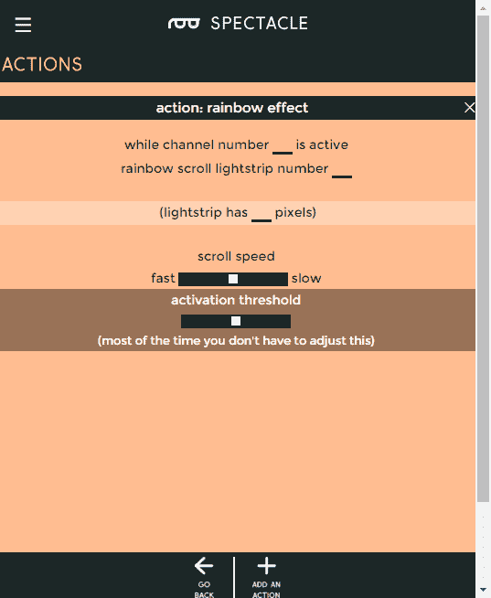](https://cdn.sparkfun.com/assets/learn_tutorials/6/2/1/rainbow_effect.png)

彩虹效果会在光带上显示彩虹颜色，逐个更改每个像素的颜色，使其看起来好像彩虹在光带上滚动。

*   **"而通道号...激活"** -彩虹效应仅在通道激活时持续，因此需要连续的输入信号。
*   **“彩虹卷轴光带号……”** -选择您希望彩虹效果在哪个光带上运行。要对多个 lightstrips 产生相同的效果，必须创建多个动作。
*   **滚动速度滑块** -控制图案滚动的速度。

##### 剧场追逐

[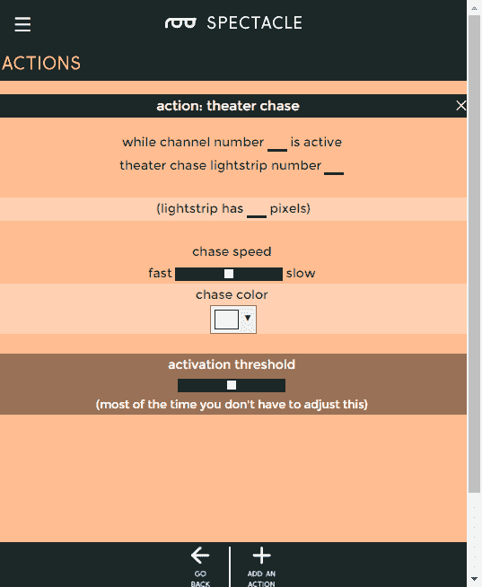](https://cdn.sparkfun.com/assets/learn_tutorials/6/2/1/theater_chase.png)

剧场追逐模式的行为就像一个跑马灯轻边界。灯光将向前行进，使它看起来好像光带在一步一步地移动。

*   **"而通道号...激活"** -剧院追逐效应仅在频道激活时持续，因此需要连续的输入信号。
*   **“剧场追逐光之旅号……”** -选择您希望剧院追逐效果操作的光带。要对多个 lightstrips 产生相同的效果，必须创建多个动作。
*   **追踪速度滑块** -控制图案滚动时的移动速度。
*   **颜色选择器输入** -允许你选择灯光的颜色。

##### 扫描效应

[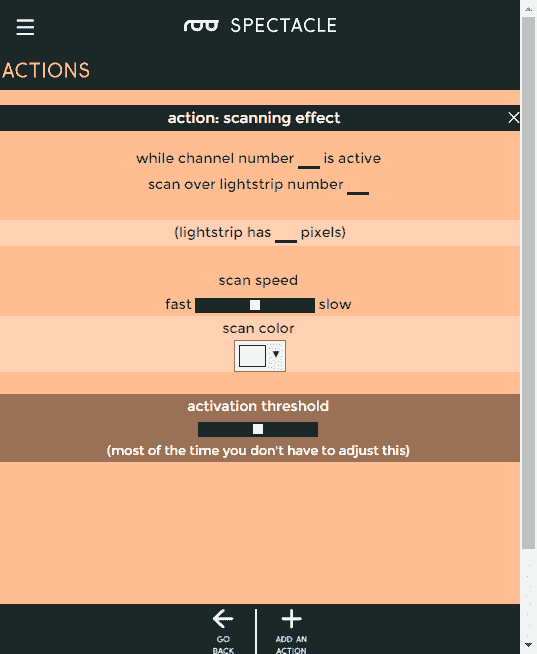](https://cdn.sparkfun.com/assets/learn_tutorials/6/2/1/scanning_effect.png)

扫描模式看到一小群光沿着光带来回跳动，让人想起《太空堡垒卡拉狄加》中的赛昂人。

*   **"而通道号...激活"** -扫描效果仅在通道激活时持续，因此需要连续的输入信号。
*   **“扫描光带号……”** -选择您希望扫描效果在哪个光带上运行。要对多个 lightstrips 产生相同的效果，必须创建多个动作。
*   **扫描速度滑块** -控制图案滚动时的移动速度。
*   **颜色选择器输入** -允许你选择灯光的颜色。

##### 闪烁效应

使选定条带上的单个灯光执行闪烁动作。

*   **"而通道号...激活"** -闪烁效果仅在通道激活时持续，因此需要连续的输入信号。
*   **“一闪一闪的光带号……”** -选择您希望闪烁效果在哪个灯条上运行。要对多个 lightstrips 产生相同的效果，必须创建多个动作。
*   **颜色选择器输入** -允许你选择灯光的颜色。
*   **速度滑块** -控制闪烁滚动的速度。
*   魔法滑块 -控制闪烁的魔法程度。玩吧！

##### 闪电效应

[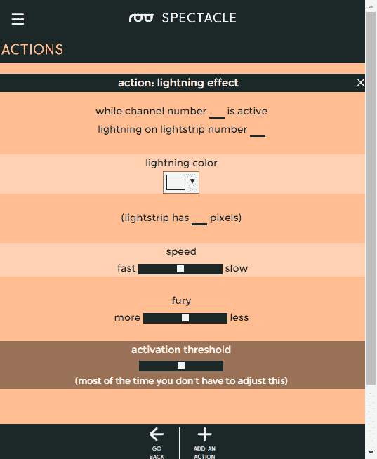](https://cdn.sparkfun.com/assets/learn_tutorials/6/2/1/lightning_effect.png)

导致整个条带以看起来很像闪电的方式闪烁。

*   **"而通道号...激活"** -闪电效应仅在通道激活时持续，因此需要连续的输入信号。
*   **“light strip 号上的闪电……”** -选择您希望闪电效果在哪个光带上运行。要对多个 lightstrips 产生相同的效果，必须创建多个动作。
*   **颜色选择器输入** -允许你选择灯光的颜色。
*   **速度滑块** -控制闪电划过时移动的频率。
*   愤怒滑块 -控制闪电有多愤怒。玩吧！

##### 火焰效果

[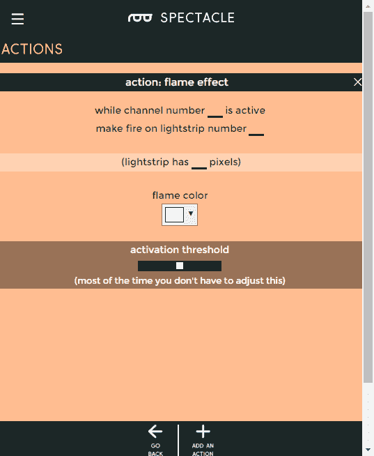](https://cdn.sparkfun.com/assets/learn_tutorials/6/2/1/flame_effect.png)

导致整个地带像火一样噼啪作响。

*   **"而通道号...激活"** -火焰效果仅在通道激活时持续，因此需要连续的输入信号。
*   **“在光带号上生火……”** -选择你希望火焰效果在哪个光带上运行。要对多个 lightstrips 产生相同的效果，必须创建多个动作。
*   **颜色选择器输入** -允许你选择灯光的颜色。尝试不同的颜色！

##### 褪色效果

[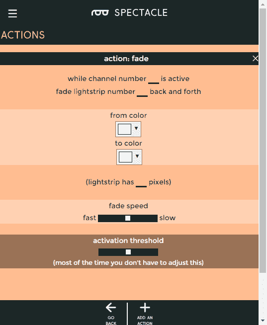](https://cdn.sparkfun.com/assets/learn_tutorials/6/2/1/fade_effect.png)

随着时间的推移，光带会从一种颜色变成另一种颜色，然后再变回第一种颜色。

*   **"而通道号...处于活动状态"** -只有当频道处于活动状态时，衰减效果才会持续，因此需要连续的输入信号。
*   **“淡入淡出光带号...back and forward "**-选择您希望淡入淡出效果在哪个灯条上操作。要对多个 lightstrips 产生相同的效果，必须创建多个动作。
*   **“从颜色”颜色选择器** -这是 lightstrip 启动时的初始颜色。
*   **"to color "拾色器** -另一种颜色，色带周期性地淡入淡出。
*   **“渐变速度”滑块** -控制渐变动作发生的速度。

##### 充满

[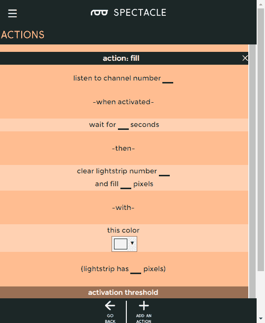](https://cdn.sparkfun.com/assets/learn_tutorials/6/2/1/fill.png)

用单一颜色填充灯条上的一些灯光。熄灭其他灯。

*   **“收听频道号……”** -该通道上的瞬时信号是触发填充操作所需的全部，填充将持续到另一个效果开始。
*   **“等待...秒"** -这种延迟考虑到了时序效应。大多数情况下，您可能会将其设置为 0。
*   **“清除光带号……”** -选择要操作的光带。
*   **”又补...像素"** -从离灯板最近的地方向外打开的像素数。

##### 亮像素

打开一盏灯，关闭其余的灯。

*   **“收听频道号……”** -该通道上的瞬时信号是触发亮像素操作所需的全部，亮像素将持续到另一个效果开始。
*   **“等待...秒"** -这种延迟考虑到了时序效应。大多数情况下，您可能会将其设置为 0。
*   **“清除光带号……”** -选择要操作的光带。
*   **"和光线像素数量... "** -像素的数量，从离灯板最近的开始，到打开。

## 示例项目

让我们使用眼镜灯套件的内容来拼凑一个工作项目！我们将使用按钮板来控制灯板的“扫描效果”动作。

#### 连接电路板

从连接电路板开始。你需要的所有硬件都随工具包一起提供。

首先，将 TRRS 电缆的一端插入控制器板上的“直接”插孔。

接下来，将另一根 TRRS 电缆插入主板上的“程序”插孔。

[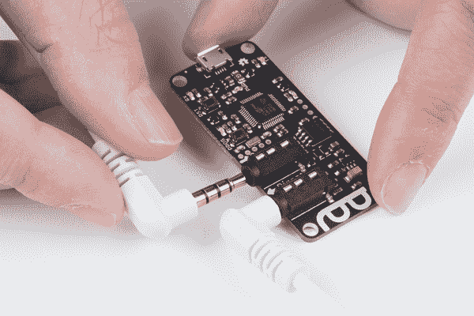](https://cdn.sparkfun.com/assets/learn_tutorials/6/2/9/director_program_jack.jpg)

将线缆的另一端插入手机、平板电脑或电脑的音频插孔，以便对系统进行编程。

然后将第一根 TRRS 电缆的另一端插入按钮板上的“In”插孔。

[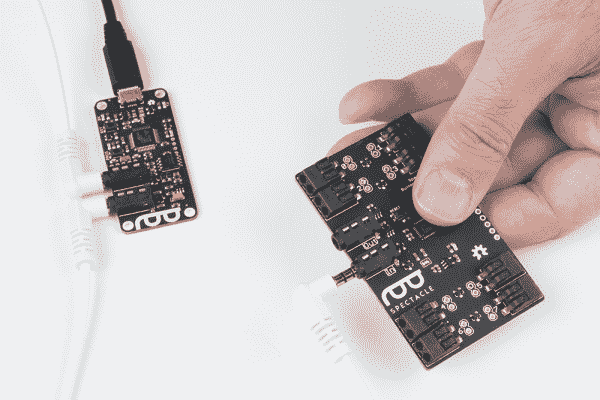](https://cdn.sparkfun.com/assets/learn_tutorials/6/2/5/Spectacle-17.jpg)

抓住另一根 TRRS 电缆，将其插入按钮板上的“Out”插孔。

[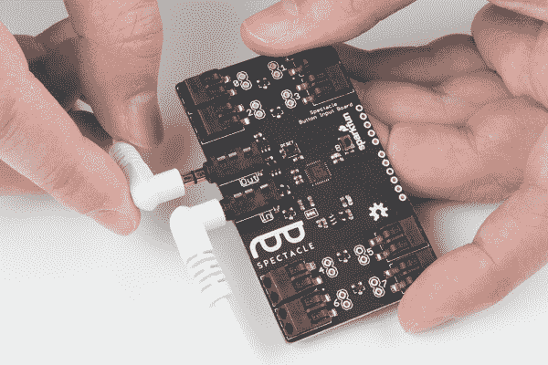](https://cdn.sparkfun.com/assets/learn_tutorials/6/2/5/Spectacle-18.jpg)

将电缆的另一端插入灯板上的“In”插孔。

[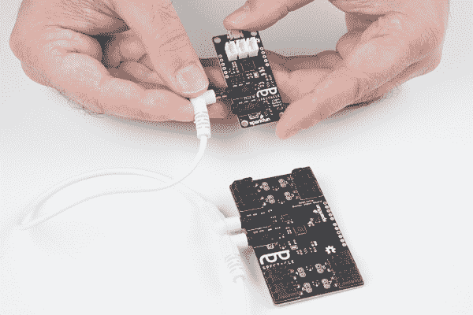](https://cdn.sparkfun.com/assets/learn_tutorials/6/2/5/Spectacle-19.jpg)

现在将您的 lightstrip 适配器电缆插入灯板...

...并将 lightstrip 插入适配器的另一端。

最后，将电源适配器的微型 B 端插入控制器板，另一端插入墙壁。您应该在灯板和按钮板上看到一个稳定灯和一个闪烁灯。在指示板上，您会看到一个稳定指示灯和一个闪烁八次，然后暂停，然后重复的指示灯。这表明电源已接通，板已启动并正在运行。

#### 设置板配置

当你第一次打开眼镜应用程序网页，这是你会看到的。你的项目名称将不同于我的，因为奇观分配一个随机的名称给每个项目。

要继续，我们必须告诉项目我们希望使用哪些板。首先点击页面底部的“添加电路板”按钮。

这将显示可用电路板的列表。我们将首先添加我们的按钮板，所以单击“按钮”框中的任意位置来添加它。

现在，再重复一次这个过程来添加一个灯光板。

您现在应该有一个如下所示的列表。**顺序很重要，**所以要确保你的板子的顺序和上面显示的一样。名字*并不重要，但是，你的董事会将会有不同的名字，因为奇观随机分配名字。*

每个板都有一个与之关联的隔板图标。要添加或编辑操作，请单击此图标。我们将从向按钮板添加一个动作开始。

弹出的窗口会像上面这样。单击下图中突出显示的按钮，将操作添加到按钮板上。

这个列表会出现。它代表了按钮板可以执行的所有不同的动作。

点击列表条目“闩上/闩下”。

然后，您将看到这个屏幕，其中显示了闩锁打开/闩锁关闭操作的各种选项。每个动作都会有不同的设置。

[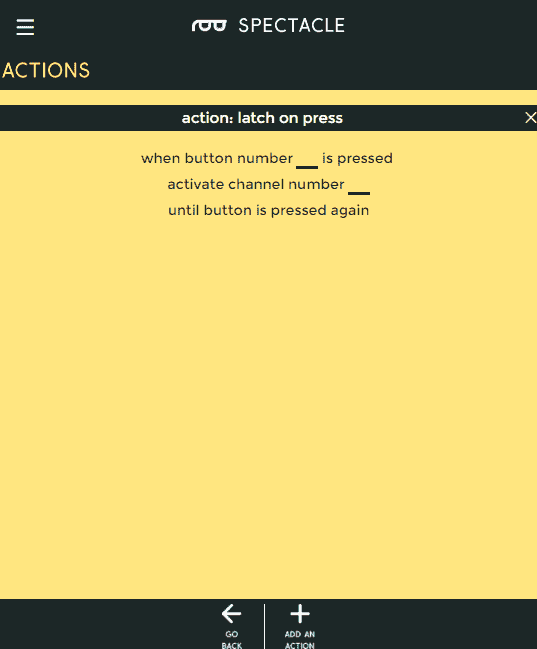](https://cdn.sparkfun.com/assets/learn_tutorials/6/2/4/latch_on_off_1.png)

以下是我们在这个项目中需要使用的设置。我们希望按钮 8(按钮板上的按钮)在按下时激活通道 0。稍后，我们将告诉我们的灯光板观看频道 0，并在它激活时做一些事情。

[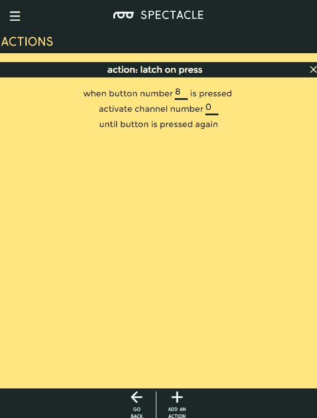](https://cdn.sparkfun.com/assets/learn_tutorials/6/2/4/latching_settings.png)

现在点击“返回”按钮返回主页。您的操作更改将自动保存。

现在，我们回到了主页，您可以看到我们添加的操作出现在 boards 列表中的 Button Board 下。

[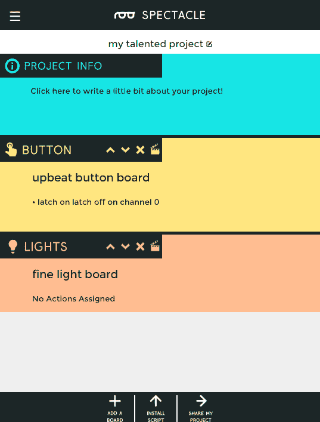](https://cdn.sparkfun.com/assets/learn_tutorials/6/2/4/both_boards_with_action.png)

现在单击灯板的隔板图标，为按钮添加一个要触发的动作。当你点击“添加一个动作”按钮时，你会看到这个灯板可以执行的动作列表。我们将选择“扫描效果”动作。

这个屏幕将会弹出，尽管字段中没有任何条目。继续设置我上面展示的字段，然后单击“返回”按钮。

恭喜你！您已经完成了流程的配置步骤。现在是时候把这个项目放到你的董事会上了。

#### 上传

现在你已经创建了你的眼镜程序，是时候把它上传到董事会了。如果你按照上面的说明，你的上传设备已经连接到板上，可以开始了，所以你需要做的就是点击页面底部的“安装脚本”按钮。这将打开如下所示的页面。

确保设备上的音量已调至最大，并且没有其他音频源(音乐、视频等)在背景中播放。然后按住控制器板上的“RST”按钮，按住“程序”按钮，然后松开“RST”按钮。

这将使主板进入程序模式。你会看到板上的灯闪烁三次，暂停，然后重复。这是电路板处于程序模式的视觉指示器。一旦您确定电路板处于编程模式，您可以通过触摸眼镜应用程序屏幕上的“安装”按钮开始编程。该按钮将在编程过程中变灰，这应该只持续几秒钟。编程完成后，您会看到指示板上的灯闪烁 10 次，暂停，然后重复。这是你的提示，程序上传成功。

再次按下“RST”按钮，重置系统并开始程序！

如果您有任何问题，请访问[故障排除页面](https://learn.sparkfun.com/tutorials/spectacle-users-guide#troubleshooting)以获得解决问题的帮助。

## 资源和更进一步

有关一般眼镜信息，请查看用户指南:

 [### 眼镜用户指南

#### 2017 年 5 月 4 日](https://learn.sparkfun.com/tutorials/spectacle-users-guide) The Spectacle system is designed to help those without electronics or programming experience integrate electronics into projects.[Favorited Favorite](# "Add to favorites") 4

要获得更多奇观乐趣，请查看下面的附加教程:

 [### 眼镜音响套装连接指南](https://learn.sparkfun.com/tutorials/spectacle-sound-kit-hookup-guide) All the information you need to use the Spectacle Sound Kit in one place.[Favorited Favorite](# "Add to favorites") 1 [### 眼镜灯光和声音套件连接指南](https://learn.sparkfun.com/tutorials/spectacle-light-and-sound-kit-hookup-guide) All the information you need to use the Spectacle Light and Sound Kit in one place.[Favorited Favorite](# "Add to favorites") 2 [### 眼镜按钮板连接导轨](https://learn.sparkfun.com/tutorials/spectacle-button-board-hookup-guide) All the information you need to use the Spectacle Button Board in one place.[Favorited Favorite](# "Add to favorites") 2 [### 眼镜灯板连接导轨](https://learn.sparkfun.com/tutorials/spectacle-light-board-hookup-guide) All the information you need to use the Spectacle Light Board in one place.[Favorited Favorite](# "Add to favorites") 2 [### 眼镜运动套件连接指南](https://learn.sparkfun.com/tutorials/spectacle-motion-kit-hookup-guide) All the information you need to use the Spectacle Motion Kit in one place.[Favorited Favorite](# "Add to favorites") 2 [### 眼镜运动板连接指南](https://learn.sparkfun.com/tutorials/spectacle-motion-board-hookup-guide) All the information you need to use the Spectacle Motion Kit in one place.[Favorited Favorite](# "Add to favorites") 2 [### 眼镜惯性板连接导轨](https://learn.sparkfun.com/tutorials/spectacle-inertia-board-hookup-guide) Everything you need to know about using the Spectacle Inertia Board in one place.[Favorited Favorite](# "Add to favorites") 2 [### 奇观例子:超级马里奥兄弟西洋镜](https://learn.sparkfun.com/tutorials/spectacle-example-super-mario-bros-diorama) A study in building an animated diorama (with sound!) using Spectacle electronics.[Favorited Favorite](# "Add to favorites") 1

或者查看使用眼镜灯板的博客项目帖子:

 [### 硬件驼峰日:成为毕业典礼上的奇观！

May 10, 2017](https://www.sparkfun.com/news/2380 "May 10, 2017: Stand out at graduation using the Spectacle ecosystem to decorate your cap!")[Favorited Favorite](# "Add to favorites") 0 [### 硬件驼峰日:银翼杀手阳伞

October 4, 2017](https://www.sparkfun.com/news/2401 "October 4, 2017: Adding some cyberpunk dystopia style to a costume shop parasol")[Favorited Favorite](# "Add to favorites") 1