# 眼镜运动套件连接指南

> 原文：<https://learn.sparkfun.com/tutorials/spectacle-motion-kit-hookup-guide>

## 介绍

[眼镜运动套件](https://www.sparkfun.com/products/14488)包含了制作按钮控制运动项目所需的所有部件。

[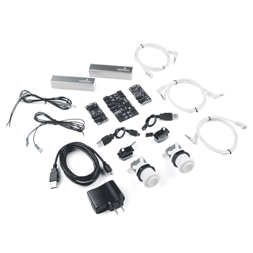](https://www.sparkfun.com/products/retired/14488) 

### [眼镜运动套装](https://www.sparkfun.com/products/retired/14488)

[Retired](https://learn.sparkfun.com/static/bubbles/ "Retired") KIT-14488

眼镜运动套件使您在下一个项目中轻松移动和操纵零件，只需按一下按钮！动议…

**Retired**[Favorited Favorite](# "Add to favorites") 2[Wish List](# "Add to wish list")

### 推荐阅读

在继续之前，您应该通读[眼镜用户指南](https://learn.sparkfun.com/tutorials/spectacle-users-guide)。它会给你一些你需要了解的关于奇观如何工作的基础知识，以便你能理解本教程的其余部分。

## 眼镜按钮板

眼镜按钮板允许您将按钮或开关输入添加到您的眼镜项目中。它共有 9 个信号输入，其中 8 个可以来自外部按钮，1 个直接在板上。

 

### [眼镜按钮板](https://www.sparkfun.com/products/retired/14044)

[Retired](https://learn.sparkfun.com/static/bubbles/ "Retired") DEV-14044

眼镜按钮板允许您将来自按钮、开关或其他接触式传感设备的输入添加到您的眼镜上

1 **Retired**[Favorited Favorite](# "Add to favorites") 5[Wish List](# "Add to wish list")

### TL；灾难恢复(基本要素)

1.  按钮或开关可以通过将电线插入电路板上的“戳 home”型连接器来连接到电路板上。
2.  多达九个信号可用。
3.  按钮信号可以是瞬时的，也可以是连续的。

### 遇见眼镜按钮板

眼镜按钮板旨在将简单的信号从世界带入您的眼镜项目，为您的任何眼镜项目提供输入。

它有两个 1/8 英寸(3.5 毫米)插孔，用于连接眼镜系统中的其他电路板。请注意，眼镜数据插孔是定向的:标有“In”的插孔应插入“上游”板(即比这个更靠近控制器板)，标有“Out”的插孔连接到下一个下游板。

按钮板上有 8 个“戳 home”连接器。每个都可以连接到一个(或多个)按钮。要添加连接，只需将电线的剥皮端推入连接器上的孔中。连接器会自动抓住电线并将其固定到位。如果您需要稍后移除电线，请使用小物件(发夹、圆珠笔等)。)可用于按下释放按钮，使电线无损坏地抽出。

按钮板上有一个输入按钮，如果没有其他按钮可用，它可以用来提供输入信号。它的功能就像任何其他可能附加的普通按钮一样。确保你按的是标有“8”的按钮，而不是标有“重置”的按钮！按下重置按钮将重置您的按钮板，可能会导致您的整个系统停止正常工作，直到您重置您的控制器板！

[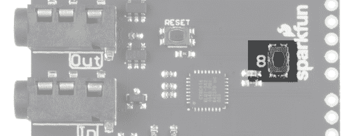](https://cdn.sparkfun.com/assets/learn_tutorials/6/2/5/button_button_8.png)

## 眼镜运动板

[眼镜运动板](https://www.sparkfun.com/products/13993)可以轻松地为您的眼镜项目添加运动。它可以控制多达 5 个伺服电机，无论是标准或连续旋转类型。

[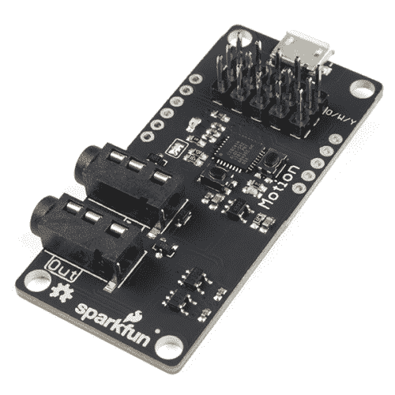](https://www.sparkfun.com/products/retired/13993) 

### [眼镜运动板](https://www.sparkfun.com/products/retired/13993)

[Retired](https://learn.sparkfun.com/static/bubbles/ "Retired") DEV-13993

眼镜运动板可以很容易地添加运动到您的眼镜项目。每个运动板最多可以控制五个…

**Retired**[Favorited Favorite](# "Add to favorites") 4[Wish List](# "Add to wish list")

### TL；博士；医生

1.  伺服板上的 USB 微型 B 端口仅用于为连接的电机供电。
2.  单个伺服系统或几个小型伺服系统可以通过眼镜控制电缆供电。
3.  伺服电机可以是标准或连续旋转类型。

### 见见眼镜运动委员会

“眼镜运动板”旨在方便您将简单的运动添加到眼镜项目中，它与眼镜生态系统的其他部分集成在一起，让您可以相对轻松地控制运动效果。

它有两个用于眼镜控制信号的 1/8 英寸(3.5 毫米)插孔。**注意千斤顶的方向性！**标有“In”的那一个应插入比运动板更靠近控制器板的板，或插入控制器板本身。

[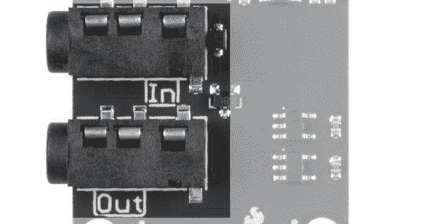](https://cdn.sparkfun.com/assets/learn_tutorials/6/3/2/motor_driver_jacks.png)

运动板支持多达 5 个伺服电机。伺服电机可以是标准运动或连续旋转伺服电机。在黑板上有一个颜色的注释(“O/W/Y”)，它应该在页眉的第一行:橙色、白色或黄色。大多数伺服电机会有一根电线是这些颜色中的一种，那根电线应该和这个音符对齐。

Motion Board 有一个 Micro B USB 连接器，允许它直接由外部电源供电。传输眼镜数据的相对较细的电缆不足以传输较大伺服电机或多个电机产生的大量电流。

## 配置实用程序

### 眼镜按钮板

对于按钮板，有五个选项:三个产生瞬时脉冲型输出，两个产生连续开关型输出。

##### 对印刷机的操作

当按钮第一次被按下时触发一个动作，不管它随后被按住多长时间。

*   **"当按钮数...按下了“**”-这是我们希望分配给此操作的按钮编号。按钮号码印在板上，从 0 到 8。
*   **“触发通道号……”** -单个瞬时脉冲将在该通道上发出。例如，它适用于启动声音、启动动作或设置光带的颜色，但不适用于连续声音播放或打开光带效果。

##### 释放时的操作

当按钮被释放时触发一个动作，不管它在被释放之前被按住了多长时间。

*   **"当按钮数...已释放"** -这是我们希望分配给此操作的按钮编号。按钮号码印在板上，从 0 到 8。
*   **“触发通道号……”** -单个瞬时脉冲将在该通道上发出。例如，它适用于启动声音、启动动作或设置光带的颜色，但不适用于连续声音播放或打开光带效果。

##### 按下或释放时的动作

当按钮被按下时触发一个动作，然后当按钮被释放时再次触发相同的动作。

*   **"当按钮数...按下或释放"** -这是我们希望分配给此操作的按钮编号。按钮号码印在板上，从 0 到 8。
*   **“触发通道号……”** -按下按钮和松开按钮时，将在该通道上发出一个单一的瞬时脉冲。例如，它适用于启动声音、启动动作或设置光带的颜色，但不适用于连续声音播放或打开光带效果。

##### 保持动作

一按下按钮就触发一个事件，然后只要按钮被按住就继续触发该事件。

*   **"While 按钮编号...按下了“**”-这是我们希望分配给此操作的按钮编号。按钮号码印在板上，从 0 到 8。
*   **“激活频道号……”** -该频道将连续发送。它适用于触发和重复声音，或打开和保持(至少在按住按钮时)灯光效果。

##### 闩锁开启/闩锁关闭

这个动作就像一个锁定的电源开关。一次按下打开信号，另一次按下关闭信号。

*   **"While 按钮编号...按下了“**”-这是我们希望分配给此操作的按钮编号。按钮号码印在板上，从 0 到 8。
*   **"激活通道号...直到再次按下按钮“**”-该频道将发出连续信号。它适用于触发和重复声音，或打开和保持灯光效果。

### 眼镜运动板

有四个动作与运动板相关联。其中三个适用于瞬时触发，一个适用于连续信号。

##### 扫至位置

这个动作在两个位置之间移动电机，每个触发事件一个动作。

*   **“收听频道号……”** -这是触发动作的通道。
*   **"控制伺服号..."** -要控制的伺服，编号从 0-4。
*   **“等等...秒，并移动到"** -第一个位置运动前的延迟。
    *   **滑块控制** -选择第一次运动的位置。伺服系统从 90°开始，可以向一个方向旋转到 0°，也可以向另一个方向旋转到 180°。这相当于从 12 点开始，转到 9 点或者 3 点。
*   **“等等...秒，并移动到"** -第二位置运动前的延迟。
    *   **滑块控制** -选择第二次运动的位置。伺服系统从 90°开始，可以向一个方向旋转到 0°，也可以向另一个方向旋转到 180°。这相当于从 12 点开始，转到 9 点或者 3 点。

##### 清扫并返回

该动作等待一会儿，将伺服移动到一个位置，然后在新位置等待一会儿，然后移回第一个位置。

*   **“收听频道号……”** -哪个通道控制这个动作。
*   **"控制伺服号..."** -要控制的伺服，编号从 0-4。
*   **“等等...秒，并移动到"** -第一个位置运动前的延迟。
    *   **滑块控制** -选择第一次运动的位置。伺服系统从 90°开始，可以向一个方向旋转到 0°，也可以向另一个方向旋转到 180°。这相当于从 12 点开始，转到 9 点或者 3 点。
*   **“等等...秒，并移动到"** -第二位置运动前的延迟。
    *   **滑块控制** -选择第二次运动的位置。伺服系统从 90°开始，可以向一个方向旋转到 0°，也可以向另一个方向旋转到 180°。这相当于从 12 点开始，转到 9 点或者 3 点。

##### 摇摆效应

[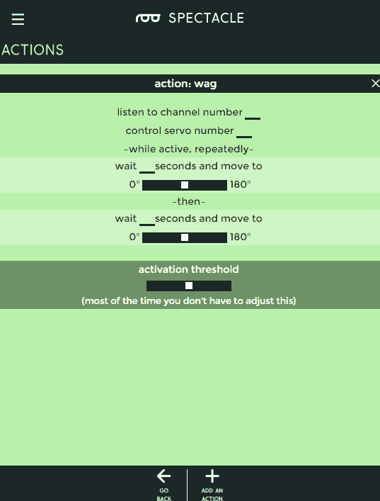](https://cdn.sparkfun.com/assets/learn_tutorials/6/3/1/wag_action.png)

该动作的行为非常类似于扫描和返回，但会持续运行，直到在指定通道上收到另一个信号脉冲而关闭。

*   **“收听频道号……”** -哪个通道控制这个动作。
*   **"控制伺服号..."** -要控制的伺服，编号从 0-4。
*   **“等等...秒，并移动到"** -第一个位置运动前的延迟。
    *   **滑块控制** -选择第一次运动的位置。伺服系统从 90°开始，可以向一个方向旋转到 0°，也可以向另一个方向旋转到 180°。这相当于从 12 点开始，转到 9 点或者 3 点。
*   **“等等...秒，并移动到"** -第二位置运动前的延迟。
    *   **滑块控制** -选择第二次运动的位置。伺服系统从 90°开始，可以向一个方向旋转到 0°，也可以向另一个方向旋转到 180°。这相当于从 12 点开始，转到 9 点或者 3 点。

##### 转到位置

延迟一段时间后，将伺服电机从当前位置移动到这个新位置。

*   **“收听频道号……”** -哪个通道控制这个动作。
*   **"控制伺服号..."** -要控制的伺服，编号从 0-4。
*   **“等等...秒，并移动到"** -第一个位置运动前的延迟。
    *   **滑块控制** -选择第一次运动的位置。伺服系统从 90°开始，可以向一个方向旋转到 0°，也可以向另一个方向旋转到 180°。这相当于从 12 点开始，转到 9 点或者 3 点。

## 示例项目

让我们用眼镜运动板套件做一个项目吧！我们将连接按钮板和运动板，做一个简单的项目，当按钮板上的按钮被按下时，电机从一个位置移动到另一个位置，然后返回。

#### 连接电路板

本教程所需的所有硬件都包含在工具包中。

首先，将 TRRS 电缆的一端插入控制器板上的“直接”插孔。

接下来，将另一根 TRRS 电缆插入主板上的“程序”插孔。

将线缆的另一端插入手机、平板电脑或电脑的音频插孔，以便对系统进行编程。

然后将 TRRS 电缆的另一端插入按钮板上的“In”插孔。

[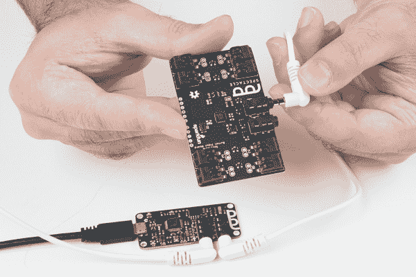](https://cdn.sparkfun.com/assets/learn_tutorials/6/3/1/Spectacle-27.jpg)

抓住另一根 TRRS 电缆，将其插入按钮板上的“Out”插孔。

将线缆的另一端插入运动板上的“In”插孔。

[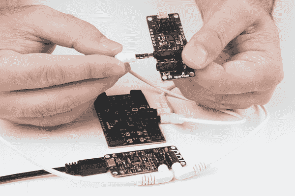](https://cdn.sparkfun.com/assets/learn_tutorials/6/3/1/Spectacle-29.jpg)

现在，将伺服连接器插在运动板上。

[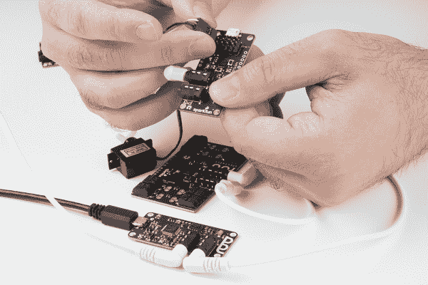](https://cdn.sparkfun.com/assets/learn_tutorials/6/3/1/Spectacle-30.jpg)

最后，将电源适配器的微型 B 端插入控制器板，另一端插入墙壁。在运动板上和按钮板上，您应该看到一个稳定灯和一个闪烁灯。在指示板上，您会看到一个稳定的指示灯和一个闪烁一次，然后暂停，然后重复的指示灯。这表明电源已接通，板已启动并正在运行。

#### 设置板配置

当你第一次打开眼镜应用程序网页，这是你会看到的。你的项目名称将不同于我的，因为奇观分配一个随机的名称给每个项目。

要继续，我们必须告诉项目我们希望使用哪些板。首先点击页面底部的“添加电路板”按钮。

这将显示可用电路板的列表。我们将首先添加我们的按钮板，所以单击“按钮”框中的任意位置来添加它。

现在重复这两个步骤，但这次添加一个动作板，而不是另一个按钮板。

现在，您将看到一个如下所示的屏幕。为了继续，我们需要在板子上添加一些动作，告诉眼镜系统我们希望板子做什么。

[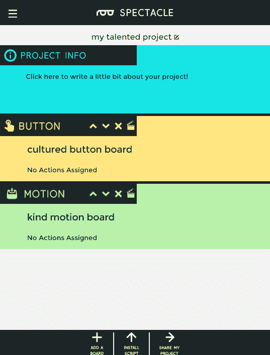](https://cdn.sparkfun.com/assets/learn_tutorials/6/3/1/boards_listed.png)

要添加操作，请单击上面突出显示的隔板图标。我们先做按钮板。

然后你会看到分配给棋盘的动作列表，当然，这个列表是空的。要添加操作，请单击页面底部的“添加操作”按钮，如下图所示。

这里我们看到了按钮板的可用操作。我们将选择第一个选项，“按下时的动作”。单击该条目将其选中。

[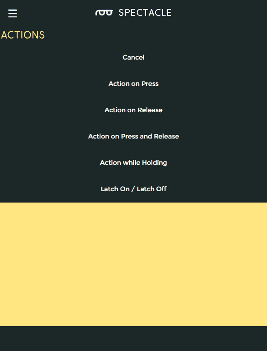](https://cdn.sparkfun.com/assets/learn_tutorials/6/3/1/button_action_list.png)

这是“按下时触发”动作选项屏幕。我已经在字段中输入了数据:按钮 8 到频道 0。按钮 8 是按钮板的内置按钮。现在，单击页面底部的“返回”按钮返回主页，这样我们就可以向运动板添加一个动作。

[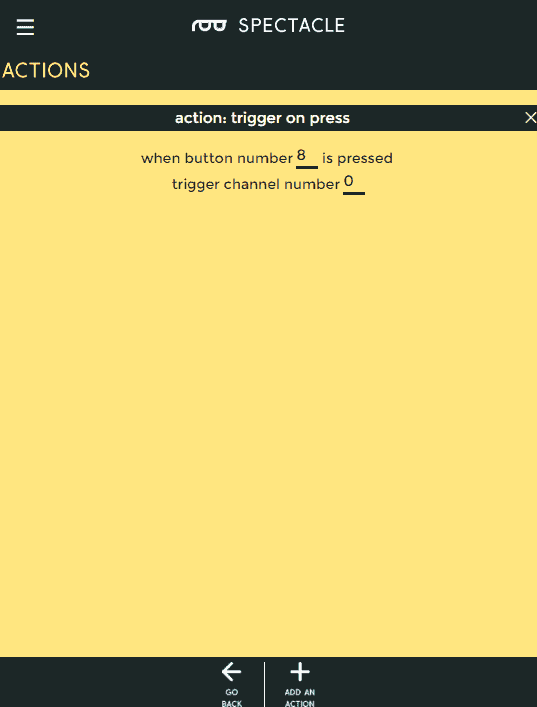](https://cdn.sparkfun.com/assets/learn_tutorials/6/3/1/trigger_on_press.png)

回到主页，您可以看到我们刚刚添加到按钮板的操作显示在板列表中的该板下。单击运动板隔板图标，调出它的动作列表。

[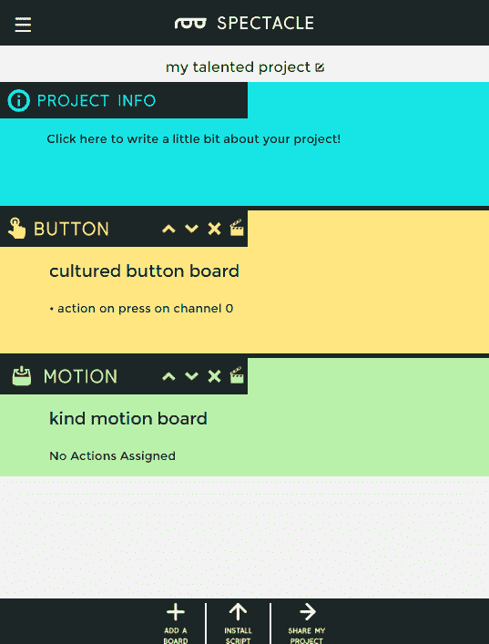](https://cdn.sparkfun.com/assets/learn_tutorials/6/3/1/main_page_action.png)

以下是动议委员会可能采取的行动列表。我们将添加一个“清扫并返回”动作。

我已经把我们想要的设置放到了“清扫和返回”页面设置中。单击“返回”保存更改并返回主板列表。

[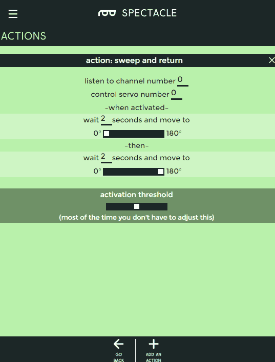](https://cdn.sparkfun.com/assets/learn_tutorials/6/3/1/sweep_and_return_settings.png)

恭喜你！您已经完成了流程的配置步骤。现在是时候把这个项目放到你的董事会上了。

[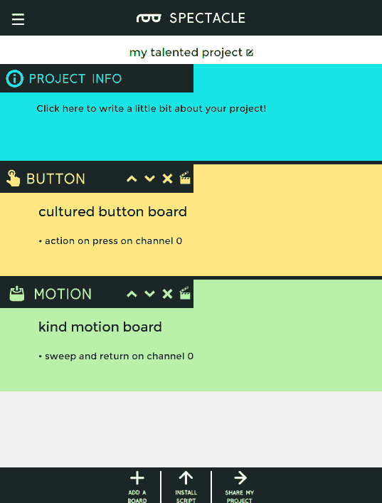](https://cdn.sparkfun.com/assets/learn_tutorials/6/3/1/finished_project.png)

#### 上传

现在你已经创建了你的眼镜程序，是时候把它上传到董事会了。如果你按照上面的说明，你的上传设备已经连接到板上，可以开始了，所以你需要做的就是点击页面底部的“安装脚本”按钮。这将打开如下所示的页面。

确保设备上的音量已调至最大，并且没有其他音频源(音乐、视频等)在背景中播放。然后按住控制器板上的“RST”按钮，按住“程序”按钮，然后松开“RST”按钮。

这将使主板进入程序模式。你会看到板上的灯闪烁三次，暂停，然后重复。这是电路板处于程序模式的视觉指示器。一旦您确定电路板处于编程模式，您可以通过触摸眼镜应用程序屏幕上的“安装”按钮开始编程。该按钮将在编程过程中变灰，这应该只持续几秒钟。编程完成后，您会看到指示板上的灯闪烁 10 次，暂停，然后重复。这是你的提示，程序上传成功。

再次按下“RST”按钮，重置系统并开始程序！

如果您有任何问题，请访问[故障排除页面](https://learn.sparkfun.com/tutorials/spectacle-users-guide#troubleshooting)以获得解决问题的帮助。

## 资源和更进一步

有关一般眼镜信息，请查看用户指南:

 [### 眼镜用户指南

#### 2017 年 5 月 4 日](https://learn.sparkfun.com/tutorials/spectacle-users-guide) The Spectacle system is designed to help those without electronics or programming experience integrate electronics into projects.[Favorited Favorite](# "Add to favorites") 4

要获得更多奇观乐趣，请查看下面的附加教程:

 [### 眼镜音响套装连接指南](https://learn.sparkfun.com/tutorials/spectacle-sound-kit-hookup-guide) All the information you need to use the Spectacle Sound Kit in one place.[Favorited Favorite](# "Add to favorites") 1 [### 眼镜用户指南](https://learn.sparkfun.com/tutorials/spectacle-users-guide) The Spectacle system is designed to help those without electronics or programming experience integrate electronics into projects.[Favorited Favorite](# "Add to favorites") 4 [### 眼镜灯光和声音套件连接指南](https://learn.sparkfun.com/tutorials/spectacle-light-and-sound-kit-hookup-guide) All the information you need to use the Spectacle Light and Sound Kit in one place.[Favorited Favorite](# "Add to favorites") 2 [### 眼镜灯套件连接指南](https://learn.sparkfun.com/tutorials/spectacle-light-kit-hookup-guide) All the information you need to use the Spectacle Light Kit in one place.[Favorited Favorite](# "Add to favorites") 2 [### 眼镜灯板连接导轨](https://learn.sparkfun.com/tutorials/spectacle-light-board-hookup-guide) All the information you need to use the Spectacle Light Board in one place.[Favorited Favorite](# "Add to favorites") 2 [### 眼镜惯性板连接导轨](https://learn.sparkfun.com/tutorials/spectacle-inertia-board-hookup-guide) Everything you need to know about using the Spectacle Inertia Board in one place.[Favorited Favorite](# "Add to favorites") 2

或者查看使用眼镜运动板的博客项目帖子:

 [### 硬件驼峰日:成为毕业典礼上的奇观！

May 10, 2017](https://www.sparkfun.com/news/2380 "May 10, 2017: Stand out at graduation using the Spectacle ecosystem to decorate your cap!")[Favorited Favorite](# "Add to favorites") 0 [### 周日:从 Juicero 到 Juicezero

May 16, 2017](https://www.sparkfun.com/news/2386 "May 16, 2017: The good, the bad and the $700 IoT cold-press juice machine.")[Favorited Favorite](# "Add to favorites") 1