# 眼镜音响套装连接指南

> 原文：<https://learn.sparkfun.com/tutorials/spectacle-sound-kit-hookup-guide>

## 介绍

[眼镜声音套件](https://www.sparkfun.com/products/14487)包含制作按钮触发声音回放项目所需的一切。

[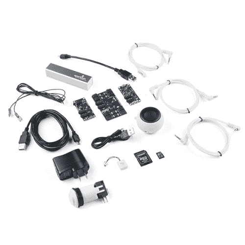](https://www.sparkfun.com/products/retired/14487) 

### [眼镜音响套装](https://www.sparkfun.com/products/retired/14487)

[Retired](https://learn.sparkfun.com/static/bubbles/ "Retired") KIT-14487

眼镜声音套件可以很容易地将声音，曲调和其他音频想法融入您的下一个项目，并激活…

**Retired**[Favorited Favorite](# "Add to favorites") 0[Wish List](# "Add to wish list")

### 推荐阅读

在继续之前，您应该通读[眼镜用户指南](https://learn.sparkfun.com/tutorials/spectacle-users-guide)。它会给你一些你需要了解的关于奇观如何工作的基础知识，以便你能理解本教程的其余部分。

## 眼镜音频板

眼镜音频板允许您添加声音到您的眼镜项目。它接受带有声音的 microSD 卡。ogg 格式(稍后将详细介绍)，并有一个 1/8 英寸(3.5 毫米)音频插孔来连接外部放大器。

[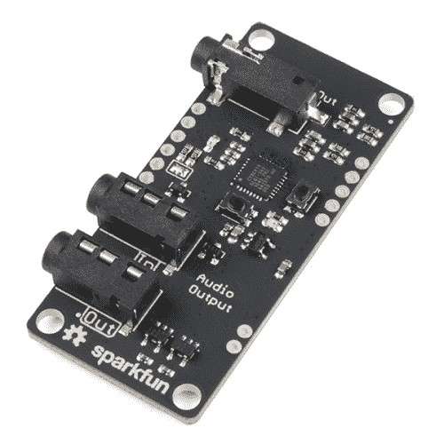](https://www.sparkfun.com/products/retired/14034) 

### [眼镜音频板](https://www.sparkfun.com/products/retired/14034)

[Retired](https://learn.sparkfun.com/static/bubbles/ "Retired") DEV-14034

眼镜音频板允许您将 microSD 卡中的声音添加到您的眼镜项目中。每个板接受一个微型…

**Retired**[Favorited Favorite](# "Add to favorites") 5[Wish List](# "Add to wish list")

### TL；博士；医生

1.  眼镜的音频文件应格式化为。奥格文件。
2.  音频文件应该有名称 00.ogg、01.ogg、02.ogg 等。
3.  音频板上的音频插孔产生仅适用于放大的输出。它不适合耳机或无电源扬声器。

### 认识一下眼镜音频板

眼镜音频板旨在成为一种低成本且易于使用的向项目添加声音的方法，它与眼镜生态系统的其余部分相集成，以按需提供声音效果。

它有三个 1/8 英寸(3.5 毫米)插孔:两个用于眼镜控制信号，一个用于音频输出。确保将电缆插入正确的插孔！将音频设备插入其中一个眼镜插孔可能会损坏音频设备。请注意，眼镜数据插孔是定向的:标有“In”的插孔应插入“上游”板(即比这个更靠近控制器板)，标有“Out”的插孔连接到下一个下游板。**“输出”插孔不用于音频信号。**

[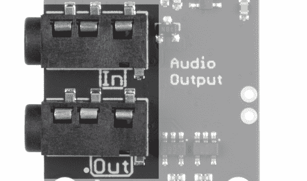](https://cdn.sparkfun.com/assets/learn_tutorials/6/2/3/audio_io_jacks.png)

音频输出仅为放大设备设计。这意味着任何使用带耳机或未放大扬声器的眼镜音频板的尝试都将无法产生声音输出。SparkFun 出售一款[小型、放大、可充电扬声器](https://www.sparkfun.com/products/14023)，专门用于眼镜音频板。

眼镜音频板使用微型 SD 卡存储要播放的音频文件。这些文件应该存储为。ogg Vorbis 编码文件。这种免费的音频文件格式可以在任何类型的计算机上播放和创建。在教程的后面，我们将向您展示如何从 MP3、WAV 或其他文件格式转换为。ogg 格式。

[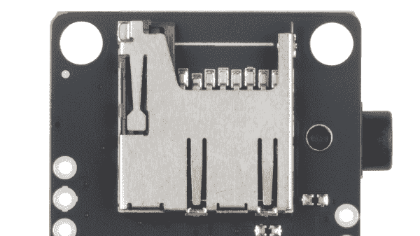](https://cdn.sparkfun.com/assets/learn_tutorials/6/2/3/audio_sd.png)

这些文件必须用数字命名，这是在配置应用程序中引用它们的方式。文件名示例有 00.ogg、01.ogg、02.ogg 等等。

## 眼镜按钮板

眼镜按钮板允许您将按钮或开关输入添加到您的眼镜项目中。它共有 9 个信号输入，其中 8 个可以来自外部按钮，1 个直接在板上。

[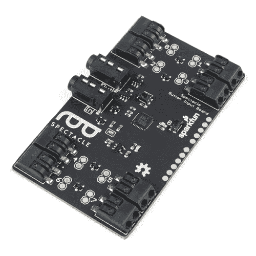](https://www.sparkfun.com/products/retired/14044) 

### [眼镜按钮板](https://www.sparkfun.com/products/retired/14044)

[Retired](https://learn.sparkfun.com/static/bubbles/ "Retired") DEV-14044

眼镜按钮板允许您将来自按钮、开关或其他接触式传感设备的输入添加到您的眼镜上

1 **Retired**[Favorited Favorite](# "Add to favorites") 5[Wish List](# "Add to wish list")

### TL；博士；医生

1.  按钮或开关可以通过将电线插入电路板上的“戳 home”型连接器来连接到电路板上。
2.  多达九个信号可用。
3.  按钮信号可以是瞬时的，也可以是连续的。

### 遇见眼镜按钮板

眼镜按钮板旨在将简单的信号从世界带入您的眼镜项目，为您的任何眼镜项目提供输入。

它有两个 1/8 英寸(3.5 毫米)插孔，用于连接眼镜系统中的其他电路板。请注意，眼镜数据插孔是定向的:标有“In”的插孔应插入“上游”板(即比这个更靠近控制器板)，标有“Out”的插孔连接到下一个下游板。

按钮板上有 8 个“戳 home”连接器。每个都可以连接到一个(或多个)按钮。要添加连接，只需将电线的剥皮端推入连接器上的孔中。连接器会自动抓住电线并将其固定到位。如果您需要稍后移除电线，请使用小物件(发夹、圆珠笔等)。)可用于按下释放按钮，使电线无损坏地抽出。

按钮板上有一个输入按钮，如果没有其他按钮可用，它可以用来提供输入信号。它的功能就像任何其他可能附加的普通按钮一样。确保你按的是标有“8”的按钮，而不是标有“重置”的按钮！按下重置按钮将重置您的按钮板，可能会导致您的整个系统停止正常工作，直到您重置您的控制器板！

## 配置实用程序

### 眼镜音板

眼镜音频板只支持一个动作:播放声音。正如您在上面看到的，有许多设置与这个动作相关联。

*   **“收听频道号……”** -这是触发音频开始播放的频道号。只要该频道的值高于阈值水平(见下文)，声音将以由下面指定的两个时间间隔确定的速率重复播放。
*   **“等等...秒和播放……”** -这是系统中的第一次延迟。通过延迟声音播放时间，您可以按照自己认为合适的方式对事件进行排序。
*   **...还有播放文件号……”** -这是你告诉棋盘玩哪个文件的地方。记住，将音频文件复制到 Micro SD 卡时，要命名为 00.ogg、01.ogg、02.ogg 等。此栏中的数字对应于音频文件名称中的数字。如果没有相应编号的音频文件，将不会播放任何声音。
*   **“不要让另一个声音打断，直到...秒"** -该字段中的数字应与音频文件的长度相对应。如果这个值小于声音文件的长度，发送到音频板的另一个触发器将在声音结束前中断声音。如果比声音长，播放后会有一段时间的静默，然后才能开始另一次播放。
*   **“激活阈值”**——就像 app 里说的，大部分时候你不需要调整这个。通过调整这个，你可以设置眼镜加速板触发声音的角度，或者随机触发虚拟板引起声音播放的频率。

### 眼镜按钮板

对于按钮板，有五个选项:三个产生瞬时脉冲型输出，两个产生连续开关型输出。

##### 对印刷机的操作

当按钮第一次被按下时触发一个动作，不管它随后被按住多长时间。

*   **"当按钮数...按下了“**”-这是我们希望分配给此操作的按钮编号。按钮号码印在板上，从 0 到 8。
*   **“触发通道号……”** -单个瞬时脉冲将在该通道上发出。例如，它适用于启动声音、启动动作或设置光带的颜色，但不适用于连续声音播放或打开光带效果。

##### 释放时的操作

当按钮被释放时触发一个动作，不管它在被释放之前被按住了多长时间。

*   **"当按钮数...已释放"** -这是我们希望分配给此操作的按钮编号。按钮号码印在板上，从 0 到 8。
*   **“触发通道号……”** -单个瞬时脉冲将在该通道上发出。例如，它适用于启动声音、启动动作或设置光带的颜色，但不适用于连续声音播放或打开光带效果。

##### 按下或释放时的动作

[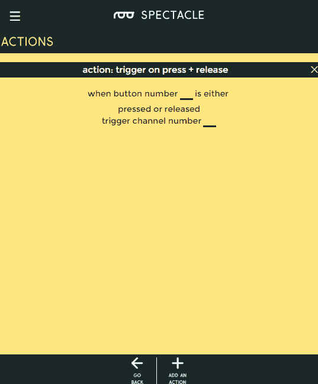](https://cdn.sparkfun.com/assets/learn_tutorials/6/1/8/action_on_press_release_2.png)

当按钮被按下时触发一个动作，然后当按钮被释放时再次触发相同的动作。

*   **"当按钮数...按下或释放"** -这是我们希望分配给此操作的按钮编号。按钮号码印在板上，从 0 到 8。
*   **“触发通道号……”** -按下按钮和松开按钮时，将在该通道上发出一个单一的瞬时脉冲。例如，它适用于启动声音、启动动作或设置光带的颜色，但不适用于连续声音播放或打开光带效果。

##### 保持动作

[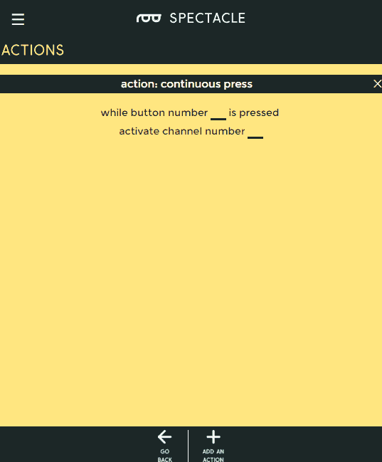](https://cdn.sparkfun.com/assets/learn_tutorials/6/1/8/action_while_holding_1.png)

一按下按钮就触发一个事件，然后只要按钮被按住就继续触发该事件。

*   **"While 按钮编号...按下了“**”-这是我们希望分配给此操作的按钮编号。按钮号码印在板上，从 0 到 8。
*   **“激活频道号……”** -该频道将连续发送。它适用于触发和重复声音，或打开和保持(至少在按住按钮时)灯光效果。

##### 闩锁开启/闩锁关闭

这个动作就像一个锁定的电源开关。一次按下打开信号，另一次按下关闭信号。

*   **"While 按钮编号...按下了“**”-这是我们希望分配给此操作的按钮编号。按钮号码印在板上，从 0 到 8。
*   **"激活通道号...直到再次按下按钮“**”-该频道将发出连续信号。它适用于触发和重复声音，或打开和保持灯光效果。

## 将声音转换为 OGG Vorbis 格式

眼镜音频板使用的文件必须是 OGG Vorbis 格式。这种免费的有损编解码器具有比 MP3 更高的压缩比，更重要的是，可以在无需向任何第三方组织支付许可费的情况下使用。

#### 下载并安装 Audacity

我们将使用[免费开源程序“Audacity”](http://www.audacityteam.org/)将你的文件从当前格式转换成 OGG Vorbis 格式。

Audacity 可以在所有三个主要的操作系统上使用，所以安装它不会有任何问题。

当您启动 Audacity 时，您会看到这个屏幕，或者一个非常类似的屏幕。乍一看，这似乎非常复杂，**这些废话对我们来说都不重要，**所以不要惊慌。

#### 载入文件

像大多数程序一样，“加载文件”只是意味着从“文件”菜单中选择“打开”并选择你想要转换的文件。Audacity 能够编辑大多数类型的音频文件:WAV、AIFF、FLAC、MP3 等。

默认情况下，当您打开打开对话框时，Audacity 会显示所有文件，而不仅仅是兼容的音频文件。有一个下拉菜单允许你改变它，所以它只显示兼容的音频文件沿着窗口的底部边缘。

一旦你选择了你想要编辑的文件，一个相当危言耸听的消息可能会弹出，警告你不要在没有拷贝的情况下编辑文件。点击“确定”即可。

[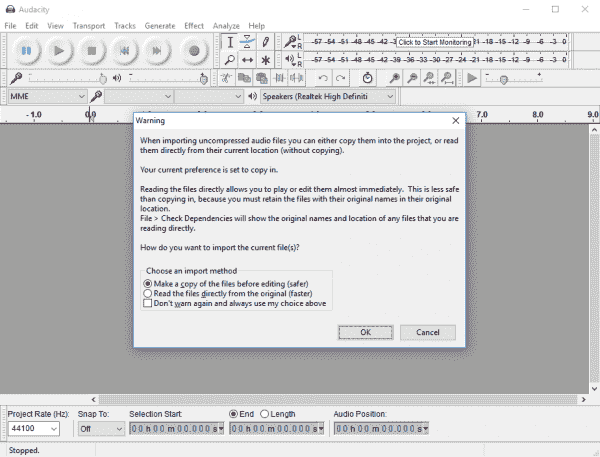](https://cdn.sparkfun.com/assets/learn_tutorials/6/1/8/audacity_warning.png)

你会看到，这样的东西出现了。这是你的音频文件在电脑上的样子。**还是那句话，不要慌！**除非你想以某种方式编辑声音(我们不这样做)，否则这里弹出的所有设置或信息对我们来说都不重要。

[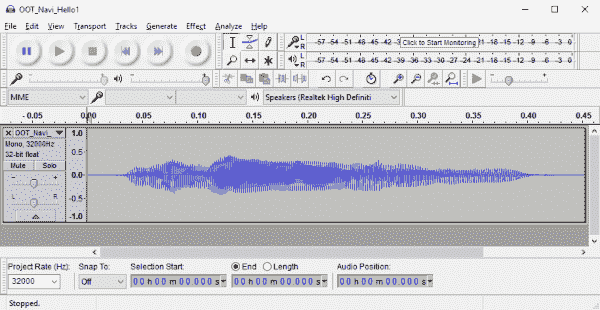](https://cdn.sparkfun.com/assets/learn_tutorials/6/1/8/audacity_file_open.png)

#### 皈依 OGG 教

现在您已经加载了文件，您需要将其转换为 OGG Vorbis 格式。为此，请打开“文件”菜单并选择“导出音频...”菜单项大约在中间。应该会弹出一个熟悉的保存窗口。

[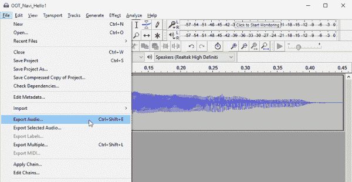](https://cdn.sparkfun.com/assets/learn_tutorials/6/1/8/audacity_export_audio_1.png)

在“文件名:”字段的正下方，您会看到一个标有“保存类型:”的下拉菜单。在下拉列表中选择“Ogg Vorbis 文件”。

窗口底部会出现一个滑块。默认值“5”对于大多数目的来说可能已经足够了。点击“保存”,会弹出另一个窗口。

这个允许你设置文件的元数据。你可以忽略一切，只需点击“确定”跳过这一步。

恭喜你！您已成功将文件转换为 OGG Vorbis 格式。您现在可以将该文件复制到 Micro SD 卡(不要忘记将其重命名为一个数字！)与眼镜音频板一起使用。

[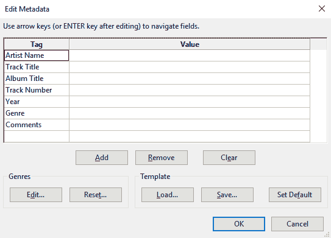](https://cdn.sparkfun.com/assets/learn_tutorials/6/1/8/metadata.png)

#### 额外加分——减少脂肪，让声音更大

正如你在我上面的文件中看到的，声音的范围和窗户的范围之间有很大的空间。在时间轴(水平轴)上，这表现为声音文件内容前后的平线。在“响度”(垂直)轴中，这表现为波形文件顶部和底部以及回放位置窗口顶部和底部之间的空间。

让我们消除声音播放前后的一些停滞时间。为此，只需在回放位置窗口内单击并拖动，就像您试图选择一段文本一样。如上所述，您选择的部分将被突出显示。现在，只需按下键盘上的“删除”键，该部分就会被删除。在声音的另一端重复这个过程。

[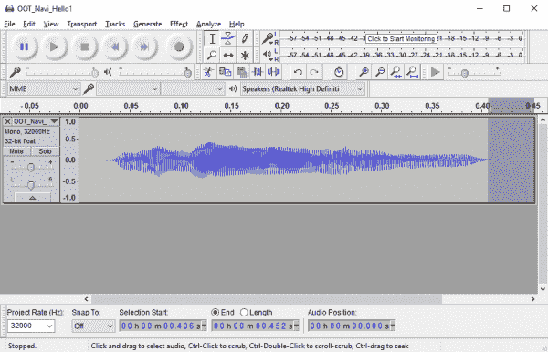](https://cdn.sparkfun.com/assets/learn_tutorials/6/1/8/audacity_highlighted_extra.png)

现在，让我们看看我们能做些什么。在“编辑”菜单下，找到“选择”子菜单，选择“全部”来选择整个声音。你也可以使用上面的拖拽高亮方法。

[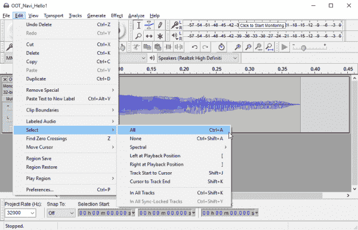](https://cdn.sparkfun.com/assets/learn_tutorials/6/1/8/select_all.png)

现在你已经选择了整个声音，点击“效果”菜单并选择“放大…”选项。

将弹出一个新窗口，带有一个滑块、几个文本框和一个复选框。滑块将被预先定位，以在不“削波”声音的情况下尽可能放大声音。当您试图将声音放大到播放系统无法承受的程度时，就会发生“削波”,这会导致播放过程中出现一种刺耳的嗡嗡声。

[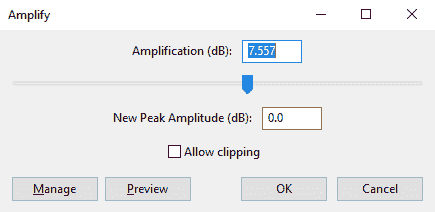](https://cdn.sparkfun.com/assets/learn_tutorials/6/1/8/amplify_dialog.png)

现在你有一个选择:你可以接受系统建议的级别，或者你可以点击“允许剪辑”复选框，用滑块增加放大倍数。我已经选择接受上图的剪裁限制；将它与更高的文件图像进行比较，您可以看到我是如何修剪末端的停滞时间并垂直增加振幅的。

为什么你想让你的声音剪辑？嗯，首先，预设的放大倍数只考虑了你声音的峰值，所以如果允许剪辑一小部分音频，可能会让绝大多数声音大很多。第二，如果你的播放设备质量相对较差，或者声音文件本身质量较差，允许剪辑可能会显著增加音量，而不会使声音质量比原来差太多。第三，音量强度可能比音质更重要，允许削波可以让你尽可能地提高音量。

现在你已经成功地编辑了声音，按照我们上面提到的，把它导出到 OGG Vorbis。

## 示例项目

让我们使用眼镜声音套件的内容来拼凑一个工作项目！

#### 连接电路板

工具包中包含了本教程所需的所有硬件。

从连接电路板开始。您需要随附的 TRRS 音频电缆、电源和小型可充电扬声器。在您第一次尝试使用扬声器之前，请确保它已充电！

首先，将 TRRS 电缆的一端插入控制器板上的“直接”插孔。

[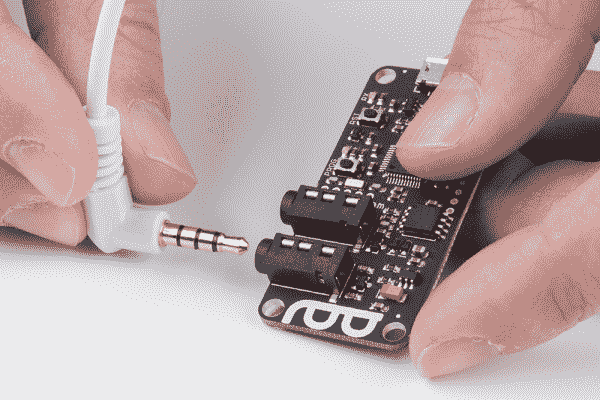](https://cdn.sparkfun.com/assets/learn_tutorials/6/2/9/director_direct_jack.jpg)

接下来，将另一根 TRRS 电缆插入主板上的“程序”插孔。

将线缆的另一端插入手机、平板电脑或电脑的音频插孔，以便对系统进行编程。

然后将第一根 TRRS 电缆的另一端(连接到控制器板上“直接”插孔的一端)插入按钮板上的“输入”插孔。

抓住另一根 TRRS 电缆，将其插入按钮板上的“Out”插孔。

[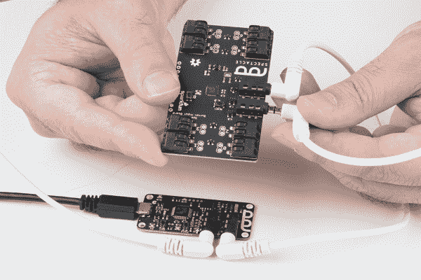](https://cdn.sparkfun.com/assets/learn_tutorials/6/1/8/Spectacle-28.jpg)

将电缆的另一端插入音频板上的“In”插孔。

[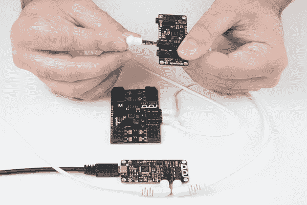](https://cdn.sparkfun.com/assets/learn_tutorials/6/1/8/Spectacle-32.jpg)

现在将扬声器插入音频板上的“音频输出”插孔。

[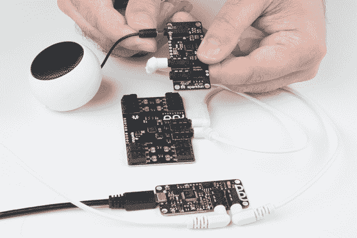](https://cdn.sparkfun.com/assets/learn_tutorials/6/1/8/Spectacle-33.jpg)

现在，您可以将 micro SD 卡插入主板背面的插槽中。

[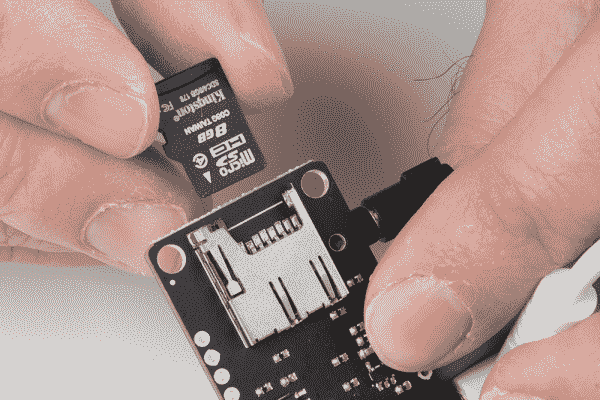](https://cdn.sparkfun.com/assets/learn_tutorials/6/1/8/Spectacle-34.jpg)

最后，将电源适配器的微型 B 端插入控制器板，另一端插入墙壁。您应该在音频板和按钮板上看到一个稳定灯和一个闪烁灯。在指示板上，您会看到一个稳定指示灯和一个闪烁八次，然后暂停，然后重复的指示灯。这表明电源已接通，板已启动并正在运行。

#### 设置板配置

我们将假设您遵循了上一页关于将声音转换为 OGG Vorbis 格式的说明，并且插入声卡的 Micro SD 卡上有一个名为“00.ogg”的声音。如果是*而不是*这种情况，花几分钟时间回到那一页，准备一段录音。

这是眼镜应用程序屏幕中的一个新项目。请随意重命名您的名称(它将具有与示例不同的默认名称)，因为项目的名称对过程的其余部分没有影响。

单击下面突出显示的按钮，将主板添加到我们的系统配置中。

在弹出的列表中的“按钮”框中单击任意位置，将按钮板添加到您的项目中。现在，重复这个过程，点击“音频”框，将音频板添加到您的项目中。

然后，您将返回到主页面，但是将会出现几行新行:一行用于按钮板，一行用于音频板。

[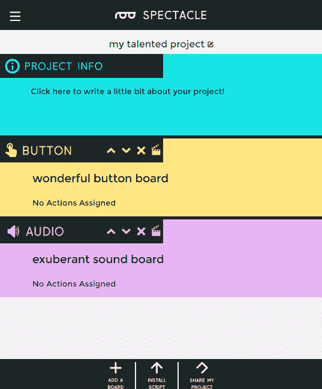](https://cdn.sparkfun.com/assets/learn_tutorials/6/1/8/main_page_boards_1.png)

要编辑分配给这些电路板的操作，请单击您要编辑的电路板行中的隔板图标。我们将从编辑按钮板的动作开始。

[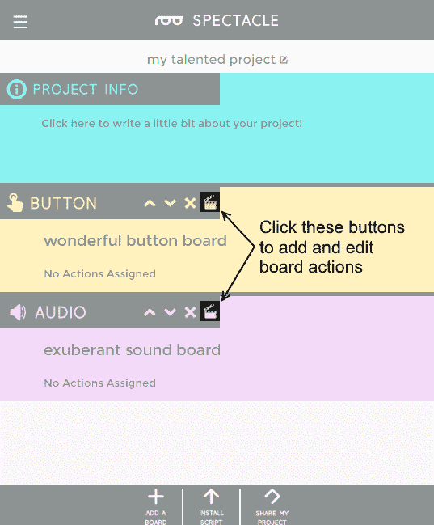](https://cdn.sparkfun.com/assets/learn_tutorials/6/1/8/highlight_edit_buttons_1.png)

任何时候你打开一个新的面板来添加动作，你都会看到如下的屏幕。要添加操作，请单击框架底部中间的“添加操作”按钮。

这将向您展示当前董事会能够实施的行动列表。在按钮板的情况下，有五个不同的选项。点击第一个，“按下时的动作”。

[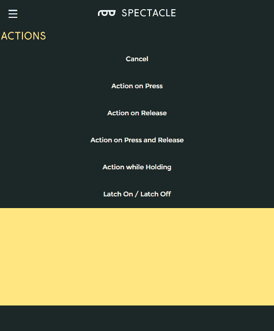](https://cdn.sparkfun.com/assets/learn_tutorials/6/1/8/button_options_1.png)

现在你会看到上面的窗口。在所示的两个字段中输入“0 ”,每当按下按钮 0 时，就会在通道 0 上发出一个触发脉冲。然后单击页面底部的“返回”按钮保存操作并返回主页。

[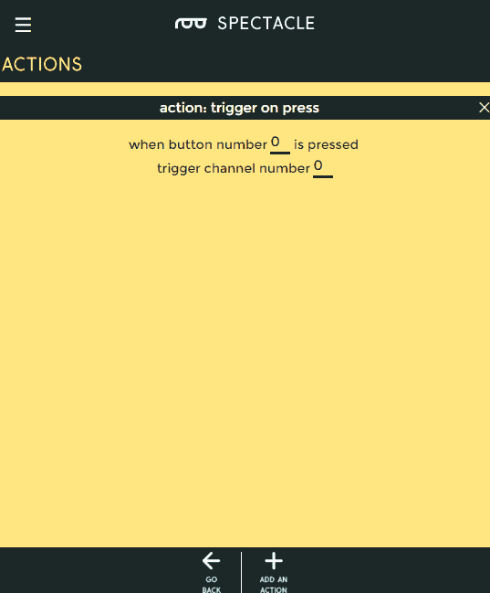](https://cdn.sparkfun.com/assets/learn_tutorials/6/1/8/button_action_setup_1.png)

回到主页，您可以看到您添加的操作在窗口中的按钮板行上是可见的。接下来让我们编辑声卡的动作。

[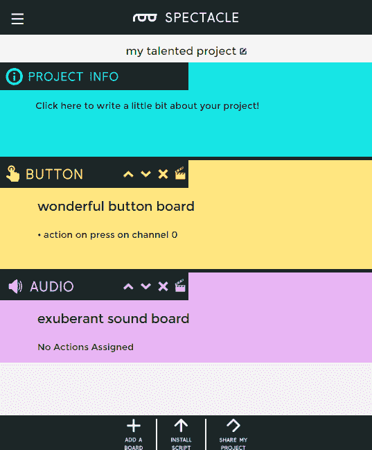](https://cdn.sparkfun.com/assets/learn_tutorials/6/1/8/main_page_button_action_1.png)

音频板的操作只有一个选项，那就是“播放声音”。一旦你点击了“播放声音”的配置窗口，你会看到这样的页面。如上所示填写空白处，然后再次点击“返回”按钮。

[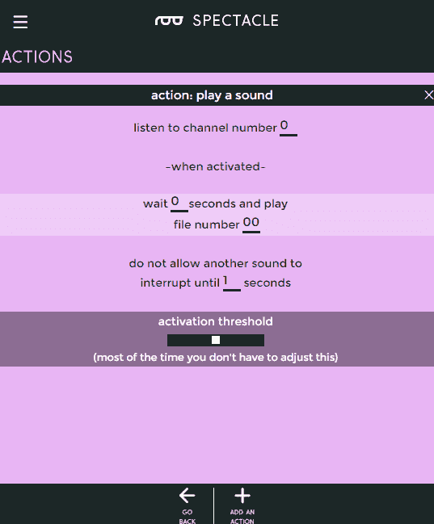](https://cdn.sparkfun.com/assets/learn_tutorials/6/1/8/sound_board_actions_1.png)

现在，您将返回到主页面，您将看到您在项目的每一行下面添加的操作。是时候将配置上传到您的硬件了！

[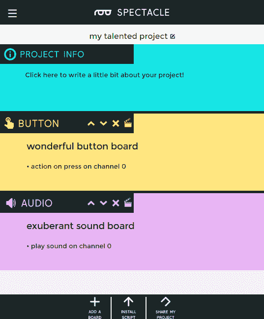](https://cdn.sparkfun.com/assets/learn_tutorials/6/1/8/main_page_done_1.png)

#### 上传

现在你已经创建了你的眼镜程序，是时候把它上传到董事会了。如果你按照上面的说明，你的上传设备已经连接到板上，可以开始了，所以你需要做的就是点击页面底部的“安装脚本”按钮。这将打开如下所示的页面。

[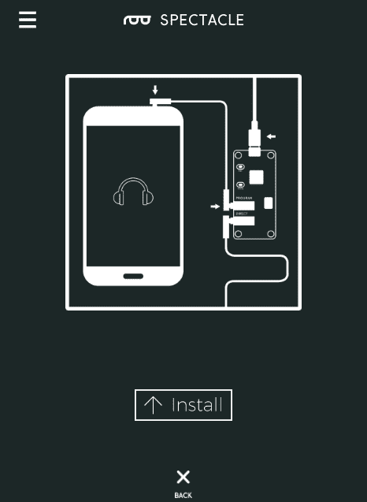](https://cdn.sparkfun.com/assets/learn_tutorials/6/3/2/upload_page.png)

确保设备上的音量已调至最大，并且没有其他音频源(音乐、视频等)在背景中播放。然后按住控制器板上的“RST”按钮，按住“程序”按钮，然后松开“RST”按钮。

这将使主板进入程序模式。你会看到板上的灯闪烁三次，暂停，然后重复。这是电路板处于程序模式的视觉指示器。一旦您确定电路板处于编程模式，您可以通过触摸眼镜应用程序屏幕上的“安装”按钮开始编程。该按钮将在编程过程中变灰，这应该只持续几秒钟。编程完成后，您会看到指示板上的灯闪烁 10 次，暂停，然后重复。这是你的提示，程序上传成功。

再次按下“RST”按钮，重置系统并开始程序！

如果您有任何问题，请访问[故障排除页面](https://learn.sparkfun.com/tutorials/spectacle-users-guide#troubleshooting)以获得解决问题的帮助。

## 资源和更进一步

有关一般眼镜信息，请查看用户指南:

 [### 眼镜用户指南

#### 2017 年 5 月 4 日](https://learn.sparkfun.com/tutorials/spectacle-users-guide) The Spectacle system is designed to help those without electronics or programming experience integrate electronics into projects.[Favorited Favorite](# "Add to favorites") 4

要获得更多奇观乐趣，请查看下面的附加教程:

 [### 眼镜用户指南](https://learn.sparkfun.com/tutorials/spectacle-users-guide) The Spectacle system is designed to help those without electronics or programming experience integrate electronics into projects.[Favorited Favorite](# "Add to favorites") 4 [### 眼镜灯光和声音套件连接指南](https://learn.sparkfun.com/tutorials/spectacle-light-and-sound-kit-hookup-guide) All the information you need to use the Spectacle Light and Sound Kit in one place.[Favorited Favorite](# "Add to favorites") 2 [### 眼镜灯套件连接指南](https://learn.sparkfun.com/tutorials/spectacle-light-kit-hookup-guide) All the information you need to use the Spectacle Light Kit in one place.[Favorited Favorite](# "Add to favorites") 2 [### 眼镜按钮板连接导轨](https://learn.sparkfun.com/tutorials/spectacle-button-board-hookup-guide) All the information you need to use the Spectacle Button Board in one place.[Favorited Favorite](# "Add to favorites") 2 [### 眼镜灯板连接导轨](https://learn.sparkfun.com/tutorials/spectacle-light-board-hookup-guide) All the information you need to use the Spectacle Light Board in one place.[Favorited Favorite](# "Add to favorites") 2 [### 眼镜运动板连接指南](https://learn.sparkfun.com/tutorials/spectacle-motion-board-hookup-guide) All the information you need to use the Spectacle Motion Kit in one place.[Favorited Favorite](# "Add to favorites") 2 [### 眼镜惯性板连接导轨](https://learn.sparkfun.com/tutorials/spectacle-inertia-board-hookup-guide) Everything you need to know about using the Spectacle Inertia Board in one place.[Favorited Favorite](# "Add to favorites") 2 [### 奇观例子:超级马里奥兄弟西洋镜](https://learn.sparkfun.com/tutorials/spectacle-example-super-mario-bros-diorama) A study in building an animated diorama (with sound!) using Spectacle electronics.[Favorited Favorite](# "Add to favorites") 1