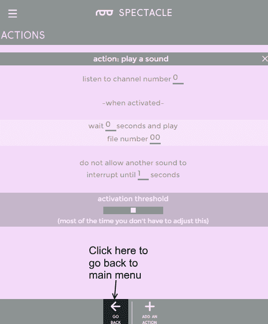

# 眼镜用户指南

> 原文：<https://learn.sparkfun.com/tutorials/spectacle-users-guide>

## 介绍

奇观是一个围绕着一个简单想法的产品生态系统:有创造力的人不应该学习新的技能来在他们的项目中使用电子设备。你已经花了数年时间来发展你所使用的技能，SparkFun 希望认识到这一点，并帮助你扩展你的创作以包括电子产品，而不需要你花数年时间学习电子产品和编程。

眼镜推出了六个模块:导演板，音频输出板，电机控制板，灯光控制板，惯性传感板，按钮输入板。每个眼镜项目包括至少两个董事会:一个董事会和至少一个输出型模块。

#### 董事会

 

将**添加到您的[购物车](https://www.sparkfun.com/cart)中！**

### [眼镜导演板](https://www.sparkfun.com/products/13912)

[In stock](https://learn.sparkfun.com/static/bubbles/ "in stock") DEV-13912

眼镜董事会控制着一个眼镜项目的所有行动。虽然董事会没有做太多的工作…

$24.95 $9.95[Favorited Favorite](# "Add to favorites") 4[Wish List](# "Add to wish list")** **董事会控制着一个大型项目的所有行动。输入型模块向它报告状态数据，输出型模块从它那里接收行进指令。

#### 音频输出板

 

### [眼镜音频板](https://www.sparkfun.com/products/retired/14034)

[Retired](https://learn.sparkfun.com/static/bubbles/ "Retired") DEV-14034

眼镜音频板允许您将 microSD 卡中的声音添加到您的眼镜项目中。每个板接受一个微型…

**Retired**[Favorited Favorite](# "Add to favorites") 5[Wish List](# "Add to wish list")

音频输出板为您的眼镜系统增加了从微型 SD 卡播放声音的功能。它提供一个准备放大的线路电平输出。

#### 电机控制板

 

### [眼镜运动板](https://www.sparkfun.com/products/retired/13993)

[Retired](https://learn.sparkfun.com/static/bubbles/ "Retired") DEV-13993

眼镜运动板可以很容易地添加运动到您的眼镜项目。每个运动板最多可以控制五个…

**Retired**[Favorited Favorite](# "Add to favorites") 4[Wish List](# "Add to wish list")

电机控制板用于驱动传统的业余爱好伺服电机，无论是正常类型还是连续旋转类型。它可以通过控制器板连接供电，也可以通过高功率伺服电机的本地输入端口供电。

#### 轻质纸板

 

### [眼镜灯板](https://www.sparkfun.com/products/retired/14052)

[Retired](https://learn.sparkfun.com/static/bubbles/ "Retired") DEV-14052

眼镜灯板允许您添加一些相当复杂的照明效果到您的眼镜项目中，以一种简化的…

**Retired**[Favorited Favorite](# "Add to favorites") 4[Wish List](# "Add to wish list")

光板控制可寻址的 led 链，允许它实现许多有趣的效果，否则是不可能的。

#### 惯性感应板

 

### [眼镜惯性板](https://www.sparkfun.com/products/retired/13992)

[Retired](https://learn.sparkfun.com/static/bubbles/ "Retired") DEV-13992

眼镜惯性板使眼镜项目的运动或方向感测变得容易。眼镜惯性车…

**Retired**[Favorited Favorite](# "Add to favorites") 4[Wish List](# "Add to wish list")

惯性感应板允许您触发运动、静止或方向事件。

#### 按钮输入板

 

### [眼镜按钮板](https://www.sparkfun.com/products/retired/14044)

[Retired](https://learn.sparkfun.com/static/bubbles/ "Retired") DEV-14044

眼镜按钮板允许您将来自按钮、开关或其他接触式传感设备的输入添加到您的眼镜上

1 **Retired**[Favorited Favorite](# "Add to favorites") 5[Wish List](# "Add to wish list")

按钮输入板从各种按钮、开关或其他接触型传感装置获取输入。它有 8 个外部输入和一个板载按钮，允许单个模块的大量输入。

## 眼镜董事委员会

眼镜董事会是所有眼镜系统的核心。它存储程序，连接到系统中的其他板并向其供电，并在其他板之间传递消息。

### 董事会硬件参观

控制器板上有两个按钮:一个标记为 RST，一个标记为程序。这些按钮允许您进入编程模式，因此新的行为可以加载到您的眼镜系统。

要进入编程模式，按住 RST 按钮，按住 PROG 按钮，然后松开 RST 按钮。

您的眼镜系统的电源通过控制器板上的微型 USB 插孔提供。然后，通过将其他板连接在一起的电缆将电力输送到系统中的其他板，尽管一些板(如运动板和灯光板)可能需要本地输送电力。

“编程”插孔是你用来连接编程设备的地方。需要一根电缆将此插孔连接到编程设备的音频输出，以便向您的眼镜系统上传一组新的行为。

其他眼镜板将连接到“直接”插孔。电源通过这个插孔传输到其他电路板，当 RST 按钮被按下时，这些电路板的电源被断开。

## 眼镜示例

眼镜动作由“信道”调节，信道代表通过控制板从输入模块发送到输出模块的信息。通过使用“虚拟”板来组合信号，多个板可以监听单个通道，并且多个板可以写入单个通道。

#### 一个例子

在我们的简单示例中，我们创建了一个只有两块板的系统:控制器板和音频输出板。这个简单的例子将随机播放一段声音，播放间隔至少为 10 秒。

这里我们看到了眼镜应用程序的打开屏幕。默认名称(在这种情况下)是“我的天才项目”，但是你当然可以把它改成你喜欢的任何名称。我们就让它保持原样。接下来，我们需要将音频输出板添加到项目中。单击页面底部的“添加电路板”按钮。

现在，您将看到当前可用的各种类型的主板列表。我们已经讨论了这六个条目中的五个，我们将马上讨论什么是虚拟板。现在，只需点击“音频”来添加我们的音频输出板。

我们现在回到开始的屏幕，在项目信息行下面添加了另一行，作为“辛苦的音板”。您可以随意重命名，只需点击包含电路板名称的文本字段。

现在，单击隔板图标，显示分配给纸板的操作列表。

不出所料，是空的。我们得补充点什么！在页面底部，找到“添加操作”按钮。点击它，一个动作列表就会从页面顶部出现。

对于音频输出板，只有两个选项:“取消”和“播放声音”。单击“播放声音”将该操作添加到我们的操作列表中。

你会发现这个屏幕已经出现。有四个空格，用于四个用户输入，底部有一个滑块，我们将忽略它。以下是其他字段的用法。
* **“收听频道号……”** -这是触发音频开始播放的频道号。只要该通道的值高于阈值水平(由我们不会乱动的滑块设置)，声音就会以下面指定的两个时间间隔确定的速率重复播放。
* **“等等...秒和播放……”** -这是系统中的第一次延迟。通过延迟声音播放时间，您可以按照自己认为合适的方式对事件进行排序。
* **”...还有播放文件号……”** -这是你告诉棋盘玩哪个文件的地方。记住，将音频文件复制到 Micro SD 卡时，要命名为 00.ogg、01.ogg、02.ogg 等。此栏中的数字对应于音频文件名称中的数字。如果没有相应编号的音频文件，将不会播放任何声音。
* **“不允许其他声音中断，直到...秒"** -该字段中的数字应与音频文件的长度相对应。如果这个值小于声音文件的长度，发送到音频板的另一个触发器将在声音结束前中断声音。如果比声音长，播放后会有一段时间的静默，然后才能开始另一次播放。

以下是要输入到字段中的设置。请注意，我们正在收听频道 0，因为我们稍后会需要该信息。我们想要立即播放我们的声音，播放声音文件 00.ogg，并且至少一秒钟不中断那个声音。

那里！我们添加了播放声音的指令。现在我们需要告诉系统何时播放声音。单击屏幕底部的“返回”按钮。**别担心，您添加的动作已经自动保存。**

我们再次回到开始屏幕，您可以看到“在 0 频道播放声音”已经添加到声卡的条目中。如果我们创建了更多的动作，它们也会出现在那里。单击“添加电路板”按钮继续。

我们又回到了董事会名单。这一次，我们将添加一个虚拟板。这种特殊的“板”子集增加了任何特定硬件板都没有增加的功能。

现在一个虚拟板条目出现在我们的项目列表中。虚拟板条目是特殊的，因为它在板列表中只能存在一次，并且它将总是“下沉”到列表的底部，即使您试图重新排列它下面的板或者如果您在虚拟板之后创建板。同样，单击隔板图标进入 add/edit actions 视图。

当你点击“添加一个动作”时，你会看到比你在声卡上看到的更多的选项。前四个允许以某种方式组合或改变来自外部板的输入信号，而底部四个不需要使用外部硬件。从列表中选择“随机输入”。

这里只有两个空格:一个用于频道号，一个用于计时。基本上，这个动作每隔几秒翻转一个硬币(多久一次由空白中的值决定)并将结果输出到您在空白字段中设置的通道。在频道号字段中输入“0 ”,在“每 ___ 秒”字段中输入“10”。

现在，单击屏幕底部的“返回”按钮返回主菜单。

恭喜你！您刚刚完成了我们的随机声音播放器的配置设置！

#### 系统编程

通过耳机输出插孔对系统进行编程。将随附的 3.5 毫米电缆之一插入电脑、智能手机或平板电脑上的耳机插孔，并将另一端插入主板上的“Program”插孔。

通过主板末端的微型 USB 插孔为主板供电，然后按住 RST 按钮。按住 PROG 按钮，然后松开 RST 按钮。过一会儿，您应该会看到板上的 LED 在闪烁。它应该闪烁三次，暂停，闪烁三次，暂停，重复。将系统音量调到最大，然后触摸或点击屏幕底部的“安装脚本”按钮。这将打开下面的页面。

点击或触摸底部的“安装”按钮。在安装过程中，该按钮将变灰。当它恢复正常颜色时，安装就完成了。如果安装成功，您应该看到控制器板上的 LED 闪烁 10 次，然后暂停，然后 10 次，然后暂停，依此类推。按下控制器上的 RST 按钮。同样，您会看到 10 次闪烁，然后控制器 LED 会暂停。这意味着程序已经加载，一切正常。

## 眼镜概念

#### 瞬间事件与连续事件

奇观中有些事件会产生“一劳永逸”的脉冲，有些会产生连续的信号。这些信号发生了什么取决于信号与什么样的动作相联系。

##### 示例:惯性板和音板

假设我们有一个系统，上面配置了一个惯性板和一个声卡。

通过设置，你可以想象会发生什么:当惯性板移动时，会发出声音。但是如果惯性板*保持*移动会发生什么？它将继续在通道 0 上发送它的信号，声卡将继续接收它，并且在声音开始播放后两秒钟(*不管声音的实际长度*)，声音将再次播放。这将继续，直到惯性板被允许停止移动-一个*连续的*输出信号。

如果只播放一次声音，在惯性板第一次运动时，我们应该改变什么？我们会将“感知运动”动作上的复选框从“while”更改为“if”。

##### 示例:按钮板和灯板

现在让我们看一个瞬间的例子，以及如何**而不是**使用它。

考虑上面描述的系统。人们可以假设，当被按压时，火焰效果将在灯板的条 1 上开始。这是真的，会的。然而，由于火焰效果是一个连续的效果(我们希望无限期地运行)，按钮的按下是瞬间的(它只在按钮最初被按下时发出一个信号)，效果将是短暂的——可能短暂到用户甚至看不到。

那么我们应该改变什么才能得到我们想要的呢？我们有几个选项，看看按钮板可用的动作:

纵观我们可用的选项，“保持时动作”和“闩上/闩下”听起来好像它们会产生一个连续的输出，适合触发我们的连续火焰效果。使用其中一个(取决于你是想按住按钮还是只是打开和关闭它)将会得到我们想要的行为。

## 解决纷争

有时候事情并不像我们预想的那样发展。以下是排除不起作用(或故障)的眼镜项目故障的一些提示。

### 纸板顺序错误

眼镜应用和系统的一个限制是，板必须以它们在应用列表中出现的相同顺序附着到指示板上。这意味着按钮板作为列表中的第一项，音板作为第二项的系统与按钮板在底部的眼镜脚本不同且不兼容。这也意味着眼镜系统中不能有未使用的板。系统**中的所有板卡必须**包含在脚本中。但是，允许系统中有一个未分配动作的纸板。

### 动力不足

所有眼镜板都可以通过连接它们的 1/8 英寸(3.5 毫米)TRRS 插孔电缆供电。但是，有几块板(目前是运动和灯光板)上有一个 USB micro B 连接器，为连接到板上的电机或 LED 灯条提供额外的电源。

如何知道是否需要再接一个电源？嗯，最简单的方法就是试试看。如果您的系统行为异常，或者根本不工作，您可能需要比控制器板所能提供的更多的功率，并且应该在输出板连接一个电源。

如果您连接了超过 20 个发光二极管或超过一个最小尺寸的伺服电机(或任何较大的伺服电机)，您应该在本地为输出板供电。

### 配置未能正确安装

有时候，上传就是不能正常进行。通常这是由于编程设备上的音量设置得太低，或者是由于在配置安装过程中编程设备上播放的另一种声音(例如，通知音)。

这里的解决方案很简单:尝试重新安装。如果你的音量**一直开着**，那么你的设备可能无法发出足够强的信号来配合眼镜使用。这对于欧盟的移动电话来说尤其如此，在欧盟，最大音量输出受到法规的限制。

### 通电时，控制器板上的单个 LED 闪烁

这意味着系统未能正确初始化。这可能是因为板顺序错误，系统中有一个额外的板，一根电缆没有连接牢固，一根电缆已经损坏，或者因为程序的安装不顺利。

通常，解决这个问题的最佳方法是检查连接和板顺序，重新安装代码，并且(如果可能)用其他已知正常的电缆替换板间连接电缆。

## 资源和更进一步

现在你已经成功地建立并运行了你的眼镜板，是时候把它整合到你自己的项目中了！

有关更多信息，请查看以下资源:

*   [眼镜登陆页面](https://www.sparkfun.com/pages/spectacle)

准备好继续奇观了吗？查看以下每块板的详细说明。

 [### 眼镜灯光和声音套件连接指南](https://learn.sparkfun.com/tutorials/spectacle-light-and-sound-kit-hookup-guide) All the information you need to use the Spectacle Light and Sound Kit in one place.[Favorited Favorite](# "Add to favorites") 2 [### 眼镜灯套件连接指南](https://learn.sparkfun.com/tutorials/spectacle-light-kit-hookup-guide) All the information you need to use the Spectacle Light Kit in one place.[Favorited Favorite](# "Add to favorites") 2 [### 眼镜按钮板连接导轨](https://learn.sparkfun.com/tutorials/spectacle-button-board-hookup-guide) All the information you need to use the Spectacle Button Board in one place.[Favorited Favorite](# "Add to favorites") 2 [### 眼镜灯板连接导轨](https://learn.sparkfun.com/tutorials/spectacle-light-board-hookup-guide) All the information you need to use the Spectacle Light Board in one place.[Favorited Favorite](# "Add to favorites") 2 [### 眼镜运动板连接指南](https://learn.sparkfun.com/tutorials/spectacle-motion-board-hookup-guide) All the information you need to use the Spectacle Motion Kit in one place.[Favorited Favorite](# "Add to favorites") 2 [### 奇观例子:超级马里奥兄弟西洋镜](https://learn.sparkfun.com/tutorials/spectacle-example-super-mario-bros-diorama) A study in building an animated diorama (with sound!) using Spectacle electronics.[Favorited Favorite](# "Add to favorites") 1**