# SSOP-16 至 DIP 适配器连接指南

> 原文：<https://learn.sparkfun.com/tutorials/ssop-16-to-dip-adapter-hookup-guide>

## 介绍

SparkFun [16 针 SSOP 到 DIP 适配器](https://www.sparkfun.com/products/13994)是一个小 PCB，让你适应 14 和 16 针 [SSOP 封装](https://en.wikipedia.org/wiki/Small_Outline_Integrated_Circuit)到 DIP 封装。当升级后的 IC 仅在 SSOP 封装中可用时，这对于修改和升级使用 16 引脚 DIP ICs 的器件非常有用。你也可以用它来制作原型，使 SSOP 封装与无焊试验板兼容。

[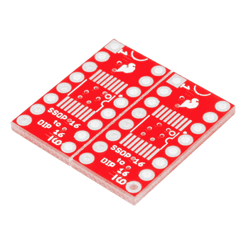](https://www.sparkfun.com/products/13994) 

将**添加到您的[购物车](https://www.sparkfun.com/cart)中！**

### [SparkFun SSOP 转 DIP 适配器- 16 针](https://www.sparkfun.com/products/13994)

[In stock](https://learn.sparkfun.com/static/bubbles/ "in stock") BOB-13994

SparkFun 16 引脚 SSOP 转 DIP 适配器是一款小型 PCB，可让您将 SSOP 封装转换为 DIP 封装。这些小博…

$3.50[Favorited Favorite](# "Add to favorites") 6[Wish List](# "Add to wish list")** **这种适配器的更新版本是双 PCB 阵列——如果你要适配一个芯片，你可能要适配多个芯片。PCB 很容易突然分开，形成两块独立的电路板。

棋盘上的 SSOP-16 土地格局也较其前身有所改进。首先，SSOP 和 DIP 引脚编号匹配，两个封装从各自的引脚 1 开始逆时针计数。该板还采用标准的 0.3 英寸宽 DIP 封装。焊盘非常长，可容纳 3.9 毫米、4.4 毫米和 5.3 毫米的封装宽度。它们位于 0.635 毫米中心，但是，仔细安装后，0.65 毫米引线的 IC 也将适用。对于 IC 周围没有额外间隙的情况，电路板完全包含在 DIP 轮廓内。最后，如果你让两个焊盘断开，SSOP-14 封装也适合。

[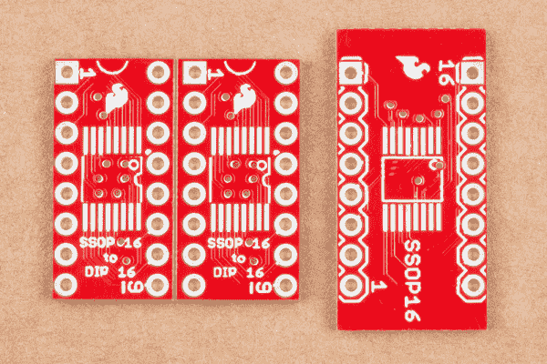](https://cdn.sparkfun.com/assets/learn_tutorials/5/4/4/SSOP16_Board_Hookup_Guide-02.jpg)Old Vs New

### 推荐阅读

如果你对某个话题不熟悉，可以看看下面的链接。

*   [PCB 基础知识](https://learn.sparkfun.com/tutorials/pcb-basics)
*   [集成电路](https://learn.sparkfun.com/tutorials/integrated-circuits)
*   [SMD 封装外形创建教程](https://learn.sparkfun.com/tutorials/designing-pcbs-smd-footprints)
*   [如何使用试验板](https://learn.sparkfun.com/tutorials/how-to-use-a-breadboard)
*   [贴片焊接](https://www.sparkfun.com/tutorials/107)

## 装配

组装适配器相当简单，但是有几个技巧可以使它变得更容易。

### 材料

要构建一个适配器，您需要以下组件。

*   一个 SSOP-16 集成电路来适应。
*   从 [16 针 SSOP 到 DIP 适配器板](https://www.sparkfun.com/products/13994)。
*   有的[折断公头](https://www.sparkfun.com/products/116)或[翻销](https://www.sparkfun.com/products/14085)。
*   一些焊料，要么[含铅](https://www.sparkfun.com/products/9161)要么[无铅](https://www.sparkfun.com/products/9325)。
*   液态或笔式涂敷器中的助焊剂。
*   [焊芯](https://www.sparkfun.com/products/8775)，帮助清理多余的焊料。

### 工具

还推荐使用以下工具。

*   一个带有[尖端](https://www.sparkfun.com/products/10721)的[烙铁](https://www.sparkfun.com/products/11704)。
*   放大镜或[放大镜](https://www.sparkfun.com/products/9316)。
*   [交叉锁紧](https://www.sparkfun.com/products/12572)镊子。
*   一个[无焊试验板](https://www.sparkfun.com/products/12043)，用作装配夹具。

## 构建适配器

### 将木板分开

板的阵列在制造时被划线。如果你顺着刻痕弯下去，木板很容易断裂。

Snap Apart

### 准备焊接

最简单的方法是在安装接头之前将 IC 焊接到位，这样就不必在突出的引脚周围工作。

如果这是你第一次焊接表面贴装集成电路，耐心和稳定的手是良好焊点的关键。

*   整洁很重要——你要放上足够的焊料将引脚连接到焊盘，但不要太多，以免相邻的引脚意外桥接。
*   动作要快——如果你把热烙铁放在电路板上太久，就有可能烧掉电路板上的走线和焊盘。当你把焊料涂在烙铁上时，你希望烙铁处于焊料几乎立即流动的温度。有点违反直觉的是，较热的熨斗比较冷的熨斗损害更小——让熨斗处于较热的温度可以让你工作得更快，减少潜在的损害。

### 将 IC 焊接到位

为了安装集成电路，我们将使用一种称为“拖拉焊接”的技术在拖拉焊接中，我们将一滴焊料拖过 IC 引脚，在经过时在每个引脚上沉积一些。如果拖后焊锡太多，我们会用灯芯去除。

Before we show you how to drag solder, we want to emphasize the need for flux before starting, and the likelihood that you'll need some solder wick to clean up excess solder.

首先，在 PCB 上涂助焊剂。助焊剂清除焊盘上的氧化薄层，使熔化的焊料流到焊盘上。

[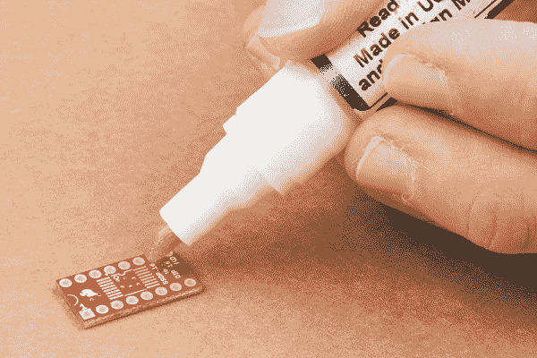](https://cdn.sparkfun.com/assets/learn_tutorials/5/4/4/SSOP16_Board_Hookup_Guide-05.jpg)*Applying Flux.*

IC 的引脚 1 通常在 IC 体上有一个小凹痕或凹口。将这些标记与 PCB 丝网印刷中的相应标记对齐。丝网印刷实际上有三个标记:IC 一端的凹口、IC 轮廓内的点和 IC 外的点(IC 焊接后仍可见)。

首先，将少量焊料流到 SSOP 封装对角的焊盘上。

[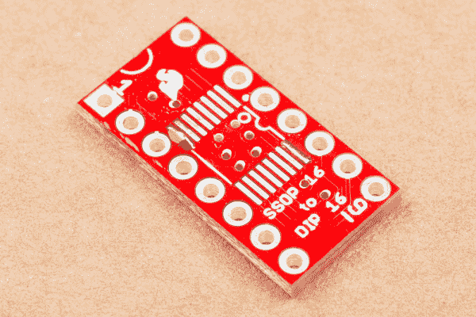](https://cdn.sparkfun.com/assets/learn_tutorials/5/4/4/SSOP16_Board_Hookup_Guide-06.jpg)*Solder on opposing corners.*

用镊子夹住 IC，将其定位在封装上方。重新加热上一步中的一个焊点，使 IC 引线附着在上面。焊料应该流到 IC 引脚上，将器件固定到位。在焊料冷却之前，将 IC 向下压平。

然后在另一条腿上重复这一步骤，以便在接下来的焊接操作中固定 IC。

[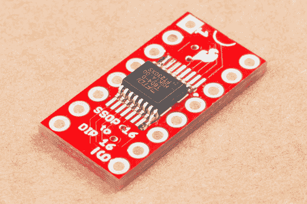](https://cdn.sparkfun.com/assets/learn_tutorials/5/4/4/SSOP16_Board_Hookup_Guide-07.jpg)*Corners tacked in place.*

当它就位后，再次检查其余的引脚是否与其焊盘合理对齐。如果位置需要调整，重新加热一个角，然后移动 IC。

如果你很小心，有一个精致的烙铁，你可以绕过芯片，单独焊接每一根引线。

当然，我们并不特别讲究。与 SSOP 的引线间距相比，我们的烙铁尖端非常巨大，因此我们将使用一种不同的技术，称为*拖拉焊接*。

要开始拖拉焊接，用烙铁加热一个针，然后在上面流一滴焊料。一旦焊料流动，用烙铁将熔滴拖过剩余的引线。

[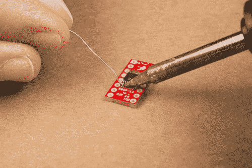](https://cdn.sparkfun.com/assets/learn_tutorials/5/4/4/unnamed.gif)*Drag Soldering.*

当你拖动斑点时，它会将每个大头针粘附到相应的焊盘上。

当您到达引脚线的末端时，可能会留下一些斑点，并且可能会有一些多余的焊料桥接相邻的引脚。

[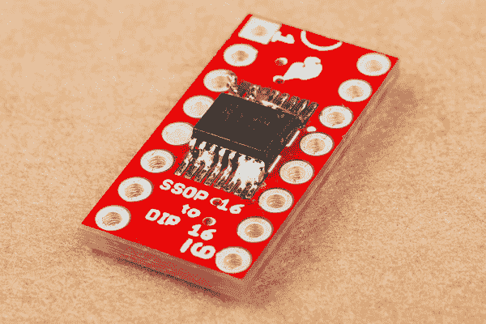](https://cdn.sparkfun.com/assets/learn_tutorials/5/4/4/SSOP16_Board_Hookup_Guide-08.jpg)*Excess between leads.*

用焊芯把这些清理干净。

[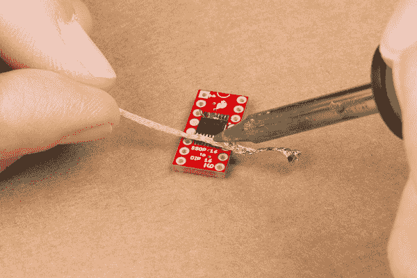](https://cdn.sparkfun.com/assets/learn_tutorials/5/4/4/SSOP16_Board_Hookup_Guide-09.jpg)*.*

在 IC 的另一侧重复该过程。

当你完成后，花点时间检查你的工作。检查每条引线下方的焊盘是否有焊脚，以及引线是否与相邻引线短路。一旦引脚被焊接上，就很难修改了。

### 焊接接头引脚

随着集成电路的到位，现在你可以焊接引脚。我们将演示如何使用普通的断摆接头和翻转销。翻转引脚是特殊引脚，其尺寸和形状与普通 DIP-IC 引脚相同。它们比普通的方形插头更适合安装在试验板和 IC 插座中。

#### 常规标题

如果你有一个夹具，可以在焊接时固定住引脚，那么在常规接头中焊接会更容易。原来，一个无焊试验板有一堆正确排列的孔！

首先从头部断开 8 针部分。将它们插入试验板，相隔两排。

[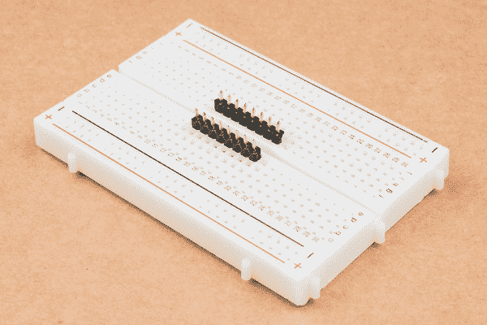](https://cdn.sparkfun.com/assets/learn_tutorials/5/4/4/SSOP16_Board_Hookup_Guide-12.jpg)Pin in Breadboard

将 PCB 安装在接头上。注意保持针脚上下对齐。

[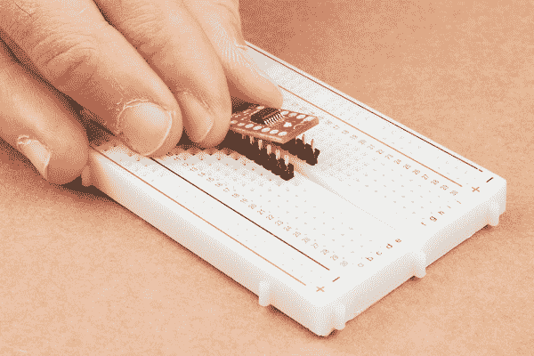](https://cdn.sparkfun.com/assets/learn_tutorials/5/4/4/SSOP16_Board_Hookup_Guide-13.jpg)PCB On Pins

沿着 PCB 走，从电路板顶部焊接每个引脚。

#### 翻转销

翻转销包装在黑色塑料罩中，这使它们在安装前保持对齐。护罩也可用作装配夹具。

[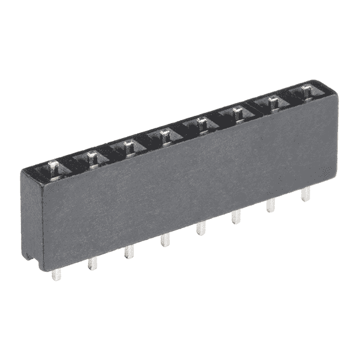](https://cdn.sparkfun.com/assets/parts/1/1/9/5/0/14085-01.jpg)*Flip Pins.*

首先，在你的工作台上竖起两组翻转销。然后将 PCB 放在引脚上。翻转引脚上的尾部与 PCB 的厚度一样长，它们不会伸出 PCB。

*Assembling flip pins.*

沿着电路板，焊接每个引脚。注意保持销与工作台顶部平面垂直对齐。一旦引脚焊接完毕，小心地将塑料引脚对齐器滑下，露出 ic 型引脚。

[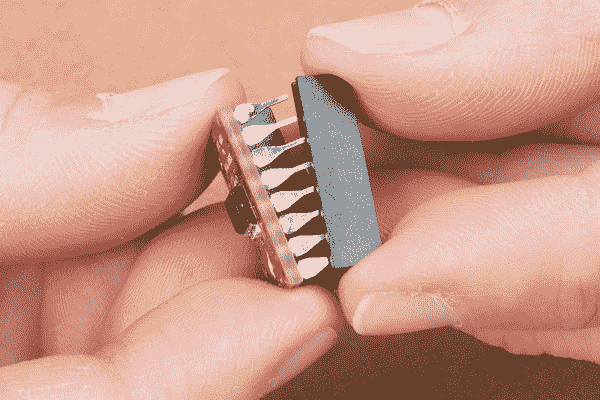](https://cdn.sparkfun.com/assets/learn_tutorials/5/4/4/SSOP16_Board_Hookup_Guide-15.jpg)*Revealing the pins.*

### 去焊药

一旦你完成焊接，看看焊点。如果它们表面或周围有黄色或棕色的涂层，则电路板上有助焊剂残留物(在放大镜下，它可能看起来像琥珀或烧焦的糖)。焊剂是酸性的，会导致长期可靠性的问题，所以最好将其清除。

你必须检查你的焊料的文档，以获得正确的清洗方法。有些助焊剂是水溶性的，而有些则需要异丙醇或丙酮等溶剂。

[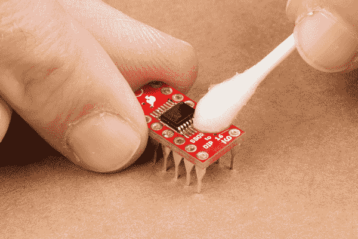](https://cdn.sparkfun.com/assets/learn_tutorials/5/4/4/SSOP16_Board_Hookup_Guide-18.jpg)*Defluxing.*

### 核实

在我们开始应用 SSOP 转双列直插式适配器板之前，让我们花点时间仔细检查一下我们的工作。

快速的目视检查有助于发现焊接桥或焊接点的不正常流动。这也是最后一次检查的好时机，以确保 SSOP 的第一针方向正确。

为了增加一点信心，你也可以在[导通模式](https://learn.sparkfun.com/tutorials/how-to-use-a-multimeter#continuity)下使用[万用表](https://learn.sparkfun.com/tutorials/how-to-use-a-multimeter)来验证 SSOP 的腿连接到焊盘，但没有桥接到它们的邻居。

[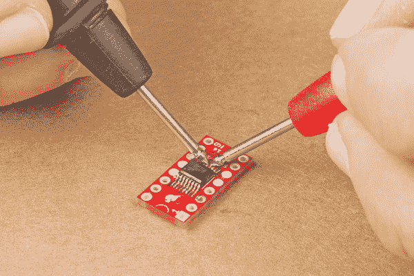](https://cdn.sparkfun.com/assets/learn_tutorials/5/4/4/SSOP16_Board_Hookup_Guide-11.jpg)*Continuity check.*

## 使用适配器

### 适配器方向

DIP 封装的引脚相对于 SSOP 的引脚旋转 90°。我们在[装配](https://learn.sparkfun.com/tutorials/ssop-16-to-dip-adapter-hookup-guide#assembly)部分覆盖了 SSOP 的 pin-1 标记。

DIP 封装的引脚 1 有两种标记方式。引脚 1 的焊盘是方形的，其他的是圆形的。它在衬垫附近的丝网印刷中也有一个小的`1`。

[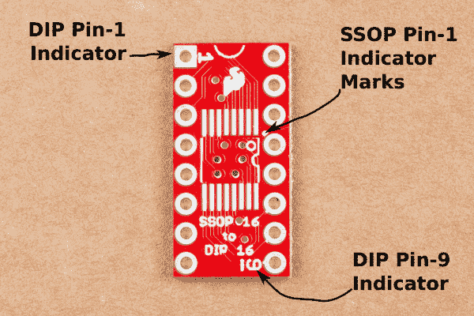](https://cdn.sparkfun.com/assets/learn_tutorials/5/4/4/top.png)Pin markings, top

引脚 1 和 9 也标在电路板底部丝网印刷的图例中。

Pin markings, bottom

### 个案研究

#### 在试验板上

当你想用只有 SSOP 才有的芯片制作试验板原型时，这个适配器很有用。它允许芯片适当地适合试验板的行。

[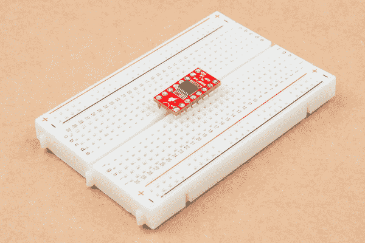](https://cdn.sparkfun.com/assets/learn_tutorials/5/4/4/SSOP16_Board_Hookup_Guide-19.jpg)Breadboard Example

#### 升级旧设备

SSOP 转双列直插式适配器的另一个常见用途是升级或改造现有设备...或者，就像在这种情况下，当您购买了带有错误足迹的组件时，节省您的熏肉。

我们正在修复一个旧的 [SparkFun 函数生成器套件](https://www.sparkfun.com/products/retired/10015)，需要一个 74HC04 逻辑芯片。当我们订购时，我们没有仔细阅读说明，我们得到了一个 14 针 SSOP 集成电路。不幸的是，它需要适合电路板上的 DIP 封装。谢天谢地，我们有一个适配器板来帮助。

[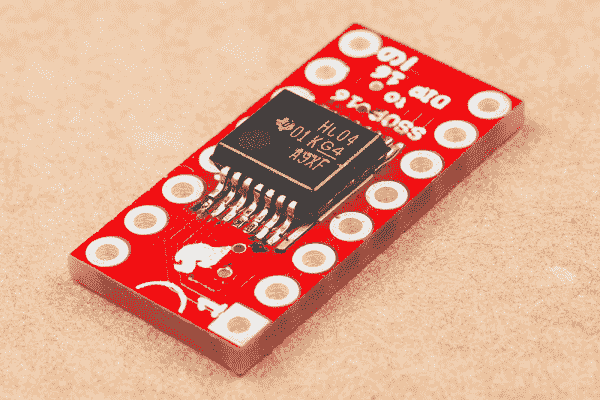](https://cdn.sparkfun.com/assets/learn_tutorials/5/4/4/SSOP16_Board_Hookup_Guide-20.jpg)*14 pins in a 16-pin adapter.*

如果你仔细观察，你会注意到上面照片中的两件事:首先，IC 在 16 针适配器板上只有 14 针。第二，这是一个比我们在其他例子中看到的更广泛的 SSOP 包。幸运的是，PCB 上的焊盘图形有超长的焊盘来容纳它。

[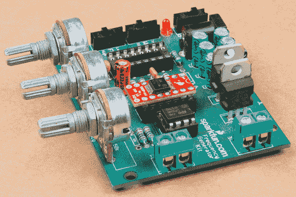](https://cdn.sparkfun.com/assets/learn_tutorials/5/4/4/SSOP16_Board_Hookup_Guide-21.jpg)*Installed in socket.*

由于 PCB 已经有一个插座，我们选择在适配器上使用翻转引脚。我们在一个 16 针适配器上安装了一个 14 针芯片，所以我们选择在两个芯片上保持 1 针对齐。这也意味着芯片少了两个引脚，我们没有使用适配器上的引脚 8 和 9，适配器上的引脚 10 至 16 少了两个，连接到 IC 引脚 8 至 14。

## 资源和更进一步

### 资源

该板是现已退役的 [16 针 SSOP 双列直插式适配器](https://www.sparkfun.com/products/retired/498)的重新设计。

我们还提供许多其它表贴通孔转换板:

*   [20 针 SOIC 到 DIP 适配器](https://www.sparkfun.com/products/495)
*   [28 针 SOIC 到 DIP 适配器](https://www.sparkfun.com/products/496)
*   [8 针 SSOP 到 DIP 适配器](https://www.sparkfun.com/products/497)
*   [20 针 SSOP 到 DIP 适配器](https://www.sparkfun.com/products/499)
*   [28 针 SSOP 到 DIP 适配器](https://www.sparkfun.com/products/500)
*   [SOT23 至 DIP 适配器](https://www.sparkfun.com/products/717)
*   [8 针 SOIC 到 DIP 适配器](https://www.sparkfun.com/products/13655)，它也有自己的[连接导轨](https://learn.sparkfun.com/tutorials/8-pin-soic-to-dip-adapter-hookup-guide)。

对于适配器上的支腿，我们有两种选择。

*   [分离式 0.1 英寸接头](https://www.sparkfun.com/products/116)
*   翻转销。虽然我们没有 16 针的翻转针组，但是你可以使用两个 [8 针组](https://www.sparkfun.com/products/14085)，或者一个 [20 针](https://www.sparkfun.com/products/14087)组中的 16 针。

### 更进一步

如果你对 IC 封装的历史感兴趣，请查看关于封装类型的维基百科文章。**