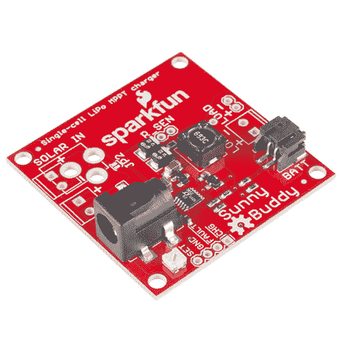
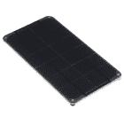
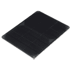
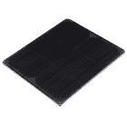
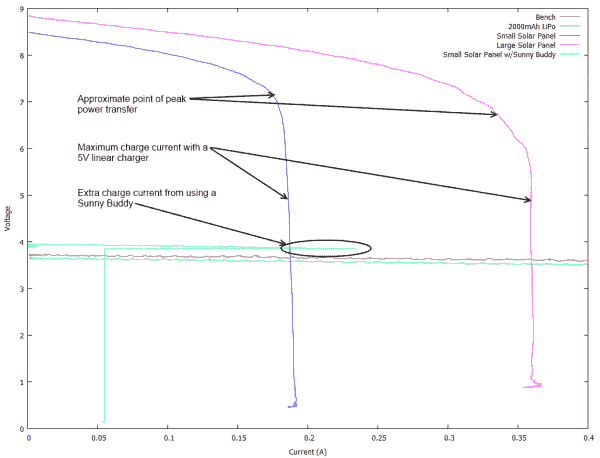
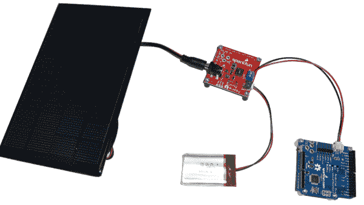
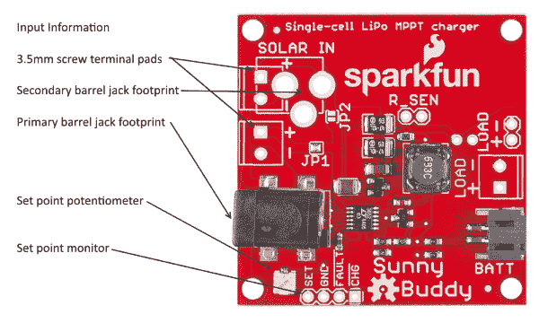
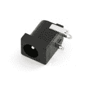
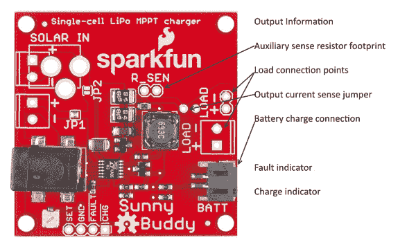

# 阳光伙伴太阳能充电器 V13 连接指南

> 原文：<https://learn.sparkfun.com/tutorials/sunny-buddy-solar-charger-v13-hookup-guide->

## 介绍

**Heads up!** If you have an older version of the Sunny Buddy ([V1.0](https://www.sparkfun.com/products/12084) and older), please refer to [this hookup guide](tutorials/170). For V1.3 and beyond, continue reading. Check the back of the board for the version number.

* * *

[Sunny Buddy](https://www.sparkfun.com/products/12885) 是一款小型最大功率点跟踪太阳能充电器，用于单节脂肪电池。

 

将**添加到您的[购物车](https://www.sparkfun.com/cart)中！**

### [SparkFun 阳光巴迪- MPPT 太阳能充电器](https://www.sparkfun.com/products/12885)

[In stock](https://learn.sparkfun.com/static/bubbles/ "in stock") PRT-12885

这是阳光伙伴，一个最大功率点跟踪(MPPT)太阳能充电器的单细胞脂肪电池。这个 MPPT 太阳能…

$28.9510[Favorited Favorite](# "Add to favorites") 71[Wish List](# "Add to wish list")** **本教程将帮助你了解什么是阳光伙伴，为什么它有用，以及如何使用它。

### 所需材料

阳光小伙伴没有配角什么都做不了。将阳光伙伴与这些伙伴配对，使其发挥作用:

*   太阳能电池板 -大多数电池板都应该工作，只要确保它们产生的输出电压在 **6-20V** 之间。我们的[大](https://www.sparkfun.com/products/7840)和[大](https://www.sparkfun.com/products/9241)面板会工作。我们的[小](https://www.sparkfun.com/products/7845)面板可以工作，如果你把它们串联起来的话(详情见“连接”页面)。下面的面板有一个正中央的桶形插孔，可以轻松地直接插入 Sunny Buddy。

     

    ### [太阳能电池板- 3.5W](https://www.sparkfun.com/products/retired/13782)

    [Retired](https://learn.sparkfun.com/static/bubbles/ "Retired") PRT-13782

    有一个项目需要一些好的动力？你喜欢我们的朋友孙先生提供的免费电源吗？看看这个高质量的…

    1 **Retired**[Favorited Favorite](# "Add to favorites") 17[Wish List](# "Add to wish list") 

    ### [太阳能电池板- 6W](https://www.sparkfun.com/products/retired/13783)

    [Retired](https://learn.sparkfun.com/static/bubbles/ "Retired") PRT-13783

    有一个项目需要一些好的动力？你喜欢我们的朋友孙先生提供的免费电源吗？看看这个高质量的…

    2 **Retired**[Favorited Favorite](# "Add to favorites") 9[Wish List](# "Add to wish list") 

    将**添加到您的[购物车](https://www.sparkfun.com/cart)中！**

### [太阳能电池板- 9W](https://www.sparkfun.com/products/13784)

    [Only 9 left!](https://learn.sparkfun.com/static/bubbles/ "only 9 left!") PRT-13784

    有一个项目需要一些好的动力？你喜欢我们的朋友孙先生提供的免费电源吗？看看这个高质量的…

    $84.95 $80.701[Favorited Favorite](# "Add to favorites") 22[Wish List](# "Add to wish list")**

****Heads up!** Under real world conditions, the Sunny Buddy may not be able to charge a LiPo battery sufficiently with the [small 2W](https://www.sparkfun.com/products/13781) solar panel. The Sunny Buddy's output charge current measured was about *7mA* since the small 2W solar panel was not able to reach the minimum input voltage requirements by itself. We recommend using a larger solar panel like the [3.5W](https://www.sparkfun.com/products/13782), [6W](https://www.sparkfun.com/products/13783), or [9W](https://www.sparkfun.com/products/13784) solar panels to achieve the Sunny Buddy's minimum voltage input requirements.

*   **脂电池**(单电池)——“阳光伙伴”打算给单个聚合物锂离子电池充电。LiPo 有各种形状和尺寸，我们建议您使用容量大于 450mAh 的(例如 [850mAh](https://www.sparkfun.com/products/341) 、 [1000mAh](https://www.sparkfun.com/products/339) 或 [2000mAh](https://www.sparkfun.com/products/8483) )。像这样的电池，带有 JST 终端，将直接插入阳光伙伴。450mAh 大小的建议是由于阳光伙伴的充电速率-大多数脂肪细胞不喜欢充电速度超过其等效容量。

     

    将**添加到您的[购物车](https://www.sparkfun.com/cart)中！**

### [锂离子电池-1Ah](https://www.sparkfun.com/products/13813)

    [In stock](https://learn.sparkfun.com/static/bubbles/ "in stock") PRT-13813

    基于锂离子化学的超薄超轻电池。每个电池在 1000 毫安时输出 3.7V 的标称电压！

    $10.958[Favorited Favorite](# "Add to favorites") 75[Wish List](# "Add to wish list")**** 

    将**添加到您的[购物车](https://www.sparkfun.com/cart)中！**

### [锂离子电池- 850mAh](https://www.sparkfun.com/products/13854)

    [In stock](https://learn.sparkfun.com/static/bubbles/ "in stock") PRT-13854

    这是基于锂离子化学的非常薄、非常轻的电池。每个电池在 850℃时输出 3.7V 的标称电压…

    $10.952[Favorited Favorite](# "Add to favorites") 17[Wish List](# "Add to wish list")**** 

    将**添加到您的[购物车](https://www.sparkfun.com/cart)中！**

### [锂离子电池- 2Ah](https://www.sparkfun.com/products/13855)

    [In stock](https://learn.sparkfun.com/static/bubbles/ "in stock") PRT-13855

    这是基于锂离子化学的非常薄、非常轻的电池。每个电池在 200 伏时输出一个标称的 3.7 伏电压…

    $13.959[Favorited Favorite](# "Add to favorites") 43[Wish List](# "Add to wish list")**** 

    将**添加到您的[购物车](https://www.sparkfun.com/cart)中！**

### [锂离子电池- 6Ah](https://www.sparkfun.com/products/13856)

    [In stock](https://learn.sparkfun.com/static/bubbles/ "in stock") PRT-13856

    如果你需要一些果汁，这 6Ah 锂离子电池是给你的。这些是基于锂离子化学电池的非常紧凑的电池…

    $32.507[Favorited Favorite](# "Add to favorites") 40[Wish List](# "Add to wish list")********

 *********   **一个负载** -你的电池要给*什么的*供电，对吧？你的负载可以是任何东西，从 [LED](https://learn.sparkfun.com/tutorials/light-emitting-diodes-leds) 到 [Arduino 驱动的机器人](https://learn.sparkfun.com/tutorials/getting-started-with-the-redbot)。

### 推荐阅读

在深入研究本连接指南之前，您可能会发现其他一些有用的教程:

*   [电池](https://learn.sparkfun.com/tutorials/battery-technologies) -查看电池教程，帮助理解为什么阳光伙伴只使用脂肪电池。
*   [电力基础知识](https://learn.sparkfun.com/tutorials/voltage-current-resistance-and-ohms-law) -回顾一下电流和电压如何结合向负载传输电力可能会有所帮助。
*   如何为你的项目提供动力 -太阳能和电池只是为你的项目提供动力的众多方式之一。一定要考虑到所有的可能性！
*   [电压、电流、电阻和欧姆定律](https://learn.sparkfun.com/tutorials/voltage-current-resistance-and-ohms-law)了解欧姆定律，所有电气工程中最基本的方程式之一。[最爱 最爱](# "Add to favorites")132 [### 电池技术](https://learn.sparkfun.com/tutorials/battery-technologies) 便携式电子设备使用的电池背后的基础:LiPo、NiMH、纽扣电池、碱性。[喜爱的 喜爱的](# "Add to favorites")50 [### 如何为项目提供动力](https://learn.sparkfun.com/tutorials/how-to-power-a-project) 一个帮助你算出项目电源需求的教程。[喜欢的 喜欢的](# "Add to favorites")67

## 为什么是 MPPT？

阳光伙伴是一个最大功率点转移(MPPT)太阳能充电器。这有什么关系？是什么让它值得出现在赛道上？答案就在眼前。

#### 电池如何充电

电池充电是电流相关动作，而不是电压相关动作。电池充电器监控流入电池的电流，并将其限制在某个设定值，选择该值是为了防止损坏电池。理想的电池充电器会向电池提供尽可能多的电流，但不会超过电池的处理能力。

#### 电源行为

考虑一下最后一句话的第一部分:“尽可能多地从电源汲取电流。”我从五个不同的电源收集了一些数据:一个 2000 mAh 的 LiPo 电池(T1)，一个台式电源，我们的 T2 小型太阳能电池(T3)，我们的 T4 大型太阳能电池(T5)，以及在科罗拉多州阳光充足的情况下(尽管是在隆冬)连接到小型电池的阳光伙伴。

-> 

*That's some mighty fine data!*

该图表比较了上述五种电源的输出电压与负载电流:简而言之，每种电源能够提供多少电流。为了进行某种基线比较，请注意工作台电源、电池和 Sunny Buddy 的输出相当平稳。你可以清楚地看到，在大约 240 毫安时，阳光伙伴不再能够安全地从太阳能电池中获取更多的电流。在充电应用中，这是它应该进入并给电池充电的点。由于我主动增加了负载以增加电源的压力，它折叠回较低的电压，以优雅地处理过度的负载，而不会突然起火。

然而，太阳能电池的行为完全不同。它们缓慢下降，直到达到某一点，然后迅速下降，直到电流消耗的微小增加都会导致输出电压骤降。曲线上有一个点，在“拐点”区域，传递给负载的功率达到峰值。这个点被称为最大功率点，对太阳能电池发挥最大效率至关重要。

找到那个点是这里的关键。在低光照条件下，太阳能电池曲线将沿 X 轴压缩，并且，尽管空载电压即使在低光照条件下也可能保持相当高，但是可以从电池汲取的电流量随着可用光量的增加而迅速减少。

阳光伙伴锁定曲线上的那个点，拉动电池将提供的最大电流，但不会更多，并将其转化为充电电流。图表中的圆圈区域显示了这一点:小型太阳能电池可以提供的最高电流约为 180mA，但 Sunny Buddy 在进入电流限制之前推出了 240mA。这是一个额外的 33%以上的充电电流为您的电池提供可比的 5V 充电器。

#### 效率

任何电源系统的效率都可以说是输出功率与输入功率之比。这是 Sunny Buddy 优于可比线性解决方案的另一个地方。

阳光哥们是开关电源；输出功率由公式`Pout = Pin * Efficiency`给出。阳光伙伴的效率在测试中反复测量为 80%左右。

让我们考虑一个线性解。为了避免过于深入图表的陡峭区域，我们将充电电流设置为 160mA。为了计算输出效率，我们将输出功率除以输入功率。查看太阳能电池曲线上的电压，我们看到，对于 160mA，输出电压约为 7V；因此，输入功率为`7V * 160mA = 1142mW`。输出功率为`4.2V * 160mA = 672mW`。这是充电电压乘以充电电流的近似值。效率是输入功率大于输出功率:`672/1142 = 59%`。最好的情况是，这是你正在使用的电池产生的电能的百分比。当电池电压低于 4.2V 时，它实际上会更低，这将超过大部分充电范围。

在这里，阳光伙伴再次获胜:它使用了(至少)20%以上的太阳能电池可用电力。

#### 阴天

但是，当太阳走到云后面时，我们的线性电荷电路会发生什么呢？正如我前面提到的，随着可用太阳能的减少，图表沿着 X 轴压缩。如果这个陡峭的区域低于充电器的设定电流，事情就会变得很快。可用电压骤降，充电器停止工作。

我们可以通过以下方法来解决这个问题:首先设置一个较低的充电电流，这并不理想，因为这意味着在一个阳光明媚的好天气里，如果太阳能电池负载不够重，你会损失大量的潜在太阳能；或者通过将我们的充电电流伺服到电压，根据电池电压降低或增加它。虽然这听起来很简单，但实际上非常复杂。

#### 进入阳光伙伴

Sunny Buddy 就是这么做的:它监控电池电压，当电压下降表明电池被推得有点太远时，它就会停止汲取电流。此外，由于 Sunny Buddy 使用交换拓扑而不是线性拓扑，因此它比任何线性解决方案都具有更高的效率。

## 连接起来

将 Sunny Buddy 嵌入项目时，需要考虑三个部分:

*   太阳能电池板输入
*   电池输出
*   负荷

### 太阳能电池板输入

Sunny Buddy 的输入端安装了一个普通的桶形插孔。

下面的太阳能电池板可以轻松直接插在 Sunny Buddy 的母筒插孔上。

 

### [太阳能电池板- 3.5W](https://www.sparkfun.com/products/retired/13782)

[Retired](https://learn.sparkfun.com/static/bubbles/ "Retired") PRT-13782

有一个项目需要一些好的动力？你喜欢我们的朋友孙先生提供的免费电源吗？看看这个高质量的…

1 **Retired**[Favorited Favorite](# "Add to favorites") 17[Wish List](# "Add to wish list") 

### [太阳能电池板- 6W](https://www.sparkfun.com/products/retired/13783)

[Retired](https://learn.sparkfun.com/static/bubbles/ "Retired") PRT-13783

有一个项目需要一些好的动力？你喜欢我们的朋友孙先生提供的免费电源吗？看看这个高质量的…

2 **Retired**[Favorited Favorite](# "Add to favorites") 9[Wish List](# "Add to wish list") 

将**添加到您的[购物车](https://www.sparkfun.com/cart)中！**

### [太阳能电池板- 9W](https://www.sparkfun.com/products/13784)

[Only 9 left!](https://learn.sparkfun.com/static/bubbles/ "only 9 left!") PRT-13784

有一个项目需要一些好的动力？你喜欢我们的朋友孙先生提供的免费电源吗？看看这个高质量的…

$84.95 $80.701[Favorited Favorite](# "Add to favorites") 22[Wish List](# "Add to wish list")******Heads up!** Under real world conditions, the Sunny Buddy may not be able to charge a LiPo battery sufficiently with the [small 2W](https://www.sparkfun.com/products/13781) solar panel. The Sunny Buddy's output charge current measured was about *7mA* since the small 2W solar panel was not able to reach the minimum input voltage requirements by itself. We recommend using a larger solar panel like the [3.5W](https://www.sparkfun.com/products/13782), [6W](https://www.sparkfun.com/products/13783), or [9W](https://www.sparkfun.com/products/13784) solar panels to achieve the Sunny Buddy's minimum voltage input requirements.

此外，还有用于将[3.5 毫米螺丝端子](https://www.sparkfun.com/products/8084)或额外的[桶形千斤顶](https://www.sparkfun.com/products/119)连接至电路板的额外尺寸。

 

将**添加到您的[购物车](https://www.sparkfun.com/cart)中！**

### 螺距 3.5mm 的螺丝端子(2 针)

[In stock](https://learn.sparkfun.com/static/bubbles/ "in stock") PRT-08084

将端子 3.5 毫米节距销与滑动锁紧装置拧在一起，形成您需要的任何尺寸。额定高达 125V @ 6A，并可接受…

$1.05[Favorited Favorite](# "Add to favorites") 23[Wish List](# "Add to wish list")**** 

将**添加到您的[购物车](https://www.sparkfun.com/cart)中！**

### [DC 桶形电源插孔/连接器](https://www.sparkfun.com/products/119)

[In stock](https://learn.sparkfun.com/static/bubbles/ "in stock") PRT-00119

DC 电源插座/连接器。这是一个普通的筒式电源插座，用于 DC 墙壁用品。这些与我们的 DC 墙兼容…

$1.502[Favorited Favorite](# "Add to favorites") 22[Wish List](# "Add to wish list")**** ****请注意，如果您打算使用两块太阳能电池板，您**必须**清除焊接跳线 **JP1** (默认情况下关闭)，并关闭焊接跳线 JP2(默认情况下打开)。如果做不到这一点，将会导致第二个电源断开。如果*的两个*跳线都没有连接，则不会向电路板供电。如果两个跳线都*短路*，第二个面板将会短路，不会为系统供电，但可能会因短路而损坏。

电路板的最大建议输入为**20V**；这是我们两个面板的堆叠。最低是 **6V** ，但大多数太阳能电池板应该在这个以上。

监控单板系统输入电流的一个有用技巧是打开 JP1 并关闭 JP2，然后[在两个 3.5 毫米封装上的 **+** 焊盘之间连接一个安培计](https://learn.sparkfun.com/tutorials/how-to-use-a-multimeter#measuring-current)。这将允许您监控太阳能电池板的电流消耗。**请注意，在试图使用没有安装计价器的 SunnyBuddy 之前，JP1 必须重新销售，JP2 必须重新开放！**

### 设置输入电流限值

修改后的 Sunny Buddy 有一个输入设定点电位计。这允许用户设置输入电压，在该电压下，Sunny Buddy 将降低其电流消耗，以保持太阳能电池板的峰值功率输入。

当太阳能电池板处于我们在**中讨论的“拐点”电压时，你会希望这个节点的电压为 2.7V。为什么是 MPPT？**上一节。一些太阳能电池制造商可能会给你这些信息；然而，我们面板的制造商却没有。你可以选择困难的方式来描述你的细胞(ick ),或者选择简单的方式，做出一个有根据的猜测，MPPT 点将会是你在阳光充足时看到的电压的 90%。

为了找到这一点，将你的太阳能电池板插入阳光伙伴，但不要放电池或负载在上面。测量从“设置”垫到第二个“GND”垫的电压，并调整电位计，直到电压大约为 3V。在这一点上，阳光伙伴将汲取电流，直到 450mA 流向负载和电池**或**太阳能电池电压为其全太阳开路额定电压的 90%。

### 电池输出

Sunny Buddy 的输出旨在为单个聚合物锂离子电池充电。一个 2 针 JST 连接器被填充，并将匹配 SparkFun 销售的大多数 LiPo 电池。负载应与电池并联；此外，还提供了 3.5 毫米端子或标准 0.1 英寸间距接头的尺寸。

充电电流由原理图中的电阻 R1 设定。默认情况下，它被设置为最大充电电流**450 毫安**。建议电池充电不要超过其额定容量；因此，阳光伙伴应该充电的最小电池是 450 毫安时。

修改后的 Sunny Buddy 增加了一个与内置电阻并联的额外检测电阻。充电电流等于. 1/(R1 | | RSen)；在 Rsen 焊盘上放置一个 1 欧姆的电阻会将充电电流增加到约 550mA。如果需要低于 450mA 的充电电流，可以将 R1 从电路板上拆下。

请注意，有可能将充电电流设置为不可能的水平。如果电流水平过高，电感会饱和，从而人为限制输出电流。

最后，请注意，电路板上有一个跳线，可以切断，以便监控充电器的输出电流。完成测量后，您需要重新连接跳线垫。

### 负载

负载可以连接到电路板右边缘上间隔 0.1 英寸或 3.5 毫米的焊盘。

 

将**添加到您的[购物车](https://www.sparkfun.com/cart)中！**

### [破开头球——直击](https://www.sparkfun.com/products/116)

[In stock](https://learn.sparkfun.com/static/bubbles/ "in stock") PRT-00116

一排标题-打破适应。40 个引脚，可切割成任何尺寸。用于定制 PCB 或通用定制接头。

$1.7520[Favorited Favorite](# "Add to favorites") 133[Wish List](# "Add to wish list")**** 

将**添加到您的[购物车](https://www.sparkfun.com/cart)中！**

### [LED 条形尾纤连接器(2 针)](https://www.sparkfun.com/products/14574)

[In stock](https://learn.sparkfun.com/static/bubbles/ "in stock") CAB-14574

这些 2 针 JST-SM 尾纤连接器与 LED 灯条和其他只需要两条线路和一根引线的应用完美匹配

$1.05[Favorited Favorite](# "Add to favorites") 8[Wish List](# "Add to wish list")**** 

将**添加到您的[购物车](https://www.sparkfun.com/cart)中！**

### [女标题](https://www.sparkfun.com/products/115)

[In stock](https://learn.sparkfun.com/static/bubbles/ "in stock") PRT-00115

单排 40 孔，内螺纹接头。可以用一把钢丝钳切割成合适的尺寸。标准 0.1 英寸间距。我们广泛使用它们…

$1.758[Favorited Favorite](# "Add to favorites") 71[Wish List](# "Add to wish list")**** 

将**添加到您的[购物车](https://www.sparkfun.com/cart)中！**

### 螺距 3.5mm 的螺丝端子(2 针)

[In stock](https://learn.sparkfun.com/static/bubbles/ "in stock") PRT-08084

将端子 3.5 毫米节距销与滑动锁紧装置拧在一起，形成您需要的任何尺寸。额定高达 125V @ 6A，并可接受…

$1.05[Favorited Favorite](# "Add to favorites") 23[Wish List](# "Add to wish list")******** ********重要的是负载不能太重；由于它与电池并联，所以在工作时，它会从电池中窃取一些充电电流。

为了避免这种情况，[考虑尽可能让有源电路休眠](https://learn.sparkfun.com/tutorials/reducing-arduino-power-consumption)，或者使用微控制器在不需要时打开或关闭部分负载。这样做的方法超出了本教程的范围。

## 资源和更进一步

如果你想从你的阳光伙伴身上得到更多，一定要先看看这些资源:

*   [阳光伙伴示意图](https://cdn.sparkfun.com/datasheets/Prototyping/SunnyBuddyv10.pdf) -阳光伙伴示意图的 PDF。
*   [Sunny Buddy Eagle 文件](https://cdn.sparkfun.com/datasheets/Prototyping/SunnyBuddyv10.zip)-PCB 设计文件。
*   [LT3652 数据表](https://cdn.sparkfun.com/datasheets/Prototyping/LT3652.pdf) -你想知道的关于 Linear Tech LT3652 的一切，峰值功率跟踪，阳光伙伴的电池充电灵魂。
*   [Sunny Buddy GitHub Repo](https://github.com/sparkfun/SunnyBuddy) -您最新最棒设计文件的来源。

如果你正在为一个可以嵌入阳光伙伴的项目寻找一些灵感，请查看一些相关的教程和项目:

*   [GPS 基础知识](https://learn.sparkfun.com/tutorials/gps-basics) -如果你的项目在户外(如果你使用伙伴，这是一个安全的假设)，考虑给它添加 GPS。没你想的那么难！

     [### GPS 基础知识

    #### 2012 年 12 月 14 日](https://learn.sparkfun.com/tutorials/gps-basics) The Global Positioning System (GPS) is an engineering marvel that we all have access to for a relatively low cost and no subscription fee. With the correct hardware and minimal effort, you can determine your position and time almost anywhere on the globe.[Favorited Favorite](# "Add to favorites") 31
*   [无线连接到地下](https://learn.sparkfun.com/tutorials/weather-station-wirelessly-connected-to-wunderground)的气象站——阳光伙伴在保持这个[电动 Imp](https://www.sparkfun.com/products/11395) 驱动的无线气象站运转中起着重要作用。

 [### 无线连接到地下的气象站

#### 2014 年 4 月 11 日](https://learn.sparkfun.com/tutorials/weather-station-wirelessly-connected-to-wunderground) Build your own open-source, official Wunderground weather station that connects over WiFi via an Electric Imp.[Favorited Favorite](# "Add to favorites") 32

*   或者查看 SparkFun 的项目 spot light on[spark fun Rogue Router for a Solar Powered File Server](https://github.com/sparkfun/Rogue_Router)with ESP8266:

    [https://www.youtube.com/embed/xpUkHZlg948/?autohide=1&border=0&wmode=opaque&enablejsapi=1](https://www.youtube.com/embed/xpUkHZlg948/?autohide=1&border=0&wmode=opaque&enablejsapi=1)

你也可以看看这篇博文，了解更多想法:

 [### ATP:太阳能电池如何工作

September 10, 2018](https://www.sparkfun.com/news/2772 "September 10, 2018: Tired of paying The Man for your power? Before you go off-grid, this is the video you want to see. We'll give you the background on solar cell function and performance, and talk about some of the other parts you'll need to get the job done.")[Favorited Favorite](# "Add to favorites") 0 [### Enginursday: 3D 打印房屋固定装置

August 29, 2019](https://www.sparkfun.com/news/3081 "August 29, 2019: This summer I went on a tear setting up connected devices in my house with one goal; simplifying the mundane tasks of owning a house. The whole project has got me automating as much as I can, but also non-connected solutions are springing up as well. In this Enginursday, I build a roof over my new connected outdoor outlet.")[Favorited Favorite](# "Add to favorites") 0**************************