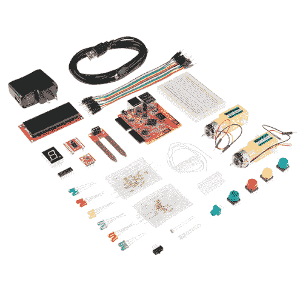

# 带 Tessel 2 的日出机器

> 原文：<https://learn.sparkfun.com/tutorials/sunrise-machine-with-the-tessel-2>

## 介绍

不久前，我开始渴望无论身在何处都能自动拍摄日出。我喜欢一个小机器的想法，它可以确定我所在位置的太阳何时升起，并拍摄一些延时照片。就这样诞生了日出机器的想法。

日出机器可以根据您的纬度和经度，使用基本的 USB 网络摄像头自动记录您所在位置的日出。它可以捕捉一段时间内的静态图像，并以 MPEG-4 和动画 GIF 格式制作延时电影。如果你愿意的话，它还可以代表你在推特上发布这些结果 gif。你可以配置它来记录不同的白天太阳事件——日落，太阳正午，黄金时间的开始，甚至是海上黄昏。如果你不喜欢的话，你可以不用发微博来发布结果，你也可以随时按下按钮来创建一个手动延时视频。所有静态图像和视频都存储在 USB 拇指驱动器上。

我用一本旧书为我的日出机器做了一个外壳。然而，你可以把你的放在任何你喜欢的地方，或者根本不需要围栏。

## 飞行前检查

如果这是你第一次尝试使用 [Tessel 2](https://learn.sparkfun.com/tutorials/experiment-guide-for-the-johnny-five-inventors-kit/about-the-tessel-2) ，有几样东西你应该先熟悉一下！我们建议在投入这个项目之前通读我们的[Tessel 2](https://learn.sparkfun.com/tutorials/getting-started-with-the-tessel-2)入门指南。

 [### 开始使用 Tessel 2

#### 2016 年 10 月 12 日](https://learn.sparkfun.com/tutorials/getting-started-with-the-tessel-2) Get your Tessel 2 up and running by blinking and LED, the Hello World of embedded electronics.[Favorited Favorite](# "Add to favorites") 1

### 深入探究 Tessel 2

如果你开始使用 Tessel 2，整个 [Johnny-Five Inventor's Kit 实验指南](https://learn.sparkfun.com/tutorials/experiment-guide-for-the-johnny-five-inventors-kit)充满了大量信息。本教程的相关实验包括[实验 4:读取按钮](https://learn.sparkfun.com/tutorials/experiment-guide-for-the-johnny-five-inventors-kit/experiment-4-reading-a-push-button)和[实验 8:驱动 RGB LED](https://learn.sparkfun.com/tutorials/experiment-guide-for-the-johnny-five-inventors-kit/experiment-8-driving-an-rgb-led) 。

 [### Johnny-Five 发明人工具包实验指南

#### 2016 年 6 月 28 日](https://learn.sparkfun.com/tutorials/experiment-guide-for-the-johnny-five-inventors-kit) Use the Tessel 2 and the Johnny Five Inventors kit to explore the world of JavaScript enabled hardware through 14 awesome experiments 8

## 材料

Johnny-Five Inventor 的工具包中包含了建造 Sunrise Machine 所需的大部分电子元件。

 

### [强尼-五发明家的工具箱](https://www.sparkfun.com/products/retired/13847)

[Retired](https://learn.sparkfun.com/static/bubbles/ "Retired") KIT-13847

Johnny-Five Inventor's Kit (J5IK)是您使用 Tessel 2 和 Johnny-Five pro……

9 **Retired**[Favorited Favorite](# "Add to favorites") 17[Wish List](# "Add to wish list")

除了工具包中的物品，你还需要一个 USB 摄像头，比如 [Creative Live！Cam Chat HD(亚马逊)](https://www.amazon.com/dp/B004431UBM/ref=pd_lpo_sbs_dp_ss_2?pf_rd_p=1944687662&pf_rd_s=lpo-top-stripe-1&pf_rd_t=201&pf_rd_i=B0092QJRPC&pf_rd_m=ATVPDKIKX0DER&pf_rd_r=6PXCKBP9WH670G3JXZ26)，还有一个 u 盘。

如果您没有 Johnny-Five Inventor 工具包，或者您更愿意单独购买该项目所需的零件，您可以使用以下列表: