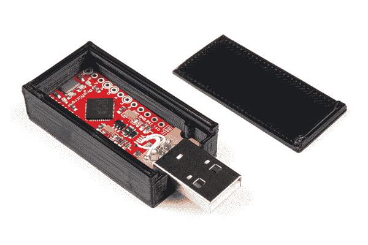

# 技术恶作剧:硬件鼠标抖动器

> 原文：<https://learn.sparkfun.com/tutorials/tech-prank-hardware-mouse-jiggler>

## 介绍

如果你正在寻找一种方法来捉弄你的朋友、同事或同学，那么摆弄他们的电脑肯定是个不错的选择。换个背景或者翻个屏都太 2003 了。为了帮助你的恶作剧现代化，这里有一个 u 盘，它显示为一个普通的鼠标，每 10-20 秒移动一次指针。非常适合惹恼你的受害者。

[https://www.youtube.com/embed/mDFT54W0NTY/?autohide=1&border=0&wmode=opaque&enablejsapi=1](https://www.youtube.com/embed/mDFT54W0NTY/?autohide=1&border=0&wmode=opaque&enablejsapi=1)

### 所需材料

要学习本项目教程，您需要以下材料: