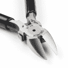
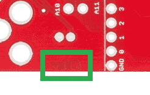
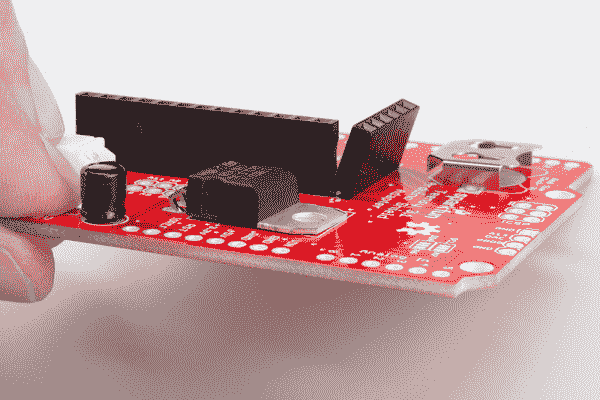
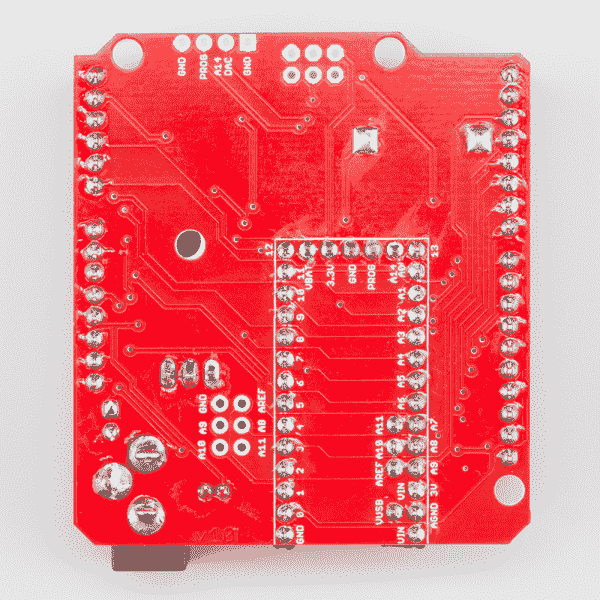

# Teensy Arduino 屏蔽适配器连接指南

> 原文：<https://learn.sparkfun.com/tutorials/teensy-arduino-shield-adapter-hookup-guide>

## 介绍

**Note:** This shield has been updated to v1.1\. The only difference in the revision is a single jumper to isolate the V[cc] power from 5V. Just in case users accidentally connect 5V to the ISP pins (the Teensy is a 3.3V board).

Teensy Arduino Shield 适配器 是将现有项目升级为更强大控制器的有用工具。如果你有一个你喜欢使用的 Arduino shield，但更喜欢与 Teensy 一起工作，那么这个产品正是你所需要的！

### 所需材料

为了跟随本教程，我们建议您访问以下资料。

由于该适配器最初是为 Teensy 3.1 设计的，我们建议使用 Teensy 3.1 或 3.2。然而，这种尺寸与 Teensy LC 兼容(*并非适配器上的所有功能都与 LC 兼容...参见**青少年兼容性**章节*。

 

将**添加到您的[购物车](https://www.sparkfun.com/cart)中！**

### [少女 LC](https://www.sparkfun.com/products/13305)

[Out of stock](https://learn.sparkfun.com/static/bubbles/ "out of stock") DEV-13305

Teensy LC 是一个 32 位微控制器板，为您提供了一个简单的选择，开始与 Teensy 的智慧…

$12.9517[Favorited Favorite](# "Add to favorites") 35[Wish List](# "Add to wish list")**** 

### [Teensy 3.1](https://www.sparkfun.com/products/retired/12646)

[Retired](https://learn.sparkfun.com/static/bubbles/ "Retired") DEV-12646

Teensy 3.1 是一款试验板友好型开发板，在一个小小的封装中提供了大量功能。

35 **Retired**[Favorited Favorite](# "Add to favorites") 12[Wish List](# "Add to wish list") 

### [Teensy 3.2](https://www.sparkfun.com/products/13736)

[Out of stock](https://learn.sparkfun.com/static/bubbles/ "out of stock") DEV-13736

Teensy 3.2 是一款试验板友好型开发板，在一个小小的封装中提供了大量功能。

68[Favorited Favorite](# "Add to favorites") 83[Wish List](# "Add to wish list")** **除了 Teensy，你还需要一根微型 [USB 线](https://www.sparkfun.com/categories/71)(示例如下):

 

将**添加到您的[购物车](https://www.sparkfun.com/cart)中！**

### [【USB Micro-B 线缆-6】](https://www.sparkfun.com/products/13244)

[In stock](https://learn.sparkfun.com/static/bubbles/ "in stock") CAB-13244

这是一根 USB 2.0 型转 Micro-B 型 5 针黑色电缆。你知道，通常配在手机上的迷你 B 连接器，可以…

$2.103[Favorited Favorite](# "Add to favorites") 7[Wish List](# "Add to wish list")**** 

将**添加到您的[购物车](https://www.sparkfun.com/cart)中！**

### [可逆 USB A 转可逆 Micro-B 线- 0.8m](https://www.sparkfun.com/products/15428)

[In stock](https://learn.sparkfun.com/static/bubbles/ "in stock") CAB-15428

这些 0.8 米的电缆有微小的，但天才的修改，允许两端插入其端口，不管是什么…

$4.501[Favorited Favorite](# "Add to favorites") 2[Wish List](# "Add to wish list")**** 

将**添加到您的[购物车](https://www.sparkfun.com/cart)中！**

### [可逆 USB A 转可逆 Micro-B 线- 0.3m](https://www.sparkfun.com/products/15429)

[In stock](https://learn.sparkfun.com/static/bubbles/ "in stock") CAB-15429

这些 0.3 米的电缆有微小的，但天才的修改，允许两端都插入其端口，不管是什么…

$3.50[Favorited Favorite](# "Add to favorites") 5[Wish List](# "Add to wish list")**** 

### [SparkFun Rugged microB 线缆- 1m](https://www.sparkfun.com/products/retired/14742)

[Retired](https://learn.sparkfun.com/static/bubbles/ "Retired") CAB-14742

你的笔记本电脑是否贴满了隐藏凹痕的贴纸？你测试过你的设备吗？SparkFun 1 米地毯…

**Retired**[Favorited Favorite](# "Add to favorites") 0[Wish List](# "Add to wish list")****** ******为了组装适配器护罩，您将需要一些[焊接设备](https://www.sparkfun.com/categories/49)(示例如下):

 

### [威勒 WLC100 焊台](https://www.sparkfun.com/products/14228)

[Out of stock](https://learn.sparkfun.com/static/bubbles/ "out of stock") TOL-14228

Weller 的 WLC100 是一款多功能的 5 瓦至 40 瓦焊台，非常适合业余爱好者、DIY 爱好者和学生。…

2[Favorited Favorite](# "Add to favorites") 17[Wish List](# "Add to wish list") 

将**添加到您的[购物车](https://www.sparkfun.com/cart)中！**

### [Solder - 1/4lb Spool (0.032”)特殊混合](https://www.sparkfun.com/products/10243)

[In stock](https://learn.sparkfun.com/static/bubbles/ "in stock") TOL-10243

我们不想炒作这种焊料太多，但这可能是世界上最好的焊料。好了，我们已经说过了。这…

$26.956[Favorited Favorite](# "Add to favorites") 16[Wish List](# "Add to wish list")**** 

将**添加到您的[购物车](https://www.sparkfun.com/cart)中！**

### [电子剪](https://www.sparkfun.com/products/10447)

[In stock](https://learn.sparkfun.com/static/bubbles/ "in stock") TOL-10447

虽然我们的小斜切刀非常适合业余爱好，但有时你需要更有咬合力的东西。这些电子…

$16.50 $14.036[Favorited Favorite](# "Add to favorites") 9[Wish List](# "Add to wish list")**** 

将**添加到您的[购物车](https://www.sparkfun.com/cart)中！**

### [SparkFun 安全眼镜](https://www.sparkfun.com/products/11046)

[In stock](https://learn.sparkfun.com/static/bubbles/ "in stock") SWG-11046

有了这些 SparkFun 安全眼镜，你将拥有一副轻便、经济、时尚的镜片来保护你珍贵的…

$4.953[Favorited Favorite](# "Add to favorites") 16[Wish List](# "Add to wish list")************ 

将**添加到您的[购物车](https://www.sparkfun.com/cart)中！**

### [SparkFun 初学者工具包](https://www.sparkfun.com/products/14681)

[Out of stock](https://learn.sparkfun.com/static/bubbles/ "out of stock") TOL-14681

这些工具非常适合那些需要一套坚实的工具来启动工作台的人！

$62.50[Favorited Favorite](# "Add to favorites") 14[Wish List](# "Add to wish list")**** 

将**添加到您的[购物车](https://www.sparkfun.com/cart)中！**

### 2 号焊芯 25 英尺。——TechSpray

[In stock](https://learn.sparkfun.com/static/bubbles/ "in stock") TOL-08775

焊芯、咖啡和纸巾让 SparkFun 保持运转。你可以偷别人的斜切刀一分钟，但你会…

$32.504[Favorited Favorite](# "Add to favorites") 18[Wish List](# "Add to wish list")**** ****### 推荐阅读

如果您不熟悉以下概念，请在开始使用 Teensy Arduino Shield 适配器之前查看这些概念。

*   [青少年入门](https://learn.sparkfun.com/tutorials/getting-started-with-the-teensy)
*   [安装 Arduino IDE](https://learn.sparkfun.com/tutorials/installing-arduino-ide)
*   [如何为您的项目提供动力](https://learn.sparkfun.com/tutorials/how-to-power-a-project)
*   [电池技术](https://learn.sparkfun.com/tutorials/battery-technologies)
*   [如何焊接](https://learn.sparkfun.com/tutorials/how-to-solder---through-hole-soldering)
*   [使用焊线](https://learn.sparkfun.com/tutorials/working-with-wire)
*   [Arduino 盾牌](https://learn.sparkfun.com/tutorials/arduino-shields-v2)

## 硬件概述

Teensy 适配器护罩上有几个需要注意的特性。虽然这个盾牌提供了与标准盾牌的基本 Arduino 兼容性，但还有一些其他有趣的功能可以查看。

**注:**这个屏蔽已经更新到了 1.1 版，版本中唯一的不同就是用一根跳线将 V [cc] 电源与 5V 隔离。以防用户不小心将 5V 连接到 ISP 引脚(Teensy 是 3.3V 板)。

跳线垫和标记如下所示:

### [1.0 版本](https://www.sparkfun.com/products/13288)

*No jumper pad.*

*Version 1.0 marking.*

### [1.1 版本](https://www.sparkfun.com/products/15716)

*With jumper pad.*

*Version 1.1 marking.*

### 微小的兼容性

适配器设计与 [Teensy 3.1](https://www.sparkfun.com/products/12646) 和 [Teensy 3.2](https://www.sparkfun.com/products/13736) 的所有功能接口，但适配器也适合 [Teensy LC](https://www.sparkfun.com/products/13305) 的尺寸。由于微控制器的限制，并非适配器上的所有功能都与 LC 兼容。请检查数据表，确保您的项目功能，以确定最适合您的用例。

This adapter is not compatible with the [Teensy 4.0](https://www.sparkfun.com/products/15583) due to the differences in the pin layout.

### 实时时钟电池

shield 附带的电池盒允许用户将其安装到项目中，并在 Teensy 上运行 RTC(实时时钟),作为计时选项。内置的纽扣电池输出 3V 电压，在系统断电时为 RTC 供电，以保持准确的时间。

此功能不适用于 Teensy LC。

### JST 电源连接器

这个连接器将 3.3V 电源线从 Teensy 上断开。您可以使用 [JST 跳线](https://www.sparkfun.com/products/9914)给外部设备供电，或者您也可以将电线直接焊接到该连接上。

该接头也可用作 Teensy 和 Arduino 的电源输入，并且**不会**下调。连接器上提供的电压必须为 3.3V。

如果您打算通过此连接为 Teensy 供电并使用 USB 进行通信/编程，您必须切断 Teensy 底部的 VIN/VUSB 跳线。

### 桶形千斤顶

筒状插孔允许用户使用墙壁适配器或任何带有公筒状插孔的电源为 Teensy 和 Shield 组合供电。这个电压可以是 4-12V 之间的任何电压，并且被调节到 5V 来为青少年供电。该电源直接连接到 Arduino shield 封装上的 VRAW，并且不向下调节。请阅读数据表，了解您打算通过适配器屏蔽连接的任何屏蔽。

如果您打算通过此连接为 Teensy 供电并使用 USB 进行通信/编程，您必须切断 Teensy 底部的 VIN/VUSB 跳线。

### I ² C 跳线

适配器上的两个焊接跳线允许用户配置电路板上的 I ² C 线。适配器出厂时跳线默认关闭，将 Teensy 的`SDA`和`SCL`引脚分别连接到 Arduino 封装上的`A4`和`A5`引脚。如果你有一个 Arduino Leonardo 兼容的屏蔽，你可以交换这个跳线来隔离同名引脚上的 SDA 和 SCL 线，并在 Arduino 足迹的`A4`和`A5`上访问 Teensy 的`A6`和`A7`。Teensy 的`A4`和`A5`仍将连接到 Arduino 足迹`SDA`和`SCL`。

### ICSP 头球

ICSP 接头断开了与 Leonardo 兼容的屏蔽的 SPI 引脚。如果你有一个 AVR 编程器，你也可以使用这个标题来重新编程。

**Warning!** If you are using a 5V shield that connects over the ICSP/ISP pins, **do not** connect ISP pin 2 on the adapter to your shield. This will short 3.3V and 5V together and could damage your Teensy.

#### 电源隔离跳线

如果您使用更新的 1.1 版适配器，在 ICSP/ISP 引脚旁边有一个标有`J4`的电源隔离跳线。默认情况下，该跳线是打开的，用于将适配器板的 V [cc] 与 ISP 引脚隔离。这是用来防止用户在提供 5V 电源而不是 Teensy 额定的 3.3V 电源时意外烧毁他们的电路板。

### 附加模拟引脚

仅仅因为你使用带有 Arduino 盾的 Teensy 并不意味着你想失去 Teensy 的额外功能！我们已经将额外的模拟引脚 8-11 从 Teensy 扩展到 6 引脚接头，以及`AREF`和`GND`。这些引脚根本不会与 Arduino 屏蔽相互作用，如果需要，它们只是外部传感器或输入的附加功能。

### DAC 引脚接头

Teensy 的另一大特色是板载数模转换器。我们已经将这个引脚与`PROG`引脚和两个相应的`GND`引脚一起断开到电路板的边缘。

On the [Teensy LC](https://www.sparkfun.com/products/13305), pin A12 is used instead of A14 (*as marked on shield*).

## 硬件装配

因此，你已经有了一包零件，并准备好让你的 Teensy 与你的 Arduino 盾牌接口。是时候拿出烙铁了！

我们将按照从最小到最大的顺序将适配器焊接在一起。这将有助于更容易达到所有的焊接点与铁，以及更容易线所有的项目正确。

**电池座**

首先，插入[电池座](https://www.sparkfun.com/products/7948)并确保它与电路板齐平。翻转适配器，焊接连接器。切记电池夹是全金属的，会导热，不要烫伤自己！

因为电池夹在插入或取出电池时会承受很大的压力，所以您需要确保将针脚完全连接到电路板上。确保您的焊点看起来美观且填满，就像这样:

**电容器**

下一个要焊接的元件是[电容](https://www.sparkfun.com/products/523)。帽子是[极化的](https://learn.sparkfun.com/tutorials/polarity)，所以要确保你把它正确地插入电路板。盖的反面应插入最靠近筒状插孔的位置。

插入电容帽后，将引脚向外弯曲一点，以便在焊接时保持电容与电路板齐平。

一旦你焊接了电容腿，剪辑任何多余的腿。

**JST 连接器**

接下来，插入 [JST 连接器](https://www.sparkfun.com/products/9749)。这部分往往需要一点推力才能完全插入电路板，所以在焊接前要确保它平齐。确保连接器上的开口沿着主板边缘，并且没有插反。

**电压调节器**

[电压调节器](https://www.sparkfun.com/products/107)很难正确插入，所以这一步要慢慢来。首先将调节器支腿插入电路板。确保调节器以正确的方向插入，金属标签朝向电路板上的 ICSP 接头，塑料外壳最靠近 JST 连接器。

*Proper orientation of voltage regulator from the side view.*

一旦确认调节器方向正确，但在焊接之前，将调节器向下弯向 PCB。调节器上的安装孔应与 PCB 上的安装孔相匹配。

焊接调节器支腿，并剪去多余部分。该器件确实调节项目电压，因此确保所有引脚都有良好的焊接连接，确保没有跳线或削波会使电路板短路。

**少女的母头**

在这一点上，你将需要确定你想要你的适配器屏蔽如何与你的 Teensy 和你的 Arduino 屏蔽接口。显示的步骤是我们推荐的接口方法，但是您可以自定义。请查看我们关于[开始使用 Teensy](https://learn.sparkfun.com/tutorials/getting-started-with-the-teensy) 的教程，查看其他可能的配置。

从你的工具包中取出[母接头](https://www.sparkfun.com/products/115)，将它们切割成单独的条，以适应微小的足迹。插入接头，并确认它们排列良好。您可能还需要使用 Teensy footprint 短边上的一个 [6 针母接头](https://www.sparkfun.com/products/11894)。

如果你有像上面显示的标题之间的间隙，你可能需要锉平连接器的边缘，以使所有的东西都紧密配合。开始一次焊接一排接头。为了有助于在焊接时保持它们笔直，我们建议首先定位第一个和最后一个焊点。

*Notice the first and last headers are tacked down.*

这使您可以轻松地修复任何可能出现的插入不良或倾斜的接头。

*These headers will never do!*

如果你已经决定焊接所有的小引脚，你还需要焊接屏蔽上的内排接头。

**屏蔽接头**

接下来，将 [10 针](https://www.sparkfun.com/products/11896)、 [8 针](https://www.sparkfun.com/products/11895)和 [6 针接头](https://www.sparkfun.com/products/11894)焊接到转接板上。为了确保正确排列这些接头，我们建议使用预焊屏蔽作为焊接夹具来固定适配器接头。

*Pre-soldered shield used as a soldering jig to keep the headers lined up.*

请记住，您可能需要将套件中的[可堆叠接头](https://www.sparkfun.com/products/11417)添加到您的主板上，以便在 Teensy 和您使用的屏蔽之间提供足够的间隙。

**桶形千斤顶**

最后焊接的部分是[桶形千斤顶](https://www.sparkfun.com/products/119)。请注意，插入时，通孔比标准接头大得多。

因为大的电镀通孔，你将需要更多的焊料和热量来正确地连接它们并填充它们(就像在电池夹上一样！).耐心点，慢慢来，确保不要烧掉 PCB 或任何痕迹。

就是这样！您的适配器现在应该已经焊接好，可以使用了。

*All pieces inserted and soldered!**Teensy Adapter successfully soldered!*

**少年头球**

现在你的适配器完成了，你可以用它作为焊接夹具将[公接头](https://www.sparkfun.com/products/116)连接到你的 Teensy。将铝带分成更小的部分，并将它们插入适配器上的预焊接接头。插上顶部的小孔，然后焊接！

**水晶**

**Note:** This step is optional and only necessary if you intend to use the RTC feature on the Teensy 3.1 or 3.2.

如果您打算在 Teensy 3.1 或 Teensy 3.2 上使用 RTC，您需要将[晶体](https://www.sparkfun.com/products/540)焊接到 Teensy 上。你可以通过底部或顶部焊接它，但请记住，你应该把它插在最不可能被撞倒或短路晶体到其他组件的地方。

*Double check that the crystal won't short on any pins before soldering!*

### 全部插上电源

一旦所有的东西都焊接好了，就该把你的电路板组装起来了。如果您没有将 Teensy 直接焊接到适配器上，请将 Teensy 插入适配器，并插入您选择连接的任何屏蔽。

通过 USB 连接你的 Teensy，上传你的代码，你就可以开始了！

*Final Adapter assembly with the [Electric Imp Shield](https://www.sparkfun.com/products/12887) stacked on top.***Remember!** If you intend to use an external power supply, you must cut the jumper on the bottom of the Teensy to prevent shorting VUSB and VIN.

如果你打算使用 RTC，不要忘记插上你的硬币电池。这个**对 Teensy LC 不起作用。**

## 编程；编排

由于该板只是一个适配器，因此无需特殊编程即可使用该适配器。然而，你需要为任何你想使用的 Arduino 盾编程。

在对您的 Teensy 进行编程时，请记住从 Arduino IDE 下拉列表中选择合适的主板，并选择合适的串行端口和波特率。

请回顾我们的教程[Teensy](https://learn.sparkfun.com/tutorials/getting-started-with-the-teensy)入门，了解更多关于在 Arduino IDE 或 C 编译器中对 Teensy 编程的信息。

如果您打算使用`A6`或`A7`代替`SDA`或`SCL`，请不要忘记验证和更新您的密码中的 pin 定义。

## 资源和更进一步

有关 Teensy Arduino Shield 适配器的更多信息，请查看以下资源:

*   [示意图(PDF)](https://cdn.sparkfun.com/datasheets/Dev/Teensy/SparkFun_Teensy_Adapter.pdf)
*   [老鹰文件(ZIP)](https://cdn.sparkfun.com/datasheets/Dev/Teensy/SparkFun_Teensy_Adapter.zip)
*   [Teensy 3.1/3.2 硬件规格](http://www.pjrc.com/teensy/teensy31.html)
*   [GitHub 库](https://github.com/sparkfun/Teensy_Arduino_Shield_Adapter)

既然您已经成功地启动并运行了您的 Teensy Arduino Shield 适配器，那么是时候将它合并到您自己的项目中了！请查看我们下面的一些项目:

 [### Teensy Arduino 屏蔽适配器连接指南](https://learn.sparkfun.com/tutorials/teensy-arduino-shield-adapter-hookup-guide) A basic introduction and assembly guide for the SparkFun Teensy Arduino Shield Adapter.[Favorited Favorite](# "Add to favorites") 3 [### Boss 警报](https://learn.sparkfun.com/tutorials/boss-alarm) Build a Boss Alarm that alerts you of anyone walking into your office and automatically changes your computer screen.[Favorited Favorite](# "Add to favorites") 19 [### 帝国之声:冲锋队变声器](https://learn.sparkfun.com/tutorials/vox-imperium-stormtrooper-voice-changer) Add some flair to your Imperial uniform by changing your voice using a Teensy 3.2 and Prop Shield.[Favorited Favorite](# "Add to favorites") 8 [### LuMini 环连接指南](https://learn.sparkfun.com/tutorials/lumini-ring-hookup-guide) The LuMini Rings (APA102-2020) are the highest resolution LED rings available.[Favorited Favorite](# "Add to favorites") 6 [### 今日英语:数字手机

November 3, 2016](https://www.sparkfun.com/news/2222 "November 3, 2016: Make your own digital handpan drum using the Teensy Audio Shield and the Teensy's built-in capacitive touch inputs.  ")[Favorited Favorite](# "Add to favorites") 11 [### 英语日:电池管理

March 23, 2017](https://www.sparkfun.com/news/2338 "March 23, 2017: This post explores how to use the power control features of the Battery Babysitter to make a product with the features we expect from portable embedded electronics.")[Favorited Favorite](# "Add to favorites") 1 [### 青少年 4.1

May 11, 2020](https://www.sparkfun.com/news/3294 "May 11, 2020: As of today, the Teensy 4.1 is here!")[Favorited Favorite](# "Add to favorites") 1 [### 中西部防御者围捕

April 21, 2022](https://www.sparkfun.com/news/4534 "April 21, 2022: This is the final installment in a series about the Midwest Defenders' build for the OpenCV Spatial AI Competition.")[Favorited Favorite](# "Add to favorites") 0******************