# TeensyView 连接指南

> 原文：<https://learn.sparkfun.com/tutorials/teensyview-hookup-guide>

## 介绍

[TeensyView](https://www.sparkfun.com/products/14048) 是一款 SSD1306 128x32 有机发光二极管屏幕突破，与 Teensy 3 外形尺寸相匹配。它非常适合在 Teensy 上显示调试信息和可视化数据，并兼容 [LC](https://www.sparkfun.com/products/13305) ，3.1， [3.2](https://www.sparkfun.com/products/13736) ， [3.5](https://www.sparkfun.com/products/14055) ， [3.6](https://www.sparkfun.com/products/14057) ，[音频板](https://www.sparkfun.com/products/12767)，[道具盾](https://www.sparkfun.com/products/13995)，[道具盾 LC](https://www.sparkfun.com/products/13996) 和 [XBee 适配器](https://www.sparkfun.com/products/13311)。

[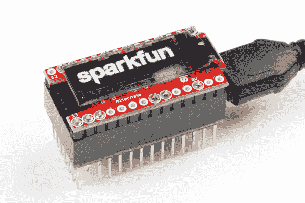](https://cdn.sparkfun.com/assets/learn_tutorials/6/0/2/Teensy_View_Hookup_Guide-15.jpg)

本指南展示了如何将 TeensyView 连接到各种与 Teensy 相关的产品，然后展示了一些带有图书馆参考的示例。SSD1306 驱动程序相当受欢迎，背后有很多支持。 [TeensyView Arduino 库](https://github.com/sparkfun/SparkFun_TeensyView_Arduino_Library)就像[微有机发光二极管突破的](https://www.sparkfun.com/products/13003)和[微视图](https://www.sparkfun.com/products/12923)的库，所以期待相同的功能工作，只是为青少年调整和方便打包。

**Non-Teensy Usage:** The TeensyView was designed to opearte on the Teensy. If you are trying to use it with the Uno, or other platforms, use the [Multi-platform branch of the library](https://github.com/sparkfun/SparkFun_TeensyView_Arduino_Library/tree/Multi-platform). Is your platform not supported? Please request it in the Multi-platform branch's issues. **The TeensyView is a 3.3V device**, level shift all signals (50% voltage dividers work -- [example](https://cdn.sparkfun.com/assets/learn_tutorials/6/0/2/uno.JPG)).

### 所需材料

要开始，你需要以下东西:

*   A [Teensy LC / 3.1 或更高版本](https://www.sparkfun.com/categories/267)
*   青少年视角
*   一个[烙铁](https://www.sparkfun.com/products/11704)和[焊接工具](https://www.sparkfun.com/products/13055)
*   一把剪刀
*   您的连接标题选项
    *   普通[母接头](https://www.sparkfun.com/products/115)
    *   可堆叠接头，如 [Teensy 接头套件](https://www.sparkfun.com/products/13925)
    *   [头球破门-直球](https://www.sparkfun.com/products/116)
    *   [长传头球攻门](https://www.sparkfun.com/products/12693)
*   像[音频板](https://www.sparkfun.com/products/12767)或[道具盾](https://www.sparkfun.com/products/13995)这样的附加板可以方便地运行例子

本指南使用了一个 Teensy 3.2 直切式头球和一个 Teensy 头球套件。

[](https://www.sparkfun.com/products/116) 

将**添加到您的[购物车](https://www.sparkfun.com/cart)中！**

### [破开头球——直击](https://www.sparkfun.com/products/116)

[In stock](https://learn.sparkfun.com/static/bubbles/ "in stock") PRT-00116

一排标题-打破适应。40 个引脚，可切割成任何尺寸。用于定制 PCB 或通用定制接头。

$1.7520[Favorited Favorite](# "Add to favorites") 133[Wish List](# "Add to wish list")****[](https://www.sparkfun.com/products/13925) 

将**添加到您的[购物车](https://www.sparkfun.com/cart)中！**

### [少年头球套件](https://www.sparkfun.com/products/13925)

[In stock](https://learn.sparkfun.com/static/bubbles/ "in stock") PRT-13925

每个接头套件使您的 Teensy 4.0、3.2 和 LC 试验板兼容，并允许堆叠 Teensy 和 Teensy-…

$1.50[Favorited Favorite](# "Add to favorites") 22[Wish List](# "Add to wish list")****[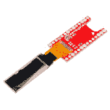](https://www.sparkfun.com/products/14048) 

将**添加到您的[购物车](https://www.sparkfun.com/cart)中！**

### [开球少年观](https://www.sparkfun.com/products/14048)

[In stock](https://learn.sparkfun.com/static/bubbles/ "in stock") LCD-14048

SparkFun TeensyView 为您提供了一种简单的方法，将一个 128x32 黑白有机发光二极管添加到您的 Teensy 开发板。

$17.956[Favorited Favorite](# "Add to favorites") 26[Wish List](# "Add to wish list")****[](https://www.sparkfun.com/products/13736) 

### [Teensy 3.2](https://www.sparkfun.com/products/13736)

[Out of stock](https://learn.sparkfun.com/static/bubbles/ "out of stock") DEV-13736

Teensy 3.2 是一款试验板友好型开发板，在一个小小的封装中提供了大量功能。

68[Favorited Favorite](# "Add to favorites") 83[Wish List](# "Add to wish list")****** ******### 推荐阅读

如果您不熟悉以下概念，我们建议您在继续之前查看这些教程。

[](https://learn.sparkfun.com/tutorials/how-to-solder-through-hole-soldering) [### 如何焊接:通孔焊接](https://learn.sparkfun.com/tutorials/how-to-solder-through-hole-soldering) This tutorial covers everything you need to know about through-hole soldering.[Favorited Favorite](# "Add to favorites") 70[](https://learn.sparkfun.com/tutorials/installing-an-arduino-library) [### 安装 Arduino 库](https://learn.sparkfun.com/tutorials/installing-an-arduino-library) How do I install a custom Arduino library? It's easy! This tutorial will go over how to install an Arduino library using the Arduino Library Manager. For libraries not linked with the Arduino IDE, we will also go over manually installing an Arduino library.[Favorited Favorite](# "Add to favorites") 22[](https://learn.sparkfun.com/tutorials/installing-arduino-ide) [### 安装 Arduino IDE](https://learn.sparkfun.com/tutorials/installing-arduino-ide) A step-by-step guide to installing and testing the Arduino software on Windows, Mac, and Linux.[Favorited Favorite](# "Add to favorites") 16

## 硬件概述和组装

硬件是焊接有有机发光二极管的无头 PCB。一侧有跳线，用于配置有机发光二极管如何与连接的 Teensy 通信。你需要设置跳线，将电视焊接到电视或插头上，然后贴上有机发光二极管。

本节说明在 TeensyView 上使用公接头，在 Teensy 上使用可堆叠接头。

[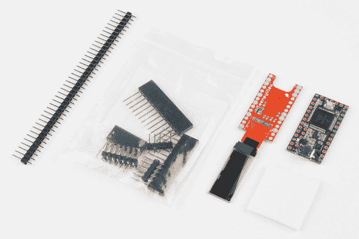](https://cdn.sparkfun.com/assets/learn_tutorials/6/0/2/Teensy_View_Hookup_Guide-01.jpg)*In addition to the kit (TeensyView and foam square), you'll need a single Straight Break Away Header and stackable Teensy Header Kit in order to follow along with this guide.***Careful!** The flex cable is fragile before the OLED is mounted. Avoid unnecessary stress, and avoid letting the OLED flop around during assembly.

1.  TeensyView 有两个可用的有机发光二极管通信线路连接，允许与各种电路板兼容。一侧(工厂配置/“标准”)全部由铜跳线连接，另一侧可用于重新配置连接。

    使用此表来确定 TeensyView 使用哪些引脚，或者如果没有使用其他资源，则让这些引脚通过铜线设置为标准引脚。

    | 跳高运动员 | 默认铜跳线
    (标准) | [音频板](https://www.sparkfun.com/products/12767)兼容
    (备用) | [兼容道具盾](https://www.sparkfun.com/products/13995) |
    | RST | Fifteen | Two | 15(标准) |
    | D/ C | five | Twenty-one | 21(备选案文。) |
    | CS | Ten | Twenty | 20(备选案文。) |
    | SCLK | Thirteen | Fourteen | 13(标准) |
    | 数据 | Eleven | seven | 11(标准) |

2.  如有必要，小心地[切割电路板上的铜跳线](https://learn.sparkfun.com/tutorials/how-to-work-with-jumper-pads-and-pcb-traces)并使用焊料重新路由信号。

    [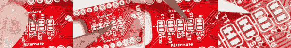](https://cdn.sparkfun.com/assets/learn_tutorials/6/0/2/Teensy_11.jpg)*Cutting the copper traces: Make two cuts, one on each end of the copper link, then remove the excess copper with a slight twist of the knife. Solder connections are not shown here, but if you remove the copper link you will need to apply a solder jump between two of the pads of the jumper!*
3.  分离两个 14 针长的直插头，将它们安装到试验板上，然后将 PCB 放在上面，使**跳线朝上**，LCD 朝下。液晶屏将折叠起来，盖住跳线。

    [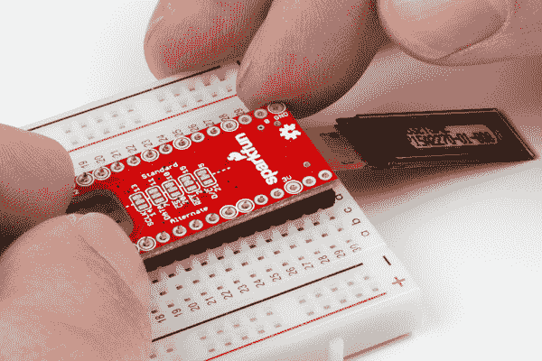](https://cdn.sparkfun.com/assets/learn_tutorials/6/0/2/Teensy_View_Hookup_Guide-06.jpg)*Notice that the OLED is soldered to the back side and folds around the edge of the PCB, covering the selection jumpers. This is so the jumpers can still be accessed if the TeensyView is more permanently attached to a Teensy.*
4.  接下来，[使用焊剂芯焊料将接头](https://learn.sparkfun.com/tutorials/how-to-solder-through-hole-soldering)焊接到 TeensyView 上。丝印环表示与 TeensyView 电路电连接的引脚。为了获得更好的机械稳定性，您可以选择焊接所有引脚，或者如果您预见到将来要移除引脚，则只焊接连接的引脚。这个板被认为是堆栈的顶部，可能不需要所有的信号通过。

    [](https://cdn.sparkfun.com/assets/learn_tutorials/6/0/2/Teensy_View_Hookup_Guide-07.jpg)*Attaching the straight headers to the Teensy using a breadboard.***Note:** There are 12x silkscreen rings highlighted. You will only be using 5x of the standard pins and 2x for power on the Teensy as shown earlier in the table of the jumpers. 5x of the remaining pins are the alternate pin connections.
5.  现在 TeensyView 有了接头，它可以用来帮助将 Teensy 可堆叠接头固定在组装位置。将 6 长和两个 13 长的接头放在 TeensyView 上，然后将 Teensy 放在上面并进行焊接。

    [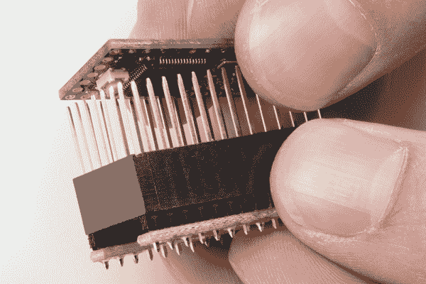](https://cdn.sparkfun.com/assets/learn_tutorials/6/0/2/Teensy_View_Hookup_Guide-08.jpg)*Using the TeensyView as a soldering jig*[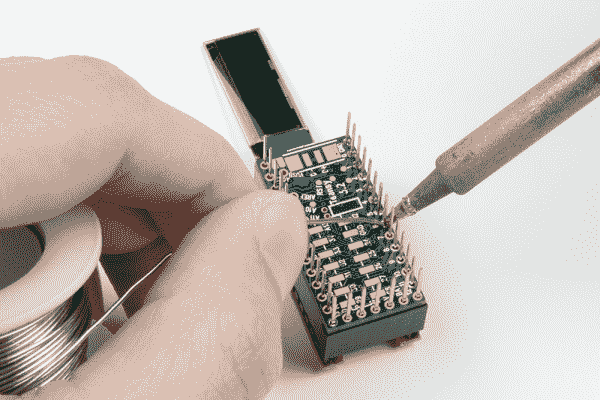](https://cdn.sparkfun.com/assets/learn_tutorials/6/0/2/Teensy_View_Hookup_Guide-09.jpg)*Attaching the [Teensy Header Kit](https://www.sparkfun.com/products/13925)*
6.  如果你已经决定只焊接电气连接的引脚，现在是一个很好的时间拉备用引脚。用一只手牢牢抓住 TeensyView，用钳子或剥线钳用力拉。为了仔细检查，应该只有针留在带有丝网印刷环的孔中。

    [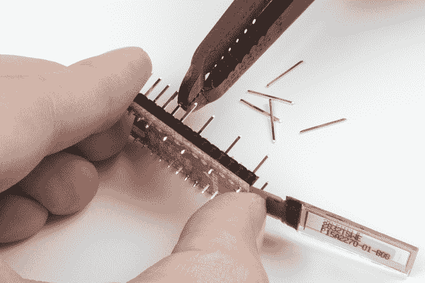](https://cdn.sparkfun.com/assets/learn_tutorials/6/0/2/Teensy_View_Hookup_Guide-10.jpg)*Pulling the pins*
7.  使用双面泡沫贴上屏幕。最好从小部件开始，直到你确定你想要的配置。想象泡沫是如何被分割的，或者用笔在上面画画。然后用你的剪刀剪下长条，从那里细分。

    [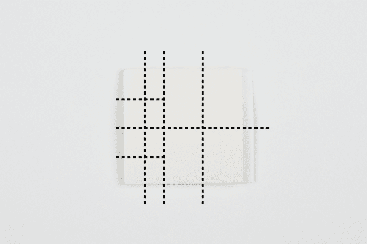](https://cdn.sparkfun.com/assets/learn_tutorials/6/0/2/squarewithdash.jpg)*A way to divide the square of foam tape*

    几个小块可以让它保持在一个很长的位置，而一个大块可以让它保持在一个更永久的基础上。移除屏幕的原因可能是调整左右对齐(例如，为了匹配机箱切口)或更改针脚的配置。从一大块开始可能很诱人，但是不要！这种泡沫一旦凝固就会变得非常紧实。

    | [](https://cdn.sparkfun.com/assets/learn_tutorials/6/0/2/Teensy_View_Hookup_Guide-13.jpg) | [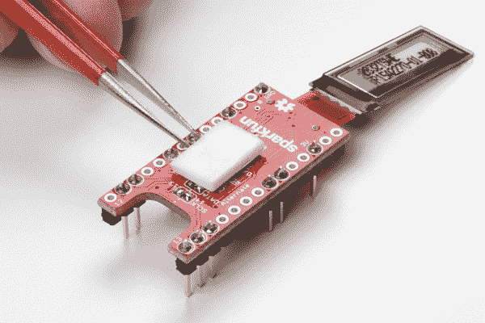](https://cdn.sparkfun.com/assets/learn_tutorials/6/0/2/Teensy_View_Hookup_Guide-12.jpg) |
    | 两个小块防止屏幕晃动。 | *一大块可以作为永久的解决办法。* |

    [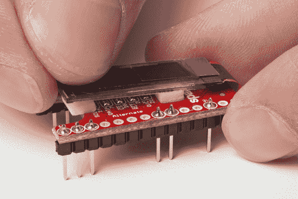](https://cdn.sparkfun.com/assets/learn_tutorials/6/0/2/Teensy_View_Hookup_Guide-14.jpg)*Carefully set down the glass*.
8.  哦不！你把屏幕放下得太早了，需要调整一下！别担心，但是**也不要只是撬起玻璃**。使用薄而钝的工具将泡沫的肉从侧面推出。

    [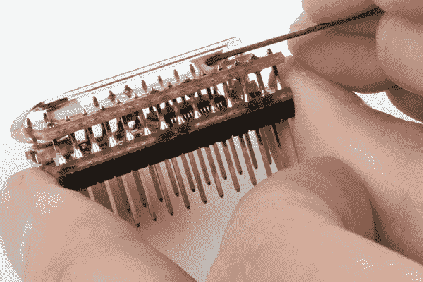](https://cdn.sparkfun.com/assets/learn_tutorials/6/0/2/Teensy_View_Hookup_Guide-19.jpg)*Breaking the foam structure without applying force to the OLED glass.*
9.  连接 TeensyView 和 USB 电缆。然后运行示例。TeensyView 有几个图钉(标有`0`、`13`、`14`、`3V`和`GND`)来帮助确保它朝向正确的方向。这是 Teensy 3.2 和 Teensy 3.6 的最终堆栈。正如你所看到的，有机发光二极管柔性电缆的**弯位于 Teensy 的 USB 连接器一侧。**

| [](https://cdn.sparkfun.com/assets/learn_tutorials/6/0/2/Teensy_View_Hookup_Guide-15.jpg) | [](https://cdn.sparkfun.com/assets/learn_tutorials/6/0/2/Teensy_View_Hookup_Guide-16.jpg) |
| *Teensy 3.2 上的 Teensy view* | *Teensy 3.6 上的 Teensy view* |

## 软件安装

Teensy 系列不依赖于 Arduino 的编译器和库。相反，Teensyduino 附加组件提供了资源。

要使用 TeensyView，您需要:

*   兼容的 Arduino IDE
*   与您的 Arduino IDE 相匹配的 Teensyduino 版本
*   青少年视野 Arduino 图书馆

**Note:** See the [Teensyduino download page](https://www.pjrc.com/teensy/td_download.html) for the latest information on compatiblility between TeensyDuino and Arduino IDE versions, and to download the add-on.

### 获取 Arduino IDE 和 Teensyduino

遵循这些步骤来获得你需要为青少年编译的内容。

1.  安装一个非基于 web 的 Arduino。

    请参见 [PJRC Teensyduino 页面](http://www.pjrc.com/teensy/td_download.html)了解 Arduino 兼容性信息。

    下载兼容的 [Arduino 软件](https://www.arduino.cc/en/Main/Software)并安装到一个目录中——点击[当前版本的前一版本](https://www.arduino.cc/en/Main/OldSoftwareReleases#previous)查看旧版本。

    **Windows Tip:** The "Windows Installer" installs to your program directory and is fine for general use without version information. It expects only one installation to be present. When uisng Teensyduino with older versions of Teensy, use the "Windows ZIP file for non admin" and install it to a directory with version number in the name, and make an extra shortcut in your start menu. This will allow you to choose the latest Arduino for general use, or a particular installation for Teensy (or other boards).
2.  将 Teensyduino 安装到您的新 Arduino 安装中

    从 [PJRC Teensyduino 页面](http://www.pjrc.com/teensy/td_download.html)获取 Teensyduino 安装程序(同上)。运行安装程序。它将要求:

    *   新安装的 Arduino 文件夹
    *   要包括哪些库(全部推荐)

    通过在下载链接中更改版本号，可以获得 Teensyduino 的旧版本。

3.  从下拉菜单中选择您的 Teensy 板，然后运行 **Blink** 示例，测试您的安装。

### 获取 TeensyView Arduino 库

要获取 Arduino 库，请从 GitHub 下载或使用 Arduino 库管理器。

**下载 GitHub 库**

访问 [GitHub 库](https://github.com/sparkfun/SparkFun_TeensyView_Arduino_Library)下载最新版本的库，或者点击下面的按钮:

[Download the Arduino Library](https://github.com/sparkfun/SparkFun_TeensyView_Arduino_Library/archive/master.zip)

**使用库管理器或安装在 Arduino IDE 中**

要获得安装库的帮助，请查看我们的[安装 Arduino 库教程](https://learn.sparkfun.com/tutorials/installing-an-arduino-library)。

如果你最终没有使用管理器，你需要将*spark fun _ TeensyView _ Arduino _ Library*文件夹移动到 Arduino sketchbook 中的 *libraries* 文件夹。如果你愿意，你可以把“主人”从名字中去掉。

## 青少年图书馆参考

### 运营图书馆

安装了 Teensyduino 和 TeensyView 库之后，要在屏幕上开始绘图，需要做一些事情。

*   包含 TeensyView 头文件- `#include <TeensyView.h>`
*   在全局空间中创建一个对象以使用 TeensyView，并将所需的 pin 号传递给构造函数。- `TeensyView oled(PIN_RESET, PIN_DC, PIN_CS, PIN_SCK, PIN_MOSI);`
*   运行`begin()`功能

现在你可以开始控制屏幕了。要绘制一个框架，

*   擦除全部或部分屏幕。
*   绘制新对象
*   使用`.display()`将所有数据发送到屏幕。

此示例显示了包括库，创建对象，然后重复绘制一个框架。绘图命令保持简洁，作为一个很好的可修改模板。这个例子也可以从 Arduino 库中获得。

```
language:c
/******************************************************************************
  Template.ino
  A useful starting place when adding a TeensyView to an existing project.

  Marshall Taylor @ SparkFun Electronics, March 15, 2017
  https://github.com/sparkfun/SparkFun_TeensyView_Arduino_Library

  This example sets up the TeensyView and draws a test frame repeatedly.
  The objects in the frame were selected to give copy-paste examples for various
  common operations without a lot of chaff.  See TeensyView.h for specifics.

  Compatible with:
  Teensy LC
  Teensy 3.1
  Teensy 3.2
  Teensy 3.5
  Teensy 3.6

  Development environment specifics:
  Arduino IDE 1.6.12 w/ Teensyduino 1.31
  Arduino IDE 1.8.1 w/ Teensyduino 1.35
  TeensyView v1.0

  This code is released under the [MIT License](http://opensource.org/licenses/MIT).

  Please review the LICENSE.md file included with this example. If you have any questions
  or concerns with licensing, please contact techsupport@sparkfun.com.

  Distributed as-is; no warranty is given.
******************************************************************************/
#include <TeensyView.h>  // Include the SFE_TeensyView library

///////////////////////////////////
// TeensyView Object Declaration //
///////////////////////////////////
//Standard
#define PIN_RESET 15
#define PIN_DC    5
#define PIN_CS    10
#define PIN_SCK   13
#define PIN_MOSI  11

//Alternate (Audio)
//#define PIN_RESET 2
//#define PIN_DC    21
//#define PIN_CS    20
//#define PIN_SCK   14
//#define PIN_MOSI  7

TeensyView oled(PIN_RESET, PIN_DC, PIN_CS, PIN_SCK, PIN_MOSI);

void setup()
{
  oled.begin();    // Initialize the OLED
  oled.clear(ALL); // Clear the display's internal memory
  oled.display();  // Display what's in the buffer (splashscreen)
  delay(1000);     // Delay 1000 ms
  oled.clear(PAGE); // Clear the buffer.

}

void loop()
{
  oled.clear(PAGE);  // Clear the page

  oled.rect(5, 5, 20, 20);  // Draw a rectangle
  oled.rectFill(35, 16, 23, 11);  // Draw a filled rectangle
  oled.circle(22, 20, 7);  // Draw the circle:
  oled.pixel(40, 7, WHITE, NORM);  // Draw a white pixel
  oled.pixel(48, 21, BLACK, NORM);  // Draw a black pixel (on the above rectange)

  oled.setFontType(1);  // Set font to type 1
  oled.setCursor(73, 17); // move cursor
  oled.print("world!");  // Write a byte out as a character
  oled.setFontType(0);  // Set font to type 0
  oled.setCursor(67, 12); // move cursor
  oled.print("Hello");  // Write a byte out as a character

  oled.display();  // Send the PAGE to the OLED memory

  delay(200);
} 
```

*In the above example, the standard pins are used for factory hardware. The "begin" function clears the OLED to our logo, then displays the memory contents.*

### TeensyView 类参考

下面，您将找到可以在您的代码中调用的可用 TeensyView 类的完整列表。

#### 初始化

*   `void begin(void)` -初始化 TeensyView 库。设置 SPI 端口的 I/O 引脚，然后向有机发光二极管内部的 SSD1306 控制器发送初始化命令。

*   `void end (void)` -关闭有机发光二极管显示器。复位显示控制信号，使 SSD1306 控制器做好断电准备，然后关闭 3.3V 调节器。

#### 显示动作、设置和方向

*   `void display(void)` -转移显示记忆。将屏幕缓冲区批量移动到 SSD1306 控制器的内存中，以便在屏幕缓冲区上绘制的图像/图形将显示在有机发光二极管上。

*   `void clear(* uint8_t mode)` -清除屏幕缓冲区或 SSD1306 的内存。要清除 LCD 控制器内部的 GDRAM，请传递变量 mode = ALL，要清除屏幕页面缓冲区，请传递变量 mode = PAGE。

*   `void clear(* uint8_t mode, * uint8_t c)` -用字符清除或替换屏幕缓冲区或 SSD1306 的内存。要清除 LCD 控制器内部的 GDRAM，请传入变量 mode = ALL 和 c 字符，要清除屏幕页面缓冲区，请传入变量 mode = PAGE 和 c 字符。

*   `void invert(boolean inv)` -反转显示。显示器的白色将变成黑色，黑色将变成白色。

*   `void contrast(* uint8_t contrast)` -在 0 到 255 之间设置有机发光二极管对比度值。注意:对比度不是很明显。

*   `void setCursor(* uint8_t x, * uint8_t y)` -将 TeensyView 的光标位置设置为 x，y。

*   `void flipVertical(boolean flip)` -垂直翻转有机发光二极管上的图形。

*   `void flipHorizontal(boolean flip)` -水平翻转有机发光二极管上的图形。

*   `uint8_t getLCDWidth(void)`-LCD 返回的宽度，以字节为单位。

*   `uint8_t getLCDHeight(void)`-LCD 返回的高度，以字节为单位。

#### 显示滚动

**Note:** For scrolling features, refer to the [OLED Memory Map](https://learn.sparkfun.com/tutorials/microview-hookup-guide/all#oled-memory-map) section of our MicroView hookup guide for explanation of the rows and columns.

*   `void scrollRight(* uint8_t start, * uint8_t stop)` -向右滚动。将有机发光二极管上的行起点设置为行终点，以向右滚动。

*   `void scrollLeft(* uint8_t start, * uint8_t stop)` -向左滚动。将有机发光二极管上的行开始设置为行停止，以向左滚动。

*   `void scrollVertRight(* uint8_t start, * uint8_t stop)` -向右垂直滚动。将有机发光二极管上的列起点设置为行终点，以向右滚动。

*   `void scrollVertLeft(* uint8_t start, * uint8_t stop)` -向左垂直滚动。将有机发光二极管上的列起点设置为行终点，以向左滚动。

*   `void scrollStop(void)` -停止有机发光二极管上图形的滚动。

#### 字体功能

*   `uint8_t getFontWidth(void)` -获取字体宽度。当前字体宽度以字节形式返回。

*   `uint8_t getFontHeight(void)` -获取字体高度。当前字体高度以字节形式返回。

*   `uint8_t getTotalFonts(void)` -获取全部字体。返回加载到 TeensyView 闪存中的字体总数。

*   `uint8_t getFontType(void)` -获取字体类型。返回当前字体的字体类型号。

*   `uint8_t setFontType(* uint8_t type)` -设置字体类型。设置当前字体类型号(即根据所提供的类型更改为不同的字体)。

*   `uint8_t getFontStartChar(void)` -获取字体起始字符。返回当前字体的起始 ASCII 字符；并非所有字体都以 ASCII 字符 0 开头。自定义字体可以从任何 ASCII 字符开始。

*   `uint8_t getFontTotalChar(void)` -获取字体总字符数。返回当前字体的总字符数。

#### 绘图像素

*   `void pixel(* uint8_t x, * uint8_t y)` -使用当前前景色和当前绘制模式在屏幕缓冲区的 x，y 位置绘制像素。

*   `void pixel(* uint8_t x, * uint8_t y, * uint8_t color, * uint8_t mode)` -用 NORM 或 XOR 绘制模式在屏幕缓冲区的 x，y 位置绘制彩色像素。

#### 画线

*   `void line(* uint8_t x0, * uint8_t y0, * uint8_t x1, * uint8_t y1)` -使用当前前景色和当前绘制模式从屏幕缓冲区的 x0，y0 到 x1，y1 绘制线条。

*   `void line(* uint8_t x0, * uint8_t y0, * uint8_t x1, * uint8_t y1, * uint8_t color, * uint8_t mode)` -使用屏幕缓冲区的 x0，y0 到 x1，y1 的颜色和模式画线。

*   `void lineH(* uint8_t x, * uint8_t y, * uint8_t width)` -使用当前前景色和当前绘制模式从屏幕缓冲区的 x，y 到 x+width，y 绘制水平线。

*   `void lineH(* uint8_t x, * uint8_t y, * uint8_t width, * uint8_t color, * uint8_t mode)` -使用屏幕缓冲区从 x，y 到 x+width，y 的颜色和模式绘制水平线。

*   `void lineV(* uint8_t x, * uint8_t y, * uint8_t height)` -使用当前前景色和当前绘制模式从 x，y 到 x，y+屏幕缓冲区的高度绘制垂直线。

*   `void lineV(* uint8_t x, * uint8_t y, * uint8_t height, * uint8_t color, * uint8_t mode)` -使用颜色和模式从 x，y 到 x，y+屏幕缓冲区的高度绘制垂直线。

#### 绘制矩形

*   `void rect(* uint8_t x, * uint8_t y, * uint8_t width, * uint8_t height)` -使用当前前景色和当前绘制模式绘制矩形，从 x，y 到 x+宽度，y+高度的屏幕缓冲区。

*   `void rect(* uint8_t x, * uint8_t y, * uint8_t width, * uint8_t height, * uint8_t color, * uint8_t mode)` -使用屏幕缓冲区的 x，y 到 x+宽度，y+高度的颜色和模式绘制矩形。

*   `void rectFill(* uint8_t x, * uint8_t y, * uint8_t width, * uint8_t height)` -使用当前前景色和当前绘制模式从 x，y 到屏幕缓冲区的 x+宽度，y+高度绘制填充矩形。

*   `void rectFill(* uint8_t x, * uint8_t y, * uint8_t width, * uint8_t height, * uint8_t color, * uint8_t mode)` -使用屏幕缓冲区的颜色和模式从 x，y 到 x+宽度，y+高度绘制填充矩形。

#### 画圆

*   `void circle(* uint8_t x, * uint8_t y, * uint8_t radius)` -使用当前前景色和当前绘图模式在屏幕缓冲区的 x，y 位置绘制半径为的圆。

*   `void circle(* uint8_t x, * uint8_t y, * uint8_t radius, * uint8_t color, * uint8_t mode)` -使用颜色和模式在屏幕缓冲区的 x，y 位置画一个半径为的圆。

*   `void circleFill(* uint8_t x0, * uint8_t y0, * uint8_t radius)` -使用当前前景色和当前绘图模式在屏幕缓冲区的 x，y 位置绘制半径为的实心圆。

*   `void circleFill(* uint8_t x0, * uint8_t y0, * uint8_t radius, * uint8_t color, * uint8_t mode)` -在屏幕缓冲区的 x，y 位置使用颜色和模式绘制半径为的实心圆。使用稍加修改的 Bresenham 圆算法来绘制圆，而不重叠绘制操作。

#### 杂项图纸

*   `void drawChar(* uint8_t x, * uint8_t y, * uint8_t c)` -使用当前颜色和当前绘制模式在 x，y 绘制字符 c。

*   `void drawChar(* uint8_t x, * uint8_t y, * uint8_t c, * uint8_t color, * uint8_t mode)` -在 x，y 使用颜色和绘图模式绘制字符 c。

*   `void drawBitmap(void)` -将存储在程序中其他地方的位图图像绘制到有机发光二极管屏幕上。

*   `void setColor(* uint8_t color)` -设置当前绘图的颜色。只有白色和黑色。

*   `void setDrawMode(* uint8_t mode)` -用 NORM 或 XOR 设置电流汲取模式。

#### 杂项引擎盖下功能

*   `virtual size_t write(uint8_t)` -覆盖 Arduino 的打印，这样我们就可以使用 uView.print()。

*   `void data(uint8_t c);` - SPI 数据。通过 SPI 向 SSD1306 控制器发送 1 个数据字节。

*   `void setColumnAddress(uint8_t add)` -设置 SSD1306 的列地址。向 SSD1306 有机发光二极管控制器发送列地址命令和地址。

*   `void setPageAddress(uint8_t add)` -设置 SSD1306 页面地址。向 SSD1306 有机发光二极管控制器发送页面地址命令和地址。

*   `void command(uint8_t c)` -发送 1 个命令字节。

*   `uint8_t * getScreenBuffer(void)` -获取指向屏幕缓冲区的指针。返回一个指向 RAM 屏幕缓冲区开始的指针，以便直接访问。

#### 系统级参考

*   `TeensyView(uint8_t rst, uint8_t dc, uint8_t cs, uint8_t sck, uint8_t mosi)` -用参数中指定的管脚构造 TeensyView 对象。

*   `static void begin()` - SPI 初始化。为 SPI 端口设置 I/O 引脚，然后向有机发光二极管内部的 SSD1306 控制器发送初始化命令。要使用的引脚已在构造函数中指定。

## 示例:默认配置的屏幕演示

这个演示展示了 TeensyView 库中的图形和文本命令。

**硬件要求**

*   Teensy 3.1 到 3.6，或 LC
*   TeensyView 设置为默认跳线(工厂)

从菜单中选择示例 **ScreenDemo** ，编译并运行。你应该在屏幕上看到各种各样的图形演示。(注意:根据所用的 Teensy，进度会有所不同。)

或者，从这里复制代码:

```
language:c
/******************************************************************************
   TeensyView_Demo.ino
   SFE_TeensyView Library Demo
   Jim Lindblom @ SparkFun Electronics
   Original Creation Date: October 27, 2014
   Modified Febuary 2, 2017

   This sketch uses the TeensyView library to draw a 3-D projected
   cube, and rotate it along all three axes.

   Development environment specifics:
   Arduino IDE 1.6.12 w/ Teensyduino 1.31
   Arduino IDE 1.8.1 w/ Teensyduino 1.35
   TeensyView v1.0

   This code is beerware; if you see me (or any other SparkFun employee) at the
   local, and you've found our code helpful, please buy us a round!

   Distributed as-is; no warranty is given.
 ******************************************************************************/
#include <TeensyView.h>  // Include the SFE_TeensyView library

///////////////////////////////////
// TeensyView Object Declaration //
///////////////////////////////////
//Standard
#define PIN_RESET 15
#define PIN_DC    5
#define PIN_CS    10
#define PIN_SCK   13
#define PIN_MOSI  11

//Alternate (Audio)
//#define PIN_RESET 2
//#define PIN_DC    21
//#define PIN_CS    20
//#define PIN_SCK   14
//#define PIN_MOSI  7

TeensyView oled(PIN_RESET, PIN_DC, PIN_CS, PIN_SCK, PIN_MOSI);

void setup()
{
  oled.begin();    // Initialize the OLED
  oled.clear(ALL); // Clear the display's internal memory
  oled.display();  // Display what's in the buffer (splashscreen)
  delay(1000);     // Delay 1000 ms
  oled.clear(PAGE); // Clear the buffer.

  randomSeed(analogRead(A0) + analogRead(A1));
}

void pixelExample()
{
  printTitle("Pixels", 1);

  for (int i = 0; i < 1024; i++)
  {
    oled.pixel(random(oled.getLCDWidth()), random(oled.getLCDHeight()));
    oled.display();
  }
}

void lineExample()
{
  int middleX = oled.getLCDWidth() / 2;
  int middleY = oled.getLCDHeight() / 2;
  int xEnd, yEnd;
  int lineWidth = min(middleX, middleY);

  printTitle("Lines!", 1);

  for (int i = 0; i < 3; i++)
  {
    for (int deg = 0; deg < 360; deg += 15)
    {
      xEnd = lineWidth * cos(deg * PI / 180.0);
      yEnd = lineWidth * sin(deg * PI / 180.0);

      oled.line(middleX, middleY, middleX + xEnd, middleY + yEnd);
      oled.display();
      delay(10);
    }
    for (int deg = 0; deg < 360; deg += 15)
    {
      xEnd = lineWidth * cos(deg * PI / 180.0);
      yEnd = lineWidth * sin(deg * PI / 180.0);

      oled.line(middleX, middleY, middleX + xEnd, middleY + yEnd, BLACK, NORM);
      oled.display();
      delay(10);
    }
  }
}

void shapeExample()
{
  printTitle("Shapes!", 0);

  // Silly pong demo. It takes a lot of work to fake pong...
  int paddleW = 3;  // Paddle width
  int paddleH = 15;  // Paddle height
  // Paddle 0 (left) position coordinates
  int paddle0_Y = (oled.getLCDHeight() / 2) - (paddleH / 2);
  int paddle0_X = 2;
  // Paddle 1 (right) position coordinates
  int paddle1_Y = (oled.getLCDHeight() / 2) - (paddleH / 2);
  int paddle1_X = oled.getLCDWidth() - 3 - paddleW;
  int ball_rad = 2;  // Ball radius
  // Ball position coordinates
  int ball_X = paddle0_X + paddleW + ball_rad;
  int ball_Y = random(1 + ball_rad, oled.getLCDHeight() - ball_rad);//paddle0_Y + ball_rad;
  int ballVelocityX = 1;  // Ball left/right velocity
  int ballVelocityY = 1;  // Ball up/down velocity
  int paddle0Velocity = -1;  // Paddle 0 velocity
  int paddle1Velocity = 1;  // Paddle 1 velocity

  //while(ball_X >= paddle0_X + paddleW - 1)
  while ((ball_X - ball_rad > 1) &&
         (ball_X + ball_rad < oled.getLCDWidth() - 2))
  {
    // Increment ball's position
    ball_X += ballVelocityX;
    ball_Y += ballVelocityY;
    // Check if the ball is colliding with the left paddle
    if (ball_X - ball_rad < paddle0_X + paddleW)
    {
      // Check if ball is within paddle's height
      if ((ball_Y > paddle0_Y) && (ball_Y < paddle0_Y + paddleH))
      {
        ball_X++;  // Move ball over one to the right
        ballVelocityX = -ballVelocityX; // Change velocity
      }
    }
    // Check if the ball hit the right paddle
    if (ball_X + ball_rad > paddle1_X)
    {
      // Check if ball is within paddle's height
      if ((ball_Y > paddle1_Y) && (ball_Y < paddle1_Y + paddleH))
      {
        ball_X--;  // Move ball over one to the left
        ballVelocityX = -ballVelocityX; // change velocity
      }
    }
    // Check if the ball hit the top or bottom
    if ((ball_Y <= ball_rad) || (ball_Y >= (oled.getLCDHeight() - ball_rad - 1)))
    {
      // Change up/down velocity direction
      ballVelocityY = -ballVelocityY;
    }
    // Move the paddles up and down
    paddle0_Y += paddle0Velocity;
    paddle1_Y += paddle1Velocity;
    // Change paddle 0's direction if it hit top/bottom
    if ((paddle0_Y <= 1) || (paddle0_Y > oled.getLCDHeight() - 2 - paddleH))
    {
      paddle0Velocity = -paddle0Velocity;
    }
    // Change paddle 1's direction if it hit top/bottom
    if ((paddle1_Y <= 1) || (paddle1_Y > oled.getLCDHeight() - 2 - paddleH))
    {
      paddle1Velocity = -paddle1Velocity;
    }

    // Draw the Pong Field
    oled.clear(PAGE);  // Clear the page
    // Draw an outline of the screen:
    oled.rect(0, 0, oled.getLCDWidth() - 1, oled.getLCDHeight());
    // Draw the center line
    oled.rectFill(oled.getLCDWidth() / 2 - 1, 0, 2, oled.getLCDHeight());
    // Draw the Paddles:
    oled.rectFill(paddle0_X, paddle0_Y, paddleW, paddleH);
    oled.rectFill(paddle1_X, paddle1_Y, paddleW, paddleH);
    // Draw the ball:
    oled.circle(ball_X, ball_Y, ball_rad);
    // Actually draw everything on the screen:
    oled.display();
    delay(25);  // Delay for visibility
  }
  delay(1000);
}

void textExamples()
{
  printTitle("Text!", 1);

  // Demonstrate font 0\. 5x8 font
  oled.clear(PAGE);     // Clear the screen
  oled.setFontType(0);  // Set font to type 0
  oled.setCursor(0, 0); // Set cursor to top-left
  // There are 255 possible characters in the font 0 type.
  // Lets run through all of them and print them out!
  for (int i = 0; i <= 255; i++)
  {
    // You can write byte values and they'll be mapped to
    // their ASCII equivalent character.
    oled.write(i);  // Write a byte out as a character
    oled.display(); // Draw on the screen
    delay(10);      // Wait 10ms
    // We can only display 60 font 0 characters at a time.
    // Every 60 characters, pause for a moment. Then clear
    // the page and start over.
    if ((i % 60 == 0) && (i != 0))
    {
      delay(500);           // Delay 500 ms
      oled.clear(PAGE);     // Clear the page
      oled.setCursor(0, 0); // Set cursor to top-left
    }
  }
  delay(500);  // Wait 500ms before next example

  // Demonstrate font 1\. 8x16\. Let's use the print function
  // to display every character defined in this font.
  oled.setFontType(1);  // Set font to type 1
  oled.clear(PAGE);     // Clear the page
  oled.setCursor(0, 0); // Set cursor to top-left
  // Print can be used to print a string to the screen:
  oled.print(" !\"#$%&'()*+,-./01234");
  oled.display();       // Refresh the display
  delay(1000);          // Delay a second and repeat
  oled.clear(PAGE);
  oled.setCursor(0, 0);
  oled.print("56789:;<=>?@ABCDEFGHI");
  oled.display();
  delay(1000);
  oled.clear(PAGE);
  oled.setCursor(0, 0);
  oled.print("JKLMNOPQRSTUVWXYZ[\\]^");
  oled.display();
  delay(1000);
  oled.clear(PAGE);
  oled.setCursor(0, 0);
  oled.print("_`abcdefghijklmnopqrs");
  oled.display();
  delay(1000);
  oled.clear(PAGE);
  oled.setCursor(0, 0);
  oled.print("tuvwxyz{|}~");
  oled.display();
  delay(1000);

  // Demonstrate font 2\. 10x16\. Only numbers and '.' are defined.
  // This font looks like 7-segment displays.
  // Lets use this big-ish font to display readings from the
  // analog pins.
  for (int i = 0; i < 25; i++)
  {
    oled.clear(PAGE);            // Clear the display
    oled.setCursor(0, 0);        // Set cursor to top-left
    oled.setFontType(0);         // Smallest font
    oled.print("A0: ");          // Print "A0"
    oled.setFontType(2);         // 7-segment font
    oled.print(analogRead(A0));  // Print a0 reading
    oled.setCursor(0, 16);       // Set cursor to top-middle-left
    oled.setFontType(0);         // Repeat
    oled.print("A1: ");
    oled.setFontType(2);
    oled.print(analogRead(A1));
    oled.setCursor(0, 32);
    oled.setFontType(0);
    oled.print("A2: ");
    oled.setFontType(2);
    oled.print(analogRead(A2));
    oled.display();
    delay(100);
  }

}

void loop()
{
  pixelExample();  // Run the pixel example function
  lineExample();   // Then the line example function
  shapeExample();  // Then the shape example
  textExamples();  // Finally the text example
}

// Center and print a small title
// This function is quick and dirty. Only works for titles one
// line long.
void printTitle(String title, int font)
{
  int middleX = oled.getLCDWidth() / 2;
  int middleY = oled.getLCDHeight() / 2;

  oled.clear(PAGE);
  oled.setFontType(font);
  // Try to set the cursor in the middle of the screen
  oled.setCursor(middleX - (oled.getFontWidth() * (title.length() / 2)),
                 middleY - (oled.getFontWidth() / 2));
  // Print the title:
  oled.print(title);
  oled.display();
  delay(1500);
  oled.clear(PAGE);
} 
```

在代码末尾附近可以看到`loop()`。它运行每个绘图示例。如果你想知道代码是如何在屏幕上做某件事的，检查例程(比如`shapeExample(){}`)并查阅[库参考](https://learn.sparkfun.com/tutorials/teensyview-hookup-guide#teensyview-library-reference)。

## 示例:音频板兼容连接

这个例子展示了如何使用带有[音频平台](https://www.sparkfun.com/products/12767)的 TeensyView。它接收两个线路输入通道上的输入音频数据，并显示每个通道的 40-bin FFT，以及一些 CPU 使用信息。

[](https://cdn.sparkfun.com/assets/learn_tutorials/6/0/2/Teensy_View_Hookup_Guide-16.jpg)*The TeensyView atop a Teensy Audio stack*

**硬件要求**

*   Teensy 3.1 到 3.6(注意:在启用两个 FFT 的情况下，3.1 的 CPU 使用率为 100%)
*   青少年观看设置为备用跳线
*   添加了线路输入连接的音频板
*   *可选:*耳机连接耳机输出端口(传递音频)

从菜单中选择示例**teensyviewadio**，编译并运行。你应该在屏幕上看到各种各样的图形演示。(注意:根据所用的 Teensy，进度会有所不同。)

或者，从这里复制代码:

```
language:c
/******************************************************************************
  TeensyViewAudio.ino
  Example using the TeensyView with the Teensy Audio board

  Marshall Taylor @ SparkFun Electronics, December 6, 2016
  https://github.com/sparkfun/SparkFun_TeensyView_Arduino_Library

  This is modified FFT example software.  It passes L/R audio channels to the
  headphone output while displaying the FFTs as a bar graph on the OLED, with
  CPU usage reports.

  Compatible with:
  Teensy 3.1 + Teensy Audio Board (100% processor usage)
  Teensy 3.2 + Teensy Audio Board (100% processor usage)
  Teensy 3.5 + Teensy Audio Board
  Teensy 3.6 + Teensy Audio Board

  Resources:
  Requires the Teensy Audio library

  Development environment specifics:
  Arduino IDE 1.6.12 w/ Teensyduino 1.31
  Arduino IDE 1.8.1 w/ Teensyduino 1.35
  TeensyView v1.0

  This code is released under the [MIT License](http://opensource.org/licenses/MIT).

  Please review the LICENSE.md file included with this example. If you have any questions
  or concerns with licensing, please contact techsupport@sparkfun.com.

  Distributed as-is; no warranty is given.
******************************************************************************/
#include <Audio.h>
#include <Wire.h>
#include <SPI.h>
#include <SD.h>
#include <SerialFlash.h>

// GUItool: begin automatically generated code
AudioInputI2S            audioInput;     //xy=458,218
AudioAnalyzeFFT1024      LeftFFT;          //xy=672,138
AudioAnalyzeFFT1024      RightFFT;      //xy=683,295
AudioOutputI2S           audioOutput;    //xy=686,219
AudioConnection          patchCord1(audioInput, 0, LeftFFT, 0);
AudioConnection          patchCord2(audioInput, 0, audioOutput, 0);
AudioConnection          patchCord3(audioInput, 1, audioOutput, 1);
AudioConnection          patchCord4(audioInput, 1, RightFFT, 0);
AudioControlSGTL5000     audioShield;    //xy=467,310
// GUItool: end automatically generated code

const int myInput = AUDIO_INPUT_LINEIN;
//const int myInput = AUDIO_INPUT_MIC;

#include <TeensyView.h>  // Include the TeensyView library

///////////////////////////////////
// TeensyView Object Declaration //
///////////////////////////////////
//Standard
//#define PIN_RESET 15
//#define PIN_DC    5
//#define PIN_CS    10
//#define PIN_SCK   13
//#define PIN_MOSI  11

//Alternate (Audio)
#define PIN_RESET 2
#define PIN_DC    21
#define PIN_CS    20
#define PIN_SCK   14
#define PIN_MOSI  7

TeensyView oled(PIN_RESET, PIN_DC, PIN_CS, PIN_SCK, PIN_MOSI);

void setup()
{
  // Set up audio stuff:
  // Audio connections require memory to work.  For more
  // detailed information, see the MemoryAndCpuUsage example
  AudioMemory(20);

  // Enable the audio shield and set the output volume.
  audioShield.enable();
  audioShield.inputSelect(myInput);
  audioShield.volume(0.5); //Pass-through volume

  // Configure the window algorithm to use
  LeftFFT.windowFunction(AudioWindowHanning1024);
  RightFFT.windowFunction(AudioWindowHanning1024);

  //Initialize the OLED
  oled.begin();
  // clear(ALL) will clear out the OLED's graphic memory.
  // clear(PAGE) will clear the Arduino's display buffer.
  oled.clear(ALL);  // Clear the display's memory (gets rid of artifacts)
  // To actually draw anything on the display, you must call the
  // display() function.
  oled.display();
  // Give the splash screen some time to shine
  delay(2000);
}

unsigned long last_time = millis();
uint8_t overlayCounter = 0;
float lastLoopTime = 0;
uint16_t lastCPU = 0;
uint16_t lastMem = 0;

float leftBands[40] = {
  0, 0, 0, 0, 0, 0, 0, 0, 0, 0,
  0, 0, 0, 0, 0, 0, 0, 0, 0, 0,
  0, 0, 0, 0, 0, 0, 0, 0, 0, 0,
  0, 0, 0, 0, 0, 0, 0, 0, 0, 0
};

float RightBands[40] = {
  0, 0, 0, 0, 0, 0, 0, 0, 0, 0,
  0, 0, 0, 0, 0, 0, 0, 0, 0, 0,
  0, 0, 0, 0, 0, 0, 0, 0, 0, 0,
  0, 0, 0, 0, 0, 0, 0, 0, 0, 0
};

void loop()
{
  float loopTime;
  int i;

  //calc loopTime
  unsigned long this_time = millis();
  if (this_time > last_time)
  {
    loopTime = (this_time - last_time);
  }
  last_time = this_time;

  //Update data every 20 frames for readability
  overlayCounter++;
  if (overlayCounter > 20)
  {
    lastLoopTime = loopTime;
    lastCPU = AudioProcessorUsageMax();
    AudioProcessorUsageMaxReset();
    lastMem = AudioMemoryUsageMax();
    AudioMemoryUsageMaxReset();

    overlayCounter = 0;
  }

  //Draw a frame
  oled.clear(PAGE);

  //Draw left bands
  for (i = 0; i < 40; i++)
  {
    if (leftBands[i] > 0.5) leftBands[i] = 0.25;
    oled.line(62 - i, 31, 62 - i, 31 - (leftBands[i] * 127));
  }

  //Draw Right bands
  for (i = 0; i < 40; i++)
  {
    if (RightBands[i] > 0.5) RightBands[i] = 0.25;
    oled.line(65 + i, 31, 65 + i, 31 - (RightBands[i] * 127));
  }

  //Overlay info
  //  loop time
  oled.setCursor(0, 0);
  oled.print("Loop=");
  oled.print((uint8_t)lastLoopTime);
  oled.print("ms");
  //  Teensy Audio info
  oled.setCursor(83, 0);
  oled.print("cpu=");
  oled.print(lastCPU);
  oled.setCursor(91, 8);
  oled.print("mem=");
  oled.print(lastMem);
  //  L/R letters
  oled.setCursor(15, 24);
  oled.print("L");
  oled.setCursor(108, 24);
  oled.print("R");

  if (LeftFFT.available()) {
    // each time new FFT data is available
    for (i = 0; i < 40; i++) {
      leftBands[i] = LeftFFT.read(i);
    }
  }
  if (RightFFT.available()) {
    // each time new FFT data is available
    for (i = 0; i < 40; i++) {
      RightBands[i] = RightFFT.read(i);
    }
  }

  oled.display();

} 
```

从这张草图中得到的重要教训是，构造函数被传递了一组备用引脚，可以与音频板同时使用。

使用来自**屏幕演示**的相同命令，用你需要显示的任何东西来绘制屏幕！

## 示例:适当屏蔽兼容连接

这个例子展示了使用带有[道具盾](https://www.sparkfun.com/products/13995)的 TeensyView。这是道具盾上所有功能的演示和测试，**不会在 LC 道具盾**上工作，LC 道具盾没有运动传感器。

示例:

*   在闪存上创建包含 RGB 数据的测试文件(您可能会丢失现有数据)
*   初始化 IMU
*   初始化音频平台
*   在屏幕上显示航向、俯仰和横滚
*   基于物理方向生成一个正弦波的音调和滤波器-有点像特雷门琴！
*   不断从测试文件中读取闪存数据，并将其应用于 APA102 LED

使用连接表将 LED 和扬声器连接到支撑罩:

| 道具盾
 | 功能
 |
| G | APA102 接地(针脚 3)
 |
| C | APA102 时钟输入(引脚 2)
 |
| D | APA102 数据输入(引脚 1)
 |
| five | APA102 VCC(针脚 4)
 |
| - | 耳机铃声
 |
| + | 耳机提示
 |

*Prop Shield Connections*[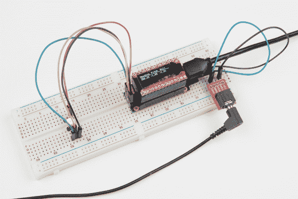](https://cdn.sparkfun.com/assets/learn_tutorials/6/0/2/Teensy_View_Hookup_Guide-17.jpg)*The TeensyView atop a Teensy Prop stack. Notice the attached LED and speaker.*

**硬件要求**

*   青少年 3.1 到 3.6
*   TeensyView 设置如下:
    *   RST 设置为默认
    *   DC 准备替补上场
    *   CS 设置为备用
    *   CLK 设置为默认
    *   mosi 设置为默认值
*   道具盾牌:
    *   (可选)1 个 AP102 连接到 LED 端口- [1m APA102 条](https://www.sparkfun.com/products/14015)或 [5m APA102 条](https://www.sparkfun.com/products/14016)如图所示
    *   (可选)扬声器连接到扬声器端口- [音频插孔](https://www.sparkfun.com/products/8032)和[音频插孔分线点](https://www.sparkfun.com/products/10588)如图所示

从菜单中选择示例 **TeensyViewProp** ，编译并运行。在闪屏之后，草图将开始，显示将切换到方向信息。(注意:由于包含了如此多的库，这可能需要一段时间来编译！)

或者，从这里复制代码:

```
language:c
/******************************************************************************
  TeensyViewProp.ino
  Example using the TeensyView with the Teensy Prop Shield.

  Marshall Taylor @ SparkFun Electronics, December 6, 2016
  https://github.com/sparkfun/SparkFun_TeensyView_Arduino_Library

  This enables all resources on the Teensy Prop Shield and operates them with
  the TeensyView.

  Accelerometer data is used to drive Teensy Audio system (bends pitch)
  Flash is programmed with LED data at boot (note: comment out flash erasor if necessary)
  LED continuously reads flash file for color information (Driven raw by SPI)
  TeensyView continuously updated with pitch, roll, and heading information.

  Compatible with:
  Teensy 3.1 + Prop Shield
  Teensy 3.2 + Prop Shield
  Teensy 3.5 + Prop Shield
  Teensy 3.6 + Prop Shield

  Resources:
  Requires the Teensy Audio library
  NXPMotionSense Library
  EEPROM Library
  SerialFlash Library

  Development environment specifics:
  Arduino IDE 1.6.12
  TeensyView v1.0

  This code is released under the [MIT License](http://opensource.org/licenses/MIT).

  Please review the LICENSE.md file included with this example. If you have any questions
  or concerns with licensing, please contact techsupport@sparkfun.com.

  Distributed as-is; no warranty is given.
******************************************************************************/

//********************IMU test*******************//
#include <NXPMotionSense.h>
#include <Wire.h>
#include <EEPROM.h>
NXPMotionSense imu;
NXPSensorFusion filter;
//********************IMU test*******************//

//********************Audio test*******************//
#include <Audio.h>
#include <Wire.h>
#include <SPI.h>
#include <SD.h>
#include <SerialFlash.h>
// GUItool: begin automatically generated code
AudioSynthWaveformSine   sine4;          //xy=321,367
AudioSynthWaveformSine   sine3;          //xy=323,314
AudioSynthWaveformSine   sine2;          //xy=324,264
AudioSynthWaveformSine   sine1;          //xy=325,213
AudioMixer4              mixer1;         //xy=506,303
AudioSynthWaveformDc     dc1;            //xy=517,382
AudioFilterStateVariable filter1;        //xy=695,311
AudioFilterStateVariable filter2;        //xy=851,342
AudioOutputAnalog        dac1;           //xy=1028,366
AudioConnection          patchCord1(sine4, 0, mixer1, 3);
AudioConnection          patchCord2(sine3, 0, mixer1, 2);
AudioConnection          patchCord3(sine2, 0, mixer1, 1);
AudioConnection          patchCord4(sine1, 0, mixer1, 0);
AudioConnection          patchCord5(mixer1, 0, filter1, 0);
AudioConnection          patchCord6(dc1, 0, filter1, 1);
AudioConnection          patchCord7(dc1, 0, filter2, 1);
AudioConnection          patchCord8(filter1, 0, filter2, 0);
AudioConnection          patchCord9(filter2, 0, dac1, 0);
// GUItool: end automatically generated code
//********************Audio test*******************//

//********************Flash Test*******************//
//#include <SerialFlash.h>
//#include <SPI.h>
const int FlashChipSelect = 6; // digital pin for flash chip CS pin
SerialFlashFile file; //Working file
uint16_t fileIndex = 0;
//********************Flash Test*******************//

//********************TeensyView*******************//
#include <TeensyView.h>  // Include the SFE_TeensyView library

///////////////////////////////////
// TeensyView Object Declaration //
///////////////////////////////////
//Standard
#define PIN_RESET 15
//#define PIN_DC    5
//#define PIN_CS    10
#define PIN_SCK   13
#define PIN_MOSI  11

//Alternate (Audio)
//#define PIN_RESET 2
#define PIN_DC    21
#define PIN_CS    20
//#define PIN_SCK   14
//#define PIN_MOSI  7

TeensyView oled(PIN_RESET, PIN_DC, PIN_CS, PIN_SCK, PIN_MOSI);
//********************TeensyView*******************//

void setup()
{
  // These three lines of code are all you need to initialize the
  // OLED and print the splash screen.
  Serial.begin(115200);
  // Before you can start using the OLED, call begin() to init
  // all of the pins and configure the OLED.
  oled.begin();
  // clear(ALL) will clear out the OLED's graphic memory.
  // clear(PAGE) will clear the Arduino's display buffer.
  oled.clear(ALL);  // Clear the display's memory (gets rid of artifacts)
  // To actually draw anything on the display, you must call the
  // display() function.
  oled.display();

  delay(2000);
  oled.clear(PAGE);
  oled.setCursor(0, 0);
  oled.print("Heading");
  oled.setCursor(50, 0);
  oled.print("Pitch");
  oled.setCursor(90, 0);
  oled.print("Roll");
  oled.line(0, 9, 127, 9);
  oled.display();

  //********************Audio test*******************//
  AudioMemory(40);
  mixer1.gain(0, 0.1);
  mixer1.gain(1, 0.1);
  mixer1.gain(2, 0.1);
  mixer1.gain(3, 0.1);
  filter1.frequency(500);
  filter1.octaveControl(2);
  filter1.resonance(2);
  filter2.frequency(500);
  filter1.octaveControl(2);
  filter2.resonance(2);
  dc1.amplitude(0);
  setSines(110);
  pinMode(5, OUTPUT);
  digitalWrite(5, HIGH); // turn on the amplifier
  delay(10);
  //********************Audio test*******************//

  Serial.begin(9600);

  //********************IMU test*******************//
  imu.begin();
  filter.begin(100);
  //********************IMU test*******************//

  //********************RAW APA102*******************//
  pinMode(7, OUTPUT); //Configure chip select pin
  //********************RAW APA102*******************//

  //********************Flash Test*******************//
  if (!SerialFlash.begin(FlashChipSelect)) {
    Serial.println("Unable to access SPI Flash chip");
  }
  uint8_t id[5];
  SerialFlash.readID(id);
  Serial.println("ID word:");
  Serial.print("0x");
  Serial.println(id[0], HEX);
  Serial.print("0x");
  Serial.println(id[1], HEX);
  Serial.print("0x");
  Serial.println(id[2], HEX);
  Serial.print("0x");
  Serial.println(id[3], HEX);
  //clearFlash();  //Use this to erase all... this holds the program in a while loop when done.
  prepareTestFile();  //This creates a test file IF it doesn't exist
  listTestFile();
  //********************Flash Test*******************//

}
//********************RAW APA102*******************//
void setLED( uint8_t r, uint8_t g, uint8_t b )
{
  uint8_t brightness = 0b00001000; //Quarter bright
  SPI.beginTransaction(SPISettings(4000000, MSBFIRST, SPI_MODE0));
  digitalWrite(7, HIGH);  // enable access to LEDs
  SPI.transfer(0);
  SPI.transfer(0);
  SPI.transfer(0);
  SPI.transfer(0);
  SPI.transfer(0b11100000 | brightness);
  SPI.transfer(b);
  SPI.transfer(g);
  SPI.transfer(r);
  digitalWrite(7, LOW);  // enable access to LEDs
  SPI.endTransaction();
  //This sends data to the LED
}
//********************RAW APA102*******************//

//********************Flash Test*******************//
//Test data for mem R/W (also LED display data, as r1, g1, b1, r2, g2, b2...)
uint8_t const colorwheel[128 * 3] = {
  64, 22, 10, 63, 21, 11, 63, 19, 12, 63, 18, 14, 63, 16, 15, 63, 15, 16, 62, 14, 18, 62, 12, 19,
  61, 11, 21, 60, 10, 22, 60, 9, 24, 59, 8, 25, 58, 7, 27, 57, 6, 28, 56, 5, 30, 55, 4, 32,
  54, 3, 33, 53, 3, 35, 52, 2, 36, 51, 1, 38, 49, 1, 39, 48, 0, 41, 47, 0, 42, 45, 0, 44,
  44, 0, 45, 42, 0, 47, 41, 0, 48, 39, 0, 49, 38, 0, 51, 36, 0, 52, 35, 0, 53, 33, 0, 54,
  32, 1, 55, 30, 1, 56, 28, 2, 57, 27, 3, 58, 25, 3, 59, 24, 4, 60, 22, 5, 60, 21, 6, 61,
  19, 7, 62, 18, 8, 62, 16, 9, 63, 15, 10, 63, 14, 11, 63, 12, 12, 63, 11, 14, 63, 10, 15, 64,
  9, 16, 63, 8, 18, 63, 7, 19, 63, 6, 21, 63, 5, 22, 63, 4, 24, 62, 3, 25, 62, 3, 27, 61,
  2, 28, 60, 1, 30, 60, 1, 32, 59, 0, 33, 58, 0, 35, 57, 0, 36, 56, 0, 38, 55, 0, 39, 54,
  0, 41, 53, 0, 42, 52, 0, 44, 51, 0, 45, 49, 0, 47, 48, 0, 48, 47, 1, 49, 45, 1, 51, 44,
  2, 52, 42, 3, 53, 41, 3, 54, 39, 4, 55, 38, 5, 56, 36, 6, 57, 35, 7, 58, 33, 8, 59, 32,
  9, 60, 30, 10, 60, 28, 11, 61, 27, 12, 62, 25, 14, 62, 24, 15, 63, 22, 16, 63, 21, 18, 63, 19,
  19, 63, 18, 21, 63, 16, 22, 64, 15, 24, 63, 14, 25, 63, 12, 27, 63, 11, 28, 63, 10, 30, 63, 9,
  32, 62, 8, 33, 62, 7, 35, 61, 6, 36, 60, 5, 38, 60, 4, 39, 59, 3, 41, 58, 3, 42, 57, 2,
  44, 56, 1, 45, 55, 1, 47, 54, 0, 48, 53, 0, 49, 52, 0, 51, 51, 0, 52, 49, 0, 53, 48, 0,
  54, 47, 0, 55, 45, 0, 56, 44, 0, 57, 42, 0, 58, 41, 0, 59, 39, 1, 60, 38, 1, 60, 36, 2,
  61, 35, 3, 62, 33, 3, 62, 32, 4, 63, 30, 5, 63, 28, 6, 63, 27, 7, 63, 25, 8, 63, 24, 9
};
void clearFlash( void )
{
  Serial.print("Erasing flash");
  SerialFlash.eraseAll();
  while (SerialFlash.ready() == false)
  {
    // wait, 30 seconds to 2 minutes for most chips
    Serial.print(".");
    delay(100);
  }
  Serial.println("Done!");
  Serial.println("Program held.  Now comment out clearFlash(); and recompile");
  while (1);
}

void prepareTestFile( void )
{
  //Check if file exists, if not, create it.
  if (SerialFlash.exists("testfile.dat") == 0)
  {
    //File doesn't exist
    if (SerialFlash.create("testfile.dat", 128 * 3) == true)
    {
      Serial.println("Created testfile.dat");
    }
    else
    {
      Serial.println("File creation failed!!!");
    }
  }
  if (SerialFlash.exists("testfile.dat"))
  {
    Serial.println("File Exists, trying to open...");
    file = SerialFlash.open("testfile.dat");
    if (file)
    { // true if the file exists
      Serial.println("testfile.dat opened");
      uint8_t buffer[3];
      for (int i = 0; i < (128 * 3); i = i + 3)
      {
        buffer[0] = colorwheel[i];
        buffer[1] = colorwheel[i + 1];
        buffer[2] = colorwheel[i + 2];
        file.seek(i);
        file.write(buffer, 3);
        Serial.print(".");
      }
      file.close();
      Serial.println("Test data generation complete");
    }
    else
    {
      Serial.println("testfile.dat not opened!!!");
    }
  }
}

void listTestFile( void )
{
  file = SerialFlash.open("testfile.dat");
  if (file)
  { // true if the file exists
    Serial.println("testfile.dat opened");
    uint8_t buffer[3];
    fileIndex = 0;
    for (int i = 0; i < 128; i++)
    {
      file.seek(fileIndex);
      fileIndex = fileIndex + 3;
      file.read(buffer, 3);
      Serial.println(buffer[0], HEX);
      Serial.println(buffer[1], HEX);
      Serial.println(buffer[2], HEX);
    }
    file.close();
  }
  else
  {
    Serial.println("testfile.dat not opened!!!");
  }
}
//********************Flash Test*******************//

//********************Audio test*******************//
void setSines(float root)
{
  sine1.frequency(root);
  sine1.amplitude(0.25);
  sine2.frequency(root * 2);
  sine2.amplitude(0.25);
  sine3.frequency(root * 3);
  sine3.amplitude(0.25);
  sine4.frequency(root * 4);
  sine4.amplitude(0.25);
}
//********************Audio test*******************//

void loop()
{
  //********************IMU test*******************//
  float ax, ay, az;
  float gx, gy, gz;
  float mx, my, mz;
  float roll, pitch, heading;
  if (imu.available())
  {
    // Read the motion sensors
    imu.readMotionSensor(ax, ay, az, gx, gy, gz, mx, my, mz);
    // Update the SensorFusion filter
    filter.update(gx, gy, gz, ax, ay, az, mx, my, mz);
    // print the heading, pitch and roll
    roll = filter.getRoll();
    pitch = filter.getPitch();
    heading = filter.getYaw();
    Serial.print("Orientation: ");
    Serial.print(heading);
    Serial.print(" ");
    Serial.print(pitch);
    Serial.print(" ");
    Serial.println(roll);

    //********************Audio test*******************//
    dc1.amplitude(pitch / 20);
    setSines(55 + (roll * 10));
    //********************Audio test*******************//

    //********************TeensyView*******************//
    oled.setCursor(0, 13);
    oled.print("                     ");
    oled.setCursor(0, 13);
    oled.print(heading);
    oled.setCursor(43, 13);
    oled.print(pitch);
    oled.setCursor(83, 13);
    oled.print(roll);
    oled.display();
    //********************TeensyView*******************//
  }
  //********************IMU test*******************//

  //********************Flash Test*******************//
  if (fileIndex >= (128 * 3)) fileIndex = 0;
  fileIndex = fileIndex + 3;
  if (!SerialFlash.begin(FlashChipSelect)) {
    Serial.println("Unable to access SPI Flash chip");
  }
  file = SerialFlash.open("testfile.dat");
  if (file)
  { // true if the file exists
    uint8_t buffer[3];
    file.seek(fileIndex);
    file.read(buffer, 3);
    file.close();
    //Serial.println(buffer[0], HEX); //Show red channel to serial console
    //********************RAW APA102*******************//
    setLED( buffer[0], buffer[1], buffer[2] );
    //********************RAW APA102*******************//
  }
  //********************Flash Test*******************//
} 
```

编译和上传后，TeensyView 将显示航向、俯仰和横滚，同时 LED 证明闪光通信，扬声器证明音频系统正在运行。

## 资源和更进一步

TeensyView 的设计尽可能灵活，同时仍然能够嵌入到 Teensy 的低调附件中。

[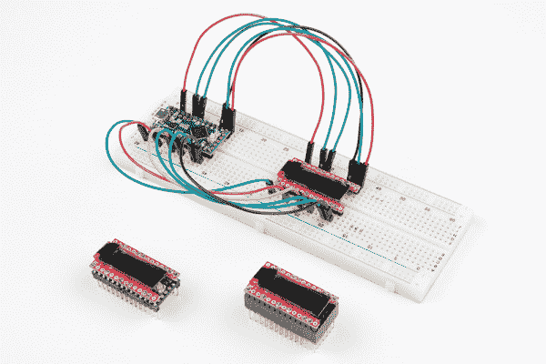](https://cdn.sparkfun.com/assets/learn_tutorials/6/0/2/Teensy_View_Hookup_Guide-18.jpg)*Some various TeensyView-Teensy connections. The bottom centermost TeensyView was created using this guide, while the left is a minimal non-separable configuration. Using a breadboard is also an option.*

TeensyView 使用了一些非常沉重的例子，但它们实际上只是演示。怎么处理由你决定！它们非常适合向移动项目添加简单的调试信息，而勤奋的 pixel 艺术家可以实现整个菜单系统。

有关 SSD1306 控制器和 TeensyView 设计的更多信息，请点击此处:

*   [产品 GitHub 库](https://github.com/sparkfun/TeensyView)
*   [库 GitHub 库](https://github.com/sparkfun/SparkFun_TeensyView_Arduino_Library)
*   [绘制位图](https://learn.sparkfun.com/tutorials/microview-hookup-guide/all#example-4---drawing-bitmaps) -如何制作位图数组
*   [有机发光二极管记忆地图](https://learn.sparkfun.com/tutorials/microview-hookup-guide/all#oled-memory-map)——谈屏幕几何和制作字体

使用 TeensyView 的其他项目和草图:

*   示例文件夹中的[高速测试](https://github.com/sparkfun/SparkFun_TeensyView_Arduino_Library/tree/master/examples/HighSpeedTest)尽可能快地绘制交替像素。这可以用来试验青少年有机发光二极管的极限。

* * *

要获得更多灵感，请查看基于显示器的其他教程:

[](https://learn.sparkfun.com/tutorials/myst-linking-book) [### MYST 连接书](https://learn.sparkfun.com/tutorials/myst-linking-book) Create your own Linking Book from the classic computer game, MYST[Favorited Favorite](# "Add to favorites") 3[](https://learn.sparkfun.com/tutorials/femtobuck-constant-current-led-driver-hookup-guide-v13) [### FemtoBuck 恒流 LED 驱动器连接指南 v13](https://learn.sparkfun.com/tutorials/femtobuck-constant-current-led-driver-hookup-guide-v13) The FemtoBuck board is a high-efficiency, single-channel constant-current LED driver.[Favorited Favorite](# "Add to favorites") 1[](https://learn.sparkfun.com/tutorials/wireless-joystick-hookup-guide) [### 无线操纵杆连接指南](https://learn.sparkfun.com/tutorials/wireless-joystick-hookup-guide) A hookup guide for the SparkFun Wireless Joystick Kit.[Favorited Favorite](# "Add to favorites") 5[](https://learn.sparkfun.com/tutorials/transparent-graphical-oled-breakout-hookup-guide) [### 透明图形有机发光二极管分线点连接指南](https://learn.sparkfun.com/tutorials/transparent-graphical-oled-breakout-hookup-guide) The future is here! Our Qwiic Transparent Graphical OLED Breakout allows you to display custom images on a transparent screen using either I2C or SPI connections.[Favorited Favorite](# "Add to favorites") 4******