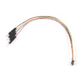
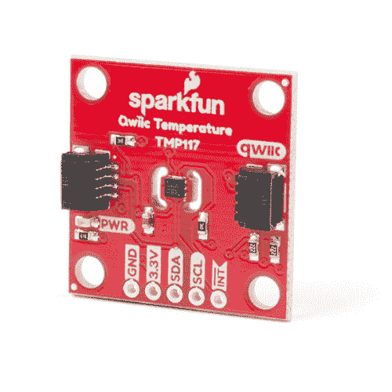

# 温度传感器比较

> 原文：<https://learn.sparkfun.com/tutorials/temperature-sensor-comparison>

## 介绍

这一切都始于我想在 SparkFun 测量一个房间的温度。但是什么是最好的呢？嗯，这取决于你在你的项目中寻找什么。有很多种温度可供选择。本文将比较几个我们携带的比较流行的。

[](https://cdn.sparkfun.com/assets/learn_tutorials/1/1/6/4/Temperature_TMP36_TMP102_TMP117_on_Arduino.jpg)

### 所需材料

为了遵循该比较指南，您至少需要以下部件来连接传感器。你可能不需要所有的东西，这取决于你拥有什么。将它添加到您的购物车，通读指南，并根据需要调整购物车。

[](https://www.sparkfun.com/products/15123) 

将**添加到您的[购物车](https://www.sparkfun.com/cart)中！**

### [spark fun RedBoard Qwiic](https://www.sparkfun.com/products/15123)

[In stock](https://learn.sparkfun.com/static/bubbles/ "in stock") DEV-15123

SparkFun RedBoard Qwiic 是一款 Arduino 兼容开发板，内置 Qwiic 连接器，无需…

$21.5014[Favorited Favorite](# "Add to favorites") 49[Wish List](# "Add to wish list")****[](https://www.sparkfun.com/products/116) 

将**添加到您的[购物车](https://www.sparkfun.com/cart)中！**

### [破开头球——直击](https://www.sparkfun.com/products/116)

[In stock](https://learn.sparkfun.com/static/bubbles/ "in stock") PRT-00116

一排标题-打破适应。40 个引脚，可切割成任何尺寸。用于定制 PCB 或通用定制接头。

$1.7520[Favorited Favorite](# "Add to favorites") 133[Wish List](# "Add to wish list")****[](https://www.sparkfun.com/products/10215) 

将**添加到您的[购物车](https://www.sparkfun.com/cart)中！**

### [USB micro-B 线- 6 脚](https://www.sparkfun.com/products/10215)

[In stock](https://learn.sparkfun.com/static/bubbles/ "in stock") CAB-10215

USB 2.0 型到微型 USB 5 针。这是一种新的、更小的 USB 设备连接器。微型 USB 连接器大约是…

$5.5014[Favorited Favorite](# "Add to favorites") 21[Wish List](# "Add to wish list")****[](https://www.sparkfun.com/products/14426) 

将**添加到您的[购物车](https://www.sparkfun.com/cart)中！**

### [Qwiic 线缆- 50mm](https://www.sparkfun.com/products/14426)

[In stock](https://learn.sparkfun.com/static/bubbles/ "in stock") PRT-14426

这是一根 50 毫米长的 4 芯电缆，带有 1 毫米 JST 端接。它旨在将支持 Qwiic 的组件连接在一起…

$0.95[Favorited Favorite](# "Add to favorites") 29[Wish List](# "Add to wish list")****[](https://www.sparkfun.com/products/14425) 

将**添加到您的[购物车](https://www.sparkfun.com/cart)中！**

### [Qwiic 电缆-试验板跳线(4 针)](https://www.sparkfun.com/products/14425)

[In stock](https://learn.sparkfun.com/static/bubbles/ "in stock") PRT-14425

这是一根跳线适配器电缆，一端带有一个 Qwiic JST 母接头，另一端带有一个试验板连接…

$1.50[Favorited Favorite](# "Add to favorites") 34[Wish List](# "Add to wish list")****[](https://www.sparkfun.com/products/12045) 

将**添加到您的[购物车](https://www.sparkfun.com/cart)中！**

### [【试验板-迷你模块化(蓝色)](https://www.sparkfun.com/products/12045)

[In stock](https://learn.sparkfun.com/static/bubbles/ "in stock") PRT-12045

这个蓝色迷你试验板是你的小项目原型的好方法！有 170 个并列点，刚好有足够的空间买…

$4.50[Favorited Favorite](# "Add to favorites") 6[Wish List](# "Add to wish list")************ ************### 工具

根据你的项目，你可能需要一个烙铁、焊料和[通用焊接附件](https://www.sparkfun.com/categories/49)。

[](https://www.sparkfun.com/products/14456) 

将**添加到您的[购物车](https://www.sparkfun.com/cart)中！**

### [【烙铁- 60W(可调温度)](https://www.sparkfun.com/products/14456)

[In stock](https://learn.sparkfun.com/static/bubbles/ "in stock") TOL-14456

当你不想倾家荡产，但又需要一个可靠的烙铁时，这个可调节温度的烙铁是一个很好的工具…

$16.5016[Favorited Favorite](# "Add to favorites") 43[Wish List](# "Add to wish list")****[](https://www.sparkfun.com/products/9163) 

将**添加到您的[购物车](https://www.sparkfun.com/cart)中！**

### [无铅焊料- 15 克管](https://www.sparkfun.com/products/9163)

[In stock](https://learn.sparkfun.com/static/bubbles/ "in stock") TOL-09163

这是你的无铅焊料的基本管，带有不干净的水溶性树脂芯。0.031 英寸规格，15 克

$3.954[Favorited Favorite](# "Add to favorites") 14[Wish List](# "Add to wish list")**** ****### 推荐阅读

如果您不熟悉下面的概念或整个比较指南中的链接，我们建议您在继续之前查看这些教程，如果您决定重新创建这些测试。

[](https://learn.sparkfun.com/tutorials/how-to-solder-through-hole-soldering) [### 如何焊接:通孔焊接](https://learn.sparkfun.com/tutorials/how-to-solder-through-hole-soldering) This tutorial covers everything you need to know about through-hole soldering.[Favorited Favorite](# "Add to favorites") 70[](https://learn.sparkfun.com/tutorials/analog-to-digital-conversion) [### 模数转换](https://learn.sparkfun.com/tutorials/analog-to-digital-conversion) The world is analog. Use analog to digital conversion to help digital devices interpret the world.[Favorited Favorite](# "Add to favorites") 58[](https://learn.sparkfun.com/tutorials/analog-vs-digital) [### 模拟与数字](https://learn.sparkfun.com/tutorials/analog-vs-digital) This tutorial covers the concept of analog and digital signals, as they relate to electronics.[Favorited Favorite](# "Add to favorites") 66

## 模拟与数字传感器

在比较温度传感器之前，最好先了解一下模拟传感器和数字传感器的区别。

#### 模拟传感器

模拟传感器读取读数并输出平滑、连续的信号。

[](https://cdn.sparkfun.com/assets/learn_tutorials/1/1/6/4/Analog_Signal.png)*Example of a smooth, continuous analog signal.*

这些通常成本较低，易于使用，对于初学者来说非常好。然而，它们需要模数转换器(ADC)来读取输出。微控制器(如 Arduino Uno/RedBoard Qwiic)内置了这一功能(我还没有遇到过没有模拟输入的微控制器)。另一方面，单板计算机(如 Raspberry Pi)没有硬件 ADC，需要专用芯片来读取传感器。

根据传感器的不同，您可能需要构建额外的电路来读取或过滤信号。传感器读数更容易受到电源和电路中其他元件噪声的影响。电线长度也可能影响长距离的读数。

#### 数字传感器

数字传感器输出具有离散步长的信号。

[](https://cdn.sparkfun.com/assets/learn_tutorials/1/1/6/4/Digital_Signal.png)*Example of a discrete digital signal.*

这些可能花费更多。然而，它们更容易包含在设计中，因为它们需要一个串行输出协议。微控制器和单板计算机应该内置基本串行协议(I ² C、UART、SPI)。你只需要确保有一个架构库和你喜欢的编程语言。

数字传感器可以包括附加特征。如果芯片在分线板上，则不需要构建额外的电路。这些传感器不太可能受到电源和电路中其他元件的影响。虽然串行协议在总长度上有限制，但传感器读数不像模拟传感器那样受电线长度的影响。

**Note:** For more information, check out our [Analog vs. Digital](https://learn.sparkfun.com/tutorials/analog-vs-digital) and [Analog to Digital Conversion](https://learn.sparkfun.com/tutorials/analog-to-digital-conversion) tutorials.

[](https://learn.sparkfun.com/tutorials/analog-vs-digital) [### 模拟与数字

#### 2013 年 7 月 18 日](https://learn.sparkfun.com/tutorials/analog-vs-digital) This tutorial covers the concept of analog and digital signals, as they relate to electronics.[Favorited Favorite](# "Add to favorites") 66[](https://learn.sparkfun.com/tutorials/analog-to-digital-conversion) [### 模数转换

#### 2013 年 2 月 7 日](https://learn.sparkfun.com/tutorials/analog-to-digital-conversion) The world is analog. Use analog to digital conversion to help digital devices interpret the world.[Favorited Favorite](# "Add to favorites") 58

## 第一轮:TMP117 对 TMP102 对 TMP36

为了简单起见，让我们比较一下这一轮 SparkFun 目录中的三个[温度传感器](https://www.sparkfun.com/categories/305)！我们将使用这些传感器测量空气的环境温度。

[](https://www.sparkfun.com/products/10988) 

将**添加到您的[购物车](https://www.sparkfun.com/cart)中！**

### [温度传感器- TMP36](https://www.sparkfun.com/products/10988)

[In stock](https://learn.sparkfun.com/static/bubbles/ "in stock") SEN-10988

这与我们的[spark fun Inventor ' s Kit](http://www . spark fun . com/products/12060)中包含的温度传感器相同…

$1.6018[Favorited Favorite](# "Add to favorites") 75[Wish List](# "Add to wish list")****[](https://www.sparkfun.com/products/13314) 

将**添加到您的[购物车](https://www.sparkfun.com/cart)中！**

### [SparkFun 数字温度传感器分线点- TMP102](https://www.sparkfun.com/products/13314)

[In stock](https://learn.sparkfun.com/static/bubbles/ "in stock") SEN-13314

TMP102 是一款易于使用的德州仪器(ti)数字温度传感器。TMP102 分线点可以让你很容易地融入…

$5.506[Favorited Favorite](# "Add to favorites") 28[Wish List](# "Add to wish list")****[](https://www.sparkfun.com/products/15805) 

将**添加到您的[购物车](https://www.sparkfun.com/cart)中！**

### [【spark fun 高精度温度传感器- TMP117 (Qwiic)](https://www.sparkfun.com/products/15805)

[In stock](https://learn.sparkfun.com/static/bubbles/ "in stock") SEN-15805

SparkFun Qwiic TMP117 Breakout 是一款配有 I2C 接口的高精度温度传感器。

$14.954[Favorited Favorite](# "Add to favorites") 29[Wish List](# "Add to wish list")****** ******### TMP36

我们将使用来自 SIK 的[电路连接 TMP36。](https://learn.sparkfun.com/tutorials/sparkfun-inventors-kit-experiment-guide---v41/circuit-4b-temperature-sensor)

| [](https://cdn.sparkfun.com/assets/learn_tutorials/1/1/6/4/Fritzing_Arduino_TMP36_Temperature_Sensor_Comparison_bb.jpg) | [](https://cdn.sparkfun.com/assets/learn_tutorials/1/1/6/4/Temperature_TMP36_on_Arduino.jpg) |
| *烧结电路图* | *RedBoard Qwiic 和 TMP36 连接* |

下面是从 SIK 输出到串行监视器的修改后的示例代码。如果你想继续学习，请获取代码并上传到你的 Arduino！

```
language:c
/******************************************************************************
  TMP36.ino
  Written by Ho Yun "Bobby" Chan
  @ SparkFun Electronics
  Date: Nov 4, 2019
  https://gist.github.com/bboyho/c30b70fc308f41b92a6f1b07e5a54838

  Description: This sketch configures temperature sensor and prints the
  temperature in degrees celsius and fahrenheit. Simply adjust the `output_select`
  to view the °C, °F, or both. Open the Serial Monitor or Plotter at 115200 baud 
  to view the data.

  Development Environment Specifics:
  Arduino 1.8.9+

  License:
  This code is released under the MIT License (http://opensource.org/licenses/MIT)
  Distributed as-is; no warranty is given.

******************************************************************************/

//variables for TMP36
float tmp36_voltage = 0;                      //the voltage measured from the TMP36
float tmp36_degC = 0;                         //the temperature in Celsius, calculated from the voltage
float tmp36_degF = 0;                         //the temperature in Fahrenheit, calculated from the voltage

//0 = output degrees °C
//1 = output degrees °F
//any other number = output degrees °C and °F
int output_select = 1; //select output

void setup() {
  Serial.begin(115200);    // Start serial communication at 115200 baud
  if (output_select == 0 ) {
    Serial.println("TMP36[°C]");
  }
  else if (output_select == 1) {
    Serial.println("TMP36[°F]");
  }
  else {
    Serial.print("TMP36[°C]");
    Serial.print(",");
    Serial.println("TMP36[°F]");
  }
}// end setup

void loop() {
  //get TMP36 readings and calculate
  tmp36_voltage = analogRead(A0) * 0.004882814;   //convert the analog reading, which varies from 0 to 1023, back to a voltage value from 0-5 volts
  tmp36_degC = (tmp36_voltage - 0.5) * 100.0;     //convert the voltage to a temperature in degrees Celsius
  tmp36_degF = tmp36_degC * (9.0 / 5.0) + 32.0;   //convert the voltage to a temperature in degrees Fahrenheit

  if (output_select == 0 ) {
    // Print temperature in °C
    //Serial.print("Temperature in Celsius: ");
    Serial.println(tmp36_degC);//TMP36 temperature
  }
  else if (output_select == 1) {
    // Print temperature in °F
    //Serial.print("Temperature in Fahrenheit: ");
    Serial.println(tmp36_degF);

  }
  else {
    Serial.print(tmp36_degC);       //TMP36 temperature
    Serial.print(",");              //seperator
    Serial.println(tmp36_degF);
  }

  delay(5); // Delay added for easier readings

}//end loop 
```

让我们观察一下当时测量房间环境温度的输出。温度读数似乎在 75.5 华氏度和 76.5 华氏度之间波动。其他时候，输出会出现峰值。(这可能是由于 TMP36 构建在试验板上或电源噪声所致)。在 Vcc 和 GND 之间增加一个去耦电容有助于平滑信号，但我仍然会在读数中得到小尖峰。

[](https://cdn.sparkfun.com/assets/learn_tutorials/1/1/6/4/Arduino_Serial_Plotter_TMP36_Noisy.png)*Click image for a closer view.*

### TMP102 与 TMP36

我们能得到更精确的读数吗？为什么是的，我们可以！让我们尝试使用数字温度传感器进行比较。我将接头焊接到 TMP102 上，并根据 TMP102 连接指南将其安装在试验板上[。使用 Qwiic 电缆连接试验板适配器，可以快速将传感器连接到 RedBoard。](https://learn.sparkfun.com/tutorials/tmp102-digital-temperature-sensor-hookup-guide#hardware-connections)

| [](https://cdn.sparkfun.com/assets/learn_tutorials/1/1/6/4/Fritzing_Arduino_TMP36_TMP102_Temperature_Sensor_Comparison_bb.jpg) | [](https://cdn.sparkfun.com/assets/learn_tutorials/1/1/6/4/Temperature_TMP36_TMP102_on_Arduino.jpg) |
| *烧结电路图* | *RedBoard Qwiic、TMP36 和 TMP102 连接* |

代码调整为在串行监控器中输出 TMP36 和 TMP102，以便进行比较。此外，TMP102 的地址被调整为 **0x49** ，以便与 TMP117 进行比较。如果你想继续学习，请抓取代码并上传到你的 Arduino！

```
language:c
/******************************************************************************
  TMP102vsTMP36.ino
  Written by: Ho Yun "Bobby" Chan
  @ SparkFun Electronics
  Date: Nov 4, 2019

  Description: This sketch configures temperature sensors and prints the
  temperature in degrees celsius and fahrenheit. For comparison, the
  TMP102 and TMP36 temperature sensor is also printed to compare the output
  in degrees celsius and fahrenheit. Simply adjust the `output_select`
  to view the °C, °F, or both. Open the Serial Monitor or Plotter at 115200 baud 
  to view the data.

  Resources/Libraries:
  Wire.h (included with Arduino IDE)
  SparkFunTMP102.h (included in the src folder) https://github.com/sparkfun/SparkFun_TMP102_Arduino_Library

  Development Environment Specifics:
  Arduino 1.8.9+

  License:
  This code is released under the MIT License (http://opensource.org/licenses/MIT)
  Distributed as-is; no warranty is given.

******************************************************************************/

#include <Wire.h>            // Used to establish serial communication on the I2C bus
#include "SparkFunTMP102.h" // Used to send and recieve specific information from our sensor

// The default address of the device is 0x48 = (GND) like the TMP117
// but it's already being used so we use a different address
TMP102 sensor0; //initialize sensor

//variables for TMP36
float tmp36_voltage = 0;                          //the voltage measured from the TMP36
float tmp36_degC = 0;                         //the temperature in Celsius, calculated from the voltage
float tmp36_degF = 0;                         //the temperature in Fahrenheit, calculated from the voltage

//0 = output degrees °C
//1 = output degrees °F
//any other number = output degrees °C and °F
int output_select = 1; //select output

void setup()
{
  Wire.begin();
  sensor0.begin(0x49);
  Serial.begin(115200);    // Start serial communication at 115200 baud
  Wire.setClock(400000);   // Set clock speed to be the fastest for better communication (fast mode)

  sensor0.wakeup();//turn on TMP102

  if (output_select == 0 ) {
    Serial.println("TMP102[°C]");
    Serial.print(",");
    Serial.println("TMP36[°C]");

  }
  else if (output_select == 1) {
    Serial.print("TMP102[°F]");
    Serial.print(",");
    Serial.println("TMP36[°F]");
  }
  else {
    Serial.println("TMP102[°C]");
    Serial.print(",");
    Serial.print("TMP36[°C]");
    Serial.print(",");
    Serial.print("TMP102[°F]");
    Serial.print(",");
    Serial.println("TMP36[°F]");
  }
}

void loop()
{

  //get TMP102 sensor readings
  float tmp102_tempC = sensor0.readTempC();
  float tmp102_tempF = sensor0.readTempF();

  //get TMP36 readings and calculate
  tmp36_voltage = analogRead(A0) * 0.004882814;   //convert the analog reading, which varies from 0 to 1023, back to a voltage value from 0-5 volts
  tmp36_degC = (tmp36_voltage - 0.5) * 100.0;       //convert the voltage to a temperature in degrees Celsius
  tmp36_degF = tmp36_degC * (9.0 / 5.0) + 32.0; //convert the voltage to a temperature in degrees Fahrenheit

  if (output_select == 0 ) {
    // Print temperature in °C
    //Serial.print("Temperature in Celsius: ");
    Serial.println(tmp102_tempC);  //TMP102 temperature
    Serial.print(",");  //seperator
    Serial.println(tmp36_degC);//TMP36 temperature
  }
  else if (output_select == 1) {
    // Print temperature in °F
    //Serial.print("Temperature in Fahrenheit: ");
    Serial.print(tmp102_tempF);  //TMP102 temperature
    Serial.print(",");  //seperator
    Serial.println(tmp36_degF);

  }
  else {
    Serial.print(tmp102_tempC);//TMP102 temperature
    Serial.print(",");  //seperator
    Serial.print(tmp36_degC);//TMP36 temperature
    Serial.print(",");  //seperator
    Serial.print(tmp102_tempF);
    Serial.print(",");              //seperator
    Serial.println(tmp36_degF);
  }

  delay(50); // Delay added for easier readings
} 
```

在不同时刻获取一组数据点来测量房间的环境温度后，TMP102 表现更好。温度读数保持稳定，没有噪音。在图中很难看到，但是打开串行监视器，温度读数只在 76.52 华氏度和 76.64 华氏度之间跳跃。

[](https://cdn.sparkfun.com/assets/learn_tutorials/1/1/6/4/Arduino_Serial_Plotter_TMP36_TMP102.png)*Click image for a closer view.*

### TMP117 与 TMP102 和 TMP36

不错，但是我们能得到更好的温度读数吗？为什么是的，我们可以！连接 TMP117 更容易，因为[电路只需在 RedBoard Qwiic 和 TMP117 之间增加一根 Qwiic 电缆](https://learn.sparkfun.com/tutorials/qwiic-tmp117-high-precision-digital-temperature-sensor-hookup-guide#hardware-hookup)。

| [](https://cdn.sparkfun.com/assets/learn_tutorials/1/1/6/4/Fritzing_Arduino_TMP36_TMP102_TMP117_Temperature_Sensor_Comparison_bb.jpg) | [](https://cdn.sparkfun.com/assets/learn_tutorials/1/1/6/4/Temperature_TMP36_TMP102_TMP117_on_Arduino.jpg) |
| *烧结电路图* | *RedBoard Qwiic、TMP36、TMP102 和 TMP117 连接* |

再次调整代码，将 TMP117 与其它传感器进行比较。如果你想继续学习，请抓取代码并上传到你的 Arduino！

```
language:c
/******************************************************************************
  TMP117vsTMP102vsTMP36.ino
  Written by: Ho Yun "Bobby" Chan
  @ SparkFun Electronics
  Date: Nov 4, 2019

  Description: This sketch configures temperature sensors and prints the
  temperature in degrees celsius and fahrenheit. For comparison, the
  TMP117, TMP102, and TMP36 temperature sensor is also printed to compare the output
  in degrees celsius and fahrenheit. Simply adjust the `output_select`
  to view the °C, °F, or both. Open the Serial Monitor or Plotter at 115200 baud 
  to view the data.

  Resources/Libraries:
  Wire.h (included with Arduino IDE)
  SparkFunTMP117.h (included in the src folder) http://librarymanager/All#SparkFun_TMP117
  SparkFunTMP102.h (included in the src folder) https://github.com/sparkfun/SparkFun_TMP102_Arduino_Library

  Development Environment Specifics:
  Arduino 1.8.9+

  License:
  This code is released under the MIT License (http://opensource.org/licenses/MIT)
  Distributed as-is; no warranty is given.

******************************************************************************/

/*
  NOTE: For the most accurate readings using the TMP117:
  - Avoid heavy bypass traffic on the I2C bus
  - Use the highest available communication speeds
  - Use the minimal supply voltage acceptable for the system
  - Place device horizontally and out of any airflow when storing
  For more information on reaching the most accurate readings from the sensor,
  reference the "Precise Temperature Measurements with TMP116" datasheet that is
  linked on Page 35 of the TMP117's datasheet
*/

#include <Wire.h>            // Used to establish serial communication on the I2C bus
#include <SparkFun_TMP117.h> // Used to send and recieve specific information from our sensor
#include "SparkFunTMP102.h" // Used to send and recieve specific information from our sensor

// The default address of the device is 0x48 = (GND)
TMP117 sensor; // Initalize sensor

// The default address of the device is 0x48 = (GND) as well
// but it's already being used so we use a different address
TMP102 sensor0; //initialize sensor

//variables for TMP36
float tmp36_voltage = 0;                          //the voltage measured from the TMP36
float tmp36_degC = 0;                         //the temperature in Celsius, calculated from the voltage
float tmp36_degF = 0;                         //the temperature in Fahrenheit, calculated from the voltage

//0 = output degrees °C
//1 = output degrees °F
//any other number = output degrees °C and °F
int output_select = 1; //select output

void setup()
{
  Wire.begin();
  sensor0.begin(0x49);
  Serial.begin(115200);    // Start serial communication at 115200 baud
  Wire.setClock(400000);   // Set clock speed to be the fastest for better communication (fast mode)

  //Serial.println("TMP117 Example 1: Basic Readings");
  if (sensor.begin() == true ) // Function to check if the sensor will correctly self-identify with the proper Device ID/Address
  {
    //Serial.println("Begin");

    sensor0.wakeup();//turn on TMP102

    if (output_select == 0 ) {
      Serial.print("TMP117[°C]");
      Serial.print(",");
      Serial.println("TMP102[°C]");
      Serial.print(",");
      Serial.println("TMP36[°C]");

    }
    else if (output_select == 1) {
      Serial.print("TMP117[°F]");
      Serial.print(",");
      Serial.print("TMP102[°F]");
      Serial.print(",");
      Serial.println("TMP36[°F]");
    }
    else {
      Serial.print("TMP117[°C]");
      Serial.print(",");
      Serial.println("TMP102[°C]");
      Serial.print(",");
      Serial.print("TMP36[°C]");
      Serial.print(",");
      Serial.print("TMP117[°F]");
      Serial.print(",");
      Serial.print("TMP102[°F]");
      Serial.print(",");
      Serial.println("TMP36[°F]");
    }
  }
  else
  {
    Serial.println("Device failed to setup- Freezing code.");
    while (1); // Runs forever
  }
}

void loop()
{
  // Data Ready is a flag for the conversion modes - in continous conversion the dataReady flag should always be high
  if (sensor.dataReady() == true) // Function to make sure that there is data ready to be printed, only prints temperature values when data is ready
  {
    //get TMP117 sensor readings
    float tempC = sensor.readTempC();
    float tempF = sensor.readTempF();

    //get TMP102 sensor readings
    float tmp102_tempC = sensor0.readTempC();
    float tmp102_tempF = sensor0.readTempF();

    //get TMP36 readings and calculate
    tmp36_voltage = analogRead(A0) * 0.004882814;   //convert the analog reading, which varies from 0 to 1023, back to a voltage value from 0-5 volts
    tmp36_degC = (tmp36_voltage - 0.5) * 100.0;       //convert the voltage to a temperature in degrees Celsius
    tmp36_degF = tmp36_degC * (9.0 / 5.0) + 32.0; //convert the voltage to a temperature in degrees Fahrenheit

    if (output_select == 0 ) {
      // Print temperature in °C
      //Serial.print("Temperature in Celsius: ");
      Serial.print(tempC);//TMP117 temperature
      Serial.print(",");  //seperator
      Serial.println(tmp102_tempC);  //TMP102 temperature
      Serial.print(",");  //seperator
      Serial.println(tmp36_degC);//TMP36 temperature
    }
    else if (output_select == 1) {
      // Print temperature in °F
      //Serial.print("Temperature in Fahrenheit: ");
      Serial.print(tempF);
      Serial.print(",");              //seperator
      Serial.print(tmp102_tempF);  //TMP102 temperature
      Serial.print(",");  //seperator
      Serial.println(tmp36_degF);

    }
    else {
      Serial.print(tempC);//TMP117 temperature
      Serial.print(",");  //seperator
      Serial.print(tmp102_tempF);  //TMP102 temperature
      Serial.print(",");  //seperator
      Serial.print(tmp36_degC);//TMP36 temperature
      Serial.print(",");  //seperator
      Serial.print(tempF);
      Serial.print(",");  //seperator
      Serial.print(tmp102_tempF);  //TMP102 temperature
      Serial.print(",");              //seperator
      Serial.println(tmp36_degF);
    }

    //delay(5); // Delay added for easier readings
  }
} 
```

在不同时间获取另一组数据点后，TMP117 的表现优于 TMP102 和 TMP36。数据点更加平滑，不容易出现噪音。通过串行监视器仔细观察这些值，TMP117 的温度读数会在 75.99°F 和 76.02°F 之间跳跃。在一个例子中，TMP36 的输出开始出现尖峰，就像我们在使用 TMP36 的初始测试中看到的那样。

| [](https://cdn.sparkfun.com/assets/learn_tutorials/1/1/6/4/Arduino_Serial_Plotter_TMP36_TMP102_TMP117.png) | [](https://cdn.sparkfun.com/assets/learn_tutorials/1/1/6/4/TMP36_Spikes_Temperature_Sensor.png) |
| *点击图像查看详情。* |

### 好，更好，最好？哪个最好？

所以，你可能会问，三个温度传感器哪个最好？嗯，那真的取决于你打算如何使用它。在我看来，Qwiic TMP117 是我眼中这一轮的赢家。它能够测量房间的温度，没有很多抖动，并且很容易与 Qwiic 系统连接。查看数据手册时，传感器表现与预期一致。该板不需要任何焊接。不需要构建额外的电路或代码来平均温度传感器读数。电源不会像模拟温度传感器那样对数字温度传感器造成太大的波动。

如果我不需要如此精确的室内温度读数，TMP102 也可以工作。虽然它不像 TMP117 那样昂贵，但这种版本的 TMP102 板^([【1】](#qwiic_tmp102))确实需要一些焊接。TMP36 很好，但需要更多的努力来滤除误差。

[[ 1 ]](#qwiic_tmp102) **Note:** At the time of writing, we had not released the Qwiic version of the TMP102\. Check ont the "qwiic-er" way to connect with the [Qwiic TMP102](https://www.sparkfun.com/products/16304)!

### 其他考虑

为简单起见，使用三个传感器作为开箱即用的对比，来测量空气的环境温度。这没有考虑其他因素，例如:

*   每个传感器的偏移温度
*   其他具有更高 ADC 的微控制器，用于比较模拟传感器
*   范围(例如，您是在室温下还是在烤箱中测量物体的温度)
*   中等(例如，您正在测量空气中或水中物体的温度)
*   电流消耗
*   能够测量湿度、气压和海拔的温度传感器

#### [提高 TMP36 读数](#improving_tmp36_readings)

还有一些提高 TMP36 温度读数的技术:

*   [平均 TMP36 值](https://gist.github.com/bboyho/2dced710f24ce3aeb021c8607af05f1e)
*   添加[去耦电容](https://learn.sparkfun.com/tutorials/capacitors/application-examples#decoupling)
*   将 TMP36 的模拟基准电压调整为 3.3V

## 资源和更进一步

寻找更多与温度相关的乐趣？查看来自 SparkFun 的其他相关教程。

[](https://learn.sparkfun.com/tutorials/max31855k-thermocouple-breakout-hookup-guide) [### MAX31855K 热电偶分接头连接指南](https://learn.sparkfun.com/tutorials/max31855k-thermocouple-breakout-hookup-guide) Learn how to take readings with a k-type thermocouple using the MAX31855K cold-junction-compensated k-type thermocouple-to-digital converter.[Favorited Favorite](# "Add to favorites") 3[](https://learn.sparkfun.com/tutorials/hih-4030-humidity-sensor-hookup-guide) [### HIH-4030 湿度传感器连接指南](https://learn.sparkfun.com/tutorials/hih-4030-humidity-sensor-hookup-guide) Measure relative humidity with SparkFun's HIH-4030 Humidity Sensor Breakout.[Favorited Favorite](# "Add to favorites") 2[](https://learn.sparkfun.com/tutorials/rht03-dht22-humidity-and-temperature-sensor-hookup-guide) [### RHT03 (DHT22)湿度和温度传感器连接指南](https://learn.sparkfun.com/tutorials/rht03-dht22-humidity-and-temperature-sensor-hookup-guide) Measure relative humidity and temperature or your environment with the RHT03 (a.k.a DHT22) low cost sensor on a single wire digital interface connected to an Arduino 4[](https://learn.sparkfun.com/tutorials/qwiic-atmospheric-sensor-bme280-hookup-guide) [### Qwiic 大气传感器(BME280)连接指南](https://learn.sparkfun.com/tutorials/qwiic-atmospheric-sensor-bme280-hookup-guide) Measure temperature, humidity, barometric pressure with the SparkFun Atmospheric Sensor Breakout BME280 (Qwiic).[Favorited Favorite](# "Add to favorites") 4**********************