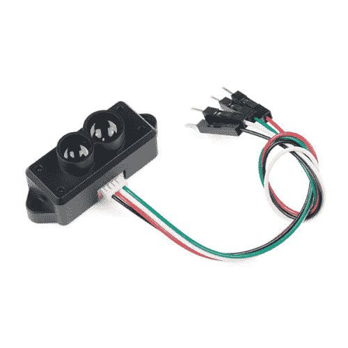
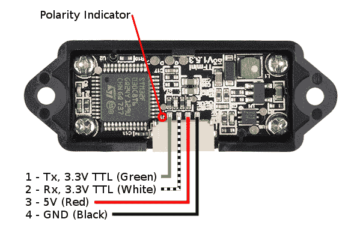
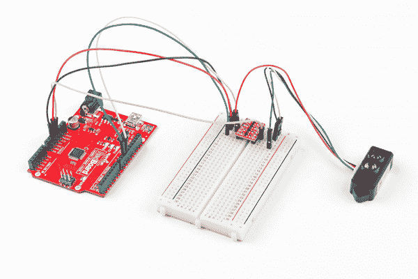
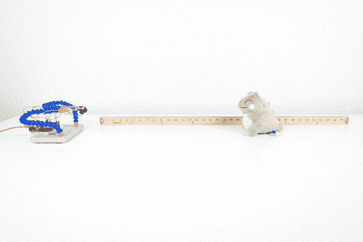
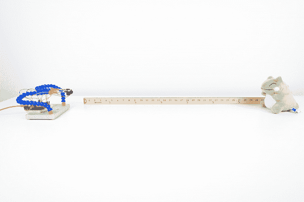

# TF 微型激光雷达模块连接指南

> 原文：<https://learn.sparkfun.com/tutorials/tfmini---micro-lidar-module-hookup-guide>

## 介绍

**Heads up!** This tutorial is for the TFMini that outputs serial data via UART. If you are using the Qwiic enabled TFMini that outputs serial data via I²C [ [SEN-14786](https://www.sparkfun.com/products/14786) ], please refer to the [TFMini - Micro LiDAR Module (Qwiic) Hookup Guide](https://learn.sparkfun.com/tutorials/tfmini---micro-lidar-module-qwiic-hookup-guide).

TFMini 是一种 ToF(飞行时间)激光雷达传感器，能够测量距离物体近至 30 厘米远至 12 米的距离！TFMini 允许您将激光雷达集成到传统上为小型传感器保留的应用中，如 SHARP GP 系列红外测距仪。在本教程中，您将学习如何使用 Arduino 微控制器连接到 TFMini。

[](https://www.sparkfun.com/products/retired/14588) 

### [TFMini - Micro 激光雷达模块](https://www.sparkfun.com/products/retired/14588)

[Retired](https://learn.sparkfun.com/static/bubbles/ "Retired") SEN-14588

TFMini 是一种 ToF(飞行时间)激光雷达传感器，能够测量到近至 30 厘米的物体的距离

6 **Retired**[Favorited Favorite](# "Add to favorites") 26[Wish List](# "Add to wish list")

### 所需材料

要跟随本教程，您将需要以下材料。你可能不需要所有的东西，这取决于你拥有什么。将它添加到您的购物车，通读指南，并根据需要调整购物车。

[](https://www.sparkfun.com/products/12009) 

将**添加到您的[购物车](https://www.sparkfun.com/cart)中！**

### [SparkFun 逻辑电平转换器-双向](https://www.sparkfun.com/products/12009)

[In stock](https://learn.sparkfun.com/static/bubbles/ "in stock") BOB-12009

SparkFun 双向逻辑电平转换器是一个小型设备，可以安全地将 5V 信号降压至 3.3V，并升压 3。…

$3.50116[Favorited Favorite](# "Add to favorites") 146[Wish List](# "Add to wish list")****[](https://www.sparkfun.com/products/13975) 

将**添加到您的[购物车](https://www.sparkfun.com/cart)中！**

### [spark fun red board——用 Arduino 编程 T3](https://www.sparkfun.com/products/13975)

[In stock](https://learn.sparkfun.com/static/bubbles/ "in stock") DEV-13975

SparkFun RedBoard 结合了 UNO 的 Optiboot 引导程序的简单性、FTDI 的稳定性和 shield com…

$21.5049[Favorited Favorite](# "Add to favorites") 89[Wish List](# "Add to wish list")****[](https://www.sparkfun.com/products/12002) 

将**添加到您的[购物车](https://www.sparkfun.com/cart)中！**

### [【试验板-不干胶(白色)](https://www.sparkfun.com/products/12002)

[In stock](https://learn.sparkfun.com/static/bubbles/ "in stock") PRT-12002

这是你的尝试和真正的白色无焊试验板。它有 2 条电源总线，10 列，30 行，总共 400 个连接…

$5.5048[Favorited Favorite](# "Add to favorites") 93[Wish List](# "Add to wish list")****[](https://www.sparkfun.com/products/116) 

将**添加到您的[购物车](https://www.sparkfun.com/cart)中！**

### [破开头球——直击](https://www.sparkfun.com/products/116)

[In stock](https://learn.sparkfun.com/static/bubbles/ "in stock") PRT-00116

一排标题-打破适应。40 个引脚，可切割成任何尺寸。用于定制 PCB 或通用定制接头。

$1.7520[Favorited Favorite](# "Add to favorites") 133[Wish List](# "Add to wish list")****[](https://www.sparkfun.com/products/11026) 

将**添加到您的[购物车](https://www.sparkfun.com/cart)中！**

### [跳线标准 7" M/M - 30 AWG (30 个装)](https://www.sparkfun.com/products/11026)

[In stock](https://learn.sparkfun.com/static/bubbles/ "in stock") PRT-11026

如果你需要快速完成一个原型，没有什么比一堆跳线更能加快速度的了，让我们来看看

$2.4520[Favorited Favorite](# "Add to favorites") 43[Wish List](# "Add to wish list")****[](https://www.sparkfun.com/products/11301) 

将**添加到您的[购物车](https://www.sparkfun.com/cart)中！**

### [SparkFun USB 迷你-B 线- 6 脚](https://www.sparkfun.com/products/11301)

[In stock](https://learn.sparkfun.com/static/bubbles/ "in stock") CAB-11301

这是一条 USB 2.0 型到 Mini-B 型 5 针电缆。你知道，通常带有 USB 集线器、相机、MP3 的迷你 B 连接器…

$4.503[Favorited Favorite](# "Add to favorites") 20[Wish List](# "Add to wish list")************ ************#### 工具

你需要一个烙铁、焊料和一般的焊接附件。

[](https://www.sparkfun.com/products/14228) 

### [威勒 WLC100 焊台](https://www.sparkfun.com/products/14228)

[Out of stock](https://learn.sparkfun.com/static/bubbles/ "out of stock") TOL-14228

Weller 的 WLC100 是一款多功能的 5 瓦至 40 瓦焊台，非常适合业余爱好者、DIY 爱好者和学生。…

2[Favorited Favorite](# "Add to favorites") 17[Wish List](# "Add to wish list")[](https://www.sparkfun.com/products/9325) 

将**添加到您的[购物车](https://www.sparkfun.com/cart)中！**

### [无铅焊料- 100 克线轴](https://www.sparkfun.com/products/9325)

[In stock](https://learn.sparkfun.com/static/bubbles/ "in stock") TOL-09325

这是带有水溶性树脂芯的无铅焊料的基本线轴。0.031 英寸规格，100 克。这是一个好主意…

$9.957[Favorited Favorite](# "Add to favorites") 33[Wish List](# "Add to wish list")** **### 推荐阅读

如果您不熟悉以下概念，我们建议您在继续之前查看这些教程。

[](https://learn.sparkfun.com/tutorials/serial-communication) [### 串行通信](https://learn.sparkfun.com/tutorials/serial-communication) Asynchronous serial communication concepts: packets, signal levels, baud rates, UARTs and more 100[](https://learn.sparkfun.com/tutorials/installing-an-arduino-library) [### 安装 Arduino 库](https://learn.sparkfun.com/tutorials/installing-an-arduino-library) How do I install a custom Arduino library? It's easy! This tutorial will go over how to install an Arduino library using the Arduino Library Manager. For libraries not linked with the Arduino IDE, we will also go over manually installing an Arduino library.[Favorited Favorite](# "Add to favorites") 22[](https://learn.sparkfun.com/tutorials/logic-levels) [### 逻辑电平](https://learn.sparkfun.com/tutorials/logic-levels) Learn the difference between 3.3V and 5V devices and logic levels.[Favorited Favorite](# "Add to favorites") 82

## 硬件概述

**Note:** This product does not use laser light for ranging. Instead it contains an LED and optics. Many such systems are being marketed under the name "LiDAR," although it may be more appropriate to think of this device as a "Time-of-Flight Infrared Rangefinder". It differs significantly from traditional IR rangefinders in that it uses ToF to determine range and not triangulation — as is performed by the Sharp GP-series devices.

该传感器通过发出调制的近红外光来工作。从物体反射的光返回到传感器的接收器。两者之间的距离可以使用传感器通过计算时间和相位差来转换。测量的距离可能因环境和物体的反射率而异。

### 输入功率

根据[数据表(第 4 页)](https://cdn.sparkfun.com/assets/5/e/4/7/b/benewake-tfmini-datasheet.pdf)输入电压在 *4.5V-6V* 之间。在本教程中，我们将应用 **5V** 传感器。

**Current Draw Testing and Analysis:** According to the datasheet, TFMini may pull up to **~800mA** at peak current. Testing with a multimeter set to measure current and a 5V/2A power supply, the sensor was pulling about *66mA-68mA* by itself. When using a 5V Arduino, logic level converter, and the sensor, the sensor was pulling about *98mA-92mA*. For basic tests, 5V/500mA from a USB port should suffice.

You may want to consider providing a sufficient power supply when using the sensor in a project.

### 逻辑电平

虽然传感器可以 5V 供电，但串行 UART 引脚只有 **3.3V 逻辑**。使用 5V 微控制器读取传感器时，确保使用逻辑电平转换器。

### 插脚引线图

极化连接器旁边有一个标记，表示极性为“ **J1** ”，如下图所示。这在参考传感器引脚排列时很有用。

[](https://cdn.sparkfun.com/assets/learn_tutorials/7/4/2/14588-TFMini_-_Micro_Infrared_Module-03_Pinout_small.png)

| 插脚数 | 我的皮诺曹 | 电线颜色 |
| one | UART_TX ( **3.3V TTL** ) | 格林（姓氏）；绿色的 |
| Two | UART_RX ( **3.3V TTL** ) | 怀特（姓氏） |
| three | **5V** | 红色 |
| four | GND | 黑色 |

## 硬件连接

**Advanced Users:** For those that have experience with Arduino, you could go smaller and use a [5V/16MHz Arduino Pro Mini](https://www.sparkfun.com/products/11113)! Just make sure to also power the TFMini with 5V and use a [logic level converter](https://www.sparkfun.com/products/12009).

出于本教程的目的，我们将使用 5V Arduino。需要一个微控制器和逻辑电平转换器，以便通过串行 UART 引脚读取传感器值。在试验板上进行连接之前，确保将[公头引脚](https://www.sparkfun.com/products/116)焊接到转换器。首先从 Arduino 的高端开始连接，然后连接到 TFMini。然后按照下面列出的连接表继续进行其余的连接。

| 5V Arduino，带 Atmega328P | 逻辑电平转换器*(高端)* | 逻辑电平转换器*(低端)* | TFMini |
| 软件串行 RX
*(引脚 10)* | HV1 | LV1 | UART_TX (3.3V TTL)
*(引脚 1)* |
| 软件串行 TX
*(引脚 11)* | HV4 | LV4 | UART_RX (3.3V TTL)
*(引脚 2)* |
| 3.3V |  | LV |  |
| 5V | 超速(Hyper-Velocity) |  | Vin (4.5V-6V)
*(引脚 3)* |
| GND | GND | GND | GND
*(引脚 4)* |

一旦我们完成，它应该看起来像下面的图像。

[](https://cdn.sparkfun.com/assets/learn_tutorials/7/4/2/TFMini_HardwareHookup.jpg)

## 示例代码

**注意:**此示例假设您在桌面上使用的是最新版本的 Arduino IDE。如果这是你第一次使用 Arduino，请回顾我们关于[安装 Arduino IDE 的教程。](https://learn.sparkfun.com/tutorials/installing-arduino-ide)如果您之前没有安装 Arduino 库，请查看我们的[安装指南。](https://learn.sparkfun.com/tutorials/installing-an-arduino-library)

使用库管理器下载并安装 Peter Jansen 的 **Arduino TFMini 库**。你也可以从下面的按钮下载库，从 [GitHub 库](https://github.com/opensensinglab/tfmini)手动安装。

[Download TFMini Arduino Library (ZIP)](https://github.com/opensensinglab/tfmini/archive/master.zip)

拿一根迷你 USB 电缆，将 Arduino 连接到您的电脑。将库示例中包含的 **BasicReading.ino** 上传到您的 Arduino。确保使用正确的 COM 端口和主板选择。

上传后，试着在传感器前移动一个物体进行测试。在下面的例子中，当检测到距离传感器一定距离的物体时，第三只手用于握住 TFMini。由于传感器不能检测到距离小于 11.8 英寸(或 30cm = 0.3m)的物体，所以被测物体被放置在 20 英寸和 30 英寸处。

| [](https://cdn.sparkfun.com/assets/learn_tutorials/7/4/2/TFMini_Distance_20Inches.jpg) | [](https://cdn.sparkfun.com/assets/learn_tutorials/7/4/2/TFMini_Distance_30Inches.jpg) |
| *TFMini 读取 20 英寸处的物体* | *TFMini 读取 30 英寸处的物体* |

在 **115200** 处打开[串行监视器](https://learn.sparkfun.com/tutorials/terminal-basics/arduino-serial-monitor-windows-mac-linux)，您可能会看到类似于下面打印的值的输出。使用一根码尺，当移动一个 20 英寸到 30 英寸的物体时，这些值的响应与预期的一样。

```
Initializing...
54 cm      sigstr: 457
54 cm      sigstr: 456
54 cm      sigstr: 456
54 cm      sigstr: 456
55 cm      sigstr: 456
54 cm      sigstr: 456
54 cm      sigstr: 456
54 cm      sigstr: 457
67 cm      sigstr: 340
70 cm      sigstr: 315
71 cm      sigstr: 315
77 cm      sigstr: 283
77 cm      sigstr: 283
77 cm      sigstr: 283
77 cm      sigstr: 283
77 cm      sigstr: 284
78 cm      sigstr: 281
78 cm      sigstr: 281
78 cm      sigstr: 282
78 cm      sigstr: 282
78 cm      sigstr: 283 
```

**Troubleshooting:** If you are receiving an error similar to the output below, it could be due to a few reasons.

```
TF Mini error: too many measurement attempts
Last error:
ERROR_SERIAL_NOHEADER
65535 cm      sigstr: 65535

```

This may be caused by your Arduino not properly communicating with the TFMini. For example, the [maximum baud an Arduino at 8MHz can handle with the software serial library is 57600 baud](https://forum.arduino.cc/index.php?topic=54623.msg391081#msg391081). If you are using a 3.3V/8MHz Arduino Pro Mini with a baud rate of 115200, it is probably too high which can cause unreliable readings. It is recommended to use a 5V/16MHz Arduino if you are using the software serial library to communicate with the sensor at 115200\.

As an alternative to check if the TFMini is still functioning at small distances, you can try using the [TFMini's GUI](http://www.benewake.com/en/down.html) with a [USB-to-Serial cable](https://www.sparkfun.com/products/9717). Just make sure that you are providing 5V for Vcc and communicating with 3.3V logic levels.

## 资源和更进一步

现在您已经成功地启动并运行了 TFMini，是时候将它合并到您自己的项目中了！有关 TFMini 的更多信息，请查看以下链接:

*   [数据表(PDF)](https://cdn.sparkfun.com/assets/5/e/4/7/b/benewake-tfmini-datasheet.pdf)
*   贝内威克
    *   [常见问题解答](http://www.benewake.com/en/questions.html)
    *   [TFMini 下载量](http://www.benewake.com/en/down.html)
    *   [YouTube: TFMini SDK 演示](https://www.youtube.com/watch?v=9ON-5qJTDk0)
*   其他示例
    *   [说明:Benewake Lidar TFMini(完整指南)](http://www.instructables.com/id/Benewake-LiDAR-TFmini-Complete-Guide/) -有关 USB 转串行转换器和 Python 的其他示例，请查看该指南！可以把 TFMini 和树莓派搭配使用！
    *   DIY 无人机论坛:如何在 PixHawk 上安装 bene wake TF series-查看这个论坛帖子，将 TFMini 连接到 PixHawk，以便检测您的无人机的绝对高度。
    *   [GitHub Repo:TF mini _ MAXBOTIX _ EMULATOR](https://github.com/patrickpoirier51/TFMINI_MAXBOTIX_EMULATOR)
*   [GitHub Repo Arduino 库](https://github.com/opensensinglab/tfmini)

你的下一个项目需要一些灵感吗？查看一些相关教程:

[](https://learn.sparkfun.com/tutorials/vl6180-hookup-guide) [### VL6180 连接指南](https://learn.sparkfun.com/tutorials/vl6180-hookup-guide) Get started with your VL6180 based sensor or the VL6180 breakout board.[Favorited Favorite](# "Add to favorites") 6[](https://learn.sparkfun.com/tutorials/building-an-autonomous-vehicle-the-batmobile) [### 建造自主车辆:蝙蝠战车](https://learn.sparkfun.com/tutorials/building-an-autonomous-vehicle-the-batmobile) Documenting a six-month project to race autonomous Power Wheels at the SparkFun Autonomous Vehicle Competition (AVC) in 2016\.[Favorited Favorite](# "Add to favorites") 8[](https://learn.sparkfun.com/tutorials/lidar-lite-v3-hookup-guide) [### LIDAR-Lite v3 连接指南](https://learn.sparkfun.com/tutorials/lidar-lite-v3-hookup-guide) A tutorial for connecting the Garmin LIDAR-Lite v3 or the LIDAR-Lite v3HP to an Arduino to measure distance.[Favorited Favorite](# "Add to favorites") 6[](https://learn.sparkfun.com/tutorials/qwiic-distance-sensor-rfd77402-hookup-guide) [### Qwiic 距离传感器(RFD77402)连接指南](https://learn.sparkfun.com/tutorials/qwiic-distance-sensor-rfd77402-hookup-guide) The RFD77402 uses an infrared VCSEL (Vertical Cavity Surface Emitting Laser) TOF (Time of Flight) module capable of millimeter precision distance readings up to 2 meters. It’s also part of SparkFun’s Qwiic system, so you won’t have to do any soldering to figure out how far away things are.[Favorited Favorite](# "Add to favorites") 2**************