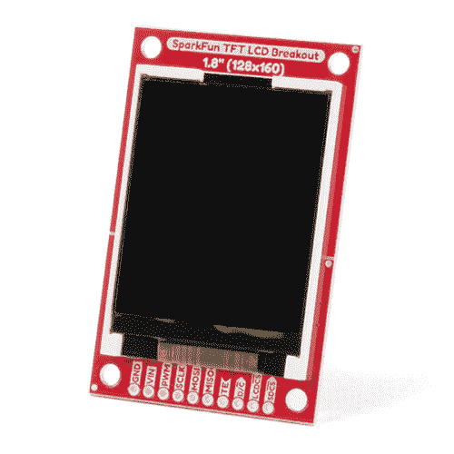

# TFT LCD 引线盒 1.8 英寸 128x160 连接指南

> 原文：<https://learn.sparkfun.com/tutorials/tft-lcd-breakout-18in-128x160-hookup-guide>

## 介绍

【128x160 英寸 1.8 英寸 TFT LCD 分线点是一种多功能、多彩且简单的方式，可用于试验图形或为您的项目创建用户界面。在本指南中，我们将熟悉硬件，解释如何将显示器连接到您选择的微控制器，介绍如何安装 Arduino 库，并概述您可以开始使用的软件示例。

 

将**添加到您的[购物车](https://www.sparkfun.com/cart)中！**

### [【spark fun TFT LCD 分线点- 1.8 英寸】](https://www.sparkfun.com/products/15143)

[28 available](https://learn.sparkfun.com/static/bubbles/ "28 available") LCD-15143

一个 128x160 的颜色(18 位！)TFT 液晶显示屏。使用此分支可以轻松地为项目添加视觉显示/界面功能…

$33.95[Favorited Favorite](# "Add to favorites") 17[Wish List](# "Add to wish list")** **[https://www.youtube.com/embed/fW0J1y9Z_80/?autohide=1&border=0&wmode=opaque&enablejsapi=1](https://www.youtube.com/embed/fW0J1y9Z_80/?autohide=1&border=0&wmode=opaque&enablejsapi=1)

### 所需材料

TFT LCD 分线装置具有电镀通孔(PTH)连接。您可以用多种不同的方式连接它们，但我们建议焊接分离式接头，以便与试验板一起使用。你还需要一个兼容 Arduino 的微控制器——我们推荐一些带有额外 RAM 的产品，如 ESP32 Thing Plus 或 RedBoard Turbo。你可能不需要这个愿望清单上的所有东西，这取决于你可能已经有的东西。将它添加到您的购物车，通读指南，并根据需要调整购物车。**