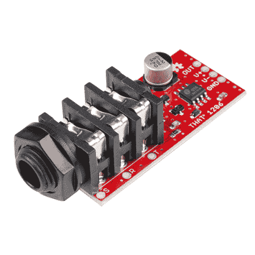
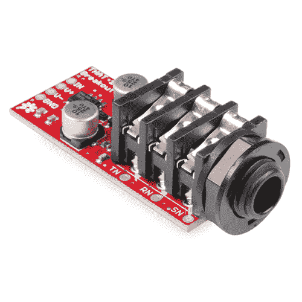

# InGenius 和 OutSmarts 突破连接指南

> 原文：<https://learn.sparkfun.com/tutorials/that-ingenius-and-outsmarts-breakout-hookup-guide>

## 介绍

1206 和 1646 分线板为您的电路添加平衡音频输入和输出提供了一个简单的解决方案。

 

将**添加到您的[购物车](https://www.sparkfun.com/cart)中！**

### [火花那 1206 InGenius 突围](https://www.sparkfun.com/products/14002)

[Only 6 left!](https://learn.sparkfun.com/static/bubbles/ "only 6 left!") BOB-14002

spark fun 1206 ingen ius 分线板为您的电路添加平衡音频输入提供了一个简单的解决方案。的…

$11.503[Favorited Favorite](# "Add to favorites") 23[Wish List](# "Add to wish list")**** 

将**添加到您的[购物车](https://www.sparkfun.com/cart)中！**

### [火花那 1646 智取突围](https://www.sparkfun.com/products/14003)

[30 available](https://learn.sparkfun.com/static/bubbles/ "30 available") BOB-14003

1646 OutSmarts 分线板为您的电路添加平衡音频输出提供了一个简单的解决方案。那个 O…

$11.955[Favorited Favorite](# "Add to favorites") 19[Wish List](# "Add to wish list")**** ****InGenius 和 OutSmarts 技术专为高级模拟音频传输和接收而设计。它们在真实音频应用中具有低失真和高共模抑制性能。

分线板将 IC、支持组件和 1/4 英寸 TRS 插座结合在一起。它们使得在试验板上和项目中使用输入和输出驱动器变得容易。

### 所需材料

要学习本项目教程，您需要以下材料:****