# 970 公顷笑话付费电话项目

> 原文：<https://learn.sparkfun.com/tutorials/the-970-ha-jokes-payphone-project>

## 介绍

你想念纽扣吗？硬币？可疑的公共共享表面？

<https://cdn.sparkfun.com/assets/learn_tutorials/2/6/4/9/Hold.mp3>

Your browser does not support the `audio` element.

在无限循环上听一听这种经典的音乐，回到付费电话统治街角和遍布购物中心美食广场的时代。

这一切都是因为他们移动了我家附近的停车计时器。当我们的城市(博尔德)有了新的付费站，他们留下了带有金属安装点的混凝土垫。

[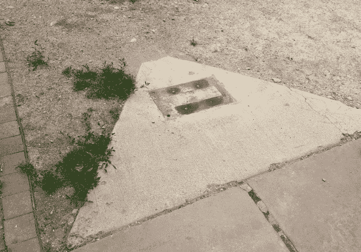](https://cdn.sparkfun.com/assets/learn_tutorials/2/6/4/9/SparkFun_PayPhone_0_-_Empty_Pad.jpg)*Abandoned parking meter pad*

我对妻子说，“如果有人在那里放一部付费电话，那不是很有趣吗？”。她同意了，我就下了兔子洞...这已经不是她第一次带我去[好玩的项目](https://learn.sparkfun.com/tutorials/building-a-safe-cracking-robot/all)了。

从小我就想拆开付费电话。我第一次用电影院外的付费电话打电话让父母搭车回家时，我注意到了螺丝和锁。我对螺丝有基本的了解，这些显然是六角螺栓，但是中间的钉子是什么？一晃 30 年过去了，显然一切都变了。你可以在当地的五金店买到安全螺丝，付费电话已经成为过去，但复古的好奇心仍然存在。如果我要偷偷摸摸地在街上放一个付费电话，我们最好在惹上麻烦之前让一些人咯咯地笑。

970 公顷笑话付费电话项目是一个基于 Arduino 的全功能付费电话，利用无线网络电话，内置一堆复活节彩蛋。让我们开始吃吧。

## 你在哪里有付费电话？

[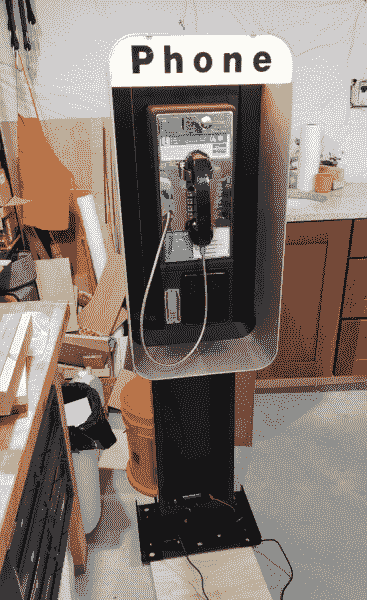](https://cdn.sparkfun.com/assets/learn_tutorials/2/6/4/9/SparkFun_PayPhone_2_-_Assembled_Base_and_Phone.jpg)

虽然在跳蚤市场的易趣上有各种各样的付费电话，但要找到一个合法购买的付费电话是非常棘手的。而且，几乎不可能找到带锁的。为了节省时间，但代价很大，我最终花了 1000 多美元从 payphone.com[买了一台带 L31 外壳和落地式底座的 PP100。我不需要一个真正实用的付费电话，因为我要改装它，但是能够订购钥匙和锁以及电话、护罩和基座节省了我大量的时间和挫折。](https://www.payphone.com/)

学习手机如何工作是另一个挑战。有令人难以置信的论坛和成堆的可用资源([复古街机保护协会](https://forums.arcade-museum.com/)、[经典旋转手机论坛](http://www.classicrotaryphones.com/forum/index.php?board=30.0)等等)，但正如大多数爱好和过去的职业一样，首字母缩略词令人费解，“我该从哪里开始？”教程不存在。总之，主控制板检测有效硬币何时通过硬币检测器，并将音调传输回电话交换机。电力通过电话线本身提供(有时也由当地电力提供)。当检测到正确的金额时，呼叫被连接到电话网络。

## 付费电话项目是如何运作的？

真的很简单(笑话！).付费电话项目是这样运作的:拿一部电话，让它支持 VOIP。并且要求在允许呼叫之前投入硬币。哦，一定要确保 911 是可用的，而且不用硬币就可以拨打。此外，电话有点远，所以网络电话必须基于 WiFi。而且没有电力供应，所以它只能靠电池运行。如果有人打电话给 867-5309，手机会播放一个愚蠢的 MP3，这不是很有趣吗？

[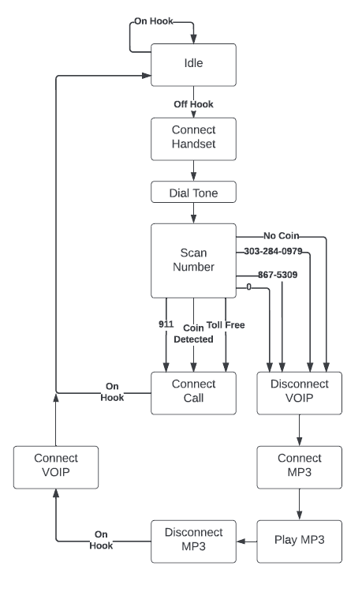](https://cdn.sparkfun.com/assets/learn_tutorials/2/6/4/9/SparkFun_PayPhone_3_-_State_Diagram.jpg)*The Payphone Project state diagram*

事情变得有点复杂，但是嘿，在 COVID 期间你做了什么？

## 原始付费电话

如果邮票可信的话，最初的付费电话外壳是 1987 年的。付费电话背后的机械工程是 80 年猫鼠大战的高潮。电话公司想要赚钱，成千上万的人想方设法不付钱([鼻涕虫](https://en.wikipedia.org/wiki/Slug_(coin))，[船长嘎吱哨声](https://www.youtube.com/watch?v=HDh_XRTpXxI)等等)。

[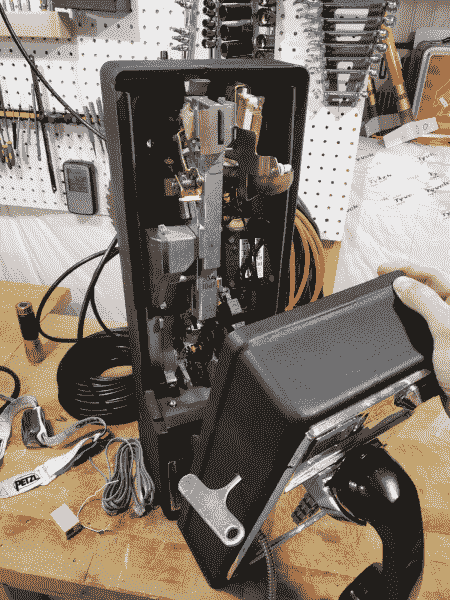](https://cdn.sparkfun.com/assets/learn_tutorials/2/6/4/9/SparkFun_PayPhone_12_-_VOIP_Test_2.jpg)

整个外壳是厚钢，顶部有一个令人难以置信的锁定机制，底部有一个单独的甚至更密集的区域，称为“金库”，收集金钱。仅手机(没有底座或护罩)就重 45 磅。

[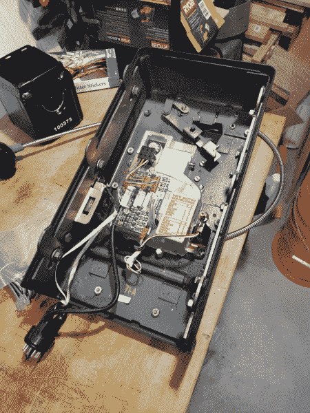](https://cdn.sparkfun.com/assets/learn_tutorials/2/6/4/9/SparkFun_PayPhone_6_-_Front_Face.jpg)*Payphone enclosure front face*

这是正面的背面，包括挂钩、键盘和听筒接线。有什么比挂钩开关更好的？四个挂钩开关。我敢肯定有一些非常卑鄙的设计正在进行。至少我能理解来自听筒的四根线:

*   麦克风+
*   麦克风-
*   扬声器+
*   扬声器-

整个正面通过大而粗的黑色环形连接器连接到手机底座内的主板。即使这样也有一些创新:白色丝带是一条比连接连接器和正面的黑色数据线更短的系绳。当技术人员提起*重量不轻的*正面时，如果他们直接拔出，系绳会收紧并从主板上拔出插头，而无需用两只手握住正面。非常方便。

[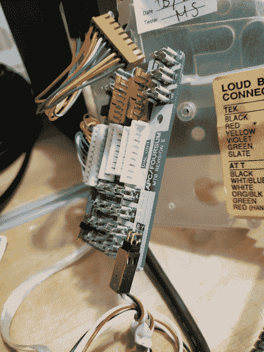](https://cdn.sparkfun.com/assets/learn_tutorials/2/6/4/9/SparkFun_PayPhone_8_-_Hook_Switch_Audio_Connection.jpg)

这是从正面拍摄的钩板特写。它看起来像一个售后零件，允许无数不同的挂钩和键盘类型。我猜这是一种通用接口板。

[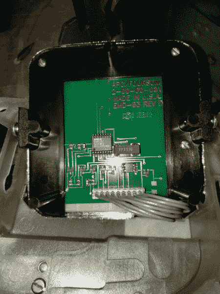](https://cdn.sparkfun.com/assets/learn_tutorials/2/6/4/9/SparkFun_PayPhone_5_-_DTMF_Generator.jpg)

隐藏在挂钩接口板下面的是键盘。我假设这些按键，就像任何矩阵键盘一样，连接到手机的主板上，在主板上它将处理被按下的按键的解码。我计划这样做，因为我需要 Arduino 知道按下了什么按钮。但我惊讶地发现键盘内置了自己的 DTMF 编码器！键盘自己产生音调，然后通过麦克风连接传回主板。鬼鬼祟祟。

左边是 AMI 9446LGT S2559FS DTMF 编码器 IC。右边是驱动 IC 的晶体。这是 AMI S2559E/F IC 的数据手册。

[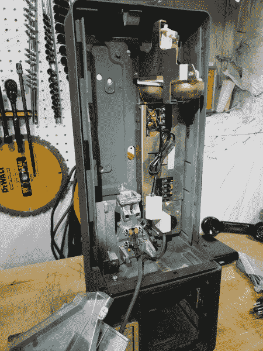](https://cdn.sparkfun.com/assets/learn_tutorials/2/6/4/9/SparkFun_PayPhone_9_-_Main_Board.jpg)

这是主手机外壳内的主板，顶部有振铃器。我购买这部手机的公司已经安装了 RJ11 电缆和耦合器，使它更容易在家里使用。

[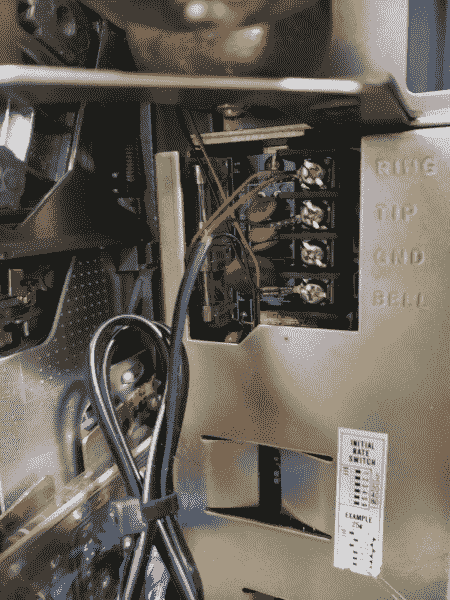](https://cdn.sparkfun.com/assets/learn_tutorials/2/6/4/9/SparkFun_PayPhone_10_-_Phone_Line_Connection_2.jpg)

这是电线的特写。这种配置基本上绕过了主板，直接通过给手机*布线，所以打电话不需要硬币。*

[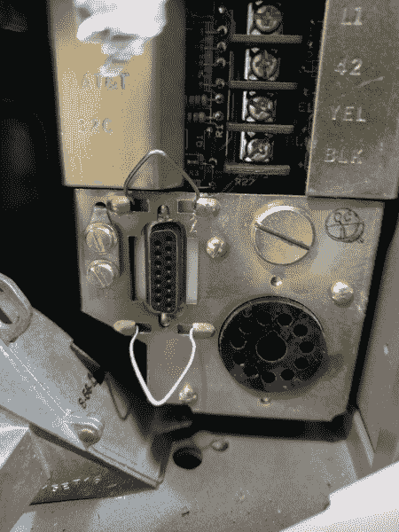](https://cdn.sparkfun.com/assets/learn_tutorials/2/6/4/9/SparkFun_PayPhone_7_-_Front_Face_Connector.jpg)*A closeup of the mainboard’s connectors*

最上面是电话公司电话线的四个连接点。

左边是连接到硬币接收器的 15 针连接器。

右边是正面的 11 针圆形连接器。

[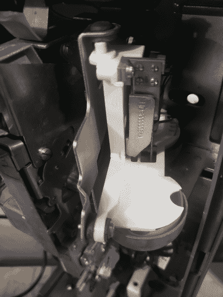](https://cdn.sparkfun.com/assets/learn_tutorials/2/6/4/9/SparkFun_PayPhone_11_-_Ringer.jpg)

铃声没有什么有趣的，除了它的金属铿锵声仍然给我成长过程中的那种纯粹的期待:会是谁呢？我能比我的兄弟姐妹先拨通我们家的一部电话吗？

[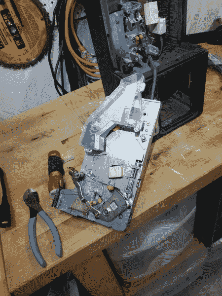](https://cdn.sparkfun.com/assets/learn_tutorials/2/6/4/9/SparkFun_PayPhone_4_-_Coint_Detector_0.jpg)

这是硬币鉴定器/检测器。稍后会详细介绍。

铝制护罩和底座也已交付:

[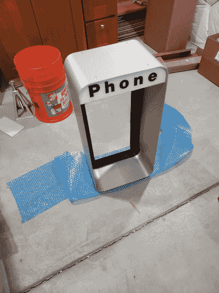](https://cdn.sparkfun.com/assets/learn_tutorials/2/6/4/9/SparkFun_PayPhone_13_-_Enclosure_2.jpg)

打开这个就像圣诞节一样。

[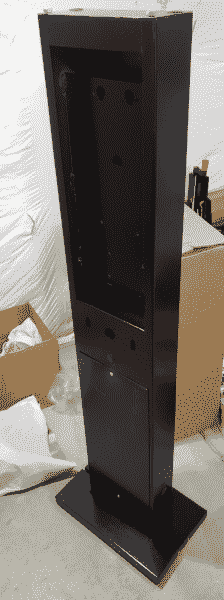](https://cdn.sparkfun.com/assets/learn_tutorials/2/6/4/9/SparkFun_PayPhone_15_-__Enclosure_1.jpg)

基座又重 45 磅。它包装得很好，保护得很好，配有一袋螺栓和安全螺丝。

[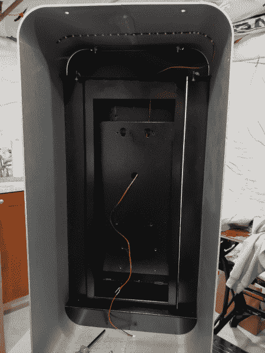](https://cdn.sparkfun.com/assets/learn_tutorials/2/6/4/9/SparkFun_PayPhone_14_-__Enclosure_3.jpg)

手机外壳和底座的伟大之处在于，它的设计允许大量大型电缆进出手机，通常来自地面。这给了我很多连接电源和数据的方法。

这是至关重要的，因为手机注册需要一点东西...

[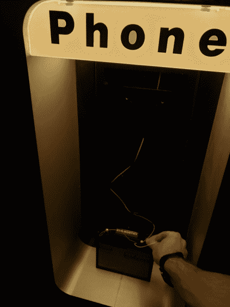](https://cdn.sparkfun.com/assets/learn_tutorials/2/6/4/9/SparkFun_PayPhone_16_-__Enclosure_4.jpg)

啊，这样好多了。一小段 12V 暖白色发光二极管使它发出明亮的光。你还可以看到一个用来给整个手机供电的磷酸铁锂电池。

随着手机部件大部分被拆开检查，是时候找出电子设备了。

## （同 VoiceoverInternetProtocol）网络电话

至此，VOIP 技术已经无处不在。将模拟电话接入以太网既便宜又容易。

[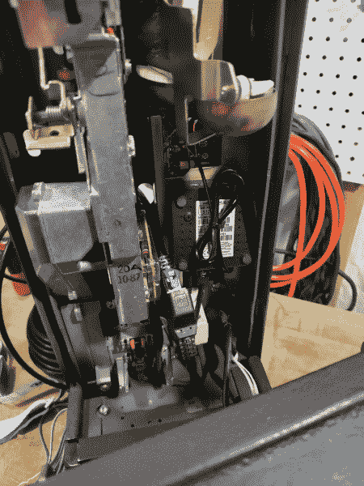](https://cdn.sparkfun.com/assets/learn_tutorials/2/6/4/9/SparkFun_PayPhone_17_-_VOIP_Test_3.jpg)

虽然手机外壳内部有点紧，但把一部奥比海奥比 200 放进去并不太难。稍后，Obi200 将向上移动到振铃器的右侧。

[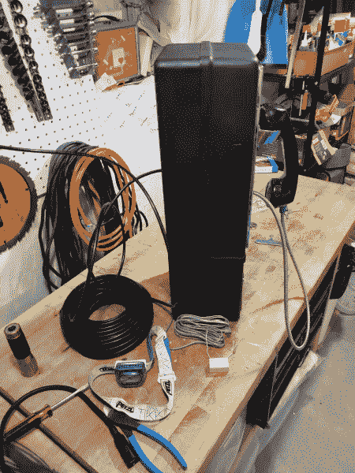](https://cdn.sparkfun.com/assets/learn_tutorials/2/6/4/9/SparkFun_PayPhone_19_-_VOIP_Test_4.jpg)*Payphone with ethernet connected*

打电话给我妻子，问她“猜猜我从哪里打来的?”？！？！?'从来没有发生过，因为她不认识谷歌语音电话号码，忽略了它。我不得不用手机给她发短信，只是为了…你知道吗，算了。我用付费电话给她打电话，感觉棒极了。

## 无线局域网（wireless fidelity 的缩写）

VOIP 可以工作，但是电话会因为太远而无法使用以太网电缆。我们说服住在停车场附近的朋友允许我们使用他们的 WiFi“几天”。幸运的是，有一些现成的设备是一个简单的 WiFi 到以太网的桥梁。VONETS VAP11G-300 符合要求。插上电源就能用了，对吧？不幸的是，外壳的金属罐严重降低了 PCB 的天线接收能力。如果手机在 WiFi 接入点 10 英尺以内，我们可以接收到信号，但我们需要更远的距离。我们换天线吧！

当然，我可以在付费电话的外壳后面挂几个橡胶天线，但那会完全破坏体验。如果你看到付费电话的天线从后面伸出来，你就知道有事发生了。我们可以在哪里隐藏一对天线，这样它们仍然可以接收信号？嗯（表示踌躇等）...

[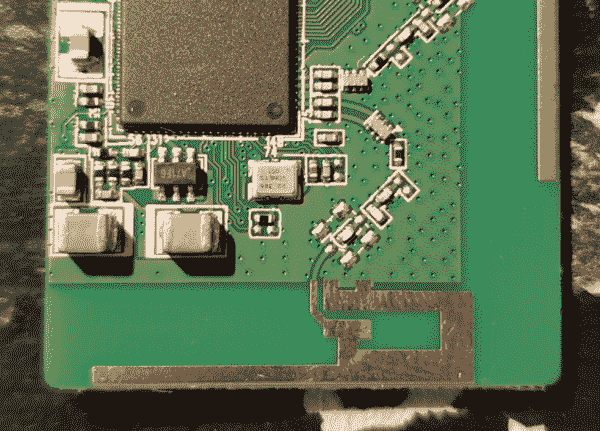](https://cdn.sparkfun.com/assets/learn_tutorials/2/6/4/9/SparkFun_PayPhone_34_-_VOIP_2.jpg)

上面是连接 IC 和 PCB 天线的 RF 路径。

[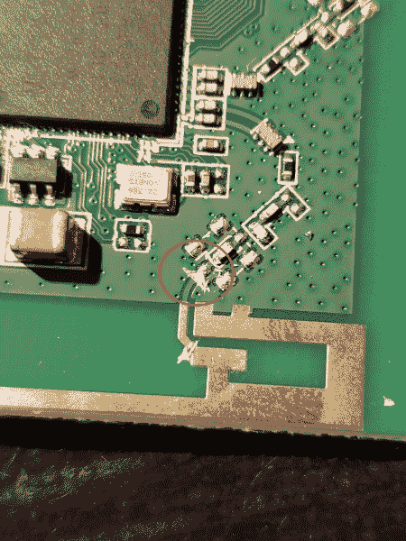](https://cdn.sparkfun.com/assets/learn_tutorials/2/6/4/9/SparkFun_PayPhone_35_-_VOIP_3.jpg)

我做了一个切口，把匹配网络和 PCB 天线隔离开来。(不需要第二个下部切口)

我从一对 [2.4GHz 薄天线](https://www.sparkfun.com/products/18086)上切下 U.FL 连接器，小心地剥去并露出信号引脚和接地护套。

[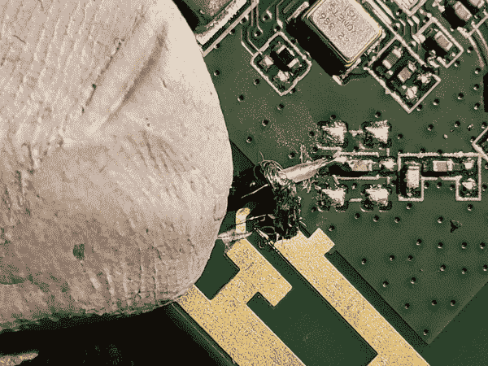](https://cdn.sparkfun.com/assets/learn_tutorials/2/6/4/9/SparkFun_PayPhone_36_-_VOIP_4.jpg)

粘性大头钉是我最喜欢的工具，也是很好的第三手牌。

一点焊料，我们就连接起来了。为了给你一个微小的感觉，这是我的指纹。这些都是很小的 0402 组件。

你可以看到这个电容的位置，有一个空的 U.FL 连接器。我可以用热空气将一个 U.FL 连接器回流到电路板上，但要让四层 PCB 热到足以重新加工一个新连接器，可能同样困难，甚至更困难。剥离和焊接更容易。

[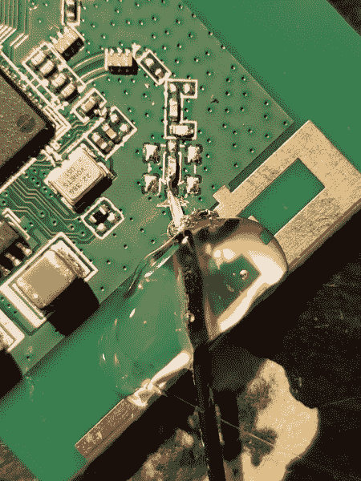](https://cdn.sparkfun.com/assets/learn_tutorials/2/6/4/9/SparkFun_PayPhone_39_-_VOIP_7.jpg)

一滴用于机械加固的热胶，我们就少了一个，还有一个！

[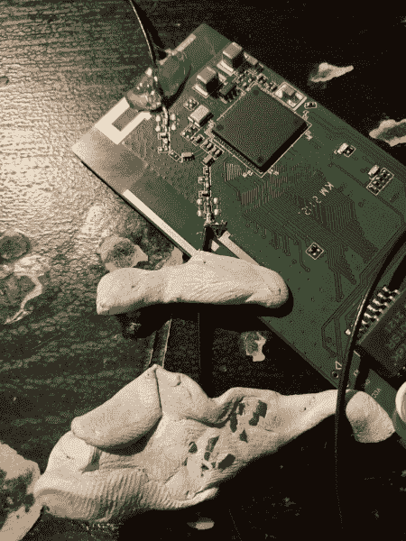](https://cdn.sparkfun.com/assets/learn_tutorials/2/6/4/9/SparkFun_PayPhone_40_-_VOIP_8.jpg)

粘性粘性。粘性粘性。第二 RF 路径。

[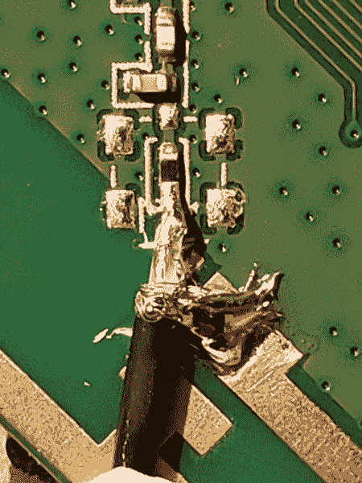](https://cdn.sparkfun.com/assets/learn_tutorials/2/6/4/9/SparkFun_PayPhone_40_-_VOIP_9.jpg)

我们被焊接了！注意从地鞘出来的细毛。在打开电路板之前，我做了一个射频连接和 GND 之间的连续性测试，以确认没有短路。

[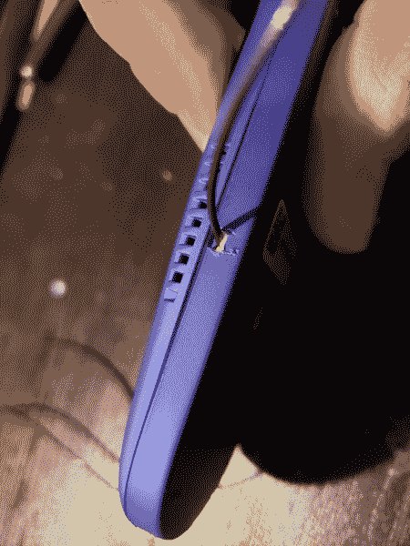](https://cdn.sparkfun.com/assets/learn_tutorials/2/6/4/9/SparkFun_PayPhone_41_-_VOIP_10.jpg)

快速和肮脏的外壳改造允许细 RF 电缆从外壳的相应侧出来。

[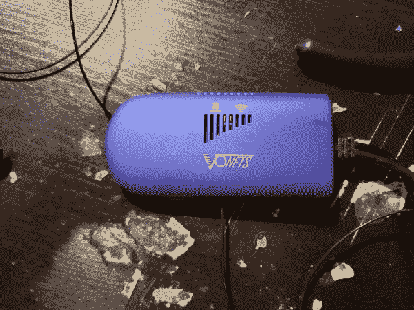](https://cdn.sparkfun.com/assets/learn_tutorials/2/6/4/9/SparkFun_PayPhone_42_-_VOIP_11.jpg)

这是一个带有配件市场外部天线的以太网 WiFi 网桥！

[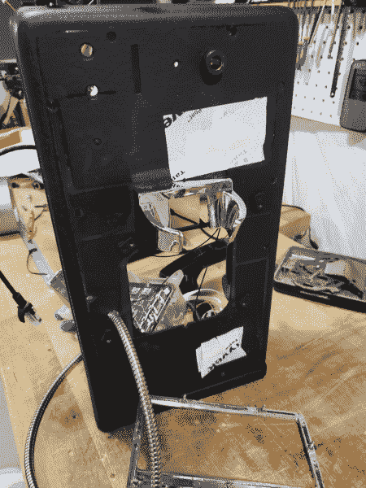](https://cdn.sparkfun.com/assets/learn_tutorials/2/6/4/9/SparkFun_PayPhone_45_-_VOIP_14.jpg)

上图中，我在信息图区域找到了两根天线，并用胶带固定。这些是描述如何使用手机的纸张和塑料所覆盖的区域。信息图将覆盖天线，同时仍然允许良好的射频接收。

[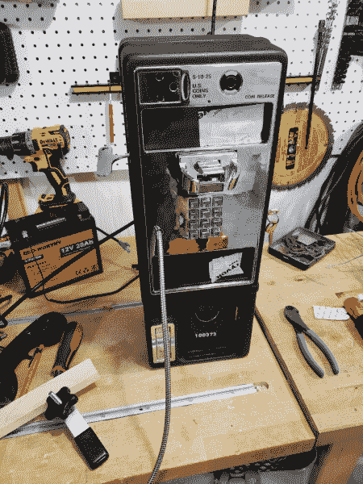](https://cdn.sparkfun.com/assets/learn_tutorials/2/6/4/9/SparkFun_PayPhone_44_-_VOIP_13.jpg)

正面显示天线的位置。

[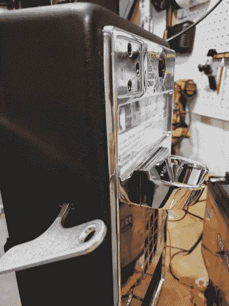](https://cdn.sparkfun.com/assets/learn_tutorials/2/6/4/9/SparkFun_PayPhone_43_-_VOIP_12.jpg)*Look Ma! No antennas!*

在上面你可以看到天线伸出如此之少，即使是一个非常机敏的用户也很难发现它们。

由于天线位于外壳外部，我们尝试了一下。一些现场测试证明，我们可以在朋友的 WiFi AP 上获得 WiFi 和 VOIP 接入。

## 硬币检测

[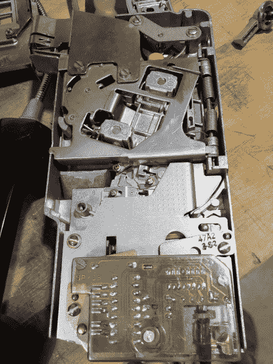](https://cdn.sparkfun.com/assets/learn_tutorials/2/6/4/9/SparkFun_PayPhone_21_-_Coin_Detector_2.jpg)

很难描述投币电话硬币识别器令人难以置信的设计。想象一下挑战:在不使用电力的情况下，正确地检测硬币是有效的还是假的，然后将硬币分类到三个滑槽中。如果用户扔出一便士、一美元硬币或刮掉的止咳糖，优雅地处理它，并在无需维护的情况下继续工作多年。我敢肯定，这些微小的平衡陷阱门、磁铁和斜槽花了几十年才出现，但看着它工作真的很棒，很满足。

应该有一学期的机械工程课程，除了分析付费电话硬币识别器的工作原理之外，什么也不做。

[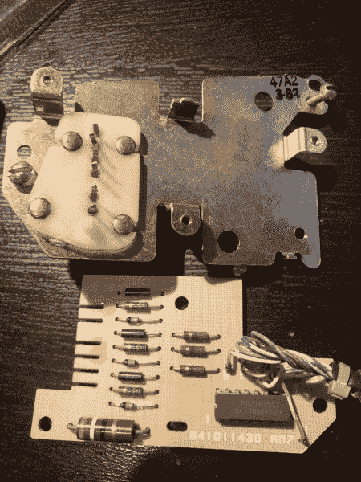](https://cdn.sparkfun.com/assets/learn_tutorials/2/6/4/9/SparkFun_PayPhone_22_-_Coin_Detector_3.jpg)*Payphone coin validator electronic control board*

正如蒂姆·亨金( [*《机器的秘密生活》*](https://en.wikipedia.org/wiki/The_Secret_Life_of_Machines) )曾经对他的镍拱廊说的那样:

> “如果一个用户走到一台免费游戏的街机前，他们只是开始捣鼓按钮，然后无聊地走开。如果用户被要求投入哪怕是很少的钱，他们也会停下来阅读说明，并获得更好的体验，即使这让他们花费更多。”

(来源:这是我记忆中蒂姆在 2007 年第二届创客大会上的发言)

如果你需要停止阅读，去看'[电梯](https://www.youtube.com/watch?v=iSLmzjE_woQ&ab_channel=CarlLewis)那一集，我不会责怪你。这只是一场*真正*的好戏。

我不在乎用户付多少钱，我只想让他们享受体验。以不同的滑稽方式说:任何人都可以免费打电话到世界任何地方，我想我应该收他们五分钱！

我妻子和我最初计划投币电话接受任何国家的任何面值的硬币。但由于我有限的机械工程，我们决定这是一个更好的权衡利用现有的硬币验证器。

硬币识别器将弹出除五分、一角或二角五分以外的任何东西。经过验证的硬币然后通过一个小电路板(如上所示)，这实际上是一个小型金属探测器。集成电路零件号为摩托罗拉 KS21625L7 14050122B。

[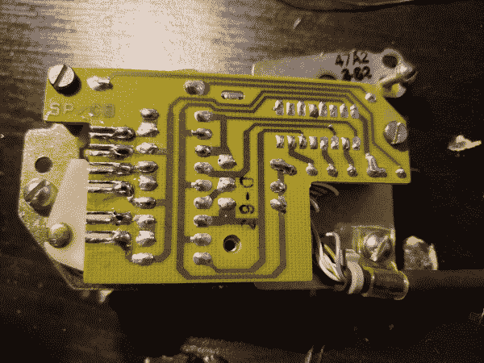](https://cdn.sparkfun.com/assets/learn_tutorials/2/6/4/9/SparkFun_PayPhone_23_-_Coin_Detector_4.jpg)

硬币接收器 PCB 的背面允许我们快速找出电源和接地，以及各个硬币信号的来源。

[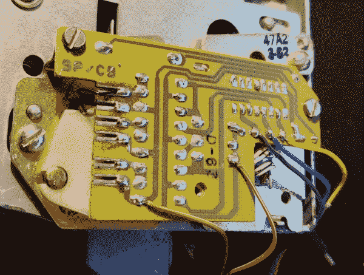](https://cdn.sparkfun.com/assets/learn_tutorials/2/6/4/9/SparkFun_PayPhone_24_-_Coin_Detector_5.jpg)

在上面的照片中，我们成功地劫持了硬币识别器:

*   棕色:来自 Arduino 的土地
*   红色:来自 Arduino 的 5V 电压
*   紫色:Arduino 上的 10 角钉
*   蓝色:Arduino 上的镍针 9
*   黄色:Arduino 上的四分之一引脚 8

通过一点工作，以及 Nico Hood 的 PinChangeInterrupt 库，我成功地触发了硬币通过时的下降沿中断。

## 数字检测

如上所述，键盘有一个内置的 DTMF 编码器 IC，所以我需要一种方法来解码 DTMF 音调，以检测正在拨打的号码。有很多方法可以做到这一点，包括一个专用的 DTMF 解码器，但是为什么不使用 Arduino 本身呢？

[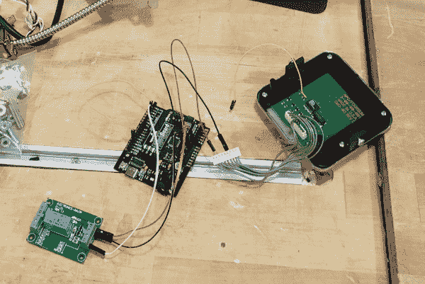](https://cdn.sparkfun.com/assets/learn_tutorials/2/6/4/9/SparkFun_PayPhone_26_-_Keypad_Testing.jpg)

从 [AMI S2559E/F IC](https://cdn.sparkfun.com/assets/learn_tutorials/2/6/4/9/AMI_S2559FS_Tone_Generator.pdf) 数据表中，我们知道电源、接地和音频输出引脚的位置。用 5V 电压给 IC 供电并将音频信号发送到 Arduino 引脚非常简单。在线 1uF 电容用于阻挡任何 DC 电流。但是如何将频率转换成数字呢？输入[戈泽尔](https://en.wikipedia.org/wiki/Goertzel_algorithm)。我会让雅各布·布森塔尔, [Goertzel Arduino 图书馆](https://github.com/jacobrosenthal/Goertzel)的创建者解释:

> Goertzel 算法由来已久，所以参见 http://en.wikipedia.org/wiki/Goertzel_algorithm 的完整描述。它通常用于 DTMF 音调检测，作为快速傅立叶变换的替代方案，因为它只搜索单个频率，而不是显示所有频率的出现，所以速度快，开销低。

我们知道键盘只会产生以下 8 种频率:

*   Six hundred and ninety-seven
*   Seven hundred and seventy
*   Eight hundred and fifty-two
*   Nine hundred and forty-one
*   One thousand two hundred and nine
*   One thousand three hundred and thirty-six
*   One thousand four hundred and seventy-seven
*   One thousand six hundred and thirty-three

[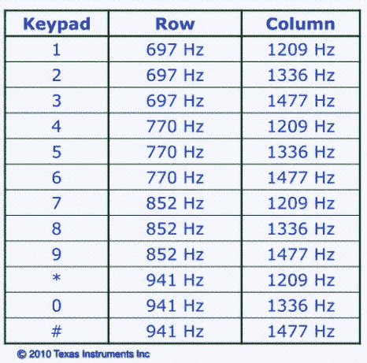](https://cdn.sparkfun.com/assets/learn_tutorials/2/6/4/9/SparkFun_PayPhone_27_-_DTMF_Frequency_Table.jpg)

图片来源:德州仪器——“使用 TMS 320 c 5505u 盘的实用音频实验”

我们可以设置两个循环，称为“行”和“列”。例如，如果我们检测到 852 和 1477Hz，我们知道用户正在按“9”按钮。还有一些额外的设置，包括要采集的样本数量和我们必须跨越的阈值，以指示频率的存在。出于付费电话项目的目的，这两个设置(N 和阈值)存储在 EEPROM 中，我使用非常复杂的方法“尝试，直到它工作”来建立最佳值。

Goertzel 和设置就绪后，内部 Arduino 现在知道按的是什么数字。在那里，我使用一个状态机来确定用户是否拨打了一系列允许的号码(即 9 - 1 - 1)或一系列不允许的号码(即 6 - 0 -...将迫使用户进入“请投入硬币”路径)。

不需要硬币支付应该允许什么数字？

### 免费电话号码

在美国，大多数 1999 年以前出生的人都知道“1-800”是什么。对于那些不知道的人:以 1-800 开头的号码是“免费”号码；向拥有该号码的企业收取电话费的电话号码。例如，1-800-736-0308 是购买 [ShamWow](https://www.shamwow.com/) 的电话号码。这不是“长途”(费用计入你的电话账单)，这是免费的。这个概念已经像电视指南和旋转木马一样消失了。有了手机，就没有了长途电话，所以免费电话的必要性已经大大降低了。然而，免费电话在 20 世纪 80 年代和 90 年代非常流行。因此，电话公司不得不添加 1-888 作为额外的免费区号。

突击测验:822 是免费区号吗？844 怎么样？

我没有意识到这一点，直到这个项目，但有很多免费区号。800、833、844、855、866、877 和 888 是免费电话。所以付费电话项目不需要硬币就能传递这些号码。

### Nine hundred and eleven

我的妻子和我同意，玩笑归玩笑，如果我们要在街上放一部电话，它必须有 911 功能。值得庆幸的是，有像[呼叫中心](https://www.callcentric.com/)这样的服务，每月 1.95 美元，将把一个号码从谷歌语音连接到一个物理位置，并实现 911 转发。如果有人从付费电话项目拨打 911，它会立即被路由到最近的呼叫中心，并提供电话的地址信息。

### 867-5309

<https://cdn.sparkfun.com/assets/learn_tutorials/2/6/4/9/Jenny.mp3>

Your browser does not support the `audio` element.

虽然汤米·图通的受欢迎程度在我出生前达到顶峰，但我仍然将这个数字铭刻在我的脑海中(耶，流行文化)。

[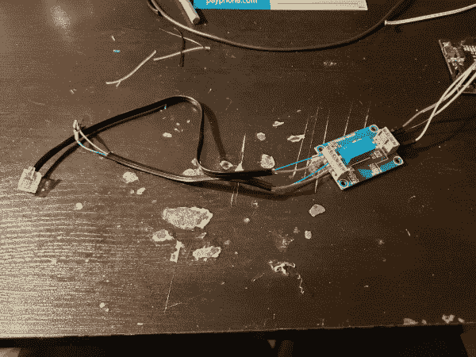](https://cdn.sparkfun.com/assets/learn_tutorials/2/6/4/9/SparkFun_PayPhone_28_-_Audio_Man-In-The-Middle.jpg)

这个接力是单拉双掷(SPDT)接力。这允许我们中断电话线路，有效地“挂断”电话，即使用户仍然拿着电话。

如果用户键入 867-5309，我们将电话从 VOIP 断开(关闭上面提到的呼叫控制继电器)，然后将手机连接到我们的 MP3 播放器，并开始播放我们想要的复活节彩蛋。

### Zero

用户需要话务员的时候怎么办？我考虑过将用户转到 1-855-LADYFUN(这是一个整体，[令人惊讶的深度虚拟现实游戏](https://www.vulture.com/2016/05/get-lost-in-1-855-ladyfun-a-massive-and-bizarre-customer-service-line-parody.html)，你绝对必须检查)，但这有点太元了。相反，我认为让可怜的用户接触到无限循环的[强音音乐](https://www.youtube.com/watch?v=jLXZKQ9LJn8&ab_channel=StrongBad-Topic)会更有趣。这是复活节彩蛋:

<https://cdn.sparkfun.com/assets/learn_tutorials/2/6/4/9/Hold.mp3>

Your browser does not support the `audio` element.

### 303-284-0979

这是 SparkFun 在‘真实世界’的主要数字。因此，无论你是否投入硬币，你当然都会得到瑞克。这是我们的短片:

<https://cdn.sparkfun.com/assets/learn_tutorials/2/6/4/9/Rick.mp3>

Your browser does not support the `audio` element.

### 请投硬币

如果用户输入一个需要硬币的数字，他们就会断开网络电话，我们就会玩最后一个“复活节彩蛋”。这是典型的“本次通话需要投入硬币”的接线员提示，结合了芦荟 Blacc 的[我需要一美元](https://www.youtube.com/watch?v=nFZP8zQ5kzk)。您可以听到下面的组合片段:

<https://cdn.sparkfun.com/assets/learn_tutorials/2/6/4/9/Dollar.mp3>

Your browser does not support the `audio` element.

## MP3 注入

为了玩各种各样的复活节彩蛋，我们需要能够[轻松地玩 MP3](https://www.sparkfun.com/products/19030)，但更重要的是我们需要劫持手机。因此增加了第二次 SPDT 接力。这个继电器位于手机听筒和挂机开关板之间。我们可以像连接普通电话一样将耳机连接到手机主板，或者我们可以切换继电器，将 MP3 输出连接到手机耳机。这让我们可以通过中间人来控制用户听到的内容。

## 台架测试

[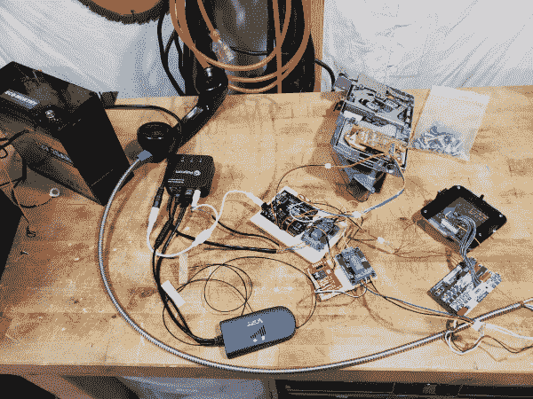](https://cdn.sparkfun.com/assets/learn_tutorials/2/6/4/9/SparkFun_PayPhone_30_-_Bench_Test.jpg)

它活着！

最后，我们通过软件处理 8 个 pin:

*   DTMF 解码的模拟引脚
*   用于挂钩检测的 GPIO
*   用于 VOIP 呼叫控制的 GPIO
*   用于手机耳机控制的 GPIO
*   用于硬币检测的 GPIO x 3
*   Qwiic 连接到 MP3 播放器

[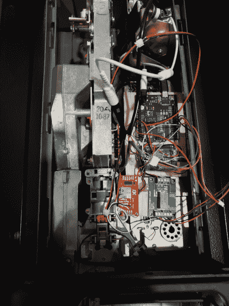](https://cdn.sparkfun.com/assets/learn_tutorials/2/6/4/9/SparkFun_PayPhone_31_-_Assembly_1.jpg)

这是放在主壳体内的所有东西。一些粘有磁铁的木背板可以很容易地安装或拆卸。

[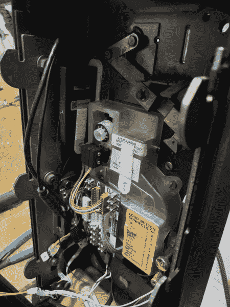](https://cdn.sparkfun.com/assets/learn_tutorials/2/6/4/9/SparkFun_PayPhone_32_-__Assembly_2.jpg)

上面是正面里面。你可以看到大型金属“硬币返回”电枢以及蓝色的 WiFi 以太网桥。下面你可以看到一些用热胶水粘起来的连接器。

[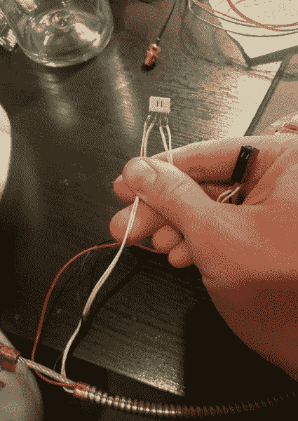](https://cdn.sparkfun.com/assets/learn_tutorials/2/6/4/9/SparkFun_PayPhone_47_-_Inline_Connector.jpg)

正面外壳和主外壳之间有一些连接。通常这些都包含在单个 11 针圆形连接器中，但我们需要 8 个额外的引脚:4 个用于耳机中间人，3 个用于 DTMF 解码，1 个用于检测电话何时挂机。为了允许正面被完全移除，我焊接了匹配的 [JST 电缆组](https://www.sparkfun.com/products/9916)，并用热胶加固并电隔离了连接。在上面的照片中，你可以看到听筒线的中断。

## 力量

左边看到的是一个[磷酸铁锂电池](https://en.wikipedia.org/wiki/Lithium_iron_phosphate_battery)。这种新的电池化学物质比锂离子电池的能量密度低一点，但 LiFePO4s 不能实现热失控。换句话说，如果出了问题，这些电池不会坏掉。我以前做过几次吸脂手术，考虑到外面恶劣的公共环境，LiFePO4s 是一个很好的选择。这些新型 12.8 伏电池的价格正在迅速下降。我买了几节 20 安培的电池，每节 70 美元。

LiFePO4 12V 电池将*完美地*安装在手机基座底座内。

付费电话项目的平均待机电流约为 250 毫安，包括 VOIP 奥比海设备、WiFi 网桥、头顶发光二极管、继电器等。使用 20Ah，我们的运行时间约为 80 小时。我设置了一个日历提醒，每 3 天更换一次电池，从来没有停电过。在未来，我们可以并行运行两个电池(一个堆叠在另一个上，在底座内)，使用两个 30Ah 的电池可能可以运行 10 天。

## 密码

你可以从我们的 github 上获得固件[，也可以从回购](https://github.com/sparkfun/SparkFun-Payphone-Art-Project/tree/main/Payphone_Coin_Collector)上获得各种测试草图[。](https://github.com/sparkfun/SparkFun-Payphone-Art-Project)

付费电话的固件相当简单。我们期待用户拿起电话听筒，然后开始跟踪所拨的号码或者是否有硬币被投入。如果投了硬币，允许电话接通。如果允许该号码不带硬币(如 911、303-284-0979 等)，则允许电话接通。如果没有硬币，并且电话号码不是“免费”类型，则挂断 VOIP 并将用户连接到“请投入硬币”MP3。

## 信息图表

虽然电子产品很重要，但这个占地 970 公顷的付费电话项目需要看起来很棒，以获得最大的笑声。

好吧，也许我们有点忘乎所以，但它是 COVID。

对于任何在科罗拉多州生活过一段时间的人来说，当谈到电话提供商时，Qwest 是一个家喻户晓的名字。确保让任何人都知道这不是你的普通付费电话。

当我的邻居问我对电话公司在我们家附近安装付费电话有何看法时，我知道我们做得很好。我不得不向她解释这是我做的一个笑话项目，当她看到 Qwast 的标志时，她的笑声让一切都变得值得了。

是的，你真的可以用五分钱打国际电话。是的，那是特拉维夫的现代艺术博物馆。我们特别挑选了有电话树的号码；笑话很有趣，但我不想打扰真正的人。

乔:那是白宫的电话号码。好吧，也许是人类回答了这个问题，但是我付了税，所以至少他们为这些麻烦付了钱。

970-HA-笑话或 970-425-6537 是付费电话的号码。多亏了像谷歌语音这样的东西和像 PhoneSpell 这样的工具，我们可以快速地查看可用的号码。当我看到“哈笑话”是一个可用的电话号码，我知道我们有一个赢家。

## 传单

[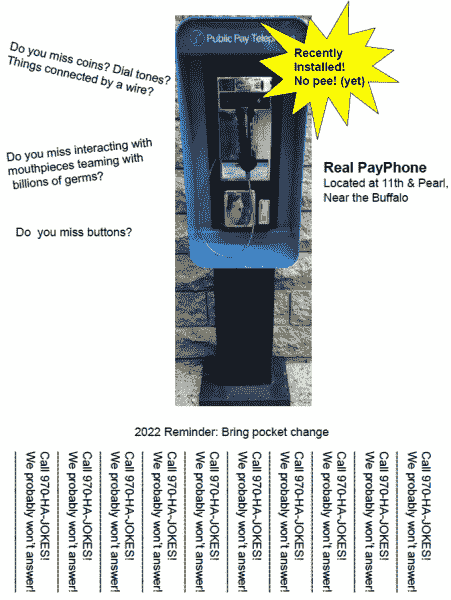](https://cdn.sparkfun.com/assets/learn_tutorials/2/6/4/9/SparkFun_PayPhone_49_-_Flyer.jpg)

不尿尿！(尚未)

交互式项目很棘手。大多数人都是多疑的，除非有明确的说明，否则一般都不想乱来。所以，我们当然要制作传单，发给朋友，并在我们的社区张贴。

## 统计数字

[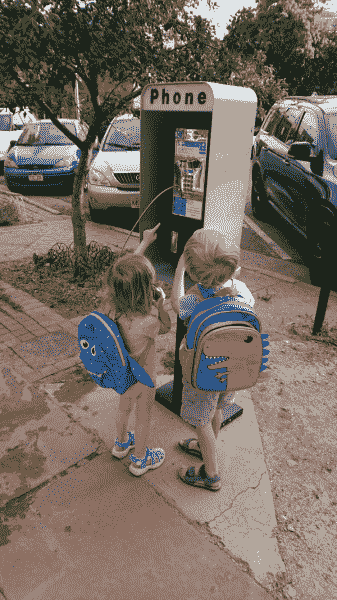](https://cdn.sparkfun.com/assets/learn_tutorials/2/6/4/9/SparkFun_PayPhone_53_-_User_Testing.jpg)*User testing is critical*

我的妻子和我一开始就同意，我们不想记录电话号码或摄像头记录人们使用电话。但我跟踪并记录了各种互动。这款手机部署了大约 10 天。我有点惊讶有多少人真的有硬币！

*   互动:406
*   免费通话:2 次
*   付费电话:47
*   我需要一美元:49
*   SparkFun 呼叫:5
*   珍妮打电话来说:5
*   911 呼叫:1
*   获得的硬币:47
*   举起一段楼梯的磅数:97
*   收入:-1055 美元的手机费+6.25 美元的硬币存款=-1048.75 美元

10 天后，我们觉得已经玩够了，想在被问到太多问题之前把手机拿掉。我们把废弃的公寓恢复了原状。

[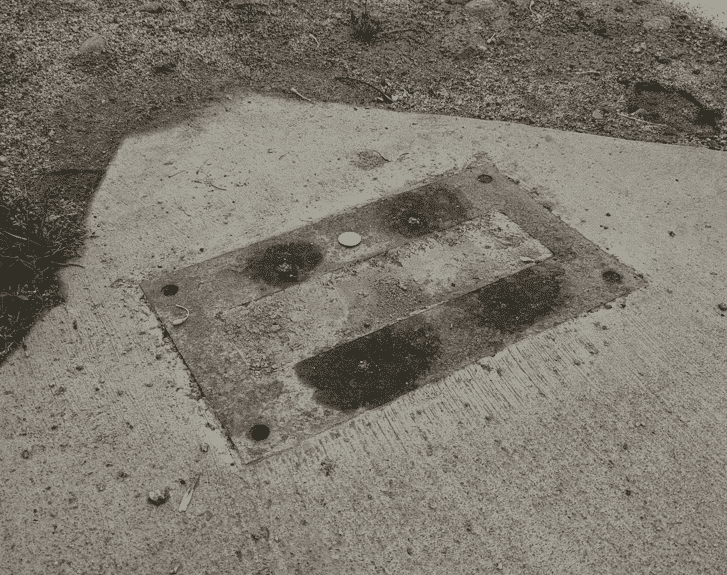](https://cdn.sparkfun.com/assets/learn_tutorials/2/6/4/9/SparkFun_PayPhone_50_-_Last_Nickel.jpg)

第二天，有人留下了一枚五分镍币，完好无损地放在便笺簿上。一个公用电话酒的排序为所有删除和丢失的公用电话在那里。

## 结束了

[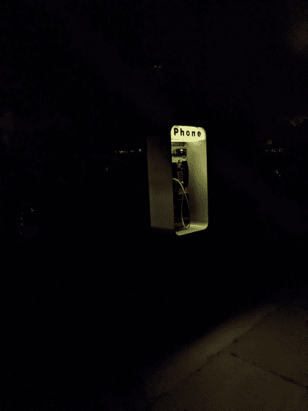](https://cdn.sparkfun.com/assets/learn_tutorials/2/6/4/9/SparkFun_PayPhone_52_-__Deployed_3.jpg)

这个项目获得了巨大的成功。了解情况的人喜欢这种体验。我们的孩子喜欢给人打电话，人们看电话的眼神从极度怀疑到极度喜悦。非常有趣！

下次你看到付费电话时，停下来注意一下。总是值得一看的。