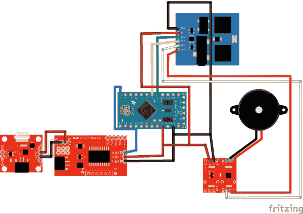
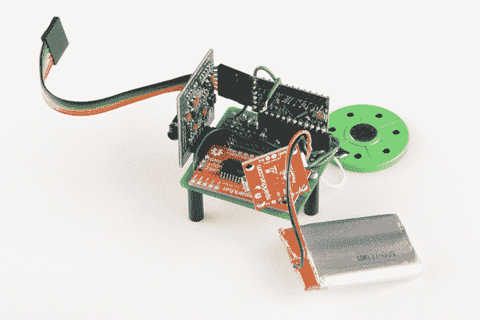

# 不确定的 7 立方

> 原文：<https://learn.sparkfun.com/tutorials/the-uncertain-7-cube>

## 魔法不是真的

这很可悲，但却是事实。我们不能漂浮，我们不能传送，我们肯定看不到未来。这最后一点让所谓的[“魔法 8 球”](https://en.wikipedia.org/wiki/Magic_8-Ball)变得特别险恶。随机回答一个是或否的问题没有什么神奇的。明白了这一点，唯一负责任的事情就是为这个开明的时代建造一个更好、更诚实的算命装置。我向你展示:不确定的七次方。

[](//cdn.sparkfun.com/assets/4/6/8/9/4/512ff98fce395fe532000001.jpg)

不确定的 7-Cube 是一个不确定的，不太有用的，但也完全诚实的算命师。简单地问它一个是或否的问题，轻轻推它一下，7-Cube 就会尽职尽责地告诉你，它没有掌握所有的事实，并且不愿意做出猜测。没错，在各种声音和众多的回应中，不确定的 7 立方会通过拒绝为你做决定来保持你对未来的责任感！

要做到这一点，我们需要几样东西:

*   [Parallax Emic2 文本到语音转换模块](https://www.sparkfun.com/products/11711)
*   [Arduino Pro Mini 5V](https://www.sparkfun.com/products/11113)
*   [2”方形样板](https://www.sparkfun.com/products/8811)
*   [单声道音频放大器分线点](https://www.sparkfun.com/products/11044)
*   [瘦喇叭](https://www.sparkfun.com/products/10722)
*   [动力电池脂肪充电器/升压器](https://www.sparkfun.com/products/11231)
*   [1000mAh 聚合物锂离子电池](https://www.sparkfun.com/products/339)
*   [震动唤醒板](https://www.sparkfun.com/products/11447)
*   [FTDI 基本分线点 5V](https://www.sparkfun.com/products/9716)
*   有的[男直角](https://www.sparkfun.com/products/553)和[女头球](https://www.sparkfun.com/products/115)
*   某种外壳(我用了丙烯酸)
*   一个烙铁和一些焊料

## 不确定性的背后

既然魔法不能让这东西运转，那是什么呢？嗯，有点混乱:

[](https://cdn.sparkfun.com/assets/learn_tutorials/5/3/Uncertain7_bb2.png)

不确定的 7 立方在等待被拾起或碰撞时保持“静止”的能力是摇醒板的一个功能。摇动唤醒使用超低功率加速度计来检测运动。当检测到运动时，板载微控制器唤醒并打开立方体其余部分的电源。

说话的能力(看起来很神奇)实际上是由 Parallax 的 emic2 文本到语音模块提供的。这个模块只是通过串行连接获取字符串，将它们解析成可发音的单词，并使用内置的语音合成器大声朗读出来。我们的单声道放大器突破把音量调到 11，所以你可以清楚地听到立方体的非建议。

所有不同的不确定答案都存储在 Arduino Pro Mini 上，它被编程为从列表中随机选择一个答案，并通过串行端口传输。当它从 emic2 模块获得信号，表明它已经完成通话时，Pro Mini 会关闭一切，立方体会回到停滞状态。

emic2 模块的输入电压为 5V，因此立方体的电源电压需要能够提供该电压。锂聚合物电池和 Powercell 板为系统提供 5V 电压。Powercell 还提供了一种无需取出电池即可充电的简单方法。

## 建筑

这个不确定的 7 立方应该和一个神奇的 8 球差不多大，除了，你知道，立方体形状。实现这一点的方法是，几乎所有的元件板都使用直角接头垂直安装在一个 2 英寸的正方形原型板上。这使得所有东西都牢牢地固定在立方体上，并在中心留出了放置电池的空间。

[](//cdn.sparkfun.com/assets/0/c/b/e/9/512ffa88ce395fb545000000.jpg)

如您所见，Arduino Pro Mini 上的 FTDI 接头上连接了一根带状电缆。这只是为了让 Arduino 在整个封装后被编程。文本到语音模块上的耳机插孔、Powercell 上的充电插孔和 FTDI 带都可以从组件的一侧接触到；这样，如果我需要什么东西的话，我可以避免把整个围栏拆开。

唯一没有垂直安装的部分是唤醒板。由于它使用加速度计来检测它何时改变位置，因此它需要牢固地连接到电路板，这样它就不会四处摆动，从而降低传感器的可靠性。你还会注意到扬声器就挂在板上。当所有东西都安装在外壳中时，支架会阻止扬声器移动。

## 该外壳

立方体是一种很好的形状。它们由规则的平面组成，因此几乎任何东西都很容易制造出来。我决定激光切割丙烯酸是最快的方法，使一个真正好看的外壳。为了制作基本的盒子形状，我使用了一个名为 [BoxMaker](http://boxmaker.rahulbotics.com/) 的在线工具，它可以获取盒子的尺寸和材料的厚度，并生成一个带有图案的矢量文件。我将图案导入到 [InkScape](http://inkscape.org/) (一个免费的矢量绘图工具)中，并添加了一点我自己的风格。

[](//cdn.sparkfun.com/assets/6/2/8/1/f/5130007ece395f0833000001.png)

在我把文件抽出来之后，我把它送到了激光切割机那里。细线被切割，厚的特征和形状被光栅蚀刻。当碎片从激光切割机出来时，我用塑料抛光剂清洁它们，并用白色油漆笔在蚀刻的特征内侧涂色。

当一切都干干净净的时候，就是拼图的时候了。我开始用螺丝把电子设备固定在立方体的底板上。有三个洞被切在一块将匹配的立场。我用一个手钻在孔上加了一个倒角，这样可以隐藏机器螺丝的头部。

一旦核心就位，我就开始用热胶水一次一块地组装立方体。我留了一个面板，以便我仍然可以访问板来更换/充电电池或连接到 emic2 模块的耳机插孔。

## 代码

由于 Wake-on-Shake 板处理所有的休眠和运动检测功能，Arduino 所要做的就是选择一个短语，将其发送到语音合成器，然后告诉 Wake-on-Shake 再次关闭一切。该代码主要基于 Parallax 提供的 Emic2 示例代码。

```
language:C
#include <SoftwareSerial.h>
#include <TrueRandom.h>

#define rxPin 2    // Serial input (connects to Emic 2 SOUT)
#define txPin 3    // Serial output (connects to Emic 2 SIN)
#define ledPin 13  // Most Arduino boards have an on-board LED on this pin
#define wakePin 9 // Wake on Shake "Keep Awake" Pin

// set up a new serial port
SoftwareSerial emicSerial =  SoftwareSerial(rxPin, txPin);

void setup()  // Set up code called once on start-up
{
 // define pin modes
 pinMode(ledPin, OUTPUT);
 pinMode(rxPin, INPUT);
 pinMode(txPin, OUTPUT);
 pinMode(wakePin, OUTPUT);

 // set the data rate for the SoftwareSerial port
 emicSerial.begin(9600);

 /*
    When the Emic 2 powers on, it takes about 3 seconds for it to successfully
    intialize. It then sends a ":" character to indicate it's ready to accept
    commands. If the Emic 2 is already initialized, a CR will also cause it
    to send a ":"
 */

 emicSerial.print('\n');             // Send a CR in case the system is already up

 while (emicSerial.read() != ':');   // When the Emic 2 has initialized and is ready, it will 
 //send a single ':' character, so wait here until we receive it
 delay(10);                          // Short delay
 emicSerial.flush();                 // Flush the receive buffer
 digitalWrite(wakePin, HIGH); // Tell the Wake-on-Shake that we're still awake
}

void loop()
{
int freeWill = TrueRandom.random(16); // Choose a response. This is the magic part.
// int summonVoice = TrueRandom.random(9); // Summon a voice from Beyond
// summonVoice = char(summonVoice); // Convert the will of the universe 
//to a character so the emic module will accept it
// emicSerial.print('N'); // Select voice
// emicSerial.print(summonVoice); // Our voice from Beyond
// emicSerial.print('\n'); // Terminate the voice command
emicSerial.print('S'); // Speak some text command
switch (freeWill) {

 case 0:
  emicSerial.print("I mean, anything is possible. Right?");
  break;   
 case 1:
  emicSerial.print("I don't feel comfortable saying either way.");   
  break;
 case 2:
  emicSerial.print("Yes. . Oor No. . I won't speculate.");   
  break;   
 case 3:
  emicSerial.print("I say: go with what you know.");   
  break;
 case 4:
  emicSerial.print("How important is it to know that right now?");   
  break;   
 case 5:
  emicSerial.print("If it happens, it happens.");   
  break;
 case 6:
  emicSerial.print("Hoo could possibly know that?");   
  break;   
 case 7:
  emicSerial.print("I won't pretend to be an expert on the subject.");   
  break;
 case 8:
  emicSerial.print("It's not obviously a yes. It's not a particularly strong no either.");   
  break;   
 case 9:
  emicSerial.print("Bro... You need to live in the now. The future will be here soon enough.");   
  break;
 case 10:
  emicSerial.print("Ummmm. . . Sure? I mean, I don't know. but maybe?");   
  break;
 case 11:
  emicSerial.print("You're not giving me a lot to work with here.");   
  break;
 case 12:
  emicSerial.print("I'll need to form a subcommittee and get back to you.");   
  break;
 case 13:
  emicSerial.print("Market research in that segment shows a trend torward attitudes that strongly favor neither answer in particular.");   
  break;
 case 14:
  emicSerial.print("I suggest you shop the idea with a focus group.");   
  break;
 case 15:
  emicSerial.print("You should leverage web 2 point oh social leadership to crowdsource the answer.");   
  break;

default:
  emicSerial.print("The default case occurred. This shouldn't have happened.");
  }

 emicSerial.print('\n'); // Terminate the speech command
 while (emicSerial.read() != ':');   // Wait here until the Emic 2 responds with a ":" indicating it's done talking
 digitalWrite(wakePin, LOW); // Let the Wake-On-Shake module know it's okay to turn off
 while(1){}; // Hang out here until the WOS module shuts us down
} 
```

就这样，我简单地使用了一个名为[“true random”](https://code.google.com/p/tinkerit/wiki/TrueRandom)的随机数生成器库来挑选一个数字。然后我用这个数字从列表中选择了一个短语。这句话被发送到串行端口，然后 sleep 引脚被允许降至 0V，发出唤醒信号关闭。拿起立方体，整个过程重新开始！

## 现在都在一起

[https://www.youtube.com/embed/c7lyTyGqEGY?t=196/?autohide=1&border=0&wmode=opaque&enablejsapi=1](https://www.youtube.com/embed/c7lyTyGqEGY?t=196/?autohide=1&border=0&wmode=opaque&enablejsapi=1)

*[Uncertain 7 Cube Demo at 3:16](https://youtu.be/c7lyTyGqEGY?t=196) from [SparkFun](https://www.youtube.com/sparkfun) on [YouTube](https://www.youtube.com).*

这就是了。一个不会做出任何超自然声明的算命装置。它把所有的乐趣都带走了吗？也许吧。它是一个有趣的建筑吗？完全同意。我会中彩票吗？我不喜欢说任何一种方式，但是任何事情都可能发生...对吗？

如果你想自己尝试一下，这里有一些有用的资源:

*   [烧结项目](//cdn.sparkfun.com/assets/5/6/0/4/a/51300239ce395f4032000001.fzz)
*   [附件文件](//cdn.sparkfun.com/assets/4/a/f/7/8/51300396ce395f2731000002.svg)
*   [示意图](//cdn.sparkfun.com/r/600-600/assets/a/4/d/0/8/513002cfce395faa31000000.jpg)
*   [Arduino 代码](//cdn.sparkfun.com/assets/f/8/3/8/5/5130023bce395f0933000001.ino)