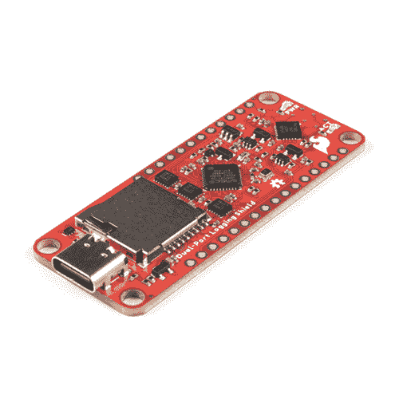

# Thing Plus 双端口测井屏蔽连接指南

> 原文：<https://learn.sparkfun.com/tutorials/thing-plus-dual-port-logging-shield-hookup-guide>

## 介绍

[Thing Plus 双端口日志屏蔽](https://www.sparkfun.com/products/19217)是一个 Thing Plus/Feather 兼容板，让您通过*SPI 和 USB-C 访问您的 microSD 卡！它被设计成安装在我们的[东西加板](https://www.sparkfun.com/thing_plus)的上面或下面。您可以像往常一样，使用您最喜欢的 Arduino SD 库，通过 SPI 将数据记录到您的 microSD 卡中，并从其中读取数据。但也可以通过 USB-C 连接到电脑上，以 ***高达 35mb/秒*** 的速度读写文件！写入速度取决于卡，但在我们的测试中，我们经常看到写入速度约为 20MB/s。无需再移除 microSD 来读取您的数据！*

* 

将**添加到您的[购物车](https://www.sparkfun.com/cart)中！**

### [SparkFun 东西加双口伐木盾](https://www.sparkfun.com/products/19217)

[Out of stock](https://learn.sparkfun.com/static/bubbles/ "out of stock") DEV-19217

SparkFun 双口测井屏蔽板是一个东西加/羽毛兼容板，允许您访问您的 microSD 卡或…

$29.95[Favorited Favorite](# "Add to favorites") 1[Wish List](# "Add to wish list")** **[https://www.youtube.com/embed/9PqgbaSS-B8/?autohide=1&border=0&wmode=opaque&enablejsapi=1](https://www.youtube.com/embed/9PqgbaSS-B8/?autohide=1&border=0&wmode=opaque&enablejsapi=1)

### 所需材料

要跟随本教程，您将需要以下材料。你可能不需要所有的东西，这取决于你拥有什么。将它添加到您的购物车，通读指南，并根据需要调整购物车。***