# 触摸电位计连接指南

> 原文：<https://learn.sparkfun.com/tutorials/touch-potentiometer-hookup-guide>

## 介绍

[触摸电位计](https://www.sparkfun.com/products/13144)，简称触摸电位计，是一种智能、线性电容式触摸传感器，可实现 256 位电位计功能。它可以作为计算机、嵌入式微控制器的外设运行，也可以独立运行。触摸电位计提供双通道模拟和 PWM 输出，用于直接控制其他电路。可配置的模拟和 PWM 传递函数支持各种应用。

[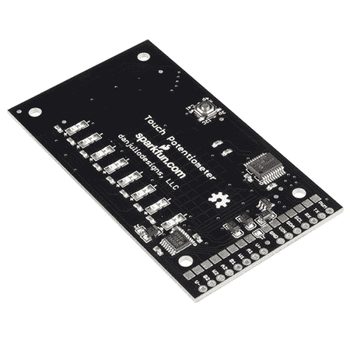](https://www.sparkfun.com/products/13144) 

将**添加到您的[购物车](https://www.sparkfun.com/cart)中！**

### [火花触摸电位器](https://www.sparkfun.com/products/13144)

[26 available](https://learn.sparkfun.com/static/bubbles/ "26 available") PRT-13144

SparkFun 触摸电位计，或触摸锅的简称，是一种智能线性电容触摸传感器，它实现了触摸电位测量。

$16.95 $10.173[Favorited Favorite](# "Add to favorites") 48[Wish List](# "Add to wish list")** **[https://www.youtube.com/embed/VCq-ZJU6gtk/?autohide=1&border=0&wmode=opaque&enablejsapi=1](https://www.youtube.com/embed/VCq-ZJU6gtk/?autohide=1&border=0&wmode=opaque&enablejsapi=1)

**Note:** This product is a collaboration with [danjuliodesigns](http://danjuliodesigns.com/products/touch_pot/touch_pot.html). A portion of each sales goes back to them for product support and continued development.

* * *

### 推荐材料

本教程将通过许多例子来说明如何使用触摸电位计。每个示例所需的材料将在该示例部分的开头列出。

### 建议阅读/观看

首先，danjuliodesigns 的 Dan Julio 为触摸电位计编写了一份令人惊叹的用户手册。您需要了解的关于触摸罐的大部分信息都可以在该文件中找到，包括最大额定功率、尺寸图和非常详细的操作说明。您可以通过下面的链接下载手册，也可以从他的网站获取最新版本。

[Touch Potentiometer User Manual](https://cdn.sparkfun.com/assets/learn_tutorials/1/8/8/touch_pot_sf_1_4.pdf)

为了更好地理解接触式电位计及其工作原理，最好理解以下概念。如果有你不熟悉的，首先访问相应的教程，然后返回。

*   [电阻器](https://learn.sparkfun.com/tutorials/resistors)—[电位计](https://learn.sparkfun.com/tutorials/resistors/types-of-resistors#pot)上的部分特别有趣。
*   [串行通信](https://learn.sparkfun.com/tutorials/serial-communication) -触摸罐使用串行通信与用于配置电路板的实用程序对话。
*   [I2C](https://learn.sparkfun.com/tutorials/i2c) -触摸罐使用 I2C 通信与嵌入式微控制器或总线上的其他触摸罐通信。
*   [脉宽调制](https://learn.sparkfun.com/tutorials/pulse-width-modulation) -触摸罐有一个 PWM 输出，用于连接照明系统或其他接受 PWM 输入的控制器。
*   [十六进制](https://learn.sparkfun.com/tutorials/hexadecimal)和[二进制](https://learn.sparkfun.com/tutorials/binary)在潜入摸壶操作时大量使用。
*   触摸罐依靠[电容感应](http://en.wikipedia.org/wiki/Capacitive_sensing)来检测其电流设置的变化。下面的视频详细介绍了电容感应的工作原理以及检测电容感应的不同方法。

[https://www.youtube.com/embed/bhspPkxOMxs/?autohide=1&border=0&wmode=opaque&enablejsapi=1](https://www.youtube.com/embed/bhspPkxOMxs/?autohide=1&border=0&wmode=opaque&enablejsapi=1)

## 主板概述

触摸电位计有几种不同的接口方式。本节将简要介绍这些方法。这些信息的大部分可以在[用户手册](https://cdn.sparkfun.com/assets/learn_tutorials/1/8/8/touch_pot_sf_1_4.pdf)中找到。

[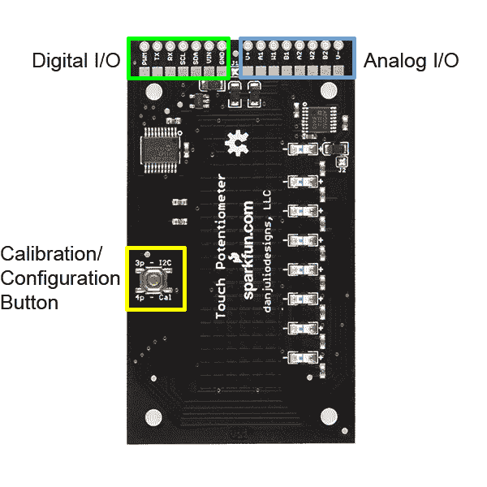](https://cdn.sparkfun.com/assets/learn_tutorials/1/8/8/Overview.png)

### 数字输入输出

触摸电位计数字 IO 连接包括微控制器和 AD5262 数字部分的 VIN 和地电源信号、TTL 电平串行接口、I ² C 接口和 PWM 输出。触摸电位计使用 TTL 级串行接口或 I ² C 接口与主机设备通信。两个接口同时处于活动状态。串行接口的工作速率为 9600 波特。I ² C 接口是一个 7 位从机，最大时钟速率为 100 kHz。它不支持广播或 10 位寻址。

| Pin Label | 功能 |
| --- | --- |
| GND | 地面 |
| 车辆识别号码 | +5-12 伏电源输入 |
| 国家药品监督管理局 | I ² C SDA(数据) |
| SCL | SCL(时钟) |
| 药方(prescription 的缩写) | 串行 TTL RX 输入 |
| 谢谢 | 串行 TTL TX 输出 |
| 脉宽调制（pulse-width modulating 的缩写） | 脉宽调制输出 |

#### 力量

触摸罐有一个 5V LDO 电压调节器(Vreg)，允许电路板由大于 5V 的外部电源供电(非常适合需要 9-12V 的照明和音频系统)。VIN 引脚可以用 4.6-12V 之间的任何电压**供电。Vreg 的数据表可以在[这里](http://www.micrel.com/_PDF/mic5205.pdf)找到。**

**Important Note about Power Supplies**

The capacitive sensors may be adversely affected by electrical noise. They are sensitive to 50 and 60-Hz energy that may be coupled through power supplies with inadequate line filtering or configurations with a ground loop (for example, a system that has a DC power supply and is also connected to a computer with its own power supply). It may be necessary to include an AC line filter in front of some cheap switch-mode power supplies to eliminate ground loop conditions.

#### 串行通信

带有 USB 接口和终端仿真器程序的计算机可以使用[串行接口](https://learn.sparkfun.com/tutorials/serial-communication)访问触摸电位计，该接口连接到 USB 转串行设备，如 [FTDI 基本分线板](https://www.sparkfun.com/products/9716)或微控制器，如 [5V Pro Micro](https://www.sparkfun.com/products/12640) ，该微控制器具有支持通信设备类(CDC)的 USB 接口和串行端口。触摸电位计串行接口以 5V 逻辑电平工作，数据速率为 9600 波特，8 个数据位，无奇偶校验和一个停止位(8N1)。

### I ² C 通信

触摸罐通过 [I ² C](https://learn.sparkfun.com/tutorials/i2c) 进行通信，就像任何其他 I ² C 传感器一样。它支持 7 位寻址和 100 kHz 的最大传输速率。它可以直接连接到 5V Arduino I ² C 外设(A4/A5)。电平转换器应该用于 3.3V Arduino 板(或其他 3.3V 微控制器)。触摸电位计在其 I ² C 信号上激活弱上拉电阻，因此短连接(几英寸)不需要上拉电阻。上拉电阻值为 4.7k &欧姆；至 10k &欧姆；可能会用到。

**默认 I ² C 地址为 0x08** 。有 **64 个可用的 I2C 地址**。触摸壶使用两个连续的 I2C 地址，这就是为什么只有 64 个可用。关于在应用程序中改变地址的细节将在教程的后面讨论。

#### 脉宽调制

PWM 输出产生一个占空比与当前触摸电位计值成比例的信号。零值会产生占空比为 0%的 PWM 输出(关闭)。值为 255(满量程)时，PWM 输出的占空比接近 100%(开)。

### 模拟输入输出

触摸电位计模拟 IO 信号由[AD5262]游标和游标电源信号组成。AD5262 支持两个独立的数字 20k &ohm;电位计，每个电位计有两个引脚和一个游标连接。它们有自己的电源连接，允许电位计上的电压电平超过+5 伏逻辑电源(参见下面的重要说明)。

| Pin Label | 功能 |
| --- | --- |
| A1、A2 | a 电位计 1 和 2 的端子 |
| W1，W2 | 电位计 1 和 2 的游标端子 |
| B1，B2 | 电位计 1 和 2 的 b 端子 |
| V+ | 正电源。在工厂通过跳线 J1 连接到 5V 逻辑信号。移除 J1 后，它可以连接到高达 15V 的正电压。注意&#124;V-&#124; + &#124;V+&#124;之和必须小于等于 15V。 |
| 五- | 负电源。在工厂通过跳线 J2 接地。移除 J2 后，这可以连接到低至-5V 的负电压。注意&#124;V-&#124; + &#124;V+&#124;之和必须小于等于 15V。 |

**Current Limitations:** The maximum amount of current allowed through the A or B to W pins is 5mA continuous, 20 mA intermittent.**Important Notes about V+ and V-**

Care must be taken with V+ and V- to prevent damage to the ICs on the Touch Potentiometer.

1. V+ and V- must always be connected to power and should be powered before or at the same time voltages appear on the A, B and W signals and 5V input.

2. By default, V+ is connected to 5V with jumper J1 and V- is connected to ground with jumper J2\. Voltages on the A, B and W signals should not exceed the range of 0 - 5V with these jumpers installed. Remove these jumpers by removing the solder blob if a different power supply will be connected to V+ and/or V-.

3. The maximum voltage potential between V- and V+ is 15 volts. V- maximum is -5V. V+ maximum is 15V.

4. Electrical noise on V- and V+ may be coupled into the signal passing through the potentiometer. A power supply connected to V- and V+ may require additional filtering to eliminate this noise.

### 校准/配置按钮

触摸罐背面有一个按钮，允许用户动态更改 I ² C 地址，以及动态校准电容式触摸传感器。如按钮附近的丝网所示，快速连续按三次将进入 I ² C 地址更改模式，按四次将开始校准过程。按压必须在 2 秒内完成，否则将被忽略

## 触摸锅实用程序

Dan Julio 创建了一个桌面应用程序，通过串行连接与触摸罐通信。通过这个实用程序，您可以更改配置设置，改变 LED 行为，校准电容式触摸传感器，在 jabber 模式下查看电流读数，等等。

你可以从 danjuliodesigns.com 下载名为 **tputil** 的工具。Windows、Mac 和 Linux 版本都有。

为了在 Touch Pot 和 tputil 之间进行通信，您需要创建一个串行连接。最简单的方法是将一些接头焊接到接触罐上。你需要某种形式的 TTL 到 USB 转换器，比如我们的 [USB 到 TTL 串行电缆](https://www.sparkfun.com/products/12977)或者类似于 [FTDI Basic](https://www.sparkfun.com/products/9716) 的东西，带有一些[公母跳线](https://www.sparkfun.com/products/9140)。

按如下方式进行连接:

| TTL 转 USB 设备 | 触摸电位计 |
| --- | --- |
| GND | GND |
| VCC | 车辆识别号码 |
| 谢谢 | 药方(prescription 的缩写) |
| 药方(prescription 的缩写) | 谢谢 |

[](https://cdn.sparkfun.com/assets/learn_tutorials/1/8/8/Touch_Potentiometer_Tutorial-12.jpg)*Touch Potentiometer connected to computer via a USB to TTL Serial Cable. (Note: the logic levels on this cable are 3.3V but work well enough.)*

一旦连接了触摸罐，打开 tputil。选择正确的[串口](https://learn.sparkfun.com/tutorials/terminal-basics/basic-terminology-)，点击连接。连接后，您可以更改触摸罐的各种设置。

[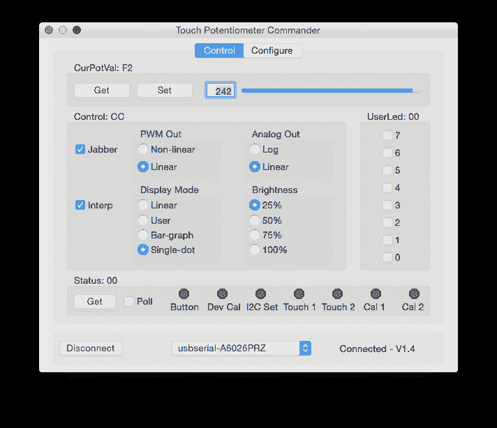](https://cdn.sparkfun.com/assets/learn_tutorials/1/8/8/Screen_Shot_2015-10-22_at_2.40.33_PM.png)

选中 Jabber 复选框将显示传感器的当前值。沿着传感器滑动手指会实时改变该值。其他设置，如 LED 行为，可以在这里改变。对于照明系统，PWM 输出可以设置为线性或非线性。对于音频系统，模拟输出可以设置为对数，而不是线性。

[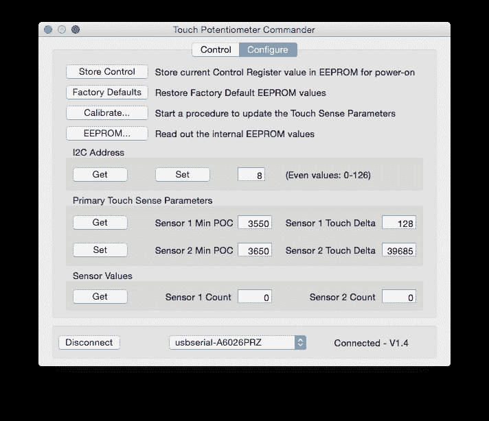](https://cdn.sparkfun.com/assets/learn_tutorials/1/8/8/utility2.png)

“配置”选项卡提供了许多选项，如 cap sense 校准、工厂复位、更改 I ² C 地址以及获取当前 EEPROM 和传感器值。

在用户手册的[操作章节](https://cdn.sparkfun.com/assets/learn_tutorials/1/8/8/touch_pot_sf_1_4.pdf#page=21)中可以找到关于实用程序提供访问的功能的更多详细信息。

## 示例 1: PWM 照明控制器

本例将演示如何使用触摸电位计上的 PWM 输出来控制 LED 照明系统。

许多 LED 照明系统使用恒流电源，例如我们的 [PicoBuck](https://www.sparkfun.com/products/11850) 和 [FemtoBuck](https://www.sparkfun.com/products/12937) LED 驱动器。这些驱动器通常有一个 PWM 输入，允许您打开或关闭 led。最好的部分是:没有编程的必要。

### 硬件连接

在进行任何连接之前，你需要决定你希望你的照明系统如何工作。PicoBuck 有三个独立控制的通道，能够处理 PWM 信号，而 FemtoBuck 只有一个通道和一个 PWM 输入。在本例中，一个 PicoBuck 上的所有三个输入连在一起，因此所有三个通道会一致衰落。您可以将每个通道分开，这对于 RGB 颜色混合系统来说非常好，但是在这种情况下，您需要为每个单独的通道设置一个触摸罐，或者在通道之间切换的方法。

当 PWM 输出设置为**非线性**时，触摸电位计作为照明调光控制效果最佳。这可以在前面提到的 tputil 应用程序中完成。

将接触式电位计连接到 PicoBuck 只需要两根导线。地需要连接到对面板上的地。如上所述，触摸罐上的 PWM 输出引脚连接到 PicoBuck 上的三个输入引脚(IN1、IN2 和 IN3 ),这三个引脚连在一起。

[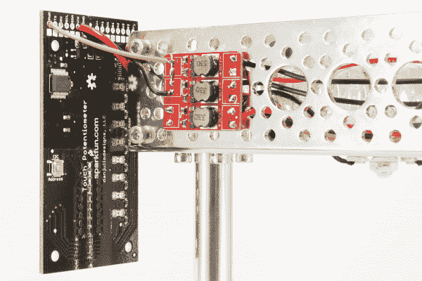](https://cdn.sparkfun.com/assets/learn_tutorials/1/8/8/Touch_Potentiometer_Tutorial-11.jpg)

这是一个线路图，显示了 FemtoBuck 的情况。这同样适用于微微降压器；只需将三个 PWM 引脚连在一起。

[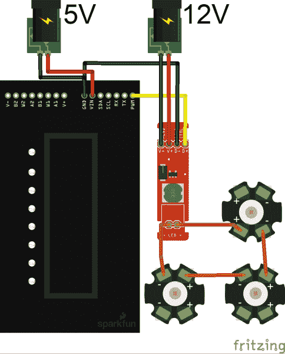](https://cdn.sparkfun.com/assets/learn_tutorials/1/8/8/TouchPotPicoBuckFritzing.png)*Note: You could also power the Touch Pot with the 12V supply, since it has the 5V LDO regulator on it. However, if you're powering you're LEDs with more than 12V, you'll need the secondary 5V-12V supply for the Touch Pot.*

最后，你需要给触摸罐和恒流驱动器供电。驱动器将接受高达 36V 的电压，但 **12V** 将更常见。你还需要用 5V 的**电压**给触摸罐供电。你可以使用两个独立的电源，比如一个 [5V](https://www.sparkfun.com/products/12889) 和 [12V](https://www.sparkfun.com/products/9442) 墙壁适配器，或者你可以找到一个双电压电源。我们提供 [12V/5V 电源(TOL-15664)](https://www.sparkfun.com/products/15664) 。对于更强大的照明系统，你也可以得到一个像样的电源，如 [Meanwell](https://www.sparkfun.com/categories/tags/mean-well) 。只要确保电路连接适当的电压。

**Warning!** Depending on the manufacturer, dual-voltage power supplies can lack proper filtering and tends to wreak havoc on the Touch Potentiometer. We saw this with our previous [12V/5V power supply (TOL-11296)](https://www.sparkfun.com/products/retired/11296). However, we **DO NOT** recommend using the older power supply with the Touch Potentiometer.

连接好所有设备后，您应该可以给触摸罐和 LED 驱动器通电了。所有设备都应通电，触摸罐应在“关闭”位置启动。将手指放在电容式触摸条上，观察 led 灯的开关。

[](https://cdn.sparkfun.com/assets/learn_tutorials/1/8/8/Touch_Potentiometer_Tutorial-10.jpg)

您可以在第 15 页的用户手册中了解更多关于[触摸电位计的 PWM 功能。](https://cdn.sparkfun.com/assets/learn_tutorials/1/8/8/touch_pot_sf_1_4.pdf#page=15)

[Capacitive Touch Potentiometer User Manual (pg 15)](https://cdn.sparkfun.com/assets/learn_tutorials/1/8/8/touch_pot_sf_1_4.pdf#page=15)

## 示例 2:模拟音量控制器

下一个例子将展示如何使用触摸电位计的模拟电位计功能来控制音频放大器的左右音量。本例将使用 [SparkFun 音频放大器套件](https://www.sparkfun.com/products/9612)。同样的连接也可以用于 [SparkFun 单声道音频放大器突破](https://www.sparkfun.com/products/11044)。

### 硬件连接

如果你还没有这样做，你需要[建立音频放大器套件](http://cdn.sparkfun.com/datasheets/Kits/SFE03-0010-KitCard-AudioAmp-ReadersSpreads_03.pdf)。确保**省略套件中包含的两个 PTH 电位计**。

触摸罐的模拟传递函数可以设置为**对数**，以实现更真实的音量控制**非线性**。这可以在前面提到的 tputil 应用程序中完成。

接下来，将触摸罐上的模拟电位计引脚连接到 PTH 电位计所在的音频放大器引脚。有两个通道，每个通道由 A、W 和 B 组成。我们将 A 视为“+”，W 为游标，B 为“-”。在 PCB 上，这些输入映射如下:

[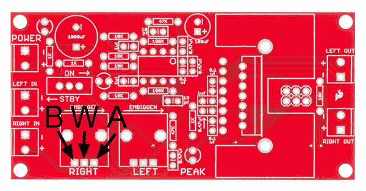](https://cdn.sparkfun.com/assets/learn_tutorials/1/8/8/AudioAmpTouchPot.png)

这是连接的底部。

[](https://cdn.sparkfun.com/assets/learn_tutorials/1/8/8/Touch_Potentiometer_Tutorial-06.jpg)

从顶部开始...

[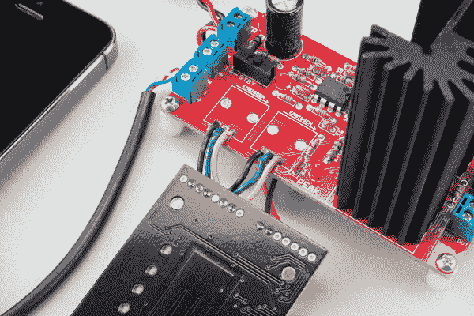](https://cdn.sparkfun.com/assets/learn_tutorials/1/8/8/Touch_Potentiometer_Tutorial-04.jpg)

一旦两个音量通道都连接上了，我们就需要给放大器和触摸壶供电。由于触摸壶有一个 5V LDO 电压调节器，我们可以使用相同的电源为放大器和触摸壶供电。应该使用 9V-12V 范围内的电源为两者供电。从输入端引出的电源可以在下图中看到。

[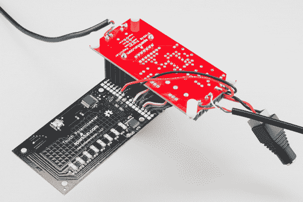](https://cdn.sparkfun.com/assets/learn_tutorials/1/8/8/Touch_Potentiometer_Tutorial-05.jpg)

最后，你需要连接一些音频输入和音频输出的电线。这可以通过几种不同的方式来实现。扬声器可以直接连接到放大器，也可以连接音频输出电缆，就像我们的例子一样。您可以在输入端使用一根[音频输入线](https://www.sparkfun.com/products/11580)。这使得手机，MP3 播放器和其他 3.5 毫米插孔类型的设备可以通过这种设置播放音乐。

连接好所有设备后，通电。您应该看到放大器和触摸壶通电。连接一个扬声器和一个音源，播放一些曲子，用触控锅控制音量！

[](https://cdn.sparkfun.com/assets/learn_tutorials/1/8/8/Touch_Potentiometer_Tutorial-03.jpg)*Complete Audio setup.*

您可以在[用户手册](https://cdn.sparkfun.com/assets/learn_tutorials/1/8/8/touch_pot_sf_1_4.pdf#page=20)中了解更多关于模拟输出功能的信息。

## 示例 3:与微控制器接口

前两个例子展示了如何开箱即用触摸壶，无需编程。这个例子将向你展示如何连接触摸锅到微控制器。它还将介绍如何在 I ² C 总线上添加多个触点。关于通过串行接口将触摸罐连接到计算机的示例，请访问[用户手册](https://cdn.sparkfun.com/assets/learn_tutorials/1/8/8/touch_pot_sf_1_4.pdf#page=16)

### 硬件连接

本例使用一个 [Pro Micro 5V](https://www.sparkfun.com/products/12640) 通过 I ² C 与触摸罐通信。两者之间的连接如下:

[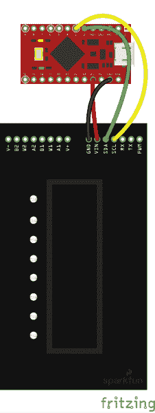](https://cdn.sparkfun.com/assets/learn_tutorials/1/8/8/ProMicroTouchPot.png)

您最终应该会得到如下所示的结果:

[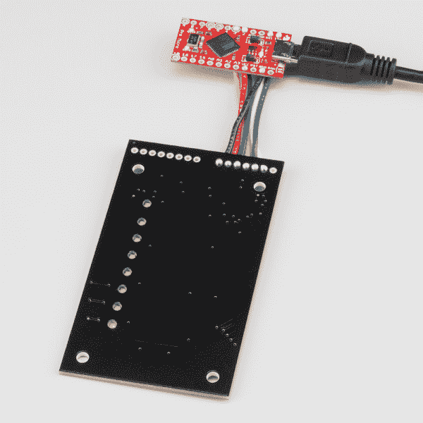](https://cdn.sparkfun.com/assets/learn_tutorials/1/8/8/Touch_Potentiometer_Tutorial-01.jpg)*Note: The white and blue wires are connected to the serial interface to allow the Pro Micro to talk to the tputil as well using a different sketch, [tp_test_sketch](http://danjuliodesigns.com/products/touch_pot/assets/tp_test_sketch.zip), found on [danjuliodesign.com](http://danjuliodesigns.com/products/touch_pot/touch_pot.html).*

如果您以前没有使用过 Pro Micro，您应该访问[连接指南](https://learn.sparkfun.com/tutorials/pro-micro--fio-v3-hookup-guide)。特别是，您需要安装一些额外的驱动程序，并将 Pro Micro 的主板定义添加到 Arduino IDE 中。《连接指南》涵盖了针对 [Windows](https://learn.sparkfun.com/tutorials/pro-micro--fio-v3-hookup-guide#installing-windows) 和 [Mac 和 Linux](https://learn.sparkfun.com/tutorials/pro-micro--fio-v3-hookup-guide#installing-mac--linux) 用户的内容。或者，您可以使用任何具有 I ² C 和串行通信的微控制器。

在 Arduino IDE 中设置 Pro Micro 后，选择正确的主板(Pro Micro)和串行端口。

[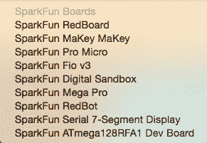](https://cdn.sparkfun.com/assets/learn_tutorials/1/8/8/Pro_MIcro.png)

然后，将以下代码上传到 Pro Micro:

```
language:c
/*
 * Simple Touch Potentiometer Example with Arduino
 *
 * Reads the pot value and controls the brightness of the Arduino LED on
 * Digital Pin 13\.  Also logs new values to the serial port.  Utilizes
 * both the direct and indirect command interface forms.
 *
 * Assumes Touch Pot is at I2C Address 8
 *
 * Released into the public domain by Dan Julio.  This software is supplied on an as-is 
 * basis and no warranty as to its suitability for any particular purpose is either made
 * or implied.  danjuliodesigns, LLC. will not accept any claim for damages howsoever
 * arising as a result of use or failure of this software.
 */
#include "Wire.h"

int i2cAddr = 8; // Direct access at i2cAddr, indirect registers at i2cAddr+1

uint8_t prevValue;
uint8_t curValue;

void setup() {
  Serial.begin(115200);
  Wire.begin();
  pinMode(13, OUTPUT);

  // Demonstrate access to Touch Potentiometer registers
  WriteTpReg(1, 128); // set to 50% by writing to register 1
  curValue = ReadTpReg(1); // read back value just set

  // Set Arduino LED PWM to match
  analogWrite(13, curValue);
  prevValue = curValue;
}

void loop() {
  delay(50);  // Read ~20 times/second

  // Demonstrate direct access to Touch Potentiometer value
  curValue = ReadTpValue(); // faster I2C access than register read
  if (curValue != prevValue) {
    analogWrite(13, curValue);
    Serial.println(curValue);
    prevValue = curValue;
  }
}

// Write a Touch Potentiometer register
void WriteTpReg(uint8_t addr, uint8_t data) {
  Wire.beginTransmission(i2cAddr+1);
  Wire.write('W');
  Wire.write(addr);
  Wire.write(data);
  Wire.endTransmission();
}

// Get the Touch Potentiometer value
uint8_t ReadTpValue() {
  Wire.requestFrom(i2cAddr, 1);
  if (Wire.available()) {
    return Wire.read();
  } else {
    return 0;
  }
}

// Read a Touch Potentiometer register
uint8_t ReadTpReg(uint8_t addr) {
  Wire.beginTransmission(i2cAddr+1);
  Wire.write('R');
  Wire.write(addr);
  Wire.endTransmission();

  Wire.requestFrom(i2cAddr+1, 1);
  if (Wire.available()) {
    return Wire.read();
  } else {
    return 0;
  }
} 
```

一旦上传完毕，打开你最喜欢的 115200 波特的[串行终端](https://learn.sparkfun.com/tutorials/terminal-basics)。当你沿着触摸罐上的电容式触摸条滑动手指时，你应该在终端上看到当前的 PWM 值。

[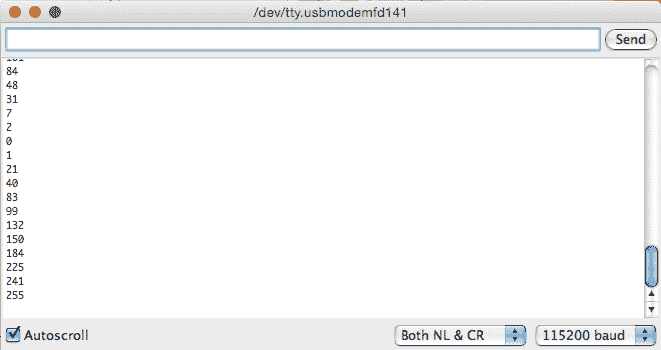](https://cdn.sparkfun.com/assets/learn_tutorials/1/8/8/ProMicroScreen.png)

### 多触点电位计

基于同样的例子，我们可以在 I ² C 总线上增加第二个接触点。您可以使用触摸罐背面的 SMD 焊盘将第二个触摸罐焊接到第一个触摸罐上。

[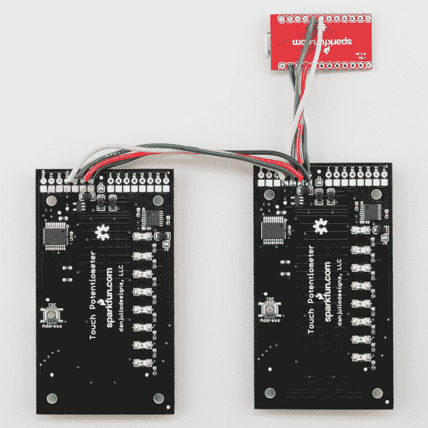](https://cdn.sparkfun.com/assets/learn_tutorials/1/8/8/Touch_Potentiometer_Tutorial-09.jpg)

为了实现这一点，您需要更改其中一个触摸罐上的 I ² C 地址。这可以通过 TP Utility 应用程序来完成，也可以通过按下触摸罐背面的按钮三次来动态更改。

您将看到触摸罐上的所有 led 闪烁三次，表示您处于地址更改模式。当您沿着传感器滑动手指时，指示灯会发生变化。他们在用[二进制](https://learn.sparkfun.com/tutorials/binary)告诉你地址。侧向握住触摸笔，PTH 孔在左侧，您将看到 0b01 和 0b64 之间的每个数字组合。

您可以重复这一过程，在单条 I ² C 总线上添加多达 64 个触摸点。

关于通过 I ² C 端口与微控制器接口的更多信息可以在[用户手册](https://cdn.sparkfun.com/assets/learn_tutorials/1/8/8/touch_pot_sf_1_4.pdf#page=17)中找到。

## 资源和更进一步

感谢阅读！这里是整个教程中提到的所有资源。

*   [触摸电位器产品页面@ danjuliodesigns.com](http://www.danjuliodesigns.com/products/touch_pot/touch_pot.html)
*   [示意图(PDF)](https://cdn.sparkfun.com/datasheets/Sensors/Capacitive/touch_pot_v13.pdf)
*   [老鹰文件(ZIP)](https://cdn.sparkfun.com/datasheets/Sensors/Capacitive/touch_pot_v13.zip)
*   [AD5262BRU 数据手册(PDF)](https://cdn.sparkfun.com/assets/learn_tutorials/1/8/8/AD5262BRU_datasheet.pdf)
*   [用户手册(PDF)](https://cdn.sparkfun.com/assets/learn_tutorials/1/8/8/touch_pot_sf_1_4.pdf)
*   [触摸电位计实用程序应用](http://www.danjuliodesigns.com/products/touch_pot/touch_pot/tputil.html)
*   [源代码(ZIP)](https://cdn.sparkfun.com/datasheets/Sensors/Capacitive/touch_pot.asm.zip)
*   [数字电位计 AD5262BRU 数据表](https://cdn.sparkfun.com/assets/learn_tutorials/1/8/8/AD5262BRU_datasheet.pdf)
*   [触摸电位计 GitHub 储存库](https://github.com/sparkfun/Touch_Potentiometer)
*   [SparkFun 产品展示:触摸电位计台灯](https://youtu.be/VCq-ZJU6gtk)

要获得更多电容式触摸的乐趣，请查看其他精彩的 SparkFun 教程。

[](https://learn.sparkfun.com/tutorials/bare-conductive-musical-painting-) [### 裸露导电音乐画](https://learn.sparkfun.com/tutorials/bare-conductive-musical-painting-) Learn how to make a musical painting using the Bare Conductive Touch Board and Conductive Paint.[Favorited Favorite](# "Add to favorites") 6[](https://learn.sparkfun.com/tutorials/at42qt101x-capacitive-touch-breakout-hookup-guide) [### AT42QT101X 电容式触摸分线架连接指南](https://learn.sparkfun.com/tutorials/at42qt101x-capacitive-touch-breakout-hookup-guide) Learn how to use the simple SparkFun AT42QT1010 and AT42QT1011 capacitive touch breakout boards.[Favorited Favorite](# "Add to favorites") 3[](https://learn.sparkfun.com/tutorials/raspberry-pi-stand-alone-programmer) [### Raspberry Pi 独立程序员](https://learn.sparkfun.com/tutorials/raspberry-pi-stand-alone-programmer) This tutorial will show you how to use a headless Raspberry Pi to flash hex files onto AVR microcontrollers as a stand-alone programmer. It also tells the story about production programming challenges, how SparkFun came to this solution, and all the lessons learned along the way.[Favorited Favorite](# "Add to favorites") 12[](https://learn.sparkfun.com/tutorials/capacitive-touch-slider-cap1203-hookup-guide) [### 电容式触摸滑块(CAP1203)连接指南](https://learn.sparkfun.com/tutorials/capacitive-touch-slider-cap1203-hookup-guide) An easy and Qwiic way to add capacitive touch to any of your projects using the CAP1203! In this guide, we go over how to connect and set up your Capacitive Touch Slider so you can start playing with it right away.[Favorited Favorite](# "Add to favorites") 2**