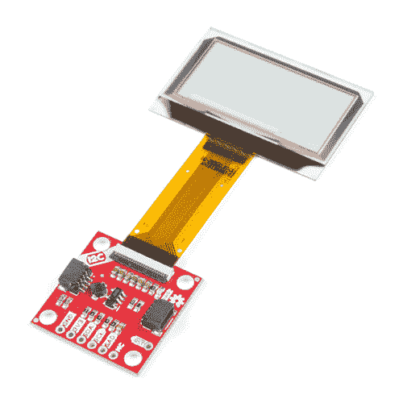

# 透明图形有机发光二极管分线点连接指南

> 原文：<https://learn.sparkfun.com/tutorials/transparent-graphical-oled-breakout-hookup-guide>

## 介绍

未来就在这里！您要求我们提供——我们的 [Qwiic 透明图形有机发光二极管分线点](https://www.sparkfun.com/products/15173)允许您使用 I ² C 或 SPI 连接在透明屏幕上显示自定义图像。

使用 Qwiic 连接器，您可以快速(哈哈)轻松地开始制作自己的图像。然而，我们仍然有 0.1 英寸间距的引脚，以防您更喜欢使用试验板。这款有机发光二极管在黑暗中被明亮地照亮，在白天仍然可见，显示区域为 128x64 像素，其中 128x56 像素是完全透明的。对有机发光二极管的控制是基于我们新的超显库。

 

### [【spark fun 透明图形有机发光二极管突破(Qwiic)](https://www.sparkfun.com/products/retired/15173)

[Retired](https://learn.sparkfun.com/static/bubbles/ "Retired") LCD-15173

SparkFun Qwiic 透明图形有机发光二极管突破允许您在透明屏幕上显示自定义图像使用

5 **Retired**[Favorited Favorite](# "Add to favorites") 51[Wish List](# "Add to wish list")

[https://www.youtube.com/embed/vzFuVbxBfXI/?autohide=1&border=0&wmode=opaque&enablejsapi=1](https://www.youtube.com/embed/vzFuVbxBfXI/?autohide=1&border=0&wmode=opaque&enablejsapi=1)

驱动该显示器所需的 Arduino 草图需要相当多的动态内存，这意味着它不适合像 ATmega328 这样的较小控制器。任何有更大 RAM 的控制器应该都没有问题。在本教程中，我们使用的是 [ESP32 加上](https://www.sparkfun.com/products/14689)。

### 所需材料

要跟随本教程，您将需要以下材料。你可能不需要所有的东西，这取决于你有什么。将它添加到您的购物车，通读指南，并根据需要调整购物车。