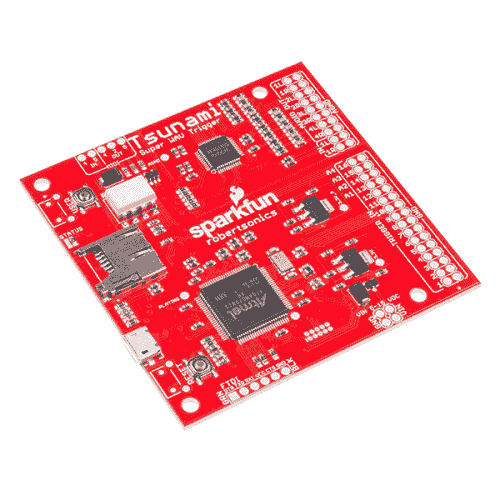

# 海啸连接指南

> 原文：<https://learn.sparkfun.com/tutorials/tsunami-hookup-guide>

## 介绍

海啸是下一代 SparkFun 复音 WAV 文件播放器。

 

### [海啸超级 WAV 触发](https://www.sparkfun.com/products/retired/13810)

[Retired](https://learn.sparkfun.com/static/bubbles/ "Retired") WIG-13810

基于新一代 ARM Cortex M7，海啸将复音扩展到 32 个单声道或 18 个立体声同步未压缩的 44.1…

13 **Retired**[Favorited Favorite](# "Add to favorites") 22[Wish List](# "Add to wish list")

海啸是海啸触发器的更大、更好的兄弟。它从相同的多音 WAV 文件播放引擎开始，然后添加了一系列新功能。

*   首先，Tsunami 具有八个模拟输出，可以配置为八个单声道输出或四个立体声输出。
    *   在立体声模式下，它可以同时播放 18 个立体声 WAV 文件。
    *   在单声道模式下，它可以播放 32 个单声道 WAV 文件。
    *   单声道模式还提供轨道同步选项，允许回放多声道内容，包括四声道、5.1 和 7.1 环绕声格式。
*   Tsunami 还具有立体声音频输入，可以混合到任何输出组合中。
*   每个输出提供独立的实时音量控制和弯音。
*   WAV 文件可以独立地映射到输出。
*   多达 4，096 个 WAV 文件可以在 microSD 卡上进行索引和播放。
*   可以通过三种不同的界面触发音轨。
    *   有 16 个板载输入可以连接到开关或逻辑电平器件。
    *   FTDI 兼容型封装允许计算机或微控制器进行串行控制。
    *   有板载 MIDI 输入和输出电路-只需添加 DIN-5 插座。
*   海啸提供低延迟。轨迹通常在触发事件的 8 毫秒内开始。
*   详细的轨道控制-轨道可以开始，暂停，恢复和停止，无缝循环。
*   固件可以很容易地从 SD 卡加载，这有助于在立体声和单声道播放模式之间切换，以及随着新功能的发布而升级。

Tsunami 是与 Robertsonics 公司合作开发的。每笔销售的一部分会返还给他们，用于产品支持和继续开发。

本指南将向您展示如何开始使用海啸。我们先把。WAV 和配置文件，然后在 Tsunami 中弹出，然后在多个输出中触发声音。

### 所需材料

要学习本项目教程，您需要以下材料: