# USB 串行驱动程序快速安装

> 原文：<https://learn.sparkfun.com/tutorials/usb-serial-driver-quick-install->

## FTDI 驱动程序安装

开发板，如用于 Arduino 的 SparkFun RedBoard 和 Arduino Uno，需要特殊的驱动程序或代码来告诉计算机如何与它们交互。本指南旨在帮助您尽快安装该驱动软件，以便您可以重新构建电路并学习电子学！

这些说明适用于 Arduino Uno、Arduino Uno SMD 和 Arduino 的 SparkFun RedBoard。

**Note:** You should only have to complete this process one time. Once the correct drivers are installed, your board will be recognized by your computer every time you plug it in afterwards.**Note for Educators:** You will most likely need to obtain administrative privileges from your network or IT administrator in order to install these drivers.

向下滚动到您正在使用的操作系统(OS)的相应部分。

## Windows 操作系统

将主板插入电脑。Windows 可能会抱怨设备没有正确的驱动程序。它可能会尝试找到它。如果你从来没有在你的电脑上插过类似的设备，它可能找不到驱动程序来使用。幸运的是，当你下载 Arduino IDE 时，它还附带了所有必要的驱动程序。

要安装正确的驱动程序，打开**设备管理器**。这可以通过在开始菜单中搜索“设备管理器”找到。打开设备管理器后，您应该会看到设备旁边有一个小小的黄色三角形和感叹号。

如果你插上一个 SparkFun 红板，它看起来会像左边的图片。插上 Arduino Uno 就会出现右图。

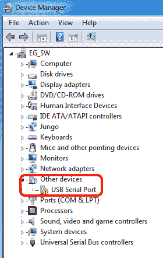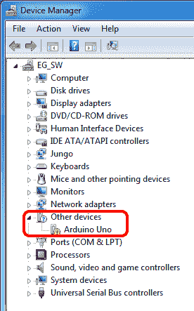

右键单击未知设备，选择**属性**。

[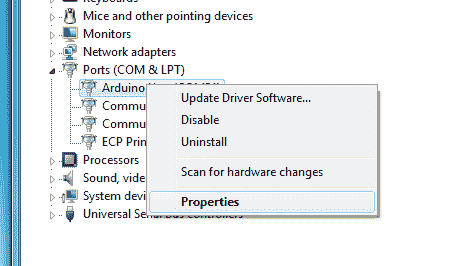](https://cdn.sparkfun.com/assets/learn_tutorials/6/0/9/windowsRightClickProperties.PNG)

在属性窗口中，选择**驱动程序细节**。

[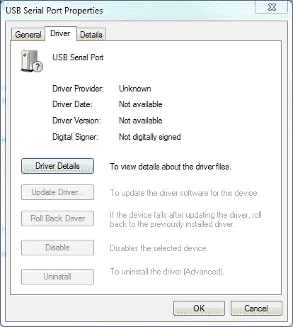](https://cdn.sparkfun.com/assets/learn_tutorials/6/0/9/windows2.PNG)

选择**浏览我的电脑中的驱动程序软件**选项。

[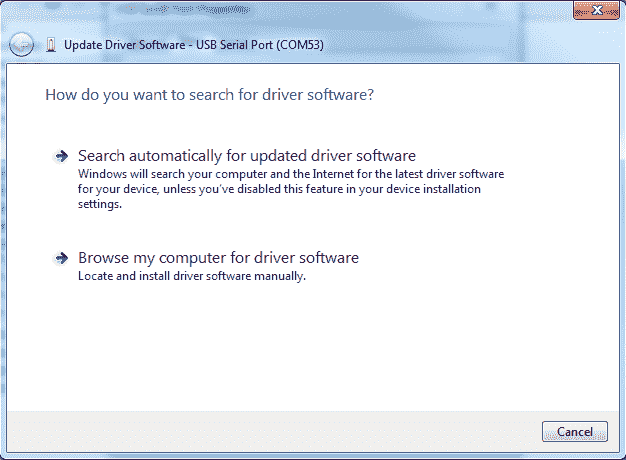](https://cdn.sparkfun.com/assets/learn_tutorials/6/0/9/windows3.PNG)

导航到安装 Arduino IDE 的目标位置。在 Windows 上，这很可能在您的程序文件文件夹中。导航到主 Arduino 文件夹中的 drivers 文件夹。您可以选择整个文件夹或特定的驱动程序。需要您的路径应该看起来像这样，但可能会有所不同:

[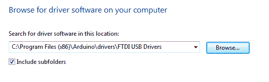](https://cdn.sparkfun.com/assets/learn_tutorials/6/0/9/windows4.PNG)

驱动程序安装完成后，您应该会看到该设备作为可用的 COM 端口重新出现在“设备管理器”窗口中。该数字会根据您在电脑上插入的设备数量而有所不同。红纸板将显示为`USB Serial Port`，如左图所示。Uno 将显示为一个`Arduino Uno`，如右图所示。

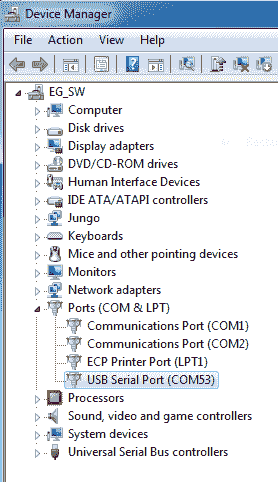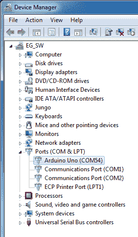

在 Arduino IDE 中，您应该在工具->端口下看到相同的串行端口。

[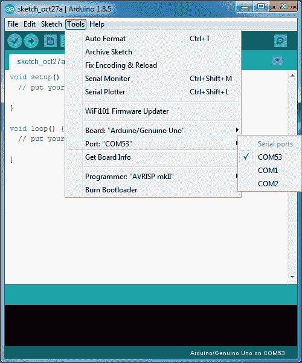](https://cdn.sparkfun.com/assets/learn_tutorials/6/0/9/windows7.PNG)

如果您遇到问题，请查看我们的[深入说明](https://learn.sparkfun.com/tutorials/how-to-install-ftdi-drivers/windows---in-depth)。

## 马科斯

将主板插入电脑。插入后，操作系统应该会将其识别为合适的设备。在 Arduino IDE 中，单击工具->端口以确保设备已被识别。SparkFun RedBoard 将出现一个`cu.usbserial-XXXXXX`设备。

[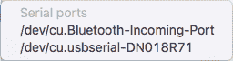](https://cdn.sparkfun.com/assets/learn_tutorials/6/0/9/mac1.png)

Arduino Uno 将作为`cu.usbmodemXXXXXX`设备出现。

[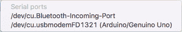](https://cdn.sparkfun.com/assets/learn_tutorials/6/0/9/mac2.png)

如果在插入主板并等待一会儿后，在 Arduino IDE 中没有看到可用的串行端口，那么您可能需要手动安装驱动程序。为此，请参见我们的[深入说明](https://learn.sparkfun.com/tutorials/how-to-install-ftdi-drivers/mac)。

## Linux 操作系统

将主板插入电脑。插入后，操作系统应该会将其识别为合适的设备。在 Arduino IDE 中，单击工具->端口以确保设备已被识别。SparkFun RedBoard 将出现一个`ttyUSBXX`设备。

[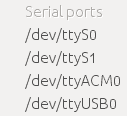](https://cdn.sparkfun.com/assets/learn_tutorials/6/0/9/linux1.png)

Arduino Uno 将作为`ttyACMXX`设备出现。

[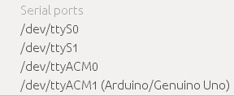](https://cdn.sparkfun.com/assets/learn_tutorials/6/0/9/linux2.png)

如果在插入主板并等待一会儿后，在 Arduino IDE 中没有看到可用的串行端口，那么您可能需要手动安装驱动程序。为此，请参见我们的[深入说明](https://learn.sparkfun.com/tutorials/how-to-install-ftdi-drivers/linux)。