# 使用 EAGLE:原理图

> 原文：<https://learn.sparkfun.com/tutorials/using-eagle-schematic>

## 介绍

EAGLE 中的 PCB 设计分为两步。首先设计原理图，然后根据原理图布局 PCB。EAGLE 的电路板和原理图编辑器携手合作。设计良好的原理图对于整个 PCB 设计过程至关重要。它将帮助您在电路板制造之前发现错误，并在电路板出现故障时帮助您调试电路板。

本教程是使用 EAGLE 系列的两部分*的第一部分，它完全致力于 EAGLE 的原理图设计方面。在第 2 部分[中，使用 EAGLE:电路板布局](https://learn.sparkfun.com/tutorials/using-eagle-board-layout)，我们将使用本教程中设计的原理图作为电路板布局示例的基础。*

[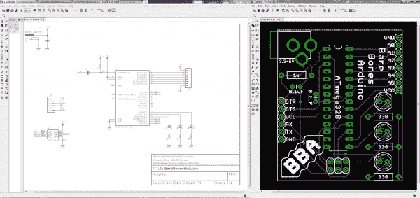](https://cdn.sparkfun.com/assets/7/7/8/e/b/52127573757b7f8a3e8b456c.png)

### 推荐阅读

如果你想继续学习本教程，请确保你已经安装并设置了 EAGLE 软件。我们的[如何安装和设置 EAGLE](https://learn.sparkfun.com/tutorials/how-to-install-and-setup-eagle) 教程一步一步地介绍了这个过程，它还涵盖了 EAGLE 是什么以及它的优点是什么的基础知识。它还包括如何下载和安装我们将在本教程中使用的 **SparkFun EAGLE 库**。在继续之前，请务必通读该教程。

我们还建议您阅读并理解这些教程背后的概念:

*   [如何阅读原理图](https://learn.sparkfun.com/tutorials/how-to-read-a-schematic)
*   [PCB 基础知识](https://learn.sparkfun.com/tutorials/pcb-basics)

## 创建项目

我们将从为我们的设计创建一个新的**项目文件夹**开始。在控制面板中的“项目”树下，右键单击您希望项目所在的目录(默认情况下，eagle 会在您的 home 文件夹中创建一个“EAGLE”目录)，然后选择**“新建项目”**。

[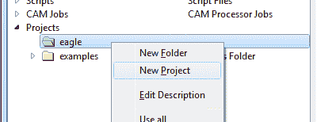](https://cdn.sparkfun.com/assets/8/0/3/2/4/51f82d95757b7f9a1c923eb3.png)

给新创建的红色项目文件夹起一个描述性的名称。“裸骨 Arduino”怎么样。

[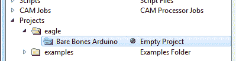](https://cdn.sparkfun.com/assets/b/d/6/e/c/51f82f5b757b7fb61cad2df8.png)

项目文件夹类似于任何常规文件系统文件夹，只是它们包含一个名为“eagle.epf”的文件。EPF 文件将您的原理图和电路板设计链接在一起，并存储您为项目专门设置的任何设置。

### 创建原理图

项目文件夹将存放我们的原理图和电路板设计文件(最终还有我们的 gerber 文件)。为了开始设计过程，我们需要设计一个原理图。

要将原理图添加到项目文件夹，右键单击文件夹，将鼠标悬停在**“新建”**上，并选择**“原理图”**。

[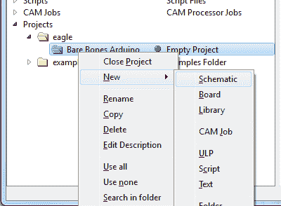](https://cdn.sparkfun.com/assets/0/3/7/6/9/51f833f8757b7f371c50b50e.png)

应该会立即弹出一个新的空白窗口。欢迎使用原理图编辑器！

## 向原理图中添加零件

原理图设计是一个两步过程。首先，您必须将所有部件添加到原理图中，然后这些部件需要连接在一起。您可以混合这些步骤——添加几个部件，连接几个部件，然后添加更多部件——但是因为我们已经有了一个[参考设计](https://cdn.sparkfun.com/assets/6/e/4/f/4/52127868757b7f30438b4567.pdf),所以我们将一次性添加所有内容。

### 使用添加工具

添加工具- (在左边的工具栏上，或者在*编辑*菜单下)-是你用来在原理图上放置每一个元件的工具。添加工具打开一个库导航器，您可以在其中展开特定的库并查看它包含的部件。在左侧选择一个零件后，右半部分的视图应更新以显示该零件及其封装的原理图符号。

[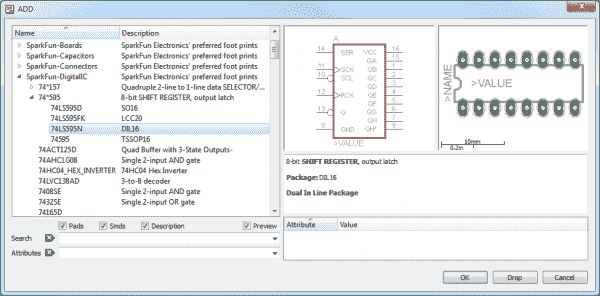](https://cdn.sparkfun.com/assets/b/2/1/b/f/5203d359757b7f8e1e389650.png)

添加工具还具有**搜索功能**——当您必须在几十个库中导航以找到一个零件时，这非常有用。搜索是非常字面的，所以不要拼错东西！您可以通过在搜索词之前和/或之后添加星号(*)，将**通配符**添加到您的搜索中。例如，如果您搜索 *atmega328* ，您应该会在 SparkFun-DigitalIC 库中找到一个单一的器件/封装组合，但如果您搜索 **atmega328** (注意前后的星号)，您会发现 IC 的两个以上版本(因为它们实际上被命名为“ATMEGA328 *P* ”)。你可能想要习惯于在你的搜索词前后加一个星号。

[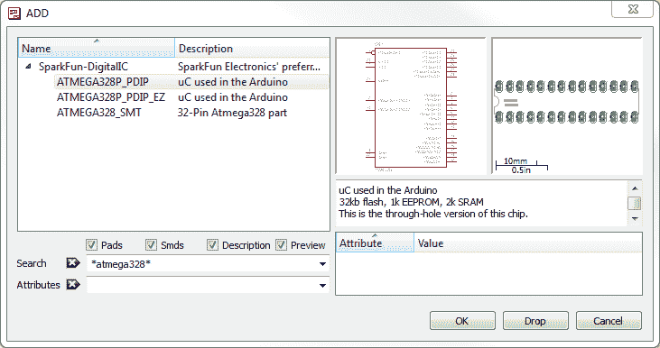](https://cdn.sparkfun.com/assets/9/3/c/f/f/5203d4b5757b7f227ced6884.png)

要从库中实际添加零件，请选择您想要的零件并单击“确定”，或者双击您的零件。

### 步骤 1:添加一个框架

框架对于最终的 PCB 布局来说并不是一个关键组件，但它可以让你的原理图看起来整洁有序。我们想要的框架应该在 spark fun-美学库中，它被命名为 **FRAME-LETTER** 。通过搜索或导航找到它，并将其添加到您的原理图中。

[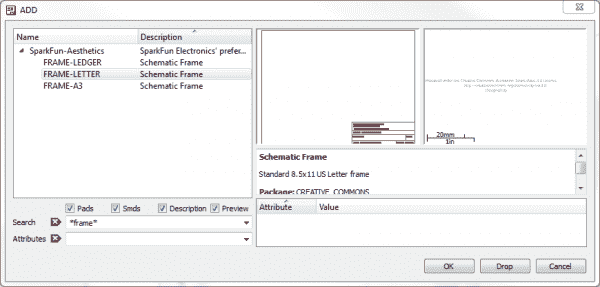](https://cdn.sparkfun.com/assets/4/9/a/3/d/52127b1e757b7f763c8b4569.png)

选择你想添加的部分后，它会“发光”并随着你的鼠标光标开始盘旋。要放置零件，左键单击(一次！).让我们放置框架，使它的左下角正好越过我们的原点(小的虚线十字，在示意图上的静态点)。

[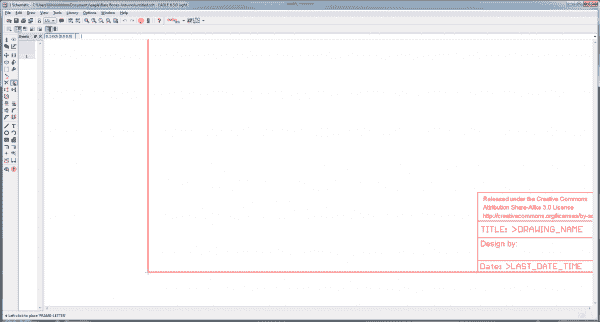](https://cdn.sparkfun.com/assets/d/8/a/b/8/5203d92d757b7fcb7a88858c.png)

放置一个部件后，添加工具将假设您想要添加另一个部件——一个新的框架将开始跟随您的光标。要退出添加模式，请按两次 escape (ESC ),或者选择不同的工具。

### 第二步:存钱(并且经常存钱)

现在你的原理图是一个无标题的临时文件，存在于你计算机的以太中。要保存，要么进入*文件>保存*，要么点击蓝色软盘图标- 。给你的原理图起一个描述性的名字。“ **BareBonesArduino.sch** 怎么样”(sch 是所有 EAGLE 原理图的文件格式)。

作为奖励，保存后，你的帧标题应该相应地更新(你可能需要在屏幕上移动，或者去*查看>重绘*)。

### 步骤 3:添加电源输入

接下来，我们将添加四个不同的器件，全部用于电源电压输入。对这些零件使用添加工具:

| 零件描述 | 图书馆 | 零件名称 | 量 |
| [5.5 毫米筒式千斤顶(PTH)](https://www.sparkfun.com/products/119) | SparkFun 连接器 | POWER_JACKPTH | one |
| [0.1 F 陶瓷电容器](https://www.sparkfun.com/products/8375) | 火花电容器 | 卡普斯 | one |
| 电压供应符号 | 火花美学 | VCC | one |
| 接地符号 | 火花美学 | GND | Two |

所有这些部分都将放在原理图框架的左上角。安排如下:

[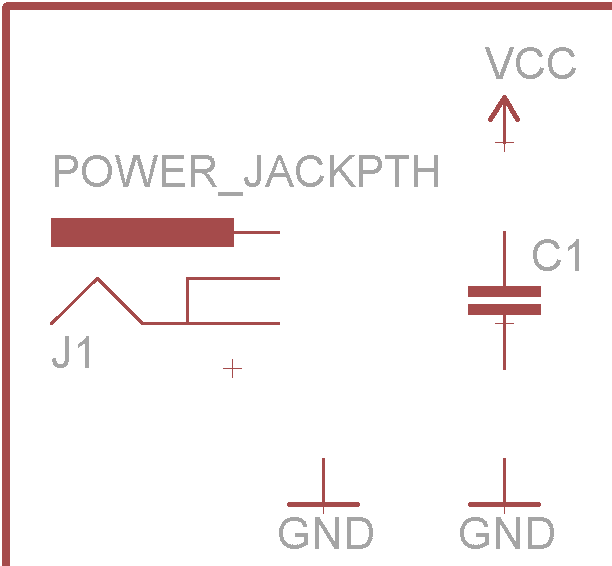](https://cdn.sparkfun.com/assets/a/6/f/7/a/5203e92e757b7fc17b3d34d1.png)

如果需要四处移动零件，使用移动工具- (左侧工具栏或*编辑*菜单下)。在零件上单击一次鼠标左键以拾取它(鼠标应该悬停在零件的红色“+”原点上)。然后在需要的地方再次左键点击。

### 步骤 4:微处理器和支持电路

接下来，我们将添加设计的主要组件 ATmega328 微处理器-以及一些支持它的组件。以下是我们将添加的部分:

| 零件描述 | 图书馆 | 准确的零件名称 | 量 |
| [ATmega328P (PTH)](https://www.sparkfun.com/products/9061) | 火花数码 | ATMEGA328P | one |
| [W 电阻](https://www.sparkfun.com/products/10969) | 火花电阻器 | 雷克斯瑞瑟 pth-1/4w | four |
| [5 毫米发光二极管](https://www.sparkfun.com/products/9881) | 火花发光的 | LED5MM | three |
| [0.1 F 陶瓷电容器](https://www.sparkfun.com/products/8375) | 火花电容器 | 卡普斯 | one |
| 电压供应符号 | 火花美学 | VCC | Two |
| 接地符号 | 火花美学 | GND | four |

要在放置零件时旋转零件，选择旋转工具栏上的四个选项之一-  -或在放置零件前右击。将您的微控制器放在框架的中央，然后像这样在它周围添加其他部件:

[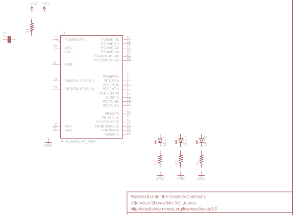](https://cdn.sparkfun.com/assets/b/4/0/c/b/5203f0ce757b7fbf2278b59a.png)

### 步骤 5:添加连接器

三个连接器将完成我们的设计。一个用于断开模拟引脚的 8 引脚连接器、一个 6 引脚串行编程接头和一个 2x3 引脚 ICSP 编程接头。以下是该步骤要添加的三个部分:

| 零件描述 | 图书馆 | 准确的零件名称 | 量 |
| 8 针 0.1 英寸接头 | SparkFun 连接器 | M081X08 | one |
| 2x3 AVR 编程标题 | SparkFun 连接器 | AVR_SPI_PRG_6PTH | one |
| 6 引脚串行编程接头 | SparkFun 连接器 | ARDUINO _ 串行 _ 编程 | one |
| 电压供应符号 | 火花美学 | VCC | Two |
| 接地符号 | 火花美学 | GND | Two |

终于！添加每个部件后，原理图应该是这样的:

[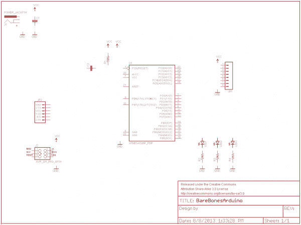](https://cdn.sparkfun.com/assets/4/9/2/a/1/5203f34c757b7f5e26864cd8.png)

接下来我们将把它们连在一起。

## 连接原理图

所有部件都已添加到原理图中，是时候将它们连接在一起了。在我们开始之前，这里有一个重要的警告:即使我们在原理图上*连接*部件，我们也不会使用连线工具将它们连接在一起。相反，我们将使用网络工具- (左侧工具栏，或在*下绘制*菜单)。WIRE 工具应该更好地命名为画线工具，NET 在连接组件方面做得更好。

### 使用网络工具

要使用“网”工具，将鼠标悬停在针的最末端(尽可能靠近，如有必要，可放大)，然后单击鼠标左键以开始连线。现在一条绿色的线应该跟随你的鼠标光标。要终止网络，左键单击另一个管脚或网络。

[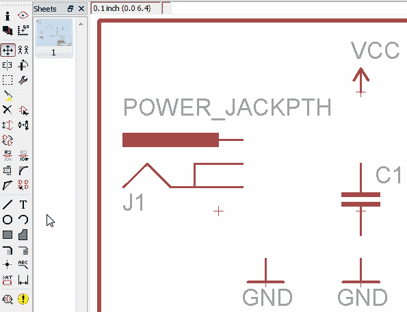](https://cdn.sparkfun.com/assets/d/1/b/d/e/5203fd3f757b7fec1e7b81a7.gif)

有时，困难的部分是识别电路符号上的哪个部分实际上是引脚。通常它们可以通过零件侧面的一条水平红线来识别。有时(并不总是)它们标有密码。当您开始或完成网络布线时，请确保您单击了引脚的最末端。

### 布置电源输入电路

从左上角开始，按如下方式布置电源输入电路:

[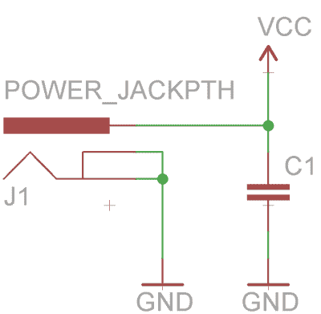](https://cdn.sparkfun.com/assets/d/a/e/6/8/5204000a757b7f8e2d3b6d30.png)

每当网络分裂成两个方向时，就会产生一个**连接节点**。这意味着所有三个相交的网络*都是*连通的。如果两个网交叉，但是没有连接点，那么这些网*没有*连接。

### 布置 ATmega328 电路

接下来，我们将 ATmega328 连接到其支持电路。有发光二极管、连接器、电阻器、电容器和 VCC/GND 符号要发送到:

[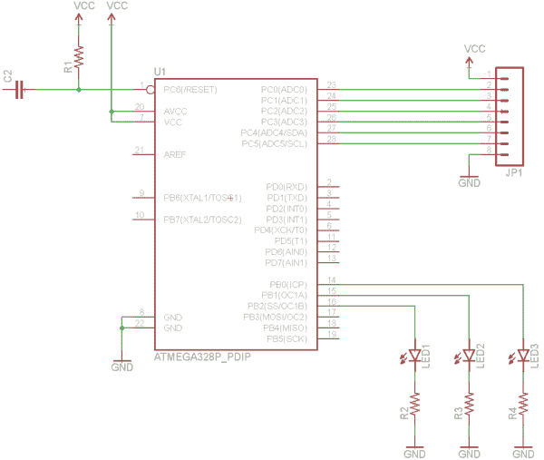](https://cdn.sparkfun.com/assets/5/1/5/5/4/52040152757b7f42164688d4.png)

不要忘记在发光二极管、电阻和 GND 符号之间添加网络！

### 制作带名称和标签的网络存根

我们必须制作的其余网络将不会那么容易干净地布线。例如，我们需要将 JP2 的 TXO pin 连接到另一端的 ATmega 的 RXD pin。你可以这样做，它会工作，但它真的很丑。相反，我们将制作网络“存根”，并给它们唯一的名称来连接它们。

首先，我们将在串行连接器的六个引脚上各添加一个短的单面网络。就像你一直在做的那样，从大头针处开始织网。通过左键单击大头针右侧的几个网格长度来终止网络。然后，不路由到另一个引脚，只需按 ESC 键完成路由。完成后，应该是这样的:

[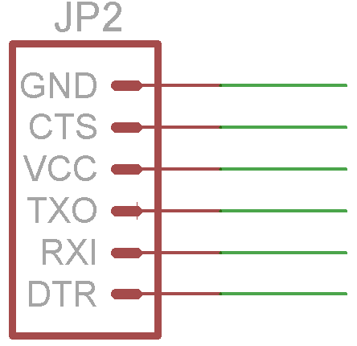](https://cdn.sparkfun.com/assets/1/0/9/b/2/520403df757b7f52261a70c9.png)

接下来，我们将使用命名工具- (左侧工具栏，或在*编辑*菜单下)-给六个网络命名。选择命名工具后，点击网络将打开一个新的对话框。首先将连接到顶部的网络命名为 GND 引脚。删除自动生成的名称(如 N$14)，并替换为“GND”(不带引号)。这将导致一个警告对话框，询问您是否要将此网络连接到所有其他名为“GND”的网络(即连接到 GND 符号的所有网络)。感谢你关注我们老鹰，但在这种情况下*是的*我们确实想把 GND 和 GND 连接起来。

命名一个网络后，你应该使用标签工具-  -添加一个文本标签。选择标签工具，左键点击你刚刚命名的网络。这应该会产生一段文字，上面写着“GND”，再次左键单击将标签放在你的网的正上方。

对剩余五个网络短截线遵循相同的操作顺序。最后，它们应该是这样的(注意，连接到 TXO 引脚的网络名为“RX”，一个“TX”网络连接到 RXI——这是故意的):

[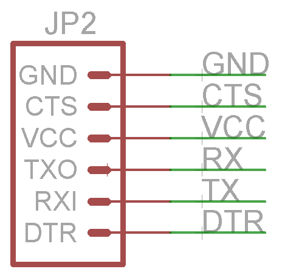](https://cdn.sparkfun.com/assets/0/f/a/7/b/52040644757b7fe37c0e7eb3.png)

VCC 应该是唯一一个警告你将连接到其他名为“VCC”(任何连接到 VCC 电压节点的网络)的网络。对于其他命名的网络，我们需要在其他地方创建相同的存根。具体在哪里？嗯，我们需要在 ATmega328 上添加一个“RX”和“TX”网络，并在附近添加一个“DTR ”:

[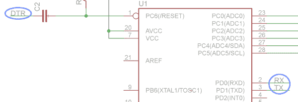](https://cdn.sparkfun.com/assets/7/0/7/8/6/520407b6757b7fbc483a5576.png)

尽管没有绿色网络连接这些引脚，但每个具有相同名称的网络实际上都是相连的。

我们需要做很多同样的工作来将 2x3 编程头连接到 ATmega328。首先，像这样连接连接器(命名/标记 MOSI、MISO、SCK 和复位):

[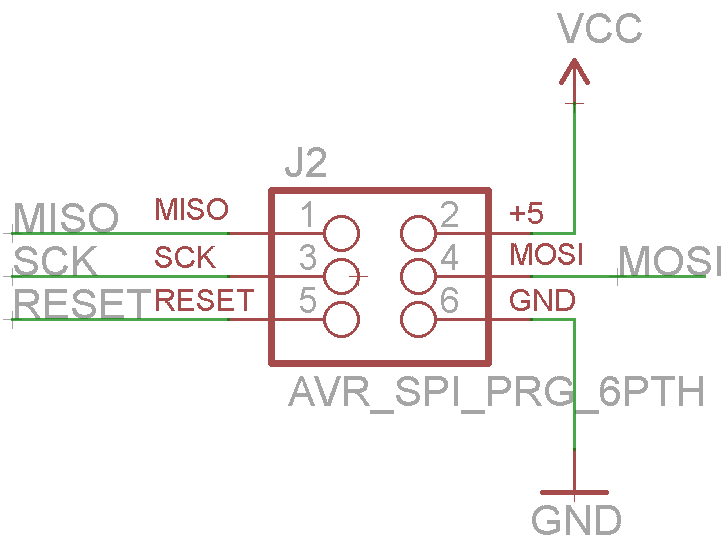](https://cdn.sparkfun.com/assets/4/f/a/3/1/5204086b757b7f191d9ae71b.png)

然后，回到 ATmega328，添加四个相同的命名/标记网络:

[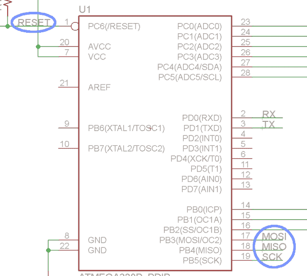](https://cdn.sparkfun.com/assets/5/8/a/c/6/520409f2757b7f4d23f5fd6f.png)

唷-你完了。兴奋起来，是时候布局 PCB 了！当你的原理图完成后，它应该看起来有点像这样:

[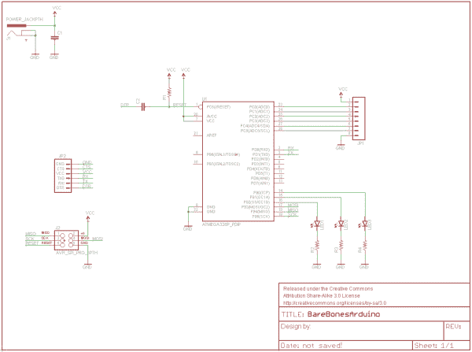](https://cdn.sparkfun.com/assets/a/c/0/a/c/52040a3b757b7f04237ab526.png)

* * *

原理图布局已经完成，但在进入本教程的 PCB 布局部分之前，我们还想分享一些技巧和诀窍。

## 提示和技巧

### 名称和值

原理图上的每个元件都应该有两个可编辑的文本字段:名称和值。**名称**是类似 *R1* 、 *R2* 、 *LED3* 等的标识符。原理图上的每个元件都应该有一个唯一的名称。您可以在任何组件上使用名称工具- 来更改名称。

零件的**值**允许您定义该零件的独特特征。例如，您可以设置电阻器的电阻或电容器的电容。零件价值的重要性取决于它是什么类型的组件。电阻、电容、电感等零件。当您生成物料清单或装配单时，该值是一条关键信息。要调整零件的值参数，使用值工具- 。

### 验证连接

SHOW tool -  -对于验证原理图中的引脚是否正确连接非常有用。如果你在网上使用 SHOW，它所连接的每一个管脚都会亮。如果您怀疑两个同名网络是连接在一起的，那么试试 SHOW 工具。例如，显示一个连接到 GND 的网络，应该会导致很多 GND 网络亮起。

[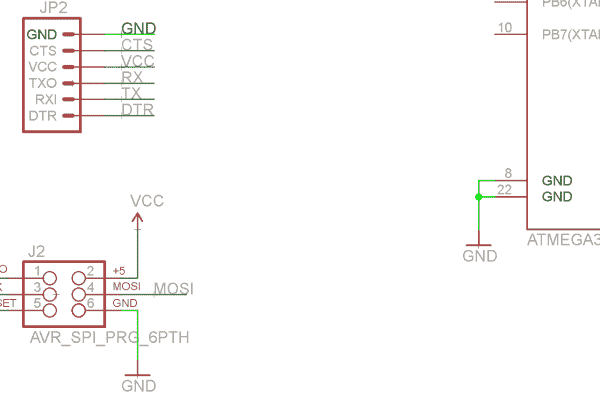](https://cdn.sparkfun.com/assets/6/c/e/6/2/52040ea7757b7f42162b3e74.png)

作为显示的替代方法，您可以暂时移动一个零件一个零件，以确保网络连接到它。使用“移动”来拾取一个部件，连接到它的网应该弯曲并调整以保持不变。只要确保你按下 ESC 键来*而不是*移动零件(或者如果你不小心移动了它就撤销)。

[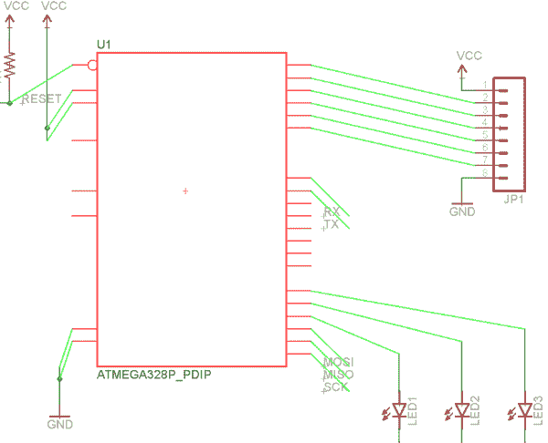](https://cdn.sparkfun.com/assets/b/b/8/3/3/5204102b757b7f1d7b39aab5.png)*If all the nets connected to a part MOVE with it, all connections are good.*

如果网不随零件移动，则它没有正确连接到引脚。仔细检查以确保您已到达引脚的最末端，而不是更远:

[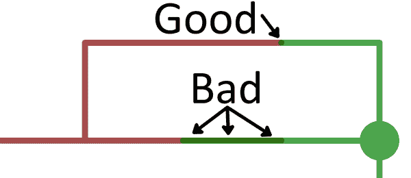](https://cdn.sparkfun.com/assets/0/1/9/8/2/5203fcf6757b7f1d4f77a9e9.png)

如果有任何网络像上面那样连接错误，删除-  -它，并尝试重新连接。

### 群组移动/删除等。

您在单个组件上使用的任何工具，也可以在一组组件上使用。对该组进行分组和执行操作是一个两步过程。首先，使用群组工具-  -选择你想要修改的部分。您可以按住鼠标左键并在它们周围拖动一个框，或者多次单击以在组周围绘制一个多边形。一旦组合完成，该组合中的每个对象都应该发光。

分组后，选择要使用的工具。左下角的状态栏会显示一些关于在组中使用该工具的有用信息:

[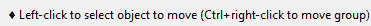](https://cdn.sparkfun.com/assets/c/5/0/9/d/5212817b757b7f35338b456a.png)

为了在一个组上执行任何动作，你必须选择工具，然后**按住 CTRL** 和**右键单击组**。按住 CTRL 键并单击鼠标右键后，该工具将对组进行操作，就像对单个组件进行操作一样。

### 复制/粘贴

EAGLE 的复制-  -和粘贴-  -工具并不完全像你以前可能遇到的其他复制/粘贴工具那样工作。使用 Copy 时，它实际上既执行复制又执行粘贴。一旦你复制了一个零件(或原理图上的任何对象-名称、文本、网络等)。)一个精确的副本将立即产生并跟随您的鼠标等待放置。如果需要添加多个相同的器件(如 GND 节点或电阻)，这很有用。

粘贴只能用于粘贴之前已经复制到剪贴板的**组**。要使用粘贴，你首先要创建一个组，然后(在选择复制工具的情况下)CTRL+右键单击来复制它，但要按 ESC 键而不是向下粘贴。这将把复制的组存储到你的操作系统的剪贴板中，你可以使用粘贴把它放到某个地方。如果需要将一个原理图文件的部分内容复制到另一个文件中，此工具尤其有用。

## 资源和更进一步

本教程是一对教程中的第一个。下一篇教程[使用 EAGLE: Board Layout](https://learn.sparkfun.com/tutorials/using-eagle-board-layout) ，将使用我们在此设计的原理图来布局一个“裸机 Arduino”PCB。如果你接下来要去那个教程，你可以点击*生成/切换到电路板*图标- 来创建一个基于这个原理图的电路板。

* * *

如果你更喜欢阅读其他与 EAGLE 相关的概念，这里有一些教程你可能想看看:

*   [如何制作 SMD PCB](https://learn.sparkfun.com/tutorials/designing-pcbs-advanced-smd)——这是一个更高级、更快节奏的 EAGLE 教程。在这一部分中，我们重点讨论更复杂的表面贴装(SMD)设计。
*   [如何创建 SMD 封装](https://learn.sparkfun.com/tutorials/designing-pcbs-smd-footprints) -如果您想在库中创建独特的零件，请查看本教程。
*   [在 EAGLE](https://learn.sparkfun.com/tutorials/making-custom-footprints-in-eagle) 中制作定制脚印——另一个脚印制作教程。这张幻灯片详细介绍了定制 1:1 示意图的独特流程。

如果你想与世界分享你的 PCB 作品，看看这些教程:

*   [使用 GitHub](https://learn.sparkfun.com/tutorials/using-github)
*   [使用 GitHub 与 SparkFun 分享](https://learn.sparkfun.com/tutorials/using-github-to-share-with-sparkfun)

## 有兴趣学习更多基础主题吗？

查看我们的 **[工程要点](https://www.sparkfun.com/engineering_essentials)** 页面，了解电气工程相关基础主题的完整列表。

带我去那里！

