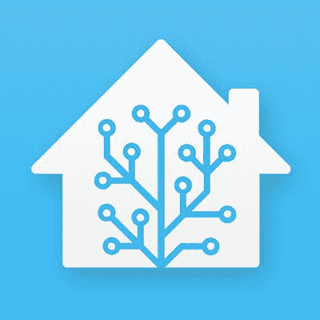

# 使用家庭助手扩展您的家庭自动化

> 原文：<https://learn.sparkfun.com/tutorials/using-home-assistant-to-expand-your-home-automations>

## 介绍

在本教程中，你将学习开始使用[家庭助手](https://www.home-assistant.io/)控制你的家庭所需的一切，这是一个开源的家庭自动化中心，将本地控制和隐私放在第一位，运行一个[树莓派](https://www.sparkfun.com/products/14643)。在本教程中，我们将介绍如何设置家庭助手，无论您是自己创建设备还是购买现成的物联网设备，都可以让它们和谐地一起工作。

虽然本指南将带您完成家庭助手的设置，但这不是一个关于如何充分利用家庭助手的教程(但快速谷歌搜索家庭助手教程将为您提供无尽的链接)。

*Image courtesy of home-assistant.io*

### 所需材料

为了跟随本教程中的示例，您将需要以下硬件。你可能不需要所有的东西，这取决于你拥有什么。将它添加到您的购物车，通读指南，并根据需要调整购物车。