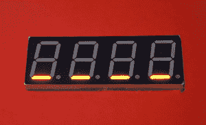

# 使用开放段

> 原文：<https://learn.sparkfun.com/tutorials/using-opensegment>

## 基础

[](https://cdn.sparkfun.com/assets/d/5/5/2/9/514de190ce395fbd39000000.png)

[OpenSegment](https://www.sparkfun.com/products/11644) 是一款简单易用的 7 段显示器。它能够通过串行、I ² C、SPI 以及模拟和计数器模式进行通信。如果你只需要显示一个数字，但有很多功能，包括设置亮度级别和内置的单个分段控制，它非常容易使用。

[](https://cdn.sparkfun.com/assets/1/a/6/3/b/514dd074ce395f8561000002.JPG)*OpenSegment displaying the number of speed bag hits.*

开场片段是吉姆·林德布洛姆的系列片段的老大哥。两款产品使用相同的固件，但硬件布局不同。因此，对于 Serial7Segment，你可以非常依赖吉姆的[数据表](https://github.com/sparkfun/Serial7SegmentDisplay/wiki/Serial-7-Segment-Display-Datasheet)和位于此处的所有示例代码[。](https://github.com/sparkfun/Serial7SegmentDisplay/tree/master/firmware/Serial%207-Segment%20Display/Arduino_Examples)

### 推荐阅读

在使用这些主板之前，您可能需要了解以下事项:

*   [串行通信](https://learn.sparkfun.com/tutorials/serial-communication)
*   [JST 连接器](https://learn.sparkfun.com/tutorials/connector-basics/power-connectors)
*   [剥线](https://learn.sparkfun.com/tutorials/working-with-wire/how-to-strip-a-wire)
*   [焊接](https://learn.sparkfun.com/tutorials/how-to-solder-through-hole-soldering)

## 硬件信息

[](https://cdn.sparkfun.com/assets/a/6/5/9/8/514dd1ddce395f0a61000000.JPG)*SparkFun boxes make great enclosures!*

OpenSegment 可以从 4V(亮度较低)到 12V 供电，但我们建议 5 到 6V。默认的串行通信速率为 9600bps。

**注意:**通过将 RX 引脚连接到 GND 并给器件上电，器件可以随时复位到出厂默认值(9600bps)。更多信息参见[工厂重置](https://learn.sparkfun.com/tutorials/using-opensegment/factory-reset)章节。

[](https://cdn.sparkfun.com/assets/2/e/a/b/e/514dd243ce395f3761000003.png)

板载调节器将调节至 5V。调节器将防止短路、反向功率、过电流和过热。给电路板供电超过 7V 是可以的，但是调节器将开始通过加热来消耗额外的功率，并且根据亮度设置和输入电压，可能会导致电路板闪烁。

OpenSegment 有一个 ATmega328，运行一个经过修改的 Optiboot 引导加载程序。基本上就是一个 8MHz 运行的小 Arduino。您可以使用标准串行连接对电路板进行重新编程。我们总是有一个 [FTDI basic](https://www.sparkfun.com/products/9716) 方便进行代码修改，但是你不应该重新编程显示，除非你*真的*想调整代码。

## 串行通信

[](https://cdn.sparkfun.com/assets/b/6/8/b/a/514dd29ece395f2061000000.png)*The serial connection pins*

控制 OpenSegment 最简单的方法是通过串行。你只需要 3 个引脚:PWR，GND 和 RX。OpenSegment 上的 RX 引脚应连接到微控制器的 TX 引脚。

[](https://cdn.sparkfun.com/assets/4/7/e/d/0/514dd29fce395f6961000001.png)*The basic 3 pins, ready for a JST connector*

物理连接到 OpenSegment 的最简单方法是通过一个 [3 针 JST 连接器](https://www.sparkfun.com/products/9915)。

[](https://cdn.sparkfun.com/assets/6/7/8/5/c/514dd29fce395f2261000000.JPG)*[3-pin JST connector](https://www.sparkfun.com/products/9915) soldered in and ready to go!*

将 JST 焊接到背包上，插入 JST 电缆，然后将红线插入 5V 至 7V，黑线插入 GND，黄线插入开发板的 TX 引脚。

## 系列示例

[](https://cdn.sparkfun.com/assets/3/b/5/7/e/514dd380ce395f1061000002.png)*Connect 3 wires to your Arduino*

通过 Arduino 使用 OpenSegment 显示器非常简单。从 GND 的 5V 引脚为显示器供电，并将显示器的 RX 引脚连接到 Arduino 上的引脚 8。

这里有一个例子可以让你立即开始。

**注意:**此示例假设您在桌面上使用的是最新版本的 Arduino IDE。如果这是你第一次使用 Arduino，请回顾我们关于[安装 Arduino IDE 的教程。](https://learn.sparkfun.com/tutorials/installing-arduino-ide)

If you have not previously installed an Arduino library, please check out our [installation guide.](https://learn.sparkfun.com/tutorials/installing-an-arduino-library)

```
language:c
/*
 9-23-2012
 Spark Fun Electronics
 Nathan Seidle

 This code is public domain but you buy me a beer if you use this and we meet someday (Beerware license).

 Serial7Segment is an open source seven segment display. 

 This is example code that shows how to display basic numbers on the display.

 Note: This code expects the display to be listening at 9600bps. If your display is not at 9600bps, you can
 do a software or hardware reset. See the Wiki for more info: 
 http://github.com/sparkfun/Serial7SegmentDisplay/wiki/Special-Commands#wiki-baud

 To get this code to work, attached an Serial7Segment to an Arduino Uno using the following pins:
 Pin 8 on Uno (software serial TX) to RX on Serial7Segment
 VIN to PWR
 GND to GND

*/

#include <SoftwareSerial.h>

SoftwareSerial Serial7Segment(7, 8); //RX pin, TX pin

int cycles = 0;

void setup() {

  Serial.begin(9600);
  Serial.println("OpenSegment Example Code");

  Serial7Segment.begin(9600); //Talk to the Serial7Segment at 9600 bps
  Serial7Segment.write('v'); //Reset the display - this forces the cursor to return to the beginning of the display
}

void loop() 
{
  cycles++; //Counting cycles! Yay!
  Serial.print("Cycle: ");
  Serial.println(cycles);

  char tempString[10]; //Used for sprintf
  sprintf(tempString, "%4d", cycles); //Convert deciSecond into a string that is right adjusted
  //sprintf(tempString, "%d", cycles); //Convert deciSecond into a string that is left adjusted (requires digit 1 command)
  //sprintf(tempString, "%04d", cycles); //Convert deciSecond into a string with leading zeros
  //sprintf(tempString, "%4X", cycles); //Count in HEX, right adjusted
  //int negativeCycles = cycles * -1;
  //sprintf(tempString, "%4d", negativeCycles); //Shows a negative sign infront of right adjusted number

  //Note: This method works well as long as your number is less than or equal to 4 digits.
  //14422 will cause the display to wrap (5 digits)
  //-5766 will cause the display to wrap (5 digits)
  //To fix this, send a 'v' character or look at how to control the digit placement
  //https://github.com/sparkfun/Serial7SegmentDisplay/wiki/Basic-Usage#wiki-cursor

  Serial7Segment.print(tempString); //Send serial string out the soft serial port to the S7S

  delay(10);
} 
```

将上面的示例代码加载到您的 Arduino 上，并观察显示计数！

你可以在 GitHub 的这里找到更多的例子。有草图给你看:

*   基本计数
*   控制显示器上的冒号和圆点
*   改变模式
*   有趣的捕食者模式
*   更改波特率
*   执行软件串行复位

## I2C/SPI 通信

如果您需要同时控制大量显示器，OpenSegment 可以通过 I ² C 和 SPI 进行通信。

### I ² C 通信

[](https://cdn.sparkfun.com/assets/8/d/4/7/8/514dd886ce395f2b3a000000.png)*I²C communication requires 4 pins: SDA, SCL, PWR, and GND.*[](https://cdn.sparkfun.com/assets/2/5/f/e/8/514dd886ce395faf3a000000.png)

I ² C 引脚贴在背包边缘和侧面，便于将多个显示器连接在一起。

默认的 7 位 I ² C 地址是十进制的 113 或十六进制的`0x71`或二进制的`01110001`。

**Heads up!** 0x71 is the 7-bit I2C address. If you are using a different language than Arduino you will probably need to add the Read/Write bit to the end of the address. This means the default read address for the OpenSegment is 0b.1110.0011 or 0xE3 and the write address is 0b.1110.0010 or 0xE2\. For more information see our [tutorial on I²C](https://learn.sparkfun.com/tutorials/i2c)

OpenSegment 支持标准的 100kHz 和快速的 400kHz I2C 速度。使用以下代码在 Arduino 中启用快速 I2C:

```
Wire.begin(); //Join the bus as controller. 
//By default .begin() will set I2C SCL to Standard Speed mode of 100kHz
Wire.setClock(400000); //Optional - set I2C SCL to High Speed Mode of 400kHz 
```

查看 GitHub 上的 [I ² C 示例](https://github.com/sparkfun/Serial7SegmentDisplay/blob/master/firmware/Serial%207-Segment%20Display/Arduino_Examples/S7S_Example_I2C_Basic/S7S_Example_I2C_Basic.ino)以获得好的代码。

你可以在 GitHub 的这里找到更多 I ² C 的例子。有草图给你看:

*   [基本计数](https://github.com/sparkfun/Serial7SegmentDisplay/tree/master/firmware/Serial%207-Segment%20Display/Arduino_Examples/S7S_Example_I2C_Basic)
*   [更改 I ² C 地址](https://github.com/sparkfun/Serial7SegmentDisplay/tree/master/firmware/Serial%207-Segment%20Display/Arduino_Examples/S7S_Example_I2C_ChangeAddress)
*   [改变亮度和其他设置](https://github.com/sparkfun/Serial7SegmentDisplay/tree/master/firmware/Serial%207-Segment%20Display/Arduino_Examples/S7S_Example_I2C_Settings)

### SPI 通信

[](https://cdn.sparkfun.com/assets/b/6/a/d/d/514dd9d0ce395feb3a000000.png)*Bank of SPI pins*

SPI 通信需要 6 个引脚:SDO、SDI、SCK、CS、PWR 和 GND。我们将来可能会添加一个功能，但目前 OpenSegment 不会将数据传递出 SDO(串行数据输出)引脚，并且可以保持断开状态。如果在同一 SPI 总线上将多个 OpenSegments 连接在一起，每个显示器上的 CS 引脚必须连接到微控制器上的不同 GPIO。

你可以在 GitHub 的这里找到更多 SPI 的例子。有草图给你看:

*   [基本计数](https://github.com/sparkfun/Serial7SegmentDisplay/tree/master/firmware/Serial%207-Segment%20Display/Arduino_Examples/S7S_Example_SPI_Basic)
*   [改变亮度和其他设置](https://github.com/sparkfun/Serial7SegmentDisplay/tree/master/firmware/Serial%207-Segment%20Display/Arduino_Examples/S7S_Example_SPI_Settings)

## 计数器/模拟模式

OpenSegment 有三种模式:

*   **数据模式**(通过串行/SPI/I ² C 发送命令和数据)
*   **计数器模式**(基于 SDI/SDO 递增/递减计数)
*   **模拟仪表模式**(在 A6/A7 上显示模拟电压)

我们已经介绍了基本的数据模式；让我们来看看另外两种模式。

要控制显示模式，通过串行发送命令`0x82`，然后是:

*   0 表示数据模式
*   1 用于模拟仪表模式
*   2 用于计数器模式

这里的提供了一个如何通过串行实现这一点的示例[。](https://github.com/sparkfun/Serial7SegmentDisplay/blob/master/firmware/Serial%207-Segment%20Display/Arduino_Examples/S7S_Example_Serial_Mode_Change/S7S_Example_Serial_Mode_Change.ino)

你不需要焊接跳线来控制模式。请阅读下面的焊接跳线部分了解更多信息。

### 计数器模式

[](https://cdn.sparkfun.com/assets/5/9/0/1/0/514ddc3ece395f123a000002.png)*The counter jumper and the two pins that control the count.*

当显示器处于*计数器*模式时，SDI 引脚( **i** 每增加一次，显示器就增加一个！)被拉低，并且每次 SDO 引脚被拉低时减 1。创建该模式是为了监控和计算按下[按钮](https://www.sparkfun.com/products/9336)或[簧片开关](https://www.sparkfun.com/products/8642)闭合的次数。显示器必须重启以重置计数。

### 模拟仪表模式

[](https://cdn.sparkfun.com/assets/d/5/3/2/0/514ddc3fce395ff43a000000.png)

当显示器处于*模拟*模式时，引脚 A7 和 A6 上的瞬时模拟电压将以 1/10 伏的分辨率(0.0V 至 5.0V)显示在显示器上。

A6 上的电压显示在左侧，A7 显示在右侧。这种模式是为了在不需要万用表的情况下监控基本电压(0 至 5V)而创建的。

### 焊料跳线

[](https://cdn.sparkfun.com/assets/b/d/f/c/e/514dde24ce395fd13a000000.png)

您可以将 OpenSegment 用作计数器和模拟仪表，无需任何软件配置。通过关闭显示器背面的焊接跳线，OpenSegment 将进入两种模式之一:计数器或模拟仪表模式。

关闭焊接跳线将覆盖任何软件设置，并在通电后强制显示器进入该模式。如果*两个*跳线都关闭，显示器将以计数器模式启动。

## 工厂重置

你忘了设备的波特率是多少了吗？放心吧！将 RX 引脚连接到 GND，然后给器件上电，可以将器件复位到出厂默认设置。

[](https://cdn.sparkfun.com/assets/1/7/d/6/a/514ddea6ce395fa63a000000.JPG) [](https://cdn.sparkfun.com/assets/7/0/e/c/f/514ddea5ce395f133a000000.JPG)

通电后，您将看到交替出现的-(破折号)和 _(下划线)持续 1 秒钟。

[](https://cdn.sparkfun.com/assets/4/c/f/3/7/514ddea6ce395fa93a000000.JPG) [](https://cdn.sparkfun.com/assets/2/1/7/6/0/514ddea6ce395fc739000000.JPG)

一旦你看到旋转显示的 *0-00* ，你就会知道设备已经被重置为 9600bps。现在，您可以从地释放 RX 引脚，显示器将继续正常工作。

还有一个示例草图向您展示如何对序列进行[复位。如果显示器安装在应用程序中，并且上电时不能拉低 RX 线，这将非常方便。](https://github.com/sparkfun/Serial7SegmentDisplay/blob/master/firmware/Serial%207-Segment%20Display/Arduino_Examples/S7S_Example_Serial_SoftwareReset/S7S_Example_Serial_SoftwareReset.ino)

## 资源和更进一步

现在，您应该能够使用串行和其他一些方法来控制 OpenSegment 了。请务必查看[示例代码](https://github.com/sparkfun/Serial7SegmentDisplay/tree/master/firmware/Serial%207-Segment%20Display/Arduino_Examples)和[数据表](https://github.com/sparkfun/Serial7SegmentDisplay/wiki/Serial-7-Segment-Display-Datasheet)了解更多信息。

既然您已经了解了 OpenSegment 板，您应该考虑阅读以下内容:

*   [SPI 通信](https://learn.sparkfun.com/tutorials/serial-peripheral-interface-spi)
*   [按钮](https://learn.sparkfun.com/tutorials/button-and-switch-basics)
*   [上拉电阻](https://learn.sparkfun.com/tutorials/pull-up-resistors)
*   了解如何使用 GitHub ,并通过请求和添加新功能来帮助我们改进 OpenSegment！
*   建立你自己的[反应计时器](https://learn.sparkfun.com/tutorials/reaction-timer)，完成 OpenSegment 显示。