# 使用 PSoC 6 先锋板和先锋物联网附加防护板

> 原文：<https://learn.sparkfun.com/tutorials/using-the-psoc-6-pioneer-board-with-the-pioneer-iot-add-on-shield>

## 介绍

PSoC 6 是 Cypress 强大的 PSoC 系列处理器的最新成员。PSoC 6 Pioneer IoT 附加盾是与该处理器系列相关的开发工具，具有板载调试器、Arduino 兼容头、CapSense 小部件等，所有这些都与 PSoC 6 处理器相关联。该处理器是一款双核设备，一个 Cortex-M0+低功耗处理器和一个 Cortex-M4 高功耗处理器通过共享外设和内存空间连接在一起。

[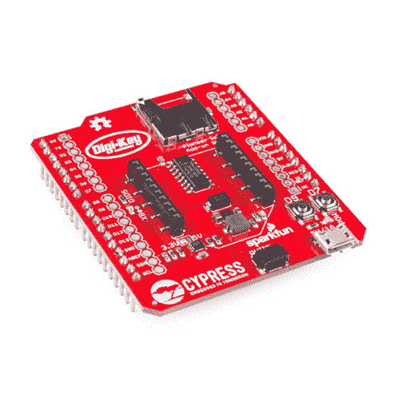](https://www.sparkfun.com/products/retired/14531) 

### [先锋物联网附加盾](https://www.sparkfun.com/products/retired/14531)

[Retired](https://learn.sparkfun.com/static/bubbles/ "Retired") DEV-14531

先锋物联网附加盾是一种独特的主板，旨在为 Cypress 的 PSoC 6 添加更多功能，同时保持…

1 **Retired**[Favorited Favorite](# "Add to favorites") 2[Wish List](# "Add to wish list")

[https://www.youtube.com/embed/ht2Vx1X0iDo/?autohide=1&border=0&wmode=opaque&enablejsapi=1](https://www.youtube.com/embed/ht2Vx1X0iDo/?autohide=1&border=0&wmode=opaque&enablejsapi=1)

本教程将向您展示如何启动和运行 Pioneer 板，使用 Pioneer Add-on Shield 扩展 PSoC 6 设备的功能。我们将向您展示如何通过 BLE 和 WiFi(使用 XBee WiFi 模块)与 Raspberry Pi 通信，以及如何通过 BLE 在 PSoC 4 BLE 先锋板和 PSoC 6 先锋板之间通信。

### 推荐阅读

在开始学习之前，阅读一些教程可能会有所帮助。

[](https://learn.sparkfun.com/tutorials/raspberry-gpio) [### 树莓 gPIo](https://learn.sparkfun.com/tutorials/raspberry-gpio) How to use either Python or C++ to drive the I/O lines on a Raspberry Pi.[Favorited Favorite](# "Add to favorites") 17[](https://learn.sparkfun.com/tutorials/using-flask-to-send-data-to-a-raspberry-pi) [### 使用 Flask 向 Raspberry Pi 发送数据](https://learn.sparkfun.com/tutorials/using-flask-to-send-data-to-a-raspberry-pi) In this tutorial, we'll show you how to use the Flask framework for Python to send data from ESP8266 WiFi nodes to a Raspberry Pi over an internal WiFi network.[Favorited Favorite](# "Add to favorites") 7

### 所需材料

本教程中的示例旨在与 PSoC 6 先锋工具包一起使用。本教程中的示例旨在与 PSoC 6 先锋套件一起使用，该套件可以直接从 Cypress 购买[。](http://www.cypress.com/documentation/development-kitsboards/psoc-6-ble-pioneer-kit)

显然，你还需要一个[先锋附加盾](https://www.sparkfun.com/products/14531)。你还需要一个 XBee WiFi 模块。根据您的设置，有几个 XBee WiFi 选项: [Trace](https://www.sparkfun.com/products/12568) ， [RP-SMA 连接器](https://www.sparkfun.com/products/12569) w/外部 2.4GHz 天线，或 [Wire](https://www.sparkfun.com/products/12571) 。最简单的方法是让 XBee 配备有线天线。

[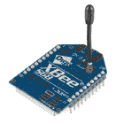](https://www.sparkfun.com/products/retired/12571) 

### [XBee WiFi 模块-有线天线](https://www.sparkfun.com/products/retired/12571)

[Retired](https://learn.sparkfun.com/static/bubbles/ "Retired") WRL-12571

这是来自 Digi 的带有线天线的 XBee WiFi 模块。XBee WiFi 嵌入式 RF 模块提供简单的 IEEE 802.11 串行…

**Retired**[Favorited Favorite](# "Add to favorites") 12[Wish List](# "Add to wish list")[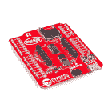](https://www.sparkfun.com/products/retired/14531) 

### [先锋物联网附加盾](https://www.sparkfun.com/products/retired/14531)

[Retired](https://learn.sparkfun.com/static/bubbles/ "Retired") DEV-14531

先锋物联网附加盾是一种独特的主板，旨在为 Cypress 的 PSoC 6 添加更多功能，同时保持…

1 **Retired**[Favorited Favorite](# "Add to favorites") 2[Wish List](# "Add to wish list")

你还需要[树莓 Pi 3 入门套件](https://www.sparkfun.com/products/13826)。这将成为您从 PSoC6 先锋板进行沟通的目标。当然，您可以单独购买 Pi 3 以及试验板、跳线、电阻和 led，但我们认为初学者工具包是一个特殊的交易，非常值得购买。

[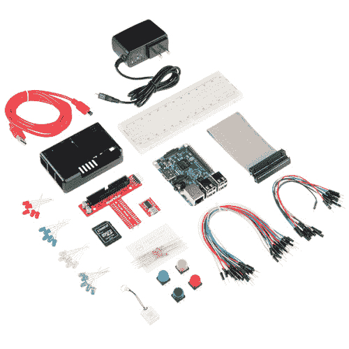](https://www.sparkfun.com/products/retired/13826) 

### [树莓 Pi 3 入门套装](https://www.sparkfun.com/products/retired/13826)

[Retired](https://learn.sparkfun.com/static/bubbles/ "Retired") KIT-13826

最近有很多关于树莓派的信息。不管是 Pi A，A+，B，B+，还是 Pi 2 B，任何论坛都会有…

41 **Retired**[Favorited Favorite](# "Add to favorites") 58[Wish List](# "Add to wish list")

## 硬件概述

让我们详细了解一下 Pioneer Kit 物联网附加板的功能。

**MicroSD 卡插槽** -该插槽的引脚映射到大多数 Arduino 兼容板上的 SPI 外设，包括 PSoC 6 BLE 先锋板。

[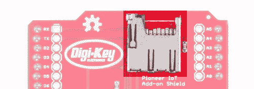](https://cdn.sparkfun.com/assets/learn_tutorials/7/0/9/sd_card.png)

**XBee 割台** -该割台被隔开以接受标准 XBee 足迹。它兼容所有官方 XBee 模块。

[](https://cdn.sparkfun.com/assets/learn_tutorials/7/0/9/xbee_header.png)

Qwiic 连接器 -该连接器增加了对 SparkFun 所有 Qwiic 模块的支持。它提供 3.3V 电源。

[](https://cdn.sparkfun.com/assets/learn_tutorials/7/0/9/qwiic_connector.png)

**MicroB USB 电源连接器** -该连接器上的数据线不连接任何东西。它为 XBee 模块的 3.3V 调节器提供 5V 电压，覆盖来自 Arduino 接头的 5V 电压，允许高功率 XBee 模块(如蜂窝、wifi 或 Pro 型号)正常工作。

[](https://cdn.sparkfun.com/assets/learn_tutorials/7/0/9/microb_connector.png)

**D7 和 D9 按钮** -两个用户按钮连接到引脚 D7 和 PSoC 6 上的 P0.2 和 P13.1，或 PSoC 4 BLE 上的 P1.0 和 P0.4)。

[](https://cdn.sparkfun.com/assets/learn_tutorials/7/0/9/buttons.png)

**3.3V 调节器** -开关模式 3.3V 功率调节器，能够提供高达 1.5A 的电流，具体取决于上游电源供应能力。从 Arduino 引脚或 MicroB 电源连接器上的 5V 电源供电。仅向 XBee 收割台供电。

[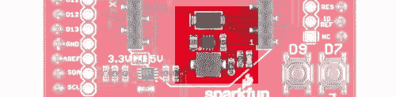](https://cdn.sparkfun.com/assets/learn_tutorials/7/0/9/vreg.png)

**电平转换缓冲器** -将 5V 信号向下转换为 3.3V 信号。允许电路板用于 3.3V 或 5V 系统。

[](https://cdn.sparkfun.com/assets/learn_tutorials/7/0/9/level_shift.png)

**I2C 电平转换电路** -如有必要，将 I2C 信号从 3.3V 转换为 5V。

[](https://cdn.sparkfun.com/assets/learn_tutorials/7/0/9/i2c_level_shift.png)

**电源电压选择跳线** -选择 I2C 电平转换电路转换的电平。默认设置为 **3.3V** 。设置为 5V，用于 5V 系统。PSoC 4 和 PSoC 6 先锋 BLE 板都是 **3.3V** 系统。

[](https://cdn.sparkfun.com/assets/learn_tutorials/7/0/9/level_set_jumper.png)

**XBee DIO5 LED** - DIO5 默认了一些有用的功能，尤其是在 WiFi 模块上，它显示了与配置的 WiFi 网络的连接。

[](https://cdn.sparkfun.com/assets/learn_tutorials/7/0/9/xbee_dio5_led.png)

## 示例:使用 PSoC 6 先锋套件从 WiFi 到 Raspberry Pi

这个例子演示了如何通过 WiFi 向 Raspberry Pi 发送信号。它将向您展示如何访问 XBee WiFi 模块、PSoC 6 的两个内核之间的进程间通信，以及如何使用 Raspberry Pi 接收和解析命令。

遵循这个例子将需要一些设置，所以现在让我们走一遍。

### PSoC 6 先锋套件设置:硬件

先锋套件侧的设置很简单:将 XBee WiFi 模块插入先锋物联网附加屏蔽，并将屏蔽插入先锋套件板的 Arduino 接头。

树莓派这边需要更多的解释。你需要在 Raspberry Pi 上安装一些硬件和软件。

### PSoC 6 先锋套件设置:软件

**Note:** PSoC 6 support is only available in Creator 4.2 or later!

Pioneer Kit 的软件项目可以在 GitHub 上获得。

[PSoc 6 Pioneer Kit Software Download](https://github.com/sparkfun/Pioneer_Kit_Shield/archive/master.zip)

下载并解压文件后，您可以在 PSoC Creator 中打开示例(XBee_WiFi_Example)。

在您做任何事情之前，您需要打开" *main_cm4.c* "文件并做一些修改。您会发现一段如下所示的代码:

```
language:c
char ssid[] = "your_ssid_here";
char rpi_ip[] = "raspi_ip_here";
char ssid_pw[] = "wifi_pw_here";
int dest_port = 5000;
char encrypt_mode = WPA2; 
```

希望您需要做的事情很明显:更改这些设置以匹配您的网络设置。`encrypt_mode`值可以是`WPA`、`WEP`、`WPA2`，或者(希望不是！)`NO_SECURITY`。`rpi_ip`是一个虚线四边形(例如，“10.8.253.193”)，您可以通过在您的 Raspberry Pi 上的命令窗口中键入“ **ifconfig** ”(有关打开命令窗口的说明，请参见下文)并查看“ **wlan0** ”部分来获得。

要对电路板进行编程，请通过随附的 USB-A 至 USB-C 电缆将其连接到您的 PC。然后，单击工具栏中的“Program”按钮(如下所示)，自动构建项目并对电路板进行编程。

[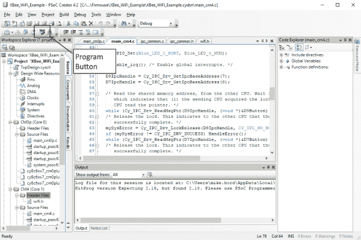](https://cdn.sparkfun.com/assets/learn_tutorials/7/0/9/program_button.png)

您可能会看到如下窗口，要求您选择一个目标进行编程。在“KitProg2”列表项下选择哪个条目并不重要，任何一个都可以正确地对闪存进行编程。

[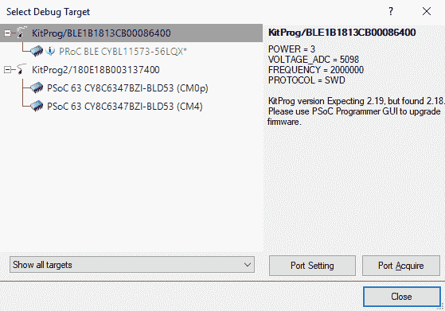](https://cdn.sparkfun.com/assets/learn_tutorials/7/0/9/select_debug_target.png)

### Raspberry Pi 设置:硬件

首先，让我们看看硬件是如何连接的:

[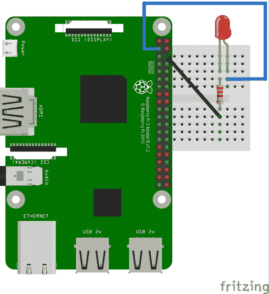](https://cdn.sparkfun.com/assets/learn_tutorials/7/0/9/pi_led.png)

如您所见，我们将一个 LED(330 欧姆电阻)连接到 Raspberry Pi 的引脚 3 (GPIO 2)和引脚 6(地)。这将允许我们切换 GPIO2 并在 LED 上看到结果。

### Raspberry Pi 设置:软件

我们将假设您安装了一个 Raspberry Pi，运行的是最新版本的 Raspbian(完整版，不是精简版)，并且它连接到键盘、鼠标、显示器和本地 WiFi 网络。如果是**而不是**这种情况，请花一些时间进行设置。[你可以在这里查看我们关于设置 Pi 的教程](https://learn.sparkfun.com/tutorials/raspberry-pi-3-starter-kit-hookup-guide)。

先从树莓派的桌面说起吧。您应该有一个类似这样的屏幕:

[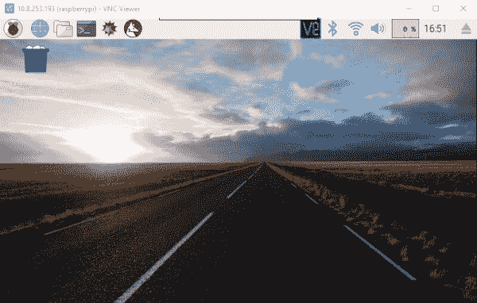](https://cdn.sparkfun.com/assets/learn_tutorials/7/0/9/pi_desktop.png)

你需要点击屏幕顶部的小图标(如下所示)来打开命令行。本教程的其余部分将假设您已经打开了命令行。

[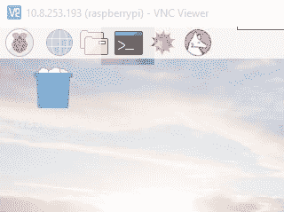](https://cdn.sparkfun.com/assets/learn_tutorials/7/0/9/command_prompt_1.png)

这将打开一个命令行窗口。这允许你告诉 Raspberry Pi 直接执行命令。

[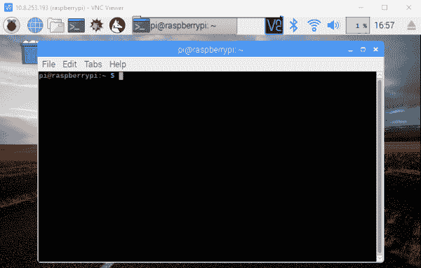](https://cdn.sparkfun.com/assets/learn_tutorials/7/0/9/command_prompt_window.png)

我们将从执行安装 Flask 的命令开始。Flask 是一个 Python 的 web 框架，它允许你创建一个 web 前端，在服务器后端运行 Python 脚本。键入以下命令，然后按“Enter”键。

```
sudo pip install flask 
```

命令行窗口会出现一大堆东西，最后，Flask 会安装到你的 Raspberry Pi 上。

下一步是从 GitHub 安装我们编写的软件来支持这个项目。这样做的命令是

```
git clone https://github.com/sparkfun/Flask_Tutorial 
```

同样，您将看到一些文本在命令行上滚动，当提示符返回时，这将表明安装过程已经完成。完成后，输入以下命令:

```
sudo python Flask_Tutorial/Python/app.py 
```

这将启动应用程序，并开始监听来自先锋板的 TCP/IP 输入。您现在应该能够通过按下物联网盾上的 D7 和 D9 按钮来打开和关闭连接到 Raspberry Pi 的 LED。整洁！

### 这是怎么回事？角。1:先锋套件

让我们从 PSoC 6 软件项目的高级视图开始，看看到底发生了什么。查看屏幕左侧的工作区浏览器框架。我们将浏览这个框架，突出重要的文件以及它们与整个项目的关系。

[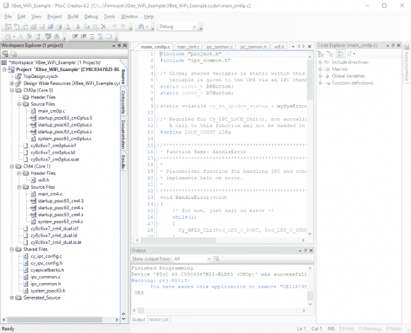](https://cdn.sparkfun.com/assets/learn_tutorials/7/0/9/workspace_explorer.png)*Having a hard time seeing the Workspace Explorer? Click the image for a closer look.*

项目的顶层有六个条目:原理图(" *TopDesign.sch* ")、设计范围资源(" *XBee_WiFi_Example.cydwr* ")、与 Cortex-M0+内核相关的源文件(" *CM0p (Core 0)* ")、与 Cortex-M4 内核相关的源文件(" *CM4 (Core 1)* ")、要在两者之间共享的文件("*共享文件*")以及由生成的支持文件

这个项目的原理图非常简单，有几个 led、几个开关和用于与 XBee WiFi 模块来回传输数据的 UART。led 实际上在项目的当前实施中未被使用。

[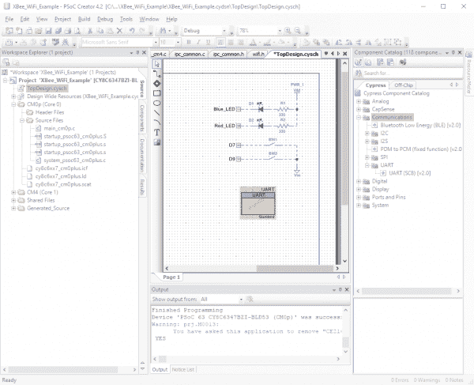](https://cdn.sparkfun.com/assets/learn_tutorials/7/0/9/schematic.png)

我们将跳过**的内容。cydwr** 文件。该文件包含原理图中所用信号的引脚分配、时钟生成和内核配置常数。如果你想更深入地研究它，请随意挖掘一点。大部分应该是不言自明的。

顺着列表往下走，我们找到了 Cortex-M0+源文件。您会注意到这个子域的顶层有五个条目:“头文件”、“源文件”和其他三个文件。我们只需要关心“头文件”和“源文件”子域的内容，事实上，只需要关心其中的一个文件:文件“ *main_cm0p.c* ”。这是运行在 Cortex-M0+处理器上的代码的`main()`函数所在的地方。

[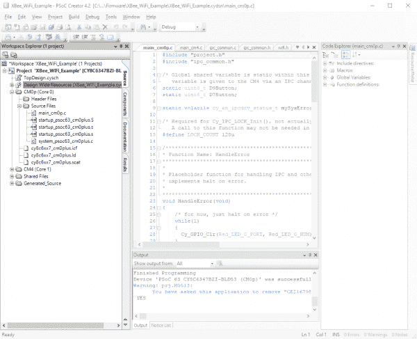](https://cdn.sparkfun.com/assets/learn_tutorials/7/0/9/cm0p_files.png)

正如您可能已经从工作区的结构中猜到的，有两个完全独立的代码库为两个不同的内核运行。" *main_cm0p.c* "是 Cortex-M0+内核代码的入口点，然后该内核启动 Cortex-M4 内核。对于具有相似文件的皮质-M4 核心，存在相似的子域，同样，我们只需要担心“头文件”和“源文件”子域。

[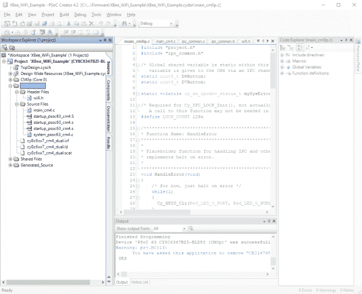](https://cdn.sparkfun.com/assets/learn_tutorials/7/0/9/cm4_files.png)

最后，我们有“共享文件”部分。这些文件大部分都是自动生成的，保存“ *ipc_common.c* ”和“ *ipc_common.h* ”文件。这些文件是为这个项目开发的进程间通信的助手。

[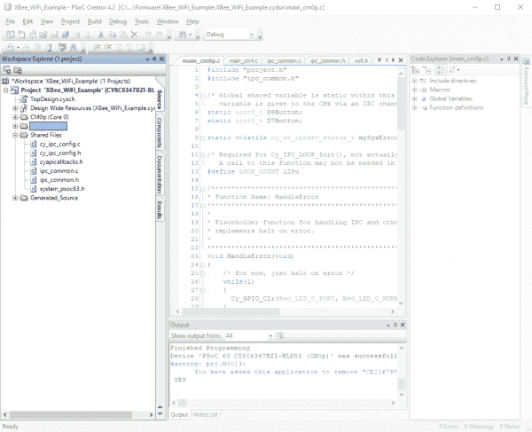](https://cdn.sparkfun.com/assets/learn_tutorials/7/0/9/shared_files.png)

#### 皮质-M0+主文件

既然我们已经强调了重要的内容，让我们来看看代码的重要部分，一次一个文件，从" *main_cm0p.c* "文件开始。该文件处理 Cortex-M0+内核为系统执行的所有活动:监控两个按钮，并在其中一个按钮被按下时向 Cortex-M4 发送信号。

然而，这并不像看起来那么简单，因为皮层-M4 需要能够在处理完信号后清除信号，这意味着多个进程访问相同的数据。每当有多个进程处理同一个数据集时，都需要考虑写冲突的影响。如果一个进程试图在另一个进程试图更改相同数据的过程中更改数据，会发生什么情况？为了处理这个问题，我们使用一个系统保护的读写操作，在" *ipc_common* "文件中设置。

要理解其工作原理，首先必须理解 IPC 通道的概念。IPC 通道使用信号量将数据从一个进程写入另一个进程，同时保证两个内核之间不会发生冲突。在开始为每个内核执行应用程序时，您必须为要在执行期间使用的 IPC 通道建立端点。考虑这两行代码:

```
language:c
IPC_STRUCT_Type *D9IpcHandle;
D9IpcHandle = Cy_IPC_Drv_GetIpcBaseAddress(7); 
```

第一个为定义 IPC 通道特征的`struct`创建一个指针。第二个实际上将该结构设置为指向一个特定的内存位置，即系统 IPC 通道 7。我们使用信道 7，因为信道 0-6 保留给系统使用。

当然，接下来我们必须告诉另一个内核哪个内存地址与这个 IPC 通道相关联。这就是这个函数调用的作用。

```
language:c
while(Cy_IPC_Drv_SendMsgPtr(D9IpcHandle, CY_IPC_NO_NOTIFICATION, &D9Button) != CY_IPC_DRV_SUCCESS); 
```

`D9Button`是代码中较早设置的变量。函数调用包含在一个`while()`循环中，因为我们希望重复函数调用，直到我们收到另一个进程(即运行在 Cortex-M4 内核上的代码)已经收到该信息的确认。我们还希望等到变量的锁被释放，这表明皮层-M4 已经完成了指针值的读取。

```
language:c
while(Cy_IPC_Drv_IsLockAcquired(D9IpcHandle)); 
```

最后，我们进入应用程序的无限循环，其中自定义函数`ReadSharedVar()`和`WriteSharedVar()`处理更新共享变量，这些变量与另一个内核通信按钮状态。我们稍后将深入研究这些函数。

#### 皮质-M4 主文件

在 Cortex-M4 `main()`功能中，我们重复了在 Cortex-M0+ `main()`功能中针对 IPC 通道设置所做的一些相同操作。

```
language:c
IPC_STRUCT_Type *D9IpcHandle;
D9IpcHandle = Cy_IPC_Drv_GetIpcBaseAddress(7); 
```

一旦完成，我们就必须调用一些代码来“捕捉”从 Cortex-M0+进程发送的消息，其中包含要访问的共享变量的地址。

```
language:c
while (Cy_IPC_Drv_ReadMsgPtr(D9IpcHandle, (void *)&D9Button) != CY_IPC_DRV_SUCCESS); 
```

同样，我们将这个调用包含在一个`while()`循环中，这样它会不断被调用，直到消息从 Cortex-M0+发出。然后，我们必须释放 IPC 通道上的锁，以便 Cortex-M0+进程知道它可以继续运行并在将来使用 IPC 通道。因为它是开放的，所以不需要将它包含在一个`while()`循环中:只需要发出一次调用来释放锁，而不是检查锁是否已经被释放，这必须重复直到锁被释放。

```
language:c
Cy_IPC_Drv_LockRelease(D9IpcHandle, CY_IPC_NO_NOTIFICATION); 
```

一旦所有这些都完成了，我们必须设置 XBee WiFi 盾来访问我们的本地网络。我们不会在这里重复所有代码，因为它在示例中有很好的记录。

在运行应用程序代码的无限循环中，我们再次调用自定义函数`ReadSharedVar()`和`WriteSharedVar()`来访问保存按钮状态的变量，这些变量与 Cortex-M0+内核共享。让我们仔细看看这些函数是做什么的。

#### “ipc_common.c”文件

如前所述，我们必须使用信号量保护变量在 PSoC6 上当前运行的两个进程之间进行通信。通过用信号量保护我们的读写，我们确保了对这些变量的访问不会发生冲突。

我们先来看看`WriteSharedVar()`函数。它接受一个指向共享变量的指针、一个要写入该共享变量的值和一个用于保护该事务的信号量作为参数。重要的是，两个进程使用相同的信号量来保护以这种方式编写的任何变量；在“ *ipc_common.h* ”中，有一个信号量的定义，用于在进程间共享的两个变量的每一个。有 128 个信号量可供应用程序使用，但信号量 0-15 在后台使用，因此用户信号量必须是 16 号或更高。

代码的第一部分处理信号量的设置。它被设置为 1000 微秒后超时。这很重要，因为我们不想过多地等待另一个进程释放信号量。

```
language:c
for (timeout = 0ul; timeout < MY_TIMEOUT; timeout++)
{
    rtnVal = (uint32_t)Cy_IPC_Sema_Set(semaID, false);
    /* exit the timeout wait if semaphore successfully set or error */
    if ((rtnVal == (uint32_t)CY_IPC_SEMA_SUCCESS) || IsSemaError(rtnVal))
    {
        break;
    }
    CyDelayUs(1);
}
if (timeout >= MY_TIMEOUT) rtnVal = CY_RET_TIMEOUT; 
```

第二部分代码处理共享变量的写入和信号量的释放。同样，清除信号量是在超时循环中完成的。

```
language:c
if (rtnVal == CY_IPC_SEMA_SUCCESS)
{
    *sharedVar = value;

    /* timeout wait to clear semaphore */
    for (timeout = 0ul; timeout < MY_TIMEOUT; timeout++)
    {
        rtnVal = (uint32_t)Cy_IPC_Sema_Clear(semaID, false);
        /* exit the timeout wait if semaphore successfully cleared or error */
        if ((rtnVal == (uint32_t)CY_IPC_SEMA_SUCCESS) || IsSemaError(rtnVal))
        {
            break;
        }
        CyDelayUs(1);
    }
    if (timeout >= MY_TIMEOUT) rtnVal = CY_RET_TIMEOUT;
} 
```

现在我们来看一下`ReadSharedVariable()`函数。在本例中，我们传递了一个指向变量的`const`指针、一个指向副本的指针和信号量。除了对变量的实际访问之外，代码与`WriteSharedVariable()`函数相同:

```
language:c
*copy = *sharedVar; 
```

如您所见，这次我们将副本设置为共享变量的值。考虑到这个函数的目的是将共享变量移动到一个本地副本中以供流程使用，这就不足为奇了！

### 怎么回事 Pt。2:树莓派

让我们看看树莓派上的代码。这很简单！

```
language:python
from flask import Flask
import RPi.GPIO as GPIO 
```

这些是你的一般进口陈述。我们之前安装了 Flask 和 RPi。GPIO 模块已经安装在 Raspberry Pi 上了。接下来，我们开始设置 GPIO:

```
language:python
GPIO.setmode(GPIO.BCM)  # Sets up the RPi lib to use the Broadcom pin mappings
                        #  for the pin names. This corresponds to the pin names
                        #  given in most documentation of the Pi header
GPIO.setwarnings(False) # Turn off warnings that may crop up if you have the
                        #  GPIO pins exported for use via command line
GPIO.setup(2, GPIO.OUT) # Set GPIO2 as an output 
```

通过评论，这一部分应该很容易理解。然后我们必须设置我们的 Flask 应用程序:

```
language:python
app = Flask(__name__)   # Create an instance of flask called "app" 
```

现在，我们将参考 Flask 应用程序来了解我们的路线处理功能。Flask 的行为很像一个标准的 web 服务器，提供页面来响应针对某个路径的 http 请求，除了它不是提供页面，而是执行一大块 python 代码。因此，默认路由处理程序(即，当 http 请求中没有给出路由时)是:

```
language:python
@app.route("/")         # This is our default handler, if no path is given
def index():
    return "hello" 
```

如果您在 web 浏览器中访问这个页面，结果将是一个简单的纯文本“hello”页面。当你走上一条定义更明确的道路时，真正的奇迹就发生了:

```
language:python
@app.route('/gpio/<string:id>/<string:level>')
def setPinLevel(id, level):
    GPIO.output(int(id), int(level))
    return "OK" 
```

在这种情况下，当您发送路径“/gpio/2/1”时，Flask 应用程序将其解释为一个 gpio 编号(我们只启用了 GPIO 2)，后跟一个将 GPIO 设置为(1 或 0)的级别。我们需要做的最后一件事是让系统了解如何运行应用程序:

```
language:python
if __name__ == "__main__":
    app.run(host='0.0.0.0', port=5000) 
```

这段代码指定应用程序应该在本地运行，对外部世界可见，端口 5000。我建议让它保持原样，但是如果您真的想要(并且真的知道自己在做什么)，您可以更改端口号。

## 示例:使用 PSoC 6 先锋套件从 BLE 到树莓派

这个例子展示了如何通过 BLE 向 Raspberry Pi 发送一个简单的信号。它仅使用 Cortex-M0+内核，运行 Cypress 提供的代码示例。

### PSoC 6 先锋套件编程

如果您遵循我们的第一个示例，您应该熟悉如何使用新固件对 PSoC 6 先锋套件板进行编程。对名为“BLE 到 RPi”的工作区重复这个过程。这只是 Cypress 代码示例 CE218134 的一个重命名副本。

### 树莓 Pi 编程

编写 Raspberry Pi 相当容易。您不需要安装任何额外的软件，只需使用下面的命令从 GitHub 下载存储库:

```
git clone https://github.com/sparkfun/Pioneer_Kit_Shield 
```

然后，通过输入以下命令运行将侦听 BLE 通信的 python 程序:

```
sudo python Pioneer_Kit_Shield/Software/BLE/scanble.py 
```

这应该就够了。现在，您可以使用 PSoC6 先锋套件板上的两个 CapSense 按钮来切换 Raspberry Pi 上的 LED。

### 这是怎么回事 Pt？1: PSoC 6

我不打算深入研究 PSoC 6 代码，因为它在示例中有很好的记录。然而，我将提请注意一些细节。

首先，这段代码完全运行在 Cortex-M0+处理器内核上。另一个核心永远不会被激活。

其次，CapSense 事件作为通知发送，这意味着它们从服务器(PSoC 6 板)发送到客户端(Raspberry Pi)。Raspberry Pi 不需要从服务器请求数据，因为它会在变化时自动更新。

第三，树莓派 app 硬编码附加到 PSoC 6 app 上。如果你在一个有多个 PSoC 6 板的环境中，你必须改变 BLE 应用的公共地址以及在 Python 应用中寻找的地址。

### 这是怎么回事 Pt？2: Python 和树莓派

Python 代码使用了 **Bluepy** 模块，默认情况下应该安装在您的 Raspberry Pi 上。

我们要把这个稍微打乱一下，这样代码就更有意义了。我们首先创建一个`Peripheral`对象，传递给它一串十六进制值，对应于我们正在寻找的 BLE 设备的公共地址。

```
language:python
device = Peripheral("00:A0:50:21:81:34") 
```

然后我们创建并分配`ScanDelegate`类对象给那个外围设备。这让模块知道这是传入的 BLE 消息应该被分配的对象。这将阻塞大约 30 秒，等待连接到我们分配给它的`Peripheral`对象。

```
language:python
device.withDelegate(ScanDelegate()) 
```

我们现在需要编写两个特征:一个用于启动来自 CapSense 按钮的消息流，另一个用于将板载 LED 变成白色，作为连接成功的标志。

```
language:python
device.writeCharacteristic(29, b"\x01\x00", withResponse=True)
device.writeCharacteristic(23, b"\xff\xff\xff\xff", withResponse=True) 
```

现在让我们回到代码中，看看`ScanDelegate`类。我已经删除了感知按钮状态的琐碎代码，并确保无论按钮被按住多长时间，每次只记录一次按钮按下。

```
language:python
class ScanDelegate(DefaultDelegate):
    def __init__(self):
    DefaultDelegate.__init__(self)

    def handleNotification(self, cHandle, data):
        ## Do something with the data object 
```

`data`将是一个包含蓝牙服务器发送的所有字节的数组。在这个例子中，它是两个字节，第二个字节告诉我们哪个按钮被按下了。

最后，在代码的底部，我们有这样一个部分，它在一秒钟内等待通知，并在收到通知时被对`handleNotification()`的调用中断:

```
language:Python
while True:
    if device.waitForNotifications(1.0):
        continue 
```

这就是在 Raspberry Pi 上通过 Python 从 BLE 设备接收数据是多么容易。总共不到 50 行代码。

## 例如:PSoC 4 BLE 至 PSoC 6 BLE 至 ThingSpeak.com

这个例子使用 PSoC 4 BLE 套件和先锋物联网附加盾来读取空气质量传感器，并通过蓝牙将结果发送到 PSoC 6 BLE 套件，然后使用物联网附加盾与 WiFi XBee 连接，并将数据发布到 ThingSpeak。

### 注册 ThingSpeak

我们要你做的第一件事是注册一个免费的 ThingSpeak 帐户。ThingSpeak 是 Mathworks 的免费物联网数据可视化工具。有限的个人使用是免费的，最多三个频道。

要注册，进入 [the ThingSpeak 网站](https://thingspeak.com)，点击右上角的“注册”按钮，填写您的信息。如果您已经有一个 Mathworks 帐户，您不需要注册，只需登录即可。您应该会看到一个类似于下图的屏幕。

[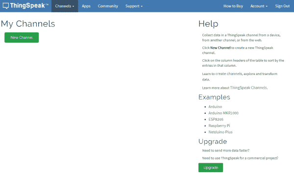](https://cdn.sparkfun.com/assets/learn_tutorials/7/0/9/thingspeak_initial_page.png)

单击“新通道”按钮创建一个新的通道来上传数据。频道实际上是一个标题下的数据源集合。它可以有几个设备输入，或者像本例中一样，一个设备输入几个数据流。您将看到如下屏幕

[](https://cdn.sparkfun.com/assets/learn_tutorials/7/0/9/thingspeak_new_channel.png)

您可以在这里设置频道。给它一个名称(“空气质量数据”是我们将使用的)，一个描述，并单击前五个字段旁边的复选框。您可以随意命名它们，但是为了与来自 PSoC 6 的数据相匹配，我们建议依次命名为“温度”、“压力”、“湿度”、“tVOC”和“ECO2”。这是您需要添加到此页面的所有数据，但您可以继续添加其他数据(纬度和经度，海拔，外部网站的链接等。)如果你喜欢。点击页面底部的“保存频道”。您将被带到一个如下所示的页面:

[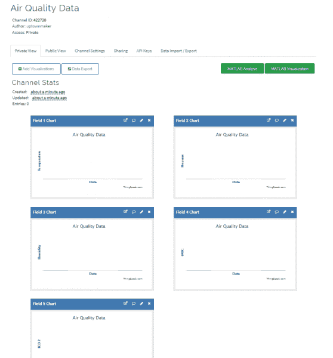](https://cdn.sparkfun.com/assets/learn_tutorials/7/0/9/thingspeak_blank_channel.png)

如您所见，您的频道上有一个每个字段的图表，它们都是空白的。现在我们需要获取 API 密钥来发布到这个通道，这样我们就可以用这个值更新我们的固件，并开始向 ThingSpeak 发布值。靠近页面顶部有一个标签栏。我们目前在“私人视图”选项卡上。单击单词“API Keys”转到 API Keys 选项卡。

[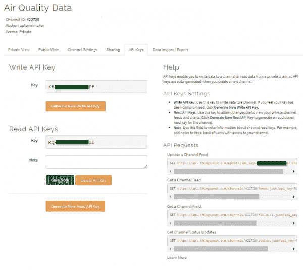](https://cdn.sparkfun.com/assets/learn_tutorials/7/0/9/thingspeak_api_keys.png)

如你所见，有一个“写”键和一个“读”键。保持这些私人的，因为任何人都可以在你的频道上发帖，只要他们有“写”键。保持此窗口打开，并在 PSoC Creator (v4.2 或更高版本)中打开 BLE 传感器扫描仪项目。

### PSoC 4 硬件设置

不需要焊接。只需插入先锋物联网附加保护罩，然后将环境组合板连接到保护罩上。使用环境组合板上的哪个连接器并不重要。

### PSoC 4 器件编程

不需要重新配置代码。它可以加载到 PSoC 4 BLE 先锋套件板上，就像项目打开时一样。但是，您必须选择正确的项目，用固件对电路板进行编程。为此，在屏幕左侧的“工作区浏览器”中右键单击“环境传感器”项目，并选择“设为活动项目”，如下所示。这告诉 Creator，在默认情况下，当您从“Debug”菜单中选择“program”选项时，构建并编程这个项目。

[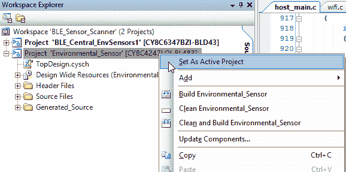](https://cdn.sparkfun.com/assets/learn_tutorials/7/0/9/creator_set_active_project_psoc4.png)

你现在可以打开“调试”菜单，点击“程序”。如果打开如下窗口，选择“PSoC 4200 BLE”条目并点击“确定/连接”或“确定”。

[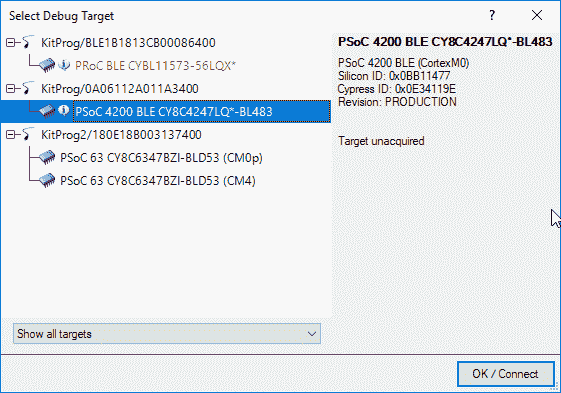](https://cdn.sparkfun.com/assets/learn_tutorials/7/0/9/creator_select_debug_target_psoc4.png)

### PSoC6 代码配置和器件编程

在将代码上传到 PSoC 6 之前，您必须进行一些更改，以告诉固件各种本地设置(WiFi 信息)和您的 ThingSpeak 通道 API。你需要做的第一件事是在屏幕右侧的“工作区浏览器”中右键单击“项目‘BLE _ 中央 _ 环境传感器 1’”，并选择“设为活动项目”。

[](https://cdn.sparkfun.com/assets/learn_tutorials/7/0/9/creator_set_active_project_1.png)

接下来，您需要打开我们需要更改的两个文件:“host_main.c”和“wifi.c”。这些文件位于资源管理器框架中项目下的“主机文件”子条目中。在“host_main.c”中，转到第 937 行，应该如下所示。

```
sprintf(buffer, "GET /update?key=XXXXXXXXXXXXXXXXX&field1=%i&field2=%u&field3=%u&field4=%d&field5=%d HTTP/1.1\r\n", sensorData->temperature, sensorData->pressure, sensorData->humidity, sensorData->tvoc, sensorData->eco2); 
```

回到你的 ThingSpeak 页面，复制“Write”API 键，并粘贴到第 937 行的 Xs 上。确保删除所有的 x，但不要删除前面的“=”或后面的“&”。这是您需要在该文件中进行的唯一更改。保存并关闭它。

在“wifi.c”中，转到第 29 行。应该是这样的。

```
char ssid[] = "wifi_ssid_here"; 
```

用您的 WiFi SSID 替换字符串`wifi_ssid_here`，保留字符串两边的双引号。然后看一下第 31 行。

```
char ssid_pw[] = "wifi_password_here"; 
```

同样，用 WiFi 网络的密码替换字符串`wifi_password_here`，同样，保留字符串两边的双引号。最后，您需要更改网络的加密模式设置。看第 33 行。

```
 char encrypt_mode = WPA2; 
```

将`WPA2`替换为您的 WiFi 网络使用的加密模式。有效选项有`NO_SECURITY`、`WPA`、`WPA2`和`WEP`。在这种情况下，不要用**而不是**在字符串两边加上双引号。保存并关闭文件。打开“调试”菜单，选择“程序”。您可能会看到这样一个窗口:

[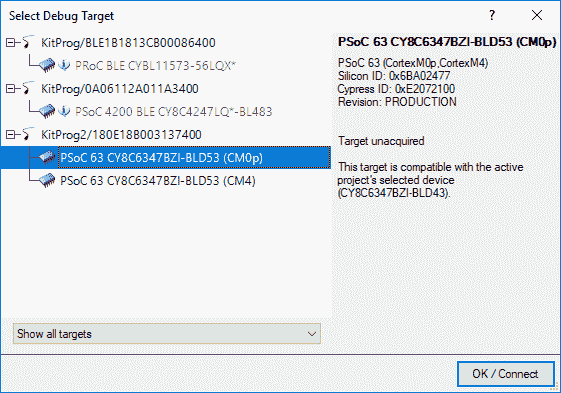](https://cdn.sparkfun.com/assets/learn_tutorials/7/0/9/creator_select_debug_target_1.png)

如果是，突出显示“KitProg2”标题下的“PSoC 63”条目，然后单击“确定”。

编程完成后，您需要等待一段时间来配置 XBee 并连接到您的 WiFi 网络。当先锋物联网盾上 XBee 旁边的 LED 开始不断闪烁时，您就知道它已连接。

按下 PSoC 4 BLE 先锋套件板上的“Reset”按钮，右上角的三色 LED(假设 USB 连接器在左侧)应呈蓝色闪烁。如果一切上传正确，LED 将很快变成闪烁的绿色。这表明 PSoC 6 板已经找到它，并与之连接，正在请求数据。在 15-20 秒内，第一批数据应该开始出现在 ThingSpeak 上。

## 资源和更进一步

现在，您已经成功地启动并运行了 PSoC 6 先锋板和先锋物联网附加保护板，是时候将其整合到您自己的项目中了！

有关 PSoC 6 先锋板和先锋物联网附加盾的更多信息，请查看以下链接:

*   [示意图(PDF)](https://cdn.sparkfun.com/assets/0/6/b/0/b/Pioneer_IoT_Add-On_Shield.pdf) -先锋物联网盾示意图
*   [Eagle 文件(ZIP)](https://cdn.sparkfun.com/assets/9/f/4/0/e/Pioneer_IoT_Add-On_Shield.zip) -先锋物联网盾的电路板设计文件
*   [Cypress 32 位 ARM Cortex-M4 PSoc 6 产品页面](http://www.cypress.com/products/32-bit-arm-cortex-m4-psoc-6)-PSoc 6 登陆页面
*   [Cypress PSoC 6 MCU 社区](https://community.cypress.com/community/psoc-6)-PSoC 6 处理器论坛
*   [XBee WiFi 用户指南](https://www.digi.com/resources/documentation/Digidocs/90002180/) -让您的 XBee WiFi 游戏更上一层楼所需的一切！
*   [Qwiic 登录页面](https://www.sparkfun.com/qwiic) -关于 Qwiic 系统的更多信息
*   [SparkFun 产品展示区](https://youtu.be/ht2Vx1X0iDo)
*   [先锋物联网插件 GitHub Repo](https://github.com/sparkfun/Pioneer_IoT_Kit_Shield) -产品存储库

你的下一个项目需要一些灵感吗？查看一些相关教程:

[](https://learn.sparkfun.com/tutorials/sparkfun-blocks-for-intel-edison---9-degrees-of-freedom-block-) [### 英特尔 Edison 的 SparkFun 模块- 9 自由度模块](https://learn.sparkfun.com/tutorials/sparkfun-blocks-for-intel-edison---9-degrees-of-freedom-block-) A quick overview of the features of the 9 Degrees of Freedom Block.[Favorited Favorite](# "Add to favorites") 1[](https://learn.sparkfun.com/tutorials/loading-debian-ubilinux-on-the-edison) [### 在 Edison 上加载 Debian (Ubilinux)](https://learn.sparkfun.com/tutorials/loading-debian-ubilinux-on-the-edison) How to load a Debian distribution (specifically Ubilinux) onto the Edison.[Favorited Favorite](# "Add to favorites") 5[](https://learn.sparkfun.com/tutorials/photon-remote-temperature-sensor) [### 光子远程温度传感器](https://learn.sparkfun.com/tutorials/photon-remote-temperature-sensor) Learn how to build your own Internet-connect, solar-powered temperature collection station using the Photon from Particle.[Favorited Favorite](# "Add to favorites") 11[](https://learn.sparkfun.com/tutorials/esp32-thing-hookup-guide) [### ESP32 事物连接指南](https://learn.sparkfun.com/tutorials/esp32-thing-hookup-guide) An introduction to the ESP32 Thing's hardware features, and a primer on using the WiFi system-on-chip in Arduino.[Favorited Favorite](# "Add to favorites") 22