# 使用串行 7 段显示器

> 原文：<https://learn.sparkfun.com/tutorials/using-the-serial-7-segment-display>

## 介绍

串行 7 段显示器是一种易于使用的 4 位显示器，通过串行接口控制。你只需要一个，而不是用十几个微控制器的管脚来控制发光二极管。使用串行 I ² C 或 SPI 接口，您可以控制所有数字、小数点、冒号和撇号。

[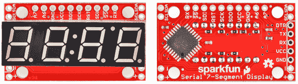](https://cdn.sparkfun.com/assets/2/b/4/f/c/51e9760fce395f4d7b000000.png)*Top and bottom views of the display.*

本教程的目标是让你熟悉串行 7 段显示器。我们将讨论硬件设置、组装和示例接口电路/代码。鉴于 [Arduino](https://learn.sparkfun.com/tutorials/what-is-an-arduino) 的流行，这些例子将利用无处不在的开发平台/语言。

本教程还涵盖了 [7 段盾](https://www.sparkfun.com/products/11849)。如果你有七段盾，我们建议你先去它的[标签](https://learn.sparkfun.com/tutorials/using-the-serial-7-segment-display/7-segment-shield)，然后从那里开始你的旅程。该板非常易于使用，因为您可以直接将其插入 Arduino Uno 兼容板，并且您可以使用与本教程中介绍的串行 7 段显示器完全相同的代码示例。

### 所需材料

除了显示器本身，你还需要一个 [Arduino](https://www.sparkfun.com/products/11021) (或者它的一个[变种](https://www.sparkfun.com/categories/242))来发送串行数据。在 Arduino 中，你可以使用一个 [FTDI Basic](https://www.sparkfun.com/products/9716) ，或者任何能够发送 TTL 串行数据的设备。

你还需要一些**方法来连接显示器和 Arduino** 。你可以使用[公接头](https://www.sparkfun.com/products/116)和[试验板](https://www.sparkfun.com/products/11317)的组合。或者，你可以只带几根[线](https://www.sparkfun.com/products/11375)。

#### 工具

为了使用串行 7 段显示器，你需要将**焊接到至少几个管脚上。这意味着你至少需要一个[基本烙铁](https://www.sparkfun.com/products/9507)以及[焊料](https://www.sparkfun.com/products/9163)。如果这是你第一次焊接，查看我们的[如何焊接教程](https://learn.sparkfun.com/tutorials/how-to-solder-through-hole-soldering)寻求帮助。**

### 开始之前

在阅读如何连接串行 7 段显示器之前，熟悉这些概念会有所帮助。在继续之前，请考虑通读这些教程:

*   [二进制](https://learn.sparkfun.com/tutorials/binary) -发送到显示器的数据以字节“包”的形式出现。为了控制小数或单个段，二进制知识将是重要的。
*   [如何焊接](https://learn.sparkfun.com/tutorials/how-to-solder-through-hole-soldering) -要连接到显示器，你必须焊接电线、接头或其他连接器。
*   [串行通信](https://learn.sparkfun.com/tutorials/serial-communication) -这是用于与显示器对话的三种通信标准中最简单的一种。
*   [I ² C 通讯](https://learn.sparkfun.com/tutorials/i2c) - I ² C 为双线串行接口。与显示器对话的串行替代方式。
*   [SPI 通信](https://learn.sparkfun.com/tutorials/serial-peripheral-interface-spi) - SPI 是一种三线(或四线)串行接口。控制 LED 的第三个串行选项。
*   什么是 Arduino？ -在本例中，我们将使用 Arduino 来控制 LED。如果你不确定那是什么，一定要看看这个教程。

## 硬件概述

本页涵盖了串行 7 段显示器的硬件端(从这里开始，我们将其缩短为 S7S)。这里涵盖了从引脚排列到显示器供电的所有内容。

首先，我们应该提到，显示器有多种颜色可供选择:[红色](https://www.sparkfun.com/products/11441)、[绿色](https://www.sparkfun.com/products/11440)、[蓝色](https://www.sparkfun.com/products/11442)、[黄色](https://www.sparkfun.com/products/11443)和[白色](https://www.sparkfun.com/products/11629)。

[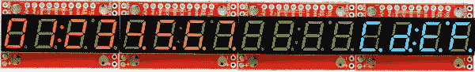](https://cdn.sparkfun.com/assets/8/6/6/6/f/51e85956ce395f333c000001.png)

### 引脚排列

S7S 几乎在每个方向上都有很多针脚。放松点。你实际上只需要连接其中的 3-5 个管脚。大多数引脚可以根据其使用的接口进行分类。这张图片应该做了大部分的解释:

[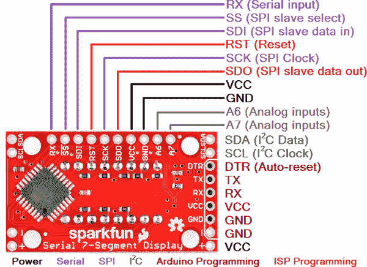](https://cdn.sparkfun.com/assets/2/5/a/9/c/51e85cb6ce395f0d3c000002.png)

您可以选择三个串行接口中的哪一个来连接显示器。使用基本串行输入，您只需连接到 RX 引脚。I ² C 需要两个引脚，SPI 需要三个引脚。

不管你选择哪个接口来发送数据，有两个管脚你必须连接:电源管脚！VCC 和 GND。

### 为串行 7 段显示器供电

要让 S7S 启动并运行，你首先需要弄清楚[如何给](https://learn.sparkfun.com/tutorials/how-to-power-a-project)这个东西供电。S7S 可以由各种电压电源供电。它可以在从 **3.0V 到 5.5V** 的任何地方工作。请记住，电源电压会影响显示器的亮度，电压越高，最大亮度越高。

显示器的电源电压未经调节。所以不要给它任何疯狂的高电压，任何超过 6.0V 的电压都会损害显示器。善待你的 S7S！

如果您使用的是 Arduino，您可以通过 5V 或 3.3V 接头关闭 S7S 的电源。也不要忘记接地(GND)。

### 串行接口

串行 7 段显示器中的“串行”是一种概括。恰当的...但这款显示器实际上提供了三种不同的串行接口方法:串行 UART、SPI 和 I ² C。这些接口各有利弊。每种通信协议之间的一个很大区别是各自需要的引脚数量。它们也各自在固件端增加了自己的复杂程度(尽管有了 Arduino，库确实简化了任务)。

#### UART 串行

[UART 串行](https://learn.sparkfun.com/tutorials/serial-communication)，或者 TTL 串行，这可能是 S7S 上最基本的串行通信方式。如果你玩过 Arduino，你可能用过硬件 UART 通过串行监视器将信息传回你的电脑。或者使用软件串行库设置软件串行端口。这种形式的串行通信是**异步**，这意味着数据传输不需要并行时钟信号的任何帮助。这使得我们的工作变得更容易和更困难。更简单，因为我们只需要**一根线(RX)来与显示器**通信。更难的是，需要额外注意确保位之间的时间是准确的。

S7S 支持一系列很常见的[波特率](../serial-communication/rules-of-serial#baud)，默认为大家的最爱——**9600**。如果您愿意，可以调整波特率，但显示器将只允许 **8 个数据位**、**无奇偶校验**和 **1 个停止位** (8N1)。

#### 串行外设接口(SPI)

[SPI](https://learn.sparkfun.com/tutorials/serial-peripheral-interface-spi) 是一种同步串行通信方式。这有点像采用上面的 UART 方法并添加一个时钟信号。这样我们就不必担心发送数据的速度了(只要速度不要太快)，但我们确实需要多使用两个引脚。

SPI 需要三条线路来进行通信:数据(SDI，即“串行数据输入”)、时钟(SCK，“串行时钟”)和从机选择(SS，上方有一条横线表示低电平有效)，也称为片选(CS)。关于这种串行方法有几点需要注意:**S7S 的最大时钟速度是 250kHz** 。数据在时钟的上升沿读入(当它从 0V 变为 5V 时)。还值得注意的是，主器件(本例中为 Arduino)上的 SPI 连接通常标记为 MISO(主机输入从机输出)和 MOSI(主机输出，从机输入)。MOSI 线连接到 S7S 上的 SDI，而 MISO 线连接到 SDO 线。

借助从机选择引脚，我们可以在一条总线上连接多个 SPI 器件。您甚至可以在同一总线上连接多个 S7S，前提是每个 S7S 都有自己的专用选择引脚。

[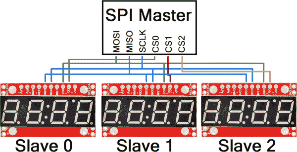](https://cdn.sparkfun.com/assets/6/a/7/c/9/51e86099ce395f643b000001.png)

#### 内部集成电路(I ² C)

I ² C 存在于 SPI 和 UART 串行之间。这种串行方法只需要两个引脚——SDA(串行数据)和 SCL(串行时钟)。I ² C 器件被赋予唯一的 7 位地址，而不是像 SPI 那样使用片选引脚。S7S 的 I ² C 地址可配置，但默认为 **0x71** 。

I ² C 总线上的数据是双向的，因此需要特殊的应答信号来实现某种形式的握手。I ² C 在 CS 线中所缺少的东西，在数据信号的复杂性方面得到了充分的补偿。不过令人高兴的是，有许多 I ² C 库——例如 Arduino 上的**连线库**，这使得 I ² C 数据传输变得简单。

像 SPI 一样，I ² C 的优势是可以将多个器件连接到同一条总线上。如果您需要与四个部分通话，请用唯一的地址对它们进行编程并链接！

[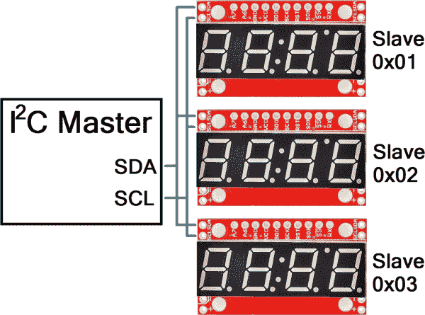](https://cdn.sparkfun.com/assets/3/9/a/e/1/51e860f5ce395f453c000001.png)

## 装配

要将其他电子设备连接到显示器，您需要焊接到 S7S 的一些引脚上。不过，在焊接之前，先想想你想如何使用这款显示器。您是否计划使用某个特定的串行接口？也许你只需要焊接到电源引脚，以及对应于你的首选接口的几个引脚。你只是用显示器做原型吗？你要把它安装在项目围栏里吗？你的组装方法实际上取决于你对显示器的最终目标是什么。

对于许多用例，你真的只需要顶部头上的引脚。当我制作这些显示器的原型时，我喜欢焊接一些[直插头](http://www.sparkfun.com/products/116)，这样我就可以把它插到试验板上。

[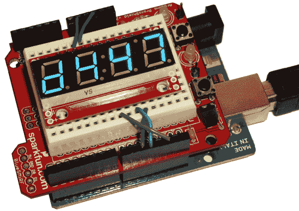](https://cdn.sparkfun.com/assets/a/7/0/2/3/51e861f1ce395f183c000000.png)

当然，你可以将[绞合](https://www.sparkfun.com/products/11375)或[实芯线](https://www.sparkfun.com/products/11367)焊接到你需要的引脚上。如果您计划将显示器安装在外壳中，这将非常有用。

[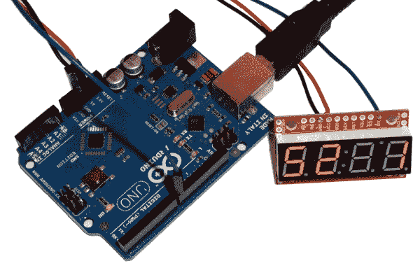](https://cdn.sparkfun.com/assets/4/0/9/1/6/51e86234ce395ff73b000003.png)

如果你打算使用一个 [FTDI Basic](https://www.sparkfun.com/products/9716) 对显示器进行重新编程，你可能会发现将一些[直角公接头](http://www.sparkfun.com/products/553)焊接到串行编程接头中是很有用的。这可能有点棘手，因为显示器会碍事。我焊接我的直角在弯曲的一边。

[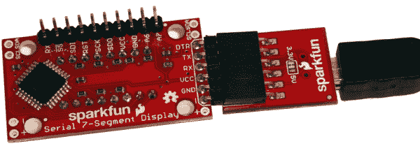](https://cdn.sparkfun.com/assets/7/d/5/b/1/51e862a3ce395f723c000003.png)

最后，如果你要安装显示器，任何 [4-40 螺丝](https://www.sparkfun.com/products/10453)都应该能够穿过这些支座孔。

## 七段屏蔽

如果你正在寻找一个更简单的 S7S 外形，看看 [7 段盾形显示屏](https://www.sparkfun.com/products/11849)。S7S 显示器防护罩是一个 Arduino 防护罩，设计用于运行在 [Arduino Uno](https://www.sparkfun.com/products/11021) 或 Arduino Uno [兼容板](https://www.sparkfun.com/products/11575)之上。它运行与 OpenSegment 和串行 7 段显示器相同的固件，并以相同的方式控制。这可以说是三个中最容易上手的，因为你所要做的就是填充标准的 [Arduino 头](https://www.sparkfun.com/products/10007)，一个你选择的 7 段显示器，然后将 shield 插入 Arduino Uno 兼容板。欲了解更多关于屏蔽装配的说明，请访问我们的[屏蔽教程](https://learn.sparkfun.com/tutorials/arduino-shields/installing-headers-preparation)。

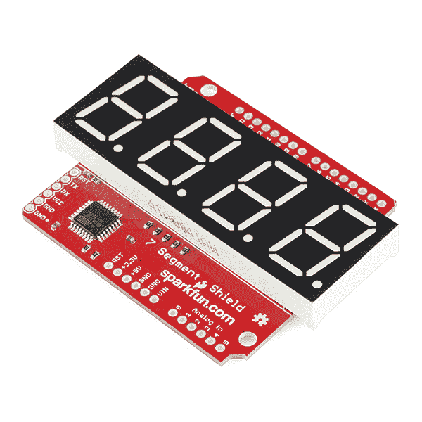

### 异同

与其兄弟板一样，串行 7 段屏蔽板可以通过 SPI、I2C 和串行通信进行控制。您可以选择哪种通信协议最适合您的特定应用，让其他协议与其他硬件交互。它共享相同的命令集，所有相同的示例 [Arduino 草图](https://github.com/sparkfun/Serial7SegmentDisplay/tree/master/firmware/Serial%207-Segment%20Display/Arduino_Examples)也适用于它，不需要更改一行代码。

由于所有通信协议默认连接，因此可以选择禁用 SPI 或串行通信流。只有当它们与您想要与之通信的其他设备冲突时，您才需要禁用它们，否则您可以不去管它们。可以通过脱焊片选引脚(CS)来禁用 SPI。可以通过拆焊屏蔽的接收引脚(RX)来禁用串行。这些跳线位于下图的顶部中央。

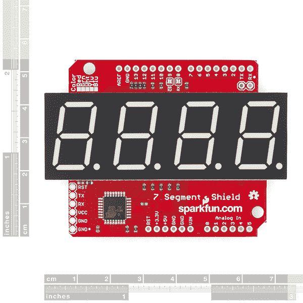

那么 I2C 呢？虽然 I2C 不能以同样的方式被禁用，但它不应该与同一总线上的另一个 I2C 设备冲突，除非它们共享同一个地址。在这种情况下，你可以用不同的 I2C 地址重新编程盾牌的固件。默认情况下，屏蔽的 I2C 地址是 0x71。

比较可显示数据时，两者都有四个 7 段和四个小数位。然而，7 段盾形没有冒号或撇号。任何打开冒号和撇号的命令都不会显示在七段盾上。

### 超级快速入门指南

1.  将[接头](https://www.sparkfun.com/products/10007)焊接到 7 段屏蔽显示器上。
2.  与一个 [Arduino Uno 兼容板](https://www.sparkfun.com/products/11575)配对。
3.  选择一个*基本*示例 Arduino 草图，并从[这里](https://github.com/sparkfun/Serial7SegmentDisplay/tree/master/firmware/Serial%207-Segment%20Display/Arduino_Examples)下载。
4.  将示例草图上传到您的 Arduino。
5.  如果 1-4 正确，你的显示器现在应该向上计数。
6.  继续阅读本教程的示例编码部分，以便更好地掌握代码。

如果你准备好投入创作自己的草图，请随意。如果你想对一个基本草图有更多的解释，请访问本教程下面的编码部分。只需将您的盾牌插入 Arduino，然后跟随。

## 固件概述

**Heads up!** Having issues with the latest default firmware on the serial 7 Segment display? Try using v3.1!

本教程中的所有固件都可以在 [S7S GitHub repo](https://github.com/sparkfun/Serial7SegmentDisplay) 上找到。

[Serial7SegmentDisplay GitHub Repo](https://github.com/sparkfun/Serial7SegmentDisplay)

在真正深入研究示例之前，我们应该讨论应该向显示器发送什么类型的数据。如硬件部分所述，显示器提供三种串行通信模式。在每种串行模式下，数据一次一个字节地发送到显示器。字节可以是 0 到 255 之间的任何值。发送到显示器的数据分为三类:

*   可显示的数据
*   命令字节
*   命令数据字节。

### 可显示的数据

可显示的数据就是:发送到 S7S 的数据，目的是实际显示。可显示的数据字节包括 0-15 之间的任何值，以及一些选定的 ASCII 值。

值为 0-15 的字节将在显示屏上显示它们的十六进制等效值(0-9，A-F)。ASCII 值(仅用于实际可以显示的字符)将生成一个等效的 LED 图案。并非所有字符都可以显示(显示器在其有限的分辨率下尽其所能)。以下是字节值和显示字符的表格:

[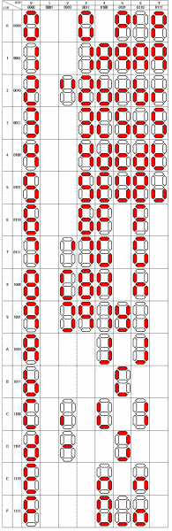](https://cdn.sparkfun.com/assets/2/a/0/1/6/51e8698bce395f2b3c000001.png)

例如，要显示 *12Ab* ，您可以发送各种 4 字节模式:

*   实际字节值 1、2、10 和 11: `[0x01] [0x02] [0x0A] [0x0B]`
*   “1”、“2”、“a”和“b”的 ASCII 值:`[0x31] [0x32] [0x41] [0x42]`
*   或者可以使用二进制和 ASCII 值的任意组合:`[0x01] [0x32] [0x41] [0x0B]`等。

[](https://cdn.sparkfun.com/assets/b/6/3/7/7/51e86a22ce395f7d3c000001.png)

#### 光标

显示数据的另一个控制因素是光标，它决定下一条接收到的显示数据将在哪里显示。你看不见它，但它就在那里。当 S7S 启动时，它会将光标设置到最左边的数字。每个可显示的数据都将光标右移一位，直到从第四位绕到第一位。上述示例假设光标位于最左边的数字。否则，显示器可能会显示 *2Ab1* 、 *Ab12* 或 *b12A* 。

### 特殊命令

存在特殊命令来执行显示器上不可显示的动作。清除显示、设置光标和打开/关闭小数点等操作都是使用特殊命令触发的。在某些情况下，特殊命令后应跟随一个命令数据字节。

有关可用命令的完整参考，请查看数据手册的[特殊命令部分](https://github.com/sparkfun/Serial7SegmentDisplay/wiki/Special-Commands)。让我们来看看一些更有用的命令:清晰显示和光标控制。

#### 清除显示

清除显示命令是单字节值 **0x76** 。当显示器接收到该值时，执行两个动作:(1)关闭显示器上的所有内容(段和小数点)，以及(2)光标复位到最左边的数字。在上面的示例中，如果您希望在显示数据开始进入时保证光标位于显示屏的最左侧，此命令非常有用。

#### 光标控制

光标控制命令是一个命令字节后必须跟随数据字节的好例子。光标命令是 **0x79** ，但是紧随其后的应该是另一个字节，代表你希望光标采取的位置(例如，0 代表最左边，3 代表最右边)。例如，要将光标设置在左起第三位，发送`0x79`，然后发送`0x02`。

下面是这些命令、它们的命令字节值以及它们可能需要的任何数据字节的快速表格:

| **特殊命令** | **命令字节** | **数据字节范围** | **数据字节描述** |
| [清除显示](https://github.com/sparkfun/Serial7SegmentDisplay/wiki/Special-Commands#wiki-clear) | 0x76 | 没有人 |   |
| [十进制控制](https://github.com/sparkfun/Serial7SegmentDisplay/wiki/Special-Commands#wiki-decimal) | 0x77 | 0-63 | 1-bit per decimal |
| [光标控制](https://github.com/sparkfun/Serial7SegmentDisplay/wiki/Special-Commands#wiki-cursor) | 0x79 | 0-3 | 0 =最左侧，3 =最右侧 |
| [亮度控制](https://github.com/sparkfun/Serial7SegmentDisplay/wiki/Special-Commands#wiki-brightness) | 0x7A | 0-255 | 0 =最暗，255 =最亮 |
| [数字 1 控制](https://github.com/sparkfun/Serial7SegmentDisplay/wiki/Special-Commands#wiki-individual) | 0x7B | 0-127 | 每段 1 位 |
| [数字 2 控制](https://github.com/sparkfun/Serial7SegmentDisplay/wiki/Special-Commands#wiki-individual) | 0x7C | 0-127 | 每段 1 位 |
| [数字 3 控制](https://github.com/sparkfun/Serial7SegmentDisplay/wiki/Special-Commands#wiki-individual) | 0x7D | 0-127 | 每段 1 位 |
| [数字 4 控制](https://github.com/sparkfun/Serial7SegmentDisplay/wiki/Special-Commands#wiki-individual) | 0x7E | 0-127 | 每段 1 位 |
| [波特率配置](https://github.com/sparkfun/Serial7SegmentDisplay/wiki/Special-Commands#wiki-baud) | 0x7F | 0-11 | 参见数据手册中的波特率命令 |
| [I ² C 地址配置](https://github.com/sparkfun/Serial7SegmentDisplay/wiki/Special-Commands#wiki-i2cAddress) | 0x80 | 1-126 | 新的 I ² C 地址 |
| [工厂重置](https://github.com/sparkfun/Serial7SegmentDisplay/wiki/Special-Commands#wiki-reset) | 0x81 | 没有人 |   |

* * *

足够的概念性的东西。让我们来看一些例子！

## 示例 1:串行 UART

如果你想把电线减到最少，串行是一个很好的通信方法。如果你要将 S7S 连接到 Arduino，我真的建议你利用**软件串行库**(包含在 Arduino 中)与显示器通信，而不是连接到硬件串行引脚(D0，D1)。这将确保没有[总线竞争](../serial-communication/common-pitfalls#busContention)，更重要的是，它确保你的显示器不会接收到任何只属于你的 Arduino 的数据。

本例需要在 Arduino 和 S7S 之间使用三根电线(两根电源线，一根数据线)。像这样挂上去:

[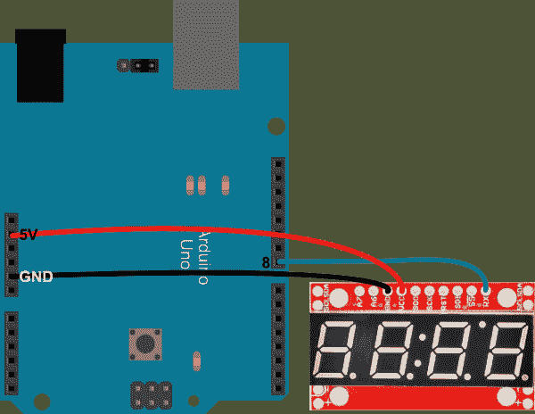](https://cdn.sparkfun.com/assets/7/5/e/0/6/51e86ba2ce395fe23b000002.png)

事实上，您可以使用任何数字引脚作为 Arduino 的软件 TX 引脚。只要确保在代码中更改它。说到代码复制/过去这个，或者你可以从[这里](https://cdn.sparkfun.com/assets/5/1/f/5/7/51e86bfece395f653c000004.zip)下载:

```
language:c
/* Serial 7-Segment Display Example Code
    Serial Mode Stopwatch
   by: Jim Lindblom
     SparkFun Electronics
   date: November 27, 2012
   license: This code is public domain.

   This example code shows how you could use software serial
   Arduino library to interface with a Serial 7-Segment Display.

   There are example functions for setting the display's
   brightness, decimals and clearing the display.

   The print function is used with the SoftwareSerial library
   to send display data to the S7S.

   Circuit:
   Arduino -------------- Serial 7-Segment
     5V   --------------------  VCC
     GND  --------------------  GND
      8   --------------------  RX
*/
#include <SoftwareSerial.h>

// These are the Arduino pins required to create a software seiral
//  instance. We'll actually only use the TX pin.
const int softwareTx = 8;
const int softwareRx = 7;

SoftwareSerial s7s(softwareRx, softwareTx);

unsigned int counter = 0;  // This variable will count up to 65k
char tempString[10];  // Will be used with sprintf to create strings

void setup()
{
  // Must begin s7s software serial at the correct baud rate.
  //  The default of the s7s is 9600.
  s7s.begin(9600);

  // Clear the display, and then turn on all segments and decimals
  clearDisplay();  // Clears display, resets cursor
  s7s.print("-HI-");  // Displays -HI- on all digits
  setDecimals(0b111111);  // Turn on all decimals, colon, apos

  // Flash brightness values at the beginning
  setBrightness(0);  // Lowest brightness
  delay(1500);
  setBrightness(127);  // Medium brightness
  delay(1500);
  setBrightness(255);  // High brightness
  delay(1500);

  // Clear the display before jumping into loop
  clearDisplay();  
}

void loop()
{
  // Magical sprintf creates a string for us to send to the s7s.
  //  The %4d option creates a 4-digit integer.
  sprintf(tempString, "%4d", counter);

  // This will output the tempString to the S7S
  s7s.print(tempString);
  setDecimals(0b00000100);  // Sets digit 3 decimal on

  counter++;  // Increment the counter
  delay(100);  // This will make the display update at 10Hz.
}

// Send the clear display command (0x76)
//  This will clear the display and reset the cursor
void clearDisplay()
{
  s7s.write(0x76);  // Clear display command
}

// Set the displays brightness. Should receive byte with the value
//  to set the brightness to
//  dimmest------------->brightest
//     0--------127--------255
void setBrightness(byte value)
{
  s7s.write(0x7A);  // Set brightness command byte
  s7s.write(value);  // brightness data byte
}

// Turn on any, none, or all of the decimals.
//  The six lowest bits in the decimals parameter sets a decimal 
//  (or colon, or apostrophe) on or off. A 1 indicates on, 0 off.
//  [MSB] (X)(X)(Apos)(Colon)(Digit 4)(Digit 3)(Digit2)(Digit1)
void setDecimals(byte decimals)
{
  s7s.write(0x77);
  s7s.write(decimals);
} 
```

在该代码中，有用于设置显示器的亮度、小数和清除显示器的示例函数。查看函数和注释，了解更多细节。

草图从循环选择几个亮度开始，这样你就可以看到显示器在最暗和最亮时的样子。随后，它变成一个秒表，利用`s7s.print()`功能通过软件串行库向显示器发送数据。

## 示例 2: SPI

如果单条总线上要连接多个器件，SPI 是一种有用的通信方法。它比基本串行需要更多的线路，但它更可靠，因为它是一个同步接口。

在本例中，我们将只使用一台显示器。不过，要知道，您可以在同一 SPI 总线上添加更多显示器(或其它 SPI 器件)，每个器件只需要一个额外的 SS 引脚。

硬件设置如下:

[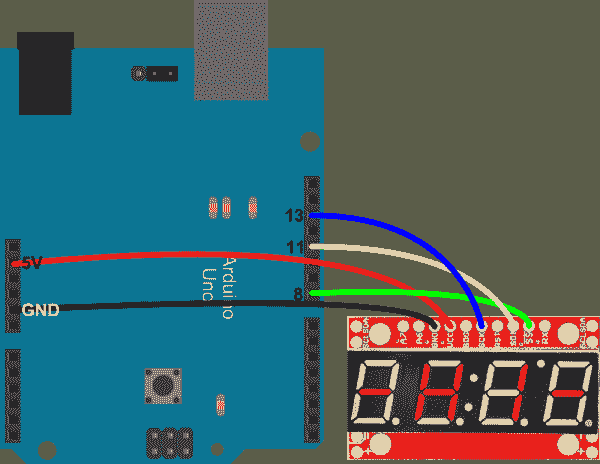](https://cdn.sparkfun.com/assets/9/9/b/4/9/51e86c4cce395ff93b000001.png)

SDI 和 SCK 引脚必须保持在 Arduino 上的位置，这些是硬件 SPI 引脚。SS 引脚可以移至任何数字引脚，只要在代码中进行了更改。

说到代码，从下面复制/粘贴，也可以点击[这里](https://cdn.sparkfun.com/assets/b/a/5/9/d/51e86c92ce395f703c000004.zip)下载成 zip 文件。

```
language:c
/* Serial 7-Segment Display Example Code
    SPI Mode Stopwatch
   by: Jim Lindblom
     SparkFun Electronics
   date: November 27, 2012
   license: This code is public domain.

   This example code shows how you could use the Arduino SPI 
   library to interface with a Serial 7-Segment Display.

   There are example functions for setting the display's
   brightness, decimals and clearing the display.

   The SPI.transfer() function is used to send a byte of the
   SPI wires. Notice that each SPI transfer(s) is prefaced by
   writing the SS pin LOW and closed by writing it HIGH.

   Each of the custom functions handle the ssPin writes as well
   as the SPI.transfer()'s.

   There's a custom function used to send a sequence of bytes
   over SPI - s7sSendStringSPI, which can be used somewhat like
   the serial print statements.

   Circuit:
   Arduino -------------- Serial 7-Segment
     5V   --------------------  VCC
     GND  --------------------  GND
      8   --------------------  SS
     11   --------------------  SDI
     13   --------------------  SCK
*/
#include <SPI.h> // Include the Arduino SPI library

// Define the SS pin
//  This is the only pin we can move around to any available
//  digital pin.
const int ssPin = 8;

unsigned int counter = 0;  // This variable will count up to 65k
char tempString[10];  // Will be used with sprintf to create strings

void setup()
{
  // -------- SPI initialization
  pinMode(ssPin, OUTPUT);  // Set the SS pin as an output
  digitalWrite(ssPin, HIGH);  // Set the SS pin HIGH
  SPI.begin();  // Begin SPI hardware
  SPI.setClockDivider(SPI_CLOCK_DIV64);  // Slow down SPI clock
  // --------

  // Clear the display, and then turn on all segments and decimals
  clearDisplaySPI();  // Clears display, resets cursor

  // Custom function to send four bytes via SPI
  //  The SPI.transfer function only allows sending of a single
  //  byte at a time.
  s7sSendStringSPI("-HI-");
  setDecimalsSPI(0b111111);  // Turn on all decimals, colon, apos

  // Flash brightness values at the beginning
  setBrightnessSPI(0);  // Lowest brightness
  delay(1500);
  setBrightnessSPI(255);  // High brightness
  delay(1500);

  // Clear the display before jumping into loop
  clearDisplaySPI();  
}

void loop()
{
  // Magical sprintf creates a string for us to send to the s7s.
  //  The %4d option creates a 4-digit integer.
  sprintf(tempString, "%4d", counter);

  // This will output the tempString to the S7S
  s7sSendStringSPI(tempString);

  // Print the decimal at the proper spot
  if (counter < 10000)
    setDecimalsSPI(0b00000010);  // Sets digit 3 decimal on
  else
    setDecimalsSPI(0b00000100);

  counter++;  // Increment the counter
  delay(10);  // This will make the display update at 100Hz.*/
}

// This custom function works somewhat like a serial.print.
//  You can send it an array of chars (string) and it'll print
//  the first 4 characters in the array.
void s7sSendStringSPI(String toSend)
{
  digitalWrite(ssPin, LOW);
  for (int i=0; i<4; i++)
  {
    SPI.transfer(toSend[i]);
  }
  digitalWrite(ssPin, HIGH);
}

// Send the clear display command (0x76)
//  This will clear the display and reset the cursor
void clearDisplaySPI()
{
  digitalWrite(ssPin, LOW);
  SPI.transfer(0x76);  // Clear display command
  digitalWrite(ssPin, HIGH);
}

// Set the displays brightness. Should receive byte with the value
//  to set the brightness to
//  dimmest------------->brightest
//     0--------127--------255
void setBrightnessSPI(byte value)
{
  digitalWrite(ssPin, LOW);
  SPI.transfer(0x7A);  // Set brightness command byte
  SPI.transfer(value);  // brightness data byte
  digitalWrite(ssPin, HIGH);
}

// Turn on any, none, or all of the decimals.
//  The six lowest bits in the decimals parameter sets a decimal 
//  (or colon, or apostrophe) on or off. A 1 indicates on, 0 off.
//  [MSB] (X)(X)(Apos)(Colon)(Digit 4)(Digit 3)(Digit2)(Digit1)
void setDecimalsSPI(byte decimals)
{
  digitalWrite(ssPin, LOW);
  SPI.transfer(0x77);
  SPI.transfer(decimals);
  digitalWrite(ssPin, HIGH);
} 
```

这个例子很像串行版本。上例中的`s7s.print()`功能被 SPI 传输所取代。注意，每次`SPI.transfer()`发生时，SS 引脚会被两个`digitalWrite()`覆盖。SS 引脚必须变为低电平，让显示器知道有可用数据输入。一旦 SS 回到高电平，显示器将知道不再有数据发送给它。

## 例子 3: I2C

最后， [I ² C](https://learn.sparkfun.com/tutorials/i2c) 。我 ² C 是一种非常有效的交流方式，但也是这里讨论的三种方式中最复杂的一种。不过，令人高兴的是，Arduino 有一个很棒的库(Wire)来处理所有讨厌的 I ² C 东西。

I ² C - a 数据线(SDA)和时钟线(SCL)只需要两根数据线。别忘了权力！以下是如何连接它:

[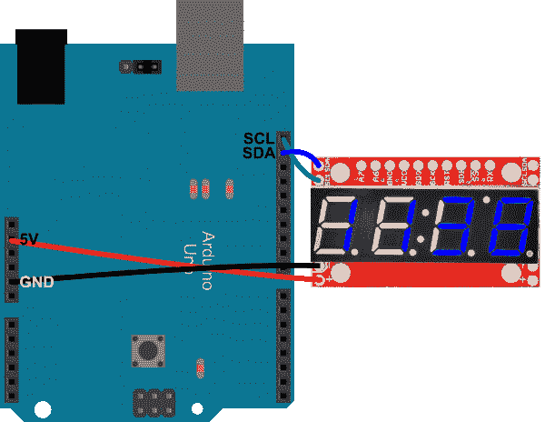](https://cdn.sparkfun.com/assets/7/e/9/f/f/51e86cf7ce395f3b3c000001.png)

这种引脚配置没有任何弹性；你必须使用硬件 I ² C 引脚。旧的 Arduinos 可能没有专用的 SDA 和 SCL 引脚。它们应该还在那里，分别在 A4 和 A5 针上。

您可能已经注意到，S7S 的两侧都有 I ² C 引脚(以及电源引脚)。如果你想在一条 I ² C 总线上将许多 S7 连接在一起，这些是很有用的。多亏了 I ² C 的寻址方案，你可以用这两个 I ² C 引脚链接大量的串行 7 段显示器。如果你在做一个国债钟的话应该会有用！

这里有一些示例代码，使用 I ² C(在这里下载)。该功能可与上两个示例草图相媲美:

```
language:c
/* Serial 7-Segment Display Example Code
    I2C Mode Stopwatch
   by: Jim Lindblom
     SparkFun Electronics
   date: November 27, 2012
   license: This code is public domain.

   This example code shows how you could use the Arduino Wire 
   library to interface with a Serial 7-Segment Display.

   There are example functions for setting the display's
   brightness, decimals, clearing the display, and sending a 
   series of bytes via I2C.

   Each I2C transfer begins with a Wire.beginTransmission(address)
   where address is the 7-bit address of the device set to 
   receive the data. Wire.write() sends a byte of data. I2C
   communication is closed with Wire.endTransmission().

   Circuit:
   Arduino -------------- Serial 7-Segment
     5V   --------------------  VCC
     GND  --------------------  GND
     SDA  --------------------  SDA (A4 on older 'duino's)
     SCL  --------------------  SCL (A5 on older 'duino's)
*/
#include <Wire.h> // Include the Arduino SPI library

// Here we'll define the I2C address of our S7S. By default it
//  should be 0x71\. This can be changed, though.
const byte s7sAddress = 0x71;

unsigned int counter = 9900;  // This variable will count up to 65k
char tempString[10];  // Will be used with sprintf to create strings

void setup()
{
  Wire.begin();  // Initialize hardware I2C pins

  // Clear the display, and then turn on all segments and decimals
  clearDisplayI2C();  // Clears display, resets cursor

  // Custom function to send four bytes via I2C
  //  The I2C.write function only allows sending of a single
  //  byte at a time.
  s7sSendStringI2C("-HI-");
  setDecimalsI2C(0b111111);  // Turn on all decimals, colon, apos

  // Flash brightness values at the beginning
  setBrightnessI2C(0);  // Lowest brightness
  delay(1500);
  setBrightnessI2C(255);  // High brightness
  delay(1500);

  // Clear the display before jumping into loop
  clearDisplayI2C();  
}

void loop()
{
  // Magical sprintf creates a string for us to send to the s7s.
  //  The %4d option creates a 4-digit integer.
  sprintf(tempString, "%4d", counter);

  // This will output the tempString to the S7S
  s7sSendStringI2C(tempString);

  // Print the decimal at the proper spot
  if (counter < 10000)
    setDecimalsI2C(0b00000100);  // Sets digit 3 decimal on
  else
    setDecimalsI2C(0b00001000);

  counter++;  // Increment the counter
  delay(100);  // This will make the display update at 10Hz.*/
}

// This custom function works somewhat like a serial.print.
//  You can send it an array of chars (string) and it'll print
//  the first 4 characters in the array.
void s7sSendStringI2C(String toSend)
{
  Wire.beginTransmission(s7sAddress);
  for (int i=0; i<4; i++)
  {
    Wire.write(toSend[i]);
  }
  Wire.endTransmission();
}

// Send the clear display command (0x76)
//  This will clear the display and reset the cursor
void clearDisplayI2C()
{
  Wire.beginTransmission(s7sAddress);
  Wire.write(0x76);  // Clear display command
  Wire.endTransmission();
}

// Set the displays brightness. Should receive byte with the value
//  to set the brightness to
//  dimmest------------->brightest
//     0--------127--------255
void setBrightnessI2C(byte value)
{
  Wire.beginTransmission(s7sAddress);
  Wire.write(0x7A);  // Set brightness command byte
  Wire.write(value);  // brightness data byte
  Wire.endTransmission();
}

// Turn on any, none, or all of the decimals.
//  The six lowest bits in the decimals parameter sets a decimal 
//  (or colon, or apostrophe) on or off. A 1 indicates on, 0 off.
//  [MSB] (X)(X)(Apos)(Colon)(Digit 4)(Digit 3)(Digit2)(Digit1)
void setDecimalsI2C(byte decimals)
{
  Wire.beginTransmission(s7sAddress);
  Wire.write(0x77);
  Wire.write(decimals);
  Wire.endTransmission();
} 
```

现在，上一个示例中的`SPI.transfer()`被替换为`Wire.write()`，我们使用`Wire.beginTransmission(address)`和`Wire.endTransmission()`，而不是切换 SS 引脚。很简单！

## 解决纷争

### 默认固件版本 3.1

如果您在通过 Arduino IDE 将最新的默认固件上传到较小的(10 毫米)支持串行的 7 段显示器时遇到问题，请尝试使用 GitHub v3.1 分支中的旧版本固件。这与我们生产部门使用的固件相同。

[Serial7SegmentDisplay Default Firmware v3.1](https://github.com/sparkfun/Serial7SegmentDisplay/tree/v3.1_live/firmware/Serial%207-Segment%20Display/Serial_7_Segment_Display_Firmware)

### 工厂重置

串行 UART 示例、SPI 和/或 I2C 示例代码有问题吗？您可以通过以下方式，在 7 段串行显示器上使用微控制器尝试恢复出厂设置:

*   [通过串口发送特殊命令](https://github.com/sparkfun/Serial7SegmentDisplay/wiki/Special-Commands#reset)
*   [用 FTDI 重新加载固件](https://github.com/sparkfun/Serial7SegmentDisplay/wiki/Customizing%20the%20Display)

如果您认为较小的(10 毫米)7 段串行显示器的固件已损坏，您也可以重新安装 Arduino 引导程序。您可以使用 [AVR 编程器在串行启用的 7 段显示器](https://learn.sparkfun.com/tutorials/installing-an-arduino-bootloader)上刷新 ATmega328P。

**Quick ICSP Note from the Eagle Schematic:**

| 更小的(10 毫米)串行 7 段显示器 | AVR Programmer | Arduino Uno 作为 ISP |
| 战略防御计划(Strategic Defence Initiative) | MOSI | D11 |
| 英特尔的快速储存技术 | 英特尔的快速储存技术 | D10 |
| 血清肌酸激酶 | 血清肌酸激酶 | D13 |
| 合成干性油（synthetic drying oil 的缩写） | 味噌 | D12 |
| VCC | VCC | 5V |
| GND | GND | GND |

如果您使用主分支机构的最新默认固件，请确保您在*Serial _ 7 _ Segment _ Display _ firmware . ino*代码中定义了正确的`DISPLAY_TYPE`。这是在 GitHub 主分支的[39 号线上。只需将`OPENSEGMENT`更改为任何其他硬件布局。否则，如](https://github.com/sparkfun/Serial7SegmentDisplay/blob/master/firmware/Serial%207-Segment%20Display/Serial_7_Segment_Display_Firmware/Serial_7_Segment_Display_Firmware.ino#L39) [Arduino 论坛:Arduino Uno - 7 段屏蔽问题](http://forum.arduino.cc/index.php?topic=222472.0)中所述，显示屏显示“0000”。

### 微控制器向串行 7 段显示器发送命令太快

如果您在使用串行启用的 7 段显示器时遇到问题，其中 led 闪烁并显示随机数，这可能是您编写代码的方式造成的。有一次，技术支持人员在使用一系列命令来清除屏幕、设置模式、设置亮度和调整光标后遇到了这种情况。

使用 5V RedBoard 进行测试，似乎已修复的主要问题是删除 clearDisplay()函数，并在设置亮度和光标位置之间添加延迟。闪烁可能是由于在你的主函数中清空屏幕并写回屏幕。通过避免每次我的主函数循环返回时清除屏幕功能，串行使能的 7 段更好地显示计数器。通过增加 1 毫秒的延迟，串行启用的 7 段停止显示随机数和闪烁。串行启用的 7 段显示器可能没有足够的时间来设置整个显示器的亮度。添加延迟可能有助于在进入下一个命令之前完成该功能。

```
language:c
.
.
.
void loop(){
//1) Reset Command (0x76) in a one byte write (one CS cycle)
//clearDisplaySPI(); //try not to use so much, will cause flickering when constantly clearing and displaying

//2) Mode Command (0x82) followed by Data Mode (0x00) in a two byte write (one CS cycle)
digitalWrite(ssPin, LOW);
SPI.transfer(0x82);//command character for mode
SPI.transfer(0x00);//data mode
digitalWrite(ssPin, HIGH);

//3) Brightness Command (0x7A) followed by Value (0xC0) in a two byte write (one CS cycle)
/*make sure to have the modular setBrightnessSPI()function defined
from the example code => https://learn.sparkfun.com/tutorials/using-the-serial-7-segment-display/example-2-spi */
setBrightnessSPI(0xC0);//brightness 0xC0 = 0d192
delay(1);//add delay to finish this function before moving on

//4) Cursor Position Command (0x79) followed by Value (0x00) in a two byte write (one CS cycle)
digitalWrite(ssPin, LOW);
SPI.transfer(0x79);//command character cursor position
SPI.transfer(0x00);//cursor position on the left most position
digitalWrite(ssPin, HIGH);

//rest of SPI example code with Arduino
.
.
. 
```

### Arduino 编译问题 w/ "0 "

如果你试图发送一个特殊的命令和一个数据字节`0`，编译器不会喜欢:

```
language:c
Serial.write(0x0); 
```

它将输出类似如下的错误:

```
language:c
... error: call of overloaded 'write(int)' is ambiguous
C:\Program Files (x86)\Arduino\libraries\SoftwareSerial/SoftwareSerial.h:123: note: candidates are: virtual size_t SoftwareSerial::write(uint8_t)
C:\Program Files (x86)\Arduino\hardware\arduino\cores\arduino/Print.h:49: note:                 size_t Print::write(const char*) 
```

值 **0x00** 没有具体定义，因此它可以是`char(NULL)`、`int`或`byte`。编译器不明白你指的是什么。要解决这个问题，请尝试将该字节保存到一个已定义的变量中，并与类似下面的`Serial.write()`函数一起使用:

```
language:c
byte zero = 0;
.
.
.
Serial.write(zero); 
```

### 其他微控制器上的默认 I2C 地址

Arduino I2C 库使用 7 位寻址[[https://www.arduino.cc/en/reference/wire](https://www.arduino.cc/en/reference/wire)]。库忽略最后一位，因为有一个函数用于读或写。Arduino 生态系统之外的其他开发板可能需要不同的寻址技术。这一点在《I2C 示范法》中有简要说明:

```
language:c
Please Note: 0x71 is the 7-bit I2C address. 
```

如果您使用的是 Arduino 以外的其他语言，您可能需要在地址的末尾添加读/写位。这意味着开放段的**默认读地址**是`0b.1110.0011`或`0xE3`，而**写地址**是`0b.1110.0010`或`0xE2`。想了解更多信息，请查看我们关于 I2C 的教程。

## 资源和更进一步

既然您已经习惯使用串行 7 段显示器之一，那么是时候将它整合到您自己的项目中了！

有关 7 段显示器的更多信息，请查看[系列 7 段 github 知识库](https://github.com/sparkfun/Serial7SegmentDisplay)。在那里你会发现:

*   [数据表](https://github.com/sparkfun/Serial7SegmentDisplay/wiki/Serial-7-Segment-Display-Datasheet) -包含使用显示器所需的所有信息的 Wiki。
*   Arduino 示例代码丰富 -我们对测试代码有点疯狂。你会在这里找到有用的东西。
*   [固件](https://github.com/sparkfun/Serial7SegmentDisplay/tree/master/firmware/Serial%207-Segment%20Display/Serial_7_Segment_Display_Firmware) -如果你对修改 S7S 的行为感兴趣，一定要看看固件(用 Arduino 写的)。
    *   除了固件，您还需要将 [SevSeg 库](https://github.com/sparkfun/SevSeg)添加到您的 Arduino 安装中。
*   [硬件](https://github.com/sparkfun/Serial7SegmentDisplay/tree/master/hardware)——Eagle 文件托管在这里。你想制作你自己版本的显示器吗？去吧！这是一个开源项目。

### 其他教程和示例

例如，在 Raspberry Pi、I2C 和 Python 中使用串行 7 段显示，请查看本教程:

[Derek Scholten's Blog: Raspberry Pi SparkFun 7 Segment Display Clock](http://www.derekscholten.com/2013/09/02/raspberry-pi-sparkfun-7-segment-display-clock/)

如需使用 7 段串行显示器和 Raspberry Pi、I2C 和 MatLab 支持包的示例，请查看本教程:

[MathWorks®: Controlling a 4-Digit 7-Segment display Using I2C](https://www.mathworks.com/examples/matlab/mw/raspberrypiio_product-raspi_segmented_display_using_i2c-controlling-a-4-digit-7-segment-display-using-i2c)

你的下一个项目需要一些灵感吗？查看一些相关教程:

[](https://learn.sparkfun.com/tutorials/using-opensegment) [### 使用开放段](https://learn.sparkfun.com/tutorials/using-opensegment) How to hook up and use the OpenSegment display shield. The OpenSegment is the big brother to the Serial 7-Segment Display. They run on the same firmware, however the OpenSegment is about twice as big.[Favorited Favorite](# "Add to favorites") 6[](https://learn.sparkfun.com/tutorials/dungeons-and-dragons-dice-gauntlet) [### 龙与地下城骰子战书](https://learn.sparkfun.com/tutorials/dungeons-and-dragons-dice-gauntlet) A playful, geeky tutorial for a leather bracer that uses a LilyPad Arduino, LilyPad accelerometer, and seven segment display to roll virtual 4, 6, 8, 10, 12, 20, and 100 side dice for gaming.[Favorited Favorite](# "Add to favorites") 9[](https://learn.sparkfun.com/tutorials/reaction-timer) [### 反应速度测量器](https://learn.sparkfun.com/tutorials/reaction-timer) Demonstrate mental chronometry with this simple reaction timer 11[](https://learn.sparkfun.com/tutorials/alphanumeric-gps-wall-clock) [### 字母数字 GPS 挂钟](https://learn.sparkfun.com/tutorials/alphanumeric-gps-wall-clock) This is a GPS controlled clock - a clock you truly never have to set! Using GPS and some formulas, we figure out what day of the week and if we are in or out of daylight savings time.[Favorited Favorite](# "Add to favorites") 13[](https://learn.sparkfun.com/tutorials/large-digit-driver-hookup-guide) [### 大数字驱动器连接指南](https://learn.sparkfun.com/tutorials/large-digit-driver-hookup-guide) Getting started guide for the Large Digit display driver board. This tutorial explains how to solder the module (backpack) onto the back of the large 7-segment LED display and run example code from an Arduino.[Favorited Favorite](# "Add to favorites") 11[](https://learn.sparkfun.com/tutorials/building-a-safe-cracking-robot) [### 建造一个安全的破解机器人](https://learn.sparkfun.com/tutorials/building-a-safe-cracking-robot) How to crack an unknown safe in under an hour.[Favorited Favorite](# "Add to favorites") 21

做大吗？也许你想建造一个大型的 12 英寸 GPS 挂钟装置:

[](https://cdn.sparkfun.com/assets/home_page_posts/1/8/7/9/19483662619_03adbc890c_k__1_.jpg)Updated GPS Wall Clock in the SparkFun Emporium Based on the Old [12" GPS Wall Clock Tutorial](https://www.sparkfun.com/tutorials/47)

有关 SparkFun 商场更新的 GPS 时钟的更多信息，请查看 [Big_GPS_Clock GitHub repo](https://github.com/sparkfun/Big_GPS_Clock) 。

或者看看下面的博客。

[](https://www.sparkfun.com/news/3086 "September 5, 2019: The trail-ready lightning detector has been out in the wild getting some good use. As summer nears its end, it is a great time to take the project back to the drawing board and figure out what should be upgraded, what should be added and what can be removed – just in time for some fall outdoor adventures!") [### 今日英语:升级闪电探测器

September 5, 2019](https://www.sparkfun.com/news/3086 "September 5, 2019: The trail-ready lightning detector has been out in the wild getting some good use. As summer nears its end, it is a great time to take the project back to the drawing board and figure out what should be upgraded, what should be added and what can be removed – just in time for some fall outdoor adventures!")[Favorited Favorite](# "Add to favorites") 3