# 可变负载连接指南-修订版

> 原文：<https://learn.sparkfun.com/tutorials/variable-load-hookup-guide---revised>

## 介绍

**Note:** This guide is for the latest version of the Variable Load's firmware. If you have an **older version (purchased prior to 24 May 2018)**, or if your board doesn't behave in the way suggested by this tutorial, please refer to [the older tutorial](https://learn.sparkfun.com/tutorials/variable-load-hookup-guide).

SparkFun 的[可变负载板](https://www.sparkfun.com/products/14449)旨在允许用户从电压源汲取特定量的电流。它可以用来测试电源在各种负载下的稳定性、电池寿命、安全切断以及被测电源的其他设计元素。

可变负载可以测试高达 30V 的电源，电流范围从几毫安到 4A。为了安全起见，总负载功率被限制在 15W，即使在 15W 时，散热器也会变得非常热。可变负载被设计成可扩展的，带有用于基于基本字符的 LCD 的标题，因此它可以在不连接到 PC 的情况下使用。

[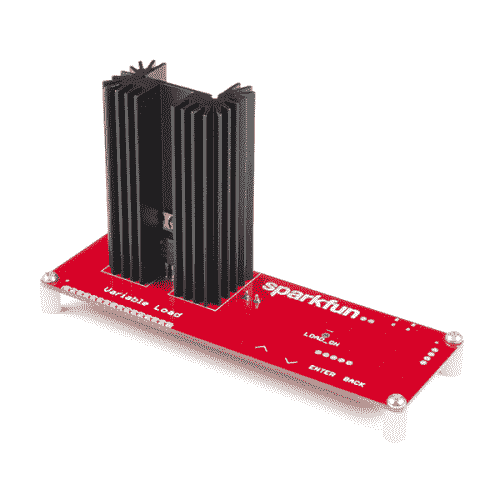](https://www.sparkfun.com/products/14449) 

将**添加到您的[购物车](https://www.sparkfun.com/cart)中！**

### [SparkFun 可变负载套件](https://www.sparkfun.com/products/14449)

[Only 13 left!](https://learn.sparkfun.com/static/bubbles/ "only 13 left!") KIT-14449

SparkFun 可变负载是一个快速组装套件，旨在允许用户提取特定数量的电流…

$48.501[Favorited Favorite](# "Add to favorites") 19[Wish List](# "Add to wish list")** **[https://www.youtube.com/embed/OWPisGTeeXQ/?autohide=1&border=0&wmode=opaque&enablejsapi=1](https://www.youtube.com/embed/OWPisGTeeXQ/?autohide=1&border=0&wmode=opaque&enablejsapi=1)

### 所需材料

除了下面链接的散热器散热化合物之外，套件中包含了遵循该连接指南所需的一切。如果你想添加一个液晶显示器，我们的任何 5V 字符液晶显示器都可以，如下链接。你还需要一些插头插脚。你可能不需要所有的东西，这取决于你拥有什么。将它添加到您的购物车，通读指南，并根据需要调整购物车。

[](https://www.sparkfun.com/products/116) 

将**添加到您的[购物车](https://www.sparkfun.com/cart)中！**

### [破开头球——直击](https://www.sparkfun.com/products/116)

[In stock](https://learn.sparkfun.com/static/bubbles/ "in stock") PRT-00116

一排标题-打破适应。40 个引脚，可切割成任何尺寸。用于定制 PCB 或通用定制接头。

$1.7520[Favorited Favorite](# "Add to favorites") 133[Wish List](# "Add to wish list")****[](https://www.sparkfun.com/products/10215) 

将**添加到您的[购物车](https://www.sparkfun.com/cart)中！**

### [USB micro-B 线- 6 脚](https://www.sparkfun.com/products/10215)

[In stock](https://learn.sparkfun.com/static/bubbles/ "in stock") CAB-10215

USB 2.0 型到微型 USB 5 针。这是一种新的、更小的 USB 设备连接器。微型 USB 连接器大约是…

$5.5014[Favorited Favorite](# "Add to favorites") 21[Wish List](# "Add to wish list")****[](https://www.sparkfun.com/products/709) 

将**添加到您的[购物车](https://www.sparkfun.com/cart)中！**

### [基本 16x2 字符 LCD -黑底白字 5V](https://www.sparkfun.com/products/709)

[In stock](https://learn.sparkfun.com/static/bubbles/ "in stock") LCD-00709

这是一个基本的 16 个字符的 2 行显示器，黑色背景，白色字符。运用非常 c…

$20.5013[Favorited Favorite](# "Add to favorites") 20[Wish List](# "Add to wish list")****[](https://www.sparkfun.com/products/255) 

将**添加到您的[购物车](https://www.sparkfun.com/cart)中！**

### [基本 16x2 字符 LCD -绿上黑 5V](https://www.sparkfun.com/products/255)

[In stock](https://learn.sparkfun.com/static/bubbles/ "in stock") LCD-00255

这是一个基本的 16 字符 2 行显示。绿色背景上的黑色文本。利用非常常见的 HD44780 并行…

$18.5015[Favorited Favorite](# "Add to favorites") 20[Wish List](# "Add to wish list")****[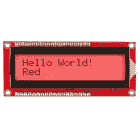](https://www.sparkfun.com/products/10862) 

将**添加到您的[购物车](https://www.sparkfun.com/cart)中！**

### [基本 16x2 字符 LCD - RGB 背光 5V](https://www.sparkfun.com/products/10862)

[In stock](https://learn.sparkfun.com/static/bubbles/ "in stock") LCD-10862

这类似于你以前见过的其他 16x2 字符液晶显示器，但有一个鲜明的区别:背光是真实的…

$18.503[Favorited Favorite](# "Add to favorites") 17[Wish List](# "Add to wish list")****[](https://www.sparkfun.com/products/9599) 

将**添加到您的[购物车](https://www.sparkfun.com/cart)中！**

### [散热片复合](https://www.sparkfun.com/products/9599)

[In stock](https://learn.sparkfun.com/static/bubbles/ "in stock") PRT-09599

这是一个 5g 白色散热化合物注射器(又名散热膏、散热膏、散热胶)。无论何时，你都可以用这个…

$2.45[Favorited Favorite](# "Add to favorites") 14[Wish List](# "Add to wish list")****[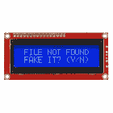](https://www.sparkfun.com/products/retired/790) 

### [基本型 16x2 字符 LCD -蓝上黄 5V](https://www.sparkfun.com/products/retired/790)

[Retired](https://learn.sparkfun.com/static/bubbles/ "Retired") LCD-00790

这是一个基本的 16 字符 2 行显示器，具有蓝色背景和黄色背光。利用非常普通的 H…

1 **Retired**[Favorited Favorite](# "Add to favorites") 2[Wish List](# "Add to wish list")************ **********### 所需工具

为了组装该套件，您将需要[标准焊接工具](https://www.sparkfun.com/categories/49)。任何质量和焊料合理的烙铁应该工作良好。要将晶体管安装到散热器上，需要一把十字螺丝刀。

[](https://www.sparkfun.com/products/9146) 

将**添加到您的[购物车](https://www.sparkfun.com/cart)中！**

### [SparkFun 迷你螺丝刀](https://www.sparkfun.com/products/9146)

[In stock](https://learn.sparkfun.com/static/bubbles/ "in stock") TOL-09146

这只是你的基本可逆螺丝刀口袋大小！有平头和十字头可供选择。配有别针和…

$1.053[Favorited Favorite](# "Add to favorites") 11[Wish List](# "Add to wish list")** **## 装配

我们建议遵循该指南，以便轻松组装套件。

### 安装散热器

这可能看起来有点落后，但这是有原因的。我们希望确保散热器上的孔处于与晶体管上的孔相匹配的正确高度，并且散热器具有固定的高度，因此我们希望首先安装它。

[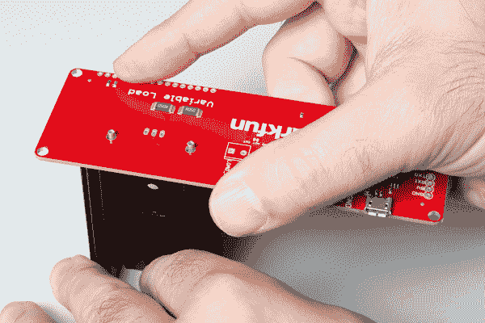](https://cdn.sparkfun.com/assets/learn_tutorials/6/8/2/Variable_Load_Sensor_Hookup_Guide-01.jpg)

请注意，焊接这些小块需要耐心和热情。如果你没有充分加热这些小块，焊料就不会很好地流过它们，你会得到一个黏糊糊的冷焊点。加热这些小块当然需要时间，因为它们连接在一个散热器上！坚持，不要气馁，如果焊料一开始不会流到小块上。给它很多时间。如果你有一个，一个大的，蹄型烙铁头是加热的最佳选择。

[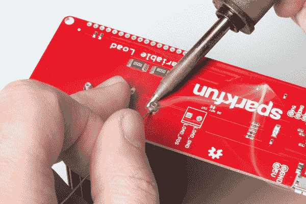](https://cdn.sparkfun.com/assets/learn_tutorials/6/8/2/Variable_Load_Sensor_Hookup_Guide-02.jpg)

还要注意，PCB 上没有裸露的铜焊盘。这是可以的，因为焊料会流过小块，向下通过小孔，形成一个紧密的配合。

[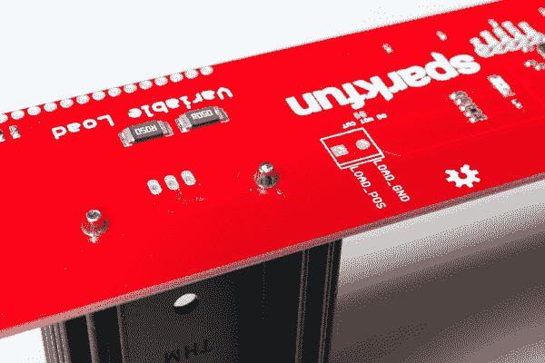](https://cdn.sparkfun.com/assets/learn_tutorials/6/8/2/Variable_Load_Sensor_Hookup_Guide-03.jpg)

### 安装端子板

这是安装端子板的好时机。注意它安装在电路板的哪一侧，以及带有丝网印刷的端子板的方向。

[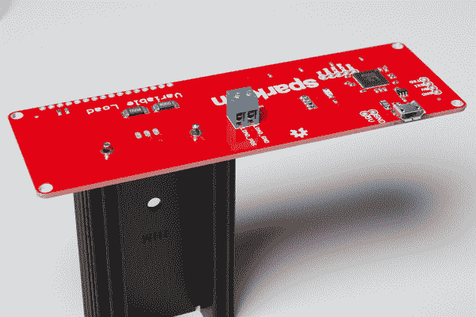](https://cdn.sparkfun.com/assets/learn_tutorials/6/8/2/Variable_Load_Sensor_Hookup_Guide-04.jpg)

焊接它应该是一个相当简单的努力。

### 将晶体管安装在散热器上

在晶体管背面涂抹少量散热膏。这将改善向散热器的热传递。

[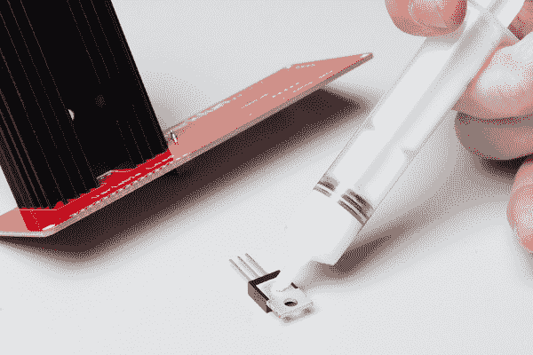](https://cdn.sparkfun.com/assets/learn_tutorials/6/8/2/Variable_Load_Sensor_Hookup_Guide-05.jpg)

然后，将 3/8" 4-40 机器螺丝穿过晶体管上的孔。将晶体管的引脚插入 PCB 上的孔中，向下滑动引脚，直到螺钉穿过散热器上的孔。

将 4-40 螺母拧到穿过散热器的螺钉上。

[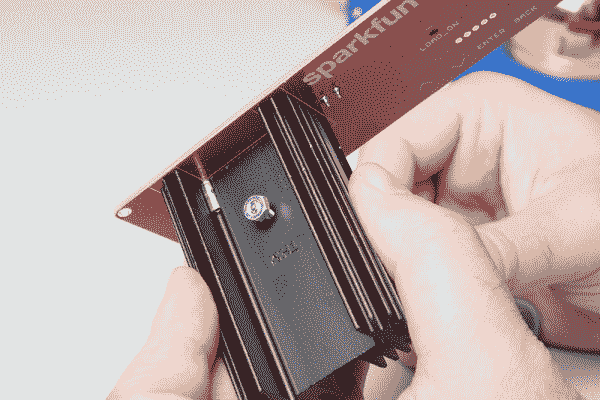](https://cdn.sparkfun.com/assets/learn_tutorials/6/8/2/Variable_Load_Sensor_Hookup_Guide-06.jpg)

拧紧螺母，直到拧紧为止。螺丝刀将有助于这个过程。不要过度拧紧螺钉。只需要比手指紧一点点。然后，翻转电路板，将晶体管引脚焊接到电路板上。

[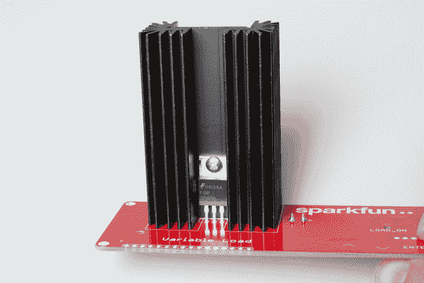](https://cdn.sparkfun.com/assets/learn_tutorials/6/8/2/Variable_Load_Sensor_Hookup_Guide-07.jpg)

将支架固定在电路板的角上。

[](https://cdn.sparkfun.com/assets/learn_tutorials/6/8/2/Variable_Load_Sensor_Hookup_Guide-15.jpg)

最后，将一根 micro-B 电缆连接到可变负载和您的计算机上，即可开始使用。

### 可选:安装 LCD 组件

如果您打算将可变负载与可选的 LCD 一起使用，现在是时候安装它了。

首先在 LCD 上安装割台。观察下图，了解正确的方向。

[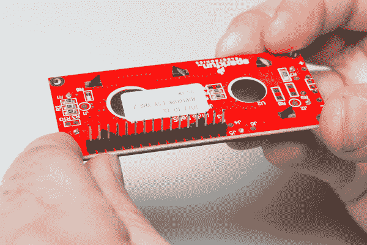](https://cdn.sparkfun.com/assets/learn_tutorials/6/8/2/Variable_Load_Sensor_Hookup_Guide-17.jpg)

我喜欢先钉上一根大头针。然后用一只手熔化引脚上的焊料，用另一只手确保接头与电路板成直角。焊接完所有引脚后，您可以将接头插入可变负载板并重复该过程。如下图所示焊接头部。

[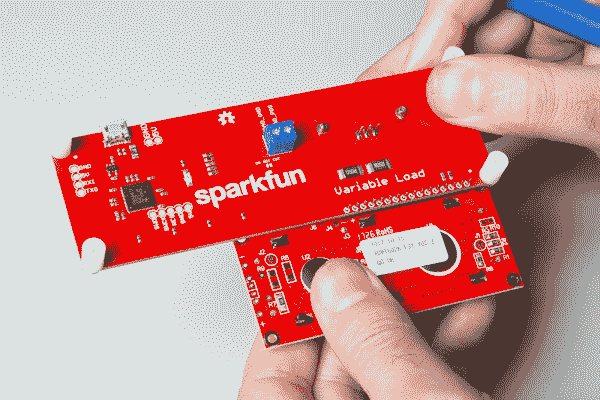](https://cdn.sparkfun.com/assets/learn_tutorials/6/8/2/Variable_Load_Sensor_Hookup_Guide-18.jpg)

液晶屏现已安装到位，通电后应该可以正常工作。将 micro-B USB 电缆连接到可变负载和您的计算机，即可开始使用。

[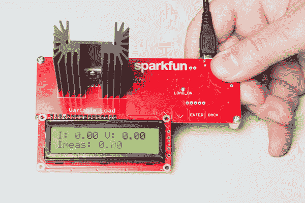](https://cdn.sparkfun.com/assets/learn_tutorials/6/8/2/Variable_Load_Sensor_Hookup_Guide-19.jpg)

## 操作

可变负载板设计用于两种输出模式之一。要么使用:

*   电脑上的反馈控制台
*   基本 16x2 字符液晶显示器

在任一情况下，可变负载 PCB 前面的电容式触摸按钮可用于更改设置。

### 一般操作

控制可变负载的主要方法是电路板正面的一组电容式触摸按钮。有四个按钮:向上箭头，向下箭头，“进入”和“返回”。向上和向下箭头键将按照当前设定值确定的步骤向上或向下调整当前设定值。设定值越高，步长越大。“输入”键打开或关闭负载而不影响设定值，“返回”按钮将设定值重置为零。

[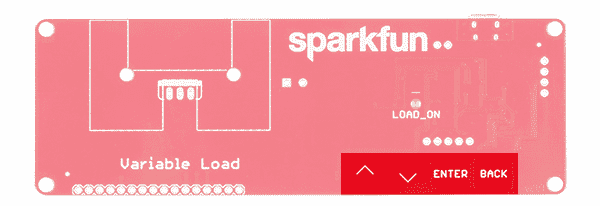](https://cdn.sparkfun.com/assets/learn_tutorials/6/8/2/14449-SparkFun_Variable_Load_Kit-03Buttons.jpg)

从电路板正面可以看到一个 LED，它会告诉您在任何给定时间负载是启用还是禁用。

[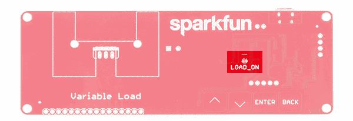](https://cdn.sparkfun.com/assets/learn_tutorials/6/8/2/14449-SparkFun_Variable_Load_Kit-03LED.jpg)

板卡的电压限制为 **40V** 。超过这个水平可能会损坏板上的电路。目前的限注是 **4A** ，而且在任何情况下，委员会都不会让你设置高于 4A 的限注。还有瓦数限制 **15W** ，按直播时间计算。正常情况下，当电压增加时，电流消耗保持不变，但是如果电压增加超过电压和电流乘积超过 15W 的点，输出将被禁用，直到电压再次下降到安全点。

### 使用控制台进行输出

**Note: The Arduino serial console will not work for this.** The Variable Load board uses VT100 terminal commands to draw its output and the Arduino console does **NOT** support VT100 emulation.

从查看我们的[串行终端基础知识](https://learn.sparkfun.com/tutorials/terminal-basics)教程开始。这将使您开始使用串行终端。打开一个串行终端程序(即 PuTTY)进行连接。

连接可变负载板时，您需要识别其端口名称。有几种方法可以确定可变负载板连接到哪个端口。

有一种方法可以确定可变负载板在哪个端口上，我推荐使用 Arduino IDE。在“工具”菜单下，有一个“端口”子菜单。由于我们已经将 USB 电缆连接到计算机的 COM 端口，请记下列出的端口名称上的项目。然后从电脑上拔下 micro-B USB 线。给它几秒钟，然后重新打开子菜单，看看有什么项目消失了。通过排除过程，我们可以确定变量 Load 枚举到的端口名称。重新连接电缆进行验证。端口名称应该以相同的名称重新出现在子菜单中。记住，Arduino IDE 的串行监视器不能与可变负载板一起工作。

#### Windows 操作系统

如果您没有安装 Arduino IDE，也不想安装它，您可以使用内建工具找到相同的信息。在 Windows 下，打开您的设备管理器(如果您不知道如何操作，请在线搜索特定于操作系统的信息，因为它在不同版本的 Windows 下略有不同)。记下列表中的设备，然后拔掉可变负载，看看列表中的哪个端口消失了。从列表中消失的端口就是您想要的端口。

[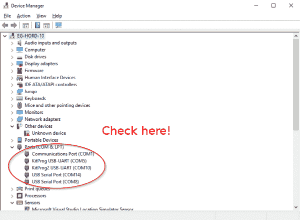](https://cdn.sparkfun.com/assets/learn_tutorials/6/5/8/dev_manager_1.png)

#### 苹果个人计算机

使用 Mac OS，您需要打开一个终端窗口。要确定可变负载连接到哪个端口，请键入以下命令:

```
language:bash
ls /dev/cu.usbserial-* 
```

这将返回系统上 USB 串行转换器端口的列表。记下列表中的设备，然后拔掉可变负载，看看列表中的哪个端口消失了。从列表中消失的端口就是您想要的端口。然后，您可以通过键入以下命令连接到有问题的端口:

```
language:bash
screen /dev/cu.usbserial-XXXXXXXX 115200 
```

其中 XXXXXXXXX 由从第一个命令收集的信息替换。

#### Linux 操作系统

在 Linux 下，这个过程类似于 Mac OS，只使用这个命令来识别串口:

```
language:bash
ls /dev/ttyUSB* 
```

您可以使用`screen`命令来连接可变负载:

```
language:bash
screen /dev/ttyUSBX 115200 
```

同样,“X”应该替换为从上面的`ls`命令中收集的信息。如果您收到一个关于没有安装`screen`的错误，您可以通过键入以下命令来安装`screen`:

```
language:bash
sudo apt-get install screen 
```

然后重新输入上述命令，通过`screen`进行连接。

### 控制台

这是连接可变负载时控制台的外观。它报告了五个值:

*   **I 源** -从源汲取的实际电流
*   **I 限值** -为负载设定的电流限值
*   **V 源** -可变负载板上的当前负载电压
*   **V Min** -负载切断前的当前最小电压
*   **毫安小时** -自上次复位以来从电源汲取的毫安小时数

[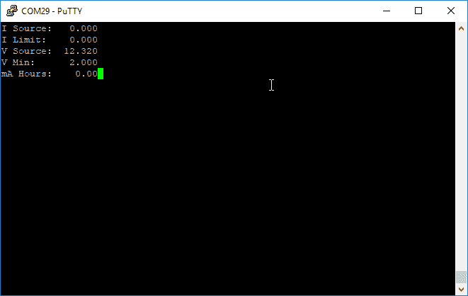](https://cdn.sparkfun.com/assets/learn_tutorials/7/8/0/console_view.png)**Not Case Sensitive:** The Variable Load board will accept lower case and capital letters from your keyboard. So if you were setting the current to 0.5 A for your load, you could type `i.5` and the `Enter` key. Or you could also type `I.5` followed by the `Enter` key..

#### 设定 I [极限值]和 V [最小值]

控制台可用于设定两个值: **I 极限**和 **V 最小**。要设置 **I 限制**，请键入“`I`”，后跟一个十进制值，然后按键盘上的`Enter`键。要设置 **V min** 电压，输入“`V`”，然后输入一个十进制值，并按下`Enter`键。

#### 转动负载和设置 mAh

控制台也可用于启用或禁用电源。只需键入“`E1`”，然后按`Enter`键，即可打开电源。键入“`E0`或“`E`”，然后按`Enter`键，将关闭电源。也可用于重置从电源获取的能量数量(mAh 数)-键入“`R`并点击`Enter`。

#### 引导加载程序模式

最后，控制台用于将设备置于可引导模式。输入“`B`”，然后按下`Enter`键，板卡将自动重置为引导模式。PSoC Creator 中的 bootloader 主机应用程序可用于将新代码加载到主板上。

### 使用液晶显示器

LCD 输出非常类似于控制台，除了稍微不太详细以适合其上的数据。你可以同时使用控制台和液晶显示器，但这有点违背了使用液晶显示器的目的。当单独使用 LCD 时，你必须依靠板上的按钮来控制设定点。

[](https://cdn.sparkfun.com/assets/learn_tutorials/6/8/2/Variable_Load_Sensor_Hookup_Guide-19.jpg)

## 更改固件

产品的 [GitHub 页面上提供了所有固件。只要您的主板具有最新的固件，您就可以使用主板上的引导加载程序根据需要定制固件，而无需使用编程电缆。在 2018 年 5 月 24 日之前发货的**主板上**没有**有引导程序吗？**](https://github.com/sparkfun/Variable_Load)

### PSoC 创建者

**Note:** To build and edit the firmware, you'll need to download [Cypress' PSoC Creator IDE](http://www.cypress.com/products/psoc-creator-integrated-design-environment-ide). When writing this tutorial, *PSoC Creator v4.2* was used. Using Creator is outside the scope of this tutorial. However, we do have [some content on using Creator](https://learn.sparkfun.com/tutorials/freesoc2-hookup-guide-v14#getting-started-with-psoc-creator) in our FreeSoC2 Hookup Guide, and Cypress has a [good quickstart guide available](http://www.cypress.com/file/44826/download).

从 GitHub 资源库下载并解压缩可变负载板的文件。

[Download GitHub Repository for Variable_Load (ZIP)](https://github.com/sparkfun/Variable_Load/archive/master.zip)

在 PSoC Creator 中打开 *Variable_Load.cyprj* 项目文件。在构建配置下，将其设置为**发布**模式。

[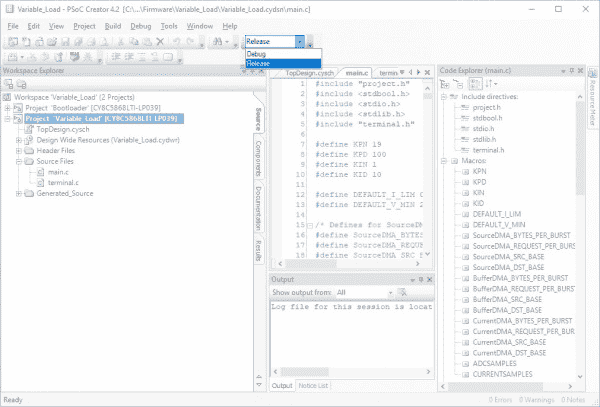](https://cdn.sparkfun.com/assets/learn_tutorials/7/8/0/PSoC_Creator_Build_Configuration_Release_Mode.jpg)

在菜单栏中选择**Build>Build All Projects**为项目生成文件。我们感兴趣的是 bootloader 的应用程序文件( *Variable_Load.cyacd* )，稍后会用到。

[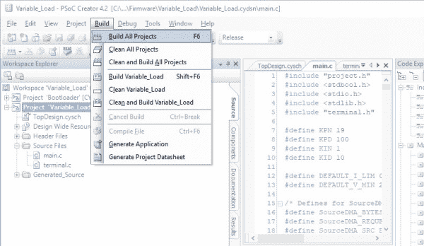](https://cdn.sparkfun.com/assets/learn_tutorials/7/8/0/PSoC_Creator_BuildAllProjects.jpg)

### 进入引导加载程序模式

要将板置于引导加载模式，打开连接到板的控制台，键入“`B`”并点击`Enter`。控制台将失去连接，板将使用不同的端口号重新编号。您现在可以引导加载电路板了。

### 使用引导加载程序主机应用程序

要打开 bootloader 主机应用程序，在 PSoC Creator 中打开“**工具**菜单，并选择“ **Bootloader 主机”...**”。

[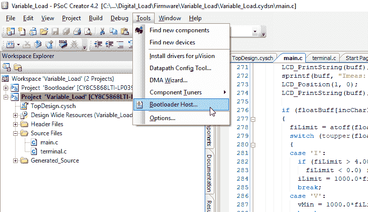](https://cdn.sparkfun.com/assets/learn_tutorials/7/8/0/bootloader_host_menu_option.png)

将出现此窗口。在列表中为您的主板选择新的 COM 端口号。

[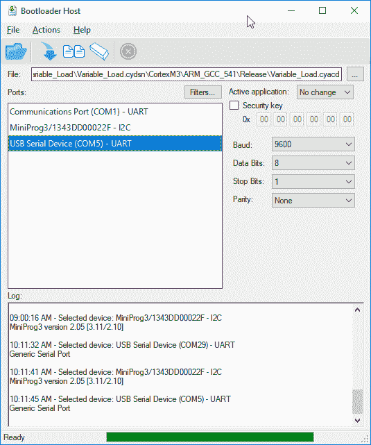](https://cdn.sparkfun.com/assets/learn_tutorials/7/8/0/bootloader_host.png)

波特率、数据位、停止位和奇偶校验都可以保持原样。因此“**活动应用程序**”和“**安全密钥**”框可以不选中。点击**...文件旁边的**按钮，调出文件选择对话框。

引导加载程序的应用程序文件的类型为" ***。cyacd** ，它可以在固件目录中的**下找到.../cortex m3/ARM _ GCC _ 541/Release**，假设您使用的是 *PSoC Creator 4.2* ，其中*构建配置*设置为**发布**模式。

[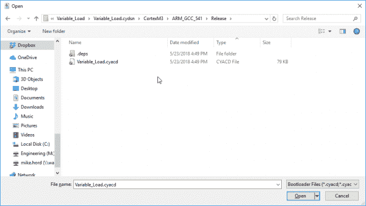](https://cdn.sparkfun.com/assets/learn_tutorials/7/8/0/path_to_cyacd_file.png)

***。每当构建项目时，都会自动生成 cyacd** 文件。请注意，使用 PSoC Creator 主菜单栏中的“**程序**按钮，**对引导加载的项目不起作用！**

引导加载过程的最后一步是单击引导加载程序主机窗口顶部按钮栏中的“**程序**按钮。您应该会在窗口底部的文本窗口中看到指示编程成功的消息。

[](https://cdn.sparkfun.com/assets/learn_tutorials/7/8/0/program_button.png)

## 资源和更进一步

既然您已经成功地建立并运行了可变负载套件，那么是时候将它整合到您自己的项目中了！

有关更多信息，请查看以下资源:

*   [示意图(PDF)](https://cdn.sparkfun.com/assets/a/7/f/d/0/Variable_Load_2.pdf)
*   [鹰(ZIP)](https://cdn.sparkfun.com/assets/7/2/4/c/e/Variable_Load_1.zip)
*   [SparkFun 产品展示:可变负载套件](https://youtu.be/OWPisGTeeXQ)
*   SparkFun Enginursday:一个基于 PSoC 的数字负载箱 -该产品背后的原始 Enginursday 项目。
*   [GitHub 仓库](https://github.com/sparkfun/Variable_Load) -可变负载的产品仓库。
*   [为重负载确定散热器的尺寸](https://www.sparkfun.com/tutorials/314) -关于散热器的一些信息。
*   [Cypress: PSoC Creator IDE](http://www.cypress.com/products/psoc-creator-integrated-design-environment-ide)
*   使用 FreeSoC2-free SOC 2 使用与可变负载相同的处理器，因此 free SOC 2 教程页面上关于 PSoC Creator 的信息可以帮助您开始更改可变负载的固件。**************