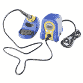
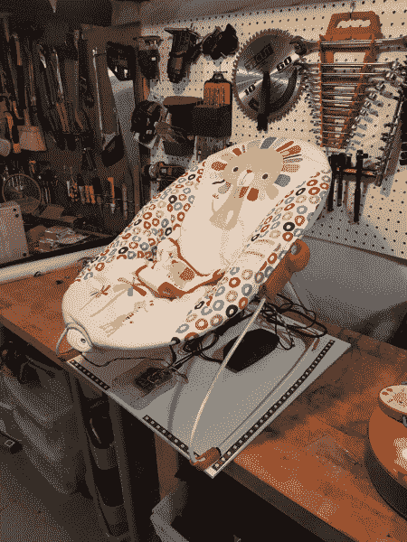

# Vibe-O-Matic 3000

> 原文：<https://learn.sparkfun.com/tutorials/vibe-o-matic-3000>

## 介绍

这一切都是因为一个朋友发给我一个福特制造的婴儿床的链接。

[https://www.youtube.com/embed/4F-QxDNFZjE/?autohide=1&border=0&wmode=opaque&enablejsapi=1](https://www.youtube.com/embed/4F-QxDNFZjE/?autohide=1&border=0&wmode=opaque&enablejsapi=1)

我不知道福特花了多少钱和时间，但我想我可以做类似的事情。可能有点太 DIY 了...我儿子可能一点也不喜欢...但我向你们展示的是 Vibe-O-Matic 3000 :

## VOM3K

好吧，这是怎么回事？VOM3K 旨在复制汽车驾驶的各个方面。座椅的振动程度各不相同，就像汽车启动、行驶一段时间、停车等。座椅以脉动的方式在两侧发光，就像汽车的前灯会照亮车厢一样。并且扬声器播放在 15 分钟驾驶期间记录的道路噪音的录音。

现在是大问题。宝宝是喜欢，还是爱？原来宝宝只是被它搞糊涂了。聪明的小家伙知道这不是车，但他不太知道这是什么。当他坐在车里时，他不会大惊小怪或哭泣，但也不会像坐在汽车后座时那样昏过去。相反，他总是带着好奇的眼神盯着我，我只能理解为“爸爸，你为什么一直说 Arduino 这个词。我现在在努力吗？!"

### 所需材料

这是零件清单:

*   [Arduino Pro 328 - 5V/16MHz](https://www.sparkfun.com/products/10915)
    *   [男角球头球攻门——直球](https://www.sparkfun.com/products/116)
    *   [5V FTDI](https://www.sparkfun.com/products/9716)
    *   [mini-B USB 线缆](https://www.sparkfun.com/products/11301)
*   [MP3 播放器保护罩](https://www.sparkfun.com/products/12660)
    *   [microSD 卡](https://www.sparkfun.com/products/13833)
    *   [母接头](https://www.sparkfun.com/products/115)
*   [连接电线](https://www.sparkfun.com/search/results?term=hook-up+wire)
*   [外壳](https://www.sparkfun.com/products/retired/8632)
*   [5V 电源](https://www.sparkfun.com/products/12889)
*   [面板安装桶形千斤顶](https://www.sparkfun.com/products/retired/10785)
*   [MOSFET 电源控制套件](https://www.sparkfun.com/products/12959)
*   [JST 跳线 3 线组件](https://www.sparkfun.com/products/9915)
*   [翘板开关](https://www.sparkfun.com/products/8837)
*   [瞬时按钮](https://www.sparkfun.com/products/11992)

您还需要:

*   [电脑扬声器](https://www.amazon.com/gp/product/B000R9AAJA/ref=oh_aui_search_detailpage?ie=UTF8&psc=1)
*   [可单独寻址的暖白光 LED 条(APA102 驱动 IC)](https://www.amazon.com/Mokungit-2700-3200K-Individually-Addressabled-Non-waterproof/dp/B01IX5FQIE/ref=sr_1_3?ie=UTF8&qid=1510931291&sr=8-3&keywords=apa102+warm+white)
*   拉链
*   中纤板
*   螺丝
*   十字螺丝刀

### 工具

你需要一个烙铁、焊料、[通用焊接附件](https://www.sparkfun.com/categories/49)和工具来连接项目。

 

将**添加到您的[购物车](https://www.sparkfun.com/cart)中！**

### [尖嘴钳](https://www.sparkfun.com/products/8793)

[In stock](https://learn.sparkfun.com/static/bubbles/ "in stock") TOL-08793

迷你钳子。这些是很棒的小钳子！任何爱好者或电气工程师的必备。对于插入设备至关重要…

$3.501[Favorited Favorite](# "Add to favorites") 22[Wish List](# "Add to wish list")**** 

将**添加到您的[购物车](https://www.sparkfun.com/cart)中！**

### [斜切刀](https://www.sparkfun.com/products/8794)

[In stock](https://learn.sparkfun.com/static/bubbles/ "in stock") TOL-08794

迷你斜切刀。这些是很棒的小刀具！这是夹住引线和额外焊尾的必备工具。4 英寸长。

$2.753[Favorited Favorite](# "Add to favorites") 15[Wish List](# "Add to wish list")**** 

将**添加到您的[购物车](https://www.sparkfun.com/cart)中！**

### [无铅焊料- 100 克线轴](https://www.sparkfun.com/products/9325)

[In stock](https://learn.sparkfun.com/static/bubbles/ "in stock") TOL-09325

这是带有水溶性树脂芯的无铅焊料的基本线轴。0.031 英寸规格，100 克。这是一个好主意…

$9.957[Favorited Favorite](# "Add to favorites") 33[Wish List](# "Add to wish list")**** 

### [Hakko FX888D 焊台](https://www.sparkfun.com/products/retired/11704)

[Retired](https://learn.sparkfun.com/static/bubbles/ "Retired") TOL-11704

50 多年来，Hakko 一直生产高质量的焊接和脱焊工具。他们是可靠的，一个很好的价值…

53 **Retired**[Favorited Favorite](# "Add to favorites") 49[Wish List](# "Add to wish list") 

### [剥线钳-30a WG](https://www.sparkfun.com/products/retired/12630)

[Retired](https://learn.sparkfun.com/static/bubbles/ "Retired") TOL-12630

使用 Hakko 的剥线钳非常方便和舒适。这些是任何一个黑客的必备技能…

3 **Retired**[Favorited Favorite](# "Add to favorites") 14[Wish List](# "Add to wish list")****** ******您还需要:

*   带有热熔胶的热熔胶枪
*   舒适的婴儿座椅
*   业余爱好汽车

## 建筑

为了建立共鸣箱，我需要三样东西:

*   震动
*   声音
*   光

幸运的是，朋友们给我们的弹性座椅(谢谢维多利亚！)连接了一个小型振动马达。

最初的振动设计使用单节 C 型电池(约 1.5V)，带有一个简单的开/关滑动开关。我移除了电源开关和电池，并使用 [MOSFET 电源控制套件](https://www.sparkfun.com/products/12959)通过 5V 的 Arduino 控制电机。由于 DC 电机用于振动座椅，因此当连接到 n 沟道 MOSFET 分线板的“设备”侧时，使用什么引脚并不重要。

*Vibration motor modified with MOSFET control*

电机运行在 5V 而不是设计的 1.5V 时做什么？它跑得更快，声音更大。令人欣慰的是，Arduino 在一些引脚上有 PWM，所以我们能够从 0 到 100%油门运行电机。因此，如果振动太大(或电机变得过热)，我们可以将功率降低到可接受的水平。我结束了运行电机从 40%到 80%的权力。再高一点，这个男孩会变得更奇怪。

接下来，我把 Arduino Pro 焊接到 MP3 播放器的保护罩上。请注意，Arduino 安装在防护罩上方。Arduino 人不一定要走到盾牌下面。我知道我需要在 Arduino 上焊接各种附加的东西，比如开关和按钮。对我来说，在下面安装 MP3 屏蔽更容易，这样我就可以看到我需要在 Arduino 上访问的引脚。堆叠后，进行如下表所示的有线连接。

*5V Arduino Pro stacked on MP3 Shield with wired connections*

| 成分 | arduino |
| 面板安装筒形千斤顶的**中心销** | 桶形千斤顶 **VIN 引脚** |
| 面板安装筒形千斤顶的**套筒销** | 筒式千斤顶 **GND 销** |
| n 沟道 MOSFET 分线板:**“C”引脚** | **第 10 针** |
| n 沟道 MOSFET 分线板: **"-"引脚** | **GND 销** |
| n 沟道 MOSFET 分线板: **"+"引脚** | **葡萄酒 Pin** |
| APA102 地面:**GND****** | **"-"引脚**紧挨着桶形千斤顶的足迹 |
| APA102 数据: **D1 引脚** | **引脚 5** |
| APA102 时钟: **C0 引脚** | **引脚 4** |
| APA 102 Vcc:**5V****** | **"+"销**紧挨着桶形千斤顶的足迹 |
| 走吧。:瞬时按钮引脚 | **引脚 A0** |
| 走吧。:瞬时按钮引脚 | **引脚 A1** |
| 振动模式:翘板开关**常闭销** | **引脚 A1** |
| 汽车模式:翘板开关**常开销** | **引脚 A2** |

我用中密度纤维板做了一个底板来安装所有的东西。我周围有一些额外的油漆，所以我画了它(认为油漆涂层会对我妻子对这整个努力的感觉产生积极的影响)。扬声器用几个螺钉穿过 MDF 固定在塑料扬声器外壳上。外壳和电子设备同样用一对螺钉固定。

*MDF base board*

然后椅子被拉链绑在 MDF 上。可单独寻址的 APA102 暖白色发光二极管像大多数条带一样有一个粘合衬背。但像大多数 LED 灯带一样，这种背衬往往会在几天后磨损，所以我在 LED 灯带的各个点上添加了热熔胶来固定它。

*Bouncy chair mounted to baseboard*

APA102 LEDs 由出色的 [FastLED 库](https://github.com/FastLED/FastLED)控制。“赛昂人”的例子被修改成模拟汽车的前灯照亮机舱，当它们从左、右、前通过时。

*Cylon LEDs emulating passing headlights*

接下来，我摇下车窗，在我的城市里开了 12 分钟的车。如果你听赛道，你可以听到几辆大型柴油卡车经过的地方。这是一条非常好的赛道，尽管很难听到好的路面噪音。在某一点上，我设想使用光传感器、GPS 和加速度计来适当地记录通过驱动器的光和振动。与此同时，我的儿子开始尖叫，我决定采取 SISI(拧它，装运它)的方法更好:led 每 30 秒触发一次，随机右/前/左决策，振动电机每 60 秒改变一个新的随机振动水平(40%至 80%油门)。

## 代码

**注意:**此示例假设您在桌面上使用的是最新版本的 Arduino IDE。如果这是你第一次使用 Arduino，请回顾我们关于[安装 Arduino IDE 的教程。](https://learn.sparkfun.com/tutorials/installing-arduino-ide)如果您之前没有安装 Arduino 库，请查看我们的[安装指南。](https://learn.sparkfun.com/tutorials/installing-an-arduino-library)

为了继续这个项目，您需要安装以下库:

[FastLED Arduino Library](https://github.com/FastLED/FastLED)[SparkFun MP3 Player Shield Arduino Library](https://github.com/madsci1016/Sparkfun-MP3-Player-Shield-Arduino-Library)

一个摇杆开关被用来在**振动**(振动 15 分钟，没有灯光或声音)和**汽车**(全效果)之间进行选择。**走了！**按钮允许用户开始或停止一个动作。

*A stripped down UI*

你可以在这里找到 Vibe-O-Matic 3000 的代码:

[Vibe-O-Matic 3000 Example Code](https://cdn.sparkfun.com/assets/learn_tutorials/7/1/7/Vibe-O-Matic-3000.ino)

它会查看翘板开关和启动按钮的状态，以确定要做什么。一旦启动，MP3 屏蔽播放曲目，直到完成。led 和电机分别每 30 秒和 60 秒随机打开/关闭。还有一种仅振动模式，可以让椅子振动 15 分钟。

## 结果呢

替换打开

[https://player.vimeo.com/video/243748949](https://player.vimeo.com/video/243748949)

替换关闭

最后，杰克并不真的喜欢或不喜欢这个座位。我怀疑汽车座椅的舒适性很重要。我还认为汽车的振动频率较低，振幅比小型振动马达高得多。我希望有人能从我的教训中吸取教训，做一个更好的版本！

## 资源和更进一步

既然你已经看到了如何打造一份完美的婴儿礼物，那么是时候向全世界展示了！查看其他一些很棒的教程:

 [### 发光二极管](https://learn.sparkfun.com/tutorials/light-emitting-diodes-leds) Learn the basics about LEDs as well as some more advanced topics to help you calculate requirements for projects containing many LEDs.[Favorited Favorite](# "Add to favorites") 67 [### MP3 播放器防护罩连接指南 V15](https://learn.sparkfun.com/tutorials/mp3-player-shield-hookup-guide-v15) How to get your Arduino groovin' using the MP3 Player Shield.[Favorited Favorite](# "Add to favorites") 6 [### Lumenati Hookup Guide](https://learn.sparkfun.com/tutorials/lumenati-hookup-guide) Lumenati is our line of APA102c-based addressable LED boards. We'll show you how to bring the sparkle to your projects 5

感谢阅读！如果您有任何问题或意见，请告诉我们。******