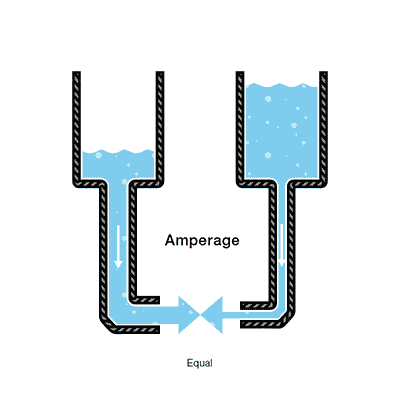
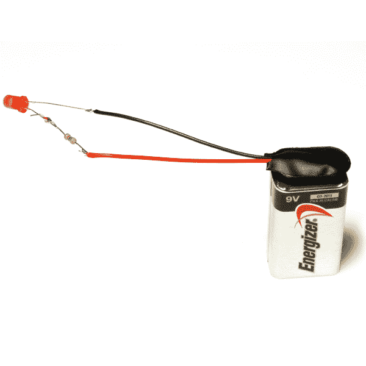

# 电压、电流、电阻和欧姆定律

> 原文：<https://learn.sparkfun.com/tutorials/voltage-current-resistance-and-ohms-law>

## 电学基础

开始探索电力和电子世界时，了解电压、电流和电阻的基础知识至关重要。这是操纵和利用电力所需的三个基本构件。起初，这些概念可能很难理解，因为我们无法“看到”它们。人们无法用肉眼看到流经电线的能量或放在桌子上的电池的电压。即使是天空中的闪电，虽然是可见的，但并不是真正发生的从云到地球的能量交换，而是空气对穿过它的能量的反应。为了检测这种能量转移，我们必须使用万用表、频谱分析仪和示波器等测量工具来观察系统中电荷的变化。不要害怕，但是，本教程将会给你电压，电流和电阻的基本理解，以及三者之间的相互关系。

*Georg Ohm*

### 本教程涵盖的内容

*   电荷与电压、电流和电阻的关系。
*   什么是电压、电流和电阻。
*   欧姆定律是什么，如何用它来理解电学？
*   一个简单的实验来演示这些概念。

### 推荐阅读

*   [什么是电](https://learn.sparkfun.com/tutorials/what-is-electricity)
*   [什么是电路？](https://learn.sparkfun.com/tutorials/what-is-a-circuit)

&nbsp

&nbsp

## 电荷

电是电子的运动。电子产生电荷，我们可以利用电荷来做功。你的灯泡、音响、电话等等。都是利用电子的运动来做功。它们都使用相同的基本能源运行:电子的运动。

本教程的三个基本原则可以用电子来解释，或者更具体地说，用它们产生的电荷来解释:

*   **电压**是两点之间的电荷差。
*   **电流**是电荷流动的速率。
*   **电阻**是材料抵抗电荷(电流)流动的趋势。

所以，当我们谈论这些值时，我们实际上是在描述电荷的运动，也就是电子的行为。电路是一个闭合回路，允许电荷从一个地方移动到另一个地方。电路中的元件允许我们控制电荷并利用它来工作。

格奥尔格·欧姆是一位研究电学的巴伐利亚科学家。欧姆从描述由电流和电压定义的电阻单位开始。那么，让我们从电压开始，从那里开始。

## 电压

[https://www.youtube.com/embed/z8qfhFXjsrw?ecver=2](https://www.youtube.com/embed/z8qfhFXjsrw?ecver=2)

我们把电压定义为电路上两点之间的势能。一点比另一点电荷多。这两点之间的电荷差称为电压。它以伏特为单位，从技术上来说，它是两点之间的势能差，每通过一库仑电荷就会产生一焦耳的能量(如果这没有意义，请不要惊慌，一切都会得到解释)。单位“伏特”是以意大利物理学家亚历山德罗·伏打的名字命名的，他发明了被认为是第一个化学电池。电压在等式和示意图中用字母“V”表示。

当描述电压、电流和电阻时，一个常见的比喻是水箱。以此类推，电荷用水量*表示*，电压用水压*表示*，电流用水流*表示*。所以对于这个类比，请记住:

*   水=费用
*   压力=电压
*   流量=电流

考虑一个离地面一定高度的水箱。在这个水箱的底部有一根软管。

软管末端的压力可以代表电压。水箱里的水代表电荷。水箱中的水越多，电荷越高，软管末端测得的压力越大。

我们可以把这个坦克想象成一个电池，一个储存一定能量然后释放出来的地方。如果我们排出一定量的水，软管末端产生的压力就会下降。我们可以认为这是电压下降，就像当电池耗尽时手电筒变暗一样。流经软管的水量也会减少。压力越小意味着流动的水越少，这就导致了水流。

## 目前的

[https://www.youtube.com/embed/kYwNj9uauJ4?ecver=2](https://www.youtube.com/embed/kYwNj9uauJ4?ecver=2)

我们可以把从水箱流过软管的水量想象成电流。压力越高，流量越大，反之亦然。对于水，我们可以测量一段时间内流经软管的水量。对于电，我们测量一段时间内流过电路的电荷量。电流以安培为单位(通常简称为“安培”)。安培被定义为每秒通过电路中一点的 6.241*10^18 电子(1 库仑)。安培在等式中用字母“I”表示。

假设我们有两个水箱，每个水箱底部都有一根软管。每个水箱的水量完全相同，但是一个水箱上的软管比另一个水箱上的软管窄。

我们在任一软管的末端测量相同量的压力，但是当水开始流动时，具有较窄软管的水箱中的水的流速将小于具有较宽软管的水箱中的水的流速。在电气术语中，通过较窄软管的电流小于通过较宽软管的电流。如果我们希望通过两条软管的流量相同，我们必须用较窄的软管增加水箱中的水量。

这增加了较窄软管末端的压力(电压),推动更多的水通过水箱。这类似于电压增加导致电流增加。

现在我们开始看到电压和电流之间的关系。但是这里还有第三个要考虑的因素:软管的宽度。在这个类比中，软管的宽度就是阻力。这意味着我们需要在模型中添加另一项:

*   水=电荷(以库仑为单位测量)
*   压力=电压(单位为伏特)
*   流量=电流(单位为安培，或简称为“安培”)
*   **软管宽度=阻力**

## 抵抗

再次考虑我们的两个水箱，一个有一个窄管，一个有一个宽管。

显而易见的是，在相同的压力下，我们不能通过一个窄的管道比一个更宽的管道容纳更多的体积。这就是反抗。窄管“阻止”水流通过它，即使水与宽管水箱的压力相同。

用电学术语来说，这是用两个电压相等、电阻不同的电路来表示的。具有较高电阻的电路将允许较少的电荷流过，这意味着具有较高电阻的电路具有较少的电流流过。

这就把我们带回了格奥尔格·欧姆。欧姆将“1 欧姆”的电阻单位定义为导体中两点之间的电阻，在该点上施加 1 伏电压将推动 1 安培或 6.241×10^18 电子。该值通常在原理图中用希腊字母“&ohm;”表示，称为ω，读作“ohm”。

## 欧姆定律

[https://www.youtube.com/embed/8jB6hDUqN0Y?ecver=2](https://www.youtube.com/embed/8jB6hDUqN0Y?ecver=2)

结合电压、电流和电阻的元素，欧姆开发了公式:

在哪里

*   V =电压，单位为伏特
*   I =以安培为单位的电流
*   R =电阻，单位为欧姆

这就是所谓的欧姆定律。比方说，我们有一个电压为 1 伏、电流为 1 安培、电阻为 1 欧姆的电路。利用欧姆定律，我们可以说:

假设这代表我们有一个宽软管的水箱。水箱中的水量定义为 1 伏，软管的“窄度”(流动阻力)定义为 1 欧姆。利用欧姆定律，这给了我们 1 安培的电流。

利用这个类比，现在让我们来看看带有窄软管的水箱。因为软管较窄，所以其流动阻力较高。让我们把这个电阻定义为 2 欧姆。水箱中的水量与另一个水箱中的水量相同，因此，使用欧姆定律，我们对带有窄软管的水箱的等式为

但是什么是电流呢？因为电阻更大，电压相同，所以电流值为 0.5 安培:

因此，在电阻较高的槽中，电流较低。现在我们可以看到，如果我们知道欧姆定律的两个值，我们可以解决第三个。让我们用一个实验来证明这一点。

## 欧姆定律实验

在这个实验中，我们想使用 9 伏电池为 LED 供电。led 很脆弱，只有一定量的电流流过才会烧坏。在 LED 的文档中，总会有一个“电流额定值”。这是特定 LED 烧坏之前可以流过的最大电流量。

### 所需材料

为了执行本教程末尾列出的实验，您需要:

*   [万用表](https://www.sparkfun.com/products/9141)
*   9 伏电池
*   一个 560 欧姆的电阻(或下一个最接近的值)
*   [一个发光二极管](https://www.sparkfun.com/products/9590)

**注意:**led 是一种“非欧姆”设备。这意味着流经 LED 本身的电流公式并不像 V=IR 那样简单。LED 在电路中引入了一种叫做“电压降”的东西，从而改变了流经电路的电流量。然而，在本实验中，我们只是试图保护 LED 免受过电流，因此我们将忽略 LED 的电流特性，并使用欧姆定律选择电阻值，以确保通过 LED 的电流安全地低于 20mA。

对于这个例子，我们有一个 9 伏电池和一个额定电流为 20 毫安或 0.020 安培的红色 LED。为了安全起见，我们不希望以最大电流驱动 LED，而是以建议电流驱动，其数据手册上列为 18mA，即 0.018 安培。如果我们简单地将 LED 直接连接到电池，欧姆定律的值如下所示:

therefore:and since we have no resistance yet:

除以零给了我们无限的电流！实际上并不是无限的，而是电池所能提供的最大电流。因为我们不想让那么多电流流过 LED，所以我们需要一个电阻。我们的电路应该是这样的:

我们可以以完全相同的方式使用欧姆定律来确定电阻值，从而得到所需的电流值:

therefore:plugging in our values:solving for resistance:

因此，我们需要一个 500 欧姆左右的电阻值，以使流经 LED 的电流保持在最大额定电流以下。

500 欧姆不是现成电阻的常用值，因此该器件使用 560 欧姆的电阻来代替。这是我们的设备放在一起的样子。

成功！我们选择了一个足够高的电阻值，以保持流经 LED 的电流低于其最大额定值，但又足够低，以使电流足以保持 LED 美观明亮。

这个 LED/限流电阻的例子在业余电子产品中很常见。你经常需要使用欧姆定律来改变流经电路的电流量。这种实现的另一个例子是 LilyPad LED 板。

通过这种设置，无需为 LED 选择电阻，电阻已经在 LED 板上，因此无需手动添加电阻即可实现限流。

### 限流在 LED 之前还是之后？

让事情变得复杂一点，你可以把限流电阻放在 LED 的两边，它的工作原理是一样的！

许多第一次学习电子学的人很难接受这样的想法，即限流电阻可以位于 LED 的任何一侧，而电路仍将照常工作。

想象一条连续循环的河流，一条无限的、循环的、流动的河流。如果我们在里面建一个大坝，整条河都会停止流动，而不仅仅是一边。现在想象一下，我们在河里放置一个水车来减缓河水的流速。水轮放在圆圈的哪个位置并不重要，它仍然会减缓整条河的流速。

这过于简化，因为限流电阻不能放在电路的任何地方*；它可以放置在 LED 的*任一侧*以执行其功能。*

为了得到更科学的答案，我们求助于[基尔霍夫电压定律](https://en.wikipedia.org/wiki/Kirchhoff's_circuit_laws)。正是由于这一定律，限流电阻可以放在 LED 的任何一侧，并且仍然具有相同的效果。更多信息和一些使用 KVL 的练习问题，请访问[这个网站](http://www.facstaff.bucknell.edu/mastascu/elessonshtml/basic/basic5kv.html)。

## 资源和更进一步

现在你应该明白电压、电流、电阻的概念，以及三者之间的关系。恭喜你！大多数分析电路的方程和定律可以直接从欧姆定律推导出来。通过了解这个简单的定律，你就理解了这个概念，它是任何电路分析的基础！

## 有兴趣学习更多基础主题吗？

查看我们的 **[工程要点](https://www.sparkfun.com/engineering_essentials)** 页面，了解电气工程相关基础主题的完整列表。

带我去那里！

这些概念只是冰山一角。如果你想进一步研究欧姆定律和电路设计的更复杂的应用，一定要看看下面的教程。

*   [串联与并联电路](https://learn.sparkfun.com/tutorials/series-and-parallel-circuits)
*   [电力](https://learn.sparkfun.com/tutorials/electric-power)
*   [模拟与数字电路](https://learn.sparkfun.com/tutorials/analog-vs-digital)
*   [电阻器](https://learn.sparkfun.com/tutorials/resistors)
*   [发光二极管](https://learn.sparkfun.com/tutorials/light-emitting-diodes-leds)
*   [如何使用万用表](https://learn.sparkfun.com/tutorials/how-to-use-a-multimeter)