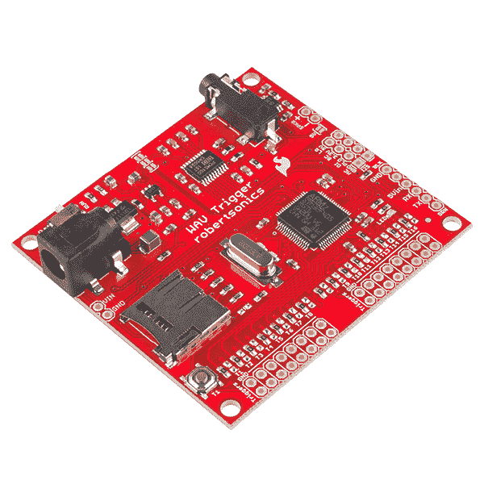
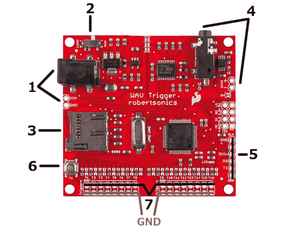
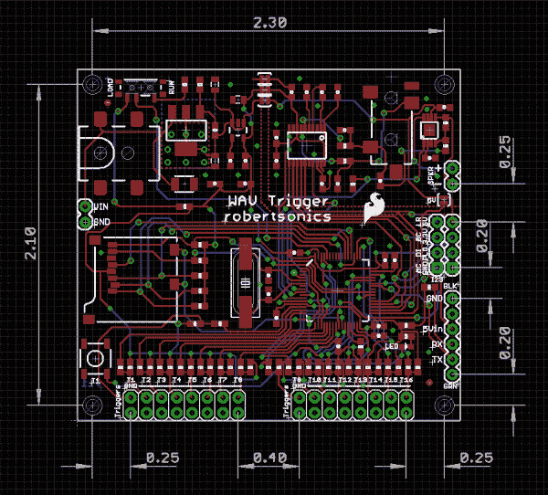
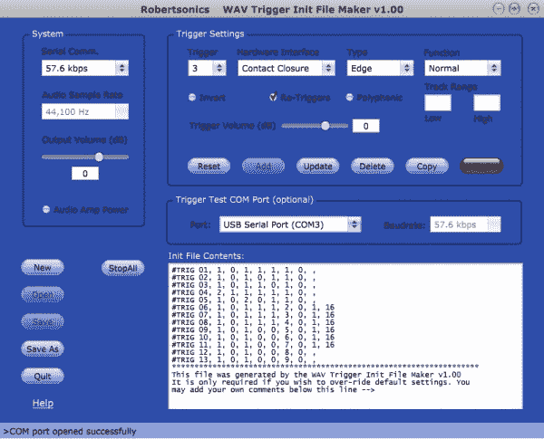
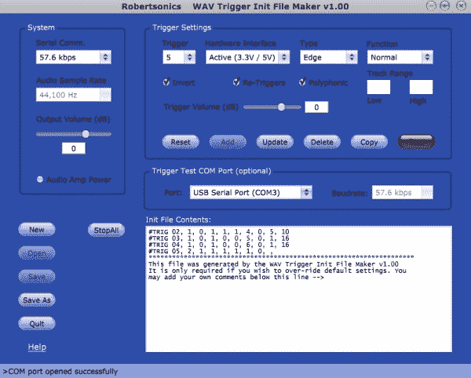
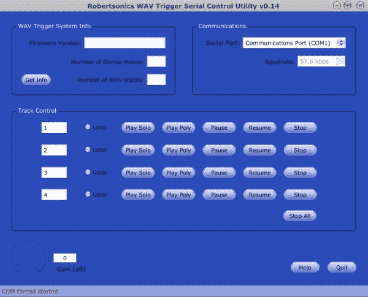
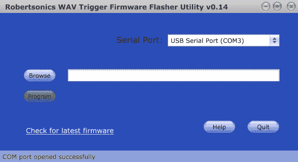

# WAV 触发器连接指南 V11

> 原文：<https://learn.sparkfun.com/tutorials/wav-trigger-hookup-guide-v11>

## 介绍

**注意:**本指南适用于 WAV 触发器的最新版本 V11。如果你有旧版本(版本号可以在 PCB 背面找到)，请参考[本教程](https://learn.sparkfun.com/tutorials/wav-trigger-hookup-guide)。

* * *

WAV 触发器是一个开发平台，可以让你轻松地在你的项目中添加音乐和音效。WAV 触发器播放未压缩的 WAV 文件，最高可达 16 位立体声 44.1kHz，与音频 CD 的质量相同。一个显著的特点是，该板能够同时播放多个轨道，在飞行中混合多达 8 个立体声轨道。该板有一个音频插孔和一个 2 针输出，可以连接到耳机或扬声器进行音频输出。

当某种类型的条件被满足时，曲目被播放。例如，最基本的用途是在地和触发器之间连接一个按钮。默认情况下，按下按钮时，音轨(。WAV 文件)对应于该触发的内容将被播放。通过配置文件可以创建更多高级选项，允许触发器播放随机曲目、暂停曲目、改变音量等操作。

除了使用按钮和开关，声音还可以由微控制器或传感器的数字输出触发。这可以允许该产品依赖于环境刺激的许多有趣的用途。有多种方法可以配置您的电路板，我们将在本教程的后面详细介绍。

我们还将解释如何使用 WAV Trigger 的应用程序进行配置、刷新新固件或通过串行连接远程控制电路板。通过下面的链接为 Windows 或 Mac 下载这些应用程序。

### 所需材料

WAV 触发器的美妙之处在于，你可以让它变得简单或复杂。然而，按照这个教程，除了 WAV 触发板之外，你还需要一些东西。至少你需要一些[线](https://www.sparkfun.com/products/11375)将你的触发器接地并测试它们。你可能还想抓一些[公](https://www.sparkfun.com/products/116)和/或[母头](https://www.sparkfun.com/products/115)，一些[按钮和开关](https://learn.sparkfun.com/tutorials/switch-basics)，以及一个 [Micro SD 卡](https://www.sparkfun.com/products/11609)来存储你想要触发的文件。对于软件调试、配置设置和测试，您需要一根 [USB mini-B 电缆](https://www.sparkfun.com/products/11301)和一根 [FTDI Basic](https://www.sparkfun.com/products/9716) 。

除了上面提到的硬件，你还需要下载 WAV 触发器应用程序。

*   [Robertsonics - WAV Trigger 的主页](http://robertsonics.com/wav-trigger/)
*   [WAV 触发 Windows 应用程序](https://cdn.sparkfun.com/assets/6/e/a/e/b/52e94ccece395fe7668b456a.zip)
*   [WAV 触发 Mac 应用](https://cdn.sparkfun.com/assets/b/d/6/4/9/52e94cd2ce395f67538b456d.zip)

### 建议阅读/观看

在开始之前，您应该先看一下 [WAV 触发器演示视频](http://www.youtube.com/watch?v=UUkcs_XL5x0)。它介绍了 WAV 触发器的基本和高级特性。

[https://www.youtube.com/embed/UUkcs_XL5x0/?autohide=1&border=0&wmode=opaque&enablejsapi=1](https://www.youtube.com/embed/UUkcs_XL5x0/?autohide=1&border=0&wmode=opaque&enablejsapi=1)

本教程建立在一些其他概念的基础上。在继续之前，检查任何您可能不熟悉的内容。

*   [什么是电路？](https://learn.sparkfun.com/tutorials/what-is-a-circuit)
*   [电压、电流、电阻和欧姆定律](https://learn.sparkfun.com/tutorials/voltage-current-resistance-and-ohms-law)
*   [逻辑电平](https://learn.sparkfun.com/tutorials/logic-levels)
*   [如何焊接通孔](https://learn.sparkfun.com/tutorials/how-to-solder-through-hole-soldering)
*   [使用焊线](https://learn.sparkfun.com/tutorials/working-with-wire)
*   [开关基础知识](https://learn.sparkfun.com/tutorials/button-and-switch-basics)
*   [串行通信](https://learn.sparkfun.com/tutorials/serial-communication)
*   [串行终端基础知识](https://learn.sparkfun.com/tutorials/terminal-basics)

## 五金器具

让我们来看看 WAV 触发器的硬件，这样我们就可以知道东西在哪里以及如何使用该板。

1.  桶形插孔是你供电的地方。或者，您可以使用附近的 VIN 和 GND via 供电。无论哪种方式，6V 到 15V 之间的任何输入电压**都将起作用。**

2.  正常使用电路板时，有一个运行/加载开关应始终设置为运行。该板被设置为仅在更新 ARM 处理器上的固件时加载，这在 SparkFun 上提前完成。只有在您想要使用较新版本的固件时，才需要将交换机置于负载设置。

3.  微型 SD 卡是你的。WAV 文件和可选的配置文件被存储。这款 [micro SD 卡](https://www.sparkfun.com/products/11609)与主板配合良好，并且还包括一个 micro SD USB 读卡器，用于向/从您的计算机传输文件。

4.  音频插孔是标准的 3.5 毫米类型，可以与您选择的耳机或扬声器配合使用。还有一个 2 针接头，用于将[扬声器(如本](https://www.sparkfun.com/products/10722))直接布线和焊接到电路板上。

5.  FTDI 端口用于对固件进行编程，或者可以与 WAV Trigger 的远程控制应用程序一起使用，以使用您的电脑而不是硬件来测试触发器。这样，您可以在将硬件焊接到实际触发端口之前测试触发轨迹。FTDI 端口还可以与 WAV Trigger 的初始化编辑器结合使用，因此当您将触发器设置为非默认功能(如播放随机曲目)时，您可以试验触发器的功能，而不必先将配置文件放在 SD 卡上。稍后我们将解释更多关于配置和用计算机测试触发器的内容。要使用这个端口，考虑一个 [FTDI Basic](https://www.sparkfun.com/products/9873) 。

6.  默认情况下，此按钮触发存储卡上的第一首曲目。固件的未来版本可能允许您修改其功能。

7.  这排 16 个触发器是该板实用程序的核心。这些是我们将要用来开始播放 SD 卡上的音乐或音效曲目的。我们还将学习如何使用它们来实现更高级的选项，如播放随机曲目或在配置文件的帮助下改变音量。请记住，接地连接离电路板边缘最近，方便与触发器一起使用。**实际触发器是从边缘**起的第二行。

现在我们已经了解了电路板的硬件，让我们更深入地了解一下您可以用它做什么。

### 钻孔和销间距

如果你有兴趣在某个地方安装这个漂亮的小电路板，你可能想知道你的机箱的孔和引脚在哪里。安装孔的尺寸适合 4-40 机器螺钉。本图中的所有尺寸均以英寸为单位，引脚间距均为标准的 0.100 英寸。

## 操作

### 基础知识

默认情况下，每个触发器在与地连接时都会导致其对应的轨道播放。比如先在 micro SD 卡上放一个名为 *001-example-name 的曲目。WAV* 。只要是以 001 开头，并且是 WAV 音频文件，名称并不重要。将 microSD 卡插入 WAV 触发器。使用 6V 至 15V 的电源为电路板供电，并连接耳机或扬声器。

使用一根[剥开的导线](https://learn.sparkfun.com/tutorials/working-with-wire/how-to-strip-a-wire)，将 T1 的过孔与 GND 的过孔连接起来(不需要焊接)。这个[短路](https://learn.sparkfun.com/tutorials/what-is-a-circuit/short-and-open-circuits#shorts)触发 1 到地，导致音轨 001 播放。你也可以[在 T1 和 GND 连接之间焊接](https://learn.sparkfun.com/tutorials/how-to-solder-through-hole-soldering)一个开关或按钮，让它们触发声音。当触发器 1 被按住时，它的声音文件将持续播放。

默认情况下，其他触发器的工作方式相同。例如，如果您有一个名为 *012-music 的文件。WAV* 在你的 SD 卡上，连接触发器 12 (T12)到地(GND)会导致这个文件播放。如果您在触发器 1 或另一个轨道仍在播放时播放此轨道，这两个轨道将混合在一起，因为复音在默认情况下是启用的，您将同时听到两个轨道。这允许你将音乐与音效或任何你想要的东西混合。

这里有一些[样本轨道](https://cdn.sparkfun.com/assets/learn_tutorials/1/5/9/NewNumbers.zip)来进行实验。

*注意:*如果您使用微控制器或传感器来触发轨道，请确保您的[逻辑电平](https://learn.sparkfun.com/tutorials/logic-levels)匹配。您可能需要使用 [的](https://learn.sparkfun.com/tutorials/txb0104-level-shifter-hookup-guide)[一个](https://learn.sparkfun.com/tutorials/using-the-logic-level-converter) [我们的](https://learn.sparkfun.com/tutorials/pca9306-level-translator-hookup-guide) [逻辑电平转换器](https://learn.sparkfun.com/tutorials/bi-directional-logic-level-converter-hookup-guide)。

### 额外功能

使用这些触发器还有许多其他方式，包括播放随机曲目、暂停曲目，甚至在播放时改变音量。我们将详细讨论这些特性，因为它们需要使用 InitMaker 应用程序进行配置。这个应用程序允许你改变每个触发器的工作方式，测试它们，然后保存你的设置，把你的曲目放在 SD 卡上。如果你还没有下载这个应用程序，现在是个好时机。以下是链接:

*   [WAV 触发 Windows 应用程序](https://cdn.sparkfun.com/assets/6/e/a/e/b/52e94ccece395fe7668b456a.zip)
*   [WAV 触发 Mac 应用](https://cdn.sparkfun.com/assets/b/d/6/4/9/52e94cd2ce395f67538b456d.zip)

这是一张 InitMaker 的图片，我们将使用它来测试设置触发器的不同方法，并将我们的配置文件放在 SD 卡上，以便电路板的触发器按照我们想要的方式运行。

让我们一点一点地检查每一个场景。

#### 系统设置

**串行波特率** -设置异步串行端口的波特率。该波特率将保持有效，直到下一个电源周期。默认值为 57.6kbps。

**初始音量** -该增益将应用于 WAV 触发器的最终混音输出，直到被音量命令覆盖。范围为-70dB 至+10dB，默认值为 0dB(单位增益)。此增益影响 WAV 触发器的最终输出混音，而不是组成混音的单个轨道。

**音频放大器功率** -启用或禁用板载单声道音频放大器。如果您计划使用扬声器连接，请选中此选项。如果您计划使用立体声线路电平输出，请不要选中此选项以省电。重要提示:默认设置是禁用的。

#### 触发器设置

**触发器** -这选择我们正在改变哪个触发器的功能。

**硬件接口** -简而言之，当你将触发器连接到按钮或开关时，使用“触点闭合”。如果物理连接到地，触发器将启动，否则由于内部上拉电阻，触发器将为高电平。对微控制器或传感器等有源设备使用“有源–3.3V/5V”。如果选择此项，当连接到高电平信号(3.3V 或 5V)时，触发器将被激活，否则将由于内部下拉电阻而保持低电平。

**Type** -默认情况下，“Edge Triggered”在触发器第一次激活时开始播放曲目，曲目会继续播放，直到被其他事件停止。“电平触发”在触发器激活时开始播放轨道，但轨道仅在触发器保持激活时播放。

**功能** -该选项选择触发器将执行的功能。有些函数要求指定一个音轨范围，该范围内的值可以从 1 到 999。

默认功能“正常”指示 WAV 触发器播放相应的曲目号。

“下一首”播放指定范围内的下一首曲目，从低音曲目开始，在播放范围内的高音曲目后返回到该曲目。

“上一首”播放指定范围内的上一首曲目，从最高曲目开始，在播放该范围内的最低曲目后返回到该曲目。

“随机”播放指定范围内的随机曲目。它不会连续两次播放同一首曲目。

“暂停”将暂停指定范围内的所有曲目。这些磁道将保持暂停状态，直到恢复或重新启动。结合“水平触发”类型选项，创建一个瞬间暂停功能；当触发器被释放时，指定的轨迹将恢复。

“恢复”将恢复指定范围内的所有曲目，前提是它们仍处于“暂停”状态。

“停止”将停止指定范围内的所有曲目。结合“级别触发”类型选项将创建“停止和禁止”功能，只要触发器保持激活，就防止范围内的所有曲目重新开始。

“音量调高”或“音量调低”会将触发器重新设定为音量控制。每次触发都会将 WAV 触发器的输出级音量增加或减少 1dB。

**反转** -该复选框将反转触发器的逻辑。默认值为低电平有效。选中此选项会使触发器高电平有效。当选择“活动 3.3V/5V”硬件接口时，会自动检查这一点。

**重新触发** -该选项可使某些触发功能在先前已启动的曲目仍在播放时立即再次工作。例如，对于“正常”触发功能，启用该选项允许触发重新开始相应的音轨，即使它还没有结束播放，而禁用该选项阻止触发工作，直到音轨已经结束播放(或被一些其他事件停止)。)类似地，对于“下一个”、“上一个”和“随机”功能，禁用此选项会阻止触发器工作，直到先前从该触发器开始的任何音轨结束。默认情况下，这是启用的。

**复音** -该选项指定触发功能播放的曲目可以与当前播放的任何曲目混合。当此选项被禁用时，激活触发器将在新曲目开始播放之前停止当前正在播放的所有曲目。

你可以在 Robertsonic 的 WAV 触发器在线用户指南上找到更多关于这些设置和应用程序的信息。

* * *

现在您已经对可能性有了一个概念，让我们看一个测试定制触发器和初始化文件的例子。

## 例子

对于这个例子，确保你的 micro SD 卡上已经有了样本 WAV 文件,并且 WAV 触发板中也有这个卡。

在没有任何配置的情况下，您应该能够通过连接触发引脚和接地引脚来播放每个曲目。每个音轨只说了触发器的编号名称。

现在要测试一个定制触发器，我们需要使用 InitMaker 应用程序。

让我们设置几个触发器作为示例。保留触发器 1 的默认设置。将触发器 2 设置为播放 5 到 10 之间的随机曲目。首先在“功能”类别下选择随机，然后在“轨迹范围”下输入 5 和 10。点击设置下方的*添加*按钮，将其添加到配置文件中。

按照相同的步骤再设置几个触发器。将触发器 3 设置为暂停，触发器 4 设置为恢复。此外，将触发器 5 设置为“有源 3.3V/5V”硬件接口，用于连接微控制器或传感器。设置好每个触发器后，记得点击 *Add* 将其添加到配置中。如果你不这样做，你输入的设置将不会被记住。

在创建我们的初始化文件之前，如果需要，我们可以用一根 [USB mini-B 电缆](https://www.sparkfun.com/products/11301)和一根 [FTDI Basic](https://www.sparkfun.com/products/9716) 测试一个定制触发器。选择触发器 2。它应该仍然被设置为播放 5 到 10 之间的随机曲目。确保选择了*正确的 COM 端口*，对应于你的 FTDI，然后点击红色的*测试*按钮。然后，通过将其引脚接地来激活触发器 2。它应该随机播放 5 到 10 首曲目。如果这个测试不起作用，尝试重新连接 FTDI Basic，重新启动 InitMaker 应用程序，或者重新启动 WAV 触发器本身。

现在我们已经设置了触发器 1 到 5，让我们将它们保存到一个配置文件中。如果您按照我们上面描述的方式设置了 InitMaker 屏幕，它应该是这样的:

现在，使用左下角的*另存为*按钮保存该配置。这个文件需要被命名为 *wavtrigr.ini* 。把这个文件和声音文件一起放在你的微型 SD 卡上。如果你制作这个文件有困难，你可以在这里下载[。](https://cdn.sparkfun.com/assets/7/e/2/2/5/52cc8219ce395f98228b4567.ini)

此外，为了演示暂停和恢复功能，您可能希望播放一个较长的 wav 文件。这里有一个[更长的 WAV 文件](https://cdn.sparkfun.com/assets/0/6/7/1/9/52cc82a6ce395f923e8b4567.wav)，如果你目前没有自己的文件，可以下载。用此曲目替换 SD 卡上以“001”开头的当前文件。顺便提一下，你可以用像 [Audacity](http://audacity.sourceforge.net/) 这样的程序轻松地将你的任何 MP3 文件转换成 WAV 文件。

现在，您已经将声音文件(包括新的、更长的音轨)以及我们刚刚创建的初始化文件加载到了您的 micro SD 卡中，让我们测试一下它是否工作。

将 Trigger 1 的引脚接地，第一首曲目应该播放。将触发引脚 3 接地，轨道 1 应暂停。将触发引脚 4 接地，轨道 1 应恢复。将触发针 2 连接到地，将播放 5 到 10 之间的随机曲目。如果它还在播放的话，应该会和第一首音轨混合在一起，所以你可以同时听到两个音轨。

要模拟微控制器，将触发引脚 5 连接到电路板侧面的 3.3V 引脚，轨道 5 应该播放。只是*非常小心*不要意外地将 3.3V 连接到 GND 引脚。请记住，接地引脚最靠近电路板边缘，而触发引脚位于边缘第二排。

现在，您应该对如何创建配置文件和定制触发器有了很好的了解。不断尝试各种选项，直到它们适合您的项目。

## 远程应用

另一个可以用来对 WAV 触发器进行一些基本测试的应用程序是串行控制实用程序。这允许你用一根 [USB mini-B 电缆](https://www.sparkfun.com/products/11301)和一根 [FTDI Basic](https://www.sparkfun.com/products/9716) 将你的 WAV 触发器连接到一台电脑上。

当您加载应用程序时，它将如下所示:

首先，为您的 FTDI 设备选择正确的 COM 端口。点击左上方的*获取信息*按钮，并查看固件版本字段是否已填写，检查您的连接是否正确。如果没有，请重新连接 FTDI，重启控制实用程序，和/或重新给电路板通电，然后重试。

连接后，您可以使用曲目控制播放 SD 卡上的曲目。例如，点击轨道 1 旁的*循环*并点击*玩聚*。这将在您的设备上连续播放曲目 1。现在，如果你点击轨道 2 的*播放聚合*，轨道 2 将与循环轨道 1 混合播放。如果你点击*独奏*，音轨 1 将会停止，你将只能听到音轨 2 的演奏。您还可以暂停、继续和停止音轨以及更改总音量。

您可以随意使用这个工具，它主要是为了快速感受您的轨迹以及它们在一起工作时的效果，而不必使用电线和物理连接。

## 固件更新

在某些时候，您可能需要使用的最后一个实用程序是 WAV 触发器的固件闪光器实用程序。如果有新的固件发布，这个程序允许你更新 WAV 触发器上的固件。

这个应用程序非常简单。它从 RobertSonics 的创建者那里获取一个十六进制文件，即编译好的新固件，并更新您设备上的固件。你所需要的只是一根 USB 迷你 B 线和一根 T2 FTDI 基本线。

该应用程序如下所示:

在上传新固件之前，确保将 WAV 触发器**上的开关从运行设置为加载**。还要确保你的 WAV 触发器是通过桶形插孔供电的。

为你的 FTDI 选择 COM 端口，点击*浏览*，选择你下载的十六进制文件。然后单击程序。等待它告诉你过程已经完成，你可以测试新的固件。

## 资源和更进一步

到目前为止，您已经很好地了解了如何使用 WAV 触发板及其相关应用程序。你甚至可能已经有了在未来项目中如何使用它的很多想法。

享受演奏和混合这些曲目，并随时与我们在 SparkFun 分享您的经验和创作。

### 其他资源:

*   [Robertsonic 的 WAV 触发器在线用户指南](http://robertsonics.com/wav-trigger-online-user-guide/)
*   [Robertsonics - WAV Trigger 的主页](http://robertsonics.com/wav-trigger/)
*   [WAV 触发器演示视频](http://www.youtube.com/watch?v=UUkcs_XL5x0)
*   [WAV 触发 Windows 应用程序](https://cdn.sparkfun.com/assets/6/e/a/e/b/52e94ccece395fe7668b456a.zip)
*   [WAV 触发 Mac 应用](https://cdn.sparkfun.com/assets/b/d/6/4/9/52e94cd2ce395f67538b456d.zip)
*   罗伯特·索尼克的 WAV 触发指南

以下资源由 SparkFun 客户 Nic Danielson 发送。如果你想让特定的 MIDI 音符和通道触发你的 WAV 文件，这是一个详尽的列表。它像钢琴一样摆放着。比每次都要做数学题容易多了。单击下面的链接下载 PDF 文件。

[WAV Trigger MIDI Chart](https://cdn.sparkfun.com/assets/learn_tutorials/3/1/4/WAV_Trigger_MIDI_Chart_-_Nic_Danielson-2.pdf)

查看其他与音频相关的精彩 SparkFun 教程:

 [### LilyPad MP3 播放器入门](https://learn.sparkfun.com/tutorials/getting-started-with-the-lilypad-mp3-player) The LilyPad MP3 Player is an amazing little board that contains almost everything you need to play audio files. You can use it to create all kinds of noisy projects, from MP3 hoodies to talking teddy bears. Your imagination is the only limit! This tutorial will help you get started.[Favorited Favorite](# "Add to favorites") 12 [### TSH82 可配置运算放大器连接指南](https://learn.sparkfun.com/tutorials/tsh82-configurable-opamp-hookup-guide) The TSH82 Configurable OpAmp board offers the designer a great balance of performance and flexibility. We'll show you how to get the very best out of your board 2 [### 海啸超级 WAV 触发连接指南](https://learn.sparkfun.com/tutorials/tsunami-super-wav-trigger-hookup-guide) This guide will get users started with the Qwiic Tsunami. We'll start by putting *.wav files and a configuration file on a microSD card, pop it into the Qwiic Tsunami, then trigger sounds across multiple outputs.[Favorited Favorite](# "Add to favorites") 2 [### 模拟 MEMS 麦克风分线点- SPH8878LR5H-1 连接指南](https://learn.sparkfun.com/tutorials/analog-mems-microphone-breakout---sph8878lr5h-1-hookup-guide) Get started with sound monitoring using the SparkFun analog MEMS microphone breakout board with Arduino 0