# 气象计连接指南

> 原文：<https://learn.sparkfun.com/tutorials/weather-meter-hookup-guide>

## 介绍

气象站需要专门的传感器来准确测量和报告天气状况。为了满足您所有的 DIY 天气项目需求，我们有[气象计](https://www.sparkfun.com/products/15901)！

[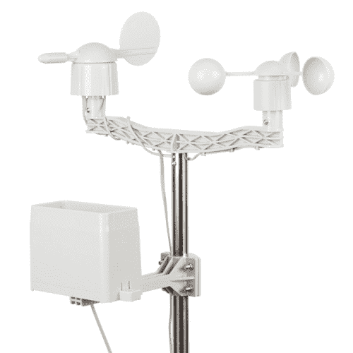](https://www.sparkfun.com/products/15901) 

将**添加到您的[购物车](https://www.sparkfun.com/cart)中！**

### [气象仪套件](https://www.sparkfun.com/products/15901)

[In stock](https://learn.sparkfun.com/static/bubbles/ "in stock") SEN-15901

无论你是在测量风速、方向还是降雨，这都是你的气象仪。

$79.959[Favorited Favorite](# "Add to favorites") 52[Wish List](# "Add to wish list")** **这些仪表允许你通过 RJ-11 连接轻松测量**风速**、**风向**和**降雨量**。

### 所需材料

要学习本项目教程，您需要以下材料:

*   1 个气象计套件
*   1x [十字螺丝刀](https://www.sparkfun.com/products/14234)
*   1x [平头螺丝刀(可选)](https://www.sparkfun.com/products/14234)

### 推荐阅读

如果您不熟悉以下概念，我们建议您在继续之前查看这些教程。

 [### 模拟与数字](https://learn.sparkfun.com/tutorials/analog-vs-digital) This tutorial covers the concept of analog and digital signals, as they relate to electronics.[Favorited Favorite](# "Add to favorites") 66 [### 数字逻辑](https://learn.sparkfun.com/tutorials/digital-logic) A primer on digital logic concepts in hardware and software.[Favorited Favorite](# "Add to favorites") 33 [### Arduino 中的数据类型](https://learn.sparkfun.com/tutorials/data-types-in-arduino) Learn about the common data types and what they signify in the Arduino programming environment.[Favorited Favorite](# "Add to favorites") 38 [### 簧片开关连接指南](https://learn.sparkfun.com/tutorials/reed-switch-hookup-guide) Magnetically-actuated reed switches are the perfect component for non-contact proximity sensors. This tutorial provides a quick overview and example hook up.[Favorited Favorite](# "Add to favorites") 11

## 硬件概述

收到仪表后，打开所有组件的包装，确保您拥有所有必需的部件。

[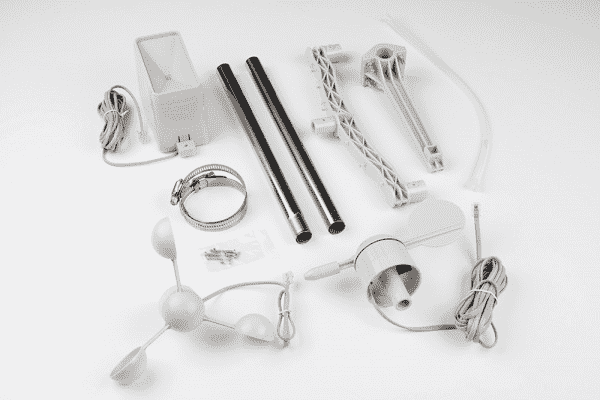](https://cdn.sparkfun.com/assets/learn_tutorials/6/8/1/WeatherMeter_Parts_included.jpg)

你应该有:

*   两(2)根金属管
*   三(3)个传感器:
    *   雨量测量器
    *   风速计
    *   风向标
*   两(2)个齿轮夹
*   一(1)个中心安装电枢
*   一(1)个侧面安装电枢
*   一(1)个袋装螺钉/螺母
*   一(1)包塑料拉链

气压计套件中的所有传感器都是[无源元件](https://www.allaboutcircuits.com/textbook/semiconductors/chpt-1/active-versus-passive-devices/)。这意味着你需要一个电压源来测量任何东西。

每个传感器都用 RJ-11 连接器端接。

### 雨量测量器

你可能已经猜到了，雨量计测量降雨量。你应该得到一个类似下图的雨量计。

[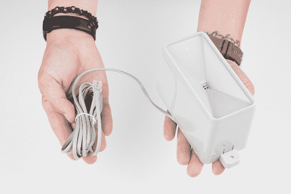](https://cdn.sparkfun.com/assets/learn_tutorials/6/8/1/RainGauge.jpg)**[Heads up!](https://learn.sparkfun.com/tutorials/weather-meter-hookup-guide#rain_gauge_level)** Depending on the version of the weather meter that you receive, the rain gauge's may look different. There may be a level bubbler and a deeper reservoir for collecting water. Don't worry, the overall functionality is the same!

[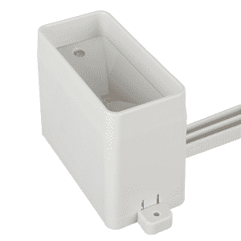](https://cdn.sparkfun.com//assets/parts/1/4/5/3/9/15901-Weather_Meter-03.jpg)

该传感器是一个[自动清空翻斗收集器](https://www.weathershack.com/static/ed-tipping-bucket-rain-gauge.html)。这意味着，每有**0.011”(0.2794 毫米)的雨水**落入传感器，水桶就会倾斜，将水倒掉，并关闭一个瞬时触点。

可以使用中断引脚或数字计数器来测量瞬时开关的闭合。RJ-11 连接器的中心导体连接到压力表的开关上。

### 风速计

风速计测量风速。

风移动风速计上的杯状物，反过来旋转封闭的磁铁。磁体在每次旋转时关闭簧片开关，这反映在输出上。您可以使用微控制器上的数字计数器或中断引脚，在 RJ-11 连接器的两个内部导体(引脚 2 和 3)上进行测量。为了将其转换为功能风速，使用 **1.492 mph = 1 开关闭合/秒**的转换。对于那些在公制土地，这是 **2.4 公里/小时**。

### 风向标

风向标指示风吹的方向。

[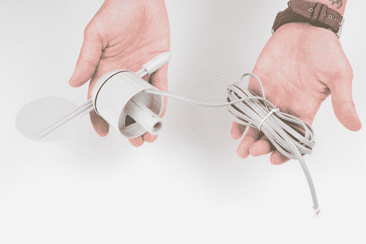](https://cdn.sparkfun.com/assets/learn_tutorials/6/8/1/WindVane.jpg)

虽然你可能认为用电子元件来表示这很简单，但实际上这是三种规格中最复杂的。叶片内部有八个开关，每个开关都有自己独特的电阻。

[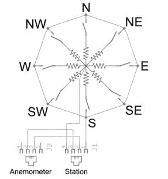](https://cdn.sparkfun.com/assets/learn_tutorials/6/8/1/WindVane_Switches.JPG)*The eight switches and their respective resistors internally on the wind vane.*

当风向标旋转时，磁铁闭合簧片开关，并且由于它们彼此接近，可以一次闭合两个。使用外部电阻，可以创建一个分压器。使用微控制器上的模数转换器测量电压输出，可以确定风向标指向的方向。

由于电压输出取决于所用外部电阻值，因此没有一个通用的转换函数。有关如何计算的示例，请参考[资源中链接的数据手册，以及电表的进一步说明](https://learn.sparkfun.com/tutorials/weather-meter-hookup-guide#resources-and-going-further)。

因为风向标输出的值是基于度数的，所以理论上，你可以用任何值代表任何方向。但是，为了便于使用，我们建议将 0 度的值表示为北。在风向标的四个侧面还有非常小的、几乎看不见的方向指示器。如果您选择不同的值来指示方向，请务必相应地标记。安装和定位气象计时，确保任何方向标记都指向正确的方向。

请注意风向标“指向”风吹向的方向**。**

## 硬件装配

气象计是一个很容易组装的工具，只需要机械连接就可以了。

### 电枢

首先，找到两根金属管，将它们滑动到一起。

[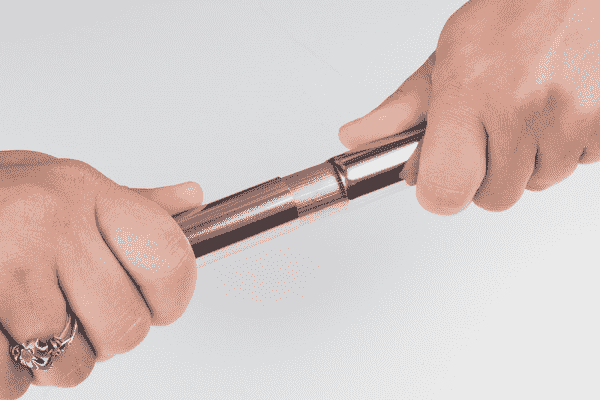](https://cdn.sparkfun.com/assets/learn_tutorials/6/8/1/Assemble_tubes.jpg)

接下来，将电枢添加到管组的顶部。确保电枢上的小块与管中的槽口对齐。

[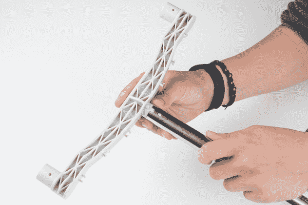](https://cdn.sparkfun.com/assets/learn_tutorials/6/8/1/Armature_attachment.jpg)

使用随附的螺钉和螺母将其锁定到位。

### 风速计

接下来，我们将把风速计安装在电枢的一侧。

风速计上有一个小块，与电枢上的凹槽相匹配。这将有助于固定风速计，并只允许传感器安装在一个方向。

[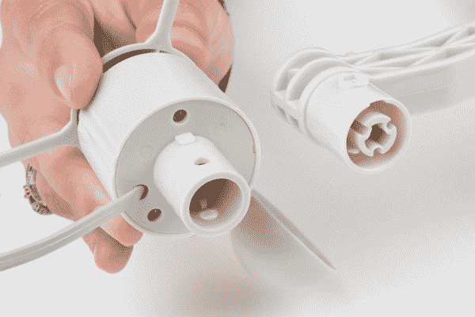](https://cdn.sparkfun.com/assets/learn_tutorials/6/8/1/Anemometer_alignment.jpg)

将风速计滑到电枢上，直到它锁定到位。

[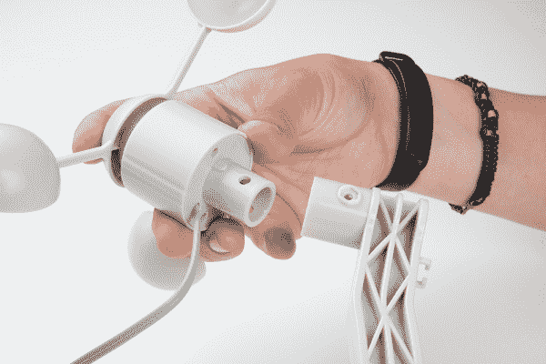](https://cdn.sparkfun.com/assets/learn_tutorials/6/8/1/Anemometer_attachment.jpg)

使用随附的螺钉和螺母将传感器锁定到位(确保拧紧)。

[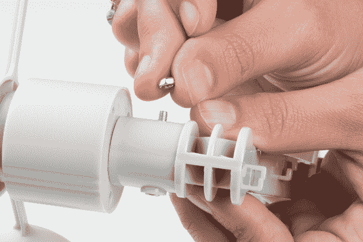](https://cdn.sparkfun.com/assets/learn_tutorials/6/8/1/Anemometer_screw_attachment.jpg)

### 风向标

要安装风向标，您将遵循与安装风速计相同的程序。

对齐传感器和电枢，并将风向标推入到位。

[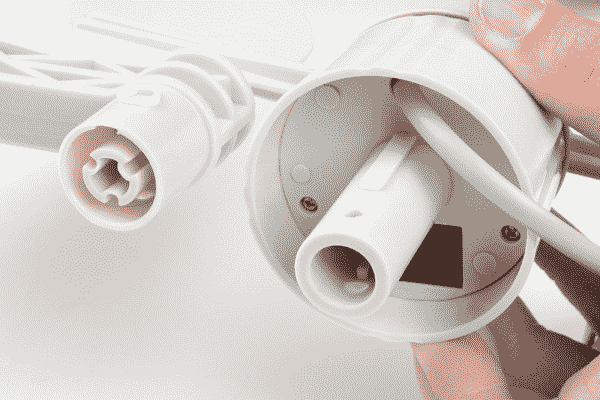](https://cdn.sparkfun.com/assets/learn_tutorials/6/8/1/Wind_vane_alignment.jpg)

再次使用螺钉和螺母将传感器固定到位。

[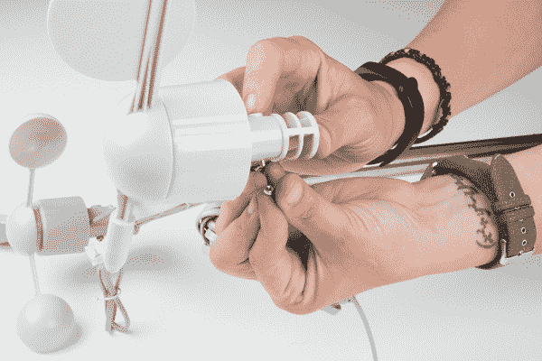](https://cdn.sparkfun.com/assets/learn_tutorials/6/8/1/vane_screw_attachment.jpg)

### 雨量测量器

为了安装雨量计，我们还需要一个辅助支架。这是用来保持雨量计远离其他传感器，以确保它可以获得准确的测量。如果雨量计安装在风向标或风速计下方，它们可以阻挡雨水进入雨量计或抵消径流造成的读数。

使用随附的螺钉和螺母将雨量计电枢安装到金属管上。这两半用中间的金属管拼在一起。一旦你把它放在雨量计不会碰到风速计和风向标的地方，拧紧它。

[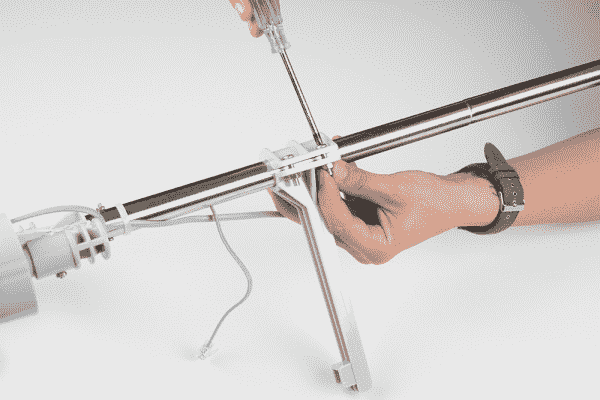](https://cdn.sparkfun.com/assets/learn_tutorials/6/8/1/Rain_gauge_Armature_Attachment.jpg)

同样，雨量计有缺口，以确保它紧贴电枢安装。

[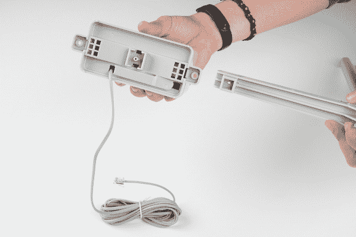](https://cdn.sparkfun.com/assets/learn_tutorials/6/8/1/Rain_Gauge_Alignment.jpg)

把这些排好，把雨量计推到位。

[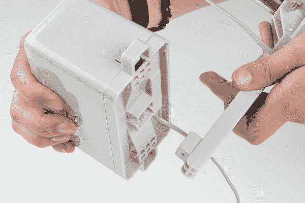](https://cdn.sparkfun.com/assets/learn_tutorials/6/8/1/Rain_Gauge_Attachment.jpg)

使用剩下的一个小螺钉，将雨量计固定到位。

[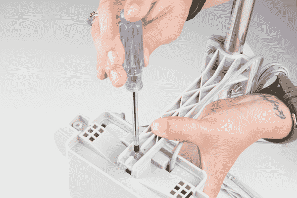](https://cdn.sparkfun.com/assets/learn_tutorials/6/8/1/AttachingRainGauge.jpg)

雨量计有两个凸耳，两侧都有孔。这些可用于将传感器安装在不同的表面上，如屋顶或栅栏上。

### 电线管理

如果你已经走了这么远，恭喜你！现在是最简单的部分——电缆管理。幸运的是，这并不像某些布线项目那样困难。

解开风速计和风向标上的电线。在电枢的底部，你会看到固定这些电线的夹子。将电线从每个传感器滑入这些传感器。

[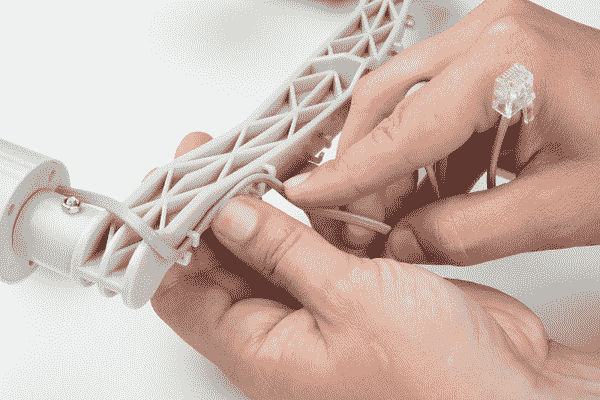](https://cdn.sparkfun.com/assets/learn_tutorials/6/8/1/Wire_Management.jpg)

一旦你把这两根电缆都插上，你会注意到风速表电缆比风向标短得多。正如我们在硬件概述中提到的，风速计和风向标共享风速计开关导线。你需要将风速表电缆插入风向标。

[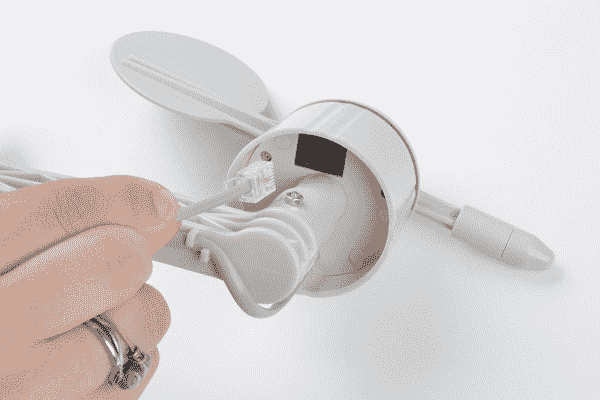](https://cdn.sparkfun.com/assets/learn_tutorials/6/8/1/Anemometer_plugIn_to_Vane.jpg)

将剩余的电线穿过金属管，并用随附的拉链固定。这将防止风把你的电线从你相关的电子设备中拽出来。

成功！你现在有一个组装好的气象计了！确保你的雨量计远离风速计和风向标，并且在组装过程中没有移动。您的气象计看起来将类似于下图。

[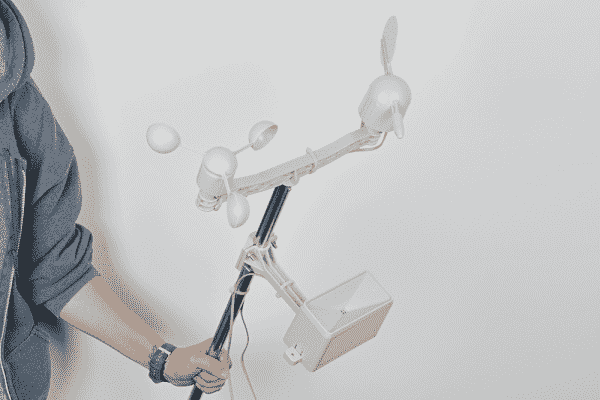](https://cdn.sparkfun.com/assets/learn_tutorials/6/8/1/Angled_Assembled_Meters.jpg)

你现在可以安装它，把它连接到各种电子设备上，或者只是在战斗中把它当作一把即兴的光剑。

### 安装血糖仪(可选)

现在你已经组装好了你的仪表，你需要把它放在有天气的地方！您可以使用附带的齿轮夹来帮助安装和固定您的血糖仪。

为了演示如何使用齿轮夹，我们将齿轮夹套在仪表和一根 PVC 管上。然后用平头螺丝刀拧紧齿轮夹。

[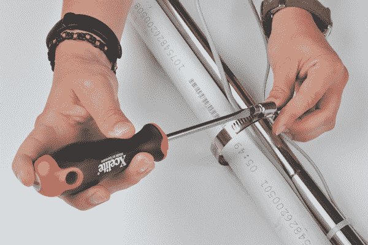](https://cdn.sparkfun.com/assets/learn_tutorials/6/8/1/Mounting_Hardware.jpg)

请记住，解决这个问题有许多不同的方法。您将需要找到一个安装解决方案，专门为您的应用。

## 资源和更进一步

现在你已经成功地组装好了你的气象仪，是时候把它整合到你自己的项目中了！

要了解更多关于气象计的信息，请查看下面的参考资料。

*   数据表
    *   SEN-15901 -气象计的最新数据表。整体功能与 SEN-08942 相同。唯一不同的是雨量计的[外观。如果你有兴趣，点击这个链接！](https://learn.sparkfun.com/tutorials/weather-meter-hookup-guide)
    *   [SEN-08942](https://cdn.sparkfun.com/assets/8/4/c/d/6/Weather_Sensor_Assembly_Updated.pdf)

你的下一个项目需要一些灵感吗？查看一些利用气象计的教程:

 [### 无线连接到地下的气象站](https://learn.sparkfun.com/tutorials/weather-station-wirelessly-connected-to-wunderground) Build your own open-source, official Wunderground weather station that connects over WiFi via an Electric Imp.[Favorited Favorite](# "Add to favorites") 32 [### 光子天气防护罩连接指南 V11](https://learn.sparkfun.com/tutorials/photon-weather-shield-hookup-guide-v11) Create Internet-connected weather projects with the SparkFun Weather Shield for the Photon.[Favorited Favorite](# "Add to favorites") 3 [### Arduino 天气防护罩连接指南 V12](https://learn.sparkfun.com/tutorials/arduino-weather-shield-hookup-guide-v12) Read humidity, pressure and luminosity quickly and easily. Add wind speed, direction and rain gauge for full weather station capabilities.[Favorited Favorite](# "Add to favorites") 13 [### ESP32 环境传感器屏蔽连接指南](https://learn.sparkfun.com/tutorials/esp32-environment-sensor-shield-hookup-guide) SparkFun's ESP32 Environment Sensor Shield provides sensors and hookups for monitoring environmental conditions. This tutorial will show you how to connect your sensor suite to the Internet and post weather data online.[Favorited Favorite](# "Add to favorites") 1**