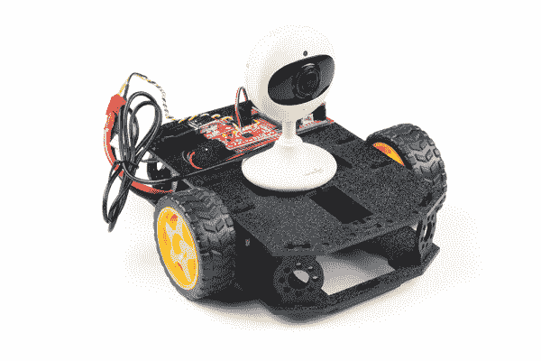

# WiFi 控制的机器人

> 原文：<https://learn.sparkfun.com/tutorials/wifi-controlled-robot>

## 介绍

本教程将向您展示如何构建一个互联网控制的机器人，并向由 [ESP32 Thing](https://www.sparkfun.com/products/13907) 托管的自定义网站提供实时视频流。只需一点点黑客技术，你就可以定制机器人来创建你自己的云台摄像机，甚至可以远程控制的 Nerf 哨兵枪！

该项目围绕[影子底盘](https://www.sparkfun.com/products/13301)展开，由 [ESP32 东西](https://www.sparkfun.com/products/13907)和[串行控制电机驱动器](https://www.sparkfun.com/products/13911)控制。

### 所需材料

要构建这个项目，您需要以下内容: